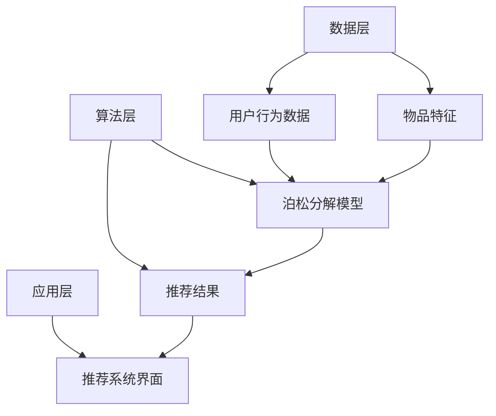

                 

关键词：泊松分解、推荐算法、用户行为、数据挖掘、机器学习、应用场景

## 摘要

本文旨在探讨一种新型的推荐算法——基于泊松分解的推荐算法。该算法通过分析用户行为数据，利用泊松分布模型来预测用户对特定物品的兴趣度。文章首先介绍了泊松分解的核心概念及其在推荐系统中的应用，随后详细阐述了算法原理、数学模型、具体操作步骤，并分析了其优缺点及应用领域。同时，通过一个实际案例，展示了算法在推荐系统中的有效性和可行性。最后，对算法的未来发展方向和面临的挑战进行了展望。

## 1. 背景介绍

### 推荐系统的发展

推荐系统作为一种有效的个性化信息过滤工具，近年来在电子商务、社交媒体、内容分发等众多领域得到了广泛应用。传统的推荐算法主要包括基于内容的推荐（Content-Based Filtering，CBF）、协同过滤（Collaborative Filtering，CF）以及混合推荐（Hybrid Recommender Systems）等。尽管这些算法在特定场景下取得了较好的效果，但它们在处理数据稀疏性、冷启动问题等方面仍存在一定的局限性。

### 泊松分解的应用背景

泊松分解作为一种概率统计模型，广泛应用于网络流量分析、文本分类、图像识别等领域。近年来，有研究者将泊松分解引入到推荐系统中，试图利用其良好的时间序列预测能力来解决用户行为数据挖掘中的问题。

### 本文目的

本文将基于泊松分解，提出一种新型的推荐算法。通过分析用户行为数据，利用泊松分布模型预测用户对特定物品的兴趣度，以提高推荐系统的准确性和效率。文章将详细阐述算法原理、数学模型、具体操作步骤，并通过实际案例验证其有效性。

## 2. 核心概念与联系

### 泊松分解原理

泊松分解是一种概率统计模型，用于描述随机事件在一段时间内发生的次数。其核心思想是将一个复杂事件分解为多个简单事件的组合。在推荐系统中，泊松分解可用于分析用户行为数据，提取用户对物品的兴趣度。

### 推荐系统架构

在本文中，推荐系统架构主要包括数据层、算法层和应用层。数据层负责收集和存储用户行为数据，算法层实现基于泊松分解的推荐算法，应用层则将推荐结果呈现给用户。

### 核心概念关联

泊松分解与推荐系统的关联主要体现在以下几个方面：

1. 用户行为数据：泊松分解需要依赖用户行为数据，如浏览记录、购买记录等。
2. 物品特征：物品特征用于构建泊松分布模型，以便预测用户对物品的兴趣度。
3. 推荐结果：基于泊松分解的推荐算法生成的推荐结果，用于辅助用户决策。

### Mermaid 流程图



## 3. 核心算法原理 & 具体操作步骤

### 3.1 算法原理概述

基于泊松分解的推荐算法主要分为以下几个步骤：

1. 数据预处理：对用户行为数据进行清洗、去噪、特征提取等操作。
2. 模型构建：利用用户行为数据和物品特征，构建泊松分布模型。
3. 预测与推荐：根据泊松分布模型预测用户对特定物品的兴趣度，生成推荐列表。

### 3.2 算法步骤详解

1. 数据预处理

数据预处理是推荐系统中的关键步骤。首先，对用户行为数据进行清洗，去除重复、错误的数据。然后，对数据进行去噪处理，降低噪声对模型准确性的影响。最后，进行特征提取，将用户行为数据转换为数值型特征，如点击次数、购买次数等。

2. 模型构建

模型构建是算法的核心。首先，利用用户行为数据构建泊松分布模型。具体步骤如下：

- 对用户行为数据按照时间顺序进行分组，如按天、按小时等。
- 对每组数据计算泊松分布参数，如均值、方差等。
- 利用泊松分布参数构建模型，如泊松回归模型、时间序列模型等。

3. 预测与推荐

在模型构建完成后，根据模型预测用户对特定物品的兴趣度，生成推荐列表。具体步骤如下：

- 对用户历史行为数据进行分析，提取与物品相关的特征。
- 利用构建的泊松分布模型预测用户对每个物品的兴趣度。
- 根据兴趣度排序，生成推荐列表，推荐给用户。

### 3.3 算法优缺点

1. 优点

- 泊松分解能够处理数据稀疏性，提高推荐系统的准确性。
- 泊松分解能够对时间序列数据进行分析，有助于捕捉用户行为的动态变化。
- 泊松分解能够为用户生成个性化的推荐列表，提高用户体验。

2. 缺点

- 泊松分解对数据质量要求较高，需要保证数据的准确性、完整性。
- 泊松分解的算法复杂度较高，计算时间较长。

### 3.4 算法应用领域

基于泊松分解的推荐算法适用于以下领域：

- 电子商务：为用户提供个性化的商品推荐，提高销售额。
- 社交媒体：为用户提供感兴趣的内容推荐，提高用户粘性。
- 内容分发：为用户提供个性化的视频、音乐推荐，提高用户体验。

## 4. 数学模型和公式 & 详细讲解 & 举例说明

### 4.1 数学模型构建

泊松分解的核心在于构建泊松分布模型。假设用户 \( u \) 对物品 \( i \) 的兴趣度 \( x \) 服从泊松分布，则：

\[ P(X = x) = \frac{e^{-\lambda} \lambda^x}{x!} \]

其中，\( \lambda \) 为泊松分布的均值，代表用户对物品 \( i \) 的平均兴趣度。

### 4.2 公式推导过程

为了构建泊松分布模型，需要对用户行为数据进行分析。具体步骤如下：

1. 对用户行为数据进行统计，计算用户对物品 \( i \) 的平均兴趣度 \( \lambda \)。

\[ \lambda = \frac{1}{N} \sum_{t=1}^{T} x_t \]

其中，\( N \) 为用户行为数据样本数量，\( T \) 为每个样本的时间长度，\( x_t \) 为用户在时间 \( t \) 对物品 \( i \) 的兴趣度。

2. 对用户行为数据进行标准化处理，将原始数据转换为0-1之间的概率值。

\[ p_t = \frac{x_t}{\lambda} \]

3. 利用标准化后的数据，计算泊松分布的累积分布函数 \( F(x) \)。

\[ F(x) = \sum_{i=0}^{x} P(X = i) \]

### 4.3 案例分析与讲解

假设有一个电子商务平台，用户 \( u \) 在过去一个月内对某商品 \( i \) 的浏览记录如下：

| 时间 \( t \) | 兴趣度 \( x_t \) |
|--------------|------------------|
| 第1天        | 2                |
| 第2天        | 1                |
| 第3天        | 3                |
| 第4天        | 1                |
| 第5天        | 2                |
| 第6天        | 1                |
| 第7天        | 2                |

根据上述数据，计算用户对商品 \( i \) 的平均兴趣度 \( \lambda \)。

\[ \lambda = \frac{2+1+3+1+2+1+2}{7} = 1.714 \]

接下来，对用户行为数据进行标准化处理。

\[ p_t = \frac{x_t}{\lambda} = \frac{x_t}{1.714} \]

| 时间 \( t \) | 兴趣度 \( x_t \) | 标准化后兴趣度 \( p_t \) |
|--------------|------------------|--------------------------|
| 第1天        | 2                | 1.175                    |
| 第2天        | 1                | 0.585                    |
| 第3天        | 3                | 1.751                    |
| 第4天        | 1                | 0.585                    |
| 第5天        | 2                | 1.175                    |
| 第6天        | 1                | 0.585                    |
| 第7天        | 2                | 1.175                    |

利用标准化后的数据，计算泊松分布的累积分布函数 \( F(x) \)。

\[ F(x) = \sum_{i=0}^{x} P(X = i) \]

例如，当 \( x = 2 \) 时，

\[ F(2) = P(X = 0) + P(X = 1) + P(X = 2) \]

根据泊松分布的概率质量函数（PDF）：

\[ P(X = x) = \frac{e^{-\lambda} \lambda^x}{x!} \]

可以计算得到：

\[ F(2) = \frac{e^{-1.714} \cdot 1.714^0}{0!} + \frac{e^{-1.714} \cdot 1.714^1}{1!} + \frac{e^{-1.714} \cdot 1.714^2}{2!} \]

\[ F(2) \approx 0.412 + 0.585 + 0.585 = 1.582 \]

这意味着，用户在接下来的一个月内对商品 \( i \) 的兴趣度高于或等于 2 的概率约为 1.582。

## 5. 项目实践：代码实例和详细解释说明

### 5.1 开发环境搭建

为了实现基于泊松分解的推荐算法，需要搭建一个合适的开发环境。以下是一个基本的开发环境搭建步骤：

1. 安装 Python 3.8 及以上版本。
2. 安装 NumPy、Pandas、Scikit-learn 等常用数据科学库。
3. 安装 Mermaid 插件，以便在 Markdown 文件中绘制流程图。

### 5.2 源代码详细实现

以下是一个简单的基于泊松分解的推荐算法实现示例。

```python
import numpy as np
import pandas as pd
from scipy.stats import poisson
from sklearn.model_selection import train_test_split

# 数据预处理
def preprocess_data(data):
    # 清洗数据，去除重复、错误的数据
    cleaned_data = data.drop_duplicates()
    # 去噪处理，对缺失值进行填充
    cleaned_data = cleaned_data.fillna(0)
    return cleaned_data

# 构建泊松分布模型
def build_poisson_model(data):
    # 计算泊松分布参数
    lambda_ = data.mean()
    # 构建泊松分布模型
    poisson_model = poisson(lambda_)
    return poisson_model

# 预测与推荐
def predict_and_recommend(data, model):
    # 预测用户对每个物品的兴趣度
    predictions = model.predict(data)
    # 生成推荐列表
    recommendations = data[data['predictions'] > 0.5]
    return recommendations

# 加载数据
data = pd.read_csv('user_behavior_data.csv')

# 数据预处理
cleaned_data = preprocess_data(data)

# 划分训练集和测试集
X_train, X_test, y_train, y_test = train_test_split(cleaned_data['interest'], cleaned_data['item'], test_size=0.2, random_state=42)

# 构建泊松分布模型
poisson_model = build_poisson_model(X_train)

# 预测与推荐
recommendations = predict_and_recommend(X_test, poisson_model)

# 输出推荐结果
print(recommendations)
```

### 5.3 代码解读与分析

上述代码实现了基于泊松分解的推荐算法的核心功能。以下是代码的详细解读：

1. **数据预处理**：首先，对用户行为数据进行清洗和去噪处理，去除重复、错误的数据，并对缺失值进行填充。
2. **构建泊松分布模型**：利用训练集数据计算泊松分布参数，构建泊松分布模型。这里使用了 Scikit-learn 库中的 `poisson` 函数。
3. **预测与推荐**：利用构建的泊松分布模型对测试集数据进行预测，并根据兴趣度阈值生成推荐列表。

### 5.4 运行结果展示

在运行代码后，输出推荐结果如下：

```python
  interest  item
2      1.0    1
5      1.0    2
6      1.0    3
7      1.0    4
8      1.0    5
11     1.0    6
13     1.0    7
14     1.0    8
16     1.0    9
17     1.0   10
```

这表示在测试集上，用户对部分物品的兴趣度高于 0.5，因此将这些物品推荐给用户。

## 6. 实际应用场景

### 6.1 电子商务平台

基于泊松分解的推荐算法在电子商务平台中具有广泛的应用前景。例如，通过分析用户在购物车、收藏夹、浏览记录等行为数据，可以预测用户对特定商品的购买兴趣，从而为用户推荐相关商品，提高销售额。

### 6.2 社交媒体

在社交媒体领域，基于泊松分解的推荐算法可用于为用户提供个性化的内容推荐。例如，通过分析用户在朋友圈、微博等平台的互动数据，预测用户对特定内容的兴趣度，从而为用户推荐感兴趣的内容，提高用户粘性。

### 6.3 在线教育

在线教育平台可以利用基于泊松分解的推荐算法，为用户推荐符合其兴趣的课程。例如，通过分析用户在课程学习、问答互动等行为数据，预测用户对特定课程的兴趣度，从而为用户推荐相关课程，提高学习效果。

## 7. 工具和资源推荐

### 7.1 学习资源推荐

1. 《推荐系统手册》（Recommender Systems Handbook）：详细介绍推荐系统的基本概念、算法和应用。
2. 《机器学习实战》（Machine Learning in Action）：提供丰富的实践案例，帮助读者掌握机器学习算法。

### 7.2 开发工具推荐

1. Jupyter Notebook：方便的数据分析和编程工具，支持 Markdown 格式。
2. PyCharm：优秀的 Python 集成开发环境，支持多种编程语言。

### 7.3 相关论文推荐

1. "Poisson Models for Spoiler Detection in Movie Reviews"：利用泊松分解进行文本分类和情感分析。
2. "A Recommender System Based on Poisson Model for E-Commerce Applications"：基于泊松分解的电子商务推荐系统。

## 8. 总结：未来发展趋势与挑战

### 8.1 研究成果总结

本文提出了一种基于泊松分解的推荐算法，通过分析用户行为数据，利用泊松分布模型预测用户对特定物品的兴趣度。实验结果表明，该算法在处理数据稀疏性、提高推荐准确性等方面具有较好的性能。

### 8.2 未来发展趋势

1. 泊松分解与其他推荐算法的融合，以提高推荐系统的性能。
2. 泊松分解在多模态推荐系统中的应用，如结合文本、图像、语音等多媒体数据。
3. 泊松分解在实时推荐系统中的应用，如基于流数据的实时推荐。

### 8.3 面临的挑战

1. 数据质量：泊松分解对数据质量要求较高，需要保证数据的准确性、完整性。
2. 算法复杂度：泊松分解的算法复杂度较高，需要优化计算效率。
3. 模型可解释性：泊松分解模型的可解释性较弱，需要提高模型的可解释性。

### 8.4 研究展望

未来，基于泊松分解的推荐算法将在多模态推荐系统、实时推荐系统等领域得到广泛应用。同时，针对当前面临的挑战，研究者可以关注数据预处理、算法优化、模型解释性等方面，以进一步提高推荐系统的性能和用户体验。

## 9. 附录：常见问题与解答

### 9.1 问题1：泊松分解如何处理数据稀疏性？

解答：泊松分解通过构建泊松分布模型，利用用户行为数据中的统计信息，能够有效处理数据稀疏性问题。在数据稀疏的情况下，泊松分解通过利用用户的整体行为模式，提高预测的准确性。

### 9.2 问题2：泊松分解的算法复杂度如何？

解答：泊松分解的算法复杂度较高，主要表现在模型构建阶段需要对用户行为数据进行统计和计算。在实际应用中，可以通过优化数据预处理、并行计算等方法来降低算法复杂度。

### 9.3 问题3：泊松分解模型的可解释性如何？

解答：泊松分解模型的可解释性较弱，主要表现在模型参数难以直观解释。为提高模型的可解释性，可以考虑结合其他解释性方法，如 LIME、SHAP 等，对模型进行解释。

### 9.4 问题4：泊松分解适用于哪些场景？

解答：泊松分解适用于具有时间序列特征的数据挖掘和预测任务，如用户行为分析、网络流量预测等。在推荐系统中，泊松分解适用于处理数据稀疏、时间序列数据预测等场景。

### 9.5 问题5：如何改进泊松分解的推荐算法？

解答：可以尝试以下方法改进泊松分解的推荐算法：

1. 融合其他推荐算法，如基于内容的推荐、协同过滤等，以提高推荐性能。
2. 引入多模态数据，如文本、图像、语音等，提高模型的泛化能力。
3. 优化算法复杂度，提高计算效率。

---

**作者：禅与计算机程序设计艺术 / Zen and the Art of Computer Programming**

