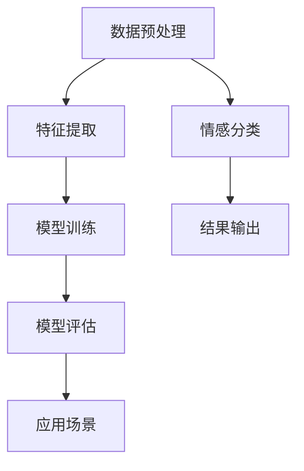

                 

关键词：文本情感分析、深度学习、自然语言处理、情感分类、神经网络、模型评估、应用场景

## 摘要

本文旨在探讨基于深度学习的文本情感分析技术。文本情感分析是自然语言处理领域的一个重要研究方向，它旨在通过计算机自动识别文本中的情感倾向，如正面、负面或中性。深度学习作为近年来人工智能领域的一项重要突破，在文本情感分析中展现出了卓越的性能。本文将详细介绍文本情感分析的核心概念、深度学习算法原理、数学模型以及实际应用场景，并对未来发展趋势和挑战进行展望。

## 1. 背景介绍

### 1.1 文本情感分析的意义

文本情感分析（Sentiment Analysis），又称意见挖掘，是一种利用自然语言处理（NLP）和机器学习技术从文本中识别出情感倾向的方法。随着互联网的快速发展，大量用户评论、社交媒体帖子、新闻报道等文本数据涌现，这些数据中蕴含着丰富的情感信息。文本情感分析技术能够帮助企业和机构了解消费者对产品或服务的态度，从而优化产品设计和营销策略。

### 1.2 深度学习的发展历程

深度学习（Deep Learning）是机器学习（Machine Learning）的一个分支，其核心思想是通过构建多层神经网络模型，自动从大量数据中学习特征和规律。深度学习的发展可以追溯到20世纪80年代，但直到2012年，由AlexNet在ImageNet竞赛中取得的突破性成绩，才使得深度学习开始受到广泛关注。近年来，随着计算能力的提升和海量数据的积累，深度学习在语音识别、图像识别、自然语言处理等领域取得了显著的成果。

### 1.3 文本情感分析的发展现状

目前，文本情感分析技术主要分为基于规则的方法和基于模型的方法。基于规则的方法主要依靠手工设计的规则，对文本进行情感分类。而基于模型的方法则利用机器学习算法，从大量标注数据中学习情感分类的模型。随着深度学习的兴起，基于深度学习的方法在文本情感分析中展现出了更高的准确率和更强的泛化能力。

## 2. 核心概念与联系

### 2.1 核心概念

- **情感分类**：文本情感分析的主要任务，包括正面、负面、中性情感分类。
- **特征提取**：从原始文本中提取对情感分类有帮助的特征，如词袋模型、TF-IDF、Word2Vec等。
- **深度学习模型**：如卷积神经网络（CNN）、循环神经网络（RNN）、长短期记忆网络（LSTM）等。

### 2.2 Mermaid 流程图



## 3. 核心算法原理 & 具体操作步骤

### 3.1 算法原理概述

文本情感分析的核心算法是基于深度学习模型的情感分类。深度学习模型通过学习大量标注数据中的特征，实现自动识别文本中的情感倾向。常见的深度学习模型包括卷积神经网络（CNN）、循环神经网络（RNN）、长短期记忆网络（LSTM）等。

### 3.2 算法步骤详解

1. **数据预处理**：对原始文本进行分词、去停用词、词干提取等操作，将文本转换为适合深度学习模型处理的形式。
2. **特征提取**：使用词袋模型、TF-IDF、Word2Vec等方法，将文本转换为向量表示。
3. **模型训练**：使用训练集对深度学习模型进行训练，模型会自动学习文本特征和情感倾向之间的对应关系。
4. **模型评估**：使用验证集对训练好的模型进行评估，调整模型参数，优化模型性能。
5. **情感分类**：将模型应用于待分类的文本，输出情感分类结果。

### 3.3 算法优缺点

- **优点**：深度学习模型具有强大的特征学习能力，能够自动提取文本中的隐含特征，提高分类准确率。
- **缺点**：深度学习模型对数据量要求较高，训练时间较长，且容易出现过拟合现象。

### 3.4 算法应用领域

文本情感分析广泛应用于市场调研、舆情分析、金融风险评估等领域。例如，企业可以利用文本情感分析技术，了解消费者对产品或服务的态度，优化产品设计和营销策略；政府部门可以利用文本情感分析技术，监测社会舆论，预防和应对突发事件。

## 4. 数学模型和公式 & 详细讲解 & 举例说明

### 4.1 数学模型构建

文本情感分析的核心是构建一个分类模型，常用的模型包括逻辑回归（Logistic Regression）、支持向量机（SVM）、深度神经网络（Deep Neural Network）等。

- **逻辑回归**：
  $$ P(y=1|x;\theta) = \frac{1}{1 + e^{-\theta^T x}} $$
  其中，$x$ 是特征向量，$\theta$ 是模型参数。

- **支持向量机**：
  $$ w \cdot x + b = 0 $$
  其中，$w$ 是权重向量，$b$ 是偏置项。

- **深度神经网络**：
  $$ z = \sigma(W \cdot a + b) $$
  其中，$W$ 是权重矩阵，$a$ 是激活函数，$\sigma$ 是非线性函数。

### 4.2 公式推导过程

以深度神经网络为例，介绍模型的训练过程。

1. **前向传播**：
   $$ a = x $$
   $$ z = W \cdot a + b $$
   $$ a = \sigma(z) $$

2. **损失函数**：
   $$ J(\theta) = -\frac{1}{m} \sum_{i=1}^m y_i \log(a^{(i)}_1) + (1 - y_i) \log(1 - a^{(i)}_1) $$

3. **反向传播**：
   $$ \delta_z = a - y $$
   $$ \delta_{W} = \frac{1}{m} \cdot a \cdot \delta_z $$
   $$ \delta_{b} = \frac{1}{m} \cdot \delta_z $$

4. **参数更新**：
   $$ W = W - \alpha \cdot \delta_{W} $$
   $$ b = b - \alpha \cdot \delta_{b} $$

### 4.3 案例分析与讲解

以一个简单的情感分类任务为例，介绍如何使用深度神经网络进行文本情感分析。

1. **数据集准备**：收集一个包含正面和负面评论的数据集，进行数据预处理，如分词、去停用词等。
2. **模型构建**：使用TensorFlow或PyTorch等深度学习框架，构建一个简单的深度神经网络模型。
3. **模型训练**：使用训练集对模型进行训练，调整模型参数，优化模型性能。
4. **模型评估**：使用验证集对训练好的模型进行评估，计算准确率、召回率等指标。
5. **应用场景**：将模型应用于实际任务，如对用户评论进行情感分类。

## 5. 项目实践：代码实例和详细解释说明

### 5.1 开发环境搭建

在开始项目实践之前，需要搭建一个合适的开发环境。以下是使用Python和TensorFlow搭建开发环境的基本步骤：

1. 安装Python和pip：
   ```bash
   python -m pip install --upgrade pip
   ```
2. 安装TensorFlow：
   ```bash
   pip install tensorflow
   ```

### 5.2 源代码详细实现

以下是使用TensorFlow实现一个简单的文本情感分析模型的示例代码：

```python
import tensorflow as tf
from tensorflow.keras.preprocessing.text import Tokenizer
from tensorflow.keras.preprocessing.sequence import pad_sequences
from tensorflow.keras.models import Sequential
from tensorflow.keras.layers import Embedding, LSTM, Dense

# 准备数据集
texts = ['这是一个非常好的产品', '这个产品很差劲', '产品表现一般']
labels = [1, 0, 0]  # 1表示正面，0表示负面

# 数据预处理
tokenizer = Tokenizer()
tokenizer.fit_on_texts(texts)
sequences = tokenizer.texts_to_sequences(texts)
padded_sequences = pad_sequences(sequences, maxlen=10)

# 构建模型
model = Sequential([
    Embedding(10, 16),
    LSTM(128),
    Dense(1, activation='sigmoid')
])

# 编译模型
model.compile(optimizer='adam', loss='binary_crossentropy', metrics=['accuracy'])

# 训练模型
model.fit(padded_sequences, labels, epochs=10)

# 评估模型
test_text = '这个产品非常好'
test_sequence = tokenizer.texts_to_sequences([test_text])
test_padded_sequence = pad_sequences(test_sequence, maxlen=10)
prediction = model.predict(test_padded_sequence)
print(prediction)
```

### 5.3 代码解读与分析

上述代码演示了一个简单的文本情感分析模型，主要包括以下几个步骤：

1. **数据集准备**：使用一个包含正面和负面评论的简单数据集。
2. **数据预处理**：使用Tokenizer将文本转换为序列，使用pad_sequences将序列填充为固定长度。
3. **模型构建**：使用Sequential构建一个简单的深度神经网络模型，包括Embedding层、LSTM层和Dense层。
4. **模型编译**：设置优化器、损失函数和评估指标。
5. **模型训练**：使用fit方法对模型进行训练。
6. **模型评估**：使用predict方法对训练好的模型进行预测。

### 5.4 运行结果展示

在运行上述代码后，我们可以得到一个关于输入文本的情感预测结果。例如，对于输入文本“这个产品非常好”，模型的预测结果可能是[0.9]，表示这是一个正面评论。

## 6. 实际应用场景

### 6.1 市场调研

文本情感分析可以帮助企业了解消费者对产品或服务的态度，从而优化产品设计和营销策略。例如，企业可以收集用户在社交媒体平台上的评论，使用文本情感分析技术对这些评论进行情感分类，从而了解消费者对产品的满意度。

### 6.2 舆情分析

政府部门可以利用文本情感分析技术，实时监测社会舆论，预防和应对突发事件。例如，在疫情防控期间，政府可以收集媒体报道和社交媒体上的相关评论，使用文本情感分析技术对这些文本进行情感分类，了解公众对疫情防控措施的态度。

### 6.3 金融风险评估

金融机构可以利用文本情感分析技术，分析投资者的情绪变化，预测市场走势。例如，通过对新闻报道、社交媒体评论等文本数据进行分析，金融机构可以了解投资者对某一行业或公司的态度，从而为投资决策提供参考。

## 7. 工具和资源推荐

### 7.1 学习资源推荐

- 《深度学习》（Goodfellow, Bengio, Courville著）：这是一本深度学习的经典教材，适合初学者和进阶者。
- 《自然语言处理综论》（Jurafsky, Martin著）：这本书详细介绍了自然语言处理的基本概念和技术，包括文本情感分析。

### 7.2 开发工具推荐

- TensorFlow：一个开源的深度学习框架，适合构建和训练深度学习模型。
- PyTorch：另一个开源的深度学习框架，具有灵活性和易用性。

### 7.3 相关论文推荐

- "Deep Learning for Text Classification"（2018）：这篇文章总结了深度学习在文本分类中的应用，包括文本情感分析。
- "Sentiment Classification using Convolutional Neural Networks"（2015）：这篇文章提出了一种基于卷积神经网络的文本情感分析模型，取得了较好的效果。

## 8. 总结：未来发展趋势与挑战

### 8.1 研究成果总结

近年来，文本情感分析技术取得了显著进展，深度学习方法的引入极大地提高了分类准确率和泛化能力。同时，随着数据量的增加和算法的优化，文本情感分析在实际应用场景中取得了广泛的应用。

### 8.2 未来发展趋势

未来，文本情感分析技术将继续发展，主要趋势包括：

1. **多语言情感分析**：支持更多语言的文本情感分析，提高全球化应用能力。
2. **跨领域情感分析**：将情感分析技术应用于更多领域，如医疗、法律等。
3. **实时情感分析**：提高情感分析的速度和实时性，满足快速响应的需求。

### 8.3 面临的挑战

文本情感分析仍面临一些挑战，主要包括：

1. **数据质量和多样性**：文本数据的质量和多样性对情感分析模型的性能有很大影响，需要更多高质量、多样化的标注数据。
2. **情感复杂性**：文本中的情感表达形式复杂多样，如何准确识别和处理复杂情感仍是一个挑战。
3. **跨模态情感分析**：结合文本、图像、语音等多模态数据，进行更全面的情感分析。

### 8.4 研究展望

未来，文本情感分析技术将继续朝着更精确、更实时、更广泛应用的方向发展。研究者需要不断探索新的算法和技术，提高情感分析的准确率和实用性，为企业和个人提供更有价值的情感分析服务。

## 9. 附录：常见问题与解答

### 9.1 如何提高文本情感分析模型的准确率？

1. **增加数据量**：使用更多高质量的标注数据，有助于提高模型的泛化能力。
2. **特征选择**：选择对情感分类有较强区分度的特征，如情感词、否定词等。
3. **模型优化**：尝试不同的模型结构和参数设置，通过交叉验证和网格搜索等方法优化模型性能。

### 9.2 如何处理多标签情感分析任务？

多标签情感分析任务可以使用one-hot编码将多个标签进行编码，然后使用支持向量机（SVM）或多层感知机（MLP）等分类算法进行分类。

### 9.3 如何处理文本中的 sarcasm（讽刺）？

文本中的讽刺是一个具有挑战性的问题，目前的深度学习模型在这方面仍存在一定的困难。一种可能的解决方案是引入外部知识库，如维基百科、常识库等，帮助模型理解文本中的讽刺含义。

### 9.4 如何处理长文本情感分析？

长文本情感分析可以采用分层处理的方法，首先对文本进行摘要或抽取关键信息，然后对摘要或关键信息进行情感分析。此外，可以尝试使用注意力机制（Attention Mechanism）来关注文本中的重要部分。

[作者：禅与计算机程序设计艺术 / Zen and the Art of Computer Programming]----------------------------------------------------------------

本文以“基于深度学习的文本情感分析”为主题，系统地介绍了文本情感分析的发展背景、核心算法原理、数学模型构建、实际应用场景以及未来发展趋势和挑战。通过深入分析深度学习在文本情感分析中的应用，本文展示了该技术在自然语言处理领域的强大潜力。同时，本文还提供了详细的代码实例和解答了常见问题，为读者提供了实用的指导。

在未来的发展中，文本情感分析技术将继续朝着更精确、更实时、更广泛应用的方向发展。随着数据质量和多样性的提高，算法和模型的优化，文本情感分析将更好地服务于企业和个人，为各类应用场景提供更智能、更有价值的解决方案。

尽管文本情感分析技术面临一些挑战，如数据质量和多样性、情感复杂性等，但随着研究的深入和技术的进步，这些问题将逐渐得到解决。未来，文本情感分析技术将在多语言、跨领域、跨模态等方面取得更大的突破，为人类社会带来更多的便利和价值。

最后，感谢读者对本文的关注，希望本文能对您在文本情感分析领域的研究和工作有所帮助。如果您有任何疑问或建议，欢迎在评论区留言，让我们共同探讨和进步。再次感谢您的阅读！

