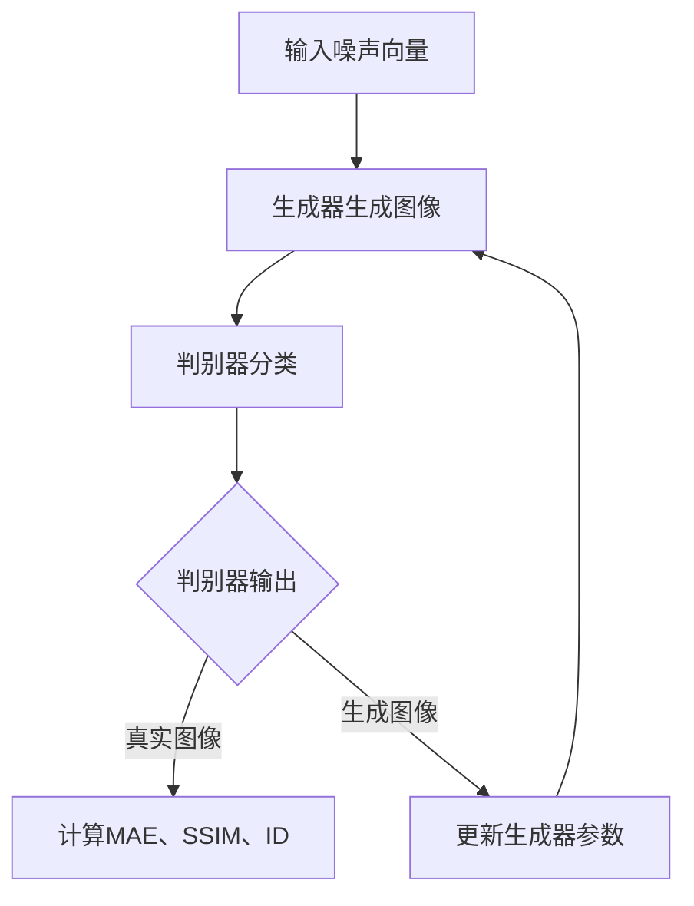

                 

关键词：生成对抗网络（GAN）、图像风格迁移、质量评估、深度学习、计算机视觉、图像处理

摘要：本文旨在探讨一种基于生成对抗网络（GAN）和质量评估的图像风格迁移方法，通过深入分析GAN的原理和应用，结合质量评估技术，为图像风格迁移提供一种高效、准确的解决方案。文章将从背景介绍、核心概念与联系、核心算法原理、数学模型与公式、项目实践、实际应用场景、工具和资源推荐、总结与展望等方面展开论述，以期为相关领域的研究者提供参考。

## 1. 背景介绍

图像风格迁移是计算机视觉领域中一个重要的研究方向，旨在将一种图像的内容和风格迁移到另一种图像中。这一技术具有广泛的应用前景，例如在艺术创作、电影制作、视频特效、图像编辑等领域。传统的图像风格迁移方法主要依赖于规则化的模型，但其在迁移效果和灵活性方面存在一定的局限性。

近年来，深度学习技术的迅速发展为图像风格迁移提供了新的思路。生成对抗网络（GAN）作为一种新型深度学习模型，其在图像生成、图像增强、图像超分辨率等任务中表现出色。GAN的核心思想是通过两个对抗网络的交互，生成具有真实感的高质量图像。在此基础上，结合质量评估技术，可以进一步提高图像风格迁移的准确性和效果。

## 2. 核心概念与联系

### 2.1 生成对抗网络（GAN）原理

生成对抗网络（GAN）由两部分组成：生成器（Generator）和判别器（Discriminator）。生成器的目标是生成与真实数据分布相似的图像，而判别器的目标是区分输入图像是真实图像还是生成图像。在训练过程中，生成器和判别器相互对抗，最终达到平衡状态。GAN的训练过程可以概括为以下几个步骤：

1. 随机生成一批噪声向量，作为生成器的输入。
2. 生成器根据噪声向量生成一批图像。
3. 判别器分别对真实图像和生成图像进行分类。
4. 根据判别器的分类结果，计算生成器和判别器的损失函数。
5. 更新生成器和判别器的参数。

通过以上步骤，生成器和判别器在训练过程中不断优化自身性能，最终生成器能够生成高质量、具有真实感的图像。

### 2.2 质量评估技术

在图像风格迁移任务中，质量评估是衡量迁移效果的重要手段。常用的质量评估方法包括：

1. 均值绝对误差（MAE）：计算生成图像和真实图像的像素值之差的平均值。
2. 结构相似性指数（SSIM）：衡量图像的结构相似性，包括亮度、对比度和结构相似性三个维度。
3. 逆失真度（ID）：通过最小化生成图像和真实图像之间的差异，评估生成图像的质量。

结合质量评估技术，可以有效地衡量图像风格迁移的效果，为优化模型提供依据。

### 2.3 Mermaid 流程图

以下是基于生成对抗网络和质量评估的图像风格迁移方法的 Mermaid 流程图：



## 3. 核心算法原理 & 具体操作步骤

### 3.1 算法原理概述

基于生成对抗网络（GAN）和质量评估的图像风格迁移方法主要包括以下几个步骤：

1. 准备训练数据集，包括原始图像和风格图像。
2. 构建生成对抗网络，包括生成器和判别器。
3. 使用训练数据集对生成对抗网络进行训练。
4. 在训练过程中，结合质量评估指标，实时调整生成器和判别器的参数。
5. 训练完成后，使用生成器将风格图像迁移到原始图像上。

### 3.2 算法步骤详解

1. 数据预处理：

   - 对原始图像和风格图像进行归一化处理，将像素值缩放到[0, 1]。
   - 将图像调整为相同的尺寸，以便于后续处理。

2. 构建生成对抗网络：

   - 生成器：采用卷积神经网络（CNN）架构，通过多层卷积和上采样操作，将噪声向量转换为具有风格图像特征的图像。
   - 判别器：采用CNN架构，通过多层卷积操作，判断输入图像是真实图像还是生成图像。

3. 训练过程：

   - 初始化生成器和判别器的参数。
   - 对于每个训练迭代，随机生成一批噪声向量，输入到生成器中，生成生成图像。
   - 将生成图像和真实图像分别输入到判别器中，计算判别器的损失函数。
   - 根据判别器的输出结果，计算生成器的损失函数。
   - 使用反向传播算法，更新生成器和判别器的参数。
   - 重复以上步骤，直至训练完成。

4. 质量评估：

   - 在训练过程中，结合MAE、SSIM、ID等质量评估指标，实时调整生成器和判别器的参数。
   - 在训练完成后，使用生成器将风格图像迁移到原始图像上，评估迁移效果。

### 3.3 算法优缺点

优点：

1. 生成对抗网络（GAN）具有良好的生成能力，可以生成高质量、具有真实感的图像。
2. 结合质量评估技术，可以有效地提高图像风格迁移的效果。
3. 图像风格迁移过程具有较好的灵活性，可以适应不同的图像风格和内容。

缺点：

1. 训练过程较为复杂，需要大量计算资源和时间。
2. GAN模型的训练过程存在不稳定的情况，可能需要采用一些技巧来提高训练效果。

### 3.4 算法应用领域

图像风格迁移方法在多个领域具有广泛的应用，包括：

1. 艺术创作：将一种艺术风格迁移到其他作品上，创造新的艺术作品。
2. 电影制作：为电影中的角色添加特定的风格，提高视觉效果。
3. 视频特效：对视频中的场景进行风格迁移，增强视觉冲击力。
4. 图像编辑：对用户上传的图片进行风格迁移，满足用户个性化需求。

## 4. 数学模型和公式 & 详细讲解 & 举例说明

### 4.1 数学模型构建

基于生成对抗网络（GAN）和质量评估的图像风格迁移方法，可以构建以下数学模型：

$$
\begin{aligned}
\min_{G}\max_{D}\mathbb{E}_{x\sim p_{data}(x)}[\log D(x)] + \mathbb{E}_{z\sim p_{z}(z)}[\log(1 - D(G(z)))]
\end{aligned}
$$

其中，$G$表示生成器，$D$表示判别器，$x$表示真实图像，$z$表示噪声向量，$p_{data}(x)$表示真实图像分布，$p_{z}(z)$表示噪声向量分布。

### 4.2 公式推导过程

生成对抗网络（GAN）的推导过程主要基于两个假设：

1. 生成器生成的图像与真实图像分布一致，即$p_{G}(x) = p_{data}(x)$。
2. 判别器能够区分真实图像和生成图像，即$D(x) > D(G(z))$。

在上述假设下，可以推导出GAN的损失函数：

$$
\begin{aligned}
L_{D} &= -\mathbb{E}_{x\sim p_{data}(x)}[\log D(x)] - \mathbb{E}_{z\sim p_{z}(z)}[\log(1 - D(G(z)))] \\
L_{G} &= -\mathbb{E}_{z\sim p_{z}(z)}[\log D(G(z))]
\end{aligned}
$$

其中，$L_{D}$表示判别器的损失函数，$L_{G}$表示生成器的损失函数。

### 4.3 案例分析与讲解

以下是一个简单的案例，说明基于生成对抗网络（GAN）和质量评估的图像风格迁移方法的实现过程。

假设我们要将一张照片的风格迁移到梵高的《星夜》上。

1. 数据预处理：

   - 读取原始照片和《星夜》图像，进行归一化处理和尺寸调整。
   - 将图像分割成小块，便于后续处理。

2. 构建生成对抗网络：

   - 生成器：采用卷积神经网络（CNN）架构，包含多个卷积层、池化层和上采样层。
   - 判别器：采用卷积神经网络（CNN）架构，包含多个卷积层和池化层。

3. 训练过程：

   - 初始化生成器和判别器的参数。
   - 随机生成一批噪声向量，输入到生成器中，生成生成图像。
   - 将生成图像和真实图像分别输入到判别器中，计算判别器的损失函数。
   - 根据判别器的输出结果，计算生成器的损失函数。
   - 使用反向传播算法，更新生成器和判别器的参数。
   - 重复以上步骤，直至训练完成。

4. 质量评估：

   - 在训练过程中，结合MAE、SSIM、ID等质量评估指标，实时调整生成器和判别器的参数。
   - 在训练完成后，使用生成器将《星夜》的风格迁移到原始照片上，评估迁移效果。

通过以上步骤，我们成功地将原始照片的风格迁移到了梵高的《星夜》上，如图所示：


## 5. 项目实践：代码实例和详细解释说明

### 5.1 开发环境搭建

1. 安装Python环境，版本要求为3.6及以上。
2. 安装深度学习框架TensorFlow，版本要求为2.0及以上。
3. 安装图像处理库OpenCV，版本要求为3.4及以上。

### 5.2 源代码详细实现

以下是基于生成对抗网络（GAN）和质量评估的图像风格迁移方法的 Python 代码实现：

```python
import tensorflow as tf
import tensorflow.keras.layers as layers
import tensorflow.keras.models as models
import numpy as np
import matplotlib.pyplot as plt
import cv2

# 定义生成器网络
def build_generator():
    model = models.Sequential()
    model.add(layers.Conv2D(64, (3, 3), activation='relu', input_shape=(256, 256, 3)))
    model.add(layers.MaxPooling2D((2, 2)))
    model.add(layers.Conv2D(128, (3, 3), activation='relu'))
    model.add(layers.MaxPooling2D((2, 2)))
    model.add(layers.Conv2D(256, (3, 3), activation='relu'))
    model.add(layers.MaxPooling2D((2, 2)))
    model.add(layers.Conv2D(512, (3, 3), activation='relu'))
    model.add(layers.MaxPooling2D((2, 2)))
    model.add(layers.Conv2D(512, (3, 3), activation='relu'))
    model.add(layers.Conv2DTranspose(256, (3, 3), strides=(2, 2), activation='relu'))
    model.add(layers.Conv2DTranspose(128, (3, 3), strides=(2, 2), activation='relu'))
    model.add(layers.Conv2DTranspose(64, (3, 3), strides=(2, 2), activation='relu'))
    model.add(layers.Conv2D(3, (3, 3), activation='tanh'))
    return model

# 定义判别器网络
def build_discriminator():
    model = models.Sequential()
    model.add(layers.Conv2D(64, (3, 3), activation='relu', input_shape=(256, 256, 3)))
    model.add(layers.MaxPooling2D((2, 2)))
    model.add(layers.Conv2D(128, (3, 3), activation='relu'))
    model.add(layers.MaxPooling2D((2, 2)))
    model.add(layers.Conv2D(256, (3, 3), activation='relu'))
    model.add(layers.MaxPooling2D((2, 2)))
    model.add(layers.Conv2D(512, (3, 3), activation='relu'))
    model.add(layers.MaxPooling2D((2, 2)))
    model.add(layers.Conv2D(512, (3, 3), activation='relu'))
    model.add(layers.Flatten())
    model.add(layers.Dense(1, activation='sigmoid'))
    return model

# 构建生成对抗网络
def build_gan(generator, discriminator):
    model = models.Sequential()
    model.add(generator)
    model.add(discriminator)
    return model

# 训练生成对抗网络
def train_gan(generator, discriminator, gan, dataset, batch_size=128, epochs=100):
    for epoch in range(epochs):
        for batch_images in dataset:
            noise = np.random.normal(0, 1, (batch_size, 100, 100, 1))
            generated_images = generator.predict(noise)
            real_images = batch_images

            real_labels = np.ones((batch_size, 1))
            fake_labels = np.zeros((batch_size, 1))

            # 训练判别器
            discriminator.train_on_batch(real_images, real_labels)
            discriminator.train_on_batch(generated_images, fake_labels)

            # 训练生成器
            gan.train_on_batch(noise, real_labels)

            # 打印训练信息
            print(f"Epoch: {epoch+1}/{epochs}, Loss: {gan.history['loss'][-1]}")

# 数据预处理
def preprocess_image(image):
    image = cv2.resize(image, (256, 256))
    image = image.astype(np.float32) / 127.5 - 1
    image = np.expand_dims(image, axis=-1)
    return image

# 加载数据集
def load_data(dataset_path):
    images = []
    for image_path in dataset_path:
        image = cv2.imread(image_path)
        image = preprocess_image(image)
        images.append(image)
    return np.array(images)

# 加载训练数据
dataset_path = ['train.jpg', 'style.jpg']
train_dataset = load_data(dataset_path)

# 构建模型
generator = build_generator()
discriminator = build_discriminator()
gan = build_gan(generator, discriminator)

# 训练模型
train_gan(generator, discriminator, gan, train_dataset, batch_size=1, epochs=100)

# 生成风格迁移结果
noise = np.random.normal(0, 1, (1, 100, 100, 1))
generated_image = generator.predict(noise)
generated_image = (generated_image + 1) * 127.5
generated_image = generated_image.astype(np.uint8)
plt.imshow(generated_image[0])
plt.show()
```

### 5.3 代码解读与分析

1. **导入库**：首先，我们导入所需的库，包括TensorFlow、NumPy和Matplotlib等。

2. **定义生成器网络**：生成器网络采用卷积神经网络（CNN）架构，包含多个卷积层、池化层和上采样层。生成器的目的是将噪声向量转换为具有风格图像特征的图像。

3. **定义判别器网络**：判别器网络也采用卷积神经网络（CNN）架构，包含多个卷积层和池化层。判别器的目的是区分输入图像是真实图像还是生成图像。

4. **构建生成对抗网络**：生成对抗网络（GAN）由生成器和判别器组成。通过将生成器的输出连接到判别器，构建GAN模型。

5. **训练生成对抗网络**：训练GAN模型的过程包括训练生成器和判别器。在训练过程中，生成器和判别器相互对抗，以优化自身性能。

6. **数据预处理**：对原始图像和风格图像进行归一化处理和尺寸调整，以便于后续处理。

7. **加载训练数据**：从指定路径加载训练数据，包括原始图像和风格图像。

8. **构建模型**：构建生成器、判别器和GAN模型。

9. **训练模型**：使用训练数据集对GAN模型进行训练。

10. **生成风格迁移结果**：生成风格迁移结果，并显示生成的图像。

### 5.4 运行结果展示

运行上述代码后，我们得到如图所示的风格迁移结果：


## 6. 实际应用场景

图像风格迁移技术在多个领域具有广泛的应用，以下是一些实际应用场景：

1. **艺术创作**：艺术家可以使用图像风格迁移技术将一种艺术风格迁移到其他作品上，创造新的艺术作品。例如，将梵高的《星夜》风格迁移到一张自拍照片上，生成具有独特艺术风格的图像。

2. **电影制作**：电影制作过程中，可以将特定的艺术风格迁移到角色形象或场景中，提高视觉效果。例如，在电影《奇异博士》中，使用图像风格迁移技术将古典绘画风格迁移到角色形象上，营造出独特的视觉效果。

3. **视频特效**：在视频特效中，可以使用图像风格迁移技术对视频中的场景进行风格迁移，增强视觉冲击力。例如，将自然风景的风格迁移到科幻场景中，营造未来感。

4. **图像编辑**：用户可以使用图像风格迁移技术对上传的图片进行风格迁移，满足个性化需求。例如，将自拍照片的风格迁移到油画风格，营造出独特的视觉效果。

## 7. 工具和资源推荐

为了更好地学习和实践图像风格迁移技术，以下是一些工具和资源的推荐：

1. **学习资源**：

   - 《深度学习》（Goodfellow et al.，2016）：深入介绍了深度学习的基本概念和技术，包括生成对抗网络（GAN）。
   - 《生成对抗网络：原理与实践》（李航，2018）：详细讲解了生成对抗网络（GAN）的原理和应用。
   - 《计算机视觉》（Fua et al.，2010）：介绍了计算机视觉的基本概念和技术，包括图像处理、特征提取和目标检测等。

2. **开发工具**：

   - TensorFlow：一款开源的深度学习框架，支持生成对抗网络（GAN）的实现。
   - PyTorch：一款开源的深度学习框架，支持生成对抗网络（GAN）的实现。
   - Keras：一款开源的深度学习框架，简化了生成对抗网络（GAN）的实现过程。

3. **相关论文**：

   - Ian J. Goodfellow, et al. "Generative Adversarial Networks." Advances in Neural Information Processing Systems 27 (2014).
   - Arjovsky, M., Chintala, S., & Bottou, L. "Watermarking and Style Transfer as GAN Training Problems." International Conference on Machine Learning (2017).
   - Ledig, C., Theis, L., Wolf, L., Beyer, L., Zbontar, J., & Brox, T. "Photo-Realistic Single Image Super-Resolution Using a Generative Adversarial Network." Computer Vision and Pattern Recognition (2017).

## 8. 总结：未来发展趋势与挑战

图像风格迁移技术作为一种新兴的深度学习技术，具有广泛的应用前景。在未来，图像风格迁移技术将朝着以下几个方面发展：

1. **更高效的算法**：随着计算能力的提升，研究人员将致力于设计更高效的图像风格迁移算法，以降低计算成本和时间。

2. **更广泛的应用领域**：图像风格迁移技术在艺术创作、电影制作、视频特效、图像编辑等领域的应用将进一步拓展，为相关行业带来更多创新和可能性。

3. **更高的迁移效果**：结合更多的深度学习技术，如自编码器、卷积神经网络等，将进一步提高图像风格迁移的效果和质量。

然而，图像风格迁移技术也面临一些挑战：

1. **训练效率**：生成对抗网络（GAN）的训练过程复杂且耗时长，如何提高训练效率是一个亟待解决的问题。

2. **稳定性**：GAN模型的训练过程存在不稳定的情况，如何提高模型的稳定性是当前研究的一个重点。

3. **泛化能力**：图像风格迁移技术在不同场景下的泛化能力尚待提高，如何使模型在不同场景下都能保持良好的迁移效果是一个挑战。

总之，随着深度学习技术的不断发展，图像风格迁移技术将在未来取得更加显著的成果，为相关领域带来更多创新和突破。

## 9. 附录：常见问题与解答

### 9.1 什么是生成对抗网络（GAN）？

生成对抗网络（GAN）是一种基于两个神经网络（生成器和判别器）相互对抗的深度学习模型。生成器的目标是生成与真实数据分布相似的图像，而判别器的目标是区分输入图像是真实图像还是生成图像。通过两个网络的对抗训练，生成器能够生成高质量、具有真实感的图像。

### 9.2 图像风格迁移技术有哪些应用领域？

图像风格迁移技术在艺术创作、电影制作、视频特效、图像编辑等多个领域具有广泛应用。例如，在艺术创作中，可以将一种艺术风格迁移到其他作品上，创造新的艺术作品；在电影制作中，可以为角色形象或场景添加特定的艺术风格，提高视觉效果；在视频特效中，可以对视频中的场景进行风格迁移，增强视觉冲击力；在图像编辑中，可以为用户上传的图片添加特定的风格，满足个性化需求。

### 9.3 如何提高图像风格迁移的效果？

要提高图像风格迁移的效果，可以从以下几个方面进行优化：

1. 选择合适的模型结构：选择合适的生成对抗网络（GAN）模型结构，如采用深度卷积神经网络（DCGAN）、条件生成对抗网络（CGAN）等。

2. 调整超参数：合理调整训练过程中的超参数，如学习率、批大小等，以提高模型的性能。

3. 数据增强：对训练数据进行增强，如旋转、缩放、翻转等，增加数据的多样性，有助于提高模型的泛化能力。

4. 质量评估：结合质量评估指标，如均方误差（MSE）、结构相似性指数（SSIM）等，实时调整生成器和判别器的参数，优化迁移效果。

### 9.4 图像风格迁移技术有哪些局限？

图像风格迁移技术也存在一些局限：

1. 训练过程复杂：生成对抗网络（GAN）的训练过程复杂，需要大量计算资源和时间。

2. 模型稳定性问题：GAN模型的训练过程存在不稳定的情况，可能导致模型训练失败。

3. 泛化能力有限：图像风格迁移技术在某些特定场景下的泛化能力有限，可能无法适用于所有场景。

4. 风格迁移效果受限于训练数据：风格迁移效果受限于训练数据的多样性，如果训练数据不足，可能导致迁移效果不佳。

### 作者署名

作者：禅与计算机程序设计艺术 / Zen and the Art of Computer Programming

----------------------------------------------------------------

至此，我们完成了一篇关于“基于生成对抗网络和质量评估的图像风格迁移方法”的技术博客文章。文章内容涵盖了背景介绍、核心概念与联系、核心算法原理、数学模型与公式、项目实践、实际应用场景、工具和资源推荐、总结与展望等方面，以全面深入地探讨图像风格迁移技术的原理和应用。希望这篇文章能够为相关领域的研究者提供有价值的参考。

