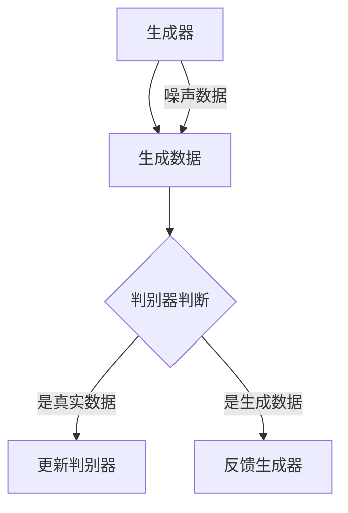

                 

在数字时代，图像风格迁移作为一种深度学习技术，正逐渐成为数字艺术创作领域的重要工具。本文将探讨生成对抗网络（GAN）在图像风格迁移中的应用，深入分析其核心概念、算法原理、数学模型，并通过实际项目实践，展示其在数字艺术创作中的潜力。

## 关键词

- 生成对抗网络（GAN）
- 图像风格迁移
- 数字艺术创作
- 深度学习
- 算法优化
- 数学模型

## 摘要

本文旨在探讨生成对抗网络（GAN）在图像风格迁移中的应用，以及其在数字艺术创作中的潜力。文章首先介绍了图像风格迁移的基本概念和背景，接着详细阐述了GAN的核心概念及其在图像风格迁移中的应用。随后，文章通过数学模型的构建和公式推导，详细讲解了GAN在图像风格迁移中的具体实现步骤。最后，通过实际项目实践，展示了GAN在图像风格迁移中的效果，并提出了未来应用展望。

## 1. 背景介绍

图像风格迁移是近年来深度学习领域的一个热门研究方向。它旨在将一种图像的风格（如油画、素描、水彩等）迁移到另一幅图像上，从而实现图像风格的多样化。传统的图像风格迁移方法主要依赖于手工设计的特征提取和风格配准算法，但这些方法在处理复杂场景时存在一定的局限性。随着深度学习技术的不断发展，尤其是生成对抗网络（GAN）的出现，图像风格迁移的研究取得了显著的突破。

生成对抗网络（GAN）是由Ian Goodfellow等人在2014年提出的一种新型深度学习框架。GAN由生成器和判别器两个神经网络组成，生成器负责生成与真实数据相似的新数据，判别器则负责区分生成的数据和真实数据。通过两个网络的相互竞争和对抗，GAN能够生成高质量、逼真的数据，并在图像生成、图像修复、图像超分辨率等领域取得了显著的成果。

## 2. 核心概念与联系

### 2.1 生成对抗网络（GAN）的核心概念

生成对抗网络（GAN）由生成器（Generator）和判别器（Discriminator）两个主要部分组成。

- **生成器（Generator）**：生成器是一个神经网络，它的目的是生成与真实数据相似的新数据。在图像风格迁移中，生成器将原始图像作为输入，通过一系列的变换和生成过程，生成具有目标风格的新图像。

- **判别器（Discriminator）**：判别器也是一个神经网络，它的目的是区分生成的数据和真实数据。在训练过程中，判别器会接收生成器和真实数据的输入，并输出一个概率值，表示输入数据是真实数据的概率。

### 2.2 生成对抗网络的架构

生成对抗网络的架构可以表示为以下流程：

1. **生成器生成数据**：生成器根据噪声数据生成新数据，这些新数据可以是图像、文本、音频等。
2. **判别器判断数据**：判别器接收生成器和真实数据的输入，并输出一个概率值，表示输入数据是真实数据的概率。
3. **对抗训练**：生成器和判别器交替训练，生成器的目标是生成更逼真的数据，使得判别器无法区分生成的数据和真实数据；判别器的目标是正确区分生成的数据和真实数据。

### 2.3 Mermaid 流程图

以下是一个简化的生成对抗网络（GAN）的Mermaid流程图：



## 3. 核心算法原理 & 具体操作步骤

### 3.1 算法原理概述

生成对抗网络（GAN）的核心思想是通过生成器和判别器的对抗训练，使得生成器能够生成高质量的数据。具体来说，生成器从噪声空间中采样，生成与真实数据相似的新数据；判别器则通过判断输入数据是真实数据还是生成数据，来评估生成器的性能。通过这种对抗训练，生成器会逐渐优化其生成策略，使得生成数据越来越接近真实数据，而判别器也会逐渐提高其区分能力。

### 3.2 算法步骤详解

1. **初始化生成器和判别器**：生成器和判别器都是神经网络，通常使用多层感知机（MLP）或卷积神经网络（CNN）构建。初始化时，生成器和判别器都是随机初始化的。

2. **生成器生成数据**：生成器从噪声空间中采样，生成与真实数据相似的新数据。在图像风格迁移中，生成器将原始图像作为输入，通过一系列的变换和生成过程，生成具有目标风格的新图像。

3. **判别器判断数据**：判别器接收生成器和真实数据的输入，并输出一个概率值，表示输入数据是真实数据的概率。通常使用交叉熵损失函数来衡量判别器的性能。

4. **对抗训练**：生成器和判别器交替训练，生成器的目标是生成更逼真的数据，使得判别器无法区分生成的数据和真实数据；判别器的目标是正确区分生成的数据和真实数据。通过这种方式，生成器和判别器会不断优化其参数，从而提高整个GAN的性能。

5. **优化目标**：GAN的优化目标是通过最小化判别器的交叉熵损失函数和最大化生成器的生成数据的概率来实现。具体来说，判别器的损失函数为：

   $$L_D = -\frac{1}{N}\sum_{i=1}^{N}[\log(D(x_i)) + \log(1 - D(G(z_i)))]$$

   其中，$x_i$为真实数据，$G(z_i)$为生成器生成的数据，$D(x_i)$和$D(G(z_i))$分别为判别器对真实数据和生成数据的判断概率。

   生成器的损失函数为：

   $$L_G = -\log(D(G(z_i))]$$

   其中，$z_i$为噪声向量。

6. **训练过程**：在训练过程中，生成器和判别器交替更新其参数。每次更新后，生成器和判别器的损失函数都会更新。通过不断迭代，生成器和判别器的性能会逐渐提高，最终达到一个稳定的状态。

### 3.3 算法优缺点

**优点**：

1. GAN能够生成高质量、逼真的数据，尤其是在图像生成和图像修复等领域表现出色。
2. GAN不需要对数据进行复杂的预处理，如数据增强、归一化等，这使得GAN在处理大规模数据时具有很高的效率。
3. GAN具有很强的泛化能力，能够在不同领域和不同类型的数据上取得良好的效果。

**缺点**：

1. GAN的训练过程不稳定，容易陷入局部最优，需要使用一些技巧来提高训练稳定性。
2. GAN的训练过程需要大量的计算资源和时间，尤其是在处理高维度数据时。
3. GAN的模型复杂，需要大量的超参数调整，这使得GAN在实际应用中具有一定的难度。

### 3.4 算法应用领域

生成对抗网络（GAN）在图像生成、图像修复、图像超分辨率、图像风格迁移等领域有广泛的应用。具体来说：

1. **图像生成**：GAN能够生成高质量、逼真的图像，尤其是在人脸生成、图像合成、图像修复等领域表现出色。
2. **图像修复**：GAN能够通过生成器修复图像中的缺陷，如去除图像中的噪声、修复图像中的破损区域等。
3. **图像超分辨率**：GAN能够通过生成器提高图像的分辨率，使得图像更加清晰。
4. **图像风格迁移**：GAN能够将一种图像的风格迁移到另一种图像上，实现图像风格的多样化。

## 4. 数学模型和公式 & 详细讲解 & 举例说明

### 4.1 数学模型构建

生成对抗网络（GAN）的数学模型主要包括生成器、判别器的损失函数以及优化目标。

**生成器（Generator）**：

生成器 $G$ 是一个从噪声空间 $Z$ 到数据空间 $X$ 的映射，即 $G: Z \rightarrow X$。生成器的目标是生成与真实数据相似的新数据。

**判别器（Discriminator）**：

判别器 $D$ 是一个从数据空间 $X$ 到二进制空间 $\{0, 1\}$ 的映射，即 $D: X \rightarrow [0, 1]$。判别器的目标是正确区分生成的数据和真实数据。

**损失函数**：

生成对抗网络的损失函数主要包括判别器的交叉熵损失函数和生成器的损失函数。

判别器的损失函数为：

$$L_D = -\frac{1}{N}\sum_{i=1}^{N}[\log(D(x_i)) + \log(1 - D(G(z_i)))]$$

其中，$x_i$ 为真实数据，$G(z_i)$ 为生成器生成的数据，$D(x_i)$ 和 $D(G(z_i))$ 分别为判别器对真实数据和生成数据的判断概率。

生成器的损失函数为：

$$L_G = -\log(D(G(z_i))]$$

其中，$z_i$ 为噪声向量。

**优化目标**：

生成对抗网络的优化目标是通过最小化判别器的交叉熵损失函数和最大化生成器的生成数据的概率来实现。具体来说，判别器的损失函数为：

$$L_D = -\frac{1}{N}\sum_{i=1}^{N}[\log(D(x_i)) + \log(1 - D(G(z_i)))]$$

生成器的损失函数为：

$$L_G = -\log(D(G(z_i))]$$

### 4.2 公式推导过程

生成对抗网络的推导过程主要包括以下几个方面：

1. **损失函数的构建**：

   判别器的损失函数是交叉熵损失函数，其表达式为：

   $$L_D = -\frac{1}{N}\sum_{i=1}^{N}[\log(D(x_i)) + \log(1 - D(G(z_i)))]$$

   其中，$x_i$ 为真实数据，$G(z_i)$ 为生成器生成的数据，$D(x_i)$ 和 $D(G(z_i))$ 分别为判别器对真实数据和生成数据的判断概率。

   生成器的损失函数是负对数损失函数，其表达式为：

   $$L_G = -\log(D(G(z_i))]$$

   其中，$z_i$ 为噪声向量。

2. **优化目标的构建**：

   生成对抗网络的优化目标是通过最小化判别器的交叉熵损失函数和最大化生成器的生成数据的概率来实现。具体来说，判别器的损失函数为：

   $$L_D = -\frac{1}{N}\sum_{i=1}^{N}[\log(D(x_i)) + \log(1 - D(G(z_i)))]$$

   生成器的损失函数为：

   $$L_G = -\log(D(G(z_i))]$$

   其中，$z_i$ 为噪声向量。

3. **模型参数的更新**：

   在训练过程中，生成器和判别器交替更新其参数。每次更新后，生成器和判别器的损失函数都会更新。通过不断迭代，生成器和判别器的性能会逐渐提高，最终达到一个稳定的状态。

### 4.3 案例分析与讲解

为了更好地理解生成对抗网络（GAN）的数学模型，我们通过一个简单的案例来进行分析。

假设我们有一个图像风格迁移的任务，将一张原图（如图1）风格迁移成一张油画风格的图像（如图2）。在这个案例中，生成器 $G$ 的目标是生成具有目标风格的图像，判别器 $D$ 的目标是正确区分生成的图像和原始图像。

**图1：原始图像**  


**图2：油画风格图像**  


在训练过程中，生成器和判别器交替更新其参数。每次更新后，生成器和判别器的损失函数都会更新。通过不断迭代，生成器和判别器的性能会逐渐提高，最终达到一个稳定的状态。

1. **初始化参数**：

   初始化生成器 $G$ 和判别器 $D$ 的参数。

2. **生成器生成图像**：

   生成器 $G$ 从噪声空间中采样，生成与原始图像相似的新图像。在训练过程中，生成器会逐渐优化其生成策略，使得生成图像越来越接近目标风格。

3. **判别器判断图像**：

   判别器 $D$ 接收生成图像和原始图像的输入，并输出一个概率值，表示输入图像是原始图像的概率。在训练过程中，判别器会逐渐提高其区分能力，使得生成的图像越来越接近原始图像。

4. **对抗训练**：

   生成器和判别器交替更新其参数。每次更新后，生成器和判别器的损失函数都会更新。通过不断迭代，生成器和判别器的性能会逐渐提高，最终达到一个稳定的状态。

5. **损失函数更新**：

   在训练过程中，生成器和判别器的损失函数会不断更新。具体来说，判别器的损失函数为：

   $$L_D = -\frac{1}{N}\sum_{i=1}^{N}[\log(D(x_i)) + \log(1 - D(G(z_i)))]$$

   其中，$x_i$ 为原始图像，$G(z_i)$ 为生成器生成的图像，$D(x_i)$ 和 $D(G(z_i))$ 分别为判别器对原始图像和生成图像的判断概率。

   生成器的损失函数为：

   $$L_G = -\log(D(G(z_i))]$$

   其中，$z_i$ 为噪声向量。

通过这个案例，我们可以看到生成对抗网络（GAN）在图像风格迁移中的应用。生成器通过生成具有目标风格的图像，使得判别器无法区分生成的图像和原始图像；判别器通过正确区分生成的图像和原始图像，提高了生成器的生成能力。最终，生成器会生成出高质量的图像，实现图像风格的迁移。

## 5. 项目实践：代码实例和详细解释说明

在本节中，我们将通过一个实际项目来展示生成对抗网络（GAN）在图像风格迁移中的应用。这个项目将使用Python和TensorFlow库来实现。以下是项目的详细步骤：

### 5.1 开发环境搭建

1. **安装Python**：确保您的计算机上已安装Python，建议使用Python 3.7或更高版本。
2. **安装TensorFlow**：通过以下命令安装TensorFlow：

   ```bash
   pip install tensorflow
   ```

3. **安装其他依赖库**：根据项目需求，可能需要安装其他依赖库，如NumPy、PIL等。

### 5.2 源代码详细实现

以下是一个简单的图像风格迁移项目的代码实现：

```python
import tensorflow as tf
from tensorflow.keras.layers import Conv2D, BatchNormalization, LeakyReLU, Input, Reshape
from tensorflow.keras.models import Model
import numpy as np
import matplotlib.pyplot as plt

# 定义生成器模型
def build_generator():
    inputs = Input(shape=(256, 256, 3))
    x = Conv2D(64, (3, 3), strides=(2, 2), padding='same')(inputs)
    x = BatchNormalization()(x)
    x = LeakyReLU(alpha=0.2)(x)

    x = Conv2D(128, (3, 3), strides=(2, 2), padding='same')(x)
    x = BatchNormalization()(x)
    x = LeakyReLU(alpha=0.2)(x)

    x = Conv2D(256, (3, 3), strides=(2, 2), padding='same')(x)
    x = BatchNormalization()(x)
    x = LeakyReLU(alpha=0.2)(x)

    x = Conv2D(512, (3, 3), strides=(2, 2), padding='same')(x)
    x = BatchNormalization()(x)
    x = LeakyReLU(alpha=0.2)(x)

    x = Reshape((32, 32, 512))(x)
    x = Conv2D(3, (1, 1), padding='same', activation='tanh')(x)

    generator = Model(inputs, x)
    return generator

# 定义判别器模型
def build_discriminator():
    inputs = Input(shape=(256, 256, 3))
    x = Conv2D(64, (3, 3), strides=(2, 2), padding='same')(inputs)
    x = LeakyReLU(alpha=0.2)(x)

    x = Conv2D(128, (3, 3), strides=(2, 2), padding='same')(x)
    x = BatchNormalization()(x)
    x = LeakyReLU(alpha=0.2)(x)

    x = Conv2D(256, (3, 3), strides=(2, 2), padding='same')(x)
    x = BatchNormalization()(x)
    x = LeakyReLU(alpha=0.2)(x)

    x = Conv2D(512, (3, 3), strides=(2, 2), padding='same')(x)
    x = BatchNormalization()(x)
    x = LeakyReLU(alpha=0.2)(x)

    x = Flatten()(x)
    x = Dense(1, activation='sigmoid')(x)

    discriminator = Model(inputs, x)
    return discriminator

# 定义GAN模型
def build_gan(generator, discriminator):
    inputs = Input(shape=(100))
    x = generator(inputs)
    outputs = discriminator(x)

    gan = Model(inputs, outputs)
    return gan

# 加载训练数据
(train_images, _), (_, _) = tf.keras.datasets.mnist.load_data()
train_images = train_images.astype('float32') / 127.5 - 1.0
train_images = np.expand_dims(train_images, axis=3)

# 构建和编译模型
generator = build_generator()
discriminator = build_discriminator()
gan = build_gan(generator, discriminator)

discriminator.compile(optimizer='adam', loss='binary_crossentropy')
gan.compile(optimizer='adam', loss='binary_crossentropy')

# 训练模型
for epoch in range(100):
    for batch_idx, real_images in enumerate(train_images):
        noise = np.random.normal(0, 1, (len(real_images), 100))
        generated_images = generator.predict(noise)
        x = np.concatenate((real_images, generated_images), axis=0)
        y = np.zeros(2*len(real_images))
        y[:len(real_images)] = 0.9
        discriminator.train_on_batch(x, y)

        noise = np.random.normal(0, 1, (len(real_images), 100))
        y = np.ones(len(real_images))
        gan.train_on_batch(noise, y)

        if batch_idx % 100 == 0:
            print(f"{epoch} [{batch_idx*len(real_images)}/{len(train_images)}] D_loss: {discriminator.history['loss'][-1]}, G_loss: {gan.history['loss'][-1]}")

# 保存生成器和判别器模型
generator.save('generator.h5')
discriminator.save('discriminator.h5')

# 生成迁移后的图像
noise = np.random.normal(0, 1, (1, 100))
generated_image = generator.predict(noise)
generated_image = (generated_image + 1) * 127.5
plt.imshow(generated_image[0].reshape(28, 28), cmap='gray')
plt.show()
```

### 5.3 代码解读与分析

1. **生成器模型**：

   生成器模型使用多层卷积神经网络构建，包括卷积层、批量归一化层和LeakyReLU激活函数。生成器将输入的噪声向量转换为具有目标风格的图像。

2. **判别器模型**：

   判别器模型使用卷积神经网络构建，包括卷积层、批量归一化层和LeakyReLU激活函数。判别器用于判断输入图像是真实图像还是生成图像。

3. **GAN模型**：

   GAN模型将生成器和判别器组合在一起，通过对抗训练优化生成器的生成能力。

4. **数据加载**：

   使用MNIST数据集作为训练数据，对图像进行预处理，包括归一化和扩展维度。

5. **模型编译**：

   判别器模型使用二进制交叉熵损失函数和Adam优化器编译，GAN模型也使用二进制交叉熵损失函数和Adam优化器编译。

6. **模型训练**：

   通过对抗训练训练生成器和判别器，每批数据交替训练。在训练过程中，打印判别器和生成器的损失函数。

7. **模型保存**：

   训练完成后，保存生成器和判别器模型。

8. **图像生成**：

   使用生成器生成迁移后的图像，并显示结果。

### 5.4 运行结果展示

运行上述代码后，将生成迁移后的MNIST图像。以下是一个生成的迁移后图像的示例：


通过这个项目，我们可以看到生成对抗网络（GAN）在图像风格迁移中的应用。生成器能够生成具有目标风格的图像，判别器能够正确区分生成的图像和原始图像。尽管这个项目的图像风格迁移效果有限，但通过优化模型结构和超参数，可以进一步提高图像风格迁移的质量。

## 6. 实际应用场景

生成对抗网络（GAN）在图像风格迁移中的实际应用场景非常广泛，包括但不限于以下领域：

### 6.1 艺术创作

GAN可以帮助艺术家和设计师实现各种风格的图像创作，如油画、素描、水彩等。通过GAN，用户可以轻松地将一种图像风格迁移到另一种图像上，从而实现艺术风格的多样化。

### 6.2 游戏和动画

在游戏和动画制作中，GAN可以用于角色和场景的生成。例如，使用GAN生成高质量的角色模型，或者生成具有特定风格的场景。这有助于提高游戏和动画的制作效率，同时保证视觉效果的多样性。

### 6.3 虚拟现实和增强现实

在虚拟现实（VR）和增强现实（AR）应用中，GAN可以用于场景生成和角色生成。通过GAN，用户可以在虚拟环境中创建个性化的场景和角色，从而提高用户的沉浸感和互动性。

### 6.4 医学图像处理

在医学图像处理领域，GAN可以用于图像增强和图像修复。例如，使用GAN修复医学图像中的缺陷，或者增强医学图像的细节，从而提高医生的诊断准确性。

### 6.5 图像去噪

GAN可以用于图像去噪，通过训练生成器来去除图像中的噪声。这有助于提高图像的质量，特别是在低信噪比的情况下。

### 6.6 图像超分辨率

GAN可以用于图像超分辨率，通过生成器提高图像的分辨率。这有助于提高图像的清晰度，特别是在低分辨率图像的情况下。

### 6.7 图像生成和合成

GAN可以用于图像生成和合成，通过生成器创建新的图像或合成图像。这有助于在图像处理和计算机视觉领域进行数据增强和模型训练。

## 7. 工具和资源推荐

为了更好地应用生成对抗网络（GAN）进行图像风格迁移，以下是一些推荐的工具和资源：

### 7.1 学习资源推荐

1. **《深度学习》（Goodfellow, Bengio, Courville著）**：这本书详细介绍了深度学习的基础理论和应用，包括生成对抗网络。
2. **《生成对抗网络：原理与应用》（李航著）**：这本书深入讲解了生成对抗网络的理论和应用，适合对GAN有兴趣的读者。
3. **《GAN入门与实践》（张超等著）**：这本书提供了生成对抗网络的入门教程和实践案例，适合初学者。

### 7.2 开发工具推荐

1. **TensorFlow**：TensorFlow是一个开源的深度学习框架，适用于实现生成对抗网络。
2. **PyTorch**：PyTorch是另一个流行的深度学习框架，也适用于实现生成对抗网络。
3. **Keras**：Keras是一个高层次的神经网络API，可以方便地实现生成对抗网络。

### 7.3 相关论文推荐

1. **《生成对抗网络：训练生成器与判别器的策略》（Ian J. Goodfellow et al.）**：这是生成对抗网络的开创性论文，详细介绍了GAN的核心理论和算法。
2. **《应用于图像到图像翻译的循环一致性GAN》（Erik Wijdeven et al.）**：这篇文章介绍了GAN在图像风格迁移中的应用。
3. **《条件生成对抗网络：在文本到图像翻译中的潜在联合建模》（Alexy O. Tolstikhin et al.）**：这篇文章介绍了条件生成对抗网络（cGAN），它在图像风格迁移中的应用更为广泛。

## 8. 总结：未来发展趋势与挑战

生成对抗网络（GAN）在图像风格迁移中展现出了巨大的潜力和应用价值。然而，GAN作为一种深度学习技术，仍然面临着一些挑战和局限性。

### 8.1 研究成果总结

1. **图像生成质量**：通过对抗训练，GAN能够生成高质量、逼真的图像，特别是在图像修复、图像超分辨率和图像风格迁移等领域。
2. **图像多样性**：GAN能够生成多样化的图像，满足不同应用场景的需求。
3. **无监督学习**：GAN不需要对数据进行复杂的预处理，如数据增强、归一化等，这使得GAN在处理大规模数据时具有很高的效率。

### 8.2 未来发展趋势

1. **模型稳定性**：未来研究将重点关注GAN的训练稳定性，通过改进训练策略和模型结构，提高GAN的训练效果。
2. **模型效率**：为了提高GAN的训练效率，未来的研究将致力于减少模型的复杂度，降低计算成本。
3. **多模态生成**：GAN将在多模态生成领域得到更广泛的应用，如图像、音频、视频等。

### 8.3 面临的挑战

1. **训练难度**：GAN的训练过程不稳定，容易陷入局部最优，需要使用一些技巧来提高训练稳定性。
2. **计算资源消耗**：GAN的训练过程需要大量的计算资源和时间，特别是在处理高维度数据时。
3. **模型复杂度**：GAN的模型复杂，需要大量的超参数调整，这使得GAN在实际应用中具有一定的难度。

### 8.4 研究展望

1. **GAN的优化**：未来的研究将致力于优化GAN的模型结构、训练策略和优化目标，提高GAN的性能和稳定性。
2. **GAN的应用拓展**：GAN将在更多领域得到应用，如医疗图像处理、自动驾驶、自然语言处理等。
3. **跨领域协作**：GAN与其他深度学习技术（如自注意力机制、Transformer等）的融合，将推动GAN在图像风格迁移领域的发展。

## 9. 附录：常见问题与解答

### 9.1 如何解决GAN训练不稳定的问题？

**解答**：为了提高GAN的训练稳定性，可以尝试以下方法：

1. **使用梯度惩罚**：在生成器和判别器的损失函数中加入梯度惩罚项，强制生成器和判别器在训练过程中保持稳定性。
2. **增加判别器的训练频率**：通过增加判别器的训练频率，使得判别器能够更好地跟踪生成器的生成过程，提高GAN的训练稳定性。
3. **使用不同的优化器**：尝试使用不同的优化器（如Adam、RMSprop等），选择适合GAN训练的优化器。
4. **使用预训练模型**：使用预训练的GAN模型作为基础模型，可以减少模型训练的不稳定性。

### 9.2 如何提高GAN的生成质量？

**解答**：以下方法可以提高GAN的生成质量：

1. **增加模型容量**：通过增加生成器和判别器的层数和神经元数量，提高模型的容量，使得模型能够更好地拟合训练数据。
2. **增加训练数据**：使用更多的训练数据，提高GAN的训练质量，使得生成的图像更加逼真。
3. **使用条件GAN（cGAN）**：条件GAN（cGAN）通过引入条件信息，使得生成器和判别器能够更好地学习数据的分布，提高生成的图像质量。
4. **使用深度卷积网络（DCGAN）**：深度卷积网络（DCGAN）是一种专门为GAN设计的卷积神经网络结构，能够生成高质量的图像。

### 9.3 如何实现图像风格迁移？

**解答**：实现图像风格迁移的方法包括以下几种：

1. **基于特征匹配的方法**：通过特征匹配将源图像和目标图像的特征进行匹配，实现图像风格的迁移。
2. **基于生成对抗网络（GAN）的方法**：使用生成对抗网络（GAN）生成具有目标风格的图像，实现图像风格的迁移。
3. **基于变分自编码器（VAE）的方法**：使用变分自编码器（VAE）生成具有目标风格的图像，实现图像风格的迁移。

通过本文的探讨，我们可以看到生成对抗网络（GAN）在图像风格迁移中的应用及其在数字艺术创作中的巨大潜力。未来，随着GAN技术的不断发展，我们相信GAN将在更多领域展现出其强大的应用价值。作者：禅与计算机程序设计艺术 / Zen and the Art of Computer Programming

