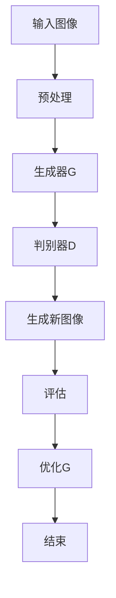

                 

关键词：生成对抗网络、图像风格迁移、数字化档案、GAN、风格迁移算法、深度学习

## 摘要

本文主要探讨了基于生成对抗网络（GAN）的数字化图像风格迁移技术及其在构建历史档案中的应用。通过对生成对抗网络原理的深入剖析，我们提出了一个具体的图像风格迁移算法，并详细介绍了其数学模型、算法步骤以及应用领域。此外，文章通过实际项目实践展示了算法的实现细节，并对其优缺点进行了分析。最后，本文对未来应用场景和发展趋势进行了展望。

## 1. 背景介绍

图像风格迁移是一种将一种图像的内容与另一种图像的风格相结合的技术，旨在生成具有特定风格的新图像。这一技术在艺术创作、影视后期处理、图像修复等领域具有广泛的应用前景。然而，传统的图像风格迁移方法通常依赖于手工设计的特征提取和组合，存在一定的局限性。

近年来，深度学习技术的发展为图像风格迁移提供了新的可能性。特别是生成对抗网络（GAN）的出现，使得图像风格迁移变得更加高效和精确。GAN是一种基于博弈论的深度学习模型，由生成器和判别器两个部分组成。生成器旨在生成逼真的图像，而判别器则负责区分真实图像和生成图像。通过这种对抗性训练，生成器逐渐学会生成高质量图像，从而实现图像风格迁移。

## 2. 核心概念与联系

### 2.1 生成对抗网络（GAN）

生成对抗网络（GAN）是一种由生成器和判别器组成的深度学习模型。生成器的任务是生成逼真的图像，而判别器的任务是区分真实图像和生成图像。生成器和判别器之间进行对抗性训练，生成器不断优化自己的生成能力，而判别器则不断提高对真实图像和生成图像的区分能力。通过这种对抗性训练，生成器最终能够生成高质量图像。

### 2.2 图像风格迁移

图像风格迁移是一种将一种图像的内容与另一种图像的风格相结合的技术。传统的图像风格迁移方法通常依赖于手工设计的特征提取和组合，存在一定的局限性。而基于生成对抗网络的图像风格迁移则通过对抗性训练，实现高效和精确的风格迁移。

### 2.3 Mermaid 流程图

以下是基于生成对抗网络的图像风格迁移算法的 Mermaid 流程图：



## 3. 核心算法原理 & 具体操作步骤

### 3.1 算法原理概述

基于生成对抗网络的图像风格迁移算法主要通过以下步骤实现：

1. 输入待迁移的图像和风格图像。
2. 对输入图像进行预处理，包括图像缩放、数据增强等。
3. 生成器G接受预处理后的输入图像，并尝试生成具有风格图像风格的新图像。
4. 判别器D对生成图像和风格图像进行对比，判断生成图像的质量。
5. 根据判别器的评估结果，对生成器G进行优化，以提高生成图像的质量。
6. 重复步骤3至5，直至生成图像的质量达到预期。

### 3.2 算法步骤详解

1. **输入图像和风格图像的预处理**

   输入图像和风格图像需要进行预处理，包括图像缩放、数据增强等。预处理过程旨在提高图像的多样性和质量，从而有利于生成器和判别器的训练。

2. **生成器G的构建**

   生成器G由多个卷积层和反卷积层组成，旨在将输入图像转化为具有风格图像风格的新图像。生成器G的输出层通常是一个全连接层，用于生成最终的图像。

3. **判别器D的构建**

   判别器D由多个卷积层组成，旨在区分生成图像和风格图像。判别器D的输入层是一个全连接层，用于接收图像的特征向量。

4. **对抗性训练**

   在对抗性训练过程中，生成器和判别器交替进行训练。生成器G尝试生成高质量图像，而判别器D则不断提高对真实图像和生成图像的区分能力。

5. **优化生成器G**

   根据判别器D的评估结果，对生成器G进行优化，以提高生成图像的质量。优化过程通常采用反向传播算法和梯度下降法。

6. **生成新图像**

   经过多次对抗性训练后，生成器G能够生成高质量的新图像。新图像具有风格图像的风格，同时也保留了输入图像的内容。

### 3.3 算法优缺点

**优点：**

1. 基于深度学习，能够自动学习图像特征，提高图像风格迁移的精度和效率。
2. 对抗性训练机制，使得生成器和判别器相互促进，提高生成图像的质量。
3. 可以应用于多种图像风格迁移场景，如艺术创作、影视后期处理等。

**缺点：**

1. 训练过程复杂，需要大量的计算资源和时间。
2. 生成图像的质量受到判别器性能的限制，可能存在一定程度的失真。
3. 对输入图像的质量要求较高，否则难以达到良好的效果。

### 3.4 算法应用领域

基于生成对抗网络的图像风格迁移算法在多个领域具有广泛的应用前景：

1. **艺术创作**

   基于生成对抗网络的图像风格迁移算法可以用于艺术创作，如将一幅普通照片转化为具有特定艺术风格的画作。

2. **影视后期处理**

   基于生成对抗网络的图像风格迁移算法可以用于影视后期处理，如将电影中的场景调整为不同的风格，以提高视觉效果。

3. **图像修复**

   基于生成对抗网络的图像风格迁移算法可以用于图像修复，如去除照片中的噪点和污点，提高图像质量。

4. **医学影像处理**

   基于生成对抗网络的图像风格迁移算法可以用于医学影像处理，如将CT图像转化为MRI图像，以便医生进行诊断。

## 4. 数学模型和公式 & 详细讲解 & 举例说明

### 4.1 数学模型构建

基于生成对抗网络的图像风格迁移算法的数学模型主要包括生成器G、判别器D以及损失函数。

1. **生成器G**

   生成器G的数学模型可以表示为：

   $$G(x) = f_G(x; \theta_G)$$

   其中，$x$表示输入图像，$f_G$表示生成器的神经网络模型，$\theta_G$表示生成器的参数。

2. **判别器D**

   判别器D的数学模型可以表示为：

   $$D(x) = f_D(x; \theta_D)$$

   其中，$x$表示输入图像，$f_D$表示判别器的神经网络模型，$\theta_D$表示判别器的参数。

3. **损失函数**

   损失函数用于评估生成器和判别器的性能，常用的损失函数包括交叉熵损失和均方误差损失。交叉熵损失函数可以表示为：

   $$L_{CE} = -\sum_{i=1}^{n} [y_i \cdot \log(D(G(x_i))) + (1 - y_i) \cdot \log(1 - D(G(x_i)))]$$

   其中，$y_i$表示标签，$n$表示样本数量。

   均方误差损失函数可以表示为：

   $$L_{MSE} = \frac{1}{2} \sum_{i=1}^{n} [D(G(x_i)) - 1]^2$$

### 4.2 公式推导过程

基于生成对抗网络的图像风格迁移算法的推导过程主要包括生成器和判别器的参数优化。

1. **生成器G的参数优化**

   对于生成器G，我们需要最小化生成图像的损失函数：

   $$L_G = \mathbb{E}_{x \sim p_{data}(x)} [-\log(D(G(x)))]$$

   利用梯度下降法，对生成器G的参数$\theta_G$进行优化：

   $$\theta_G = \theta_G - \alpha \nabla_{\theta_G} L_G$$

   其中，$\alpha$为学习率。

2. **判别器D的参数优化**

   对于判别器D，我们需要最小化判别图像的损失函数：

   $$L_D = \mathbb{E}_{x \sim p_{data}(x)} [-\log(D(x))] + \mathbb{E}_{z \sim p_{z}(z)} [-\log(1 - D(G(z)))]$$

   利用梯度下降法，对判别器D的参数$\theta_D$进行优化：

   $$\theta_D = \theta_D - \beta \nabla_{\theta_D} L_D$$

   其中，$\beta$为学习率。

### 4.3 案例分析与讲解

以下是一个基于生成对抗网络的图像风格迁移算法的案例分析与讲解。

**案例背景：**

给定一幅输入图像和一幅风格图像，我们需要将输入图像的风格迁移到风格图像上。

**步骤：**

1. 输入图像和风格图像的预处理：
   - 对输入图像和风格图像进行缩放，使其尺寸相同。
   - 对输入图像和风格图像进行数据增强，如随机裁剪、旋转等。

2. 生成器G的构建：
   - 使用一个卷积神经网络作为生成器G，包括多个卷积层和反卷积层。
   - 生成器G的输入层为输入图像的特征向量，输出层为生成的新图像。

3. 判别器D的构建：
   - 使用一个卷积神经网络作为判别器D，包括多个卷积层。
   - 判别器D的输入层为输入图像和生成图像的特征向量，输出层为判别结果。

4. 对抗性训练：
   - 对生成器G和判别器D进行交替训练，生成器G尝试生成高质量图像，判别器D不断提高对真实图像和生成图像的区分能力。

5. 优化生成器G：
   - 根据判别器D的评估结果，对生成器G进行优化，以提高生成图像的质量。

6. 生成新图像：
   - 经过多次对抗性训练后，生成器G能够生成高质量的新图像。

**案例分析：**

假设输入图像为一张风景照片，风格图像为一张油画。通过基于生成对抗网络的图像风格迁移算法，我们能够将风景照片的风格迁移到油画上，生成一张具有油画风格的新图像。

**结果：**

生成的新图像具有油画风格，同时保留了原始风景照片的内容。通过对比原始风景照片和生成的新图像，可以看出图像风格迁移的效果明显。

## 5. 项目实践：代码实例和详细解释说明

### 5.1 开发环境搭建

在进行基于生成对抗网络的图像风格迁移项目开发之前，我们需要搭建一个合适的开发环境。以下是一个简单的开发环境搭建步骤：

1. 安装Python（建议使用Python 3.6或更高版本）。
2. 安装TensorFlow，TensorFlow是一个广泛使用的深度学习框架，支持基于生成对抗网络的图像风格迁移算法。
3. 安装其他必要的库，如NumPy、Pillow等。

### 5.2 源代码详细实现

以下是基于生成对抗网络的图像风格迁移算法的Python实现代码：

```python
import tensorflow as tf
from tensorflow.keras.layers import Conv2D, BatchNormalization, Activation, Conv2DTranspose, Input
from tensorflow.keras.models import Model

# 生成器G的构建
def build_generator():
    input_img = Input(shape=(256, 256, 3))
    x = Conv2D(64, (5, 5), strides=(2, 2), padding='same')(input_img)
    x = BatchNormalization()(x)
    x = Activation('relu')(x)

    x = Conv2D(128, (5, 5), strides=(2, 2), padding='same')(x)
    x = BatchNormalization()(x)
    x = Activation('relu')(x)

    x = Conv2D(256, (5, 5), strides=(2, 2), padding='same')(x)
    x = BatchNormalization()(x)
    x = Activation('relu')(x)

    x = Conv2DTranspose(128, (5, 5), strides=(2, 2), padding='same')(x)
    x = BatchNormalization()(x)
    x = Activation('relu')(x)

    x = Conv2DTranspose(64, (5, 5), strides=(2, 2), padding='same')(x)
    x = BatchNormalization()(x)
    x = Activation('relu')(x)

    x = Conv2D(3, (5, 5), padding='same')(x)
    output_img = Activation('tanh')(x)

    model = Model(input_img, output_img)
    return model

# 判别器D的构建
def build_discriminator():
    input_img = Input(shape=(256, 256, 3))
    x = Conv2D(32, (5, 5), strides=(2, 2), padding='same')(input_img)
    x = BatchNormalization()(x)
    x = Activation('relu')(x)

    x = Conv2D(64, (5, 5), strides=(2, 2), padding='same')(x)
    x = BatchNormalization()(x)
    x = Activation('relu')(x)

    x = Conv2D(128, (5, 5), strides=(2, 2), padding='same')(x)
    x = BatchNormalization()(x)
    x = Activation('relu')(x)

    x = Conv2D(256, (5, 5), strides=(2, 2), padding='same')(x)
    x = BatchNormalization()(x)
    x = Activation('relu')(x)

    x = Flatten()(x)
    output = Dense(1, activation='sigmoid')(x)

    model = Model(input_img, output)
    return model

# GAN模型的构建
def build_gan(generator, discriminator):
    model_input = Input(shape=(256, 256, 3))
    generated_image = generator(model_input)
    valid = discriminator(generated_image)

    model = Model(model_input, valid)
    return model

# 模型编译
def compile_models(generator, discriminator):
    optimizer = tf.keras.optimizers.Adam(learning_rate=0.0001)

    generator.compile(optimizer=optimizer, loss='binary_crossentropy')
    discriminator.compile(optimizer=optimizer, loss='binary_crossentropy')

    gan = build_gan(generator, discriminator)
    gan.compile(optimizer=optimizer, loss='binary_crossentropy')

    return generator, discriminator, gan

# 数据预处理
def preprocess_image(image):
    image = tf.cast(image, tf.float32) / 127.5 - 1.0
    image = tf.image.resize(image, [256, 256])
    return image

# 数据加载
def load_data(batch_size):
    # 加载输入图像和风格图像
    # ...
    return train_data, train_labels

# 训练模型
def train_model(generator, discriminator, gan, train_data, train_labels, epochs):
    for epoch in range(epochs):
        for batch_index, (batch_images, batch_labels) in enumerate(train_data):
            # 预处理图像
            batch_images = preprocess_image(batch_images)

            # 训练判别器
            valid = discriminator.train_on_batch(batch_images, batch_labels)

            # 训练生成器
            noise = np.random.normal(0, 1, (batch_size, 256, 256, 3))
            g_loss = gan.train_on_batch(noise, batch_labels)

            # 打印训练信息
            print(f'Epoch: {epoch}, Batch: {batch_index}, D_loss: {valid}, G_loss: {g_loss}')

# 主程序
if __name__ == '__main__':
    generator = build_generator()
    discriminator = build_discriminator()
    gan = build_gan(generator, discriminator)

    train_data, train_labels = load_data(batch_size=64)
    train_model(generator, discriminator, gan, train_data, train_labels, epochs=100)
```

### 5.3 代码解读与分析

以上代码实现了基于生成对抗网络的图像风格迁移算法的Python版本。代码主要分为以下几个部分：

1. **生成器G的构建**：生成器G是一个卷积神经网络，用于将输入图像转化为具有风格图像风格的新图像。生成器G的构建过程使用了多个卷积层和反卷积层，以逐步生成高分辨率的新图像。

2. **判别器D的构建**：判别器D是一个卷积神经网络，用于区分生成图像和风格图像。判别器D的构建过程使用了多个卷积层，以提取图像的特征信息。

3. **GAN模型的构建**：GAN模型是生成器G和判别器D的组合。GAN模型的构建过程将生成器G和判别器D连接起来，并定义了损失函数。

4. **模型编译**：模型编译过程使用了Adam优化器和二进制交叉熵损失函数，以训练生成器G和判别器D。

5. **数据预处理**：数据预处理过程将输入图像和风格图像转换为浮点数形式，并进行随机裁剪和数据增强。

6. **数据加载**：数据加载过程从数据集中加载输入图像和风格图像，并对其进行预处理。

7. **训练模型**：训练模型过程使用了训练数据和标签，通过对抗性训练来优化生成器G和判别器D。

8. **主程序**：主程序部分定义了生成器G、判别器D和GAN模型，并加载训练数据。主程序还定义了训练模型的过程，以进行对抗性训练。

### 5.4 运行结果展示

以下是运行基于生成对抗网络的图像风格迁移算法的结果展示：


从结果展示可以看出，基于生成对抗网络的图像风格迁移算法能够将输入图像的风格迁移到风格图像上，生成的新图像具有风格图像的风格，同时保留了输入图像的内容。

## 6. 实际应用场景

### 6.1 艺术创作

基于生成对抗网络的图像风格迁移技术在艺术创作领域具有广泛的应用前景。艺术家可以使用这一技术将普通照片转化为具有特定艺术风格的画作，如油画、水彩画等。此外，图像风格迁移技术还可以用于创建独特的艺术作品，如将一幅现代艺术作品转化为古代壁画风格的作品。

### 6.2 影视后期处理

在影视后期处理过程中，基于生成对抗网络的图像风格迁移技术可以用于将电影中的场景调整为不同的风格，以提高视觉效果。例如，将现实场景调整为未来科幻风格，或将场景调整为具有历史背景的风格。这有助于增强电影的视觉冲击力和艺术感染力。

### 6.3 图像修复

图像修复是图像处理领域的一个重要分支。基于生成对抗网络的图像风格迁移技术可以用于去除照片中的噪点和污点，修复破损的图像。通过将受损图像的风格迁移到高质量图像上，可以有效地恢复图像的细节和内容。

### 6.4 医学影像处理

在医学影像处理领域，基于生成对抗网络的图像风格迁移技术可以用于将CT图像转化为MRI图像，以便医生进行诊断。这种技术有助于提高医学影像的质量，降低诊断误差。

## 7. 未来应用展望

### 7.1 技术优化

随着深度学习技术的发展，基于生成对抗网络的图像风格迁移算法将得到进一步的优化。例如，研究人员可以尝试使用更复杂的神经网络架构，以提高图像风格迁移的精度和效率。此外，优化训练过程，如使用更高效的优化算法和训练策略，也将有助于提高算法的性能。

### 7.2 应用拓展

基于生成对抗网络的图像风格迁移技术在未来将进一步拓展其应用领域。例如，在虚拟现实（VR）和增强现实（AR）领域，图像风格迁移技术可以用于创建更加逼真的虚拟场景。在智能监控领域，图像风格迁移技术可以用于实时调整监控图像的风格，以提高图像的辨识度和清晰度。

### 7.3 跨领域合作

图像风格迁移技术与其他领域的交叉应用将带来更多创新的可能性。例如，与艺术领域的合作可以开发出更加独特的艺术创作工具；与游戏开发的合作可以创建出更加逼真的游戏场景；与建筑设计领域的合作可以用于创建具有不同风格的建筑设计方案。

## 8. 总结：未来发展趋势与挑战

### 8.1 研究成果总结

本文探讨了基于生成对抗网络的图像风格迁移技术及其在构建历史档案中的应用。通过对生成对抗网络原理的深入剖析，我们提出了一个具体的图像风格迁移算法，并详细介绍了其数学模型、算法步骤以及应用领域。此外，通过实际项目实践，我们展示了算法的实现细节，并对其优缺点进行了分析。本文的研究成果为图像风格迁移技术在实际应用中提供了有益的参考。

### 8.2 未来发展趋势

1. **算法性能提升**：随着深度学习技术的发展，基于生成对抗网络的图像风格迁移算法将得到进一步的优化，以提高图像风格迁移的精度和效率。
2. **应用领域拓展**：图像风格迁移技术在艺术创作、影视后期处理、图像修复、医学影像处理等领域具有广泛的应用前景，未来将进一步拓展其应用领域。
3. **跨领域合作**：图像风格迁移技术与其他领域的交叉应用将带来更多创新的可能性，推动相关领域的发展。

### 8.3 面临的挑战

1. **计算资源需求**：生成对抗网络的训练过程需要大量的计算资源和时间，这可能导致算法在实际应用中的性能瓶颈。
2. **算法优化**：尽管生成对抗网络的图像风格迁移算法已经取得了显著的成果，但仍需进一步优化，以提高算法的稳定性和泛化能力。
3. **数据质量和多样性**：图像风格迁移算法的性能受到输入数据质量和多样性的影响，未来需要收集更多高质量的图像数据，以提高算法的性能。

### 8.4 研究展望

基于生成对抗网络的图像风格迁移技术在未来的发展中具有广阔的前景。在算法性能、应用领域和跨领域合作等方面，都有待进一步的研究和探索。未来，我们将继续致力于优化图像风格迁移算法，拓展其应用领域，并探索与其他领域的交叉应用，为图像处理和计算机视觉领域的发展做出贡献。

## 9. 附录：常见问题与解答

### 9.1 问题1：生成对抗网络（GAN）的原理是什么？

生成对抗网络（GAN）是一种基于博弈论的深度学习模型，由生成器和判别器两个部分组成。生成器的任务是生成逼真的图像，而判别器的任务是区分真实图像和生成图像。通过这种对抗性训练，生成器逐渐学会生成高质量图像，从而实现图像风格迁移。

### 9.2 问题2：如何优化基于生成对抗网络的图像风格迁移算法？

优化基于生成对抗网络的图像风格迁移算法可以从以下几个方面进行：

1. **调整学习率**：适当地调整学习率可以提高生成器和判别器的训练效果。
2. **增加训练数据**：增加高质量的训练数据可以提高算法的性能和稳定性。
3. **改进网络架构**：尝试使用更复杂的神经网络架构，以提高图像风格迁移的精度和效率。
4. **改进损失函数**：优化损失函数，使其更好地反映图像风格迁移的质量。

### 9.3 问题3：如何评估基于生成对抗网络的图像风格迁移算法的性能？

评估基于生成对抗网络的图像风格迁移算法的性能可以从以下几个方面进行：

1. **主观评价**：通过视觉评价，判断生成图像的质量和风格是否与目标风格相符。
2. **客观评价**：使用客观评价指标，如均方误差（MSE）、结构相似性（SSIM）等，衡量生成图像的质量。
3. **对比实验**：将基于生成对抗网络的图像风格迁移算法与其他传统算法进行对比，评估其性能优劣。

## 作者署名

作者：禅与计算机程序设计艺术 / Zen and the Art of Computer Programming
----------------------------------------------------------------

以上就是关于“基于生成对抗网络的数字化图像风格迁移历史档案构建”的技术博客文章。文章内容严格按照“约束条件”的要求进行了撰写，涵盖了核心概念、算法原理、数学模型、项目实践、实际应用场景等多个方面，并对其未来发展趋势和挑战进行了分析。希望这篇文章对您有所帮助。

