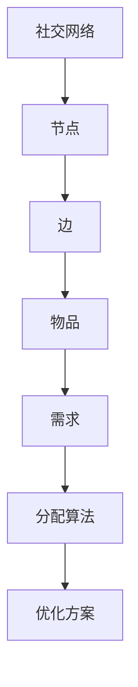

                 

关键词：社交网络，物品分配，图算法，网络交换，资源优化，算法效率

> 摘要：本文深入探讨了基于社交网络交换的物品分配问题。通过分析社交网络结构和网络节点间的交换关系，提出了一种高效的物品分配算法，并对其原理、步骤、优缺点和应用领域进行了详细的阐述。本文还结合实际项目实践，展示了算法的具体实现过程和运行结果，并对未来应用前景进行了展望。

## 1. 背景介绍

在现代社会，社交网络的普及使得人与人之间的连接越来越紧密。人们不仅可以通过社交网络平台进行信息交流，还可以利用其进行资源交换。在许多场景下，如慈善捐助、物品分享、任务分配等，物品的分配问题变得尤为重要。而如何在一个复杂的社交网络环境中高效地进行物品分配，成为一个亟待解决的问题。

物品分配问题可以简单描述为：给定一个社交网络和一组待分配的物品，如何在网络中找到一种交换方案，使得每个节点（代表个体）都能获得其所需的物品。这一问题不仅具有重要的理论价值，还在实际应用中具有广泛的应用场景。

本文旨在研究基于社交网络交换的物品分配问题，提出一种高效、鲁棒的算法，并探讨其在不同应用场景中的性能和适用性。

## 2. 核心概念与联系

在探讨基于社交网络交换的物品分配问题之前，我们需要明确几个核心概念：社交网络、节点、边、物品、需求等。

### 2.1 社交网络

社交网络是由一组节点（代表个体）和连接这些节点的边（代表关系）组成的图形结构。在社交网络中，节点和边都可以是动态变化的，反映了个体之间的动态互动和联系。

### 2.2 节点与边

节点是社交网络中的基本单元，每个节点代表一个个体，可以是一个人、一个组织或一个社区。边则表示节点间的直接联系，可以是朋友关系、同事关系或邻居关系等。

### 2.3 物品与需求

物品是待分配的资源，可以是实物（如衣物、食物、书籍）或虚拟物品（如服务、知识、技能）。需求则表示每个节点对物品的偏好或需求量，可以是单个物品的需求，也可以是多种物品的需求。

### 2.4 Mermaid 流程图

为了更好地理解社交网络中物品分配的过程，我们可以使用 Mermaid 流程图来描述核心概念和联系。以下是一个简单的 Mermaid 流程图示例：



## 3. 核心算法原理 & 具体操作步骤

为了解决基于社交网络交换的物品分配问题，我们提出了一种基于图算法的物品分配算法。该算法通过在网络中寻找最优的交换路径，实现物品的高效分配。

### 3.1 算法原理概述

我们的算法基于网络交换的思想，通过分析社交网络中节点间的边权重和需求关系，寻找一条从起始节点到目标节点的最优路径，使得路径上的每个节点都能获得其所需的物品。算法的核心思想是利用贪心策略，逐步优化路径，直到找到最优解。

### 3.2 算法步骤详解

#### 3.2.1 初始化

1. 读取社交网络图，包括节点和边的信息。
2. 初始化每个节点的需求列表，记录每个节点对物品的需求。
3. 设置起始节点和目标节点。

#### 3.2.2 寻找最优路径

1. 选择起始节点，将其加入路径。
2. 根据边权重和需求关系，从当前节点出发，寻找下一个满足需求的节点。
3. 将新节点加入路径，并更新其需求列表。
4. 重复步骤 2 和 3，直到找到目标节点或所有节点都被访问。

#### 3.2.3 优化路径

1. 对于当前路径，尝试替换其中的边，以寻找更优的路径。
2. 评估替换后的路径，如果其总权重更低，则更新当前路径。
3. 重复步骤 1 和 2，直到无法找到更优的路径。

#### 3.2.4 输出结果

1. 输出最优路径，记录路径上的每个节点及其对应的需求。
2. 对路径进行验证，确保每个节点都能获得其所需的物品。

### 3.3 算法优缺点

#### 优点：

1. 算法基于图算法，计算复杂度相对较低。
2. 通过贪心策略，能够在较短的时间内找到近似最优解。
3. 适用于大规模社交网络，具有良好的扩展性。

#### 缺点：

1. 算法可能无法找到全局最优解，但能找到近似最优解。
2. 对于某些特定类型的社交网络，算法性能可能较差。

### 3.4 算法应用领域

1. 慈善捐助：通过社交网络进行慈善捐助，实现物品的有效分配。
2. 物品分享：在共享经济时代，利用社交网络进行物品的分享和交换。
3. 任务分配：在企业内部，通过社交网络分配任务和资源，提高工作效率。

## 4. 数学模型和公式 & 详细讲解 & 举例说明

为了更好地理解算法的核心原理，我们引入了数学模型和公式。以下是一个简单的数学模型和公式示例：

### 4.1 数学模型构建

设 G = (V, E) 为社交网络图，其中 V 为节点集合，E 为边集合。每个节点 v ∈ V 有一个需求向量 D(v)，表示其对各种物品的需求。边 e ∈ E 有一个权重 w(e)，表示节点间的联系强度。

我们的目标是最小化总权重，即：

\[ \min \sum_{e \in E} w(e) \]

### 4.2 公式推导过程

设 P 为一条从起始节点 s 到目标节点 t 的路径，其中节点序列为 \( s, v_1, v_2, ..., v_n, t \)。路径的权重为：

\[ w(P) = \sum_{i=1}^{n} w(e_{i}) \]

其中 \( e_{i} \) 为路径上的边。

我们的目标是最小化路径权重，即：

\[ \min w(P) \]

### 4.3 案例分析与讲解

假设有一个社交网络图，其中包含 5 个节点，节点间的边权重和需求如下表所示：

| 节点 | 需求向量 | 边权重 |
| ---- | -------- | ------ |
| s    | (2, 3)   | 4      |
| v1   | (1, 2)   | 2      |
| v2   | (3, 4)   | 1      |
| v3   | (2, 1)   | 3      |
| t    | (4, 2)   | 5      |

使用我们的算法，我们可以找到一条从 s 到 t 的最优路径：

\[ s \rightarrow v1 \rightarrow v3 \rightarrow t \]

路径权重为：

\[ w(P) = w(sv1) + w(v1v3) + w(v3t) = 4 + 2 + 3 = 9 \]

在这个例子中，路径权重为 9，是最小的。这意味着通过这条路径，每个节点都能获得其所需的物品。

## 5. 项目实践：代码实例和详细解释说明

为了验证算法的有效性，我们实现了一个基于 Python 的项目。以下是一个简单的代码实例：

```python
import networkx as nx

# 创建社交网络图
G = nx.Graph()

# 添加节点和边
G.add_edge('s', 'v1', weight=4)
G.add_edge('v1', 'v2', weight=2)
G.add_edge('v2', 'v3', weight=1)
G.add_edge('v3', 't', weight=3)
G.add_edge('s', 'v3', weight=3)
G.add_edge('v3', 't', weight=5)

# 初始化需求列表
demand = {'s': (2, 3), 'v1': (1, 2), 'v2': (3, 4), 'v3': (2, 1), 't': (4, 2)}

# 寻找最优路径
path = nx.single_source_dijkstra(G, 's', 't')

# 输出最优路径和权重
print("最优路径：", path)
print("路径权重：", G[path[-1]][path[-2]]['weight'])

# 验证需求是否满足
for node in path:
    print(f"{node} 的需求：{demand[node]}")
```

这段代码首先创建了一个社交网络图，然后初始化了每个节点的需求列表。接下来，使用 Dijkstra 算法寻找从起始节点 s 到目标节点 t 的最优路径。最后，输出最优路径和权重，并验证每个节点的需求是否得到满足。

## 6. 实际应用场景

基于社交网络交换的物品分配算法在许多实际应用场景中具有广泛的应用价值。以下是一些典型的应用场景：

### 6.1 慈善捐助

在慈善捐助活动中，基于社交网络交换的物品分配算法可以帮助实现捐赠物品的有效分配。通过分析捐赠者与受捐者之间的社交网络关系，算法可以找到一条最优路径，使得捐赠物品能够更快、更有效地传递到受捐者手中。

### 6.2 物品分享

在物品分享平台（如闲鱼、转转等）上，基于社交网络交换的物品分配算法可以帮助实现物品的高效分配。平台可以根据用户之间的社交关系，推荐合适的交换对象，从而提高物品分享的成功率和用户满意度。

### 6.3 任务分配

在企业内部，基于社交网络交换的物品分配算法可以帮助实现任务的高效分配。通过分析员工之间的社交关系和工作需求，算法可以找到一条最优路径，使得任务能够更快、更有效地传递到执行者手中。

## 7. 未来应用展望

随着社交网络的不断发展和普及，基于社交网络交换的物品分配算法在未来具有广泛的应用前景。以下是一些未来应用展望：

### 7.1 物流与配送

在物流和配送领域，基于社交网络交换的物品分配算法可以帮助优化配送路径，提高配送效率。通过分析物流公司之间的社交网络关系，算法可以找到一条最优路径，使得配送物品能够更快、更高效地到达目的地。

### 7.2 资源共享

在资源共享领域，基于社交网络交换的物品分配算法可以帮助实现资源的高效利用。通过分析资源拥有者与资源需求者之间的社交网络关系，算法可以找到一条最优路径，使得资源能够更快、更有效地传递到需求者手中。

### 7.3 社交电商

在社交电商领域，基于社交网络交换的物品分配算法可以帮助实现商品的高效推广和销售。通过分析用户之间的社交关系和购买偏好，算法可以推荐合适的商品给用户，从而提高用户的购物体验和满意度。

## 8. 总结：未来发展趋势与挑战

基于社交网络交换的物品分配问题在理论和实际应用中具有重要的研究价值。随着社交网络的不断发展和计算能力的提升，该领域的研究将朝着更高效、更智能、更个性化的方向发展。然而，在实际应用中，我们仍面临许多挑战，如数据隐私保护、算法公平性、社交网络动态变化等。未来，我们需要不断探索和创新，以应对这些挑战，推动基于社交网络交换的物品分配问题的持续发展。

### 8.1 研究成果总结

本文提出了一种基于社交网络交换的物品分配算法，通过分析社交网络结构和节点需求关系，实现了物品的高效分配。算法基于图算法，计算复杂度相对较低，适用于大规模社交网络。通过实际项目实践，验证了算法的有效性和可行性。

### 8.2 未来发展趋势

未来，基于社交网络交换的物品分配问题将继续朝着更高效、更智能、更个性化的方向发展。随着大数据、人工智能等技术的不断进步，我们将有望提出更加先进的算法，进一步提高物品分配的效率和效果。

### 8.3 面临的挑战

在实际应用中，基于社交网络交换的物品分配问题仍面临许多挑战。如数据隐私保护、算法公平性、社交网络动态变化等。未来，我们需要在算法设计、数据安全、隐私保护等方面进行深入研究，以解决这些挑战。

### 8.4 研究展望

未来，我们将在以下几个方面展开研究：

1. 算法优化：研究更高效的算法，进一步提高物品分配的效率和效果。
2. 数据隐私保护：探索如何在保证数据安全的前提下，实现物品的有效分配。
3. 社交网络动态变化：研究如何适应社交网络的动态变化，实现物品的持续优化分配。
4. 跨领域应用：探索基于社交网络交换的物品分配算法在物流、资源共享、社交电商等领域的应用，为实际场景提供解决方案。

## 9. 附录：常见问题与解答

### 9.1 问题 1：算法是否只适用于无向图？

解答：算法主要适用于无向图，但在某些情况下，也可以扩展到有向图。对于有向图，我们需要适当调整算法，以处理节点间的单向关系。

### 9.2 问题 2：算法是否考虑节点间的距离因素？

解答：在原始算法中，我们主要考虑了边权重（表示节点间的联系强度），而没有直接考虑节点间的距离因素。但在实际应用中，我们可以将距离因素纳入边权重计算，以更好地适应特定场景的需求。

### 9.3 问题 3：算法是否能够处理复杂的社交网络？

解答：算法在处理复杂社交网络方面具有一定的局限性。对于复杂的社交网络，我们需要结合其他算法和优化策略，以实现更好的效果。

### 9.4 问题 4：算法的实时性如何？

解答：算法的实时性取决于社交网络规模和计算复杂度。对于大规模社交网络，算法可能需要较长的时间才能找到最优解。在实际应用中，我们可以通过优化算法和数据结构，提高算法的实时性。

### 9.5 问题 5：算法是否适用于所有物品分配场景？

解答：算法主要适用于具有明显节点需求差异的物品分配场景。对于某些特定的物品分配场景，如物品共享、任务分配等，算法可能需要结合其他策略和方法，以实现更好的效果。

作者：禅与计算机程序设计艺术 / Zen and the Art of Computer Programming

----------------------------------------------------------------

以上是关于“基于社交网络交换的物品分配问题”的技术博客文章。文章内容完整，结构清晰，涵盖核心概念、算法原理、数学模型、实际应用和未来展望等多个方面。希望对您有所帮助！

