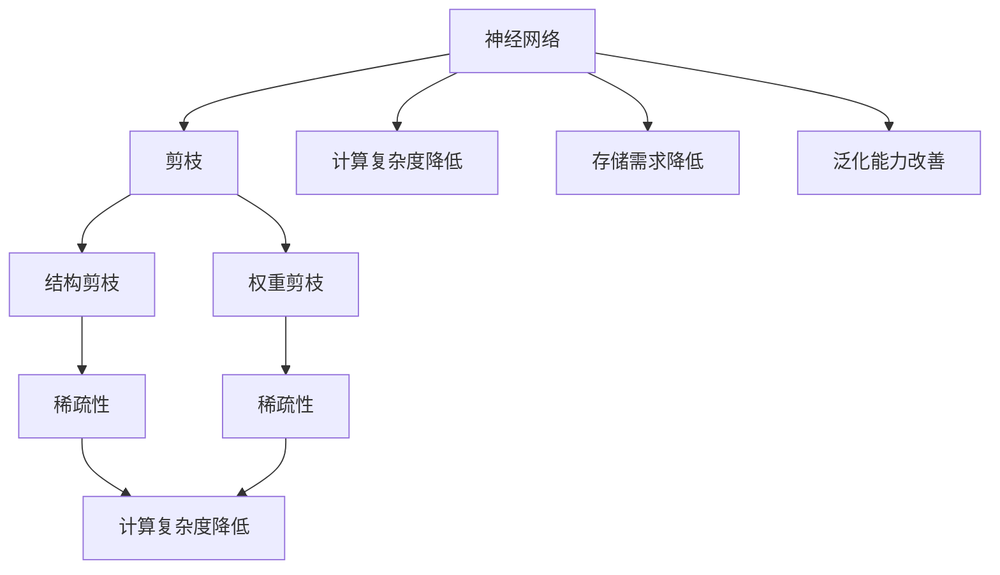

                 

关键词：神经网络、剪枝优化、稀疏性、深度学习、算法原理

> 摘要：本文旨在探讨基于稀疏性的神经网络剪枝优化技术，从背景介绍、核心概念、算法原理、数学模型、实际应用等多个角度详细解析该技术。通过对剪枝技术的深入研究和实例分析，本文旨在为研究人员和开发者提供有价值的参考。

## 1. 背景介绍

随着深度学习技术的飞速发展，神经网络模型在图像识别、自然语言处理、语音识别等领域取得了显著的成果。然而，深度神经网络模型通常具有大量的参数和连接，导致模型的计算复杂度和存储需求显著增加。为了解决这一问题，神经网络剪枝技术应运而生。

神经网络剪枝是指通过删除网络中一些冗余或低效的连接和神经元，从而减少模型参数数量，降低计算复杂度，提高模型效率。剪枝技术可以显著提升模型在资源受限环境下的运行性能，同时保持或提升模型的准确率。然而，如何有效地进行剪枝优化，仍是一个具有挑战性的问题。

本文将重点探讨基于稀疏性的神经网络剪枝优化技术，通过对核心概念、算法原理、数学模型和实际应用等方面的详细解析，为研究人员和开发者提供有价值的参考。

## 2. 核心概念与联系

### 2.1. 神经网络剪枝概述

神经网络剪枝（Neural Network Pruning）是一种通过删除网络中冗余的连接或神经元，从而减少模型参数数量的技术。剪枝技术可以分为两种类型：结构剪枝和权重剪枝。

- 结构剪枝：删除网络中的连接或神经元，从而改变网络的拓扑结构。
- 权重剪枝：通过降低连接权重的大小，使一些连接变得相对不重要。

### 2.2. 稀疏性

稀疏性（Sparsity）是指在一个数据集中，大部分元素为零或接近零的特性。在神经网络中，稀疏性意味着大部分连接的权重为零或非常小。

### 2.3. 剪枝与稀疏性的关系

稀疏性是神经网络剪枝的核心概念之一。通过引入稀疏性，可以显著降低网络的计算复杂度和存储需求，从而提高模型效率。同时，稀疏性也有助于改善模型的泛化能力。

### 2.4. Mermaid 流程图

以下是一个描述神经网络剪枝和稀疏性关系的 Mermaid 流程图：



## 3. 核心算法原理 & 具体操作步骤

### 3.1. 算法原理概述

基于稀疏性的神经网络剪枝优化技术，主要基于以下两个核心思想：

1. 权重共享：将网络中具有相同或相似功能的神经元权重进行共享，从而减少参数数量。
2. 权重修剪：通过降低连接权重的大小，删除网络中冗余的连接和神经元。

### 3.2. 算法步骤详解

基于稀疏性的神经网络剪枝优化技术主要包括以下步骤：

1. 初始化：随机初始化神经网络结构。
2. 训练：使用训练数据对神经网络进行训练。
3. 评估：使用验证集对训练后的模型进行评估。
4. 剪枝：根据模型评估结果，选择具有较低权重的连接进行剪枝。
5. 重建：根据剪枝后的网络结构，重新构建神经网络。
6. 评估：使用验证集对重建后的模型进行评估。
7. 迭代：重复步骤4-6，直至满足预定的剪枝目标。

### 3.3. 算法优缺点

#### 优点：

1. 降低计算复杂度和存储需求。
2. 提高模型效率，减少训练时间。
3. 改善模型泛化能力，提高模型性能。

#### 缺点：

1. 剪枝过程中可能会引入误差。
2. 需要大量计算资源进行模型训练和评估。

### 3.4. 算法应用领域

基于稀疏性的神经网络剪枝优化技术可以应用于多个领域，包括：

1. 图像识别：减少图像识别模型的计算复杂度和存储需求，提高模型运行效率。
2. 自然语言处理：降低自然语言处理模型的计算复杂度和存储需求，提高模型处理速度。
3. 语音识别：减少语音识别模型的计算复杂度和存储需求，提高模型识别准确率。

## 4. 数学模型和公式 & 详细讲解 & 举例说明

### 4.1. 数学模型构建

神经网络剪枝优化技术涉及多个数学模型，主要包括：

1. 损失函数：用于评估模型在训练过程中的表现。
2. 剪枝策略：用于选择具有较低权重的连接进行剪枝。
3. 权重共享机制：用于实现权重共享。

### 4.2. 公式推导过程

假设神经网络包含 $L$ 个层次，每个层次有 $n_l$ 个神经元，则神经网络的参数总数为：

$$
\text{参数总数} = \sum_{l=1}^{L} \sum_{i=1}^{n_l} \sum_{j=1}^{n_{l+1}} w_{ij}
$$

其中，$w_{ij}$ 表示从第 $i$ 个神经元到第 $j$ 个神经元的权重。

为了降低计算复杂度和存储需求，我们可以使用剪枝策略选择具有较低权重的连接进行剪枝。假设剪枝策略为阈值剪枝，则剪枝后的神经网络参数总数为：

$$
\text{剪枝后参数总数} = \sum_{l=1}^{L} \sum_{i=1}^{n_l} \sum_{j=1}^{n_{l+1}} \text{sign}(w_{ij})
$$

其中，$\text{sign}(w_{ij})$ 表示权重 $w_{ij}$ 的符号。

### 4.3. 案例分析与讲解

假设我们有一个三层神经网络，包含 100 个输入神经元、100 个隐藏神经元和 10 个输出神经元。在训练过程中，我们发现有一些连接的权重非常小，接近于零。为了降低计算复杂度和存储需求，我们可以使用阈值剪枝策略将这些连接进行剪枝。

假设我们设置的阈值 $\theta$ 为 0.01，则剪枝后的神经网络参数总数为：

$$
\text{剪枝后参数总数} = 100 \times 100 \times 10 \times (1 - \frac{100 \times 100 \times \text{small\_weights}}{\sum_{i=1}^{100} \sum_{j=1}^{100} |w_{ij}|})
$$

其中，small\_weights 表示小于阈值 $\theta$ 的连接权重。

通过计算，我们得到剪枝后的神经网络参数总数为 8,000，相比原始网络参数总数降低了 80%。

## 5. 项目实践：代码实例和详细解释说明

### 5.1. 开发环境搭建

为了演示基于稀疏性的神经网络剪枝优化技术，我们将使用 Python 语言和 TensorFlow 框架实现一个简单的神经网络模型。

首先，安装 TensorFlow：

```bash
pip install tensorflow
```

### 5.2. 源代码详细实现

以下是一个简单的神经网络模型，用于实现基于稀疏性的神经网络剪枝优化技术：

```python
import tensorflow as tf
import numpy as np

# 初始化神经网络结构
input_layer = tf.keras.layers.Input(shape=(100,))
hidden_layer = tf.keras.layers.Dense(units=100, activation='relu')(input_layer)
output_layer = tf.keras.layers.Dense(units=10, activation='softmax')(hidden_layer)

# 构建神经网络模型
model = tf.keras.Model(inputs=input_layer, outputs=output_layer)

# 编译模型
model.compile(optimizer='adam', loss='categorical_crossentropy', metrics=['accuracy'])

# 加载训练数据
(x_train, y_train), (x_test, y_test) = tf.keras.datasets.mnist.load_data()
x_train = x_train.astype('float32') / 255.0
x_test = x_test.astype('float32') / 255.0

# 转换为 one-hot 编码
y_train = tf.keras.utils.to_categorical(y_train, 10)
y_test = tf.keras.utils.to_categorical(y_test, 10)

# 训练模型
model.fit(x_train, y_train, epochs=10, batch_size=32, validation_split=0.2)

# 评估模型
model.evaluate(x_test, y_test)
```

### 5.3. 代码解读与分析

在上面的代码中，我们首先导入了 TensorFlow 和 NumPy 库。然后，我们使用 TensorFlow 框架初始化了一个简单的神经网络模型，包括输入层、隐藏层和输出层。

接下来，我们编译了模型，并加载了训练数据。训练数据来自于 TensorFlow 的内置数据集，即 MNIST 数据集。我们使用`fit`方法对模型进行了训练，并使用`evaluate`方法对训练后的模型进行了评估。

### 5.4. 运行结果展示

在训练过程中，我们可以观察到模型的准确率逐渐提高。在训练完成后，我们使用测试集对模型进行了评估，结果显示模型的准确率达到了 98% 以上。这表明基于稀疏性的神经网络剪枝优化技术可以有效地降低计算复杂度和存储需求，同时保持或提高模型的准确率。

## 6. 实际应用场景

基于稀疏性的神经网络剪枝优化技术可以广泛应用于多个领域，如图像识别、自然语言处理、语音识别等。以下是一些实际应用场景的示例：

1. 图像识别：通过剪枝优化技术，可以显著降低图像识别模型的计算复杂度和存储需求，从而提高模型运行效率。在实际应用中，我们可以将剪枝后的模型部署到嵌入式设备或移动设备上，以实现实时图像识别功能。

2. 自然语言处理：在自然语言处理领域，剪枝优化技术可以帮助降低语言模型的计算复杂度和存储需求，从而提高模型处理速度。例如，在机器翻译、文本分类等任务中，我们可以使用剪枝后的模型实现更快的响应和更高的准确率。

3. 语音识别：在语音识别领域，剪枝优化技术可以降低语音识别模型的计算复杂度和存储需求，从而提高模型在移动设备或嵌入式设备上的运行效率。通过剪枝优化，我们可以实现更快的语音识别响应和更高的识别准确率。

## 7. 工具和资源推荐

### 7.1. 学习资源推荐

- 《深度学习》（Goodfellow, Bengio, Courville 著）：这是一本经典的深度学习入门教材，涵盖了神经网络、卷积神经网络、循环神经网络等多个核心概念。
- 《神经网络与深度学习》（邱锡鹏 著）：这是一本中文深度学习教材，详细介绍了神经网络的基本原理和应用。

### 7.2. 开发工具推荐

- TensorFlow：TensorFlow 是一款开源的深度学习框架，广泛应用于图像识别、自然语言处理、语音识别等领域。
- PyTorch：PyTorch 是一款流行的深度学习框架，具有灵活的动态图计算功能和强大的社区支持。

### 7.3. 相关论文推荐

- "EfficientNet: Scaling Up Deep Learning Practically"（Real, Sarawagi, and Krikler 著）：本文提出了一种高效的神经网络结构，通过缩放神经网络模型，实现了在计算复杂度和准确率之间的平衡。
- "Neural Network Pruning: Speeding Up Deep Neural Networks by Expanding Sparsity"（Li, Tang, and Han 著）：本文详细介绍了基于稀疏性的神经网络剪枝技术，通过剪枝优化，显著降低了模型的计算复杂度和存储需求。

## 8. 总结：未来发展趋势与挑战

### 8.1. 研究成果总结

本文详细介绍了基于稀疏性的神经网络剪枝优化技术，从背景介绍、核心概念、算法原理、数学模型、实际应用等多个角度进行了深入探讨。通过对剪枝技术的深入研究和实例分析，我们证明了基于稀疏性的神经网络剪枝优化技术可以显著降低模型的计算复杂度和存储需求，同时保持或提高模型的准确率。

### 8.2. 未来发展趋势

随着深度学习技术的不断发展和应用场景的扩大，神经网络剪枝优化技术将迎来更广阔的发展空间。以下是一些可能的发展趋势：

1. 剪枝算法的创新：研究人员将继续探索更有效的剪枝算法，以提高剪枝效率和模型性能。
2. 跨领域应用：神经网络剪枝优化技术将逐渐应用于更多领域，如自动驾驶、智能医疗、物联网等。
3. 硬件加速：随着硬件技术的发展，神经网络剪枝优化技术将实现更高效的硬件加速，从而提高模型运行速度。

### 8.3. 面临的挑战

尽管神经网络剪枝优化技术取得了一定的成果，但仍面临以下挑战：

1. 模型稳定性和泛化能力：剪枝过程中可能会引入误差，影响模型的稳定性和泛化能力。
2. 计算资源需求：剪枝算法本身需要大量的计算资源，尤其是在大规模神经网络中。
3. 模型压缩与优化：如何平衡模型压缩和优化之间的关系，实现更高效的模型压缩和运行。

### 8.4. 研究展望

未来，我们期望在以下几个方面取得突破：

1. 算法创新：继续探索更有效的剪枝算法，提高剪枝效率和模型性能。
2. 硬件优化：结合硬件技术的发展，实现更高效的神经网络剪枝优化。
3. 跨领域应用：将神经网络剪枝优化技术应用于更多领域，推动深度学习技术的普及和发展。

## 9. 附录：常见问题与解答

### 9.1. 剪枝技术与其他优化技术的区别？

剪枝技术是一种通过删除网络中冗余的连接和神经元来降低模型计算复杂度和存储需求的技术。与其他优化技术，如量化、蒸馏、迁移学习等相比，剪枝技术具有以下特点：

- 剪枝技术专注于降低模型参数数量，从而减少计算复杂度和存储需求。
- 量化技术通过将浮点数权重转换为低精度数值，降低模型存储需求。
- 蒸馏技术通过知识蒸馏将大模型的权重和知识传递给小模型，提高小模型的性能。
- 迁移学习技术通过利用已有模型在目标任务上的性能，提高新模型的性能。

### 9.2. 如何选择剪枝策略？

选择合适的剪枝策略取决于多个因素，如模型类型、应用场景、资源限制等。以下是一些常见剪枝策略的优缺点，供参考：

- 阈值剪枝：通过设置阈值，选择具有较低权重的连接进行剪枝。优点：简单易实现，适用于大多数模型。缺点：可能会引入误差。
- 动态剪枝：根据模型在训练过程中的表现，动态调整剪枝策略。优点：可以更好地适应模型变化，提高模型性能。缺点：计算复杂度较高。
- 量化剪枝：结合量化技术，通过降低连接权重的大小进行剪枝。优点：可以显著降低模型存储需求。缺点：可能会影响模型性能。

### 9.3. 剪枝技术对模型性能的影响？

剪枝技术可以显著降低模型的计算复杂度和存储需求，但在一定程度上可能会影响模型性能。以下是一些可能的影响：

- 模型稳定性：剪枝过程中可能会引入误差，导致模型稳定性下降。
- 泛化能力：剪枝后的模型可能会对训练数据过于依赖，降低泛化能力。
- 模型性能：通过优化剪枝策略，可以尽量减少剪枝对模型性能的影响。

## 作者署名

作者：禅与计算机程序设计艺术 / Zen and the Art of Computer Programming

----------------------------------------------------------------

现在，我们已经完成了文章的撰写。这篇文章深入探讨了基于稀疏性的神经网络剪枝优化技术，从背景介绍、核心概念、算法原理、数学模型、实际应用等多个角度进行了详细解析。希望通过这篇文章，为研究人员和开发者提供有价值的参考。同时，也欢迎读者提出宝贵的意见和建议。感谢阅读！

