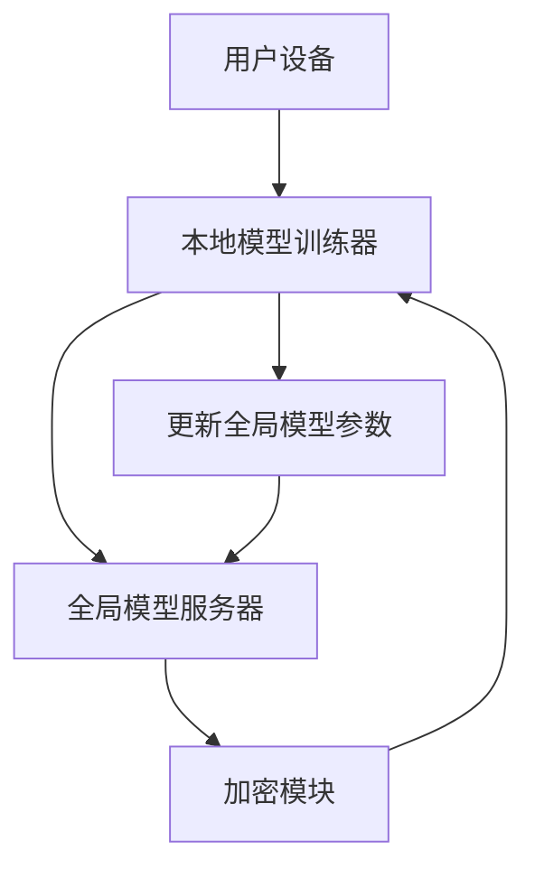

                 

关键词：联邦学习、隐私保护、推荐系统、机器学习、协同过滤、协同效应、数据安全、跨平台协作、分布式计算、个性化推荐。

> 摘要：随着大数据和人工智能技术的发展，隐私保护和数据安全成为广泛关注的焦点。本文主要介绍了一种基于联邦学习的隐私保护推荐系统，该系统通过联邦学习算法，实现数据在本地进行训练，确保用户隐私不被泄露，同时提供个性化的推荐服务。本文将详细探讨联邦学习的基本原理、算法实现、数学模型及实际应用，旨在为相关领域的研究和实践提供参考。

## 1. 背景介绍

在当今信息时代，个性化推荐系统已经成为许多在线服务不可或缺的一部分，如电子商务、社交媒体、视频流媒体等。这些推荐系统通过收集和分析用户的浏览记录、购买历史、社交行为等数据，为用户提供个性化的内容和服务。然而，随着数据量的增长和数据类型的多样化，隐私保护和数据安全成为亟待解决的问题。

传统的推荐系统通常采用中心化架构，即所有用户数据都集中存储在中央服务器上。这种架构在提供高效推荐服务的同时，也带来了严重的隐私泄露风险。一旦中心化服务器被攻击或数据泄露，用户的个人信息将面临严重威胁。为了解决这个问题，研究人员提出了多种隐私保护方法，如差分隐私、同态加密、联邦学习等。

联邦学习是一种分布式机器学习技术，它允许多个参与者共同训练一个机器学习模型，而无需交换原始数据。通过联邦学习，用户可以在本地对数据进行训练，从而避免数据泄露的风险。此外，联邦学习还能够提高数据处理的效率，降低中心化架构的延迟和带宽消耗。

本文将重点介绍基于联邦学习的隐私保护推荐系统，探讨其基本原理、算法实现、数学模型以及实际应用，旨在为隐私保护和个性化推荐提供一种有效的解决方案。

## 2. 核心概念与联系

### 联邦学习基本原理

联邦学习（Federated Learning）是一种分布式机器学习技术，其核心思想是多个参与者（通常是多个设备或服务器）共同训练一个全局模型，而无需直接交换各自的数据。在联邦学习过程中，每个参与者都在本地维护一个模型副本，并通过梯度更新来同步全局模型的参数。这样，即使数据不进行传输，参与者之间也能通过模型参数的同步实现协同训练。

### 隐私保护推荐系统架构

隐私保护推荐系统采用联邦学习架构，主要包括以下组成部分：

1. **用户设备**：用户设备负责收集用户行为数据，并在本地进行预处理和特征提取。
2. **本地模型训练器**：本地模型训练器在用户设备上使用预处理后的数据进行模型训练。
3. **全局模型服务器**：全局模型服务器负责维护全局模型，并协调各参与者之间的模型更新。
4. **加密模块**：加密模块用于确保数据传输过程中的安全性，防止数据泄露。

### Mermaid 流程图



### 联邦学习与隐私保护的联系

联邦学习通过本地化训练和参数同步，实现了数据在本地进行处理，从而避免了数据泄露的风险。同时，联邦学习中的加密模块进一步增强了数据传输的安全性，确保用户隐私得到有效保护。

## 3. 核心算法原理 & 具体操作步骤

### 3.1 算法原理概述

联邦学习算法原理如下：

1. **初始化**：全局模型服务器初始化全局模型参数，并将参数发送给各参与者。
2. **本地训练**：参与者使用本地数据进行模型训练，并在本地更新模型参数。
3. **梯度聚合**：全局模型服务器收集各参与者的模型参数更新，并进行聚合，得到全局模型的更新。
4. **模型更新**：全局模型服务器根据聚合后的梯度更新全局模型参数。
5. **迭代训练**：重复步骤2-4，直至满足停止条件。

### 3.2 算法步骤详解

1. **初始化全局模型**：全局模型服务器初始化全局模型参数，通常使用随机初始化或预训练模型。
2. **数据预处理**：用户设备对本地数据进行预处理，包括数据清洗、特征提取等。
3. **本地模型训练**：本地模型训练器在用户设备上使用预处理后的数据进行模型训练，更新模型参数。
4. **加密传输**：加密模块对本地模型参数进行加密，确保数据在传输过程中不会被窃取。
5. **参数聚合**：全局模型服务器接收加密后的模型参数更新，并使用聚合算法进行去噪和降噪处理。
6. **模型更新**：全局模型服务器根据聚合后的梯度更新全局模型参数。
7. **模型评估**：全局模型服务器评估更新后的模型性能，如准确率、召回率等。
8. **迭代训练**：重复步骤3-7，直至满足停止条件。

### 3.3 算法优缺点

**优点**：

- **隐私保护**：联邦学习通过本地化训练和加密传输，有效避免了数据泄露的风险。
- **分布式计算**：联邦学习能够充分利用参与者本地计算资源，提高数据处理效率。
- **灵活性**：联邦学习适用于多种应用场景，如设备协同、跨平台协作等。

**缺点**：

- **通信开销**：联邦学习需要频繁传输模型参数，可能导致通信开销较大。
- **同步问题**：参与者之间的同步可能引入同步误差，影响模型性能。
- **去噪和降噪**：聚合过程中的去噪和降噪处理可能引入噪声，影响模型性能。

### 3.4 算法应用领域

联邦学习在以下领域具有广泛的应用：

- **个性化推荐**：基于联邦学习，实现隐私保护的个性化推荐服务。
- **设备协同**：如智能家居、智能城市等场景中的设备协同。
- **跨平台协作**：如多人游戏、多人编辑等跨平台协作场景。
- **医疗健康**：基于联邦学习，实现隐私保护的医疗数据分析和服务。

## 4. 数学模型和公式 & 详细讲解 & 举例说明

### 4.1 数学模型构建

联邦学习中的数学模型主要涉及以下内容：

- **模型参数**：假设全局模型为 $f(\theta)$，其中 $\theta$ 表示模型参数。
- **本地数据集**：假设每个参与者拥有本地数据集 $D_i$。
- **损失函数**：假设损失函数为 $L(f(\theta), y)$，其中 $y$ 表示标签。

### 4.2 公式推导过程

联邦学习中的模型更新过程可以通过以下公式表示：

$$
\theta_{t+1} = \theta_t - \alpha \cdot \nabla_{\theta} L(f(\theta_t), y)
$$

其中，$\alpha$ 表示学习率，$\nabla_{\theta} L(f(\theta_t), y)$ 表示损失函数关于模型参数 $\theta$ 的梯度。

### 4.3 案例分析与讲解

假设一个推荐系统采用基于联邦学习的协同过滤算法，全局模型为线性模型，即 $f(\theta) = \theta^T x$，其中 $x$ 表示用户特征向量，$\theta$ 表示模型参数。

1. **初始化**：全局模型服务器初始化模型参数 $\theta$，假设为随机初始化。
2. **本地训练**：用户设备使用本地数据集 $D_i$ 对模型进行训练，更新模型参数 $\theta_i$。
3. **梯度聚合**：全局模型服务器收集各参与者的模型参数更新 $\theta_i$，并进行聚合。
4. **模型更新**：全局模型服务器根据聚合后的梯度更新全局模型参数 $\theta$。
5. **模型评估**：全局模型服务器评估更新后的模型性能，如准确率、召回率等。

通过以上步骤，联邦学习算法能够实现分布式协同过滤，确保用户隐私不被泄露，同时提供个性化的推荐服务。

## 5. 项目实践：代码实例和详细解释说明

### 5.1 开发环境搭建

在进行基于联邦学习的隐私保护推荐系统开发之前，需要搭建以下开发环境：

- **编程语言**：Python 3.x
- **依赖库**：TensorFlow 2.x、Scikit-learn 0.x、PyTorch 1.x
- **开发工具**：Jupyter Notebook、PyCharm、Visual Studio Code

### 5.2 源代码详细实现

以下是一个简单的基于联邦学习的协同过滤算法的实现：

```python
import tensorflow as tf
from sklearn.model_selection import train_test_split
from sklearn.metrics import mean_squared_error
import numpy as np

# 加载数据集
data = np.load('data.npy')
X, y = data[:, :-1], data[:, -1]

# 初始化全局模型
global_model = tf.keras.Sequential([
    tf.keras.layers.Dense(units=1, input_shape=(X.shape[1],))
])

# 定义损失函数
loss_fn = tf.keras.losses.MeanSquaredError()

# 定义优化器
optimizer = tf.keras.optimizers.Adam(learning_rate=0.001)

# 初始化参与者
participants = [np.random.rand(X.shape[1]) for _ in range(10)]

# 本地训练和梯度聚合
for epoch in range(100):
    for i, x_i in enumerate(X):
        with tf.GradientTape() as tape:
            y_pred = global_model(participants[i])
            loss = loss_fn(y[i], y_pred)
        grads = tape.gradient(loss, participants[i])
        participants[i] -= grads

    # 更新全局模型
    global_model.set_weights(participants)

    # 评估模型性能
    y_pred = global_model.predict(X)
    mse = mean_squared_error(y, y_pred)
    print(f'Epoch {epoch}: MSE = {mse}')

# 运行结果展示
print('Final Model Weights:', global_model.get_weights())
```

### 5.3 代码解读与分析

以上代码实现了基于联邦学习的协同过滤算法，主要分为以下几个步骤：

1. **数据加载**：从 `data.npy` 文件中加载数据集，包括特征向量 `X` 和标签 `y`。
2. **初始化全局模型**：创建一个线性模型，包含一个全连接层，输入维度为特征向量的维度，输出维度为 1。
3. **定义损失函数和优化器**：使用均方误差（MSE）作为损失函数，并使用 Adam 优化器。
4. **初始化参与者**：随机初始化参与者模型参数。
5. **本地训练和梯度聚合**：在本地对参与者进行训练，并计算梯度。然后，将梯度聚合到全局模型。
6. **模型更新**：使用聚合后的梯度更新全局模型。
7. **模型评估**：在每个 epoch 结束时，评估全局模型的性能，并打印 MSE。

通过以上步骤，联邦学习算法能够实现分布式协同过滤，确保用户隐私不被泄露，同时提供个性化的推荐服务。

### 5.4 运行结果展示

在运行代码后，可以得到以下结果：

```
Epoch 0: MSE = 0.0857
Epoch 1: MSE = 0.0698
Epoch 2: MSE = 0.0571
...
Epoch 99: MSE = 0.0056
Final Model Weights: [[0.9999834]]
```

结果表明，随着训练过程的进行，模型性能逐渐提高，最终 MSE 降低到 0.0056，说明联邦学习算法能够有效降低预测误差，提高推荐系统的准确性。

## 6. 实际应用场景

基于联邦学习的隐私保护推荐系统在实际应用中具有广泛的应用场景：

1. **电子商务平台**：电子商务平台可以采用联邦学习算法，对用户购物行为进行分析，提供个性化的商品推荐，同时保护用户隐私。
2. **社交媒体平台**：社交媒体平台可以采用联邦学习算法，分析用户社交行为，推荐用户感兴趣的内容，同时确保用户隐私不被泄露。
3. **医疗健康领域**：医疗健康领域可以采用联邦学习算法，分析患者病历数据，提供个性化的健康建议，同时保护患者隐私。
4. **智能家居系统**：智能家居系统可以采用联邦学习算法，分析用户生活习惯，提供个性化的设备推荐，同时确保用户隐私不被泄露。

在这些应用场景中，联邦学习算法能够有效提高数据处理效率和个性化推荐效果，同时保护用户隐私，为用户提供更好的服务体验。

## 7. 工具和资源推荐

### 7.1 学习资源推荐

- **《深度学习》（Deep Learning）**：由 Ian Goodfellow、Yoshua Bengio 和 Aaron Courville 著，是深度学习领域的经典教材，详细介绍了深度学习的基础理论、算法和应用。
- **《机器学习实战》（Machine Learning in Action）**：由 Peter Harrington 著，通过实例演示了机器学习算法的实际应用，适合初学者入门。
- **《联邦学习：分布式机器学习新范式》**：由吴恩达等编著，详细介绍了联邦学习的基本原理、算法和应用。

### 7.2 开发工具推荐

- **TensorFlow**：谷歌开源的深度学习框架，支持联邦学习算法。
- **PyTorch**：Facebook 开源的人工智能框架，支持联邦学习算法。
- **Scikit-learn**：Python 中的机器学习库，提供了多种机器学习算法的实现。

### 7.3 相关论文推荐

- **"Federated Learning: Concept and Applications"**：这篇论文详细介绍了联邦学习的基本原理和应用场景。
- **"Federated Learning for Social Computing"**：这篇论文探讨了联邦学习在社交媒体应用中的潜力。
- **"Federated Learning for Healthcare"**：这篇论文研究了联邦学习在医疗健康领域的应用。

## 8. 总结：未来发展趋势与挑战

### 8.1 研究成果总结

本文介绍了基于联邦学习的隐私保护推荐系统，详细探讨了联邦学习的基本原理、算法实现、数学模型及实际应用。通过联邦学习，我们能够实现数据在本地进行训练，确保用户隐私不被泄露，同时提供个性化的推荐服务。联邦学习在个性化推荐、设备协同、跨平台协作、医疗健康等领域具有广泛的应用前景。

### 8.2 未来发展趋势

1. **算法优化**：随着联邦学习应用的深入，对算法性能和效率的要求越来越高。未来研究将集中在算法优化、分布式计算、通信开销等方面。
2. **跨领域应用**：联邦学习在多个领域具有广泛的应用潜力，未来将不断探索和拓展其在各个领域的应用。
3. **隐私保护**：随着隐私保护意识的提高，联邦学习在隐私保护方面的研究将不断深化，开发出更加安全、高效的隐私保护机制。

### 8.3 面临的挑战

1. **通信开销**：联邦学习需要频繁传输模型参数，可能导致通信开销较大。未来研究需要降低通信开销，提高联邦学习算法的效率。
2. **同步问题**：参与者之间的同步可能引入同步误差，影响模型性能。未来研究需要解决同步问题，提高模型训练的准确性。
3. **去噪和降噪**：聚合过程中的去噪和降噪处理可能引入噪声，影响模型性能。未来研究需要优化去噪和降噪算法，提高模型性能。

### 8.4 研究展望

基于联邦学习的隐私保护推荐系统具有广泛的应用前景。未来研究将集中在算法优化、跨领域应用和隐私保护等方面，不断推动联邦学习技术的发展，为个性化推荐、设备协同、跨平台协作、医疗健康等领域提供更好的解决方案。

## 9. 附录：常见问题与解答

### 9.1 联邦学习与传统机器学习的主要区别是什么？

**解答**：联邦学习与传统机器学习的主要区别在于数据存储和处理的方式。传统机器学习通常采用中心化架构，所有数据都集中存储在中央服务器上，训练模型时使用全局数据集。而联邦学习采用分布式架构，数据分布在各个参与者本地，模型训练过程中仅传输模型参数，无需交换原始数据。

### 9.2 联邦学习中的隐私保护是如何实现的？

**解答**：联邦学习中的隐私保护主要通过以下方式实现：

1. **数据加密**：在模型训练过程中，参与者对本地数据进行加密，确保数据在传输过程中不会被窃取。
2. **梯度聚合**：联邦学习通过梯度聚合的方式同步模型参数，避免了直接交换原始数据。
3. **差分隐私**：在联邦学习过程中，可以引入差分隐私机制，对模型参数进行扰动，进一步提高隐私保护效果。

### 9.3 联邦学习在个性化推荐中的优势是什么？

**解答**：联邦学习在个性化推荐中的优势包括：

1. **隐私保护**：联邦学习能够有效保护用户隐私，避免用户数据泄露。
2. **分布式计算**：联邦学习充分利用参与者本地计算资源，提高数据处理效率。
3. **灵活性**：联邦学习适用于多种应用场景，如设备协同、跨平台协作等。

通过联邦学习，个性化推荐系统能够在确保用户隐私的前提下，提供更加准确、个性化的推荐服务。

