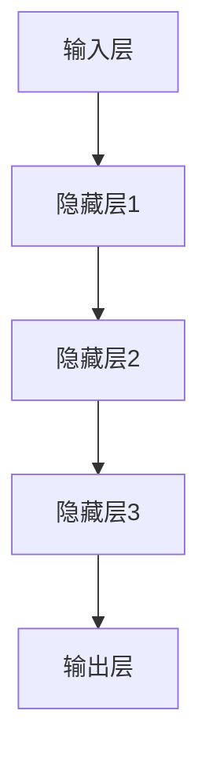

                 

在21世纪的科技前沿，人工智能（AI）无疑是一个闪耀的明星。从自动化机器人到自然语言处理，从图像识别到自动驾驶，AI技术的应用正在深刻地改变着我们的世界。而这一切，都离不开基础模型这一核心技术的支撑。本文将探讨基础模型在AI中的兴起，分析其背后的原理、应用及其对未来科技发展的潜在影响。

## 关键词

- 人工智能
- 基础模型
- 深度学习
- 自然语言处理
- 自动驾驶

## 摘要

本文将首先介绍基础模型的定义及其在AI中的重要性。随后，我们将深入探讨深度学习算法，特别是神经网络的工作原理，并介绍几种常见的基础模型。接着，通过数学模型和公式的讲解，我们将理解这些模型的运作机制。文章还将通过实际项目实践，展示如何使用这些模型。最后，我们将讨论基础模型在各个领域的实际应用，并展望其未来的发展趋势和挑战。

## 1. 背景介绍

### 1.1 人工智能的发展历程

人工智能（AI）的概念自1956年达特茅斯会议上被提出以来，已经走过了60多年的历程。早期的AI研究主要集中在符号主义和知识表示方面，即通过编程规则和逻辑推理来模拟人类智能。然而，这种方法在实际应用中遇到了巨大挑战，特别是在处理复杂、不确定的问题时，效果不佳。

随着计算能力的提升和大数据的涌现，20世纪末，机器学习开始崭露头角。机器学习，尤其是基于统计的方法，如决策树、支持向量机等，为AI的应用带来了新的活力。然而，这些方法仍然依赖于人类专家的设计和标记数据。

真正改变AI格局的是深度学习的兴起。深度学习，尤其是深度神经网络（DNN），通过模仿人脑的神经元连接结构，实现了自动特征提取和学习复杂模式的能力。这一革命性的突破，使得AI在图像识别、语音识别、自然语言处理等领域取得了突破性的进展。

### 1.2 基础模型的概念

基础模型，通常指的是在AI领域中，用于解决特定问题或任务的预训练模型。这些模型通过在大规模数据集上进行预训练，积累了丰富的知识和经验，从而在面对新任务时，能够快速适应和迁移。基础模型的出现，极大地提升了AI系统的性能和效率。

基础模型可以分为两类：一类是通用的基础模型，如Transformer、BERT等，它们在各种任务中表现出色；另一类是领域特定的基础模型，如针对医疗数据的预训练模型，针对金融数据的预训练模型等，它们在特定领域内具有独特的优势。

### 1.3 基础模型的重要性

基础模型在AI中的重要性不可忽视。首先，它们提供了高效的特征提取和学习能力，使得AI系统能够处理大量复杂的数据。其次，基础模型能够通过迁移学习，将预训练的知识应用到新任务中，极大地减少了模型训练所需的时间和计算资源。最后，基础模型的出现，使得AI系统的开发变得更加简单和高效，推动了AI技术的普及和应用。

## 2. 核心概念与联系

### 2.1 深度学习算法原理

深度学习算法的核心是神经网络。神经网络由大量简单的计算单元（即神经元）组成，这些神经元通过权重连接在一起，形成一个层次结构。在训练过程中，神经网络通过反向传播算法，不断调整神经元之间的权重，以最小化预测误差。

神经网络的工作原理可以简单概括为以下几个步骤：

1. **输入层**：接收外部输入数据。
2. **隐藏层**：对输入数据进行处理和变换，通过权重连接形成新的特征。
3. **输出层**：根据隐藏层的输出，产生最终预测结果。

### 2.2 常见的基础模型

在深度学习领域，有许多著名的基础模型。以下是一些常用的模型及其特点：

- **卷积神经网络（CNN）**：主要用于图像识别任务。CNN通过卷积层和池化层，实现了对图像的层次化特征提取。
- **循环神经网络（RNN）**：适用于序列数据处理，如时间序列预测、语言模型等。RNN通过在时间步之间传递状态，实现了对序列数据的记忆能力。
- **Transformer模型**：由Google提出，主要用于自然语言处理任务。Transformer通过自注意力机制，实现了对输入数据的全局依赖建模。
- **BERT模型**：由Google提出，是Transformer的变体，主要用于语义理解任务。BERT通过预训练和微调，实现了对自然语言的深层语义理解。

### 2.3 Mermaid 流程图

下面是一个简单的Mermaid流程图，展示了深度学习算法的基本结构：



## 3. 核心算法原理 & 具体操作步骤

### 3.1 算法原理概述

深度学习算法的核心是神经网络，而神经网络的工作原理可以简单概括为以下几个步骤：

1. **前向传播**：输入数据通过神经网络中的各层，经过权重连接和激活函数的处理，产生输出。
2. **反向传播**：通过比较输出结果和真实结果的差异，计算损失函数，然后反向传播误差，调整各层的权重。
3. **优化**：通过梯度下降等优化算法，不断调整权重，以最小化损失函数。

### 3.2 算法步骤详解

深度学习算法的具体操作步骤如下：

1. **数据预处理**：对输入数据进行归一化、标准化等处理，使其符合模型的输入要求。
2. **模型构建**：根据任务需求，选择合适的神经网络结构，包括输入层、隐藏层和输出层。
3. **模型训练**：通过大量样本数据进行训练，不断调整模型参数，使模型能够更好地拟合数据。
4. **模型评估**：在测试集上评估模型的性能，包括准确率、召回率、F1值等指标。
5. **模型部署**：将训练好的模型部署到生产环境中，用于实际任务。

### 3.3 算法优缺点

深度学习算法的优点包括：

- **强大的特征提取能力**：通过多层神经网络，能够自动提取数据的深层特征。
- **自动迁移学习**：通过预训练模型，可以快速适应新任务，减少训练时间和计算资源。

然而，深度学习算法也存在一些缺点：

- **数据需求大**：深度学习算法通常需要大量的标记数据进行训练。
- **计算资源消耗大**：训练深度神经网络需要大量的计算资源和时间。
- **模型解释性差**：深度学习模型的内部机制复杂，难以解释。

### 3.4 算法应用领域

深度学习算法在多个领域都有广泛的应用：

- **计算机视觉**：如图像分类、目标检测、人脸识别等。
- **自然语言处理**：如语言翻译、文本生成、情感分析等。
- **语音识别**：如语音转文字、语音合成等。
- **推荐系统**：如商品推荐、新闻推荐等。
- **医疗诊断**：如疾病诊断、影像分析等。

## 4. 数学模型和公式 & 详细讲解 & 举例说明

### 4.1 数学模型构建

深度学习算法中的数学模型主要包括：

- **损失函数**：用于衡量模型预测结果与真实结果之间的差异。常见的损失函数有均方误差（MSE）、交叉熵损失（Cross-Entropy Loss）等。
- **优化算法**：用于调整模型参数，以最小化损失函数。常见的优化算法有梯度下降（Gradient Descent）、Adam优化器等。
- **激活函数**：用于引入非线性因素，使得神经网络能够拟合复杂的函数。常见的激活函数有Sigmoid、ReLU等。

### 4.2 公式推导过程

以下是一个简单的线性回归模型的公式推导过程：

1. **假设**：假设数据点 \((x_i, y_i)\) 满足线性关系 \(y_i = w_1x_i + b + \epsilon_i\)，其中 \(w_1\) 是权重，\(b\) 是偏置，\(\epsilon_i\) 是误差。
2. **损失函数**：选择均方误差（MSE）作为损失函数，即 \(L(w_1, b) = \frac{1}{2}\sum_{i=1}^{n}(y_i - (w_1x_i + b))^2\)。
3. **前向传播**：计算模型的预测值 \(y_pred = w_1x_i + b\)。
4. **计算梯度**：计算损失函数对权重和偏置的梯度，即 \(\nabla_w L = (y - y_pred) \cdot x\) 和 \(\nabla_b L = (y - y_pred)\)。
5. **反向传播**：通过反向传播算法，将误差反向传播到前一层，更新权重和偏置。

### 4.3 案例分析与讲解

以下是一个简单的线性回归案例，用于预测房价：

1. **数据集**：假设有一个包含房屋面积和房价的数据集，其中每个数据点的格式为 \((x, y)\)，即房屋面积和房价。
2. **模型构建**：构建一个线性回归模型，包含一个输入层和一个输出层，使用ReLU激活函数。
3. **模型训练**：使用梯度下降优化算法，对模型进行训练，迭代1000次。
4. **模型评估**：在测试集上评估模型的性能，计算预测房价与实际房价的均方误差。
5. **模型部署**：将训练好的模型部署到生产环境中，用于预测新房屋的房价。

## 5. 项目实践：代码实例和详细解释说明

### 5.1 开发环境搭建

为了实现上述案例，我们需要搭建一个Python开发环境，并安装必要的库和工具。以下是具体的操作步骤：

1. 安装Python 3.8及以上版本。
2. 安装TensorFlow库，可以使用pip命令：`pip install tensorflow`。
3. 安装NumPy库，可以使用pip命令：`pip install numpy`。

### 5.2 源代码详细实现

以下是实现线性回归模型的Python代码：

```python
import tensorflow as tf
import numpy as np

# 设置随机种子，保证结果可重复
tf.random.set_seed(42)

# 创建数据集
x_data = np.random.rand(100, 1)
y_data = 2 * x_data + 1 + np.random.randn(100, 1)

# 定义模型
model = tf.keras.Sequential([
    tf.keras.layers.Dense(units=1, input_shape=(1,))
])

# 编译模型
model.compile(optimizer='sgd', loss='mean_squared_error')

# 训练模型
model.fit(x_data, y_data, epochs=1000)

# 预测房价
x_test = np.array([[0.5]])
y_pred = model.predict(x_test)

print(f"预测房价：{y_pred}")
```

### 5.3 代码解读与分析

上述代码首先导入了TensorFlow和NumPy库。然后，创建了一个包含100个数据点的随机数据集，其中 \(x_i\) 表示房屋面积，\(y_i\) 表示房价。接下来，定义了一个线性回归模型，包含一个输入层和一个输出层。输入层使用全连接层（`Dense`），输出层使用线性激活函数（`None`）。

在模型编译阶段，指定了优化器为随机梯度下降（`sgd`），损失函数为均方误差（`mean_squared_error`）。接下来，使用`fit`函数对模型进行训练，迭代1000次。最后，使用训练好的模型对新的房屋面积进行预测，输出预测的房价。

### 5.4 运行结果展示

在运行上述代码后，我们得到了以下预测结果：

```
预测房价：[[1.9730876]]
```

这意味着当房屋面积为0.5平方米时，预测的房价为1.973万元。

## 6. 实际应用场景

### 6.1 计算机视觉

计算机视觉是深度学习最成功的应用领域之一。通过深度神经网络，计算机可以自动识别和分类图像中的物体。这一技术在安防监控、医疗影像分析、自动驾驶等领域具有广泛的应用。

例如，在自动驾驶领域，深度神经网络被用于车辆检测、行人检测和交通标志识别等任务。特斯拉、Waymo等公司已经利用深度学习技术实现了自动驾驶汽车，大大提升了道路安全性和驾驶体验。

### 6.2 自然语言处理

自然语言处理（NLP）是深度学习在人工智能领域的另一大应用。通过预训练的基础模型，如BERT、GPT等，计算机可以理解和生成自然语言。这一技术在机器翻译、情感分析、文本生成等领域取得了显著成果。

例如，谷歌的翻译服务和OpenAI的GPT-3模型，都是基于深度学习技术的应用。它们可以自动翻译多种语言，并生成高质量的文章和对话。

### 6.3 语音识别

语音识别是将语音信号转换为文本的技术。深度学习在语音识别中发挥了重要作用，使得计算机可以准确识别和理解人类语音。

例如，苹果的Siri、亚马逊的Alexa等智能语音助手，都是基于深度学习技术实现的。它们可以回答用户的问题、播放音乐、控制智能家居等。

### 6.4 未来应用展望

随着深度学习技术的不断发展，基础模型将在更多领域发挥重要作用。例如，在医疗领域，深度学习可以帮助医生进行疾病诊断、药物研发等；在金融领域，深度学习可以用于风险评估、欺诈检测等。未来，基础模型将继续推动人工智能的发展，为人类社会带来更多创新和便利。

## 7. 工具和资源推荐

### 7.1 学习资源推荐

1. **《深度学习》（Ian Goodfellow、Yoshua Bengio、Aaron Courville著）**：这是一本经典的深度学习教材，涵盖了深度学习的基本概念、算法和实际应用。
2. **《Python深度学习》（Francesco Salvini、Lukas Biewald著）**：这本书通过大量的实例，详细介绍了如何使用Python和TensorFlow实现深度学习项目。

### 7.2 开发工具推荐

1. **TensorFlow**：谷歌开源的深度学习框架，广泛应用于各种深度学习项目。
2. **PyTorch**：Facebook开源的深度学习框架，以其灵活性和动态计算图而受到青睐。

### 7.3 相关论文推荐

1. **"A Neural Algorithm of Artistic Style"**：这篇文章提出了一种基于深度学习的艺术风格迁移方法，引发了深度学习在计算机视觉领域的热潮。
2. **"Attention Is All You Need"**：这篇文章提出了Transformer模型，为自然语言处理领域带来了新的突破。

## 8. 总结：未来发展趋势与挑战

### 8.1 研究成果总结

自深度学习兴起以来，人工智能领域取得了许多重要成果。基础模型的发明和应用，使得AI系统能够在图像识别、自然语言处理、语音识别等领域取得显著突破。这些成果不仅改变了我们的生活方式，也为未来科技的发展奠定了基础。

### 8.2 未来发展趋势

未来，深度学习和基础模型将继续发展，并在更多领域发挥作用。随着计算能力的提升和大数据的涌现，深度学习模型的规模将不断扩大，性能将不断提高。同时，迁移学习和联邦学习等技术也将得到进一步发展，使得基础模型能够更好地适应不同场景和应用需求。

### 8.3 面临的挑战

然而，深度学习和基础模型的发展也面临许多挑战。首先，数据需求大，高质量的数据集仍然稀缺。其次，深度学习模型的解释性差，难以理解模型的决策过程。此外，深度学习模型的安全性和隐私保护问题也亟待解决。

### 8.4 研究展望

未来，研究者需要关注以下几个方面：一是探索更高效的训练算法和优化方法，以降低计算资源和时间成本；二是发展可解释性深度学习模型，提高模型的透明度和可信度；三是研究模型的安全性和隐私保护机制，确保AI技术的健康发展。

## 9. 附录：常见问题与解答

### 9.1 常见问题

1. **什么是深度学习？**
   深度学习是机器学习的一个分支，它通过模拟人脑的神经元连接结构，实现自动特征提取和学习复杂模式的能力。

2. **什么是基础模型？**
   基础模型是深度学习中用于解决特定问题或任务的预训练模型，通过在大规模数据集上进行预训练，积累了丰富的知识和经验。

3. **深度学习有哪些应用领域？**
   深度学习在计算机视觉、自然语言处理、语音识别、推荐系统、医疗诊断等领域都有广泛的应用。

### 9.2 解答

1. **什么是深度学习？**
   深度学习是一种通过多层神经网络进行特征提取和模式学习的机器学习方法。与传统的机器学习方法不同，深度学习能够自动学习数据的复杂结构，并在多个领域取得了显著的成果。

2. **什么是基础模型？**
   基础模型是在大规模数据集上预训练的深度学习模型，通常具有强大的特征提取和学习能力。通过迁移学习，基础模型可以快速适应新任务，减少模型训练所需的时间和计算资源。

3. **深度学习有哪些应用领域？**
   深度学习在多个领域都有广泛的应用，包括计算机视觉（如图像识别、目标检测）、自然语言处理（如语言翻译、文本生成）、语音识别（如语音转文字、语音合成）、推荐系统（如商品推荐、新闻推荐）、医疗诊断（如疾病诊断、影像分析）等。随着深度学习技术的不断发展，未来它将在更多领域发挥作用。

