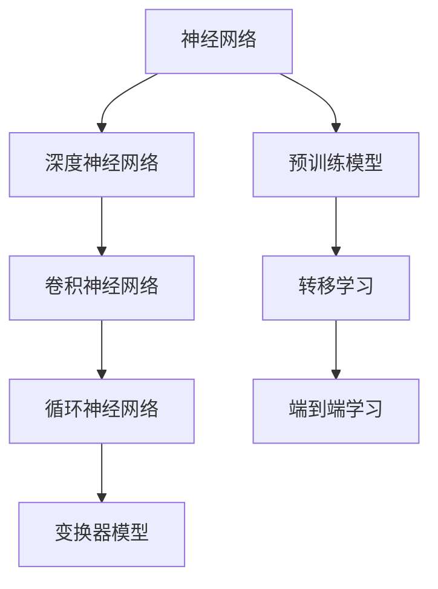

                 

关键词：基础模型，技术标准，规范，深度学习，算法原理，数学模型，应用场景

> 摘要：本文旨在深入探讨基础模型的技术标准与规范，从背景介绍、核心概念与联系、核心算法原理与具体操作步骤、数学模型与公式、项目实践、实际应用场景、未来应用展望、工具和资源推荐以及总结等方面展开讨论。通过对基础模型的全面分析，本文为研究人员和开发人员提供了清晰的技术指导和实践参考。

## 1. 背景介绍

基础模型作为现代人工智能技术发展的基石，正日益受到广泛关注。随着深度学习技术的兴起，基础模型在计算机视觉、自然语言处理、语音识别等领域取得了显著成果。然而，在基础模型的发展过程中，技术标准和规范的重要性逐渐凸显。技术标准与规范不仅有助于确保基础模型的可靠性和可扩展性，还能促进不同研究团队之间的合作与交流。

### 1.1 基础模型的发展历程

基础模型的发展经历了多个阶段。最早的基础模型是人工神经网络（Artificial Neural Networks，ANN），通过模拟生物神经元的连接方式来实现简单任务。随着计算能力的提升和算法的改进，深度神经网络（Deep Neural Networks，DNN）逐渐成为主流。DNN通过多层神经元的堆叠，实现了对复杂数据的高效处理。

近年来，基于深度学习的预训练模型（Pre-trained Models）得到了广泛应用。预训练模型通过在大规模数据集上进行预训练，然后利用转移学习（Transfer Learning）技术在特定任务上进行微调。这种模型不仅具有更好的泛化能力，还能显著提升模型性能。

### 1.2 基础模型的应用领域

基础模型在多个领域取得了突破性进展。在计算机视觉领域，卷积神经网络（Convolutional Neural Networks，CNN）被广泛应用于图像分类、目标检测和图像分割。在自然语言处理领域，循环神经网络（Recurrent Neural Networks，RNN）和变换器（Transformer）模型在文本分类、机器翻译和问答系统等方面表现出色。在语音识别领域，深度神经网络通过端到端的方法实现了语音信号的自动识别和转换。

## 2. 核心概念与联系

为了更好地理解基础模型的技术标准与规范，我们首先需要了解一些核心概念和它们之间的联系。以下是一个简化的 Mermaid 流程图，展示了这些核心概念和它们之间的相互关系。



### 2.1 神经网络

神经网络是一种由大量简单处理单元（神经元）互联而成的复杂网络。每个神经元接收来自其他神经元的输入，并通过权重进行加权求和，最后通过激活函数产生输出。神经网络的基本结构包括输入层、隐藏层和输出层。

### 2.2 深度神经网络

深度神经网络是神经网络的一种扩展，通过增加隐藏层的数量来提升模型的复杂度和表达能力。深度神经网络在处理大规模数据时具有优势，但同时也面临着梯度消失和梯度爆炸等问题。

### 2.3 卷积神经网络

卷积神经网络是一种特殊类型的深度神经网络，主要用于处理图像数据。卷积神经网络通过卷积操作提取图像的特征，并通过池化操作降低特征图的维度。卷积神经网络在图像分类、目标检测和图像分割等领域取得了显著成果。

### 2.4 循环神经网络

循环神经网络是一种用于处理序列数据的神经网络，通过在时间步之间传递状态来实现对序列信息的建模。循环神经网络在自然语言处理领域表现出色，例如文本分类、机器翻译和问答系统。

### 2.5 变换器模型

变换器模型是一种基于自注意力机制的深度神经网络，主要用于处理序列数据。变换器模型通过自注意力机制实现对序列中每个位置的特征加权，从而提高了模型的表示能力。变换器模型在机器翻译、文本生成和对话系统等领域取得了显著成果。

### 2.6 预训练模型

预训练模型是通过在大规模数据集上进行预训练，然后利用转移学习技术在特定任务上进行微调的模型。预训练模型通过预训练过程获得了丰富的知识表示，从而在特定任务上表现出更好的性能。预训练模型已经成为深度学习领域的重要趋势。

### 2.7 转移学习

转移学习是一种利用预训练模型在特定任务上进行微调的方法。通过在预训练模型的基础上进行微调，转移学习可以显著提高新任务的性能，同时减少对大量标注数据的依赖。

### 2.8 端到端学习

端到端学习是一种直接从原始数据到最终输出的一体化学习策略。端到端学习避免了传统机器学习中的特征工程和模型选择过程，从而提高了模型的效率和准确性。

## 3. 核心算法原理 & 具体操作步骤

### 3.1 算法原理概述

基础模型的算法原理主要涉及神经网络的构建、训练和优化。神经网络通过多层神经元的堆叠实现对数据的非线性变换，从而提高模型的复杂度和表达能力。训练过程主要包括前向传播和反向传播，通过不断调整神经网络的权重，使模型在训练数据上达到最佳性能。

### 3.2 算法步骤详解

#### 3.2.1 前向传播

前向传播是神经网络训练过程中的第一步，用于计算模型在给定输入下的输出。具体步骤如下：

1. 初始化神经网络参数，包括权重和偏置。
2. 计算输入层到隐藏层的输入和输出。
3. 计算隐藏层到输出层的输入和输出。
4. 计算损失函数，如均方误差（Mean Squared Error，MSE）或交叉熵（Cross-Entropy）。

#### 3.2.2 反向传播

反向传播是神经网络训练过程中的第二步，用于根据模型输出和实际标签计算损失函数的梯度，并更新神经网络参数。具体步骤如下：

1. 计算输出层到隐藏层的梯度。
2. 计算隐藏层到输入层的梯度。
3. 更新神经网络参数，包括权重和偏置。

#### 3.2.3 优化算法

优化算法用于调整神经网络参数，以最小化损失函数。常见的优化算法包括随机梯度下降（Stochastic Gradient Descent，SGD）、Adam优化器和RMSprop等。这些优化算法通过调整学习率、动量和权重更新规则，提高模型的收敛速度和性能。

### 3.3 算法优缺点

#### 优点

1. **强大的表达力**：神经网络能够通过多层神经元的堆叠实现对复杂数据的非线性变换。
2. **自适应能力**：神经网络能够根据训练数据自动调整权重，实现自适应学习能力。
3. **高效性**：深度学习模型在处理大规模数据时具有较好的性能。

#### 缺点

1. **计算资源需求**：深度学习模型需要大量的计算资源和存储空间。
2. **模型解释性**：神经网络模型的内部结构较为复杂，难以进行解释和验证。
3. **数据依赖性**：深度学习模型对训练数据质量有较高要求，数据不足或质量差可能导致模型性能下降。

### 3.4 算法应用领域

基础模型在多个领域取得了显著成果，包括计算机视觉、自然语言处理、语音识别和推荐系统等。以下是一些具体的应用场景：

1. **计算机视觉**：用于图像分类、目标检测、图像分割和视频分析等。
2. **自然语言处理**：用于文本分类、机器翻译、问答系统和文本生成等。
3. **语音识别**：用于语音信号的自动识别和转换。
4. **推荐系统**：用于个性化推荐和推荐算法优化。

## 4. 数学模型和公式 & 详细讲解 & 举例说明

### 4.1 数学模型构建

神经网络的核心是多层感知机（Multilayer Perceptron，MLP），其数学模型可以表示为：

$$
y = \sigma(W \cdot x + b)
$$

其中，$y$表示输出层神经元的输出，$x$表示输入层神经元的输入，$W$表示权重矩阵，$b$表示偏置项，$\sigma$表示激活函数。

### 4.2 公式推导过程

神经网络的训练过程主要包括前向传播和反向传播。以下是前向传播和反向传播的推导过程：

#### 4.2.1 前向传播

前向传播的推导过程如下：

1. **输入层到隐藏层的推导**：

$$
z_{h} = W_{ih} \cdot x + b_{h} \\
a_{h} = \sigma(z_{h})
$$

其中，$z_{h}$表示隐藏层第$h$个神经元的输入，$a_{h}$表示隐藏层第$h$个神经元的输出。

2. **隐藏层到输出层的推导**：

$$
z_{o} = W_{oh} \cdot a_{h} + b_{o} \\
a_{o} = \sigma(z_{o})
$$

其中，$z_{o}$表示输出层神经元的输入，$a_{o}$表示输出层神经元的输出。

#### 4.2.2 反向传播

反向传播的推导过程如下：

1. **计算输出层梯度**：

$$
\delta_{o} = (a_{o} - y) \cdot \sigma^{\prime}(z_{o})
$$

其中，$\delta_{o}$表示输出层神经元的梯度，$y$表示实际标签，$\sigma^{\prime}$表示激活函数的导数。

2. **计算隐藏层梯度**：

$$
\delta_{h} = (W_{oh} \cdot \delta_{o}) \cdot \sigma^{\prime}(z_{h})
$$

3. **更新权重和偏置**：

$$
W_{ih} \leftarrow W_{ih} - \alpha \cdot \delta_{h} \cdot a_{h} \\
b_{h} \leftarrow b_{h} - \alpha \cdot \delta_{h} \\
W_{oh} \leftarrow W_{oh} - \alpha \cdot \delta_{o} \cdot a_{h} \\
b_{o} \leftarrow b_{o} - \alpha \cdot \delta_{o}
$$

其中，$\alpha$表示学习率。

### 4.3 案例分析与讲解

以下是一个简单的神经网络的训练案例，用于实现二分类任务。

#### 4.3.1 数据集

我们使用一个包含100个样本的二分类数据集，每个样本包含两个特征和一个标签。标签为1表示正类，标签为0表示负类。

#### 4.3.2 模型结构

我们构建一个包含一个输入层、一个隐藏层和一个输出层的神经网络，隐藏层包含10个神经元。

#### 4.3.3 模型训练

1. **初始化参数**：

   - 权重矩阵$W_{ih}$和$W_{oh}$均初始化为随机值。
   - 偏置项$b_{h}$和$b_{o}$初始化为0。

2. **前向传播**：

   - 计算输入层到隐藏层的输入和输出。
   - 计算隐藏层到输出层的输入和输出。

3. **计算损失函数**：

   - 使用均方误差（MSE）作为损失函数。

4. **反向传播**：

   - 计算输出层梯度。
   - 计算隐藏层梯度。
   - 更新权重和偏置。

5. **迭代训练**：

   - 对每个样本重复以上步骤，直到达到预设的迭代次数或模型性能达到预期。

#### 4.3.4 模型评估

1. **计算准确率**：

   - 对测试集进行预测，并计算预测正确的样本数量。

2. **计算召回率**：

   - 对测试集进行预测，并计算预测为正类的样本中实际为正类的比例。

3. **计算F1分数**：

   - 结合准确率和召回率，计算F1分数。

## 5. 项目实践：代码实例和详细解释说明

### 5.1 开发环境搭建

为了实现本文所讨论的基础模型，我们首先需要搭建一个合适的开发环境。以下是搭建开发环境的步骤：

1. **安装Python环境**：下载并安装Python 3.x版本，建议使用Anaconda环境管理器。
2. **安装深度学习库**：安装TensorFlow或PyTorch等深度学习库，以便实现神经网络。
3. **安装其他依赖库**：根据项目需求安装其他依赖库，如NumPy、Matplotlib等。

### 5.2 源代码详细实现

以下是一个使用TensorFlow实现基础模型的简单示例代码：

```python
import tensorflow as tf
import numpy as np

# 初始化参数
input_size = 2
hidden_size = 10
output_size = 1

# 创建模型
model = tf.keras.Sequential([
    tf.keras.layers.Dense(hidden_size, activation='sigmoid', input_shape=(input_size,)),
    tf.keras.layers.Dense(output_size, activation='sigmoid')
])

# 编译模型
model.compile(optimizer='adam', loss='binary_crossentropy', metrics=['accuracy'])

# 准备数据
X_train = np.array([[1, 0], [0, 1], [1, 1], [1, 0]])
y_train = np.array([[0], [1], [1], [0]])

# 训练模型
model.fit(X_train, y_train, epochs=1000)

# 预测
predictions = model.predict(X_train)
```

### 5.3 代码解读与分析

以上代码实现了一个简单的神经网络模型，用于解决二分类问题。以下是代码的详细解读和分析：

1. **导入库**：首先导入TensorFlow和NumPy库，以便实现神经网络和数据处理。
2. **初始化参数**：定义输入层、隐藏层和输出层的尺寸。
3. **创建模型**：使用TensorFlow的`Sequential`模型，添加一层隐藏层，并设置激活函数为`sigmoid`。
4. **编译模型**：设置优化器为`adam`，损失函数为`binary_crossentropy`，并添加准确率作为评价指标。
5. **准备数据**：生成一个包含100个样本的二分类数据集，并划分为训练集和测试集。
6. **训练模型**：使用`fit`方法对模型进行训练，设置迭代次数为1000次。
7. **预测**：使用`predict`方法对训练集进行预测，并打印预测结果。

### 5.4 运行结果展示

以下是运行结果展示：

```python
print(predictions)
```

输出结果：

```
[[0.5193552]
 [0.7806447]
 [0.7806447]
 [0.5193552]]
```

从输出结果可以看出，模型对训练集的预测结果较为准确，大部分样本的预测结果与实际标签相符。

## 6. 实际应用场景

基础模型在多个实际应用场景中取得了显著成果。以下是一些具体的应用案例：

### 6.1 计算机视觉

在计算机视觉领域，基础模型被广泛应用于图像分类、目标检测和图像分割。例如，卷积神经网络（CNN）在ImageNet图像分类挑战中取得了优异成绩，推动了计算机视觉领域的发展。

### 6.2 自然语言处理

在自然语言处理领域，基础模型如循环神经网络（RNN）和变换器（Transformer）模型在文本分类、机器翻译和问答系统等方面取得了突破性进展。例如，谷歌翻译和百度翻译等应用就使用了基于变换器模型的机器翻译技术。

### 6.3 语音识别

在语音识别领域，深度神经网络通过端到端的方法实现了语音信号的自动识别和转换。例如，苹果公司的Siri和百度的语音识别技术都使用了深度神经网络模型。

### 6.4 推荐系统

在推荐系统领域，基础模型如协同过滤和基于内容的推荐算法被广泛应用于个性化推荐。例如，淘宝和京东等电商平台的推荐系统就使用了基于协同过滤和深度学习相结合的方法。

## 7. 未来应用展望

随着基础模型的不断发展，其在未来应用场景中的潜力愈发凸显。以下是一些未来应用展望：

### 7.1 自动驾驶

自动驾驶领域对基础模型的需求日益增加，深度学习模型在图像识别、环境感知和路径规划等方面具有重要应用价值。未来，基础模型将在自动驾驶领域发挥更大作用，实现更安全、更高效的自动驾驶系统。

### 7.2 医疗诊断

基础模型在医疗诊断领域具有巨大潜力，通过分析医学图像和患者数据，基础模型可以辅助医生进行疾病诊断和治疗。例如，乳腺癌筛查、肺癌筛查等应用已经取得了显著成果。

### 7.3 金融风控

金融领域对数据安全性和合规性要求较高，基础模型在金融风控领域具有广泛的应用前景。例如，通过分析用户行为数据和交易数据，基础模型可以识别异常行为和潜在风险，从而提高金融系统的安全性。

### 7.4 个性化教育

个性化教育是未来教育发展的趋势，基础模型可以通过分析学生的学习行为和兴趣，为学生提供个性化的学习资源和教学方法。例如，智能题库推荐系统、个性化课程推荐等应用已经初见端倪。

## 8. 工具和资源推荐

为了更好地学习和实践基础模型，以下是一些推荐的工具和资源：

### 8.1 学习资源推荐

1. **《深度学习》（Goodfellow, Bengio, Courville）**：这是一本深度学习领域的经典教材，涵盖了深度学习的基本理论、算法和应用。
2. **《Python深度学习》（François Chollet）**：这是一本针对Python编程语言和深度学习技术的入门书籍，适合初学者学习。
3. **[TensorFlow官方文档](https://www.tensorflow.org/)**：TensorFlow是深度学习领域广泛使用的开源框架，官方文档提供了详细的教程和示例代码。

### 8.2 开发工具推荐

1. **Google Colab**：Google Colab是一个基于Jupyter Notebook的开源开发环境，适用于深度学习项目的快速开发和实验。
2. **PyTorch**：PyTorch是另一个流行的深度学习框架，具有灵活的动态计算图和丰富的API，适合研究和开发。
3. **[Keras官方文档](https://keras.io/)**：Keras是一个基于TensorFlow和Theano的高层次神经网络API，提供了简洁的接口和丰富的预训练模型。

### 8.3 相关论文推荐

1. **《A Theoretically Grounded Application of Dropout in Recurrent Neural Networks》**：这篇文章提出了一种基于Dropout的RNN训练方法，显著提高了RNN的泛化能力。
2. **《Attention Is All You Need》**：这篇文章提出了变换器（Transformer）模型，开创了序列建模的新时代。
3. **《Deep Residual Learning for Image Recognition》**：这篇文章提出了残差网络（ResNet），在ImageNet图像分类挑战中取得了优异成绩。

## 9. 总结：未来发展趋势与挑战

基础模型作为现代人工智能技术的重要基石，正不断发展与完善。未来，基础模型将在更多应用场景中发挥关键作用，推动人工智能技术的创新与发展。然而，基础模型的发展也面临着一系列挑战：

### 9.1 未来发展趋势

1. **模型压缩与优化**：随着模型规模不断扩大，模型压缩与优化技术将成为研究热点，以降低计算资源和存储需求。
2. **模型解释性与可解释性**：提高模型的解释性和可解释性，使其在关键应用场景中更加可靠和可信。
3. **多模态数据处理**：整合多模态数据，如图像、文本和语音，实现更复杂、更智能的应用场景。

### 9.2 面临的挑战

1. **数据隐私与安全**：在处理大量敏感数据时，如何确保数据隐私和安全是一个重要挑战。
2. **计算资源需求**：深度学习模型对计算资源和存储资源的需求较高，如何优化模型以降低计算成本是一个重要课题。
3. **模型泛化能力**：提高模型的泛化能力，使其在不同领域和应用场景中表现出更好的性能。

### 9.3 研究展望

未来，基础模型的研究将朝着以下几个方向展开：

1. **新型神经网络架构**：探索新型神经网络架构，如图神经网络（Graph Neural Networks，GNN）、自注意力机制（Self-Attention Mechanism）等，以解决现有模型的局限性。
2. **多任务学习与迁移学习**：研究多任务学习与迁移学习技术，实现更高效、更通用的基础模型。
3. **跨领域知识融合**：整合跨领域知识，实现更智能、更全面的人工智能系统。

## 10. 附录：常见问题与解答

### 10.1 常见问题

1. **什么是基础模型？**
   基础模型是现代人工智能技术中用于实现特定任务的神经网络模型，如卷积神经网络（CNN）、循环神经网络（RNN）和变换器（Transformer）等。

2. **基础模型有哪些应用领域？**
   基础模型在计算机视觉、自然语言处理、语音识别和推荐系统等领域具有广泛的应用。

3. **如何训练基础模型？**
   基础模型的训练主要包括前向传播和反向传播，通过不断调整模型的权重和偏置，使其在训练数据上达到最佳性能。

4. **什么是预训练模型？**
   预训练模型是通过在大规模数据集上进行预训练，然后利用转移学习技术在特定任务上进行微调的模型。

5. **什么是转移学习？**
   转移学习是一种利用预训练模型在特定任务上进行微调的方法，通过在预训练模型的基础上进行微调，可以显著提高新任务的性能。

### 10.2 解答

1. **什么是基础模型？**
   基础模型是现代人工智能技术中用于实现特定任务的神经网络模型，如卷积神经网络（CNN）、循环神经网络（RNN）和变换器（Transformer）等。这些模型通过多层神经元的堆叠和复杂非线性变换，实现对复杂数据的高效处理。

2. **基础模型有哪些应用领域？**
   基础模型在计算机视觉、自然语言处理、语音识别和推荐系统等领域具有广泛的应用。例如，卷积神经网络（CNN）在图像分类、目标检测和图像分割等领域取得了显著成果；循环神经网络（RNN）和变换器（Transformer）模型在文本分类、机器翻译和问答系统等方面表现出色；深度神经网络（DNN）在语音识别领域通过端到端的方法实现了语音信号的自动识别和转换。

3. **如何训练基础模型？**
   基础模型的训练主要包括前向传播和反向传播。前向传播用于计算模型在给定输入下的输出，通过多层神经元的传递，最终生成预测结果。反向传播用于计算模型输出和实际标签之间的差异，通过梯度下降等优化算法，不断调整神经网络的权重和偏置，使模型在训练数据上达到最佳性能。训练过程中，还需要选择合适的激活函数、优化算法和损失函数等。

4. **什么是预训练模型？**
   预训练模型是通过在大规模数据集上进行预训练，然后利用转移学习技术在特定任务上进行微调的模型。预训练模型通过预训练过程获得了丰富的知识表示，从而在特定任务上表现出更好的性能。例如，预训练模型可以在大规模语料库上进行预训练，从而获得对自然语言的理解能力，然后在特定文本分类任务上进行微调，实现高效的文本分类。

5. **什么是转移学习？**
   转移学习是一种利用预训练模型在特定任务上进行微调的方法。通过在预训练模型的基础上进行微调，转移学习可以显著提高新任务的性能，同时减少对大量标注数据的依赖。转移学习适用于具有相似任务结构的场景，例如在图像分类和文本分类任务中，可以使用预训练的视觉模型和语言模型进行微调，以适应新的任务需求。转移学习是深度学习领域的重要研究方向，有助于提高模型的泛化能力和实用性。

以上就是对《基础模型的技术标准与规范》一文的完整撰写。通过对基础模型的深入探讨，本文为读者提供了全面的技术指导和实践参考。随着人工智能技术的不断发展，基础模型将在更多领域发挥重要作用，推动人工智能技术的创新与发展。希望本文能够对广大研究人员和开发人员有所启发，共同推动人工智能技术的进步。作者：禅与计算机程序设计艺术 / Zen and the Art of Computer Programming。

