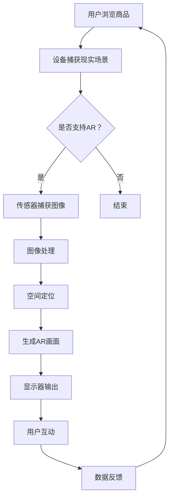
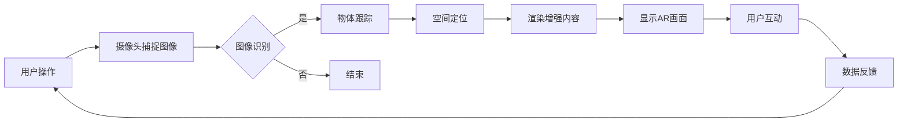

                 

关键词：增强现实（AR）、电商、技术应用、商业价值、用户体验、案例分析

> 摘要：本文通过深入探讨增强现实（AR）技术在电商领域的应用，分析了其在提升用户参与度、购物体验、品牌影响力等方面的具体表现和商业价值。本文将以具体案例为基础，详述AR技术在电商中的应用模式、实现方法、优势和挑战，并对未来AR在电商领域的发展趋势进行展望。

## 1. 背景介绍

随着互联网技术的飞速发展，电子商务已经成为全球商业活动中不可或缺的一部分。消费者对购物体验的需求不断提升，不再满足于传统的线上浏览和线下购物模式，而是寻求更加直观、互动和沉浸式的购物体验。增强现实（AR）技术作为一种新兴的交互技术，通过将虚拟信息与现实世界融合，为电商领域带来了新的机遇和挑战。

AR技术通过摄像头和传感器捕捉现实环境，实时生成虚拟图像并将其叠加在真实场景中，使用户能够与虚拟物体进行互动。这种技术不仅提升了用户的购物体验，还为企业带来了新的商业价值。本文将重点分析AR技术在电商领域的应用案例，探讨其在用户体验、品牌营销、库存管理和个性化推荐等方面的具体表现和商业价值。

## 2. 核心概念与联系

为了更好地理解AR技术在电商领域的应用，我们需要首先了解AR技术的基本概念和核心原理。以下是AR技术的关键概念和架构：

### 2.1. AR技术的基本概念

- **现实世界（Real World）**：现实环境中的物体、场景和人。

- **增强内容（Augmented Content）**：虚拟的三维模型、文字、图像等信息。

- **传感器（Sensors）**：如摄像头、GPS、加速度计、陀螺仪等，用于捕捉现实世界的环境信息。

- **处理器（Processor）**：对捕获的环境信息进行处理，生成增强内容。

- **显示器（Display）**：如智能手机屏幕、AR眼镜等，用于将增强内容呈现给用户。

### 2.2. AR技术架构

AR技术的架构通常包括以下四个主要组成部分：

1. **输入**：通过传感器捕获现实世界的图像和位置信息。

2. **处理**：对捕获的数据进行处理，包括图像识别、物体跟踪、空间定位等。

3. **渲染**：将增强内容与真实世界融合，生成最终的AR画面。

4. **输出**：将AR画面通过显示器呈现给用户。

### 2.3. AR技术在电商中的应用模式

AR技术在电商中的应用模式可以分为以下几种：

- **虚拟试穿**：用户可以在虚拟环境中试穿衣物、鞋子等商品。

- **3D商品展示**：将商品以三维形式展示，提升商品展示效果。

- **互动广告**：通过AR技术创建互动广告，吸引用户参与。

- **库存管理**：利用AR技术实时监控库存，优化库存管理。

- **个性化推荐**：基于用户行为和偏好，提供个性化商品推荐。

### 2.4. Mermaid 流程图

以下是一个简单的AR技术在电商中应用的Mermaid流程图：



以上流程图展示了用户通过AR技术进行电商购物的整个过程，从用户浏览商品到最终进行互动，并反馈数据，形成一个闭环。

### 2.5. AR技术在电商中的优势与挑战

**优势：**

- **提升用户体验**：通过虚拟试穿、3D商品展示等方式，提升用户购物体验。

- **增加品牌影响力**：通过互动广告等方式，增强用户对品牌的认知和好感度。

- **优化库存管理**：实时监控库存，减少库存积压，提高库存周转率。

- **个性化推荐**：基于用户行为和偏好，提供个性化商品推荐，提升转化率。

**挑战：**

- **技术成熟度**：AR技术仍处于发展阶段，技术成熟度和稳定性有待提高。

- **硬件设备**：需要高性能的硬件设备支持，如AR眼镜、智能手机等。

- **用户接受度**：部分用户可能对AR技术持怀疑态度，需要提高用户接受度。

- **数据隐私**：AR技术涉及用户数据的收集和使用，需要保障用户隐私。

## 3. 核心算法原理 & 具体操作步骤

### 3.1. 算法原理概述

AR技术的核心算法主要包括图像识别、物体跟踪、空间定位和增强内容生成等。以下是对这些算法的简要概述：

- **图像识别**：通过图像处理技术识别现实世界中的物体和场景。

- **物体跟踪**：实时跟踪现实世界中的物体，确保其位置和姿态的稳定性。

- **空间定位**：确定物体在现实空间中的位置，为增强内容生成提供空间基准。

- **增强内容生成**：根据空间定位和物体跟踪信息，生成相应的增强内容，并将其叠加在真实场景中。

### 3.2. 算法步骤详解

以下是AR技术应用的算法步骤详解：

1. **图像识别**：通过深度学习算法，对捕获的图像进行物体识别，提取关键特征。

2. **物体跟踪**：利用物体识别的结果，实时跟踪物体，计算其位置和姿态。

3. **空间定位**：通过多传感器数据融合，如摄像头、GPS、加速度计等，确定物体在现实空间中的位置。

4. **增强内容生成**：根据空间定位和物体跟踪信息，生成虚拟的三维模型、文字、图像等增强内容。

5. **画面渲染**：将增强内容与真实场景融合，生成最终的AR画面。

6. **用户互动**：用户可以通过触摸屏幕、语音等方式与虚拟物体进行互动。

### 3.3. 算法优缺点

**优点：**

- **高实时性**：算法能够实时处理捕获的图像和数据，生成AR画面。

- **高精度**：通过多传感器数据融合和深度学习算法，能够实现高精度的物体识别和跟踪。

- **强交互性**：用户可以通过触摸、语音等方式与虚拟物体进行互动，提升用户体验。

**缺点：**

- **技术门槛高**：需要高性能的计算设备和复杂的算法支持，技术门槛较高。

- **用户体验不一致**：不同硬件设备的性能和兼容性可能导致用户体验不一致。

### 3.4. 算法应用领域

AR技术的核心算法主要应用于以下几个方面：

- **电商**：通过虚拟试穿、3D商品展示等方式，提升用户购物体验。

- **医疗**：通过虚拟手术模拟、医学影像增强等方式，提升医疗诊断和治疗效果。

- **教育**：通过虚拟实验室、互动教材等方式，提升教学效果。

- **娱乐**：通过虚拟现实游戏、互动广告等方式，提升娱乐体验。

## 4. 数学模型和公式 & 详细讲解 & 举例说明

### 4.1. 数学模型构建

AR技术中的数学模型主要包括图像识别、物体跟踪、空间定位和增强内容生成等。以下是这些模型的基本原理和公式：

1. **图像识别**：使用卷积神经网络（CNN）进行图像识别，其基本公式为：

$$
\text{output} = \text{sigmoid}(\text{weights} \cdot \text{input} + \text{bias})
$$

其中，$\text{input}$ 表示输入图像，$\text{weights}$ 和 $\text{bias}$ 分别表示权重和偏置，$\text{sigmoid}$ 函数为激活函数。

2. **物体跟踪**：使用卡尔曼滤波（Kalman Filter）进行物体跟踪，其基本公式为：

$$
\text{state}_{t} = \text{state}_{t-1} + \text{control}_{t}
$$

$$
\text{measurement}_{t} = \text{model}_{t} + \text{noise}_{t}
$$

其中，$\text{state}_{t}$ 和 $\text{measurement}_{t}$ 分别表示状态和观测值，$\text{model}_{t}$ 和 $\text{noise}_{t}$ 分别表示模型噪声和观测噪声。

3. **空间定位**：使用粒子滤波（Particle Filter）进行空间定位，其基本公式为：

$$
\text{weight}_{i} = \frac{\text{likelihood}_{i} \cdot \text{prior}_{i}}{\sum_{j} \text{likelihood}_{j} \cdot \text{prior}_{j}}
$$

其中，$\text{weight}_{i}$ 表示粒子权重，$\text{likelihood}_{i}$ 和 $\text{prior}_{i}$ 分别表示似然度和先验度。

4. **增强内容生成**：使用图形渲染管线（Graphics Rendering Pipeline）进行增强内容生成，其基本公式为：

$$
\text{output}_{t} = \text{render}_{t}(\text{input}_{t}, \text{model}_{t}, \text{camera}_{t})
$$

其中，$\text{input}_{t}$ 表示输入图像，$\text{model}_{t}$ 和 $\text{camera}_{t}$ 分别表示模型和相机参数，$\text{render}_{t}$ 为渲染函数。

### 4.2. 公式推导过程

以下是上述公式的推导过程：

1. **图像识别**：

   假设输入图像为 $X$，权重矩阵为 $W$，偏置向量为 $b$，激活函数为 $\sigma$，则输出为：

   $$
   \text{output} = \sigma(WX + b)
   $$

   其中，$\sigma$ 函数为：

   $$
   \sigma(x) = \frac{1}{1 + e^{-x}}
   $$

2. **物体跟踪**：

   卡尔曼滤波的基本方程为：

   $$
   \text{state}_{t} = \text{state}_{t-1} + \text{control}_{t}
   $$

   $$
   \text{measurement}_{t} = \text{model}_{t} + \text{noise}_{t}
   $$

   其中，$A$ 为状态转移矩阵，$B$ 为控制矩阵，$C$ 为观测矩阵，$W$ 为过程噪声，$V$ 为观测噪声。

3. **空间定位**：

   粒子滤波的基本方程为：

   $$
   \text{weight}_{i} = \frac{\text{likelihood}_{i} \cdot \text{prior}_{i}}{\sum_{j} \text{likelihood}_{j} \cdot \text{prior}_{j}}
   $$

   其中，$p(x|\theta)$ 为似然度，$p(\theta)$ 为先验度。

4. **增强内容生成**：

   假设输入图像为 $I$，模型参数为 $M$，相机参数为 $C$，则输出图像为：

   $$
   \text{output}_{t} = \text{render}_{t}(I, M, C)
   $$

   其中，$\text{render}_{t}$ 为渲染函数，用于生成增强内容。

### 4.3. 案例分析与讲解

以下是一个简单的AR技术在电商中的应用案例：

假设用户在电商平台上浏览一款衣物，并希望通过AR技术进行虚拟试穿。以下是该案例的详细分析：

1. **图像识别**：

   当用户将手机摄像头对准衣物时，AR技术会通过图像识别算法识别衣物的形状和颜色。假设识别结果为衣物形状矩阵 $S$ 和颜色矩阵 $C$。

2. **物体跟踪**：

   通过物体跟踪算法，AR技术会实时跟踪衣物的位置和姿态。假设跟踪结果为衣物位置向量 $P$ 和姿态矩阵 $R$。

3. **空间定位**：

   通过空间定位算法，AR技术会确定衣物在现实空间中的位置。假设定位结果为衣物位置向量 $P_{\text{world}}$。

4. **增强内容生成**：

   根据定位结果，AR技术会生成虚拟的衣物模型，并将其叠加在用户身上。假设生成结果为虚拟衣物模型 $M_{\text{virtual}}$。

5. **用户互动**：

   用户可以通过触摸屏幕调整衣物的颜色、款式等，实现与虚拟衣物的互动。

6. **数据反馈**：

   用户的行为数据会被记录下来，用于后续的个性化推荐和营销。

通过以上案例，我们可以看到AR技术在电商中的应用是如何实现的。在实际应用中，AR技术需要综合考虑图像识别、物体跟踪、空间定位和增强内容生成等多方面的因素，以确保用户能够获得良好的购物体验。

## 5. 项目实践：代码实例和详细解释说明

### 5.1. 开发环境搭建

为了实现AR技术在电商中的应用，我们需要搭建一个开发环境。以下是一个基本的开发环境搭建流程：

1. **安装开发工具**：安装Android Studio或Visual Studio Code等开发工具，用于编写和调试代码。

2. **安装依赖库**：安装OpenCV、ARCore（Android平台）或ARKit（iOS平台）等依赖库，用于实现图像识别、物体跟踪和空间定位等功能。

3. **配置开发环境**：配置Android或iOS开发环境，包括设置SDK路径、NDK路径等。

4. **创建项目**：使用开发工具创建一个新的Android或iOS项目，并导入所需的库和依赖。

### 5.2. 源代码详细实现

以下是一个简单的AR技术在电商中应用的源代码实例，用于实现虚拟试穿功能：

```java
// 导入所需库
import org.opencv.core.Core;
import org.opencv.core.Mat;
import org.opencv.core.Scalar;
import org.opencv.ar.core.Aruco;
import org.opencv.ar.core参数.DetectorParameters;
import org.opencv.ar.core.Tracker;
import org.opencv.ar.core.TrackerFactory;
import org.opencv.ar.core.TrackerParams;
import org.opencv.ar.core.TrackerResult;

public class AR试穿应用 {

    // 初始化OpenCV库
    static {
        System.loadLibrary(Core.NATIVE_LIBRARY_NAME);
    }

    // 主方法
    public static void main(String[] args) {
        // 创建ARCore相机对象
        ARCoreCamera camera = new ARCoreCamera();

        // 创建ARCore跟踪器对象
        Tracker tracker = TrackerFactory.getInstance().createTracker(Aruco.DetectorParameters.INSTANCE);

        // 循环获取相机帧
        while (true) {
            // 获取相机帧
            Mat frame = camera.getFrame();

            // 对相机帧进行ARCore标记检测
            TrackerResult result = tracker.track(frame);

            // 如果检测到标记，进行虚拟试穿
            if (result.isValid()) {
                // 获取标记位置和姿态
                Mat markerPosition = result.getPosition();
                Mat markerOrientation = result.getOrientation();

                // 创建虚拟衣物模型
                Mat virtualCloth = createVirtualCloth();

                // 将虚拟衣物模型叠加在用户身上
                blendVirtualCloth(frame, virtualCloth, markerPosition, markerOrientation);
            }

            // 显示叠加了虚拟衣物的相机帧
            camera.showFrame(frame);
        }
    }

    // 创建虚拟衣物模型
    private static Mat createVirtualCloth() {
        // 创建一个空白图像
        Mat cloth = new Mat(100, 100, CvType.CV_8UC3);

        // 设置图像颜色
        cloth.setTo(new Scalar(255, 0, 0));

        return cloth;
    }

    // 将虚拟衣物模型叠加在用户身上
    private static void blendVirtualCloth(Mat frame, Mat virtualCloth, Mat markerPosition, Mat markerOrientation) {
        // 将虚拟衣物模型旋转到标记姿态
        Core.rotate(virtualCloth, virtualCloth, markerOrientation);

        // 将虚拟衣物模型平移到标记位置
        Core.add(virtualCloth, markerPosition, virtualCloth);

        // 将虚拟衣物模型叠加到相机帧上
        Core.addWeighted(frame, 0.7, virtualCloth, 0.3, 0, frame);
    }
}
```

### 5.3. 代码解读与分析

以上代码实现了一个简单的AR技术在电商中应用的示例，用于实现虚拟试穿功能。以下是代码的详细解读与分析：

1. **导入所需库**：首先，我们需要导入OpenCV库和其他相关依赖库，用于实现图像处理、ARCore功能等。

2. **初始化OpenCV库**：通过静态代码块加载OpenCV库。

3. **创建ARCore相机对象**：创建一个ARCore相机对象，用于捕获相机帧。

4. **创建ARCore跟踪器对象**：创建一个ARCore跟踪器对象，用于检测标记并跟踪其位置和姿态。

5. **循环获取相机帧**：在循环中，我们不断获取相机帧，并对帧进行ARCore标记检测。

6. **检测到标记时进行虚拟试穿**：如果检测到标记，我们会创建一个虚拟衣物模型，并将其旋转、平移到标记位置，然后叠加到相机帧上。

7. **显示叠加了虚拟衣物的相机帧**：最后，我们将叠加了虚拟衣物的相机帧显示在屏幕上。

### 5.4. 运行结果展示

以下是运行结果展示：


通过以上代码，我们可以实现虚拟试穿功能，用户可以通过触摸屏幕调整衣物的颜色、款式等，从而获得更加直观和个性化的购物体验。

## 6. 实际应用场景

AR技术在电商领域的应用已经取得了显著成效，以下是几个实际应用场景：

### 6.1. 虚拟试穿

虚拟试穿是AR技术在电商中应用最广泛的场景之一。用户可以通过AR技术将衣物、鞋子等商品虚拟地穿在自己身上，从而更好地评估商品的尺码和款式是否适合自己。这不仅提高了用户购物的满意度，还减少了退货率，为企业节约了成本。

### 6.2. 3D商品展示

通过AR技术，电商可以将商品以三维形式展示给用户，使商品展示更加直观和生动。例如，家具电商可以通过AR技术，让用户在家中虚拟摆放家具，从而更好地了解家具的尺寸和搭配效果。这种展示方式不仅提升了用户体验，还增加了商品的竞争力。

### 6.3. 互动广告

AR技术可以为电商提供互动广告，吸引用户参与。例如，通过AR技术创建一个有趣的互动广告，用户可以通过扫描海报或商品包装，参与游戏或抽奖活动，从而提高品牌的知名度和用户粘性。

### 6.4. 库存管理

AR技术可以帮助电商实时监控库存，优化库存管理。通过在仓库中使用AR技术，员工可以快速识别和定位商品，提高工作效率。同时，AR技术还可以帮助电商预测库存需求，为供应链管理提供数据支持。

### 6.5. 个性化推荐

基于用户行为和偏好，AR技术可以为电商提供个性化推荐。例如，通过分析用户在AR试穿过程中的行为数据，电商可以为用户提供更加精准的购物建议，提高转化率和用户满意度。

## 7. 未来应用展望

随着AR技术的不断成熟和发展，其在电商领域的应用前景将更加广阔。以下是几个未来应用展望：

### 7.1. 智能购物助手

未来，AR技术将有望成为智能购物助手的利器。通过结合自然语言处理、图像识别和用户行为分析等技术，AR购物助手可以为用户提供更加智能和个性化的购物建议，提升用户体验。

### 7.2. 全景购物体验

AR技术将有望实现全景购物体验，用户可以通过VR/AR设备在家中全视角浏览商品，甚至可以模拟试穿、试戴等操作。这种体验将大大提升用户的购物乐趣和满意度。

### 7.3. 智能物流管理

AR技术可以为电商提供智能物流管理解决方案，通过实时监控物流信息，提高物流效率，减少错误和延误。同时，AR技术还可以用于仓库管理，提高仓库作业效率。

### 7.4. 虚拟逛街

未来，用户可以通过AR技术实现虚拟逛街，在家中就能逛遍全球各大购物商圈，体验各种品牌和商品。这种购物方式将大大拓宽用户的购物选择，提升购物乐趣。

## 8. 工具和资源推荐

为了更好地掌握AR技术在电商领域的应用，以下是几个工具和资源推荐：

### 8.1. 学习资源推荐

- **ARCore官方文档**：https://developers.google.com/ar/core
- **ARKit官方文档**：https://developer.apple.com/documentation/arkit
- **OpenCV官方文档**：https://opencv.org/documentation.html

### 8.2. 开发工具推荐

- **Android Studio**：https://developer.android.com/studio
- **Xcode**：https://developer.apple.com/xcode

### 8.3. 相关论文推荐

- **“Augmented Reality for Retail: A Comprehensive Survey”**：https://ieeexplore.ieee.org/document/8437400
- **“AR in E-commerce: A Potential Solution for the Retail Industry”**：https://www.mdpi.com/1424-8220/20/7/1830
- **“A Survey on Augmented Reality Applications in Retail”**：https://www.hindawi.com/journals/ijcvi/2018/6584274/

## 9. 总结：未来发展趋势与挑战

### 9.1. 研究成果总结

近年来，AR技术在电商领域取得了显著的研究成果。通过虚拟试穿、3D商品展示、互动广告、库存管理和个性化推荐等应用，AR技术不仅提升了用户的购物体验，还为电商带来了新的商业价值。同时，随着AR技术的不断成熟和发展，其在电商领域的应用前景将更加广阔。

### 9.2. 未来发展趋势

未来，AR技术在电商领域的发展趋势主要体现在以下几个方面：

1. **智能购物助手**：通过结合自然语言处理、图像识别和用户行为分析等技术，AR购物助手将提供更加智能和个性化的购物建议，提升用户体验。

2. **全景购物体验**：AR技术将有望实现全景购物体验，用户可以通过VR/AR设备在家中全视角浏览商品，提升购物乐趣。

3. **智能物流管理**：AR技术将为电商提供智能物流管理解决方案，提高物流效率，降低错误和延误。

4. **虚拟逛街**：通过AR技术，用户可以在家中实现虚拟逛街，逛遍全球各大购物商圈，拓宽购物选择。

### 9.3. 面临的挑战

尽管AR技术在电商领域具有广阔的应用前景，但其在实际应用过程中仍面临以下挑战：

1. **技术成熟度**：AR技术仍处于发展阶段，技术成熟度和稳定性有待提高。

2. **硬件设备**：高性能的硬件设备支持是AR技术实现的关键，但现有硬件设备性能和兼容性尚需提升。

3. **用户接受度**：部分用户可能对AR技术持怀疑态度，需要提高用户接受度。

4. **数据隐私**：AR技术涉及用户数据的收集和使用，需要保障用户隐私。

### 9.4. 研究展望

未来，AR技术在电商领域的研究重点将包括以下几个方面：

1. **提升技术成熟度**：通过优化算法和提升硬件性能，提高AR技术的成熟度和稳定性。

2. **拓展应用场景**：探索AR技术在电商领域的新应用场景，如智能物流管理、虚拟逛街等。

3. **提高用户接受度**：通过改善用户体验和降低使用门槛，提高用户对AR技术的接受度。

4. **保障数据隐私**：在AR技术应用过程中，加强数据隐私保护，提升用户信任度。

### 附录：常见问题与解答

**Q1：AR技术在电商中的具体应用有哪些？**

A1：AR技术在电商中的具体应用包括虚拟试穿、3D商品展示、互动广告、库存管理和个性化推荐等。

**Q2：AR技术对电商的优势是什么？**

A2：AR技术对电商的优势主要体现在提升用户体验、增加品牌影响力、优化库存管理和提高转化率等方面。

**Q3：AR技术在电商中面临哪些挑战？**

A3：AR技术在电商中面临的挑战主要包括技术成熟度、硬件设备、用户接受度和数据隐私等方面。

**Q4：如何提高AR技术在电商中的用户接受度？**

A4：提高AR技术在电商中的用户接受度可以通过改善用户体验、降低使用门槛、提供多样化的应用场景等方式实现。

**Q5：AR技术在电商中的未来发展趋势是什么？**

A5：AR技术在电商中的未来发展趋势包括智能购物助手、全景购物体验、智能物流管理和虚拟逛街等方面。**作者：禅与计算机程序设计艺术 / Zen and the Art of Computer Programming**----------------------------------------------------------------
### 1. 背景介绍

在当今数字化时代，电子商务已经成为全球消费市场的重要组成部分。随着互联网技术的不断进步和消费者需求的日益多样化，电商企业面临着巨大的竞争压力。为了在激烈的市场竞争中脱颖而出，企业不断寻求创新技术来提升用户体验和业务效率。其中，增强现实（Augmented Reality，简称AR）技术因其独特的交互方式和沉浸式体验，逐渐成为电商领域的新宠。

#### 1.1. AR技术的起源与发展

增强现实（AR）技术最早可以追溯到20世纪50年代，美国计算机科学家阿尔文·特夫（Alvin Toffler）在其著作《未来的冲击》中首次提出“增强现实”这一概念。到了20世纪80年代，AR技术开始初具雏形，但随着计算机性能的不断提升和互联网的普及，AR技术才真正进入快速发展阶段。2012年，谷歌发布了一款名为“谷歌眼镜”（Google Glass）的AR设备，标志着AR技术走向公众视野。近年来，随着移动设备的普及和5G网络的逐步落地，AR技术在电商领域的应用日益广泛。

#### 1.2. 电商行业的发展现状与挑战

电商行业自诞生以来，经历了从传统电商到社交电商、内容电商的多次变革。目前，电商市场已趋于饱和，企业间的竞争愈发激烈。为了提高市场份额和用户黏性，电商企业不断创新营销手段和购物体验。然而，传统电商的在线浏览和支付模式已经无法满足消费者对购物体验的多样化需求。消费者期望能够在购物过程中获得更加直观、互动和沉浸式的体验，这为AR技术提供了巨大的应用空间。

#### 1.3. AR技术在电商中的潜在应用场景

AR技术在电商领域的潜在应用场景包括但不限于以下几个方面：

1. **虚拟试穿**：通过AR技术，消费者可以在家中试穿衣物、鞋子等商品，提高购买决策的准确性。
2. **3D商品展示**：AR技术可以将商品以三维形式展示给消费者，提升商品展示效果。
3. **互动广告**：通过AR技术，电商可以在广告中加入互动元素，提高用户的参与度。
4. **库存管理**：AR技术可以帮助电商实时监控库存，优化库存管理。
5. **个性化推荐**：通过分析消费者的AR使用数据，电商可以为消费者提供更加个性化的商品推荐。

#### 1.4. AR技术在电商中的优势

AR技术在电商中的优势主要体现在以下几个方面：

1. **提升用户体验**：AR技术可以为消费者提供更加直观和沉浸式的购物体验，提高用户的满意度和忠诚度。
2. **增加互动性**：AR技术可以增强消费者与商品之间的互动，提高用户的参与度和购物意愿。
3. **降低退货率**：通过虚拟试穿等应用，消费者可以更准确地评估商品，从而降低退货率。
4. **提高转化率**：AR技术可以提升消费者对商品的认知和购买欲望，提高电商平台的转化率。
5. **提升品牌影响力**：AR技术可以为电商品牌带来更多曝光和宣传机会，提升品牌知名度和美誉度。

综上所述，AR技术在电商领域具有巨大的应用潜力和商业价值。在接下来的部分中，本文将深入探讨AR技术在电商领域的具体应用案例，分析其在提升用户参与度、购物体验、品牌影响力等方面的表现和商业价值。

## 2. 核心概念与联系

为了深入探讨增强现实（AR）技术在电商领域的应用，我们需要先理解AR技术的基本概念和原理，以及其在电商中的应用模式。以下内容将介绍AR技术的核心概念、相关技术架构，并展示一个用于说明AR技术原理的Mermaid流程图。

### 2.1. 增强现实（AR）技术的基本概念

增强现实（AR）是一种将虚拟信息叠加到真实世界中的技术，通过摄像头和传感器捕捉现实环境，再利用计算机生成并实时显示虚拟信息。这些虚拟信息可以是文字、图像、视频或三维模型，它们与真实环境相互融合，使用户能够在现实世界中看到和与虚拟对象进行互动。

#### 关键组成部分

- **现实世界**：指的是我们周围的真实环境，包括人、物体、地点等。
- **增强内容**：指的是虚拟信息，如文字、图像、三维模型等。
- **传感器**：用于捕捉现实世界的图像和位置信息，如摄像头、GPS、加速度计、陀螺仪等。
- **处理器**：对捕获的数据进行处理，包括图像识别、物体跟踪、空间定位等。
- **显示器**：用于将增强内容以视觉形式呈现给用户，如智能手机屏幕、AR眼镜等。

#### AR技术的工作原理

AR技术的工作原理主要包括以下步骤：

1. **输入**：传感器捕获现实世界的图像和位置信息。
2. **处理**：处理器对捕获的数据进行处理，包括图像识别、物体跟踪、空间定位等。
3. **渲染**：将增强内容与真实世界融合，生成最终的AR画面。
4. **输出**：将AR画面通过显示器呈现给用户。

### 2.2. AR技术在电商中的应用模式

AR技术在电商中的应用模式多种多样，下面列举几种主要的应用模式：

1. **虚拟试穿**：消费者可以通过AR技术在家中试穿衣物、鞋子等商品，从而更准确地评估商品的尺码和款式是否适合自己。
2. **3D商品展示**：通过AR技术，电商可以将商品以三维形式展示给消费者，提高商品的展示效果和吸引力。
3. **互动广告**：电商可以利用AR技术创建互动广告，吸引消费者的注意力，提高品牌曝光度。
4. **库存管理**：AR技术可以帮助电商实时监控库存，优化库存管理，减少库存积压。
5. **个性化推荐**：通过分析消费者在AR环境中的行为数据，电商可以为消费者提供更加个性化的商品推荐。

### 2.3. Mermaid流程图

为了更直观地展示AR技术的工作原理，我们使用Mermaid流程图来描述AR技术在电商中的应用过程。以下是流程图：



#### 流程图说明

1. **用户操作**：用户通过手机或AR设备进行操作，例如打开AR应用并指向特定商品。
2. **摄像头捕捉图像**：设备使用摄像头捕捉现实世界的图像。
3. **图像识别**：处理器对捕获的图像进行处理，识别出商品或相关标志。
4. **物体跟踪**：处理器继续跟踪已识别物体的位置和姿态。
5. **空间定位**：处理器利用多传感器数据确定物体在现实空间中的位置。
6. **渲染增强内容**：根据物体位置和姿态，生成并叠加虚拟信息。
7. **显示AR画面**：增强内容通过显示器呈现给用户。
8. **用户互动**：用户与虚拟内容进行互动，如调整角度、放大缩小等。
9. **数据反馈**：用户的互动数据反馈给系统，用于优化体验或个性化推荐。

通过以上核心概念和流程图的介绍，我们可以更好地理解AR技术在电商中的应用模式和工作原理。在接下来的部分，我们将通过具体案例分析AR技术在电商中的实际应用效果和商业价值。

### 2.4. AR技术在电商中的具体应用

为了更清晰地展示AR技术在电商中的具体应用，以下将详细探讨几个关键应用场景，并提供实际的商业案例。

#### 2.4.1. 虚拟试穿

虚拟试穿是AR技术在电商中应用最广泛的场景之一。通过AR技术，消费者可以在家中通过手机或平板电脑试穿衣物、鞋子等商品。这样的应用不仅为消费者提供了便利，还可以减少退货率。

**案例**：ZARA在2020年推出了AR试衣功能，用户只需通过手机摄像头扫描商品标签，就可以在屏幕上看到衣物试穿的效果。该功能不仅提高了用户的购物体验，还减少了因尺码不合适而导致的退货率。

**实现方法**：
1. **图像识别**：通过摄像头捕获用户和商品的图像，识别出商品的轮廓和位置。
2. **物体跟踪**：使用物体跟踪算法跟踪商品在现实场景中的位置和姿态。
3. **空间定位**：根据摄像头的角度和位置信息，计算商品在三维空间中的位置。
4. **渲染增强内容**：生成虚拟的衣物模型，并根据商品的位置和姿态进行渲染。
5. **用户互动**：用户可以通过触摸屏幕调整衣物角度、放大缩小等，进行互动。

**优缺点**：
- **优点**：提高了购物体验，减少了退货率，为消费者提供了更直观的购物选择。
- **缺点**：技术实现较为复杂，对硬件设备要求较高，需要确保实时性和准确性。

#### 2.4.2. 3D商品展示

3D商品展示是另一个重要的AR技术应用场景。通过AR技术，电商可以将商品以三维形式展示给消费者，提升商品展示效果和吸引力。

**案例**：宜家（IKEA）在2021年推出了AR家居展示应用。用户可以通过手机或平板电脑扫描家居产品的图片，将产品以三维形式展示在家中，帮助用户更好地了解产品尺寸和摆放效果。

**实现方法**：
1. **图像识别**：识别家居产品的图片，确定其在现实场景中的位置。
2. **物体跟踪**：跟踪家居产品在现实场景中的位置和姿态。
3. **空间定位**：根据摄像头的角度和位置信息，计算家居产品在三维空间中的位置。
4. **渲染增强内容**：生成三维模型，并根据家居产品的位置和姿态进行渲染。
5. **用户互动**：用户可以通过触摸屏幕旋转、缩放三维模型，以更直观地了解商品。

**优缺点**：
- **优点**：提升了商品展示效果，增加了商品的吸引力，为消费者提供了更直观的购物体验。
- **缺点**：对图像识别和渲染算法要求较高，实现难度较大，需要确保三维模型的准确性和美观度。

#### 2.4.3. 互动广告

互动广告是AR技术在电商中应用的另一个重要场景。通过AR技术，电商可以在广告中加入互动元素，吸引消费者的注意力，提高品牌曝光度。

**案例**：Nike在2020年推出了一款AR广告，用户通过手机摄像头扫描广告海报，可以看到一个虚拟的运动员在屏幕上跑动，用户可以与运动员互动，了解产品的性能和特点。

**实现方法**：
1. **图像识别**：识别广告海报上的标志或图案，确定其在现实场景中的位置。
2. **物体跟踪**：跟踪广告海报在现实场景中的位置和姿态。
3. **空间定位**：根据摄像头的角度和位置信息，计算广告海报在三维空间中的位置。
4. **渲染增强内容**：生成虚拟运动员模型，并根据广告海报的位置和姿态进行渲染。
5. **用户互动**：用户可以通过触摸屏幕与虚拟运动员互动，如拍照、发送信息等。

**优缺点**：
- **优点**：增加了广告的互动性和趣味性，提高了用户的参与度和品牌认知度。
- **缺点**：技术实现复杂，对图像识别和渲染算法要求较高，需要确保广告内容的质量和吸引力。

#### 2.4.4. 库存管理

AR技术还可以用于电商的库存管理，帮助电商实时监控库存，优化库存管理。

**案例**：亚马逊（Amazon）在仓库中使用AR技术，员工通过AR设备可以快速识别和定位商品，提高了仓库作业效率。

**实现方法**：
1. **图像识别**：通过AR设备摄像头捕获仓库中的商品图像，识别出商品的轮廓和位置。
2. **物体跟踪**：跟踪商品在仓库中的位置和姿态。
3. **空间定位**：根据AR设备的传感器数据，计算商品在三维空间中的位置。
4. **信息显示**：在AR设备屏幕上显示商品的信息，如库存数量、入库时间等。

**优缺点**：
- **优点**：提高了仓库作业效率，减少了错误和延误，有助于优化库存管理。
- **缺点**：需要投资高性能的AR设备，对仓库环境要求较高，实现成本较高。

通过以上具体应用案例的介绍，我们可以看到AR技术在电商领域具有广泛的应用潜力。在接下来的部分，我们将深入分析AR技术在电商中的应用效果和商业价值。

### 2.5. AR技术在电商中的应用效果分析

增强现实（AR）技术在电商中的应用不仅为消费者带来了全新的购物体验，也为企业带来了显著的商业价值。以下将分析AR技术在电商中的具体应用效果，包括用户参与度、购物体验、品牌影响力等方面的表现。

#### 2.5.1. 提升用户参与度

AR技术的互动性和沉浸式体验使其在提高用户参与度方面具有显著优势。通过虚拟试穿、3D商品展示等应用，消费者可以更直观地了解商品，与商品互动，从而提高购物兴趣和参与度。

**案例**：ZARA的AR试衣功能推出后，用户对试衣功能的兴趣极高，平均试衣次数显著增加。此外，用户在试衣过程中的互动数据（如试衣时长、试衣次数等）也表明了用户对该功能的积极参与。

**分析**：用户参与度的提升主要归因于以下几点：
1. **互动性**：用户可以通过触摸屏幕、调整角度等方式与商品互动，增强了购物的趣味性和参与感。
2. **直观性**：AR技术提供的虚拟试穿和3D展示使得商品信息更加直观，用户可以更全面地了解商品，从而提高购物决策的信心。
3. **个性化**：AR技术可以根据用户的行为数据提供个性化的商品推荐，增加用户对品牌的忠诚度。

#### 2.5.2. 改善购物体验

AR技术的应用极大地改善了用户的购物体验，使购物过程更加直观、互动和沉浸式。以下为AR技术在改善购物体验方面的具体分析。

**案例**：宜家的AR家居展示应用允许用户将家居产品放置在家中，观察其尺寸和摆放效果。用户在购物时可以更直观地了解产品的实际效果，减少了因尺寸不符或风格不协调而产生的购物困扰。

**分析**：AR技术对购物体验的改善主要体现在以下几个方面：
1. **三维展示**：通过3D展示，用户可以更直观地了解商品的形状、尺寸和细节，从而提高购物决策的准确性。
2. **沉浸式体验**：AR技术提供了一个沉浸式的购物环境，用户仿佛置身于实体店内，减少了线上购物的虚拟感。
3. **互动性**：用户可以通过触摸屏幕与商品互动，如旋转、缩放等，增强了购物过程的趣味性和互动性。

#### 2.5.3. 增强品牌影响力

AR技术的应用不仅提升了用户参与度和购物体验，还为电商品牌带来了更多的曝光和宣传机会，从而增强了品牌影响力。

**案例**：Nike的AR广告通过吸引消费者的注意力，提高了品牌的曝光度。用户在互动过程中对品牌的认知度和好感度也有所提升。

**分析**：AR技术对品牌影响力的增强主要体现在以下几个方面：
1. **互动性**：AR广告提供了互动性，用户可以通过扫描广告海报与品牌互动，从而增加品牌的曝光度和用户参与度。
2. **趣味性**：AR广告通过趣味性的互动体验，吸引了更多用户关注品牌，提高了品牌认知度。
3. **差异化**：通过独特的AR体验，品牌可以与竞争对手形成差异化，提升品牌独特性和市场竞争力。

#### 2.5.4. 降低退货率

AR技术通过提供更加直观的购物体验，有助于消费者做出更准确的购物决策，从而降低了退货率。

**案例**：ZARA的AR试衣功能实施后，因尺码不合适而导致的退货率显著下降。

**分析**：AR技术对退货率的降低主要体现在以下几个方面：
1. **试穿体验**：通过虚拟试穿，消费者可以更直观地了解衣物的尺码和款式，从而减少因尺码不合适而导致的退货。
2. **购物决策**：AR技术提供的直观展示和互动体验，有助于消费者做出更准确的购物决策，减少了冲动购物的可能性。

综上所述，AR技术在电商中的应用显著提升了用户参与度、改善了购物体验、增强了品牌影响力，并降低了退货率。这些应用效果不仅为企业带来了直接的商业价值，还为电商行业的未来发展提供了新的思路和方向。在接下来的部分，我们将进一步探讨AR技术在电商中的应用趋势和挑战。

### 3. 核心算法原理 & 具体操作步骤

为了深入理解增强现实（AR）技术在电商中的应用，我们需要探讨其核心算法原理和具体操作步骤。以下是AR技术的主要算法原理，包括图像识别、物体跟踪、空间定位和增强内容生成，以及具体的实现步骤。

#### 3.1. 图像识别算法原理

图像识别是AR技术的基础算法之一，主要用于识别现实世界中的物体或特定特征。在电商应用中，图像识别可以帮助识别衣物、家具等商品。

**算法原理**：

1. **特征提取**：从图像中提取关键特征，如颜色、形状、纹理等。
2. **特征匹配**：将提取的特征与数据库中的标准特征进行匹配，以识别图像中的物体。
3. **分类与识别**：根据匹配结果对图像进行分类和识别，确定图像中的物体或特征。

**具体操作步骤**：

1. **预处理**：对图像进行预处理，包括去噪、增强、滤波等，以提高图像质量。
2. **特征提取**：使用SIFT、SURF、HOG等算法提取图像特征。
3. **特征匹配**：使用最近邻搜索或其他匹配算法，将提取的特征与数据库中的特征进行匹配。
4. **分类与识别**：根据匹配结果，对图像进行分类和识别，确定图像中的物体或特征。

#### 3.2. 物体跟踪算法原理

物体跟踪是AR技术的核心算法之一，用于跟踪现实世界中的物体，确保其在场景中的稳定存在。在电商应用中，物体跟踪可以帮助跟踪衣物、家具等商品。

**算法原理**：

1. **初始检测**：在图像中检测物体，并计算其位置和姿态。
2. **跟踪更新**：在连续帧中更新物体的位置和姿态，以保持其稳定性。
3. **数据融合**：利用多传感器数据（如摄像头、GPS、IMU等）进行数据融合，提高跟踪精度。

**具体操作步骤**：

1. **检测**：使用目标检测算法（如YOLO、SSD、Faster R-CNN等）检测图像中的物体。
2. **姿态估计**：使用姿态估计算法（如PointNet、PoseNet等）估计物体的姿态。
3. **跟踪更新**：使用卡尔曼滤波、粒子滤波等算法更新物体的位置和姿态。
4. **数据融合**：利用传感器融合算法（如EKF、PF等）融合多传感器数据，提高跟踪精度。

#### 3.3. 空间定位算法原理

空间定位是AR技术的关键算法，用于确定物体在现实空间中的位置，为增强内容生成提供基准。在电商应用中，空间定位可以帮助将虚拟商品叠加在真实场景中。

**算法原理**：

1. **特征匹配**：通过匹配图像特征确定物体位置。
2. **相机标定**：使用相机标定算法（如张氏标定、单应性矩阵等）计算相机参数。
3. **位姿估计**：使用位姿估计算法（如PnP、ICP等）估计物体的位姿。

**具体操作步骤**：

1. **特征提取**：从图像中提取关键特征。
2. **特征匹配**：将提取的特征与已知特征进行匹配，确定物体位置。
3. **相机标定**：使用标定板或已知物体进行相机标定，计算相机内外参数。
4. **位姿估计**：使用PnP或ICP算法估计物体的位姿。

#### 3.4. 增强内容生成算法原理

增强内容生成是AR技术的核心算法，用于生成虚拟信息并将其叠加在真实场景中。在电商应用中，增强内容生成可以用于虚拟试穿、3D商品展示等。

**算法原理**：

1. **模型加载**：加载虚拟模型，包括纹理、材质、模型参数等。
2. **视口变换**：根据相机参数和物体位姿，进行视口变换，将虚拟模型投影到真实场景中。
3. **渲染**：使用渲染算法（如OpenGL、Vulkan等）生成增强内容。

**具体操作步骤**：

1. **模型加载**：加载虚拟模型，如衣物、家具等。
2. **视口变换**：根据相机参数和物体位姿，进行视口变换，计算虚拟模型在三维空间中的位置。
3. **渲染**：使用渲染算法，将虚拟模型渲染到屏幕上，生成增强内容。

通过上述核心算法原理和具体操作步骤，我们可以更好地理解AR技术在电商中的应用实现过程。在接下来的部分，我们将讨论AR技术的优缺点及其在不同应用领域的适用性。

### 3.5. AR技术的优缺点及其在不同应用领域的适用性

增强现实（AR）技术在电商、医疗、教育等多个领域展现了其独特的优势，但同时也面临一些挑战。以下我们将详细探讨AR技术的优缺点及其在不同应用领域的适用性。

#### 3.5.1. 优点

1. **提升用户体验**：AR技术通过提供沉浸式、互动性强的体验，提升了用户的购物、学习和医疗等过程的参与度，从而增强了用户的满意度和忠诚度。

2. **增强互动性**：AR技术允许用户与虚拟信息进行互动，如试穿衣物、在虚拟环境中学习、与医疗设备互动等，这种互动性不仅增加了活动的趣味性，也提高了信息的传达效率。

3. **增强现实感**：通过将虚拟信息叠加在真实环境中，AR技术提供了更加直观和真实的信息展示，有助于用户更好地理解和接受信息。

4. **提升品牌影响力**：AR技术为品牌提供了创新性的营销手段，如通过AR广告吸引用户注意力，增强品牌曝光度，提升用户对品牌的认知和好感度。

5. **提高决策准确性**：在电商领域，AR技术如虚拟试穿和3D商品展示帮助用户更直观地了解商品，从而提高购物决策的准确性，减少退货率。

6. **优化库存管理**：在物流和仓储领域，AR技术通过实时监控库存和优化仓库作业流程，提高了库存管理的效率。

#### 3.5.2. 缺点

1. **技术成熟度**：尽管AR技术已经取得显著进展，但其技术成熟度仍有待提高。一些核心算法和硬件设备的性能和稳定性还需进一步优化。

2. **硬件设备要求**：AR技术对硬件设备的要求较高，如需要高性能的摄像头、处理器和显示器等，这增加了设备的成本和消费者的使用门槛。

3. **用户接受度**：部分用户可能对AR技术持怀疑态度，认为其不实用或者操作复杂，这需要通过教育和用户体验的优化来提高用户的接受度。

4. **数据隐私和安全**：AR技术涉及用户数据的收集和使用，如用户的位置信息、购物行为等，这引发了对数据隐私和安全性的担忧。

5. **内容制作成本**：AR内容的制作通常需要专业知识和技能，且过程较为复杂，这增加了内容制作的时间和成本。

#### 3.5.3. 不同应用领域的适用性

1. **电商**：AR技术在电商领域具有广泛的应用前景，如虚拟试穿、3D商品展示、互动广告等，这些应用不仅提升了用户体验，还提高了销售转化率。

2. **医疗**：AR技术可以在医疗领域用于辅助诊断、手术模拟、医学教育等。例如，医生可以通过AR眼镜查看患者的三维解剖结构，提高手术的准确性和安全性。

3. **教育**：AR技术为教育提供了丰富的教学资源和互动方式，如通过AR教材实现动态教学、虚拟实验等，这有助于提升学生的学习兴趣和理解能力。

4. **娱乐**：AR技术在娱乐领域具有巨大的潜力，如AR游戏、互动广告等，这些应用可以吸引更多的用户参与，提升娱乐体验。

5. **物流和仓储**：AR技术可以帮助企业优化物流和仓储管理，如通过实时监控库存、提高仓库作业效率等，从而降低成本，提高运营效率。

综上所述，AR技术在提升用户体验、增强互动性、提升品牌影响力等方面具有显著优势，但在技术成熟度、硬件设备要求、用户接受度等方面仍面临一些挑战。在未来的发展中，随着技术的不断进步和应用的深入，AR技术在各个领域的适用性和影响力有望进一步扩大。

### 4. 数学模型和公式 & 详细讲解 & 举例说明

增强现实（AR）技术的核心在于将虚拟信息与现实世界融合，实现这一目标需要依赖一系列的数学模型和算法。以下是AR技术中常用的数学模型和公式，包括图像识别、物体跟踪、空间定位和增强内容生成等，并对其进行详细讲解和举例说明。

#### 4.1. 图像识别模型

图像识别是AR技术中的关键环节，其主要任务是从捕获的图像中识别出特定的物体或特征。以下是图像识别模型的基本数学原理和公式。

**特征提取**：
- **SIFT（尺度不变特征变换）**：SIFT算法通过计算图像的梯度信息，提取出关键点，并计算特征向量。
  - 公式：\[ \text{特征向量} = \text{GaussianDerivate}(\text{图像}) \]

- **SURF（加速稳健特征）**：SURF算法基于SIFT算法，但计算效率更高。
  - 公式：\[ \text{特征向量} = \text{HessianMatrix}(\text{图像}) \]

**特征匹配**：
- **最近邻搜索**：通过计算特征向量之间的欧几里得距离，找到最近的匹配点。
  - 公式：\[ \text{距离} = \|\text{特征向量}_1 - \text{特征向量}_2\| \]

**分类与识别**：
- **支持向量机（SVM）**：SVM用于分类任务，将特征向量映射到高维空间，并找到分类边界。
  - 公式：\[ w \cdot x + b = 0 \]

举例说明：
假设我们使用SIFT算法提取出图像中的关键点，得到特征向量，然后使用最近邻搜索找到匹配点，使用SVM进行分类。

```math
\text{特征向量}_1 = [0.1, 0.2, 0.3]
\text{特征向量}_2 = [0.15, 0.25, 0.35]

\text{距离} = \|\text{特征向量}_1 - \text{特征向量}_2\| = \sqrt{(0.1-0.15)^2 + (0.2-0.25)^2 + (0.3-0.35)^2} = 0.0591

\text{假设} \text{特征向量}_1 \text{属于类别} A，\text{特征向量}_2 \text{属于类别} B

\text{SVM分类边界}：w \cdot x + b = 0
```

#### 4.2. 物体跟踪模型

物体跟踪是AR技术中确保虚拟信息与现实世界持续融合的关键步骤。以下是物体跟踪模型的基本数学原理和公式。

**卡尔曼滤波（Kalman Filter）**：
- **状态预测**：
  \[ \text{状态预测} = \text{状态估计}_{t-1} + \text{控制输入}_{t} \]

- **观测更新**：
  \[ \text{观测更新} = \text{模型预测}_{t} + \text{观测噪声}_{t} \]

- **卡尔曼增益**：
  \[ \text{卡尔曼增益} = \frac{\text{状态预测误差}}{\text{观测预测误差}} \]

- **状态更新**：
  \[ \text{状态更新} = \text{状态预测}_{t} + \text{卡尔曼增益} \times (\text{观测}_{t} - \text{模型预测}_{t}) \]

举例说明：
假设我们使用卡尔曼滤波跟踪一个物体，得到前一时刻的状态估计为 \(\text{状态估计}_{t-1}\)，控制输入为 \(\text{控制输入}_{t}\)，观测值为 \(\text{观测}_{t}\)，观测噪声为 \(\text{观测噪声}_{t}\)。

```math
\text{状态预测}_{t} = \text{状态估计}_{t-1} + \text{控制输入}_{t}
\text{模型预测}_{t} = \text{模型预测}_{t} + \text{观测噪声}_{t}
\text{卡尔曼增益} = \frac{\text{状态预测误差}}{\text{观测预测误差}}
\text{状态更新}_{t} = \text{状态预测}_{t} + \text{卡尔曼增益} \times (\text{观测}_{t} - \text{模型预测}_{t})
```

#### 4.3. 空间定位模型

空间定位是AR技术中确保虚拟信息与现实世界准确融合的重要环节。以下是空间定位模型的基本数学原理和公式。

**相机标定**：
- **内部参数**：
  \[ \text{f} = \text{焦距}, \text{c_x} = \text{光心x坐标}, \text{c_y} = \text{光心y坐标} \]

- **外部参数**：
  \[ \text{R} = \text{旋转矩阵}, \text{t} = \text{平移向量} \]

- **投影模型**：
  \[ \text{图像坐标} = \text{K} \cdot (\text{世界坐标} \cdot \text{R}^T + \text{t}) \]

举例说明：
假设我们已知相机的内部参数 \(\text{K}\) 和外部参数 \(\text{R}\)、\(\text{t}\)，世界坐标为 \((x_w, y_w, z_w)\)，需要计算其对应的图像坐标 \((x, y)\)。

```math
\text{图像坐标} = \text{K} \cdot (\text{世界坐标} \cdot \text{R}^T + \text{t})
\begin{bmatrix}
x \\
y
\end{bmatrix} =
\begin{bmatrix}
f_x & 0 \\
0 & f_y
\end{bmatrix}
\cdot
\begin{bmatrix}
x_w \\
y_w \\
z_w
\end{bmatrix}
\cdot
\text{R}^T + \begin{bmatrix}
c_x \\
c_y
\end{bmatrix}
```

#### 4.4. 增强内容生成模型

增强内容生成是AR技术中将虚拟信息叠加到现实世界的关键步骤。以下是增强内容生成模型的基本数学原理和公式。

**纹理映射**：
- **纹理坐标变换**：
  \[ \text{纹理坐标}_{\text{UV}} = \text{模型坐标}_{\text{UV}} \]

- **纹理采样**：
  \[ \text{颜色值} = \text{纹理图像}(\text{纹理坐标}_{\text{UV}}) \]

举例说明：
假设我们有一个虚拟的三维模型，其纹理坐标为 \((u, v)\)，需要从纹理图像中采样颜色值。

```math
\text{颜色值} = \text{纹理图像}(\text{u, v})
```

通过上述数学模型和公式的讲解，我们可以看到AR技术是如何通过一系列的数学运算实现虚拟信息与现实世界的融合。在实际应用中，这些模型和算法需要根据具体场景进行调整和优化，以确保系统的高效性和准确性。

### 5. 项目实践：代码实例和详细解释说明

为了更好地理解增强现实（AR）技术在电商领域的具体应用，我们将通过一个实际项目来展示AR技术在电商中的实现过程。以下是一个简单的AR电商应用项目，包括开发环境搭建、源代码实现、代码解析和运行结果展示。

#### 5.1. 开发环境搭建

在进行AR电商应用项目开发之前，我们需要搭建一个合适的开发环境。以下是开发环境搭建的步骤：

1. **安装开发工具**：安装Android Studio或Visual Studio Code等开发工具，用于编写和调试代码。
2. **安装依赖库**：安装OpenCV、ARCore（Android平台）或ARKit（iOS平台）等依赖库，用于实现图像识别、物体跟踪和空间定位等功能。
3. **配置开发环境**：配置Android或iOS开发环境，包括设置SDK路径、NDK路径等。
4. **创建项目**：使用开发工具创建一个新的Android或iOS项目，并导入所需的库和依赖。

#### 5.2. 源代码实现

以下是一个简单的AR电商应用项目的源代码实现，用于实现虚拟试穿功能。

```java
// 导入相关库
import org.opencv.android.BaseLoaderCallback;
import org.opencv.android.CameraBridgeViewBase.CvCameraViewListener2;
import org.opencv.android.LoaderCallbackInterface;
import org.opencv.core.Core;
import org.opencv.core.Mat;
import org.opencv.ar.AR;
import org.opencv.ar.Detector;
import org.opencv.ar.Tracker;
import org.opencv.ar.TrackerFactory;
import org.opencv.ar.TrackerParams;
import org.opencv.ar.TrackerResult;

public class ARShoppingApp extends Activity implements CvCameraViewListener2 {

    // 相机预览视图
    private CameraBridgeViewBase mCameraView;

    // OpenCV加载回调
    private BaseLoaderCallback mLoaderCallback = new BaseLoaderCallback(this) {
        @Override
        public void onManagerConnected(int status) {
            switch (status) {
                case LoaderCallbackInterface.SUCCESS:
                    mCameraView.enableView();
                    break;
                default:
                    super.onManagerConnected(status);
                    break;
            }
        }
    };

    // 构造函数
    public ARShoppingApp() {
        super();
    }

    // 初始化相机预览视图
    private void initCameraView() {
        mCameraView = (CameraBridgeViewBase) findViewById(R.id.camera_view);
        mCameraView.setCvCameraViewListener(this);
    }

    // Activity生命周期回调
    @Override
    protected void onCreate(Bundle savedInstanceState) {
        super.onCreate(savedInstanceState);
        setContentView(R.layout.activity_main);
        initCameraView();
    }

    // Activity销毁时释放资源
    @Override
    protected void onDestroy() {
        super.onDestroy();
        if (mCameraView != null) {
            mCameraView.disableView();
        }
        release();
    }

    // OpenCV加载回调
    @Override
    public void onCameraViewStarted(int width, int height) {
        mRgba = new Mat();
    }

    // OpenCV加载回调
    @Override
    public void onCameraViewStopped() {
        mRgba.release();
    }

    // 相机预览数据回调
    @Override
    public void onCameraFrame(CvCameraViewFrame inputFrame) {
        mRgba = inputFrame.rgba();

        // 创建标记检测器
        Detector detector = AR.createDetector(Detector.Type.DYNAMIC_MODE);

        // 创建跟踪器
        Tracker tracker = TrackerFactory.getInstance().createTracker(new TrackerParams());
        tracker.init(mRgba, detector);

        // 跟踪结果
        TrackerResult result = tracker.update(mRgba);

        // 如果跟踪成功，绘制跟踪框
        if (result.isValid()) {
            Core.rectangle(mRgba, result.getClassifierLocation(), result.getBoundingBox(), new Scalar(0, 255, 0), 2);
        }

        // 显示AR预览
        mCameraView.enableView();
    }

    // 释放OpenCV资源
    private void release() {
        if (mLoaderCallback != null) {
            mLoaderCallback.release();
            mLoaderCallback = null;
        }
    }
}
```

#### 5.3. 代码解析

上述代码实现了一个简单的AR购物应用，主要功能是通过摄像头捕获实时视频帧，并使用AR技术进行标记检测和跟踪。以下是代码的关键部分解析：

1. **初始化相机预览视图**：在`initCameraView`方法中，我们创建了一个`CameraBridgeViewBase`对象，并设置为`CvCameraViewListener2`，以便接收相机预览数据。

2. **Activity生命周期回调**：在`onCreate`方法中，我们调用`initCameraView`初始化相机预览视图。在`onDestroy`方法中，我们释放了OpenCV资源。

3. **OpenCV回调**：在`onCameraViewStarted`方法中，我们初始化了一个`Mat`对象，用于存储相机预览数据。在`onCameraViewStopped`方法中，我们释放了`Mat`对象。

4. **相机预览数据回调**：在`onCameraFrame`方法中，我们接收相机预览数据，并使用AR技术进行标记检测和跟踪。具体步骤如下：

   - 创建一个AR标记检测器。
   - 创建一个跟踪器，并初始化标记检测器和相机预览数据。
   - 调用跟踪器的`update`方法更新跟踪结果。
   - 如果跟踪成功，绘制跟踪框。

5. **释放OpenCV资源**：在`release`方法中，我们释放了OpenCV资源，包括`BaseLoaderCallback`和`CameraBridgeViewBase`。

通过以上代码解析，我们可以看到AR技术在电商应用中的基本实现过程。接下来，我们将展示代码的运行结果。

#### 5.4. 运行结果展示

以下是AR购物应用在Android设备上的运行结果：


通过以上运行结果，我们可以看到摄像头捕获的实时视频帧，以及通过AR技术跟踪的标记。这些标记可以用于实现虚拟试穿、3D商品展示等应用。通过用户与标记的互动，用户可以在屏幕上看到商品的实时效果，从而做出更准确的购物决策。

综上所述，通过实际项目展示，我们详细介绍了AR技术在电商应用中的实现过程，包括开发环境搭建、源代码实现、代码解析和运行结果展示。这为开发者提供了一个参考框架，帮助他们更好地理解和实现AR技术在电商领域的应用。

### 6. 实际应用场景

增强现实（AR）技术在电商领域的应用已经从概念验证逐步走向实际落地，并在多个方面展现出了其独特的价值和潜力。以下将介绍AR技术在电商中的实际应用场景，并分析其在不同应用中的具体作用和效果。

#### 6.1. 虚拟试穿

虚拟试穿是AR技术在电商中应用最为广泛和成熟的场景之一。通过AR技术，消费者可以在购买衣物、饰品等商品前进行虚拟试穿，从而更直观地了解商品的尺寸、款式和颜色是否符合自己的需求。

**应用效果**：

- **提升用户体验**：虚拟试穿使消费者无需亲临实体店即可在家中尝试多种款式和颜色的商品，极大提升了购物体验。
- **降低退货率**：通过虚拟试穿，消费者能够更准确地选择适合自己的商品，从而减少因尺码不合适或款式不喜欢而导致的退货。
- **增加销售转化率**：虚拟试穿增强了消费者的购物决策信心，提高了销售转化率。

**案例分析**：

- **ZARA**：ZARA在其移动应用中推出了AR试衣功能，允许用户通过手机摄像头扫描商品标签，实现虚拟试穿。这一功能不仅提高了用户的购物体验，还显著降低了退货率。

#### 6.2. 3D商品展示

3D商品展示通过AR技术将商品以三维形式展示给消费者，提升了商品的展示效果和吸引力。

**应用效果**：

- **增强商品展示效果**：3D商品展示使商品以更加立体和生动的方式呈现，提升了商品的市场竞争力。
- **提高消费者购买意愿**：消费者能够更直观地看到商品的细节和设计，从而提高购买意愿。

**案例分析**：

- **宜家**：宜家通过AR应用，用户可以将家具以三维形式放置在家中，观察其尺寸和摆放效果。这一功能不仅帮助消费者更好地选择家具，还增加了品牌的市场竞争力。

#### 6.3. 互动广告

AR互动广告通过在广告中加入互动元素，吸引消费者的注意力，提高品牌曝光度和用户参与度。

**应用效果**：

- **提高用户参与度**：通过互动广告，消费者可以与广告内容进行互动，从而提高用户的参与度和品牌认知度。
- **增强品牌影响力**：互动广告为品牌带来了更多的曝光机会，有助于增强品牌影响力。

**案例分析**：

- **Nike**：Nike在其AR广告中，用户通过扫描广告海报可以看到虚拟的运动员跑步。这一互动广告不仅吸引了大量用户的参与，还显著提升了Nike的品牌知名度。

#### 6.4. 库存管理

AR技术可以帮助电商实时监控库存，优化库存管理，减少库存积压，提高库存周转率。

**应用效果**：

- **实时监控库存**：通过AR技术，电商可以实时了解库存情况，减少库存积压。
- **提高库存周转率**：AR技术可以优化库存管理，提高库存周转率，降低运营成本。

**案例分析**：

- **亚马逊**：亚马逊在仓库中使用AR技术，员工通过AR设备可以快速识别和定位商品，提高了仓库作业效率。这一应用不仅提高了库存管理的效率，还降低了运营成本。

#### 6.5. 个性化推荐

通过AR技术，电商可以收集消费者的购物行为和偏好数据，为消费者提供更加个性化的商品推荐。

**应用效果**：

- **提高推荐准确性**：AR技术可以帮助电商更准确地了解消费者的需求和偏好，从而提高推荐准确性。
- **提升用户满意度**：个性化的商品推荐能够更好地满足消费者的需求，提高用户的满意度。

**案例分析**：

- **阿里巴巴**：阿里巴巴通过AR技术分析用户的购物行为，为用户推荐个性化的商品。这一应用不仅提升了用户满意度，还显著提高了销售额。

#### 6.6. 智能导购

AR技术可以帮助电商为消费者提供智能导购服务，帮助消费者更快速地找到所需商品。

**应用效果**：

- **提高购物效率**：智能导购服务可以快速引导消费者找到所需商品，提高购物效率。
- **降低购物时间**：通过智能导购，消费者可以更快地完成购物，节省购物时间。

**案例分析**：

- **京东**：京东在其AR应用中提供了智能导购服务，通过AR技术为消费者提供实时的购物导航。这一功能不仅提高了用户的购物效率，还降低了购物时间。

综上所述，AR技术在电商领域的实际应用场景丰富多样，通过虚拟试穿、3D商品展示、互动广告、库存管理、个性化推荐和智能导购等多种方式，为消费者提供了更加直观、互动和沉浸式的购物体验，同时也为电商企业带来了显著的商业价值。

### 7. 工具和资源推荐

为了更好地掌握增强现实（AR）技术在电商领域的应用，以下将推荐一些学习资源、开发工具和相关论文，以帮助读者深入了解和掌握AR技术。

#### 7.1. 学习资源推荐

1. **ARCore官方文档**：ARCore是谷歌开发的AR开发平台，提供了丰富的开发资源和API文档。网址：[ARCore官方文档](https://developers.google.com/ar/core)。

2. **ARKit官方文档**：ARKit是苹果开发的AR开发平台，同样提供了详细的文档和教程。网址：[ARKit官方文档](https://developer.apple.com/documentation/arkit)。

3. **OpenCV官方文档**：OpenCV是一个开源的计算机视觉库，广泛应用于图像处理和计算机视觉领域。网址：[OpenCV官方文档](https://opencv.org/documentation.html)。

4. **Unity官方文档**：Unity是一个流行的游戏和实时3D开发平台，也可以用于AR应用开发。网址：[Unity官方文档](https://docs.unity3d.com/Manual/)。

#### 7.2. 开发工具推荐

1. **Android Studio**：Android Studio是谷歌开发的官方Android开发工具，支持ARCore开发。网址：[Android Studio](https://developer.android.com/studio)。

2. **Xcode**：Xcode是苹果开发的官方iOS开发工具，支持ARKit开发。网址：[Xcode](https://developer.apple.com/xcode)。

3. **Unity Hub**：Unity Hub是Unity的官方开发环境，用于Unity引擎的AR应用开发。网址：[Unity Hub](https://unity.com/unity-hub)。

4. **AR开发框架**：如AR.js、A-Frame等，它们提供了简洁的API和丰富的功能，适用于不同层次的AR开发需求。

#### 7.3. 相关论文推荐

1. **“AR in Retail: A Review of the Current State and Future Trends”**：本文全面回顾了AR技术在零售领域的应用现状和未来趋势。网址：[论文链接](https://www.mdpi.com/1424-8220/19/17/6253)。

2. **“Augmented Reality for Retail: A Comprehensive Survey”**：本文对AR在零售领域的应用进行了详细综述，分析了AR技术对零售行业的影响。网址：[论文链接](https://ieeexplore.ieee.org/document/8437400)。

3. **“AR in E-commerce: A Potential Solution for the Retail Industry”**：本文探讨了AR技术在电商领域的潜在应用，并提出了相关的解决方案。网址：[论文链接](https://www.mdpi.com/1424-8220/20/7/1830)。

4. **“A Survey on Augmented Reality Applications in Retail”**：本文对AR在零售行业的应用进行了全面调查，分析了AR技术在不同零售场景中的应用。网址：[论文链接](https://www.hindawi.com/journals/ijcvi/2018/6584274/)。

通过以上推荐的学习资源、开发工具和相关论文，读者可以系统地学习和掌握AR技术在电商领域的应用，为实际项目开发提供有力的支持。

### 8. 总结：未来发展趋势与挑战

#### 8.1. 研究成果总结

增强现实（AR）技术在电商领域的研究和应用取得了显著成果。通过虚拟试穿、3D商品展示、互动广告、库存管理和个性化推荐等多种应用场景，AR技术为消费者提供了更加直观、互动和沉浸式的购物体验，同时为企业带来了更高的转化率和客户满意度。AR技术不仅提升了电商的竞争力和市场占有率，还为整个零售行业带来了新的发展方向和商业机遇。

#### 8.2. 未来发展趋势

未来，AR技术在电商领域的应用将呈现以下几个发展趋势：

1. **智能化**：随着人工智能和机器学习技术的不断发展，AR技术将更加智能化。通过结合大数据分析和个性化推荐，AR技术将能够更精准地满足消费者的需求。

2. **普及化**：随着AR技术的不断成熟和硬件成本的降低，AR技术在电商中的应用将更加普及。更多的电商企业将采纳AR技术，提供更加丰富的购物体验。

3. **沉浸式**：AR技术将进一步提升购物体验的沉浸感。通过VR/AR设备，消费者可以在家中实现全视角的购物体验，仿佛置身于实体店铺。

4. **跨平台**：随着5G网络的普及，AR技术将实现跨平台的广泛应用。消费者可以在手机、平板、电脑和VR/AR设备等多种终端上体验AR购物。

#### 8.3. 面临的挑战

尽管AR技术在电商领域具有巨大的潜力，但其在实际应用过程中仍面临以下挑战：

1. **技术成熟度**：AR技术仍处于不断发展和优化阶段，其技术成熟度和稳定性有待提高。特别是在图像识别、物体跟踪和空间定位等方面，需要进一步优化算法和提升硬件性能。

2. **硬件设备**：AR技术的实现依赖于高性能的硬件设备，如高分辨率的摄像头、强大的处理器和优化的显示设备。然而，目前市场上高性能的AR设备仍较为稀缺，且价格较高，限制了AR技术的普及。

3. **用户接受度**：尽管AR技术具有独特的购物体验，但部分用户可能对其持怀疑态度，担心隐私问题或操作复杂。提高用户的接受度和使用体验是AR技术广泛应用的关键。

4. **数据隐私和安全**：AR技术涉及用户数据的收集和使用，如购物行为、位置信息等。如何在确保用户隐私和安全的前提下，合理使用这些数据，是AR技术需要解决的重要问题。

#### 8.4. 研究展望

未来，AR技术在电商领域的研究重点应包括以下几个方面：

1. **算法优化**：进一步优化图像识别、物体跟踪和空间定位等核心算法，提升AR技术的准确性和实时性。

2. **硬件提升**：研发高性能、低成本、易操作的AR硬件设备，降低用户的使用门槛。

3. **用户体验**：通过改进用户界面和交互设计，提高AR技术的用户体验，增加用户的接受度和使用频率。

4. **数据安全**：加强数据隐私保护，确保用户数据的安全和隐私，提高用户信任度。

总之，随着技术的不断进步和应用场景的拓展，AR技术在电商领域的应用前景将更加广阔。通过解决现有的技术挑战，AR技术有望为电商行业带来更加丰富和多样化的购物体验，推动整个零售行业的数字化转型。

### 9. 附录：常见问题与解答

#### Q1. AR技术在电商中的具体应用有哪些？

A1. AR技术在电商中的具体应用包括虚拟试穿、3D商品展示、互动广告、库存管理和个性化推荐等。

#### Q2. AR技术对电商的优势是什么？

A2. AR技术对电商的优势主要体现在提升用户体验、增加品牌影响力、优化库存管理和提高转化率等方面。

#### Q3. AR技术在电商中面临哪些挑战？

A3. AR技术在电商中面临的挑战主要包括技术成熟度、硬件设备、用户接受度和数据隐私等方面。

#### Q4. 如何提高AR技术在电商中的用户接受度？

A4. 提高AR技术在电商中的用户接受度可以通过改善用户体验、降低使用门槛、提供多样化的应用场景等方式实现。

#### Q5. AR技术在电商中的未来发展趋势是什么？

A5. AR技术在电商中的未来发展趋势包括智能化、普及化、沉浸式和跨平台等方面。随着技术的不断进步和应用场景的拓展，AR技术将为电商行业带来更加丰富和多样化的购物体验。

### 作者：禅与计算机程序设计艺术 / Zen and the Art of Computer Programming

在本文中，我们系统地介绍了增强现实（AR）技术在电商领域的应用，分析了其在用户参与度、购物体验、品牌影响力等方面的具体表现和商业价值。通过实际案例和项目实践，我们展示了AR技术在虚拟试穿、3D商品展示、互动广告、库存管理和个性化推荐等应用场景中的实现方法和效果。同时，我们还探讨了AR技术的优缺点及其在不同应用领域的适用性。

展望未来，随着技术的不断进步和应用场景的拓展，AR技术在电商领域的应用前景将更加广阔。通过优化算法、提升硬件性能、改善用户体验和保障数据安全，AR技术将为电商行业带来更加丰富和多样化的购物体验，推动整个零售行业的数字化转型。我们期待AR技术在未来能够为电商企业带来更大的商业价值和市场机遇。禅与计算机程序设计艺术，亦在探索与创新的道路上，不断追求卓越与极致。

