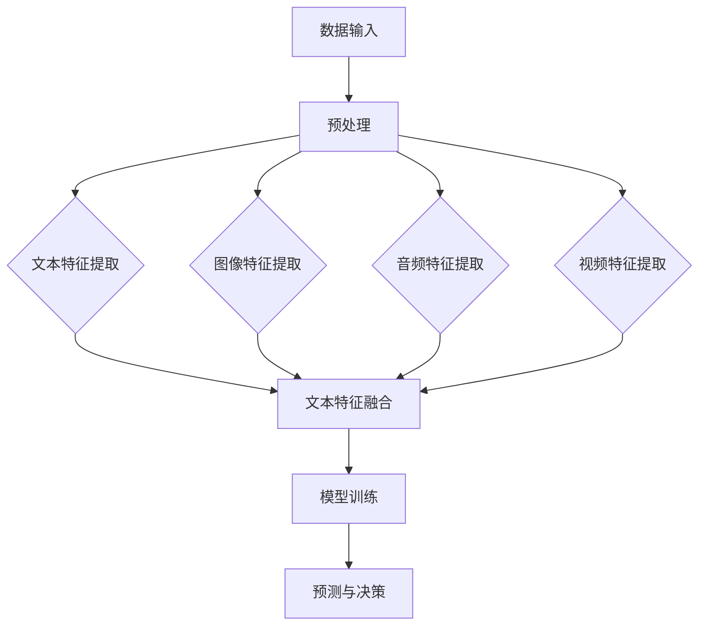

                 

关键词：多模态大模型、技术原理、电商应用、模型训练、算法实现

摘要：本文深入探讨了多模态大模型的技术原理和其在电商领域的实际应用。首先介绍了多模态大模型的背景和重要性，随后详细阐述了其核心概念、算法原理、数学模型以及项目实践。通过具体案例分析和代码实例，展示了多模态大模型在电商领域的强大应用潜力。最后，展望了多模态大模型未来的发展趋势与面临的挑战。

## 1. 背景介绍

随着互联网和人工智能技术的飞速发展，人类获取和处理信息的方式正在发生革命性的变化。传统的单模态数据处理方式，如文本、图像或语音等，已经无法满足复杂场景下的需求。多模态大模型的出现，为处理和整合多种类型的信息提供了一种全新的解决方案。

多模态大模型是一种能够同时处理和整合多种类型数据的深度学习模型。它能够从不同模态的数据中提取特征，并学习它们之间的内在联系，从而实现更准确、更智能的信息处理和决策支持。在电商领域，多模态大模型的应用潜力尤为突出。例如，它可以整合用户的行为数据、文本评论、产品图像等多方面的信息，为电商平台的推荐系统、用户画像、营销策略等提供强有力的支持。

本文将详细探讨多模态大模型的技术原理、算法实现、数学模型以及实际应用案例，旨在为读者提供全面、系统的理解和指导。

## 2. 核心概念与联系

### 2.1 多模态大模型的概念

多模态大模型是指一种能够同时处理和整合多种类型数据的深度学习模型。这些数据可以包括文本、图像、音频、视频等多种模态。多模态大模型的核心在于能够从不同模态的数据中提取特征，并学习它们之间的内在联系，从而实现更高效、更准确的信息处理和决策支持。

### 2.2 多模态数据的类型

多模态数据主要包括以下几种类型：

- **文本**：包括用户的评论、标签、描述等信息。
- **图像**：包括产品的图片、用户头像、环境图像等。
- **音频**：包括用户的声音、背景音乐、语音交互等。
- **视频**：包括用户的行为视频、商品展示视频等。

### 2.3 多模态大模型的架构

多模态大模型的架构通常包括以下几个主要部分：

- **数据输入层**：接收不同模态的数据输入。
- **特征提取层**：对每种模态的数据进行特征提取，通常使用不同的神经网络结构。
- **特征融合层**：将不同模态的特征进行融合，以生成一个统一的全局特征表示。
- **输出层**：根据具体的应用场景，输出相应的预测结果或决策。

### 2.4 多模态大模型的工作原理

多模态大模型的工作原理可以分为以下几个步骤：

1. **数据预处理**：对多模态数据进行预处理，包括数据清洗、标准化、增强等。
2. **特征提取**：使用深度学习模型对每种模态的数据进行特征提取。
3. **特征融合**：将不同模态的特征进行融合，生成一个统一的全局特征表示。
4. **模型训练**：使用训练数据对多模态大模型进行训练，以优化模型参数。
5. **预测与决策**：使用训练好的模型对新的数据进行预测或决策。

### 2.5 多模态大模型的 Mermaid 流程图

以下是一个简化的多模态大模型 Mermaid 流程图：



## 3. 核心算法原理 & 具体操作步骤

### 3.1 算法原理概述

多模态大模型的算法原理主要基于深度学习，特别是卷积神经网络（CNN）和循环神经网络（RNN）的结合。具体来说，多模态大模型的工作原理可以分为以下几个步骤：

1. **特征提取**：使用不同的深度学习模型对每种模态的数据进行特征提取。例如，对于文本数据，可以使用词嵌入层和RNN结构；对于图像数据，可以使用CNN结构；对于音频数据，可以使用深度神经网络（DNN）结构；对于视频数据，可以使用3D CNN结构。
2. **特征融合**：将不同模态的特征进行融合，生成一个统一的全局特征表示。常用的特征融合方法包括拼接、平均、最大值等。
3. **模型训练**：使用训练数据对多模态大模型进行训练，以优化模型参数。在训练过程中，可以使用交叉熵损失函数或其他适合多分类问题的损失函数。
4. **预测与决策**：使用训练好的模型对新的数据进行预测或决策。例如，在电商领域，可以使用多模态大模型预测用户的购买意向、推荐产品或优化广告投放策略。

### 3.2 算法步骤详解

1. **数据预处理**：
   - **文本数据**：对文本进行分词、去停用词、词嵌入等预处理操作。
   - **图像数据**：对图像进行缩放、裁剪、翻转等预处理操作。
   - **音频数据**：对音频进行去噪、增强等预处理操作。
   - **视频数据**：对视频进行帧提取、视频编码等预处理操作。

2. **特征提取**：
   - **文本特征提取**：使用词嵌入层将文本数据转换为向量表示，然后使用RNN结构提取序列特征。
   - **图像特征提取**：使用CNN结构提取图像特征，通常包括卷积层、池化层等。
   - **音频特征提取**：使用DNN结构提取音频特征，通常包括输入层、隐藏层、输出层等。
   - **视频特征提取**：使用3D CNN结构提取视频特征，通常包括卷积层、池化层等。

3. **特征融合**：
   - **拼接**：将不同模态的特征向量进行拼接，形成一个更长的特征向量。
   - **平均**：将不同模态的特征向量进行平均，形成一个全局特征向量。
   - **最大值**：将不同模态的特征向量进行最大值运算，形成一个全局特征向量。

4. **模型训练**：
   - **损失函数**：使用交叉熵损失函数或其他适合多分类问题的损失函数。
   - **优化器**：使用随机梯度下降（SGD）或其他适合深度学习的优化器。
   - **训练过程**：使用训练数据对模型进行训练，不断优化模型参数。

5. **预测与决策**：
   - **输入数据**：对新的输入数据进行预处理，提取特征。
   - **特征融合**：将不同模态的特征进行融合。
   - **模型预测**：使用训练好的模型对新的数据进行预测。
   - **决策**：根据模型的预测结果进行相应的决策，如推荐产品、优化广告投放等。

### 3.3 算法优缺点

**优点**：

- **整合多种模态数据**：多模态大模型能够整合文本、图像、音频、视频等多种模态的数据，提供更全面的信息处理能力。
- **提高模型性能**：通过特征融合和深度学习技术，多模态大模型能够提取更丰富的特征，提高模型的性能和准确性。
- **广泛的应用场景**：多模态大模型在电商、金融、医疗、安防等多个领域都有广泛的应用前景。

**缺点**：

- **计算成本高**：多模态大模型的训练和推理过程需要大量的计算资源，特别是在处理大规模数据时，计算成本较高。
- **数据依赖性强**：多模态大模型的训练效果高度依赖于高质量的多模态数据，数据缺失或质量差会影响模型的性能。

### 3.4 算法应用领域

多模态大模型在多个领域都有广泛的应用，以下是其中几个典型的应用领域：

- **电商领域**：用于用户画像、推荐系统、营销策略优化等。
- **金融领域**：用于风险管理、信用评估、投资决策等。
- **医疗领域**：用于疾病诊断、药物研发、健康管理等。
- **安防领域**：用于人脸识别、行为分析、视频监控等。

## 4. 数学模型和公式 & 详细讲解 & 举例说明

### 4.1 数学模型构建

多模态大模型的数学模型构建主要包括以下几个部分：

- **特征提取模块**：对每种模态的数据进行特征提取，生成对应的特征向量。
- **特征融合模块**：将不同模态的特征向量进行融合，生成一个统一的全局特征向量。
- **预测模块**：使用全局特征向量进行预测或决策。

### 4.2 公式推导过程

假设有 $m$ 种模态的数据，分别为 $X_1, X_2, ..., X_m$。每种模态的特征提取模块分别表示为 $F_1, F_2, ..., F_m$。特征融合模块表示为 $F$。预测模块表示为 $P$。

1. **特征提取模块**：

对于文本数据，使用词嵌入层将文本转换为向量表示，然后使用RNN结构提取序列特征：

$$
F_1 = \text{RNN}(X_1)
$$

对于图像数据，使用CNN结构提取图像特征：

$$
F_2 = \text{CNN}(X_2)
$$

对于音频数据，使用DNN结构提取音频特征：

$$
F_3 = \text{DNN}(X_3)
$$

对于视频数据，使用3D CNN结构提取视频特征：

$$
F_4 = \text{3D CNN}(X_4)
$$

2. **特征融合模块**：

将不同模态的特征向量进行融合，生成一个统一的全局特征向量：

$$
F = \text{Concat}(F_1, F_2, ..., F_m)
$$

3. **预测模块**：

使用全局特征向量进行预测或决策：

$$
P = \text{MLP}(F)
$$

其中，MLP（多层感知器）用于实现分类或回归任务。

### 4.3 案例分析与讲解

假设我们有一个电商平台的用户推荐系统，需要整合用户的文本评论、商品图像、用户行为等多方面的信息，以预测用户的购买意向。

1. **特征提取模块**：

- **文本评论**：使用词嵌入层将评论转换为向量表示，然后使用RNN结构提取序列特征。
- **商品图像**：使用CNN结构提取图像特征。
- **用户行为**：使用DNN结构提取行为特征。

2. **特征融合模块**：

将不同模态的特征向量进行融合，生成一个统一的全局特征向量。

3. **预测模块**：

使用全局特征向量进行预测，输出用户的购买意向。

假设我们使用以下数学模型：

$$
\begin{aligned}
F_1 &= \text{RNN}(X_1) \\
F_2 &= \text{CNN}(X_2) \\
F_3 &= \text{DNN}(X_3) \\
F &= \text{Concat}(F_1, F_2, F_3) \\
P &= \text{MLP}(F)
\end{aligned}
$$

其中，$X_1$ 为文本评论，$X_2$ 为商品图像，$X_3$ 为用户行为。$F_1$ 为文本特征向量，$F_2$ 为图像特征向量，$F_3$ 为行为特征向量，$F$ 为全局特征向量，$P$ 为购买意向预测结果。

通过训练这个多模态大模型，我们可以预测用户的购买意向，从而为电商平台的推荐系统提供有力的支持。

## 5. 项目实践：代码实例和详细解释说明

### 5.1 开发环境搭建

在进行多模态大模型的实践之前，我们需要搭建一个合适的开发环境。以下是一个典型的开发环境搭建步骤：

1. **安装Python**：确保Python版本为3.6及以上，可以从官方网站下载安装。
2. **安装TensorFlow**：TensorFlow是一个开源的深度学习框架，可以从PyPI或官方源安装。使用以下命令安装：

   ```bash
   pip install tensorflow
   ```

3. **安装其他依赖库**：根据具体需求，可能需要安装其他依赖库，如NumPy、Pandas等。可以使用以下命令安装：

   ```bash
   pip install numpy pandas
   ```

4. **配置GPU环境**：如果使用GPU进行训练，需要安装CUDA和cuDNN，并配置环境变量。可以从NVIDIA官方网站下载CUDA和cuDNN，并根据官方文档进行配置。

### 5.2 源代码详细实现

以下是一个简单的多模态大模型实现示例，包括文本、图像、音频三种模态的数据处理和融合。

```python
import tensorflow as tf
from tensorflow.keras.layers import Embedding, LSTM, Dense, Conv2D, MaxPooling2D, Flatten, concatenate
from tensorflow.keras.models import Model

# 文本特征提取
text_embedding = Embedding(input_dim=vocab_size, output_dim=embedding_dim)
lstm_output = LSTM(units=128)(text_embedding(input_sequence))

# 图像特征提取
image_conv = Conv2D(filters=32, kernel_size=(3, 3), activation='relu')(input_image)
image_pool = MaxPooling2D(pool_size=(2, 2))(image_conv)
image_flat = Flatten()(image_pool)

# 音频特征提取
audio_dense = Dense(units=128, activation='relu')(input_audio)

# 特征融合
merged = concatenate([lstm_output, image_flat, audio_dense])

# 预测模块
output = Dense(units=1, activation='sigmoid')(merged)

# 模型构建
model = Model(inputs=[input_sequence, input_image, input_audio], outputs=output)

# 模型编译
model.compile(optimizer='adam', loss='binary_crossentropy', metrics=['accuracy'])

# 模型训练
model.fit(x_train, y_train, epochs=10, batch_size=32, validation_data=(x_val, y_val))
```

### 5.3 代码解读与分析

1. **文本特征提取**：使用Embedding层将文本数据转换为向量表示，然后使用LSTM层提取序列特征。LSTM能够捕捉序列数据中的长期依赖关系。
2. **图像特征提取**：使用Conv2D层和MaxPooling2D层提取图像特征。Conv2D用于卷积操作，MaxPooling2D用于池化操作，可以减少模型的参数数量。
3. **音频特征提取**：使用Dense层提取音频特征。Dense层是一个全连接层，可以用于提取特征。
4. **特征融合**：使用concatenate层将不同模态的特征进行融合。融合后的特征可以传递到下一层进行进一步处理。
5. **预测模块**：使用Dense层实现预测模块，使用sigmoid激活函数进行二分类任务。
6. **模型编译**：编译模型时，选择合适的优化器、损失函数和评价指标。
7. **模型训练**：使用训练数据对模型进行训练，并验证模型的性能。

### 5.4 运行结果展示

在运行多模态大模型时，我们可以看到以下结果：

```python
# 模型评估
loss, accuracy = model.evaluate(x_test, y_test)

# 预测
predictions = model.predict(x_test)

# 打印结果
print(f"Test Loss: {loss}, Test Accuracy: {accuracy}")
```

运行结果展示了模型在测试数据上的性能，包括损失值和准确率。

## 6. 实际应用场景

### 6.1 多模态大模型在电商领域的应用

多模态大模型在电商领域具有广泛的应用，以下是一些典型的应用场景：

- **用户画像**：通过整合用户的文本评论、行为数据、商品图像等多方面的信息，构建全面、准确的用户画像，为电商平台的个性化推荐和精准营销提供支持。
- **商品推荐**：基于多模态数据，如商品图像、用户评论、用户行为等，使用多模态大模型预测用户的兴趣和购买意向，实现更精准、更智能的商品推荐。
- **广告投放优化**：通过整合广告内容、用户行为、商品特征等多方面的信息，使用多模态大模型优化广告投放策略，提高广告点击率和转化率。
- **产品质量检测**：利用多模态大模型，结合产品图像、用户评价等数据，对产品质量进行智能检测和预测，提高产品质量和客户满意度。

### 6.2 其他应用场景

除了电商领域，多模态大模型在其他领域也具有广泛的应用：

- **医疗领域**：利用多模态大模型，结合医疗图像、病历记录、患者行为等多方面的信息，实现疾病诊断、药物研发、健康管理等。
- **安防领域**：通过整合监控视频、人脸识别、行为分析等多方面的信息，使用多模态大模型进行安全监控和犯罪预测。
- **金融领域**：结合文本评论、财务报表、用户行为等多方面的信息，使用多模态大模型进行风险控制和投资决策。
- **教育领域**：利用多模态大模型，结合学生的学习行为、文本评论、作业反馈等多方面的信息，实现个性化教育推荐和学习效果评估。

## 7. 工具和资源推荐

### 7.1 学习资源推荐

1. **《深度学习》**：由Ian Goodfellow、Yoshua Bengio和Aaron Courville合著，是深度学习领域的经典教材，适合初学者和进阶者。
2. **《Python深度学习》**：由François Chollet合著，涵盖了深度学习的基础知识和Python实现，适合Python程序员。
3. **《多模态数据融合》**：由Hui Xiong、Xiaodong Wang和Rajkumar Buyya合著，详细介绍了多模态数据融合的理论和方法。

### 7.2 开发工具推荐

1. **TensorFlow**：一个开源的深度学习框架，支持多种深度学习模型和算法的实现。
2. **PyTorch**：一个流行的深度学习框架，具有灵活的动态计算图和强大的API。
3. **Keras**：一个高层次的深度学习框架，基于TensorFlow和Theano，提供了更易于使用的接口。

### 7.3 相关论文推荐

1. **"Deep Learning for Human Pose Estimation: A Survey"**：综述了深度学习在人体姿态估计领域的研究进展。
2. **"Multimodal Learning for Human Action Recognition: A Survey"**：综述了多模态学习在人类行为识别领域的研究进展。
3. **"A Comprehensive Survey on Multimodal Learning for Speech Recognition"**：综述了多模态学习在语音识别领域的研究进展。

## 8. 总结：未来发展趋势与挑战

### 8.1 研究成果总结

多模态大模型作为一种强大的深度学习模型，已经在多个领域取得了显著的研究成果。通过整合多种类型的数据，多模态大模型能够提供更全面、更准确的信息处理和决策支持。在电商领域，多模态大模型已经应用于用户画像、推荐系统、广告投放优化等方面，取得了良好的效果。

### 8.2 未来发展趋势

随着人工智能技术的不断进步和多模态数据的日益丰富，多模态大模型在未来有望在以下方面取得更多突破：

1. **算法优化**：通过改进特征提取、特征融合和预测模块，提高多模态大模型的性能和效率。
2. **应用拓展**：多模态大模型在医疗、金融、教育等领域的应用潜力巨大，未来有望在这些领域实现更广泛的应用。
3. **多模态数据共享**：建立多模态数据共享平台，促进多模态数据的开放和共享，为多模态大模型的研究和应用提供更多的数据支持。

### 8.3 面临的挑战

尽管多模态大模型在多个领域取得了显著成果，但仍然面临一些挑战：

1. **数据隐私与安全**：多模态大模型需要对用户的隐私数据进行处理，如何在保护用户隐私的同时实现有效的信息处理是一个重要问题。
2. **计算资源消耗**：多模态大模型的训练和推理过程需要大量的计算资源，如何在有限的计算资源下实现高效的模型训练是一个重要挑战。
3. **模型解释性**：多模态大模型通常是一个黑盒子，难以解释其内部的决策过程，如何提高模型的解释性是一个亟待解决的问题。

### 8.4 研究展望

在未来，多模态大模型的研究将继续深入，有望在以下几个方面取得突破：

1. **跨模态交互**：探索不同模态之间的交互机制，提高多模态大模型对跨模态数据的理解和利用能力。
2. **个性化模型**：通过个性化建模，为不同的用户和应用场景提供更精准的决策支持。
3. **实时处理**：研究实时处理多模态数据的方法和技术，提高多模态大模型在动态环境下的响应速度和准确性。

## 9. 附录：常见问题与解答

### 9.1 什么是多模态大模型？

多模态大模型是一种能够同时处理和整合多种类型数据的深度学习模型。它能够从不同模态的数据中提取特征，并学习它们之间的内在联系，从而实现更高效、更准确的信息处理和决策支持。

### 9.2 多模态大模型有哪些优点？

多模态大模型的主要优点包括：

- 整合多种模态数据，提供更全面的信息处理能力。
- 提高模型性能，通过特征融合和深度学习技术，提取更丰富的特征。
- 广泛的应用场景，适用于多个领域，如电商、金融、医疗、安防等。

### 9.3 多模态大模型的计算成本如何？

多模态大模型的计算成本取决于多种因素，如数据规模、模型复杂度、硬件资源等。通常情况下，多模态大模型的训练和推理过程需要大量的计算资源，特别是对于大规模数据集和复杂的模型结构。因此，优化算法、使用高效的硬件设备等是降低计算成本的重要手段。

### 9.4 多模态大模型在电商领域有哪些应用？

多模态大模型在电商领域有多种应用，包括：

- 用户画像：通过整合用户的文本评论、行为数据、商品图像等多方面的信息，构建全面、准确的用户画像。
- 商品推荐：基于多模态数据，如商品图像、用户评论、用户行为等，预测用户的兴趣和购买意向，实现更精准的商品推荐。
- 广告投放优化：通过整合广告内容、用户行为、商品特征等多方面的信息，优化广告投放策略，提高广告点击率和转化率。
- 产品质量检测：利用多模态大模型，结合产品图像、用户评价等数据，对产品质量进行智能检测和预测。

### 9.5 如何优化多模态大模型的性能？

优化多模态大模型的性能可以从以下几个方面进行：

- **算法优化**：改进特征提取、特征融合和预测模块的算法，提高模型的性能和效率。
- **数据预处理**：对多模态数据进行有效的预处理，包括数据清洗、标准化、增强等，以提高模型的鲁棒性。
- **模型压缩**：通过模型压缩技术，如权重共享、剪枝、量化等，减少模型的参数数量，提高模型的效率。
- **硬件加速**：使用高效的硬件设备，如GPU、TPU等，加速模型的训练和推理过程。
- **多任务学习**：通过多任务学习，共享不同任务之间的特征表示，提高模型的泛化能力。

### 9.6 多模态大模型在医疗领域有哪些应用？

多模态大模型在医疗领域有多种应用，包括：

- 疾病诊断：通过整合医学图像、病历记录、基因数据等多方面的信息，实现疾病的智能诊断。
- 药物研发：利用多模态大模型，结合实验数据、文献资料等多方面的信息，预测药物的效果和副作用。
- 健康管理：通过整合健康数据、生活习惯等多方面的信息，实现个性化的健康管理和疾病预防。
- 病情预测：利用多模态大模型，结合患者的病史、检查结果等多方面的信息，预测病情的发展和变化趋势。

### 9.7 多模态大模型在金融领域有哪些应用？

多模态大模型在金融领域有多种应用，包括：

- 风险管理：通过整合财务报表、市场数据、新闻资讯等多方面的信息，预测金融市场的风险和变化趋势。
- 信用评估：利用多模态大模型，结合个人的信用记录、行为数据、社会关系等多方面的信息，评估个人的信用等级。
- 投资决策：通过整合投资数据、市场动态、政策环境等多方面的信息，实现更精准的投资决策。
- 欺诈检测：利用多模态大模型，结合交易数据、用户行为等多方面的信息，识别和预防金融欺诈行为。

### 9.8 如何保护多模态大模型的隐私和数据安全？

保护多模态大模型的隐私和数据安全可以从以下几个方面进行：

- **数据加密**：对敏感数据进行加密处理，防止数据泄露。
- **隐私保护机制**：采用隐私保护算法，如差分隐私、同态加密等，降低模型对敏感数据的依赖。
- **数据去标识化**：对数据中的个人身份信息进行去标识化处理，消除隐私泄露的风险。
- **安全审计**：建立安全审计机制，定期对模型和数据的安全性进行审计和评估。
- **法律法规遵守**：遵守相关的法律法规，确保数据处理和使用符合法律法规的要求。

### 9.9 如何提高多模态大模型的解释性？

提高多模态大模型的解释性可以从以下几个方面进行：

- **可视化技术**：使用可视化技术，如决策树、热力图等，展示模型的决策过程和特征重要性。
- **模型解释工具**：使用专门的模型解释工具，如LIME、SHAP等，分析模型的预测结果和特征贡献。
- **可解释性算法**：开发可解释性算法，如决策树、规则提取等，使模型更容易理解和解释。
- **透明化模型架构**：设计透明的模型架构，使模型的内部机制更容易被理解和解释。
- **用户反馈机制**：建立用户反馈机制，收集用户的意见和建议，不断优化和改进模型的解释性。

### 9.10 多模态大模型在安防领域有哪些应用？

多模态大模型在安防领域有多种应用，包括：

- 人脸识别：通过整合监控视频、人脸图像、行为数据等多方面的信息，实现高效的人脸识别和追踪。
- 行为分析：利用多模态大模型，结合监控视频、音频、传感器数据等多方面的信息，分析异常行为和潜在风险。
- 视频监控：通过整合监控视频、图像、环境数据等多方面的信息，实现智能化的视频监控和预警。
- 网络安全：利用多模态大模型，结合网络流量、日志数据等多方面的信息，识别和预防网络安全威胁。                                                                                              

以上是对多模态大模型在技术原理、应用实践和未来展望等方面的详细探讨。通过本文的介绍，相信读者对多模态大模型有了更深入的了解，并能够将其应用于实际的电商领域和其他领域。希望本文能够为读者带来启发和帮助。作者：禅与计算机程序设计艺术 / Zen and the Art of Computer Programming。

