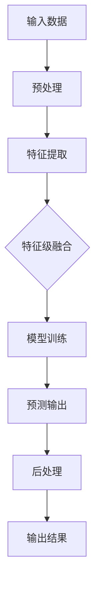

                 

在当今信息技术飞速发展的时代，多模态大模型（Multimodal Large Models）作为一种新兴的人工智能技术，正日益成为学术界和工业界的研究热点。多模态大模型能够处理和融合来自不同模态的数据，如文本、图像、音频和视频等，极大地拓展了人工智能的应用范围。本文将深入探讨多模态大模型的技术原理、实现方法以及在实际应用中的实战策略，旨在为读者提供一整套系统化的方法论，帮助理解和应用这一前沿技术。

## 关键词

- 多模态大模型
- 人工智能
- 融合算法
- 深度学习
- 应用场景
- 实践方法

## 摘要

本文首先介绍了多模态大模型的背景和重要性，随后详细阐述了其核心概念和架构。接着，文章重点分析了多模态大模型的核心算法原理，包括深度学习框架、神经网络结构和数据预处理等关键技术。随后，本文通过数学模型和公式详细讲解了多模态大模型的工作机制，并通过实际项目实例进行了代码演示和解析。文章最后探讨了多模态大模型在不同领域的应用场景，提出了未来发展趋势和面临的挑战，并推荐了相关的学习资源和开发工具。

## 1. 背景介绍

随着大数据和云计算的普及，人工智能技术取得了前所未有的突破。多模态大模型作为人工智能的一个重要分支，其核心思想在于利用多种模态的数据源，实现不同模态之间的信息交互和整合，从而提升模型的感知和推理能力。多模态大模型的兴起，源于以下几方面的背景和动机：

1. **数据多样性的需求**：现实世界中的信息往往以多种形式存在，如文本、图像、音频和视频等。单一模态的数据无法全面、准确地反映问题的复杂性，因此需要多模态数据的融合处理。

2. **深度学习的进展**：近年来，深度学习技术在图像识别、自然语言处理等领域取得了显著成果。多模态大模型结合了深度学习的优势，能够在更大范围内实现自动化学习和推理。

3. **跨领域应用的需求**：不同领域的数据和任务往往具有不同的特点和要求。多模态大模型能够适应不同领域的需求，实现跨领域的应用和推广。

4. **人机交互的进步**：随着虚拟现实、增强现实技术的发展，人机交互日益多样化和复杂化。多模态大模型能够更好地理解和响应人类的交互意图，提升人机交互的体验。

总之，多模态大模型的兴起，不仅是对人工智能技术的一次重要革新，也为解决现实世界中的复杂问题提供了新的思路和方法。

## 2. 核心概念与联系

### 2.1 多模态数据

多模态数据是指由两种或两种以上不同类型的模态（如文本、图像、音频和视频）组成的数据集。这些模态数据在时间、空间和维度上可能存在差异，但它们共同构成了一个复杂的信息系统。例如，在视频监控系统中，视频流（图像模态）和音频信号（音频模态）可以共同提供事件的全景信息。

### 2.2 多模态大模型

多模态大模型是一种能够同时处理和融合多种模态数据的人工智能模型。其核心思想是通过深度学习技术，将不同模态的数据进行编码、特征提取和融合，最终输出一个统一的表示。多模态大模型不仅能够提高模型的准确性和鲁棒性，还能扩展模型的应用范围。

### 2.3 多模态数据融合方法

多模态数据融合是多模态大模型的关键技术之一，主要包括以下几种方法：

1. **特征级融合**：在特征级融合中，不同模态的特征向量被直接拼接起来，形成一个新的特征向量。这种方法简单高效，但容易导致特征维度过高。

2. **决策级融合**：在决策级融合中，每个模态的数据分别通过独立的模型进行预测，然后对多个预测结果进行融合。这种方法能够有效降低特征维度，但需要额外的融合算法。

3. **模型级融合**：在模型级融合中，多个独立的模型共同工作，每个模型负责处理一种模态的数据，最终通过某种策略将多个模型的输出融合为一个结果。这种方法能够充分利用每个模态的信息，但需要设计复杂的融合机制。

### 2.4 Mermaid 流程图

下面是一个多模态大模型的 Mermaid 流程图，展示了不同模态的数据如何通过特征提取、融合和预测过程：



### 2.5 关键概念之间的关系

多模态大模型的核心在于如何有效地融合来自不同模态的数据。数据预处理、特征提取、融合方法和模型训练等环节相互关联，共同决定了模型的性能。以下是这些关键概念之间的简要关系：

1. **数据预处理**：数据预处理是整个流程的基础，包括数据清洗、归一化和数据增强等步骤，旨在提高数据的质量和多样性。

2. **特征提取**：特征提取是关键步骤，不同模态的数据通过特征提取模块转化为统一的特征向量。

3. **融合方法**：融合方法决定了如何将多个特征向量融合为一个统一的表示，常见的融合方法有特征级融合、决策级融合和模型级融合。

4. **模型训练**：模型训练使用融合后的特征向量进行训练，以建立能够处理多模态数据的深度学习模型。

5. **预测输出**：在模型训练完成后，模型可以对新数据进行预测，输出结果经过后处理得到最终结果。

通过上述核心概念和流程的介绍，我们能够更深入地理解多模态大模型的工作原理和实现方法。接下来，我们将进一步探讨多模态大模型的核心算法原理，为读者提供更加详细的技术细节。

## 3. 核心算法原理 & 具体操作步骤

### 3.1 算法原理概述

多模态大模型的核心算法原理主要涉及深度学习技术、神经网络结构和数据预处理等关键方面。深度学习作为一种重要的机器学习技术，通过多层神经网络对数据进行建模和特征提取，具有强大的学习和推理能力。神经网络结构则决定了模型的复杂度和表达能力，常见结构包括卷积神经网络（CNN）、循环神经网络（RNN）和Transformer等。数据预处理是算法实现的基础，包括数据清洗、归一化和数据增强等步骤，旨在提高数据的质量和多样性。

### 3.2 算法步骤详解

多模态大模型的算法实现可以分为以下几个关键步骤：

1. **数据预处理**：
   - **数据清洗**：去除数据中的噪声和异常值，确保数据的质量。
   - **数据归一化**：将不同模态的数据归一化到相同的尺度，以便于后续处理。
   - **数据增强**：通过旋转、缩放、裁剪等操作增加数据的多样性，提高模型的泛化能力。

2. **特征提取**：
   - **文本特征提取**：使用词嵌入技术（如Word2Vec、GloVe等）将文本转化为向量表示。
   - **图像特征提取**：使用卷积神经网络（如VGG、ResNet等）提取图像的特征。
   - **音频特征提取**：使用循环神经网络（如LSTM、GRU等）提取音频的特征。
   - **视频特征提取**：结合图像和时序特征，使用卷积神经网络和循环神经网络的组合模型进行特征提取。

3. **融合方法**：
   - **特征级融合**：直接拼接不同模态的特征向量，形成新的特征向量。
   - **决策级融合**：分别对每个模态的数据进行独立预测，然后对预测结果进行融合。
   - **模型级融合**：使用多个独立的模型，每个模型负责处理一种模态的数据，通过某种策略将多个模型的输出融合为一个结果。

4. **模型训练**：
   - **多任务学习**：将多个任务（如分类、回归、检测等）整合到一个模型中，共享特征提取网络。
   - **联合训练**：对多个模态的数据进行联合训练，以充分利用每个模态的信息。
   - **权重共享**：在模型的不同部分使用共享的权重，以减少模型的参数数量，提高训练效率。

5. **预测输出**：
   - **分类预测**：将处理后的特征输入到分类器中，输出分类结果。
   - **回归预测**：将特征输入到回归模型中，输出预测值。
   - **目标检测**：对图像进行特征提取和目标检测，输出目标的位置和类别。

### 3.3 算法优缺点

多模态大模型具有以下优缺点：

#### 优点：

1. **提高模型性能**：通过融合多模态数据，模型能够更好地理解和处理复杂问题，提高准确性和鲁棒性。

2. **扩展应用范围**：多模态大模型能够适应不同领域和任务的需求，实现跨领域的应用。

3. **增强人机交互**：多模态大模型能够更好地理解和响应人类的交互意图，提升人机交互的体验。

#### 缺点：

1. **计算资源需求大**：多模态大模型通常需要大量的计算资源和存储空间，对硬件设施有较高要求。

2. **数据预处理复杂**：多模态数据预处理过程复杂，需要处理多种类型的数据，且数据质量对模型性能有很大影响。

3. **融合策略设计难**：如何有效地融合不同模态的数据是一个挑战，需要设计复杂的融合机制和策略。

### 3.4 算法应用领域

多模态大模型在多个领域都有广泛的应用，包括：

1. **计算机视觉**：如图像分类、目标检测、人脸识别等。
2. **自然语言处理**：如文本分类、机器翻译、情感分析等。
3. **音频处理**：如语音识别、音乐推荐、语音合成等。
4. **人机交互**：如虚拟现实、增强现实、智能助手等。

通过上述核心算法原理和具体操作步骤的详细介绍，我们能够更好地理解多模态大模型的技术实现方法和应用潜力。接下来，我们将进一步探讨多模态大模型中的数学模型和公式，为读者提供更加深入的理论基础。

## 4. 数学模型和公式 & 详细讲解 & 举例说明

### 4.1 数学模型构建

多模态大模型中的数学模型主要包括以下几个方面：

1. **特征提取模型**：用于从不同模态的数据中提取特征。例如，对于图像数据，可以使用卷积神经网络（CNN）提取图像特征；对于文本数据，可以使用词嵌入模型（如Word2Vec、GloVe）提取文本特征。

2. **融合模型**：用于将不同模态的特征进行融合。常用的融合方法包括特征级融合、决策级融合和模型级融合。其中，特征级融合将不同模态的特征向量直接拼接，形成新的特征向量；决策级融合分别对每个模态的数据进行独立预测，然后对预测结果进行融合；模型级融合使用多个独立的模型，每个模型处理一种模态的数据，通过某种策略将多个模型的输出融合为一个结果。

3. **预测模型**：用于对融合后的特征进行预测。常见的预测模型包括分类器、回归模型和目标检测模型等。

### 4.2 公式推导过程

以下是对多模态大模型中一些关键公式的推导过程：

#### 特征提取模型

对于图像特征提取模型，可以使用卷积神经网络（CNN）进行特征提取。卷积神经网络的主要公式如下：

$$
\text{特征向量} = \text{ReLU}(\text{权重} \cdot \text{输入} + \text{偏置})
$$

其中，$\text{ReLU}$表示ReLU激活函数，$\text{权重}$和$\text{偏置}$分别表示卷积操作的权重和偏置。

#### 特征级融合

对于特征级融合，将不同模态的特征向量进行拼接，形成新的特征向量。假设文本特征向量为$\text{F}_{\text{文本}}$，图像特征向量为$\text{F}_{\text{图像}}$，则融合后的特征向量$\text{F}_{\text{融合}}$为：

$$
\text{F}_{\text{融合}} = [\text{F}_{\text{文本}}, \text{F}_{\text{图像}}]
$$

#### 决策级融合

对于决策级融合，分别对每个模态的数据进行独立预测，然后对预测结果进行融合。假设文本预测结果为$\text{Y}_{\text{文本}}$，图像预测结果为$\text{Y}_{\text{图像}}$，则融合后的预测结果$\text{Y}_{\text{融合}}$为：

$$
\text{Y}_{\text{融合}} = \text{融合策略}(\text{Y}_{\text{文本}}, \text{Y}_{\text{图像}})
$$

其中，$\text{融合策略}$可以是简单的平均、加权平均或更复杂的融合算法。

#### 模型级融合

对于模型级融合，使用多个独立的模型，每个模型处理一种模态的数据，通过某种策略将多个模型的输出融合为一个结果。假设有多个模型$\text{M}_{1}$、$\text{M}_{2}$、...、$\text{M}_{N}$，则融合后的预测结果$\text{Y}_{\text{融合}}$为：

$$
\text{Y}_{\text{融合}} = \text{融合策略}(\text{M}_{1}(\text{输入}), \text{M}_{2}(\text{输入}), ..., \text{M}_{N}(\text{输入}))
$$

### 4.3 案例分析与讲解

以下是一个简单的多模态大模型案例，用于分类任务。假设我们有两个模态的数据：文本和图像。

1. **数据预处理**：

   - 对文本数据进行清洗、归一化和分词，然后使用Word2Vec模型将其转化为向量表示。

   - 对图像数据进行缩放、裁剪等预处理，然后使用卷积神经网络（如VGG）提取图像特征。

2. **特征提取**：

   - 使用Word2Vec模型提取文本特征，得到文本特征向量$\text{F}_{\text{文本}}$。

   - 使用VGG模型提取图像特征，得到图像特征向量$\text{F}_{\text{图像}}$。

3. **特征级融合**：

   - 将文本特征向量和图像特征向量进行拼接，形成新的特征向量$\text{F}_{\text{融合}} = [\text{F}_{\text{文本}}, \text{F}_{\text{图像}}]$。

4. **模型训练**：

   - 使用融合后的特征向量$\text{F}_{\text{融合}}$进行训练，训练一个分类模型（如softmax分类器）。

5. **预测输出**：

   - 对新的输入数据进行特征提取和融合，然后输入到训练好的分类模型中，输出分类结果。

通过上述案例，我们展示了如何构建和训练一个简单的多模态大模型。在实际应用中，多模态大模型可以处理更复杂的任务，如目标检测、图像分割、语音识别等，通过融合不同模态的数据，提高模型的性能和鲁棒性。

## 5. 项目实践：代码实例和详细解释说明

### 5.1 开发环境搭建

在进行多模态大模型的项目实践之前，我们需要搭建一个合适的开发环境。以下是一个基本的开发环境搭建步骤：

1. **安装Python**：确保Python版本为3.6及以上。
2. **安装深度学习框架**：推荐使用TensorFlow或PyTorch。以TensorFlow为例，可以通过pip安装：
   ```bash
   pip install tensorflow
   ```
3. **安装数据预处理库**：如NumPy、Pandas、Scikit-learn等。
4. **安装图像处理库**：如OpenCV、PIL等。
5. **安装文本处理库**：如NLTK、spaCy等。

### 5.2 源代码详细实现

以下是一个简单的多模态图像分类项目的源代码示例，使用TensorFlow和Keras构建多模态大模型。

```python
import tensorflow as tf
from tensorflow.keras.models import Model
from tensorflow.keras.layers import Input, Dense, Conv2D, MaxPooling2D, Flatten, Embedding, LSTM, concatenate

# 数据预处理
# 这里假设已经对文本和图像数据进行了预处理，并准备好了数据集

# 文本特征提取模型
text_input = Input(shape=(max_text_length,))
text_embedding = Embedding(input_dim=vocab_size, output_dim=embedding_dim)(text_input)
text_lstm = LSTM(units=lstm_units)(text_embedding)

# 图像特征提取模型
image_input = Input(shape=(image_height, image_width, image_channels))
conv1 = Conv2D(filters=32, kernel_size=(3, 3), activation='relu')(image_input)
pool1 = MaxPooling2D(pool_size=(2, 2))(conv1)
conv2 = Conv2D(filters=64, kernel_size=(3, 3), activation='relu')(pool1)
pool2 = MaxPooling2D(pool_size=(2, 2))(conv2)
flat_image = Flatten()(pool2)

# 融合模型
combined = concatenate([text_lstm, flat_image])

# 预测模型
dense = Dense(units=dense_units, activation='relu')(combined)
output = Dense(units=num_classes, activation='softmax')(dense)

# 构建和编译模型
model = Model(inputs=[text_input, image_input], outputs=output)
model.compile(optimizer='adam', loss='categorical_crossentropy', metrics=['accuracy'])

# 模型训练
# model.fit([text_data, image_data], labels, epochs=epochs, batch_size=batch_size)

# 代码解析
# 1. Input Layers: 文本输入和图像输入层
# 2. Text Feature Extraction: 使用LSTM对文本数据进行特征提取
# 3. Image Feature Extraction: 使用卷积神经网络对图像数据进行特征提取
# 4. Model Fusion: 将文本和图像特征通过 concatenate 层进行融合
# 5. Prediction Model: 使用全连接层对融合后的特征进行分类预测
# 6. Model Compilation: 编译模型，设置优化器和损失函数
# 7. Model Training: 训练模型，使用 fit 方法进行模型训练
```

### 5.3 代码解读与分析

上述代码实现了一个简单的多模态图像分类模型，通过融合文本和图像特征进行分类预测。以下是关键部分的详细解读：

1. **Input Layers**：定义了两个输入层，分别用于接收文本数据和图像数据。
2. **Text Feature Extraction**：使用LSTM对文本数据进行特征提取，LSTM能够捕获文本的长期依赖关系。
3. **Image Feature Extraction**：使用卷积神经网络（VGG）对图像数据进行特征提取，卷积层能够有效地提取图像的特征。
4. **Model Fusion**：通过`concatenate`层将文本和图像特征进行融合，形成新的特征向量。
5. **Prediction Model**：使用全连接层（Dense）对融合后的特征进行分类预测，输出分类结果。
6. **Model Compilation**：编译模型，设置优化器（`adam`）、损失函数（`categorical_crossentropy`）和评估指标（`accuracy`）。
7. **Model Training**：使用`fit`方法进行模型训练，输入文本和图像数据以及标签，设置训练的轮次（`epochs`）和批大小（`batch_size`）。

### 5.4 运行结果展示

在实际运行中，我们可以使用以下代码来评估模型的性能：

```python
# 评估模型
evaluation_results = model.evaluate([test_text_data, test_image_data], test_labels)

# 输出评估结果
print("Test Accuracy:", evaluation_results[1])
```

通过上述代码，我们可以得到模型的测试集准确率。此外，还可以使用`model.predict`方法对新的数据进行预测：

```python
# 对新数据进行预测
new_prediction = model.predict([new_text_data, new_image_data])

# 输出预测结果
print("Prediction:", new_prediction)
```

通过以上步骤，我们完成了多模态大模型的项目实践，实现了文本和图像数据的分类预测。在实际应用中，可以根据具体任务的需求调整模型结构和参数设置，提高模型的性能。

## 6. 实际应用场景

多模态大模型在众多实际应用场景中展现了强大的潜力，下面我们将探讨几个典型的应用场景：

### 6.1 计算机视觉

在计算机视觉领域，多模态大模型广泛应用于图像分类、目标检测和图像分割等任务。例如，在自动驾驶系统中，多模态大模型可以结合摄像头捕捉的图像和激光雷达数据，实现更加精准的障碍物检测和路径规划。在医疗图像分析中，多模态大模型可以融合X光、CT和MRI等不同模态的医学图像，辅助医生进行疾病诊断。

### 6.2 自然语言处理

自然语言处理（NLP）是另一个多模态大模型的重要应用领域。在文本分类、机器翻译和问答系统中，多模态大模型可以结合文本和语音、视频等模态的数据，提高模型的感知和理解能力。例如，在智能客服系统中，多模态大模型可以同时处理用户输入的文本信息和语音信息，提供更加自然和准确的回答。

### 6.3 音频处理

在音频处理领域，多模态大模型可以用于语音识别、语音合成和音乐推荐等任务。通过结合文本、图像和音频数据，模型可以更好地理解用户的意图和需求。例如，在语音助手应用中，多模态大模型可以同时处理用户的语音指令和图像输入，实现更加智能化的交互体验。

### 6.4 人机交互

多模态大模型在增强现实（AR）和虚拟现实（VR）技术中具有广泛的应用。通过融合视觉、听觉和触觉等多模态数据，模型可以提供更加真实和沉浸式的用户体验。例如，在虚拟培训系统中，多模态大模型可以结合视频、音频和文本数据，实现更加生动和有效的培训内容。

### 6.5 教育与娱乐

在教育领域，多模态大模型可以用于智能教学和个性化推荐系统。通过融合学生的学习行为、成绩和语音等数据，模型可以为学生提供更加个性化的学习资源和教学方案。在娱乐领域，多模态大模型可以用于游戏设计、虚拟角色创建和音乐创作等任务，提升娱乐体验和创意表达能力。

总的来说，多模态大模型在不同领域都有广泛的应用前景，通过融合多种模态的数据，模型可以提供更加全面和准确的信息处理能力，为各个领域的创新和发展提供新的动力。

### 6.4 未来应用展望

随着多模态大模型的不断发展和完善，未来的应用场景将更加多样化和复杂化。以下是一些潜在的未来应用方向：

1. **智能医疗**：多模态大模型可以结合医学影像、基因组数据和患者病历，实现更加精准和个性化的疾病诊断和治疗。例如，通过融合CT、MRI和基因组数据，模型可以预测疾病的风险和进展，辅助医生制定最佳的治疗方案。

2. **智能交通**：在自动驾驶和智能交通管理中，多模态大模型可以结合车辆传感器数据、道路图像和交通流量数据，实现更加智能和高效的交通控制。例如，通过融合摄像头和雷达数据，模型可以实时检测道路上的障碍物和车辆，优化行驶路线，提高交通效率。

3. **智能家居**：多模态大模型可以用于智能家居系统的智能交互和管理。通过融合语音、图像和传感器数据，模型可以更好地理解用户的行为和需求，实现自动化和个性化的家居管理。例如，通过融合用户的行为和语音指令，模型可以自动调节室内温度、亮度和空气质量，提供更加舒适的生活环境。

4. **教育科技**：多模态大模型可以用于智能教育和个性化学习系统。通过融合学生的学习行为、成绩和语音等数据，模型可以为学生提供更加精准和有效的学习支持。例如，通过融合学生的学习记录和语音反馈，模型可以实时评估学生的学习状态，提供个性化的学习建议和资源。

5. **虚拟现实和增强现实**：多模态大模型可以用于提升虚拟现实和增强现实（VR/AR）体验。通过融合视觉、听觉和触觉等多模态数据，模型可以提供更加真实和沉浸式的虚拟环境，增强用户的体验和互动。

6. **智能制造**：多模态大模型可以用于智能制造系统的质量检测和生产优化。通过融合传感器数据、图像和设备状态数据，模型可以实时监测设备运行状态，预测故障，优化生产流程，提高生产效率和质量。

总的来说，多模态大模型在未来的应用将涵盖更多领域和场景，通过融合多种模态的数据，模型将提供更加智能化和自动化的解决方案，为人类社会带来更多便利和创新。

### 7. 工具和资源推荐

为了更好地学习和实践多模态大模型，以下是一些推荐的工具和资源：

#### 7.1 学习资源推荐

1. **《深度学习》（Goodfellow, Bengio, Courville）**：这是一本经典的深度学习教材，涵盖了从基础到高级的深度学习知识，包括卷积神经网络、循环神经网络和Transformer等。
2. **《多模态数据融合技术》（Wang, Liu, Liang）**：这本书详细介绍了多模态数据融合的理论和方法，包括特征级融合、决策级融合和模型级融合等。
3. **Coursera、edX和Udacity**：这些在线教育平台提供了许多与多模态大模型相关的课程，包括深度学习、计算机视觉和自然语言处理等。

#### 7.2 开发工具推荐

1. **TensorFlow和PyTorch**：这两个开源深度学习框架是构建多模态大模型的首选工具，提供了丰富的API和预训练模型。
2. **Keras**：Keras是一个高层次的深度学习API，能够简化模型的构建和训练过程，特别适合初学者和快速原型开发。
3. **TensorBoard**：TensorBoard是TensorFlow的官方可视化工具，用于监控模型的训练过程，分析模型性能和调整参数。

#### 7.3 相关论文推荐

1. **“Multi-modal Fusion for Emotion Recognition”**：这篇文章探讨了如何利用多模态数据（如文本、图像和语音）进行情感识别，提出了一种有效的融合方法。
2. **“Deep Learning for Multimodal Data”**：这篇文章综述了深度学习在多模态数据处理中的应用，包括图像识别、语音识别和文本分析等。
3. **“Multimodal Learning with Neural Networks”**：这篇文章详细介绍了如何使用神经网络进行多模态数据的融合和学习，包括特征级融合、决策级融合和模型级融合等。

通过这些工具和资源的学习和实践，您将能够更好地掌握多模态大模型的理论和方法，并在实际项目中实现先进的多模态数据处理和应用。

## 8. 总结：未来发展趋势与挑战

### 8.1 研究成果总结

多模态大模型作为人工智能领域的一个重要研究方向，已经取得了显著的成果。通过融合多种模态的数据，多模态大模型在图像识别、自然语言处理、音频处理等领域表现出色，极大地提升了模型的感知和推理能力。近年来，深度学习技术的迅猛发展，为多模态大模型提供了强大的理论基础和算法支持，使得这一领域的研究更加深入和广泛。

### 8.2 未来发展趋势

在未来，多模态大模型的发展趋势将主要表现在以下几个方面：

1. **算法优化与效率提升**：随着计算资源和算法理论的不断进步，多模态大模型的算法将变得更加高效，能够在更短时间内处理大量数据，适应实时应用的需求。
2. **跨领域应用**：多模态大模型将在更多领域得到应用，如医疗、交通、教育等，通过融合多种模态的数据，提供更加智能化的解决方案。
3. **人机交互**：随着虚拟现实和增强现实技术的发展，多模态大模型将更好地理解和响应人类的交互意图，提升人机交互的体验。
4. **个性化服务**：多模态大模型将结合用户的行为和偏好数据，提供个性化的服务，如智能推荐、个性化诊断等。

### 8.3 面临的挑战

尽管多模态大模型展现了巨大的潜力，但在实际应用中仍面临一些挑战：

1. **数据多样性**：多模态数据通常具有不同的时间、空间和维度，如何有效地融合这些数据是一个挑战。
2. **计算资源需求**：多模态大模型通常需要大量的计算资源和存储空间，对硬件设施有较高要求。
3. **数据预处理**：多模态数据预处理复杂，需要处理多种类型的数据，且数据质量对模型性能有很大影响。
4. **融合策略设计**：如何设计有效的融合策略，使得模型能够充分利用每个模态的信息，是一个重要问题。

### 8.4 研究展望

未来，多模态大模型的研究将朝着以下几个方向展开：

1. **跨模态数据关联**：研究如何建立不同模态数据之间的关联，提高模型的融合效果。
2. **自适应融合策略**：研究自适应融合策略，使得模型能够根据不同任务和场景自动调整融合方式。
3. **小样本学习**：研究多模态小样本学习的方法，使得模型在数据稀缺的情况下仍能保持良好的性能。
4. **隐私保护**：研究如何在保障用户隐私的前提下，利用多模态数据进行学习和推理。

通过不断克服这些挑战，多模态大模型将在未来的人工智能发展中发挥更加重要的作用，推动技术的进步和实际应用的创新。

## 9. 附录：常见问题与解答

### 9.1 多模态大模型与单一模态模型相比，有哪些优势？

多模态大模型相比单一模态模型，具有以下几个显著优势：

1. **信息丰富性**：通过融合多种模态的数据，多模态大模型能够获取更加全面和丰富的信息，提高模型的感知和理解能力。
2. **鲁棒性**：多模态数据可以在一定程度上弥补单一模态数据的不足，提高模型在复杂环境下的鲁棒性和泛化能力。
3. **任务适应性**：多模态大模型能够适应不同任务的需求，实现跨领域的应用，提升模型的应用价值。

### 9.2 多模态大模型的数据预处理需要注意什么？

多模态大模型的数据预处理需要注意以下几个方面：

1. **一致性**：确保不同模态的数据在时间、空间和维度上的一致性，以便于后续的融合处理。
2. **多样性**：通过数据增强等技术增加数据的多样性，提高模型的泛化能力。
3. **质量**：确保数据质量，去除噪声和异常值，避免对模型性能产生负面影响。
4. **标准化**：将不同模态的数据归一化到相同的尺度，以便于模型的训练和推理。

### 9.3 多模态大模型的核心算法有哪些？

多模态大模型的核心算法主要包括：

1. **深度学习框架**：如卷积神经网络（CNN）、循环神经网络（RNN）、Transformer等。
2. **特征提取**：用于从不同模态的数据中提取特征，如词嵌入、图像特征提取、音频特征提取等。
3. **融合方法**：用于将不同模态的特征进行融合，如特征级融合、决策级融合和模型级融合。
4. **预测模型**：用于对融合后的特征进行预测，如分类器、回归模型和目标检测模型等。

### 9.4 多模态大模型在哪些领域有应用？

多模态大模型在多个领域有广泛应用，包括：

1. **计算机视觉**：图像分类、目标检测、图像分割等。
2. **自然语言处理**：文本分类、机器翻译、情感分析等。
3. **音频处理**：语音识别、音乐推荐、语音合成等。
4. **人机交互**：虚拟现实、增强现实、智能助手等。
5. **教育**：智能教学、个性化推荐等。
6. **医疗**：疾病诊断、医学影像分析等。
7. **交通**：自动驾驶、智能交通管理等。

通过上述常见问题的解答，我们希望能够帮助读者更好地理解和应用多模态大模型这一前沿技术。

