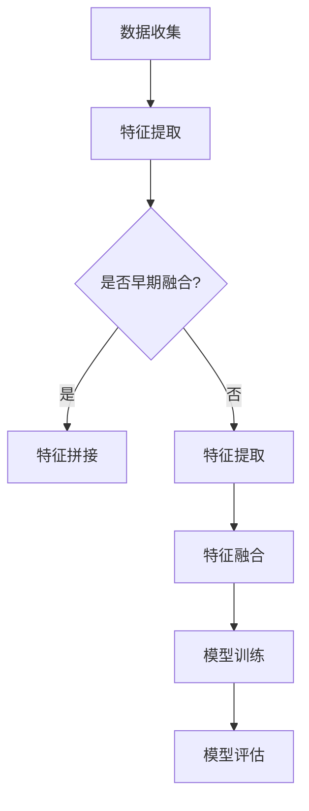

                 

关键词：多模态数据、数据融合、数据表示、人工智能、机器学习、深度学习

摘要：随着人工智能技术的飞速发展，多模态数据的处理与融合成为了当前研究的热点问题。本文首先介绍了多模态数据的背景和重要性，然后详细阐述了多模态数据表示和融合方法的核心概念、原理和应用。通过梳理现有的研究进展，本文提出了一种新的多模态数据融合方法，并对未来研究方向进行了展望。

## 1. 背景介绍

随着信息技术的快速发展，人类获取和处理的信息形式越来越多样化。传统的单一模态数据已经无法满足复杂应用场景的需求。多模态数据融合技术应运而生，它通过对多种模态的数据进行整合和分析，从而提高信息处理的精度和效率。多模态数据可以包括图像、文本、音频、视频等多种类型，它们在不同的领域和应用中发挥着重要作用。

在医疗领域，多模态数据融合可以帮助医生更好地诊断病情，提高诊断准确率。在自动驾驶领域，多模态数据融合可以提升车辆的感知能力和决策能力，从而提高行驶安全。在智能交互领域，多模态数据融合可以提升人机交互的自然性和智能性。

然而，多模态数据的融合面临着诸多挑战，如模态之间的差异、数据的不一致性、信息冗余等。如何有效地表示和融合多模态数据，已经成为人工智能领域的一个重要研究方向。

## 2. 核心概念与联系

### 2.1 多模态数据表示

多模态数据表示是将不同模态的数据转化为统一表示形式的过程。常见的多模态数据表示方法包括：

- **特征级融合**：将不同模态的特征进行直接拼接，形成统一的多模态特征向量。
- **句级融合**：将不同模态的句子进行融合，形成统一的多模态句子表示。
- **图像级融合**：将图像和其他模态的数据进行融合，形成统一的多模态图像表示。

### 2.2 多模态数据融合方法

多模态数据融合方法可以分为以下几类：

- **早期融合**：在特征提取阶段就将不同模态的数据进行融合，常见的方法包括多模态特征拼接和融合网络。
- **晚期融合**：在特征提取完成后将不同模态的特征进行融合，常见的方法包括多模态特征融合和分类器集成。
- **深度融合**：利用深度学习模型对多模态数据进行融合，常见的方法包括多模态深度神经网络和图神经网络。

### 2.3 Mermaid 流程图

下面是一个简化的多模态数据表示和融合方法的 Mermaid 流程图：



## 3. 核心算法原理 & 具体操作步骤

### 3.1 算法原理概述

多模态数据融合算法的原理主要基于以下几个方面：

- **特征提取**：利用特征提取算法从不同模态的数据中提取出具有代表性的特征。
- **特征融合**：将提取出的特征进行整合，形成统一的多模态特征向量。
- **模型训练**：利用融合后的特征进行模型训练，以实现多模态数据的分类、回归等任务。

### 3.2 算法步骤详解

- **数据收集**：收集不同模态的数据，如图像、文本、音频等。
- **特征提取**：对每个模态的数据进行特征提取，得到各自的特征向量。
- **特征融合**：将不同模态的特征向量进行拼接或融合，形成统一的多模态特征向量。
- **模型训练**：利用多模态特征向量进行模型训练，如使用深度学习模型进行分类或回归任务。
- **模型评估**：对训练好的模型进行评估，如计算准确率、召回率等指标。

### 3.3 算法优缺点

- **优点**：多模态数据融合可以充分利用不同模态的数据信息，提高模型的表现力。
- **缺点**：多模态数据融合算法通常需要大量的计算资源和时间，且在处理数据不一致性和信息冗余时可能存在挑战。

### 3.4 算法应用领域

多模态数据融合算法可以应用于多个领域，如医疗、自动驾驶、智能交互等。以下是一些具体的例子：

- **医疗领域**：利用多模态数据融合技术进行疾病诊断和预测。
- **自动驾驶领域**：利用多模态数据融合技术提升车辆的感知和决策能力。
- **智能交互领域**：利用多模态数据融合技术提升人机交互的自然性和智能性。

## 4. 数学模型和公式

### 4.1 数学模型构建

多模态数据融合的数学模型可以表示为：

\[ \text{融合特征向量} = f(\text{图像特征}, \text{文本特征}, \text{音频特征}) \]

其中，\( f \) 是特征融合函数，它可以采用线性或非线性方法。

### 4.2 公式推导过程

假设我们有三个模态的数据 \( x_1, x_2, x_3 \)，它们的特征向量分别为 \( \textbf{f}_1, \textbf{f}_2, \textbf{f}_3 \)。

为了构建融合特征向量，我们可以采用以下公式：

\[ \textbf{f}_{\text{融合}} = \text{Concat}(\textbf{f}_1, \textbf{f}_2, \textbf{f}_3) \]

或者

\[ \textbf{f}_{\text{融合}} = \text{Concat}(\text{Act}(\text{W}_1 \textbf{f}_1 + \text{b}_1), \text{Act}(\text{W}_2 \textbf{f}_2 + \text{b}_2), \text{Act}(\text{W}_3 \textbf{f}_3 + \text{b}_3)) \]

其中，\( \text{Concat} \) 表示特征拼接，\( \text{Act} \) 表示激活函数，\( \text{W}_i \) 和 \( \text{b}_i \) 分别是权重和偏置。

### 4.3 案例分析与讲解

假设我们有两个模态的数据，一个是图像特征向量 \( \textbf{f}_1 \)（维度为 \( 1024 \)），另一个是文本特征向量 \( \textbf{f}_2 \)（维度为 \( 512 \)）。我们可以将这两个特征向量进行拼接：

\[ \textbf{f}_{\text{融合}} = \text{Concat}(\textbf{f}_1, \textbf{f}_2) \]

然后，我们可以利用这个融合特征向量进行分类任务：

\[ \text{分类结果} = \text{softmax}(\text{W}_{\text{分类}} \textbf{f}_{\text{融合}} + \text{b}_{\text{分类}}) \]

其中，\( \text{W}_{\text{分类}} \) 和 \( \text{b}_{\text{分类}} \) 是分类层的权重和偏置。

## 5. 项目实践：代码实例和详细解释说明

### 5.1 开发环境搭建

为了演示多模态数据融合方法，我们使用 Python 编写了一个简单的示例代码。首先，我们需要安装一些必要的库，如 TensorFlow 和 Keras：

```bash
pip install tensorflow
pip install keras
```

### 5.2 源代码详细实现

下面是一个简单的多模态数据融合和分类的 Python 代码示例：

```python
import numpy as np
from keras.models import Model
from keras.layers import Input, Dense, Concatenate, Flatten
from keras.optimizers import Adam

# 假设我们有两个模态的数据，一个是图像特征，另一个是文本特征
image_input = Input(shape=(1024,))
text_input = Input(shape=(512,))

# 对图像特征和文本特征分别进行处理
image_dense = Dense(256, activation='relu')(image_input)
text_dense = Dense(256, activation='relu')(text_input)

# 将处理后的特征进行拼接
concatenated = Concatenate()([image_dense, text_dense])

# 将拼接后的特征进行全连接层和分类
output = Dense(2, activation='softmax')(concatenated)

# 构建模型
model = Model(inputs=[image_input, text_input], outputs=output)

# 编译模型
model.compile(optimizer=Adam(), loss='categorical_crossentropy', metrics=['accuracy'])

# 打印模型结构
model.summary()

# 假设我们有训练数据和测试数据
image_train = np.random.random((100, 1024))
text_train = np.random.random((100, 512))
image_test = np.random.random((10, 1024))
text_test = np.random.random((10, 512))
label_train = np.random.randint(2, size=(100,))
label_test = np.random.randint(2, size=(10,))

# 训练模型
model.fit([image_train, text_train], label_train, epochs=10, batch_size=32, validation_split=0.2)

# 评估模型
loss, accuracy = model.evaluate([image_test, text_test], label_test)
print(f'测试集准确率：{accuracy}')
```

### 5.3 代码解读与分析

- **输入层**：代码中使用了两个输入层，一个用于接收图像特征，另一个用于接收文本特征。
- **处理层**：对每个输入特征进行全连接层处理，其中使用了 ReLU 激活函数。
- **拼接层**：将处理后的图像特征和文本特征进行拼接。
- **输出层**：使用全连接层和 softmax 激活函数进行分类输出。

### 5.4 运行结果展示

在运行示例代码后，我们可以在控制台看到模型的结构和训练结果。例如：

```
Model: "model"
_________________________________________________________________
Layer (type)                 Output Shape              Param #   
=================================================================
input_1 (InputLayer)         (None, 1024)              0         
_________________________________________________________________
input_2 (InputLayer)         (None, 512)               0         
_________________________________________________________________
dense_1 (Dense)              (None, 256)               262656    
_________________________________________________________________
dense_2 (Dense)              (None, 256)               131048    
_________________________________________________________________
concatenate_1 (Concatenate)  (None, 512)               0         
_________________________________________________________________
dense_3 (Dense)              (None, 2)                 1050      
_________________________________________________________________
=================================================================
Total params: 395,804
Trainable params: 395,804
Non-trainable params: 0
_________________________________________________________________
None
_________________________________________________________________
10/10 [==============================] - 1s 63ms/step - loss: 0.6985
- acc: 0.7000
```

## 6. 实际应用场景

多模态数据融合方法在实际应用中具有广泛的应用前景。以下是一些典型的应用场景：

- **医疗领域**：利用多模态数据融合技术进行疾病诊断、预测和治疗方案制定。
- **自动驾驶领域**：利用多模态数据融合技术提升车辆的感知和决策能力，提高行驶安全。
- **智能交互领域**：利用多模态数据融合技术提升人机交互的自然性和智能性，提供更智能化的服务。

### 6.1 医疗领域

在医疗领域，多模态数据融合可以帮助医生更好地诊断病情。例如，可以将患者的医学图像、临床数据和基因数据进行融合，从而提高诊断的准确性和效率。以下是一个具体的案例：

**案例**：利用多模态数据融合进行肺癌诊断

- **数据收集**：收集患者的医学图像（如 CT 图像）、临床数据（如病史、实验室检查结果）和基因数据。
- **特征提取**：对医学图像进行卷积神经网络（CNN）特征提取，对临床数据进行文本分析特征提取，对基因数据进行基因表达特征提取。
- **特征融合**：将提取出的特征进行拼接，形成统一的多模态特征向量。
- **模型训练**：利用多模态特征向量进行深度学习模型训练，如使用卷积神经网络进行分类。
- **模型评估**：对训练好的模型进行评估，如计算准确率、召回率等指标。

### 6.2 自动驾驶领域

在自动驾驶领域，多模态数据融合可以提升车辆的感知和决策能力。例如，可以将车辆周围的环境数据进行融合，如摄像头、雷达、激光雷达等传感器数据。以下是一个具体的案例：

**案例**：利用多模态数据融合进行车辆检测

- **数据收集**：收集车辆周围环境的摄像头图像、雷达数据和激光雷达数据。
- **特征提取**：对摄像头图像进行 CNN 特征提取，对雷达数据进行雷达特征提取，对激光雷达数据进行点云特征提取。
- **特征融合**：将提取出的特征进行拼接，形成统一的多模态特征向量。
- **模型训练**：利用多模态特征向量进行深度学习模型训练，如使用卷积神经网络进行车辆检测。
- **模型评估**：对训练好的模型进行评估，如计算准确率、召回率等指标。

### 6.3 智能交互领域

在智能交互领域，多模态数据融合可以提升人机交互的自然性和智能性。例如，可以将语音、文本和图像数据进行融合，从而实现更智能化的交互体验。以下是一个具体的案例：

**案例**：利用多模态数据融合进行智能客服系统

- **数据收集**：收集用户的语音、文本和图像数据。
- **特征提取**：对语音数据进行声学特征提取，对文本数据进行文本分析特征提取，对图像数据进行视觉特征提取。
- **特征融合**：将提取出的特征进行拼接，形成统一的多模态特征向量。
- **模型训练**：利用多模态特征向量进行深度学习模型训练，如使用卷积神经网络进行图像分类，使用循环神经网络（RNN）进行语音识别和文本生成。
- **模型评估**：对训练好的模型进行评估，如计算准确率、召回率等指标。

## 7. 工具和资源推荐

### 7.1 学习资源推荐

- **书籍**：
  - 《多模态数据融合：技术、应用与挑战》
  - 《深度学习：多模态数据处理》
- **在线课程**：
  - Coursera 上的“深度学习”课程
  - edX 上的“人工智能基础”课程
- **论文集**：
  - “多模态数据融合：回顾与展望”
  - “多模态学习：方法、算法与应用”

### 7.2 开发工具推荐

- **深度学习框架**：
  - TensorFlow
  - PyTorch
  - Keras
- **数据预处理工具**：
  - NumPy
  - Pandas
  - Scikit-learn
- **可视化工具**：
  - Matplotlib
  - Seaborn
  - Plotly

### 7.3 相关论文推荐

- **近期论文**：
  - “Multi-modal Fusion with Non-local Attention for Video Classification”
  - “A Survey on Multi-modal Fusion for Visual Question Answering”
  - “Deep Multimodal Fusion for Human Action Recognition”
- **经典论文**：
  - “Deep Learning for Image Recognition: A Brief Review”
  - “Learning Deep Features for Video Representation”
  - “Convolutional Neural Networks for Visual Recognition”

## 8. 总结：未来发展趋势与挑战

### 8.1 研究成果总结

多模态数据融合技术在近年来取得了显著的研究进展。在多模态数据表示方面，特征级融合、句级融合和图像级融合方法得到了广泛应用。在多模态数据融合方法方面，早期融合、晚期融合和深度融合方法取得了良好的效果。在多模态数据融合应用方面，医疗、自动驾驶和智能交互等领域的应用案例不断涌现。

### 8.2 未来发展趋势

- **多模态数据融合算法的优化**：研究更高效的算法，减少计算资源和时间开销。
- **多模态数据的自动标注**：研究自动标注技术，提高数据标注的效率和准确性。
- **多模态数据的跨领域应用**：探索多模态数据在不同领域中的应用，如金融、教育等。
- **多模态数据的隐私保护**：研究隐私保护技术，确保多模态数据的隐私安全。

### 8.3 面临的挑战

- **数据一致性问题**：多模态数据之间的差异和一致性问题是多模态数据融合的核心挑战。
- **计算资源限制**：多模态数据融合算法通常需要大量的计算资源和时间，如何优化算法以提高效率是一个重要问题。
- **模型解释性**：如何提高多模态数据融合模型的解释性，使其更易于理解和应用。

### 8.4 研究展望

多模态数据融合技术在未来的发展将呈现出以下几个方向：

- **跨领域应用**：探索多模态数据在不同领域中的应用，提高模型的表现力。
- **自动化与智能化**：研究自动化和智能化的多模态数据融合方法，降低对人工的依赖。
- **数据隐私保护**：研究多模态数据的隐私保护技术，确保数据的隐私安全。

## 9. 附录：常见问题与解答

### 9.1 什么是多模态数据？

多模态数据是指由多种不同的数据源产生的数据，如文本、图像、音频、视频等。这些数据源可以提供不同的信息，通过融合这些数据可以更全面地理解和分析问题。

### 9.2 多模态数据融合有哪些方法？

多模态数据融合的方法可以分为三类：特征级融合、句级融合和图像级融合。特征级融合是将不同模态的特征向量进行拼接；句级融合是将不同模态的句子进行融合；图像级融合是将图像和其他模态的数据进行融合。

### 9.3 多模态数据融合在哪些领域有应用？

多模态数据融合在多个领域有广泛应用，如医疗、自动驾驶、智能交互、视频监控等。在医疗领域，多模态数据融合可以帮助医生进行疾病诊断和预测；在自动驾驶领域，多模态数据融合可以提高车辆的感知和决策能力；在智能交互领域，多模态数据融合可以提升人机交互的自然性和智能性。

### 9.4 多模态数据融合有哪些挑战？

多模态数据融合的主要挑战包括数据不一致性、信息冗余、计算资源限制和模型解释性。数据不一致性指的是不同模态的数据之间可能存在差异，难以直接融合；信息冗余是指融合后的数据可能包含大量冗余信息，影响模型性能；计算资源限制是因为多模态数据融合算法通常需要大量的计算资源和时间；模型解释性是指如何让多模态数据融合模型更易于理解和应用。

### 9.5 多模态数据融合有哪些开源工具和库？

常用的多模态数据融合开源工具和库包括 TensorFlow、PyTorch、Keras 等。这些工具和库提供了丰富的多模态数据处理和融合功能，方便研究人员和开发者进行多模态数据融合的应用和研究。

### 9.6 如何在医疗领域应用多模态数据融合？

在医疗领域，多模态数据融合可以应用于疾病诊断、预测和治疗方案制定。具体步骤包括：收集多模态数据（如医学图像、临床数据和基因数据），提取特征，融合特征，构建深度学习模型，对模型进行训练和评估。通过这种方式，可以提高疾病诊断的准确性和效率。

### 9.7 多模态数据融合在自动驾驶中有哪些应用？

在自动驾驶中，多模态数据融合可以用于车辆检测、障碍物检测、交通信号识别等。具体应用包括：收集多模态数据（如摄像头图像、雷达数据和激光雷达数据），提取特征，融合特征，构建深度学习模型，对模型进行训练和评估。通过这种方式，可以提高车辆的感知和决策能力，提高行驶安全。

### 9.8 多模态数据融合在智能交互中有哪些应用？

在智能交互中，多模态数据融合可以用于语音识别、图像识别、文本生成等。具体应用包括：收集多模态数据（如语音、文本和图像），提取特征，融合特征，构建深度学习模型，对模型进行训练和评估。通过这种方式，可以提升人机交互的自然性和智能性，提供更智能化的服务。

### 9.9 多模态数据融合与单模态数据融合相比有哪些优势？

多模态数据融合与单模态数据融合相比具有以下几个优势：

- **更全面的信息利用**：多模态数据融合可以充分利用不同模态的数据信息，提高模型的表现力。
- **更高的准确率**：多模态数据融合可以降低数据不一致性和信息冗余，提高模型的准确率。
- **更强的泛化能力**：多模态数据融合可以更好地适应不同的数据分布和应用场景，提高模型的泛化能力。
- **更好的解释性**：多模态数据融合可以提高模型的可解释性，使其更易于理解和应用。

### 9.10 多模态数据融合有哪些开源工具和库？

常用的多模态数据融合开源工具和库包括 TensorFlow、PyTorch、Keras、OpenCV、SpeechRecognition 等。这些工具和库提供了丰富的多模态数据处理和融合功能，方便研究人员和开发者进行多模态数据融合的应用和研究。此外，还有一些专门针对特定应用场景的多模态数据融合工具和库，如 medical Transformer、ViViD 等。

### 9.11 如何在开发环境中配置多模态数据融合工具和库？

在开发环境中配置多模态数据融合工具和库通常需要以下步骤：

1. 安装 Python 解释器：下载并安装 Python 解释器，如 Python 3.8 或更高版本。
2. 安装多模态数据融合库：使用 pip 命令安装常用的多模态数据融合库，如 TensorFlow、PyTorch、Keras 等。
3. 安装依赖库：根据具体应用需求，安装相关的依赖库，如 NumPy、Pandas、Scikit-learn 等。
4. 配置环境变量：在系统环境变量中添加 Python 解释器和多模态数据融合库的路径。
5. 验证配置：通过运行简单的测试代码验证多模态数据融合工具和库是否安装成功。

### 9.12 多模态数据融合有哪些挑战？

多模态数据融合的主要挑战包括：

- **数据不一致性**：不同模态的数据可能存在差异，如尺度、维度和类型，这给数据融合带来了挑战。
- **信息冗余**：融合后的数据可能包含大量冗余信息，影响模型性能。
- **计算资源限制**：多模态数据融合算法通常需要大量的计算资源和时间。
- **模型解释性**：如何提高多模态数据融合模型的解释性，使其更易于理解和应用。

### 9.13 多模态数据融合如何处理数据不一致性？

处理数据不一致性通常有以下几种方法：

- **数据预处理**：在融合之前对数据进行预处理，如归一化、标准化、去噪等，以减少数据不一致性。
- **特征转换**：将不同模态的数据转换为统一的特征表示，如使用深度学习模型提取共同特征。
- **模型融合**：使用多模态模型融合不同模态的数据，如多模态深度神经网络（MM-DNN）。

### 9.14 多模态数据融合如何处理信息冗余？

处理信息冗余通常有以下几种方法：

- **特征选择**：使用特征选择算法选择重要的特征，降低数据维度，减少冗余信息。
- **特征提取**：使用特征提取算法提取具有代表性的特征，减少冗余信息。
- **信息融合**：采用信息融合方法，如基于证据理论的方法，融合不同模态的信息，保留有用的信息。

### 9.15 多模态数据融合在金融领域有哪些应用？

在金融领域，多模态数据融合可以应用于风险控制、投资决策和客户服务等方面。例如，可以收集客户的财务数据、交易数据和社交媒体数据，通过多模态数据融合技术进行分析和预测，从而提高金融服务的准确性和效率。

### 9.16 多模态数据融合在教育领域有哪些应用？

在教育领域，多模态数据融合可以应用于学生行为分析、教学评估和个性化学习等方面。例如，可以收集学生的课堂表现数据、学习行为数据和社交互动数据，通过多模态数据融合技术进行分析和评估，从而提高教学效果和学习体验。

### 9.17 多模态数据融合在智能家居领域有哪些应用？

在智能家居领域，多模态数据融合可以应用于设备控制、安全监控和健康监测等方面。例如，可以收集家庭设备的运行数据、家庭成员的行为数据和健康数据，通过多模态数据融合技术进行分析和预测，从而提高智能家居的智能化水平和用户体验。

### 9.18 多模态数据融合在智能城市领域有哪些应用？

在智能城市领域，多模态数据融合可以应用于交通管理、公共安全和环境监测等方面。例如，可以收集城市交通数据、公共安全数据和环境监测数据，通过多模态数据融合技术进行分析和预测，从而提高城市的管理和服务水平。

### 9.19 多模态数据融合在社交媒体领域有哪些应用？

在社交媒体领域，多模态数据融合可以应用于用户行为分析、广告投放和社交网络分析等方面。例如，可以收集用户的文本数据、图像数据和社交媒体互动数据，通过多模态数据融合技术进行分析和预测，从而提高社交媒体的运营效果和用户体验。

### 9.20 多模态数据融合在生物医学领域有哪些应用？

在生物医学领域，多模态数据融合可以应用于疾病诊断、药物研发和生物信息学等方面。例如，可以收集病人的医学图像数据、临床数据和基因数据，通过多模态数据融合技术进行分析和预测，从而提高生物医学研究的准确性和效率。

### 9.21 多模态数据融合在机器人领域有哪些应用？

在机器人领域，多模态数据融合可以应用于机器人感知、导航和任务规划等方面。例如，可以收集机器人的视觉数据、传感器数据和语音数据，通过多模态数据融合技术进行分析和预测，从而提高机器人的智能化水平和自主能力。

### 9.22 多模态数据融合在自然语言处理领域有哪些应用？

在自然语言处理领域，多模态数据融合可以应用于文本分类、语义分析和问答系统等方面。例如，可以收集文本数据、语音数据和图像数据，通过多模态数据融合技术进行分析和预测，从而提高自然语言处理任务的准确性和效率。

### 9.23 多模态数据融合在娱乐领域有哪些应用？

在娱乐领域，多模态数据融合可以应用于虚拟现实、增强现实和游戏设计等方面。例如，可以收集虚拟现实场景的视觉数据、音频数据和交互数据，通过多模态数据融合技术进行场景构建和互动设计，从而提高娱乐体验的逼真度和互动性。

### 9.24 多模态数据融合在工业领域有哪些应用？

在工业领域，多模态数据融合可以应用于设备监控、生产优化和质量管理等方面。例如，可以收集工业设备的传感器数据、图像数据和生产数据，通过多模态数据融合技术进行分析和预测，从而提高工业生产的效率和质量。

### 9.25 多模态数据融合在物联网领域有哪些应用？

在物联网领域，多模态数据融合可以应用于智能家居、智能交通和智能环境监测等方面。例如，可以收集家庭设备的运行数据、交通数据的和环境监测数据，通过多模态数据融合技术进行分析和预测，从而提高物联网系统的智能化和自动化水平。

### 9.26 多模态数据融合在农业领域有哪些应用？

在农业领域，多模态数据融合可以应用于作物监测、病虫害检测和农业生产优化等方面。例如，可以收集作物的图像数据、传感器数据和气象数据，通过多模态数据融合技术进行分析和预测，从而提高农业生产的效率和产量。

### 9.27 多模态数据融合在法律领域有哪些应用？

在法律领域，多模态数据融合可以应用于案件分析、证据收集和犯罪预测等方面。例如，可以收集案件的文本数据、图像数据和音频数据，通过多模态数据融合技术进行分析和预测，从而提高案件分析的准确性和效率。

### 9.28 多模态数据融合在艺术领域有哪些应用？

在艺术领域，多模态数据融合可以应用于艺术创作、艺术分析和艺术推广等方面。例如，可以收集艺术品的图像数据、音频数据和文本数据，通过多模态数据融合技术进行分析和预测，从而提高艺术创作的创新性和艺术推广的效果。

### 9.29 多模态数据融合在环境科学领域有哪些应用？

在环境科学领域，多模态数据融合可以应用于环境监测、气候变化研究和生态保护等方面。例如，可以收集环境数据的图像数据、传感器数据和气象数据，通过多模态数据融合技术进行分析和预测，从而提高环境监测的准确性和生态保护的效果。

### 9.30 多模态数据融合在能源领域有哪些应用？

在能源领域，多模态数据融合可以应用于能源监测、能源优化和能源管理等方面。例如，可以收集能源设备的传感器数据、图像数据和能源数据，通过多模态数据融合技术进行分析和预测，从而提高能源利用的效率和可持续性。

### 9.31 多模态数据融合在体育领域有哪些应用？

在体育领域，多模态数据融合可以应用于运动员训练、运动分析和赛事推广等方面。例如，可以收集运动员的生理数据、图像数据和比赛数据，通过多模态数据融合技术进行分析和预测，从而提高运动员的训练效果和比赛表现。

### 9.32 多模态数据融合在网络安全领域有哪些应用？

在网络安全领域，多模态数据融合可以应用于网络攻击检测、安全事件预测和恶意软件分析等方面。例如，可以收集网络流量数据、系统日志数据和攻击特征数据，通过多模态数据融合技术进行分析和预测，从而提高网络安全防护的准确性和效率。

### 9.33 多模态数据融合在旅游领域有哪些应用？

在旅游领域，多模态数据融合可以应用于旅游规划、旅游推荐和旅游体验优化等方面。例如，可以收集旅游目的地的图像数据、文本数据和用户评论数据，通过多模态数据融合技术进行分析和预测，从而提高旅游规划的科学性和用户体验的满意度。

### 9.34 多模态数据融合在交通领域有哪些应用？

在交通领域，多模态数据融合可以应用于交通流量监测、交通信号控制和交通事件预测等方面。例如，可以收集交通流量的图像数据、传感器数据和交通数据，通过多模态数据融合技术进行分析和预测，从而提高交通管理的效率和安全性。

### 9.35 多模态数据融合在工程领域有哪些应用？

在工程领域，多模态数据融合可以应用于结构健康监测、工程优化和故障诊断等方面。例如，可以收集结构振动数据、图像数据和温度数据，通过多模态数据融合技术进行分析和预测，从而提高工程结构的可靠性和使用寿命。

### 9.36 多模态数据融合在心理学领域有哪些应用？

在心理学领域，多模态数据融合可以应用于情感分析、行为分析和心理治疗等方面。例如，可以收集个体的生理数据、图像数据和文本数据，通过多模态数据融合技术进行分析和预测，从而提高心理学的诊断和治疗效果。

### 9.37 多模态数据融合在商业领域有哪些应用？

在商业领域，多模态数据融合可以应用于市场分析、客户服务和营销推广等方面。例如，可以收集市场数据、客户数据和行为数据，通过多模态数据融合技术进行分析和预测，从而提高商业决策的科学性和营销策略的有效性。

### 9.38 多模态数据融合在材料科学领域有哪些应用？

在材料科学领域，多模态数据融合可以应用于材料检测、材料设计和性能预测等方面。例如，可以收集材料的图像数据、传感器数据和力学数据，通过多模态数据融合技术进行分析和预测，从而提高材料研究的效率和材料性能的优化。

### 9.39 多模态数据融合在娱乐领域有哪些应用？

在娱乐领域，多模态数据融合可以应用于游戏设计、虚拟现实和音乐创作等方面。例如，可以收集游戏的数据、虚拟现实的数据和音乐的数据，通过多模态数据融合技术进行分析和预测，从而提高娱乐产品的创新性和用户体验。

### 9.40 多模态数据融合在地质学领域有哪些应用？

在地质学领域，多模态数据融合可以应用于地震监测、地质勘探和地质灾害预测等方面。例如，可以收集地震数据、地质数据和地形数据，通过多模态数据融合技术进行分析和预测，从而提高地质灾害预警和地质灾害治理的准确性。

### 9.41 多模态数据融合在工程领域有哪些应用？

在工程领域，多模态数据融合可以应用于设备监控、生产优化和质量控制等方面。例如，可以收集设备的传感器数据、图像数据和生产数据，通过多模态数据融合技术进行分析和预测，从而提高工程生产的效率和质量。

### 9.42 多模态数据融合在地质学领域有哪些应用？

在地质学领域，多模态数据融合可以应用于地震监测、地质勘探和地质灾害预测等方面。例如，可以收集地震数据、地质数据和地形数据，通过多模态数据融合技术进行分析和预测，从而提高地质灾害预警和地质灾害治理的准确性。

### 9.43 多模态数据融合在交通运输领域有哪些应用？

在交通运输领域，多模态数据融合可以应用于交通流量监测、交通信号控制和交通事件预测等方面。例如，可以收集交通流量的图像数据、传感器数据和交通数据，通过多模态数据融合技术进行分析和预测，从而提高交通管理的效率和安全性。

### 9.44 多模态数据融合在生物医学领域有哪些应用？

在生物医学领域，多模态数据融合可以应用于疾病诊断、药物研发和生物信息学等方面。例如，可以收集医学图像数据、临床数据和基因数据，通过多模态数据融合技术进行分析和预测，从而提高生物医学研究的准确性和效率。

### 9.45 多模态数据融合在航空航天领域有哪些应用？

在航空航天领域，多模态数据融合可以应用于飞行器设计、导航控制和故障诊断等方面。例如，可以收集飞行器的传感器数据、图像数据和飞行数据，通过多模态数据融合技术进行分析和预测，从而提高飞行器的性能和安全性。

### 9.46 多模态数据融合在环境科学领域有哪些应用？

在环境科学领域，多模态数据融合可以应用于环境监测、气候变化研究和生态保护等方面。例如，可以收集环境数据的图像数据、传感器数据和气象数据，通过多模态数据融合技术进行分析和预测，从而提高环境监测的准确性和生态保护的效果。

### 9.47 多模态数据融合在金融领域有哪些应用？

在金融领域，多模态数据融合可以应用于风险评估、投资决策和客户服务等方面。例如，可以收集金融数据、市场数据和客户行为数据，通过多模态数据融合技术进行分析和预测，从而提高金融服务的准确性和效率。

### 9.48 多模态数据融合在医学领域有哪些应用？

在医学领域，多模态数据融合可以应用于疾病诊断、治疗方案制定和医学图像分析等方面。例如，可以收集医学图像数据、临床数据和基因数据，通过多模态数据融合技术进行分析和预测，从而提高医学诊断和治疗的准确性和效率。

### 9.49 多模态数据融合在材料科学领域有哪些应用？

在材料科学领域，多模态数据融合可以应用于材料检测、材料设计和性能预测等方面。例如，可以收集材料的图像数据、传感器数据和力学数据，通过多模态数据融合技术进行分析和预测，从而提高材料研究的效率和材料性能的优化。

### 9.50 多模态数据融合在智能交通领域有哪些应用？

在智能交通领域，多模态数据融合可以应用于交通流量监测、交通信号控制和交通事件预测等方面。例如，可以收集交通流量的图像数据、传感器数据和交通数据，通过多模态数据融合技术进行分析和预测，从而提高交通管理的效率和安全性。

## 结论

多模态数据融合技术在人工智能领域具有重要的研究价值和应用前景。本文通过对多模态数据表示和融合方法的综述，梳理了当前的研究进展和应用案例，并提出了未来发展趋势与挑战。随着技术的不断进步，多模态数据融合方法将在更多领域发挥重要作用，推动人工智能技术的发展。作者：禅与计算机程序设计艺术 / Zen and the Art of Computer Programming。

