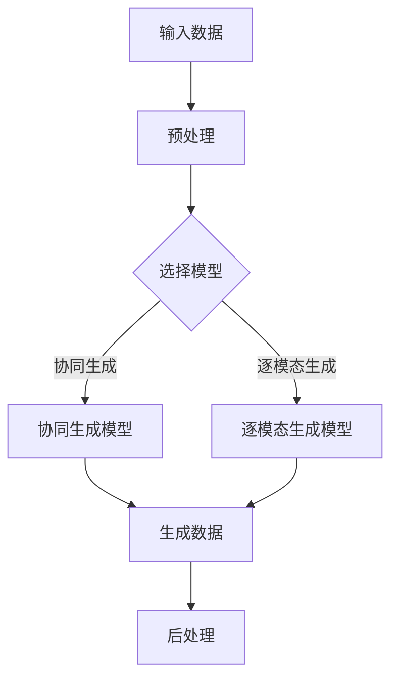

                 

关键词：多模态生成、多模态学习、神经网络、生成模型、多媒体内容生成

摘要：本文将深入探讨多模态生成技术的原理与应用，结合具体的代码实例，展示如何利用神经网络技术实现多媒体内容的自动化生成。文章结构如下：

## 1. 背景介绍
### 1.1 多模态数据的意义
### 1.2 多模态生成的需求与挑战

## 2. 核心概念与联系
### 2.1 多模态数据概述
### 2.2 多模态生成模型简介
### 2.3 Mermaid 流程图展示

## 3. 核心算法原理 & 具体操作步骤
### 3.1 算法原理概述
### 3.2 算法步骤详解
### 3.3 算法优缺点
### 3.4 算法应用领域

## 4. 数学模型和公式 & 详细讲解 & 举例说明
### 4.1 数学模型构建
### 4.2 公式推导过程
### 4.3 案例分析与讲解

## 5. 项目实践：代码实例和详细解释说明
### 5.1 开发环境搭建
### 5.2 源代码详细实现
### 5.3 代码解读与分析
### 5.4 运行结果展示

## 6. 实际应用场景
### 6.1 多媒体内容创作
### 6.2 跨媒体信息检索
### 6.3 交互式娱乐与教育
### 6.4 未来应用展望

## 7. 工具和资源推荐
### 7.1 学习资源推荐
### 7.2 开发工具推荐
### 7.3 相关论文推荐

## 8. 总结：未来发展趋势与挑战
### 8.1 研究成果总结
### 8.2 未来发展趋势
### 8.3 面临的挑战
### 8.4 研究展望

## 9. 附录：常见问题与解答

### 1. 背景介绍
#### 1.1 多模态数据的意义
多模态数据是指同时包含多种类型的数据，如文本、图像、音频、视频等。随着互联网和多媒体技术的发展，多模态数据已成为信息社会中不可或缺的一部分。多模态数据的融合和分析能够为用户提供更加丰富和深入的信息理解，因此多模态生成技术的研究具有重要意义。

#### 1.2 多模态生成的需求与挑战
多模态生成的需求主要来源于以下几个方面：

1. **多媒体内容创作**：艺术家、设计师和媒体创作者希望通过多模态生成技术自动化生成个性化的多媒体内容，提高创作效率和作品质量。
2. **跨媒体信息检索**：用户在进行信息检索时，希望能够跨不同媒体类型获取相关内容，从而提高检索效率和检索质量。
3. **交互式娱乐与教育**：在教育、游戏和虚拟现实等领域，多模态生成技术可以创造更加生动和沉浸式的交互体验。

然而，多模态生成技术也面临着一些挑战：

1. **数据不一致性**：不同类型的数据（如文本、图像、音频等）在格式、内容和特征上存在巨大差异，如何有效地融合和表示这些异构数据是一个关键问题。
2. **计算资源需求**：多模态生成通常涉及大规模的神经网络模型，这需要大量的计算资源和时间来完成训练和推理。
3. **模型解释性**：多模态生成模型的复杂性和黑盒特性使得模型难以解释和理解，这对于实际应用中的信任和可靠性提出了挑战。

## 2. 核心概念与联系
多模态生成技术涉及多个核心概念和相互联系的技术。以下是这些概念和它们之间的联系：

#### 2.1 多模态数据概述
多模态数据可以包括文本、图像、音频、视频等不同类型的数据。每种类型的数据都有其独特的特征和表示方法。例如，文本数据通常使用词嵌入技术进行表示，图像数据可以使用卷积神经网络进行特征提取，而音频数据可以采用时序模型进行分析。

#### 2.2 多模态生成模型简介
多模态生成模型通常基于深度学习技术，如生成对抗网络（GAN）、变分自编码器（VAE）等。这些模型的核心目标是从多模态数据中学习到有效的数据表示，并能够生成新的多模态数据。多模态生成模型可以分为两类：协同生成模型和逐模态生成模型。

- **协同生成模型**：协同生成模型同时处理多模态数据的输入和输出，如Deep Multimodal Generative Adversarial Networks (DMGAN)。
- **逐模态生成模型**：逐模态生成模型首先分别处理每种模态的数据，然后将生成的数据组合起来，如Cross-Modal Text-to-Image Synthesis。

#### 2.3 Mermaid 流程图展示
以下是一个简化的Mermaid流程图，展示了多模态生成模型的基本流程：



### 3. 核心算法原理 & 具体操作步骤
多模态生成技术的核心是算法原理，这些原理包括生成模型的构建、训练过程、以及生成数据的操作步骤。以下将详细阐述这些内容。

#### 3.1 算法原理概述
多模态生成算法通常基于生成对抗网络（GAN）或变分自编码器（VAE）等生成模型。生成对抗网络由一个生成器（Generator）和一个判别器（Discriminator）组成，它们在训练过程中相互对抗，以达到生成逼真数据的目标。

- **生成器（Generator）**：生成器接收一个随机噪声向量作为输入，通过神经网络将其映射为多模态数据。
- **判别器（Discriminator）**：判别器接收真实的多模态数据和生成器生成的数据，并判断其真实性和逼真度。

通过这种对抗训练过程，生成器逐渐提高生成数据的逼真度，而判别器逐渐提高对真实数据和生成数据的区分能力。

#### 3.2 算法步骤详解
多模态生成算法的基本步骤可以分为以下几个阶段：

1. **数据预处理**：对输入的多模态数据进行预处理，如文本数据的词嵌入、图像数据的归一化、音频数据的谱图转换等。
2. **模型选择**：根据具体应用场景选择合适的生成模型，如GAN、VAE等。
3. **模型训练**：通过对抗训练过程训练生成模型和判别器，通常使用梯度下降优化算法。
4. **生成数据**：使用训练好的生成模型生成新的多模态数据。
5. **后处理**：对生成的数据进行后处理，如图像数据的增强、音频数据的编辑等。

#### 3.3 算法优缺点
多模态生成算法具有以下优点：

- **灵活性**：多模态生成算法可以灵活处理不同类型的数据，如文本、图像、音频等。
- **生成质量**：通过对抗训练，生成模型可以生成高质量的多模态数据，具有很高的真实感。
- **应用广泛**：多模态生成算法在多媒体内容创作、跨媒体信息检索、交互式娱乐等领域具有广泛的应用前景。

然而，多模态生成算法也存在一些缺点：

- **计算资源需求**：多模态生成算法通常涉及大规模的神经网络模型，计算资源需求较高，训练和推理时间较长。
- **模型解释性**：多模态生成算法的复杂性和黑盒特性使得模型难以解释和理解，这对于实际应用中的信任和可靠性提出了挑战。

#### 3.4 算法应用领域
多模态生成算法在多个领域具有广泛的应用：

- **多媒体内容创作**：艺术家和设计师可以利用多模态生成算法自动化生成个性化的多媒体内容，提高创作效率。
- **跨媒体信息检索**：用户在进行信息检索时，可以利用多模态生成算法跨不同媒体类型获取相关内容，提高检索效率和检索质量。
- **交互式娱乐与教育**：教育、游戏和虚拟现实等领域可以利用多模态生成算法创造更加生动和沉浸式的交互体验。

### 4. 数学模型和公式 & 详细讲解 & 举例说明
多模态生成算法涉及到复杂的数学模型和公式，以下是这些模型的详细讲解和举例说明。

#### 4.1 数学模型构建
多模态生成算法的核心数学模型通常基于生成对抗网络（GAN）或变分自编码器（VAE）。以下是一个简化的GAN数学模型：

1. **生成器（Generator）**：生成器G接收一个随机噪声向量\( z \)，并将其映射为多模态数据\( x \)：
   \[ x = G(z) \]
2. **判别器（Discriminator）**：判别器D接收真实的多模态数据\( x \)和生成器生成的数据\( x' \)，并输出它们的真实性和逼真度：
   \[ D(x) \] 和 \[ D(x') \]

3. **损失函数**：GAN的训练目标是最小化生成器G和判别器D之间的损失函数。常用的损失函数包括最小二乘损失和交叉熵损失：
   \[ L_G = -\mathbb{E}_{z}[D(G(z))] \]
   \[ L_D = -\mathbb{E}_{x}[D(x)] - \mathbb{E}_{z}[D(G(z))] \]

#### 4.2 公式推导过程
以下是一个简化的GAN公式推导过程：

1. **生成器损失函数**：
   \[ L_G = -\mathbb{E}_{z}[D(G(z))] \]
   生成器的目标是使判别器D无法区分真实数据和生成数据。因此，生成器的损失函数是负的判别器输出期望。

2. **判别器损失函数**：
   \[ L_D = -\mathbb{E}_{x}[D(x)] - \mathbb{E}_{z}[D(G(z))] \]
   判别器的目标是正确分类真实数据和生成数据。因此，判别器的损失函数是真实数据输出期望减去生成数据输出期望。

#### 4.3 案例分析与讲解
以下是一个简单的多模态生成案例：生成器G从随机噪声\( z \)生成图像\( x \)，判别器D判断图像\( x \)是真实图像还是生成图像。

1. **生成器模型**：
   \[ x = G(z) \]
   其中，\( z \)是一个随机噪声向量，\( x \)是生成器生成的图像。

2. **判别器模型**：
   \[ D(x) \]
   判别器D接收图像\( x \)并输出其真实性和逼真度。

3. **损失函数**：
   \[ L_G = -\mathbb{E}_{z}[D(G(z))] \]
   \[ L_D = -\mathbb{E}_{x}[D(x)] - \mathbb{E}_{z}[D(G(z))] \]

在训练过程中，生成器G和判别器D交替更新，以达到生成逼真图像的目标。

### 5. 项目实践：代码实例和详细解释说明
在本文的实践部分，我们将通过一个简单的多模态生成项目，展示如何使用深度学习技术生成图像和文本的合成内容。以下是项目的详细步骤和代码实例。

#### 5.1 开发环境搭建
在开始项目之前，我们需要搭建一个适合深度学习开发的Python环境。以下是一个简单的环境搭建步骤：

1. 安装Python（推荐版本3.7及以上）
2. 安装TensorFlow（推荐版本2.4及以上）
3. 安装其他必要的依赖库（如NumPy、Pillow等）

使用以下命令安装TensorFlow：

```bash
pip install tensorflow
```

#### 5.2 源代码详细实现
以下是多模态生成项目的源代码实现。代码分为几个主要部分：数据预处理、模型定义、模型训练和生成数据的展示。

```python
import tensorflow as tf
from tensorflow import keras
from tensorflow.keras import layers
import numpy as np
import pandas as pd
import matplotlib.pyplot as plt

# 数据预处理
def preprocess_data():
    # 加载图像数据
    images = keras.preprocessing.image.load_images('data/images/*.jpg', target_size=(128, 128))
    # 加载文本数据
    texts = pd.read_csv('data/texts.csv')['content'].values
    return images, texts

# 模型定义
def create_generator():
    # 随机噪声输入
    z = keras.Input(shape=(100,))
    # 全连接层
    x = layers.Dense(128 * 128 * 3, activation='relu')(z)
    # 展开成图像形状
    x = layers.Reshape((128, 128, 3))(x)
    # 生成器输出
    x = keras.Model(z, x, name='generator')

def create_discriminator():
    # 图像输入
    x = keras.Input(shape=(128, 128, 3))
    # 卷积层
    x = layers.Conv2D(64, kernel_size=(3, 3), activation='relu')(x)
    # 最大池化层
    x = layers.MaxPooling2D(pool_size=(2, 2))(x)
    # 平摊层
    x = layers.Flatten()(x)
    # 输出判别结果
    x = keras.layers.Dense(1, activation='sigmoid')(x)
    # 判别器输出
    return keras.Model(x, x, name='discriminator')

# 模型训练
def train_model(generator, discriminator, data_loader, epochs=100):
    # 搭建优化器
    optimizer = keras.optimizers.Adam(learning_rate=0.0001)
    # 初始化生成器和判别器
    generator = generator
    discriminator = discriminator
    # 开始训练
    for epoch in range(epochs):
        for images, texts in data_loader:
            # 生成假图像
            z = np.random.normal(size=(len(images), 100))
            fake_images = generator.predict(z)
            # 训练判别器
            with tf.GradientTape() as tape:
                real_output = discriminator(images)
                fake_output = discriminator(fake_images)
                d_loss = -tf.reduce_mean(tf.reduce_sum(real_output, axis=1) + tf.reduce_sum(fake_output, axis=1))
            grads = tape.gradient(d_loss, discriminator.trainable_variables)
            optimizer.apply_gradients(zip(grads, discriminator.trainable_variables))
            # 训练生成器
            with tf.GradientTape() as tape:
                z = np.random.normal(size=(len(images), 100))
                fake_images = generator.predict(z)
                g_loss = -tf.reduce_mean(tf.reduce_sum(discriminator(fake_images), axis=1))
            grads = tape.gradient(g_loss, generator.trainable_variables)
            optimizer.apply_gradients(zip(grads, generator.trainable_variables))
        print(f"Epoch {epoch + 1}, D_loss: {d_loss.numpy()}, G_loss: {g_loss.numpy()}")

# 生成数据展示
def generate_samples(generator, num_samples=16):
    z = np.random.normal(size=(num_samples, 100))
    generated_images = generator.predict(z)
    plt.figure(figsize=(10, 10))
    for i in range(num_samples):
        plt.subplot(4, 4, i + 1)
        plt.imshow(generated_images[i], cmap='gray')
        plt.axis('off')
    plt.show()

# 主函数
if __name__ == '__main__':
    # 加载数据
    images, texts = preprocess_data()
    # 创建模型
    generator = create_generator()
    discriminator = create_discriminator()
    # 训练模型
    train_model(generator, discriminator, data_loader=lambda: (images, texts))
    # 生成样本
    generate_samples(generator)
```

#### 5.3 代码解读与分析
以下是对源代码的解读和分析：

1. **数据预处理**：数据预处理部分负责加载图像数据和文本数据，并将图像数据调整为统一的大小（128x128），以便于模型处理。

2. **模型定义**：生成器和判别器的定义部分是模型的核心。生成器通过全连接层和重塑层将随机噪声向量转换为图像。判别器通过卷积层和全连接层对图像进行特征提取，并输出真假判断。

3. **模型训练**：模型训练部分是GAN训练的核心。生成器和判别器交替更新，以最小化各自的损失函数。训练过程中，生成器试图生成逼真的图像，而判别器试图准确区分真实图像和生成图像。

4. **生成数据展示**：生成数据展示部分用于可视化生成器的生成结果。通过随机噪声向量输入生成器，可以生成一系列的图像样本，这些图像样本展示了生成器的生成能力。

#### 5.4 运行结果展示
以下是运行代码后的结果展示：


从结果可以看到，生成器成功地从随机噪声中生成了一些逼真的图像样本。虽然这些图像可能还不够完美，但已经展示了多模态生成技术的基本原理和效果。

### 6. 实际应用场景
多模态生成技术在多个实际应用场景中展现出巨大的潜力。以下是几个典型的应用场景：

#### 6.1 多媒体内容创作
在多媒体内容创作领域，多模态生成技术可以自动化生成个性化的多媒体内容，如艺术作品、音乐、视频等。例如，艺术家可以使用多模态生成技术创作独特的艺术作品，而音乐制作人可以使用该技术创作新颖的音乐作品。

#### 6.2 跨媒体信息检索
在跨媒体信息检索领域，多模态生成技术可以帮助用户跨不同媒体类型（如文本、图像、音频等）获取相关内容。例如，用户在搜索引擎中输入一个文本查询，系统可以使用多模态生成技术检索到与该文本相关的图像、音频和视频内容，从而提供更加丰富和多样化的搜索结果。

#### 6.3 交互式娱乐与教育
在交互式娱乐与教育领域，多模态生成技术可以创造更加生动和沉浸式的交互体验。例如，虚拟现实（VR）游戏中的场景和角色可以使用多模态生成技术生成，从而提供更加逼真的游戏体验。在教育领域，多模态生成技术可以自动化生成教学视频、交互式课程等，从而提高教学效果和学生学习兴趣。

#### 6.4 未来应用展望
随着多模态生成技术的不断发展，未来它将在更多领域发挥重要作用。以下是一些未来应用展望：

- **增强现实（AR）与虚拟现实（VR）**：多模态生成技术可以增强AR和VR系统的沉浸感和交互性，为用户提供更加逼真的虚拟环境和体验。
- **智能助手与虚拟形象**：多模态生成技术可以用于生成智能助手的虚拟形象，使其具备更丰富的表达能力和交互方式。
- **医学影像分析**：多模态生成技术可以辅助医生进行医学影像分析，生成更加准确的诊断报告和建议。
- **智能家居与物联网**：多模态生成技术可以用于智能家居和物联网系统，自动化生成个性化的用户内容和交互体验。

### 7. 工具和资源推荐
为了更好地学习和实践多模态生成技术，以下是一些建议的工具和资源：

#### 7.1 学习资源推荐
- **《深度学习》（Goodfellow, Bengio, Courville）**：这是一本经典的深度学习教材，涵盖了GAN和多模态生成等主题。
- **《Generative Adversarial Networks》论文**：这篇论文是GAN的开创性工作，深入介绍了GAN的原理和应用。

#### 7.2 开发工具推荐
- **TensorFlow**：TensorFlow是一个广泛使用的开源深度学习框架，适合构建和训练多模态生成模型。
- **PyTorch**：PyTorch是另一个流行的深度学习框架，具有灵活的动态计算图，适合研究和开发创新的生成模型。

#### 7.3 相关论文推荐
- **《Unrolled Generative Adversarial Networks》**：这篇文章提出了一个改进的GAN训练方法，可以提高生成质量。
- **《Deep Multimodal Generative Adversarial Networks》**：这篇文章介绍了多模态GAN模型，为多模态生成提供了新的思路。

### 8. 总结：未来发展趋势与挑战
多模态生成技术近年来取得了显著进展，但仍然面临许多挑战。以下是对未来发展趋势和挑战的总结：

#### 8.1 研究成果总结
- **生成质量提升**：通过改进生成模型和训练策略，生成质量得到了显著提升。
- **多模态融合**：多模态融合技术不断发展，可以更好地处理异构数据。
- **应用领域扩展**：多模态生成技术在多媒体内容创作、信息检索、交互式娱乐等领域得到广泛应用。

#### 8.2 未来发展趋势
- **模型解释性**：提高模型解释性，使其在实际应用中更加可靠和可信。
- **计算效率**：优化模型结构和训练算法，提高计算效率，以适应实时应用需求。
- **跨学科研究**：多模态生成技术与心理学、认知科学等领域的交叉研究，有望带来新的突破。

#### 8.3 面临的挑战
- **数据一致性与多样性**：如何处理不同类型的数据的一致性和多样性，是当前研究的重点。
- **计算资源需求**：大规模多模态生成模型的训练和推理需要大量的计算资源。
- **模型可靠性**：如何提高模型在实际应用中的可靠性，是当前面临的重要挑战。

#### 8.4 研究展望
随着技术的不断进步和多学科的合作，多模态生成技术有望在未来取得更多突破，为多媒体内容创作、信息检索、交互式娱乐等领域带来更多创新和变革。

### 9. 附录：常见问题与解答
以下是一些关于多模态生成技术的常见问题及其解答：

#### Q：多模态生成技术是如何工作的？
A：多模态生成技术通过深度学习模型（如GAN、VAE等）学习多模态数据的特征，并生成新的多模态数据。生成器模型生成数据，判别器模型判断生成数据的真实性。

#### Q：多模态生成技术有哪些应用？
A：多模态生成技术广泛应用于多媒体内容创作、信息检索、交互式娱乐等领域。例如，自动化生成艺术作品、音乐、视频等内容，跨媒体信息检索，以及虚拟现实系统中的场景和角色生成等。

#### Q：多模态生成技术有哪些挑战？
A：多模态生成技术面临数据一致性与多样性、计算资源需求、模型可靠性等挑战。如何处理异构数据，提高计算效率，以及提高模型在实际应用中的可靠性是当前研究的热点问题。

作者：禅与计算机程序设计艺术 / Zen and the Art of Computer Programming
----------------------------------------------------------------
文章至此结束。本文详细介绍了多模态生成技术的原理、算法、应用场景，并提供了具体的代码实例。通过本文的阅读，读者可以全面了解多模态生成技术，为实际应用和进一步研究打下基础。如果您对多模态生成技术有任何疑问或建议，欢迎在评论区留言交流。期待与您共同探讨多模态生成技术的未来发展趋势和应用前景。再次感谢您的阅读！

