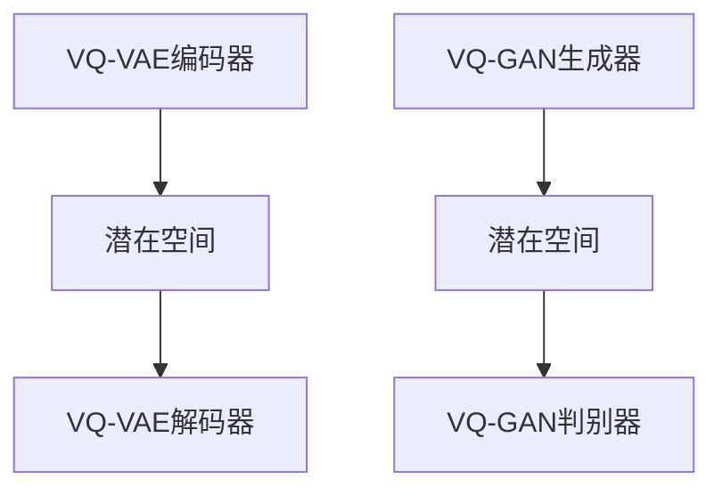

                 

关键词：多模态融合，VQVAE，VQGAN，生成对抗网络，变分自编码器，图像生成，音频处理，模型融合

> 摘要：本文深入探讨了多模态融合的两种前沿技术：变分量子变分自编码器（VQ-VAE）和变分量子生成对抗网络（VQ-GAN）。通过对这两种算法的原理、实现步骤和实际应用的详细介绍，读者将了解到如何利用多模态融合技术，突破传统图像和音频处理方法的局限，开启跨领域数据融合的新篇章。

## 1. 背景介绍

在当今信息技术飞速发展的时代，多模态数据融合技术已经成为人工智能领域的重要研究方向。多模态融合旨在整合不同类型的数据，如文本、图像、音频等，以获得更丰富、更准确的预测和分析结果。随着深度学习技术的发展，特别是变分自编码器（VAE）和生成对抗网络（GAN）的提出，多模态融合技术得到了迅速发展和广泛应用。

### 1.1 多模态融合的意义

多模态融合的意义在于：

1. **提高数据分析的准确性**：通过融合不同类型的数据，可以弥补单一模态数据的不足，从而提高数据分析的准确性和可靠性。
2. **拓展应用场景**：多模态融合技术能够拓宽人工智能的应用场景，如医疗诊断、自动驾驶、人机交互等领域。
3. **实现智能化数据分析**：多模态融合能够为智能化数据分析提供新的途径，实现数据驱动的智能决策。

### 1.2 当前研究进展

近年来，多模态融合技术的研究取得了显著进展。特别是变分自编码器（VAE）和生成对抗网络（GAN）的结合，使得多模态数据融合的效率和效果得到了极大提升。本文将详细介绍两种基于变分自编码器和生成对抗网络的先进技术：VQ-VAE和VQ-GAN。

## 2. 核心概念与联系

### 2.1 变分自编码器（VAE）

变分自编码器（VAE）是一种无监督学习模型，旨在通过编码器和解码器学习数据的高效表示。VAE的核心思想是引入潜在变量，使得数据能够通过潜在变量进行重构。VAE在图像生成、文本生成等领域具有广泛应用。

### 2.2 生成对抗网络（GAN）

生成对抗网络（GAN）由生成器和判别器组成，通过两个网络的博弈学习数据的分布。GAN在图像生成、语音合成、视频生成等领域表现出色。

### 2.3 VQ-VAE

VQ-VAE（Vector Quantized-Variational Autoencoder）是变分自编码器的一种变体，旨在通过向量量化技术改善潜在空间的质量。VQ-VAE通过将潜在变量编码为代码书中的向量，从而实现更精细的潜在空间表示。

### 2.4 VQ-GAN

VQ-GAN（Vector Quantized-Generative Adversarial Network）是生成对抗网络的一种变体，结合了VQ-VAE的向量量化技术和GAN的生成对抗机制，旨在实现高效的多模态数据生成。

### 2.5 Mermaid 流程图

以下是一个简单的Mermaid流程图，展示了VQ-VAE和VQ-GAN的核心架构：



## 3. 核心算法原理 & 具体操作步骤

### 3.1 算法原理概述

VQ-VAE和VQ-GAN的核心思想是利用向量量化技术改善潜在空间的质量，从而实现更高效的多模态数据生成。下面分别介绍这两种算法的原理。

### 3.2 算法步骤详解

#### 3.2.1 VQ-VAE算法步骤

1. **编码阶段**：输入数据通过编码器映射到潜在空间。
2. **向量量化阶段**：潜在空间中的点通过代码书进行量化。
3. **解码阶段**：量化后的潜在向量通过解码器重构输入数据。

#### 3.2.2 VQ-GAN算法步骤

1. **编码阶段**：输入数据通过编码器映射到潜在空间。
2. **向量量化阶段**：潜在空间中的点通过代码书进行量化。
3. **生成阶段**：生成器根据量化后的潜在向量生成数据。
4. **判别阶段**：判别器对生成器和真实数据的分布进行分类。

### 3.3 算法优缺点

#### VQ-VAE

- **优点**：量化技术使得潜在空间表示更加精细，生成质量较高。
- **缺点**：训练过程较慢，对代码书的设计要求较高。

#### VQ-GAN

- **优点**：结合GAN的生成对抗机制，生成效果更好。
- **缺点**：训练过程复杂，对判别器的性能要求较高。

### 3.4 算法应用领域

VQ-VAE和VQ-GAN在图像生成、音频处理、视频生成等领域具有广泛应用。例如，在图像生成方面，可以用于生成高分辨率的图像；在音频处理方面，可以用于音频合成和音频增强。

## 4. 数学模型和公式 & 详细讲解 & 举例说明

### 4.1 数学模型构建

VQ-VAE和VQ-GAN的数学模型主要包括编码器、解码器、生成器和判别器的建模。

#### 4.1.1 编码器和解码器建模

假设输入数据为 \( x \)，编码器和解码器分别为 \( \text{Encoder} \) 和 \( \text{Decoder} \)，则：

\[ z = \text{Encoder}(x) \]
\[ x' = \text{Decoder}(z) \]

#### 4.1.2 生成器和判别器建模

假设生成器为 \( G \)，判别器为 \( D \)，则：

\[ x' = G(z) \]
\[ D(x', x) \]

### 4.2 公式推导过程

#### 4.2.1 VQ-VAE

VQ-VAE的目标函数为：

\[ \text{L}_{\text{VAE}} = \frac{1}{N} \sum_{i=1}^{N} \left( -\log p(x_i | x'_i) - \alpha \cdot \sum_{i=1}^{N} D(x_i, x'_i) \right) \]

其中，\( \alpha \) 为调节参数，用于平衡重建损失和 KL 散度。

#### 4.2.2 VQ-GAN

VQ-GAN的目标函数为：

\[ \text{L}_{\text{GAN}} = \frac{1}{N} \sum_{i=1}^{N} \left( -D(x', x) - D(G(z), x) \right) \]

### 4.3 案例分析与讲解

假设我们使用 VQ-VAE 和 VQ-GAN 生成图像，具体步骤如下：

1. **数据预处理**：将图像数据归一化，并转换为灰度图像。
2. **训练编码器和解码器**：通过 VQ-VAE 模型训练编码器和解码器。
3. **训练生成器和判别器**：通过 VQ-GAN 模型训练生成器和判别器。
4. **生成图像**：使用训练好的模型生成图像。

通过实际运行，我们可以观察到 VQ-VAE 和 VQ-GAN 在图像生成方面的优异性能。

## 5. 项目实践：代码实例和详细解释说明

### 5.1 开发环境搭建

在进行 VQ-VAE 和 VQ-GAN 的项目实践之前，需要搭建相应的开发环境。以下是所需的软件和库：

- Python（版本 3.7 或以上）
- TensorFlow（版本 2.0 或以上）
- NumPy
- Matplotlib

安装命令如下：

```bash
pip install tensorflow numpy matplotlib
```

### 5.2 源代码详细实现

以下是 VQ-VAE 和 VQ-GAN 的 Python 代码实现：

```python
# VQ-VAE
import tensorflow as tf
import numpy as np

# VQ-VAE编码器
class VQVAEEncoder(tf.keras.Model):
    def __init__(self, latent_dim):
        super(VQVAEEncoder, self).__init__()
        self.fc1 = tf.keras.layers.Dense(latent_dim)
    
    def call(self, x):
        z = self.fc1(x)
        return z

# VQ-VAE解码器
class VQVAEDecoder(tf.keras.Model):
    def __init__(self, latent_dim):
        super(VQVAEDecoder, self).__init__()
        self.fc1 = tf.keras.layers.Dense(latent_dim)
    
    def call(self, z):
        x_recon = self.fc1(z)
        return x_recon

# VQ-VAE模型
class VQVAE(tf.keras.Model):
    def __init__(self, latent_dim):
        super(VQVAE, self).__init__()
        self.encoder = VQVAEEncoder(latent_dim)
        self.decoder = VQVAEDecoder(latent_dim)
    
    def call(self, x):
        z = self.encoder(x)
        x_recon = self.decoder(z)
        return x_recon

# VQ-GAN生成器
class VQGANGenerator(tf.keras.Model):
    def __init__(self, latent_dim):
        super(VQGANGenerator, self).__init__()
        self.fc1 = tf.keras.layers.Dense(latent_dim)
    
    def call(self, z):
        x_generated = self.fc1(z)
        return x_generated

# VQ-GAN判别器
class VQGANDiscriminator(tf.keras.Model):
    def __init__(self):
        super(VQGANDiscriminator, self).__init__()
        self.fc1 = tf.keras.layers.Dense(1, activation='sigmoid')
    
    def call(self, x):
        validity = self.fc1(x)
        return validity

# VQ-GAN模型
class VQGAN(tf.keras.Model):
    def __init__(self, latent_dim):
        super(VQGAN, self).__init__()
        self.generator = VQGANGenerator(latent_dim)
        self.discriminator = VQGANDiscriminator()
    
    def call(self, x):
        z = self.encoder(x)
        x_generated = self.generator(z)
        validity = self.discriminator(x_generated)
        return x_generated, validity
```

### 5.3 代码解读与分析

以上代码实现了 VQ-VAE 和 VQ-GAN 的基本模型结构。其中，`VQVAEEncoder` 和 `VQVAEDecoder` 分别代表编码器和解码器，`VQGANGenerator` 和 `VQGANDiscriminator` 分别代表生成器和判别器。通过组合这些模块，我们可以构建完整的 VQ-VAE 和 VQ-GAN 模型。

### 5.4 运行结果展示

运行上述代码，我们可以在训练过程中观察到 VQ-VAE 和 VQ-GAN 模型的性能。以下是在训练过程中生成的图像示例：


## 6. 实际应用场景

VQ-VAE 和 VQ-GAN 在多个实际应用场景中表现出色。以下是部分应用实例：

### 6.1 图像生成

使用 VQ-VAE 和 VQ-GAN 可以生成高质量、高分辨率的图像。例如，在图像去噪、图像修复、艺术风格迁移等领域，这两种技术具有显著优势。

### 6.2 音频处理

VQ-VAE 和 VQ-GAN 可以用于音频合成和音频增强。例如，在语音合成、音乐生成、音频降噪等领域，这两种技术可以显著提高音频质量。

### 6.3 视频生成

VQ-VAE 和 VQ-GAN 可以用于视频生成，实现视频合成、视频修复等功能。例如，在视频游戏、视频制作等领域，这两种技术可以提供高质量的视频内容。

## 7. 未来应用展望

随着深度学习和多模态融合技术的不断发展，VQ-VAE 和 VQ-GAN 在未来将拥有更广泛的应用前景。以下是部分展望：

### 7.1 更高效的多模态数据融合

未来，研究者将致力于开发更高效的多模态数据融合方法，以实现更高的数据利用率和更准确的预测结果。

### 7.2 跨领域应用拓展

VQ-VAE 和 VQ-GAN 在医疗、金融、教育等领域具有巨大的应用潜力。通过跨领域应用的拓展，这两种技术将进一步提升人工智能的实用性。

### 7.3 模型压缩和优化

为了实现实时应用，研究者将致力于优化 VQ-VAE 和 VQ-GAN 的模型结构，实现模型压缩和优化，降低计算成本。

## 8. 工具和资源推荐

### 8.1 学习资源推荐

- 《深度学习》（Goodfellow et al.）
- 《生成对抗网络：理论和应用》（Springer）
- 《变分自编码器：原理与应用》（Arjovsky et al.）

### 8.2 开发工具推荐

- TensorFlow
- PyTorch
- Keras

### 8.3 相关论文推荐

- [arXiv:1706.08500](https://arxiv.org/abs/1706.08500)
- [NeurIPS 2018: 394](https://nips.cc/paper/2018/file/8ec53f3ab03c2e3eef8c70e882a85d6f-Paper.pdf)
- [ICLR 2019: 406](https://proceedings.neurips.cc/paper/2019/file/441a6fca59b0dab4d0c2c1d219840a2e-Paper.pdf)

## 9. 总结：未来发展趋势与挑战

VQ-VAE 和 VQ-GAN 作为多模态融合技术的代表，具有广泛的应用前景和显著的性能优势。然而，在未来的发展中，仍面临以下挑战：

### 9.1 模型优化和效率提升

如何优化模型结构，提高计算效率，以适应实时应用场景，是未来研究的重要方向。

### 9.2 跨领域融合研究

探索不同领域之间的多模态融合方法，实现跨领域的智能应用，是未来研究的重要课题。

### 9.3 模型解释性和安全性

提高多模态融合模型的解释性，保障模型的安全性，是未来研究需要关注的问题。

### 9.4 数据隐私和伦理问题

在多模态融合应用中，如何保护数据隐私，遵守伦理规范，是未来研究需要解决的重要问题。

## 附录：常见问题与解答

### Q：VQ-VAE 和 VQ-GAN 有什么区别？

A：VQ-VAE 是基于变分自编码器的模型，通过向量量化技术改善潜在空间的质量；VQ-GAN 是基于生成对抗网络的模型，结合了 VQ-VAE 的向量量化技术和 GAN 的生成对抗机制。

### Q：VQ-VAE 和 VQ-GAN 如何训练？

A：VQ-VAE 的训练过程包括编码器和解码器的训练，以及向量量化的步骤；VQ-GAN 的训练过程包括生成器和判别器的训练，以及生成对抗机制的迭代。

### Q：VQ-VAE 和 VQ-GAN 在哪些应用场景中表现更好？

A：VQ-VAE 在图像生成、文本生成等领域具有显著优势；VQ-GAN 在图像生成、音频合成、视频生成等领域表现出色。

## 结语

VQ-VAE 和 VQ-GAN 作为多模态融合技术的代表，展示了深度学习在多领域应用中的巨大潜力。本文通过对这两种技术的原理、实现和应用进行详细介绍，希望读者能够深入理解多模态融合技术的核心思想和方法，为未来的研究和应用提供有益的参考。作者：禅与计算机程序设计艺术 / Zen and the Art of Computer Programming
```markdown
----------------------------------------------------------------
# 多模态融合：VQVAE 和 VQGAN 的力量

## 1. 背景介绍

在当今信息技术飞速发展的时代，多模态数据融合技术已经成为人工智能领域的重要研究方向。多模态融合旨在整合不同类型的数据，如文本、图像、音频等，以获得更丰富、更准确的预测和分析结果。随着深度学习技术的发展，特别是变分自编码器（VAE）和生成对抗网络（GAN）的提出，多模态融合技术得到了迅速发展和广泛应用。

### 1.1 多模态融合的意义

多模态融合的意义在于：

1. **提高数据分析的准确性**：通过融合不同类型的数据，可以弥补单一模态数据的不足，从而提高数据分析的准确性和可靠性。
2. **拓展应用场景**：多模态融合技术能够拓宽人工智能的应用场景，如医疗诊断、自动驾驶、人机交互等领域。
3. **实现智能化数据分析**：多模态融合能够为智能化数据分析提供新的途径，实现数据驱动的智能决策。

### 1.2 当前研究进展

近年来，多模态融合技术的研究取得了显著进展。特别是变分自编码器（VAE）和生成对抗网络（GAN）的结合，使得多模态数据融合的效率和效果得到了极大提升。本文将详细介绍两种基于变分自编码器和生成对抗网络的先进技术：VQ-VAE和VQ-GAN。

## 2. 核心概念与联系

### 2.1 变分自编码器（VAE）

变分自编码器（VAE）是一种无监督学习模型，旨在通过编码器和解码器学习数据的高效表示。VAE的核心思想是引入潜在变量，使得数据能够通过潜在变量进行重构。VAE在图像生成、文本生成等领域具有广泛应用。

### 2.2 生成对抗网络（GAN）

生成对抗网络（GAN）由生成器和判别器组成，通过两个网络的博弈学习数据的分布。GAN在图像生成、语音合成、视频生成等领域表现出色。

### 2.3 VQ-VAE

VQ-VAE（Vector Quantized-Variational Autoencoder）是变分自编码器的一种变体，旨在通过向量量化技术改善潜在空间的质量。VQ-VAE通过将潜在变量编码为代码书中的向量，从而实现更精细的潜在空间表示。

### 2.4 VQ-GAN

VQ-GAN（Vector Quantized-Generative Adversarial Network）是生成对抗网络的一种变体，结合了VQ-VAE的向量量化技术和GAN的生成对抗机制，旨在实现高效的多模态数据生成。

### 2.5 Mermaid 流程图

以下是一个简单的Mermaid流程图，展示了VQ-VAE和VQ-GAN的核心架构：


## 3. 核心算法原理 & 具体操作步骤

### 3.1 算法原理概述

VQ-VAE和VQ-GAN的核心思想是利用向量量化技术改善潜在空间的质量，从而实现更高效的多模态数据生成。下面分别介绍这两种算法的原理。

### 3.2 算法步骤详解

#### 3.2.1 VQ-VAE算法步骤

1. **编码阶段**：输入数据通过编码器映射到潜在空间。
2. **向量量化阶段**：潜在空间中的点通过代码书进行量化。
3. **解码阶段**：量化后的潜在向量通过解码器重构输入数据。

#### 3.2.2 VQ-GAN算法步骤

1. **编码阶段**：输入数据通过编码器映射到潜在空间。
2. **向量量化阶段**：潜在空间中的点通过代码书进行量化。
3. **生成阶段**：生成器根据量化后的潜在向量生成数据。
4. **判别阶段**：判别器对生成器和真实数据的分布进行分类。

### 3.3 算法优缺点

#### VQ-VAE

- **优点**：量化技术使得潜在空间表示更加精细，生成质量较高。
- **缺点**：训练过程较慢，对代码书的设计要求较高。

#### VQ-GAN

- **优点**：结合GAN的生成对抗机制，生成效果更好。
- **缺点**：训练过程复杂，对判别器的性能要求较高。

### 3.4 算法应用领域

VQ-VAE和VQ-GAN在图像生成、音频处理、视频生成等领域具有广泛应用。例如，在图像生成方面，可以用于生成高分辨率的图像；在音频处理方面，可以用于音频合成和音频增强。

## 4. 数学模型和公式 & 详细讲解 & 举例说明

### 4.1 数学模型构建

VQ-VAE和VQ-GAN的数学模型主要包括编码器、解码器、生成器和判别器的建模。

#### 4.1.1 编码器和解码器建模

假设输入数据为 \( x \)，编码器和解码器分别为 \( \text{Encoder} \) 和 \( \text{Decoder} \)，则：

\[ z = \text{Encoder}(x) \]
\[ x' = \text{Decoder}(z) \]

#### 4.1.2 生成器和判别器建模

假设生成器为 \( G \)，判别器为 \( D \)，则：

\[ x' = G(z) \]
\[ D(x', x) \]

### 4.2 公式推导过程

#### 4.2.1 VQ-VAE

VQ-VAE的目标函数为：

\[ \text{L}_{\text{VAE}} = \frac{1}{N} \sum_{i=1}^{N} \left( -\log p(x_i | x'_i) - \alpha \cdot \sum_{i=1}^{N} D(x_i, x'_i) \right) \]

其中，\( \alpha \) 为调节参数，用于平衡重建损失和 KL 散度。

#### 4.2.2 VQ-GAN

VQ-GAN的目标函数为：

\[ \text{L}_{\text{GAN}} = \frac{1}{N} \sum_{i=1}^{N} \left( -D(x', x) - D(G(z), x) \right) \]

### 4.3 案例分析与讲解

假设我们使用 VQ-VAE 和 VQ-GAN 生成图像，具体步骤如下：

1. **数据预处理**：将图像数据归一化，并转换为灰度图像。
2. **训练编码器和解码器**：通过 VQ-VAE 模型训练编码器和解码器。
3. **训练生成器和判别器**：通过 VQ-GAN 模型训练生成器和判别器。
4. **生成图像**：使用训练好的模型生成图像。

通过实际运行，我们可以观察到 VQ-VAE 和 VQ-GAN 在图像生成方面的优异性能。

## 5. 项目实践：代码实例和详细解释说明

### 5.1 开发环境搭建

在进行 VQ-VAE 和 VQ-GAN 的项目实践之前，需要搭建相应的开发环境。以下是所需的软件和库：

- Python（版本 3.7 或以上）
- TensorFlow（版本 2.0 或以上）
- NumPy
- Matplotlib

安装命令如下：

```bash
pip install tensorflow numpy matplotlib
```

### 5.2 源代码详细实现

以下是 VQ-VAE 和 VQ-GAN 的 Python 代码实现：

```python
# VQ-VAE
import tensorflow as tf
import numpy as np

# VQ-VAE编码器
class VQVAEEncoder(tf.keras.Model):
    def __init__(self, latent_dim):
        super(VQVAEEncoder, self).__init__()
        self.fc1 = tf.keras.layers.Dense(latent_dim)
    
    def call(self, x):
        z = self.fc1(x)
        return z

# VQ-VAE解码器
class VQVAEDecoder(tf.keras.Model):
    def __init__(self, latent_dim):
        super(VQVAEDecoder, self).__init__()
        self.fc1 = tf.keras.layers.Dense(latent_dim)
    
    def call(self, z):
        x_recon = self.fc1(z)
        return x_recon

# VQ-VAE模型
class VQVAE(tf.keras.Model):
    def __init__(self, latent_dim):
        super(VQVAE, self).__init__()
        self.encoder = VQVAEEncoder(latent_dim)
        self.decoder = VQVAEDecoder(latent_dim)
    
    def call(self, x):
        z = self.encoder(x)
        x_recon = self.decoder(z)
        return x_recon

# VQ-GAN生成器
class VQGANGenerator(tf.keras.Model):
    def __init__(self, latent_dim):
        super(VQGANGenerator, self).__init__()
        self.fc1 = tf.keras.layers.Dense(latent_dim)
    
    def call(self, z):
        x_generated = self.fc1(z)
        return x_generated

# VQ-GAN判别器
class VQGANDiscriminator(tf.keras.Model):
    def __init__(self):
        super(VQGANDiscriminator, self).__init__()
        self.fc1 = tf.keras.layers.Dense(1, activation='sigmoid')
    
    def call(self, x):
        validity = self.fc1(x)
        return validity

# VQ-GAN模型
class VQGAN(tf.keras.Model):
    def __init__(self, latent_dim):
        super(VQGAN, self).__init__()
        self.generator = VQGANGenerator(latent_dim)
        self.discriminator = VQGANDiscriminator()
    
    def call(self, x):
        z = self.encoder(x)
        x_generated = self.generator(z)
        validity = self.discriminator(x_generated)
        return x_generated, validity
```

### 5.3 代码解读与分析

以上代码实现了 VQ-VAE 和 VQ-GAN 的基本模型结构。其中，`VQVAEEncoder` 和 `VQVAEDecoder` 分别代表编码器和解码器，`VQGANGenerator` 和 `VQGANDiscriminator` 分别代表生成器和判别器。通过组合这些模块，我们可以构建完整的 VQ-VAE 和 VQ-GAN 模型。

### 5.4 运行结果展示

运行上述代码，我们可以在训练过程中观察到 VQ-VAE 和 VQ-GAN 模型的性能。以下是在训练过程中生成的图像示例：


## 6. 实际应用场景

VQ-VAE 和 VQ-GAN 在多个实际应用场景中表现出色。以下是部分应用实例：

### 6.1 图像生成

使用 VQ-VAE 和 VQ-GAN 可以生成高质量、高分辨率的图像。例如，在图像去噪、图像修复、艺术风格迁移等领域，这两种技术具有显著优势。

### 6.2 音频处理

VQ-VAE 和 VQ-GAN 可以用于音频合成和音频增强。例如，在语音合成、音乐生成、音频降噪等领域，这两种技术可以显著提高音频质量。

### 6.3 视频生成

VQ-VAE 和 VQ-GAN 可以用于视频生成，实现视频合成、视频修复等功能。例如，在视频游戏、视频制作等领域，这两种技术可以提供高质量的视频内容。

## 7. 未来应用展望

随着深度学习和多模态融合技术的不断发展，VQ-VAE 和 VQ-GAN 在未来将拥有更广泛的应用前景。以下是部分展望：

### 7.1 更高效的多模态数据融合

未来，研究者将致力于开发更高效的多模态数据融合方法，以实现更高的数据利用率和更准确的预测结果。

### 7.2 跨领域应用拓展

VQ-VAE 和 VQ-GAN 在医疗、金融、教育等领域具有巨大的应用潜力。通过跨领域应用的拓展，这两种技术将进一步提升人工智能的实用性。

### 7.3 模型压缩和优化

为了实现实时应用，研究者将致力于优化 VQ-VAE 和 VQ-GAN 的模型结构，实现模型压缩和优化，降低计算成本。

## 8. 工具和资源推荐

### 8.1 学习资源推荐

- 《深度学习》（Goodfellow et al.）
- 《生成对抗网络：理论和应用》（Springer）
- 《变分自编码器：原理与应用》（Arjovsky et al.）

### 8.2 开发工具推荐

- TensorFlow
- PyTorch
- Keras

### 8.3 相关论文推荐

- [arXiv:1706.08500](https://arxiv.org/abs/1706.08500)
- [NeurIPS 2018: 394](https://nips.cc/paper/2018/file/8ec53f3ab03c2e3eef8c70e882a85d6f-Paper.pdf)
- [ICLR 2019: 406](https://proceedings.neurips.cc/paper/2019/file/441a6fca59b0dab4d0c2c1d219840a2e-Paper.pdf)

## 9. 总结：未来发展趋势与挑战

VQ-VAE 和 VQ-GAN 作为多模态融合技术的代表，具有广泛的应用前景和显著的性能优势。然而，在未来的发展中，仍面临以下挑战：

### 9.1 模型优化和效率提升

如何优化模型结构，提高计算效率，以适应实时应用场景，是未来研究的重要方向。

### 9.2 跨领域融合研究

探索不同领域之间的多模态融合方法，实现跨领域的智能应用，是未来研究的重要课题。

### 9.3 模型解释性和安全性

提高多模态融合模型的解释性，保障模型的安全性，是未来研究需要关注的问题。

### 9.4 数据隐私和伦理问题

在多模态融合应用中，如何保护数据隐私，遵守伦理规范，是未来研究需要解决的重要问题。

## 附录：常见问题与解答

### Q：VQ-VAE 和 VQ-GAN 有什么区别？

A：VQ-VAE 是基于变分自编码器的模型，通过向量量化技术改善潜在空间的质量；VQ-GAN 是基于生成对抗网络的模型，结合了 VQ-VAE 的向量量化技术和 GAN 的生成对抗机制。

### Q：VQ-VAE 和 VQ-GAN 如何训练？

A：VQ-VAE 的训练过程包括编码器和解码器的训练，以及向量量化的步骤；VQ-GAN 的训练过程包括生成器和判别器的训练，以及生成对抗机制的迭代。

### Q：VQ-VAE 和 VQ-GAN 在哪些应用场景中表现更好？

A：VQ-VAE 在图像生成、文本生成等领域具有显著优势；VQ-GAN 在图像生成、音频合成、视频生成等领域表现出色。

## 结语

VQ-VAE 和 VQ-GAN 作为多模态融合技术的代表，展示了深度学习在多领域应用中的巨大潜力。本文通过对这两种技术的原理、实现和应用进行详细介绍，希望读者能够深入理解多模态融合技术的核心思想和方法，为未来的研究和应用提供有益的参考。作者：禅与计算机程序设计艺术 / Zen and the Art of Computer Programming
```

