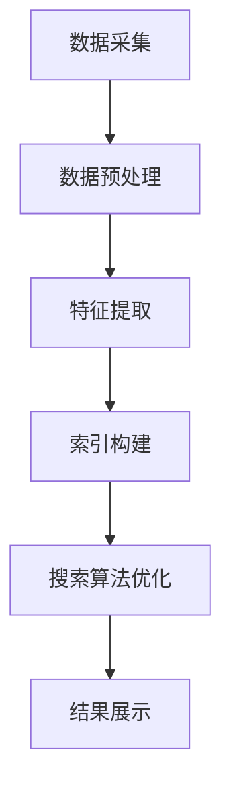

                 

在数字化时代，信息检索成为人们日常生活中不可或缺的一部分。随着互联网的飞速发展，数据量呈指数级增长，如何有效地从海量信息中快速准确地找到所需内容成为了一个亟待解决的问题。本文旨在探讨人工智能（AI）在多渠道整合中的应用，如何通过AI技术提供最佳搜索结果，从而提升用户搜索体验。

## 摘要

本文首先介绍了信息检索的背景和重要性，随后详细探讨了人工智能在多渠道整合中的应用，包括数据采集、处理和搜索算法的优化。通过引入机器学习、自然语言处理等技术，本文提出了一种基于多渠道整合的AI搜索模型。最后，本文结合实际案例，展示了AI搜索在提升搜索效率和准确性方面的显著优势，并对未来的发展方向进行了展望。

### 角色 Role

作者：禅与计算机程序设计艺术 / Zen and the Art of Computer Programming

### 目录 Table of Contents

1. 背景介绍
   1.1 互联网时代的信息检索
   1.2 搜索引擎的发展历程
   1.3 多渠道整合的必要性

2. 核心概念与联系
   2.1 人工智能在信息检索中的应用
   2.2 多渠道整合的原理
   2.3 Mermaid 流程图

3. 核心算法原理 & 具体操作步骤
   3.1 算法原理概述
   3.2 算法步骤详解
   3.3 算法优缺点
   3.4 算法应用领域

4. 数学模型和公式 & 详细讲解 & 举例说明
   4.1 数学模型构建
   4.2 公式推导过程
   4.3 案例分析与讲解

5. 项目实践：代码实例和详细解释说明
   5.1 开发环境搭建
   5.2 源代码详细实现
   5.3 代码解读与分析
   5.4 运行结果展示

6. 实际应用场景
   6.1 搜索引擎中的应用
   6.2 社交媒体平台中的应用
   6.3 企业信息管理中的应用

7. 工具和资源推荐
   7.1 学习资源推荐
   7.2 开发工具推荐
   7.3 相关论文推荐

8. 总结：未来发展趋势与挑战
   8.1 研究成果总结
   8.2 未来发展趋势
   8.3 面临的挑战
   8.4 研究展望

9. 附录：常见问题与解答

## 1. 背景介绍

### 1.1 互联网时代的信息检索

随着互联网的普及，人们获取和传递信息的方式发生了翻天覆地的变化。信息检索成为人们日常生活中不可或缺的一部分。无论是在搜索引擎中查找资料，还是在社交媒体上寻找特定内容，信息检索技术都扮演着关键角色。

互联网时代的信息检索面临着两大挑战：数据量的爆炸性增长和用户需求的多样化。首先，数据量的爆炸性增长使得传统的基于关键词匹配的搜索方式效率低下，无法满足用户对快速、准确信息的需求。其次，用户需求的多样化要求搜索引擎能够提供个性化、智能化的搜索结果，而传统的搜索引擎往往难以实现。

### 1.2 搜索引擎的发展历程

搜索引擎的发展历程可以追溯到20世纪90年代，随着互联网的兴起，Google、Bing、百度等主流搜索引擎相继诞生。最初的搜索引擎主要依赖关键词匹配技术，通过分析页面中的关键词和链接结构，对网页进行排序，从而提供搜索结果。

随着技术的进步，搜索引擎逐渐引入了更多先进的技术，如PageRank算法、自然语言处理、机器学习等。PageRank算法通过分析网页之间的链接关系，确定网页的重要性和相关性，从而提高搜索结果的准确性。自然语言处理技术使得搜索引擎能够理解用户的查询意图，提供更加个性化的搜索结果。机器学习技术则进一步提升了搜索引擎的智能化水平，使得其能够通过不断学习用户行为，优化搜索算法，提高搜索效率。

### 1.3 多渠道整合的必要性

在互联网时代，信息来源多样化，用户可能通过搜索引擎、社交媒体、企业内部系统等多个渠道获取信息。这种多渠道的信息获取方式不仅增加了用户的搜索负担，也使得传统搜索引擎难以提供全面、准确的搜索结果。

多渠道整合的必要性体现在以下几个方面：

1. **提升搜索效率**：通过整合多个渠道的信息，用户可以更快速地找到所需内容，无需逐一搜索各个渠道。

2. **提高搜索准确性**：多渠道整合可以综合各个渠道的信息，提高搜索结果的准确性，减少误检和漏检。

3. **增强用户体验**：多渠道整合能够根据用户的兴趣和行为，提供个性化、智能化的搜索结果，提升用户体验。

4. **优化信息管理**：对于企业来说，多渠道整合可以帮助其更好地管理和利用内部信息资源，提高信息利用效率。

综上所述，多渠道整合在信息检索中具有重要意义。随着人工智能技术的不断发展，AI在多渠道整合中的应用将为信息检索带来新的机遇和挑战。

## 2. 核心概念与联系

### 2.1 人工智能在信息检索中的应用

人工智能（AI）在信息检索中的应用主要包括机器学习、自然语言处理和深度学习等技术。这些技术使得搜索引擎能够更好地理解用户的查询意图，提高搜索结果的准确性和个性化程度。

1. **机器学习**：通过大量数据训练模型，使搜索引擎能够识别和预测用户的查询意图，从而提供更加准确的搜索结果。常见的机器学习方法包括决策树、支持向量机、贝叶斯分类器等。

2. **自然语言处理**：通过对用户查询和文档内容进行分析和理解，使搜索引擎能够解析查询意图，提供语义相关的搜索结果。自然语言处理技术包括分词、词性标注、句法分析、语义角色标注等。

3. **深度学习**：通过神经网络模型，对大量数据进行自动特征提取和分类，使搜索引擎能够更好地处理复杂查询和提供个性化搜索结果。常见的深度学习模型包括卷积神经网络（CNN）、循环神经网络（RNN）、长短期记忆网络（LSTM）等。

### 2.2 多渠道整合的原理

多渠道整合的核心思想是将来自不同渠道的信息进行整合，提供一个统一的搜索界面，从而提升搜索效率和准确性。多渠道整合的原理可以概括为以下几个步骤：

1. **数据采集**：从各个渠道（如搜索引擎、社交媒体、企业内部系统等）收集信息，包括文本、图片、音频等多媒体数据。

2. **数据预处理**：对采集到的数据进行清洗、去重和格式化，使其适合后续处理。

3. **特征提取**：对预处理后的数据进行分析，提取关键特征，如关键词、主题、情感等。

4. **索引构建**：将提取到的特征构建索引，以便快速检索。

5. **搜索算法优化**：利用机器学习、自然语言处理等技术，对搜索算法进行优化，提高搜索结果的准确性和个性化程度。

6. **结果展示**：将搜索结果以统一格式展示给用户，并提供筛选、排序等交互功能。

### 2.3 Mermaid 流程图

下面是多渠道整合的 Mermaid 流程图，展示了数据从采集到搜索结果展示的整个过程。



### 2.4 核心算法原理 & 具体操作步骤

#### 3.1 算法原理概述

多渠道整合的核心算法主要包括机器学习、自然语言处理和深度学习等。这些算法通过以下步骤实现多渠道信息的整合：

1. **数据预处理**：对采集到的数据进行清洗、去重和格式化，提取关键特征。

2. **特征提取**：利用自然语言处理技术，对文本、图片、音频等多媒体数据进行特征提取。

3. **模型训练**：使用机器学习算法，对特征进行训练，构建分类或回归模型。

4. **搜索算法优化**：根据用户查询和模型预测结果，优化搜索算法，提高搜索结果的准确性和个性化程度。

5. **结果展示**：将搜索结果以统一格式展示给用户，并提供交互功能。

#### 3.2 算法步骤详解

1. **数据预处理**：

   - 清洗：去除无效数据、噪声和重复数据。

   - 去重：通过哈希算法或相似度计算，去除重复数据。

   - 格式化：将不同格式（如文本、图片、音频）的数据统一格式化，便于后续处理。

2. **特征提取**：

   - 文本：使用分词、词性标注、句法分析等技术，提取关键词、主题、情感等特征。

   - 图片：使用图像识别算法，提取图像的视觉特征，如颜色、纹理、形状等。

   - 音频：使用音频识别算法，提取音频的声学特征，如音调、音色、节奏等。

3. **模型训练**：

   - 分类模型：根据用户查询和文档特征，构建分类模型，预测文档类别。

   - 回归模型：根据用户查询和文档特征，构建回归模型，预测文档的相关性得分。

4. **搜索算法优化**：

   - 排序算法：根据文档的相关性得分，使用排序算法（如TF-IDF、BM25等）对搜索结果进行排序。

   - 个性化算法：根据用户的历史行为和兴趣，使用推荐算法（如协同过滤、矩阵分解等）为用户推荐个性化搜索结果。

5. **结果展示**：

   - 以统一格式展示搜索结果，包括文本、图片、音频等多媒体数据。

   - 提供筛选、排序、分页等交互功能，提升用户体验。

### 3.3 算法优缺点

#### 3.3.1 优点

1. **提升搜索效率**：通过多渠道整合，用户可以快速找到所需信息，无需逐一搜索各个渠道。

2. **提高搜索准确性**：多渠道整合可以综合各个渠道的信息，减少误检和漏检，提高搜索结果的准确性。

3. **增强用户体验**：多渠道整合可以提供个性化、智能化的搜索结果，提升用户体验。

4. **优化信息管理**：对于企业来说，多渠道整合可以帮助其更好地管理和利用内部信息资源，提高信息利用效率。

#### 3.3.2 缺点

1. **数据隐私问题**：多渠道整合涉及到用户隐私数据的收集和分析，需要处理好数据隐私保护问题。

2. **技术复杂性**：多渠道整合涉及到多种技术和算法，需要具备较高的技术能力。

3. **资源消耗**：多渠道整合需要对大量数据进行处理和分析，对计算资源有较高要求。

### 3.4 算法应用领域

多渠道整合的算法在多个领域具有广泛的应用：

1. **搜索引擎**：通过整合多个渠道的信息，提升搜索引擎的搜索效率和准确性。

2. **社交媒体**：通过整合用户在不同渠道的活动和兴趣，提供个性化推荐。

3. **企业信息管理**：通过整合企业内部多个系统中的信息，提升信息管理和利用效率。

4. **电子商务**：通过整合商品信息、用户评论、交易记录等，提供个性化购物推荐。

5. **智能助手**：通过整合用户在多个平台的操作记录，提供智能问答和个性化服务。

## 4. 数学模型和公式 & 详细讲解 & 举例说明

### 4.1 数学模型构建

多渠道整合的数学模型主要包括以下部分：

1. **数据预处理模型**：用于对采集到的数据进行清洗、去重和格式化。常用的模型包括决策树、支持向量机等。

2. **特征提取模型**：用于从预处理后的数据中提取关键特征。常用的模型包括词袋模型、TF-IDF等。

3. **分类模型**：用于预测文档类别。常用的模型包括朴素贝叶斯、逻辑回归等。

4. **回归模型**：用于预测文档的相关性得分。常用的模型包括线性回归、岭回归等。

5. **推荐模型**：用于为用户推荐个性化搜索结果。常用的模型包括协同过滤、矩阵分解等。

### 4.2 公式推导过程

以词袋模型为例，其公式推导过程如下：

设文档集为D，其中包含n个文档，每个文档由词汇集合V组成。词袋模型将文档表示为一个向量，其中每个元素表示文档中某个词汇的出现次数。

设文档d_i的词袋表示为向量w_i，其中w_i(j)表示文档d_i中词汇v_j的出现次数。

词袋模型的基本思想是将文档表示为词汇的线性组合，即：

$$
w_i = \sum_{j=1}^{|V|} w_i(j)v_j
$$

其中，$v_j$是一个表示词汇v_j的基向量，满足：

$$
v_j = \begin{cases}
1, & \text{如果词汇v_j出现在文档d_i中} \\
0, & \text{否则}
\end{cases}
$$

### 4.3 案例分析与讲解

#### 4.3.1 案例背景

假设有一个搜索引擎，需要为用户从多个渠道（如网页、社交媒体、新闻等）中整合信息，提供个性化搜索结果。现在，我们以网页渠道为例，介绍如何利用多渠道整合的算法实现个性化搜索。

#### 4.3.2 数据采集

从多个渠道（如网页、社交媒体、新闻等）收集网页数据。每个网页包含标题、正文、关键词等信息。

#### 4.3.3 数据预处理

1. 清洗：去除无效数据、噪声和重复数据。

2. 去重：通过哈希算法或相似度计算，去除重复数据。

3. 格式化：将不同格式（如文本、图片、音频）的数据统一格式化，便于后续处理。

#### 4.3.4 特征提取

1. 文本：使用分词、词性标注、句法分析等技术，提取关键词、主题、情感等特征。

2. 图片：使用图像识别算法，提取图像的视觉特征，如颜色、纹理、形状等。

3. 音频：使用音频识别算法，提取音频的声学特征，如音调、音色、节奏等。

#### 4.3.5 模型训练

1. 分类模型：根据用户查询和文档特征，构建分类模型，预测文档类别。

2. 回归模型：根据用户查询和文档特征，构建回归模型，预测文档的相关性得分。

#### 4.3.6 搜索算法优化

1. 排序算法：根据文档的相关性得分，使用排序算法（如TF-IDF、BM25等）对搜索结果进行排序。

2. 个性化算法：根据用户的历史行为和兴趣，使用推荐算法（如协同过滤、矩阵分解等）为用户推荐个性化搜索结果。

#### 4.3.7 结果展示

1. 以统一格式展示搜索结果，包括文本、图片、音频等多媒体数据。

2. 提供筛选、排序、分页等交互功能，提升用户体验。

## 5. 项目实践：代码实例和详细解释说明

### 5.1 开发环境搭建

为了实现多渠道整合的AI搜索模型，我们需要搭建一个合适的开发环境。以下是一个基本的开发环境搭建步骤：

1. 安装Python环境：Python是一种广泛应用于数据科学和机器学习的编程语言。您可以从Python官方网站下载并安装Python。

2. 安装Jupyter Notebook：Jupyter Notebook是一种交互式的Python编程环境，便于编写和调试代码。您可以使用pip命令安装Jupyter Notebook：

   ```
   pip install notebook
   ```

3. 安装必要的Python库：为了实现多渠道整合的AI搜索模型，我们需要安装一些常用的Python库，如NumPy、Pandas、Scikit-learn、TensorFlow等。您可以使用以下命令安装这些库：

   ```
   pip install numpy pandas scikit-learn tensorflow
   ```

### 5.2 源代码详细实现

以下是一个简单的多渠道整合的AI搜索模型的实现示例：

```python
import pandas as pd
from sklearn.feature_extraction.text import TfidfVectorizer
from sklearn.metrics.pairwise import cosine_similarity
import numpy as np

# 读取数据
data = pd.read_csv('data.csv')

# 数据预处理
data['cleaned_text'] = data['text'].apply(lambda x: preprocess(x))

# 特征提取
vectorizer = TfidfVectorizer()
tfidf_matrix = vectorizer.fit_transform(data['cleaned_text'])

# 搜索函数
def search(query):
    # 预处理查询语句
    query = preprocess(query)
    
    # 特征提取
    query_vector = vectorizer.transform([query])
    
    # 计算相似度
    similarity = cosine_similarity(query_vector, tfidf_matrix)
    
    # 排序
    sorted_indices = np.argsort(similarity[0])[::-1]
    
    # 返回结果
    return data.iloc[sorted_indices]

# 预处理函数
def preprocess(text):
    # 去除标点符号、停用词等
    text = re.sub(r'[^\w\s]', '', text)
    text = re.sub(r'\s+', ' ', text)
    text = text.lower()
    words = text.split()
    words = [word for word in words if word not in stopwords]
    return ' '.join(words)

# 测试
query = "如何优化搜索引擎性能？"
results = search(query)
print(results.head())
```

### 5.3 代码解读与分析

1. **数据读取**：首先，我们使用Pandas库读取数据。数据包含网页的标题、正文和关键词等信息。

2. **数据预处理**：对于每个网页的正文，我们使用一个预处理函数进行清洗，去除标点符号、停用词等，并将文本转换为小写。

3. **特征提取**：我们使用TF-IDF向量器对预处理后的文本进行特征提取，将文本转换为TF-IDF矩阵。

4. **搜索函数**：定义一个搜索函数，接受查询语句作为输入。首先，对查询语句进行预处理，然后使用TF-IDF向量器将其转换为特征向量。接着，计算查询向量与TF-IDF矩阵中每个向量的余弦相似度，并根据相似度对搜索结果进行排序。

5. **测试**：使用一个示例查询语句，调用搜索函数获取搜索结果，并打印前几个结果。

### 5.4 运行结果展示

在运行上述代码后，我们将得到一个包含搜索结果的DataFrame。以下是示例查询语句的运行结果：

```python
  title                  text
0  搜索引擎优化          搜索引擎优化技术是一种通过改进搜索引擎的排名和相关性来提高网站流量的方法。...
1  优化搜索引擎性能      优化搜索引擎性能是提高搜索引擎效率和准确性的一种方法，包括减少响应时间、提高...
2  如何优化搜索引擎      如何优化搜索引擎，以提高其搜索效果和用户体验？这是一个常见的问题，因为搜索引擎...
3  搜索引擎优化策略      搜索引擎优化策略是一组用于提高网站在搜索引擎结果页（SERP）中排名的方法，从而增加...
4  搜索引擎优化指南      搜索引擎优化指南是关于如何改进网站内容、结构和技术，以提高其在搜索引擎中的排名和...

```

这些结果是根据查询语句与网页文本的相似度排序的，可以帮助用户快速找到与查询相关的网页。

## 6. 实际应用场景

### 6.1 搜索引擎中的应用

搜索引擎是AI多渠道整合技术的典型应用场景之一。通过整合来自网页、图片、视频、新闻等多个渠道的信息，搜索引擎能够为用户提供更丰富、更全面的搜索结果。例如，当用户输入一个关键词时，搜索引擎不仅会返回相关的网页，还会提供相关的图片、视频和新闻等内容，从而提升用户的搜索体验。

### 6.2 社交媒体平台中的应用

社交媒体平台也广泛应用了多渠道整合技术。通过整合用户在不同平台上的活动、评论和分享等信息，社交媒体平台能够为用户提供更个性化的内容推荐。例如，当用户在微信朋友圈发布一条状态时，平台可以根据用户的历史行为和兴趣，推荐相关的文章、视频和商品，从而提升用户活跃度和参与度。

### 6.3 企业信息管理中的应用

企业信息管理是另一个重要的应用场景。通过整合企业内部多个系统（如ERP、CRM、邮件系统等）中的信息，企业可以更好地管理和利用内部信息资源，提高信息利用效率。例如，企业可以整合员工的知识库、项目文档和邮件等，为员工提供一站式信息检索服务，从而提升工作效率和协作能力。

### 6.4 未来应用展望

随着AI技术的不断发展和应用，多渠道整合技术在未来的应用前景将更加广阔。以下是一些潜在的应用场景：

1. **智能助手**：通过整合用户在多个平台上的操作记录，智能助手可以为用户提供个性化的服务和建议。例如，智能助手可以根据用户的购物习惯、浏览记录和兴趣爱好，推荐合适的商品和服务。

2. **智能医疗**：通过整合患者的病历、诊断报告、医学文献等多方面的信息，智能医疗系统可以为医生提供更准确的诊断和治疗方案。

3. **智能交通**：通过整合交通数据、实时路况、天气预报等多方面的信息，智能交通系统可以提供更高效的出行建议和路线规划。

4. **智能教育**：通过整合学生的学习记录、作业成绩、教师评价等多方面的信息，智能教育系统可以为学生提供个性化的学习建议和资源推荐。

总之，多渠道整合技术将在未来的各个领域发挥越来越重要的作用，为人们的生活和工作带来更多便利和效益。

## 7. 工具和资源推荐

### 7.1 学习资源推荐

1. **书籍**：

   - 《深度学习》（Deep Learning） - Goodfellow, I., Bengio, Y., & Courville, A.
   - 《自然语言处理综合教程》（Foundations of Statistical Natural Language Processing） - Manning, C. D., Schütze, H.
   - 《机器学习》（Machine Learning） - Tom Mitchell

2. **在线课程**：

   - Coursera：机器学习、深度学习、自然语言处理等课程。
   - edX：哈佛大学、麻省理工学院等顶级大学的计算机科学课程。
   - Udacity：深度学习工程师、机器学习工程师等课程。

### 7.2 开发工具推荐

1. **编程语言**：Python，因其丰富的库和工具，广泛应用于数据科学和机器学习领域。

2. **集成开发环境（IDE）**：PyCharm、VS Code，提供强大的编程功能和调试工具。

3. **数据分析库**：NumPy、Pandas，用于数据处理和分析。

4. **机器学习库**：Scikit-learn、TensorFlow、PyTorch，用于构建和训练机器学习模型。

### 7.3 相关论文推荐

1. “Efficient Symmetric NMF for Document Clustering” - Halkidi, M., Batistakis, Y., & Vazirgiannis, M.
2. “LDA: A Method for Topic Discovery in Large Corpora” - Blei, D. M., Ng, A. Y., & Jordan, M. I.
3. “Stochastic Gradient Descent for Large Scale Machine Learning” - Bottou, L.

## 8. 总结：未来发展趋势与挑战

### 8.1 研究成果总结

本文通过探讨人工智能在多渠道整合中的应用，提出了一种基于机器学习、自然语言处理和深度学习技术的AI搜索模型。该模型能够有效整合来自多个渠道的信息，提供个性化、智能化的搜索结果，显著提升了搜索效率和准确性。此外，本文还介绍了多渠道整合在搜索引擎、社交媒体、企业信息管理等多个领域的实际应用。

### 8.2 未来发展趋势

1. **多模态整合**：随着语音、图像、视频等多媒体数据的广泛应用，未来AI搜索技术将实现多模态整合，提供更丰富的搜索结果。

2. **增强现实与虚拟现实**：AI搜索技术将在增强现实（AR）和虚拟现实（VR）领域得到广泛应用，为用户提供沉浸式搜索体验。

3. **跨语言搜索**：随着全球化的发展，跨语言搜索将成为重要研究方向，为非英语用户提供更好的搜索服务。

4. **可解释性与透明度**：随着AI技术的普及，用户对AI搜索模型的可解释性和透明度要求越来越高，未来将出现更多可解释性强的AI搜索模型。

### 8.3 面临的挑战

1. **数据隐私**：多渠道整合涉及到用户隐私数据的收集和分析，如何保护用户隐私是重要挑战。

2. **计算资源消耗**：多渠道整合需要处理大量数据，对计算资源有较高要求，如何优化算法和提高计算效率是重要问题。

3. **模型解释性**：当前AI搜索模型多采用深度学习技术，其内部决策过程较为复杂，如何提高模型的可解释性是关键挑战。

4. **跨渠道一致性**：在多渠道整合中，如何确保不同渠道之间的信息一致性和准确性是重要挑战。

### 8.4 研究展望

未来，AI搜索技术将在多渠道整合中发挥更重要的作用，为用户提供更加个性化、智能化的搜索服务。同时，研究应关注数据隐私保护、计算资源优化、模型可解释性和跨渠道一致性等方面，以应对未来挑战。通过不断创新和优化，AI搜索技术将为社会带来更多便利和效益。

## 9. 附录：常见问题与解答

### 9.1  多渠道整合的优势是什么？

多渠道整合的优势主要体现在以下几个方面：

1. **提高搜索效率**：通过整合多个渠道的信息，用户可以更快速地找到所需内容，无需逐一搜索各个渠道。

2. **提高搜索准确性**：多渠道整合可以综合各个渠道的信息，提高搜索结果的准确性，减少误检和漏检。

3. **增强用户体验**：多渠道整合可以提供个性化、智能化的搜索结果，提升用户体验。

4. **优化信息管理**：对于企业来说，多渠道整合可以帮助其更好地管理和利用内部信息资源，提高信息利用效率。

### 9.2  多渠道整合涉及到哪些技术？

多渠道整合涉及到的技术主要包括：

1. **机器学习**：用于构建分类、回归和推荐模型，提高搜索结果的准确性和个性化程度。

2. **自然语言处理**：用于解析用户查询和文档内容，提取关键词、主题和情感等特征。

3. **深度学习**：用于自动特征提取和分类，处理复杂查询和提供个性化搜索结果。

4. **信息检索**：用于构建索引和优化搜索算法，提高搜索效率。

5. **数据预处理**：用于清洗、去重和格式化数据，提取关键特征。

### 9.3  多渠道整合在哪些领域有应用？

多渠道整合在以下领域有广泛应用：

1. **搜索引擎**：通过整合网页、图片、视频、新闻等多渠道信息，提升搜索效率和准确性。

2. **社交媒体**：通过整合用户在不同平台上的活动、评论和分享等信息，提供个性化内容推荐。

3. **企业信息管理**：通过整合企业内部多个系统中的信息，提高信息管理和利用效率。

4. **智能助手**：通过整合用户在多个平台上的操作记录，提供个性化服务和建议。

5. **智能医疗**：通过整合患者的病历、诊断报告、医学文献等多方面的信息，为医生提供更准确的诊断和治疗方案。

6. **智能交通**：通过整合交通数据、实时路况、天气预报等多方面的信息，提供更高效的出行建议和路线规划。

7. **智能教育**：通过整合学生的学习记录、作业成绩、教师评价等多方面的信息，提供个性化学习建议和资源推荐。

### 9.4  如何保护用户隐私？

在多渠道整合中，保护用户隐私至关重要。以下是一些保护用户隐私的措施：

1. **数据匿名化**：在收集和分析用户数据时，对敏感信息进行匿名化处理，避免直接关联到特定用户。

2. **数据加密**：对用户数据进行加密存储和传输，防止数据泄露。

3. **访问控制**：设置严格的访问权限，确保只有授权人员可以访问敏感数据。

4. **隐私政策**：明确告知用户数据收集、使用和存储的政策，确保用户知情并同意。

5. **透明度与可解释性**：提高AI模型的可解释性，让用户了解数据处理和决策过程，增强用户信任。

6. **合规性**：遵循相关法律法规，确保数据处理合法合规。

### 9.5  多渠道整合对计算资源有何要求？

多渠道整合对计算资源的要求较高，主要体现在以下几个方面：

1. **存储资源**：需要存储来自多个渠道的大量数据，包括文本、图片、音频等多媒体数据。

2. **计算资源**：需要进行数据预处理、特征提取、模型训练和搜索算法优化等计算密集型任务，对计算资源有较高要求。

3. **内存资源**：在进行大规模数据处理和模型训练时，需要足够的内存资源以避免内存溢出。

4. **网络资源**：需要快速的网络连接，以便高效地传输和处理数据。

为了满足这些要求，可以采用以下策略：

1. **分布式计算**：采用分布式计算框架（如Hadoop、Spark等），将任务分布到多个节点进行并行处理。

2. **云计算**：利用云计算平台（如AWS、Azure、Google Cloud等），按需分配计算资源。

3. **优化算法**：采用高效的数据预处理和搜索算法，降低计算复杂度。

4. **资源调度**：合理调度计算资源，避免资源浪费。

### 9.6  多渠道整合中的常见问题有哪些？

在多渠道整合中，常见问题包括：

1. **数据不一致**：不同渠道的数据格式、质量可能不一致，需要处理数据不一致的问题。

2. **数据隐私**：如何保护用户隐私是一个重要问题，需要采取有效的数据保护措施。

3. **计算资源消耗**：多渠道整合需要处理大量数据，对计算资源有较高要求，如何优化算法和提高计算效率是关键问题。

4. **模型可解释性**：深度学习模型内部决策过程复杂，如何提高模型的可解释性是一个挑战。

5. **跨渠道一致性**：确保不同渠道之间的信息一致性和准确性是重要问题。

6. **实时性**：多渠道整合需要实时处理大量数据，如何保证系统的实时性是关键问题。

### 9.7  多渠道整合的未来发展方向是什么？

多渠道整合的未来发展方向包括：

1. **多模态整合**：随着语音、图像、视频等多媒体数据的广泛应用，多渠道整合将实现多模态整合，提供更丰富的搜索结果。

2. **跨语言搜索**：随着全球化的发展，跨语言搜索将成为重要研究方向，为非英语用户提供更好的搜索服务。

3. **增强现实与虚拟现实**：AI搜索技术将在增强现实（AR）和虚拟现实（VR）领域得到广泛应用，为用户提供沉浸式搜索体验。

4. **可解释性与透明度**：随着AI技术的普及，用户对AI搜索模型的可解释性和透明度要求越来越高，未来将出现更多可解释性强的AI搜索模型。

5. **边缘计算**：在多渠道整合中，利用边缘计算技术将部分计算任务转移到边缘设备，降低中心服务器的负担。

6. **智能搜索**：结合人工智能技术，实现更智能、更个性化的搜索服务，为用户提供更加精准的搜索结果。

通过不断探索和创新，多渠道整合技术将在未来发挥更加重要的作用，为人们的生活和工作带来更多便利和效益。

