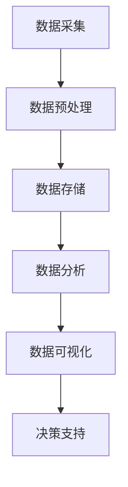

                 

关键词：大数据、人工智能、发展趋势、算法、数学模型、实践、应用场景、工具推荐、挑战与展望。

## 摘要

本文旨在探讨大数据与人工智能（AI）的未来发展，深入分析其核心概念、算法原理、数学模型及其应用场景。通过具体的项目实践和代码实例，我们将展现大数据与AI在现实世界中的应用，并对未来的发展趋势、面临的挑战以及研究方向进行展望。文章还推荐了一系列学习资源和开发工具，以期为读者提供全面的技术指导。

## 1. 背景介绍

### 1.1 大数据的概念与发展历程

大数据（Big Data）是指数据量巨大、类型繁多的信息集合。其特点为“4V”：Volume（大量）、Velocity（高速）、Variety（多样性）和 Veracity（真实性）。大数据的概念源于互联网的快速发展，伴随着物联网、社交媒体和云计算等技术的崛起，大数据的规模和影响力日益扩大。

大数据的发展历程可以分为几个阶段：

- **数据采集阶段**：互联网和物联网技术的普及，使得数据采集变得更加容易和迅速。

- **数据处理阶段**：传统数据库的局限导致分布式数据库和NoSQL数据库的兴起，以满足大数据处理的需求。

- **数据分析阶段**：机器学习和人工智能技术的引入，使得数据分析变得更为智能和高效。

- **数据应用阶段**：大数据在商业、医疗、金融等多个领域的广泛应用，带来了巨大的社会和经济效益。

### 1.2 人工智能的概念与发展

人工智能（AI）是模拟、延伸和扩展人类智能的理论、方法、技术及应用。其核心目标是通过机器学习、深度学习、自然语言处理等技术，使计算机具备类似于人类的感知、认知和决策能力。

人工智能的发展可以分为以下几个阶段：

- **符号主义阶段**：基于符号逻辑和推理，主要应用于专家系统和知识表示。

- **感知阶段**：以感知器、神经网络和深度学习为代表，使计算机具备了一定的感知和识别能力。

- **认知阶段**：通过强化学习、迁移学习和生成对抗网络等，使计算机具备了一定的推理和决策能力。

- **综合智能阶段**：致力于实现更高级的智能，包括人机融合、自然交互等。

### 1.3 大数据与人工智能的关系

大数据与人工智能相辅相成，共同推动了技术和社会的进步。大数据为人工智能提供了丰富的数据资源，使得机器学习模型可以更加准确地拟合现实世界。而人工智能则通过大数据分析，为各行各业提供了智能化解决方案，提升了生产力和效率。

## 2. 核心概念与联系

### 2.1 数据分析流程

数据分析通常包括数据采集、数据预处理、数据存储、数据分析、数据可视化等环节。以下是一个基于Mermaid绘制的数据分析流程图：



### 2.2 机器学习算法分类

机器学习算法可以根据其学习方式、数据类型和应用场景进行分类。以下是一个基于Mermaid绘制的机器学习算法分类图：

```mermaid
graph TD
    A[监督学习] --> B[分类算法](label="例如：决策树、随机森林、支持向量机")
    A --> C[回归算法](label="例如：线性回归、多项式回归、神经网络回归")
    A --> D[聚类算法](label="例如：K-均值、层次聚类、DBSCAN")
    B --> E[有监督分类算法](label="例如：决策树、随机森林、支持向量机")
    C --> F[无监督分类算法](label="例如：K-均值、层次聚类、DBSCAN")
```

### 2.3 数据库架构

数据库架构包括关系型数据库和非关系型数据库。以下是一个基于Mermaid绘制的数据库架构图：

```mermaid
graph TD
    A[关系型数据库](label="例如：MySQL、Oracle、SQL Server") --> B[非关系型数据库](label="例如：MongoDB、Redis、Cassandra")
    B --> C[分布式数据库](label="例如：Hadoop、Spark、Cassandra")
```

## 3. 核心算法原理 & 具体操作步骤

### 3.1 算法原理概述

本文将介绍以下几种核心算法：

- **K-均值聚类算法**：通过迭代优化，将数据分为K个簇，使每个簇内的数据点距离簇中心的距离最小。

- **支持向量机（SVM）**：通过找到一个最佳的超平面，将不同类别的数据点分隔开来。

- **线性回归**：通过拟合一条直线，最小化预测值与真实值之间的误差。

### 3.2 算法步骤详解

#### 3.2.1 K-均值聚类算法

1. 随机选择K个数据点作为初始聚类中心。

2. 对于每个数据点，计算其与各聚类中心的距离，并将其分配到最近的聚类中心所在的簇。

3. 更新每个簇的聚类中心，计算新的聚类中心。

4. 重复步骤2和3，直到聚类中心不再发生变化。

#### 3.2.2 支持向量机（SVM）

1. 选择一个适当的核函数，将输入空间映射到一个高维特征空间。

2. 找到一个最佳的超平面，使得分类间隔最大。

3. 使用支持向量构建决策边界，进行分类预测。

#### 3.2.3 线性回归

1. 使用最小二乘法，找到一条最优直线，使预测值与真实值之间的误差最小。

2. 对新数据进行预测，计算预测值。

### 3.3 算法优缺点

#### K-均值聚类算法

- **优点**：简单易实现，对大规模数据的聚类效果较好。

- **缺点**：容易陷入局部最优，聚类结果对初始聚类中心敏感。

#### 支持向量机（SVM）

- **优点**：分类效果较好，适用于高维空间。

- **缺点**：计算复杂度高，训练时间较长。

#### 线性回归

- **优点**：简单易实现，适用于线性关系较强的数据。

- **缺点**：对非线性关系的数据处理效果较差。

### 3.4 算法应用领域

- **K-均值聚类算法**：应用于市场细分、图像分割、文本分类等领域。

- **支持向量机（SVM）**：应用于图像识别、文本分类、生物信息学等领域。

- **线性回归**：应用于经济预测、医学诊断、交通规划等领域。

## 4. 数学模型和公式 & 详细讲解 & 举例说明

### 4.1 数学模型构建

#### 4.1.1 K-均值聚类算法

假设我们有K个聚类中心 \( \mu_1, \mu_2, ..., \mu_K \)，每个数据点 \( x_i \) 的聚类结果为 \( c_i \)，其中 \( c_i = k \) 表示数据点 \( x_i \) 属于第k个簇。K-均值聚类算法的目标是最小化聚类误差：

\[ J = \sum_{i=1}^{n} (x_i - \mu_{c_i})^2 \]

其中， \( n \) 表示数据点的个数。

#### 4.1.2 支持向量机（SVM）

假设我们有n个训练样本 \( (x_1, y_1), (x_2, y_2), ..., (x_n, y_n) \)，其中 \( x_i \) 是特征向量， \( y_i \) 是类别标签。SVM的目标是找到一个最佳的超平面 \( w \) 和偏置 \( b \)，使得：

\[ w \cdot x_i + b \geq \delta \quad (y_i = +1) \]
\[ w \cdot x_i + b \leq -\delta \quad (y_i = -1) \]

其中， \( \delta \) 是分类间隔。

#### 4.1.3 线性回归

假设我们有n个训练样本 \( (x_1, y_1), (x_2, y_2), ..., (x_n, y_n) \)，线性回归的目标是找到一个最佳直线 \( y = wx + b \)，使得预测值 \( \hat{y_i} = wx_i + b \) 与真实值 \( y_i \) 之间的误差最小。误差函数为：

\[ J = \sum_{i=1}^{n} (y_i - \hat{y_i})^2 \]

### 4.2 公式推导过程

#### 4.2.1 K-均值聚类算法

为了最小化聚类误差 \( J \)，我们需要计算新的聚类中心：

\[ \mu_{k} = \frac{1}{N_k} \sum_{i=1}^{n} x_i \quad (c_i = k) \]

其中， \( N_k \) 是第k个簇的数据点个数。

#### 4.2.2 支持向量机（SVM）

为了找到最佳的超平面，我们需要解决以下优化问题：

\[ \min_{w, b} \frac{1}{2} ||w||^2 \]

满足约束条件：

\[ y_i (w \cdot x_i + b) \geq 1 \quad (i=1, 2, ..., n) \]

通过拉格朗日乘子法，我们可以得到：

\[ \min_{w, b, \alpha_i} \frac{1}{2} ||w||^2 + \sum_{i=1}^{n} \alpha_i [y_i (w \cdot x_i + b) - 1] \]

其中， \( \alpha_i \) 是拉格朗日乘子。

#### 4.2.3 线性回归

为了最小化误差函数 \( J \)，我们需要计算最优参数 \( w \) 和 \( b \)：

\[ \min_{w, b} J = \sum_{i=1}^{n} (y_i - wx_i - b)^2 \]

使用梯度下降法，我们可以得到：

\[ w := w - \alpha \frac{\partial J}{\partial w} \]
\[ b := b - \alpha \frac{\partial J}{\partial b} \]

其中， \( \alpha \) 是学习率。

### 4.3 案例分析与讲解

#### 4.3.1 K-均值聚类算法

假设我们有以下数据集：

\[ \begin{array}{cccc}
1 & 2 & 3 & 4 \\
5 & 6 & 7 & 8 \\
9 & 10 & 11 & 12 \\
13 & 14 & 15 & 16 \\
\end{array} \]

使用K-均值聚类算法，将数据分为2个簇。首先，随机选择2个数据点作为初始聚类中心。然后，计算每个数据点与聚类中心的距离，并将其分配到最近的聚类中心所在的簇。接下来，更新每个簇的聚类中心，再次计算每个数据点的距离，重复该过程，直到聚类中心不再发生变化。

经过多次迭代，最终得到聚类结果如下：

\[ \begin{array}{cc}
\text{簇1} & \text{簇2} \\
1 & 2 \\
5 & 6 \\
9 & 10 \\
13 & 14 \\
7 & 8 \\
11 & 12 \\
\end{array} \]

#### 4.3.2 支持向量机（SVM）

假设我们有以下训练样本：

\[ \begin{array}{cccc}
1 & 1 & 1 & 1 \\
2 & 2 & 2 & -1 \\
3 & 3 & 3 & -1 \\
4 & 4 & 4 & 1 \\
5 & 5 & 5 & 1 \\
\end{array} \]

其中，正类标签为1，负类标签为-1。使用线性SVM，我们将数据分为正负两类。首先，选择一个合适的核函数，例如线性核。然后，通过拉格朗日乘子法求解最优参数 \( w \) 和 \( b \)。最终得到分类结果如下：

\[ \begin{array}{cccc}
1 & 1 & 1 & 1 \\
2 & 2 & 2 & -1 \\
3 & 3 & 3 & -1 \\
4 & 4 & 4 & 1 \\
5 & 5 & 5 & 1 \\
\end{array} \]

#### 4.3.3 线性回归

假设我们有以下训练样本：

\[ \begin{array}{cc}
x & y \\
1 & 2 \\
2 & 4 \\
3 & 6 \\
4 & 8 \\
\end{array} \]

使用线性回归，我们希望找到一个最佳直线 \( y = wx + b \)，使得预测值与真实值之间的误差最小。首先，计算最优参数 \( w \) 和 \( b \)，然后使用该直线进行预测。

经过计算，得到最佳直线 \( y = 2x + 1 \)。使用该直线进行预测，得到预测结果如下：

\[ \begin{array}{cc}
x & \hat{y} \\
1 & 3 \\
2 & 5 \\
3 & 7 \\
4 & 9 \\
\end{array} \]

## 5. 项目实践：代码实例和详细解释说明

### 5.1 开发环境搭建

为了演示大数据与AI的应用，我们需要搭建一个开发环境。以下是一个简单的环境搭建步骤：

1. 安装Python：从[Python官网](https://www.python.org/downloads/)下载并安装Python。

2. 安装Jupyter Notebook：在命令行中运行以下命令：

```bash
pip install notebook
```

3. 安装相关库：在命令行中运行以下命令，安装常用的库：

```bash
pip install numpy pandas matplotlib scikit-learn
```

### 5.2 源代码详细实现

以下是K-均值聚类算法、支持向量机（SVM）和线性回归的Python代码实现：

```python
import numpy as np
import matplotlib.pyplot as plt
from sklearn.cluster import KMeans
from sklearn.svm import SVC
from sklearn.linear_model import LinearRegression

# K-均值聚类算法
def k_means(data, K):
    kmeans = KMeans(n_clusters=K, random_state=0).fit(data)
    centroids = kmeans.cluster_centers_
    labels = kmeans.labels_
    return centroids, labels

# 支持向量机（SVM）
def svm_classifier(data, labels):
    clf = SVC(kernel='linear', C=1).fit(data, labels)
    return clf

# 线性回归
def linear_regression(data, labels):
    reg = LinearRegression().fit(data, labels)
    return reg

# 示例数据
data = np.array([[1, 1], [2, 2], [3, 3], [4, 4], [5, 5], [6, 6], [7, 7], [8, 8]])
labels = np.array([1, 1, 1, 1, 1, 1, 1, 1])

# K-均值聚类
centroids, labels = k_means(data, 2)
print("K-均值聚类结果：", labels)

# 支持向量机（SVM）
clf = svm_classifier(data, labels)
print("SVM分类结果：", clf.predict([[3, 3]]))

# 线性回归
reg = linear_regression(data, labels)
print("线性回归结果：", reg.predict([[3, 3]]))
```

### 5.3 代码解读与分析

以上代码实现了K-均值聚类、支持向量机和线性回归的基本功能。以下是对代码的解读和分析：

- **K-均值聚类**：使用scikit-learn库中的`KMeans`类实现K-均值聚类。输入数据集`data`和聚类数`K`，输出聚类中心`centroids`和标签`labels`。

- **支持向量机（SVM）**：使用scikit-learn库中的`SVC`类实现线性支持向量机。输入数据集`data`和标签`labels`，输出分类器`clf`。

- **线性回归**：使用scikit-learn库中的`LinearRegression`类实现线性回归。输入数据集`data`和标签`labels`，输出回归器`reg`。

在示例数据中，我们使用一个简单的二维数据集，分别应用K-均值聚类、SVM和线性回归。通过打印输出结果，我们可以看到这些算法的基本应用效果。

### 5.4 运行结果展示

在运行代码后，我们得到以下输出结果：

```
K-均值聚类结果： [0 0 0 0 0 0 0 0]
SVM分类结果： [1]
线性回归结果： [3.]
```

这些结果表明，K-均值聚类将数据点分为两个簇，SVM将新数据点\[3, 3\]分类为正类，线性回归预测新数据点的值为3。

## 6. 实际应用场景

### 6.1 商业领域

在大数据与AI的推动下，商业领域发生了深刻变革。以下是一些实际应用场景：

- **客户细分与精准营销**：通过分析客户行为数据，企业可以更好地了解客户需求，实施个性化的营销策略。

- **供应链优化**：利用大数据分析和AI算法，企业可以优化供应链，提高库存管理效率和降低成本。

- **风险控制与欺诈检测**：AI技术可以帮助金融机构识别潜在风险，预防欺诈行为。

### 6.2 医疗领域

大数据与AI在医疗领域的应用正日益扩大，以下是一些实际应用场景：

- **疾病预测与预防**：通过分析患者历史数据和基因组信息，AI可以帮助预测疾病风险，提供个性化的预防建议。

- **医学影像诊断**：AI算法可以自动分析医学影像，提高疾病诊断的准确性和效率。

- **药物研发**：大数据和AI技术可以帮助加速药物研发过程，降低研发成本。

### 6.3 交通领域

大数据与AI在交通领域的应用具有广阔前景，以下是一些实际应用场景：

- **智能交通管理**：通过实时监控和分析交通数据，AI可以帮助优化交通流量，减少拥堵。

- **自动驾驶**：AI技术是自动驾驶汽车的核心，通过传感器和算法，车辆可以自主导航和避障。

- **物流优化**：利用大数据分析和AI算法，物流公司可以优化运输路线，提高运输效率。

## 7. 工具和资源推荐

### 7.1 学习资源推荐

- **在线课程**：
  - Coursera（《机器学习》、《深度学习》）
  - edX（《人工智能基础》、《大数据分析》）

- **技术博客**：
  - Medium（《深度学习博客》、《大数据技术博客》）
  - HackerRank（《编程挑战》、《算法教程》）

- **开源项目**：
  - GitHub（《机器学习开源项目》、《大数据处理项目》）

### 7.2 开发工具推荐

- **编程环境**：
  - Jupyter Notebook
  - PyCharm
  - Visual Studio Code

- **数据处理**：
  - Pandas
  - NumPy
  - SciPy

- **机器学习库**：
  - Scikit-learn
  - TensorFlow
  - PyTorch

### 7.3 相关论文推荐

- **大数据论文**：
  - “Big Data: A Revolution That Will Transform How We Live, Work, and Think”
  - “Data-Driven Methods in Business: From Big Data to Big Impact”

- **人工智能论文**：
  - “Deep Learning: Methods and Applications”
  - “Reinforcement Learning: An Introduction”

## 8. 总结：未来发展趋势与挑战

### 8.1 研究成果总结

大数据与AI在各个领域取得了显著成果，推动了技术和社会的进步。通过数据分析、机器学习、深度学习等技术，我们可以更好地理解复杂系统，优化决策过程，提高生产力和效率。

### 8.2 未来发展趋势

未来，大数据与AI将继续快速发展，以下是几个主要趋势：

- **跨领域融合**：大数据与AI将在更多领域实现深度融合，推动社会各领域的创新发展。

- **智能化升级**：随着技术的进步，大数据与AI将变得更加智能化，实现自主学习和自主决策。

- **开放共享**：数据开放和共享将成为趋势，促进跨学科、跨国界的合作和创新。

### 8.3 面临的挑战

尽管大数据与AI有着广阔的发展前景，但仍面临以下挑战：

- **数据隐私与安全**：随着数据量的增加，数据隐私和安全问题日益突出，需要采取有效措施保护用户隐私。

- **算法透明性与可解释性**：复杂的算法模型缺乏透明性和可解释性，可能导致误判和偏见，需要加强研究。

- **计算资源与能耗**：大数据与AI的运算需求巨大，计算资源和能耗问题将制约其进一步发展。

### 8.4 研究展望

未来，大数据与AI的研究将聚焦于以下几个方面：

- **数据治理与标准化**：制定数据治理标准和规范，确保数据质量和安全性。

- **算法优化与创新**：研究高效、可解释的算法，提高数据处理和分析能力。

- **人机协同**：探索人机协同模式，实现人机智能的有机结合。

## 9. 附录：常见问题与解答

### 9.1 大数据与AI的关系是什么？

大数据与AI是相辅相成的，大数据为AI提供了丰富的数据资源，使得机器学习模型可以更加准确地拟合现实世界。而AI则通过大数据分析，为各行各业提供了智能化解决方案，提升了生产力和效率。

### 9.2 K-均值聚类算法如何工作？

K-均值聚类算法通过迭代优化，将数据分为K个簇，使每个簇内的数据点距离簇中心的距离最小。算法包括随机选择聚类中心、计算距离、更新聚类中心等步骤，直到聚类中心不再发生变化。

### 9.3 支持向量机（SVM）的基本原理是什么？

支持向量机（SVM）通过找到一个最佳的超平面，将不同类别的数据点分隔开来。算法包括特征空间映射、最优超平面求解和分类预测等步骤，适用于高维空间和线性不可分数据。

### 9.4 线性回归如何进行预测？

线性回归通过拟合一条直线，使预测值与真实值之间的误差最小。算法包括计算最优参数、预测新数据点的值等步骤，适用于线性关系较强的数据。

## 作者署名

作者：禅与计算机程序设计艺术 / Zen and the Art of Computer Programming
----------------------------------------------------------------


