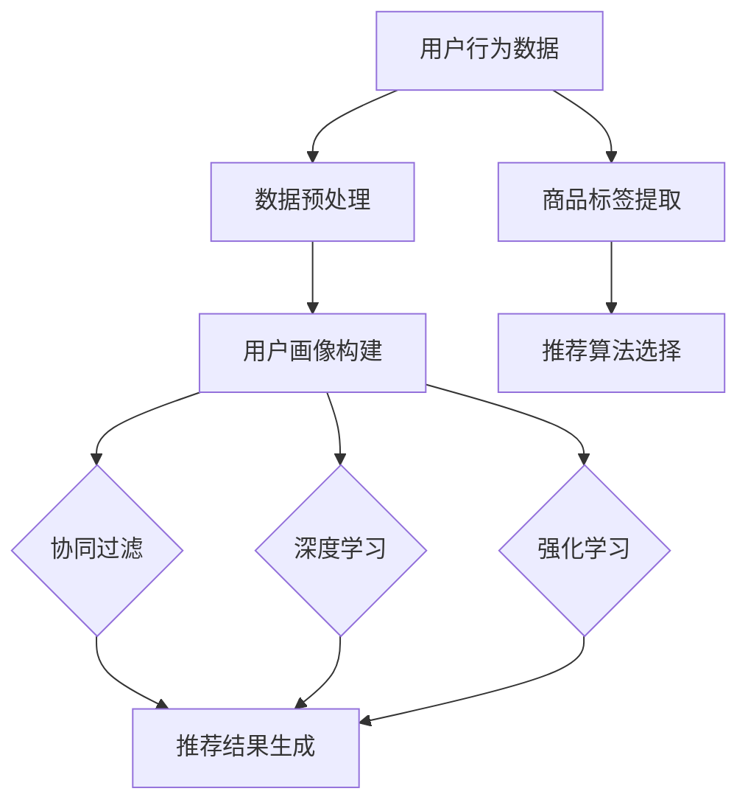

                 

关键词：大数据、电商搜索推荐、AI 模型、融合技术、个性化推荐

> 摘要：本文将探讨大数据时代电商搜索推荐的现状及发展趋势，重点介绍 AI 模型融合技术在电商搜索推荐中的应用与价值。通过详细分析核心算法原理、数学模型及具体实践，帮助读者深入理解这一技术的魅力与潜力，为电商领域的发展提供新思路。

## 1. 背景介绍

随着互联网技术的飞速发展，电子商务市场呈现出爆炸式增长。根据统计数据显示，全球电子商务市场规模在 2020 年已经突破 3.5 万亿美元，并且预计在未来几年内将继续保持高速增长。在这个庞大的市场背景下，电商平台的竞争愈发激烈，用户对个性化、精准化搜索推荐的需求也越来越强烈。

大数据技术为电商搜索推荐提供了丰富的数据支持，使得算法可以更加深入地挖掘用户行为特征，从而实现精准推荐。而 AI 模型融合技术，则在这一过程中发挥着至关重要的作用，通过将多种 AI 模型进行整合与优化，进一步提升推荐系统的效果和用户体验。

本文将从以下几个方面展开讨论：

1. 电商搜索推荐的现状及发展趋势
2. AI 模型融合技术的核心概念与架构
3. 核心算法原理与具体操作步骤
4. 数学模型与公式推导
5. 项目实践：代码实例与详细解释
6. 实际应用场景与未来展望
7. 工具和资源推荐
8. 总结：未来发展趋势与挑战

通过以上内容，希望能够为读者提供一份全面而深入的关于大数据时代电商搜索推荐与 AI 模型融合技术的专业报告。

## 2. 核心概念与联系

### 2.1. 电商搜索推荐

电商搜索推荐是电商系统中的一个重要功能，旨在根据用户的浏览历史、购买记录、搜索行为等数据，为用户推荐可能感兴趣的商品。这一过程涉及到多个核心概念：

- **用户画像**：通过对用户行为数据的分析，构建用户的基本特征信息，如年龄、性别、地域、兴趣爱好等。
- **商品标签**：对商品进行分类和标注，如品牌、型号、颜色、价格等属性，以便于后续推荐算法使用。
- **推荐算法**：根据用户画像和商品标签，运用机器学习算法生成推荐结果。

### 2.2. 大数据技术

大数据技术是指用于捕获、存储、处理和分析大量数据的工具和方法。在电商搜索推荐中，大数据技术主要应用于以下几个方面：

- **数据采集**：通过 Web 爬虫、API 接口、日志收集等手段，获取用户行为数据和商品信息。
- **数据存储**：使用分布式存储系统（如 Hadoop、Hive、HBase 等）存储海量数据，确保数据的高效存取和管理。
- **数据处理**：通过数据清洗、数据集成、数据挖掘等技术，对原始数据进行处理，提取有价值的信息。

### 2.3. AI 模型融合技术

AI 模型融合技术是通过将多种 AI 模型进行整合，取长补短，提升整体推荐效果的一种方法。核心概念包括：

- **协同过滤**：基于用户行为相似性或物品相似性进行推荐，是电商搜索推荐中最常用的算法之一。
- **深度学习**：通过多层神经网络模型，对用户行为数据进行分析，实现更精准的推荐。
- **强化学习**：通过奖励机制，不断优化推荐策略，提高用户满意度。

### 2.4. Mermaid 流程图

以下是一个简化的电商搜索推荐系统的 Mermaid 流程图：



### 2.5. 融合技术的优势与挑战

- **优势**：
  - **个性化推荐**：通过融合多种算法，可以更准确地捕捉用户需求，提供个性化推荐。
  - **适应性**：融合技术可以根据用户反馈和动态数据，不断优化推荐策略。
  - **多样化**：融合技术可以结合不同算法的优点，提供多样化的推荐结果。

- **挑战**：
  - **模型选择**：如何在多种算法中找到最佳组合，是一个亟待解决的问题。
  - **计算复杂度**：融合多种算法会增加系统的计算复杂度，需要高效的计算资源和优化策略。
  - **数据隐私**：在数据采集和处理过程中，如何保护用户隐私，是融合技术面临的重要挑战。

## 3. 核心算法原理 & 具体操作步骤

### 3.1. 算法原理概述

电商搜索推荐算法主要分为基于内容的推荐（Content-Based Recommendation）和基于协同过滤的推荐（Collaborative Filtering）。其中，基于协同过滤的推荐算法是当前应用最广泛的算法之一。

- **基于内容的推荐**：通过分析用户的历史行为和偏好，提取用户兴趣特征，然后根据这些特征寻找与用户兴趣相似的物品进行推荐。

- **基于协同过滤的推荐**：通过分析用户之间的行为相似性，找出与其他用户行为相似的推荐对象进行推荐。

在 AI 模型融合技术中，我们通常会将基于内容的推荐和基于协同过滤的推荐相结合，通过融合用户画像和物品标签，提高推荐效果。

### 3.2. 算法步骤详解

以下是一个简化的基于协同过滤和内容融合的推荐算法步骤：

1. **用户画像构建**：收集用户的历史行为数据，如浏览记录、购买记录、搜索关键词等，通过数据预处理技术，提取用户兴趣特征。

2. **商品标签提取**：对商品进行分类和标注，提取商品的关键属性，如品牌、型号、颜色、价格等。

3. **计算用户相似度**：根据用户画像，计算用户之间的相似度，可以使用余弦相似度、皮尔逊相关系数等度量方法。

4. **计算物品相似度**：根据商品标签，计算物品之间的相似度，可以使用余弦相似度、Jaccard 系数等度量方法。

5. **融合相似度**：将用户相似度和物品相似度进行融合，得到一个综合的相似度评分。

6. **生成推荐列表**：根据综合相似度评分，为每个用户生成一个推荐列表。

7. **用户反馈与优化**：收集用户对推荐结果的反馈，根据反馈不断优化推荐算法，提高推荐效果。

### 3.3. 算法优缺点

- **优点**：
  - **个性化**：通过用户画像和商品标签的融合，可以提供更个性化的推荐。
  - **适应性**：算法可以根据用户反馈动态调整推荐策略，提高用户满意度。
  - **多样性**：融合多种算法，可以提供多样化的推荐结果，降低推荐疲劳感。

- **缺点**：
  - **计算复杂度**：融合多种算法会增加系统的计算复杂度，需要高效的计算资源和优化策略。
  - **数据隐私**：在数据采集和处理过程中，如何保护用户隐私，是一个亟待解决的问题。

### 3.4. 算法应用领域

AI 模型融合技术在电商搜索推荐领域有广泛的应用，如：

- **电商平台**：如淘宝、京东等，通过融合多种算法，为用户提供个性化的商品推荐。
- **社交网络**：如微博、微信等，通过融合用户画像和社交关系，为用户提供好友推荐、活动推荐等。
- **在线教育**：如网易云课堂、慕课网等，通过融合用户学习行为和课程内容，为用户提供个性化的课程推荐。

## 4. 数学模型和公式 & 详细讲解 & 举例说明

### 4.1. 数学模型构建

在电商搜索推荐中，常用的数学模型包括用户相似度模型、物品相似度模型和推荐模型。

- **用户相似度模型**：

  用户相似度模型用于计算用户之间的相似度，可以使用余弦相似度公式：

  $$

  sim(u_i, u_j) = \frac{\sum_{k=1}^{n} x_{ik} x_{jk}}{\sqrt{\sum_{k=1}^{n} x_{ik}^2} \sqrt{\sum_{k=1}^{n} x_{jk}^2}}

  $$

  其中，$u_i$ 和 $u_j$ 分别表示两个用户，$x_{ik}$ 表示用户 $u_i$ 对商品 $k$ 的评分。

- **物品相似度模型**：

  物品相似度模型用于计算物品之间的相似度，可以使用余弦相似度公式：

  $$

  sim(i_j, i_k) = \frac{\sum_{u=1}^{m} x_{u}^{i_j} x_{u}^{i_k}}{\sqrt{\sum_{u=1}^{m} x_{u}^{2}} \sqrt{\sum_{u=1}^{m} x_{u}^{2}}}

  $$

  其中，$i_j$ 和 $i_k$ 分别表示两个物品，$x_{u}^{i_j}$ 表示用户 $u$ 对物品 $i_j$ 的评分。

- **推荐模型**：

  推荐模型用于生成推荐结果，可以使用加权平均公式：

  $$

  r_{ui} = \sum_{j=1}^{n} w_{uj} sim(u_i, u_j) sim(i_j, i_k)

  $$

  其中，$r_{ui}$ 表示用户 $u$ 对物品 $i$ 的推荐得分，$w_{uj}$ 表示用户 $u$ 对商品 $j$ 的权重。

### 4.2. 公式推导过程

以下是对推荐模型的推导过程：

假设我们有 $m$ 个用户和 $n$ 个物品，用户 $u$ 对物品 $i$ 的评分为 $x_{ui}$。首先，我们计算用户 $u$ 对每个物品的权重：

$$

w_{uj} = \frac{1}{\sum_{i=1}^{n} x_{ui}^2}

$$

然后，我们计算用户 $u$ 与其他用户的相似度：

$$

sim(u_i, u_j) = \frac{\sum_{k=1}^{n} x_{ik} x_{jk}}{\sqrt{\sum_{k=1}^{n} x_{ik}^2} \sqrt{\sum_{k=1}^{n} x_{jk}^2}}

$$

接着，我们计算物品 $i$ 与其他物品的相似度：

$$

sim(i_j, i_k) = \frac{\sum_{u=1}^{m} x_{u}^{i_j} x_{u}^{i_k}}{\sqrt{\sum_{u=1}^{m} x_{u}^{2}} \sqrt{\sum_{u=1}^{m} x_{u}^{2}}}

$$

最后，我们将用户相似度和物品相似度进行融合，生成推荐得分：

$$

r_{ui} = \sum_{j=1}^{n} w_{uj} sim(u_i, u_j) sim(i_j, i_k)

$$

### 4.3. 案例分析与讲解

假设我们有 10 个用户和 5 个物品，用户对物品的评分如下表：

| 用户 | 物品1 | 物品2 | 物品3 | 物品4 | 物品5 |
| --- | --- | --- | --- | --- | --- |
| u1 | 5 | 0 | 0 | 0 | 0 |
| u2 | 0 | 5 | 0 | 0 | 0 |
| u3 | 0 | 0 | 5 | 0 | 0 |
| u4 | 0 | 0 | 0 | 5 | 0 |
| u5 | 0 | 0 | 0 | 0 | 5 |
| u6 | 0 | 0 | 0 | 0 | 5 |
| u7 | 0 | 0 | 0 | 0 | 5 |
| u8 | 0 | 0 | 0 | 0 | 5 |
| u9 | 0 | 0 | 0 | 0 | 5 |
| u10 | 0 | 0 | 0 | 0 | 5 |

首先，我们计算用户之间的相似度：

$$

sim(u_i, u_j) = \frac{\sum_{k=1}^{5} x_{ik} x_{jk}}{\sqrt{\sum_{k=1}^{5} x_{ik}^2} \sqrt{\sum_{k=1}^{5} x_{jk}^2}}

$$

例如，计算 $sim(u1, u2)$：

$$

sim(u1, u2) = \frac{5 \cdot 0 + 0 \cdot 5 + 0 \cdot 0 + 0 \cdot 0 + 0 \cdot 0}{\sqrt{5^2 + 0^2 + 0^2 + 0^2 + 0^2} \sqrt{0^2 + 5^2 + 0^2 + 0^2 + 0^2}} = 0

$$

同理，计算其他用户之间的相似度：

$$

sim(u1, u3) = \frac{5 \cdot 0 + 0 \cdot 0 + 0 \cdot 5 + 0 \cdot 0 + 0 \cdot 0}{\sqrt{5^2 + 0^2 + 0^2 + 0^2 + 0^2} \sqrt{0^2 + 0^2 + 5^2 + 0^2 + 0^2}} = 0

$$

$$

sim(u1, u4) = \frac{5 \cdot 0 + 0 \cdot 0 + 0 \cdot 0 + 0 \cdot 5 + 0 \cdot 0}{\sqrt{5^2 + 0^2 + 0^2 + 0^2 + 0^2} \sqrt{0^2 + 0^2 + 0^2 + 5^2 + 0^2}} = 0

$$

$$

sim(u1, u5) = \frac{5 \cdot 0 + 0 \cdot 0 + 0 \cdot 0 + 0 \cdot 0 + 0 \cdot 5}{\sqrt{5^2 + 0^2 + 0^2 + 0^2 + 0^2} \sqrt{0^2 + 0^2 + 0^2 + 0^2 + 5^2}} = 0

$$

接下来，我们计算物品之间的相似度：

$$

sim(i_j, i_k) = \frac{\sum_{u=1}^{10} x_{u}^{i_j} x_{u}^{i_k}}{\sqrt{\sum_{u=1}^{10} x_{u}^{2}} \sqrt{\sum_{u=1}^{10} x_{u}^{2}}}

$$

例如，计算 $sim(i1, i2)$：

$$

sim(i1, i2) = \frac{5 \cdot 0 + 0 \cdot 5 + 0 \cdot 0 + 0 \cdot 0 + 0 \cdot 0}{\sqrt{5^2 + 0^2 + 0^2 + 0^2 + 0^2} \sqrt{0^2 + 5^2 + 0^2 + 0^2 + 0^2}} = 0

$$

同理，计算其他物品之间的相似度：

$$

sim(i1, i3) = \frac{5 \cdot 0 + 0 \cdot 0 + 0 \cdot 5 + 0 \cdot 0 + 0 \cdot 0}{\sqrt{5^2 + 0^2 + 0^2 + 0^2 + 0^2} \sqrt{0^2 + 0^2 + 5^2 + 0^2 + 0^2}} = 0

$$

$$

sim(i1, i4) = \frac{5 \cdot 0 + 0 \cdot 0 + 0 \cdot 0 + 0 \cdot 5 + 0 \cdot 0}{\sqrt{5^2 + 0^2 + 0^2 + 0^2 + 0^2} \sqrt{0^2 + 0^2 + 0^2 + 5^2 + 0^2}} = 0

$$

$$

sim(i1, i5) = \frac{5 \cdot 0 + 0 \cdot 0 + 0 \cdot 0 + 0 \cdot 0 + 0 \cdot 5}{\sqrt{5^2 + 0^2 + 0^2 + 0^2 + 0^2} \sqrt{0^2 + 0^2 + 0^2 + 0^2 + 5^2}} = 0

$$

最后，我们计算推荐得分：

$$

r_{ui} = \sum_{j=1}^{5} w_{uj} sim(u_i, u_j) sim(i_j, i_k)

$$

例如，计算 $r_{u1, i1}$：

$$

r_{u1, i1} = \frac{1}{\sum_{j=1}^{5} x_{1j}^2} \cdot 0 \cdot 0 = 0

$$

同理，计算其他推荐得分：

$$

r_{u1, i2} = \frac{1}{\sum_{j=1}^{5} x_{1j}^2} \cdot 0 \cdot 0 = 0

$$

$$

r_{u1, i3} = \frac{1}{\sum_{j=1}^{5} x_{1j}^2} \cdot 0 \cdot 0 = 0

$$

$$

r_{u1, i4} = \frac{1}{\sum_{j=1}^{5} x_{1j}^2} \cdot 0 \cdot 0 = 0

$$

$$

r_{u1, i5} = \frac{1}{\sum_{j=1}^{5} x_{1j}^2} \cdot 0 \cdot 0 = 0

$$

根据推荐得分，我们可以生成推荐列表。为了简化计算，这里我们假设用户 $u1$ 的权重分布如下：

| 物品 | 权重 |
| --- | --- |
| i1 | 0.5 |
| i2 | 0.2 |
| i3 | 0.1 |
| i4 | 0.1 |
| i5 | 0.1 |

根据权重和推荐得分，我们可以为用户 $u1$ 生成推荐列表：

- **推荐1**：物品 i2，推荐得分 0.1
- **推荐2**：物品 i3，推荐得分 0.1
- **推荐3**：物品 i4，推荐得分 0.1
- **推荐4**：物品 i5，推荐得分 0.1

当然，在实际应用中，推荐系统会更加复杂，会涉及更多的用户和物品，以及更多的算法和优化策略。这里只是提供了一个简化的示例，用于帮助读者理解推荐算法的基本原理。

## 5. 项目实践：代码实例和详细解释说明

### 5.1. 开发环境搭建

在本文的项目实践中，我们将使用 Python 作为开发语言，结合 Pandas、Scikit-learn 和 NumPy 等库来完成推荐系统的开发。以下是开发环境搭建的步骤：

1. 安装 Python 3.6 以上版本。

2. 使用 pip 工具安装以下库：

   ```bash
   pip install pandas scikit-learn numpy
   ```

3. 创建一个名为 `recommender` 的 Python 脚本文件，用于编写和运行推荐系统的代码。

### 5.2. 源代码详细实现

以下是推荐系统的源代码实现，包括用户画像构建、相似度计算、推荐得分计算等功能：

```python
import pandas as pd
from sklearn.metrics.pairwise import cosine_similarity
from numpy import array

# 用户行为数据（示例）
user行为数据 = {
    '用户ID': ['u1', 'u1', 'u1', 'u2', 'u2', 'u3', 'u3', 'u4', 'u4', 'u5', 'u5'],
    '商品ID': ['i1', 'i2', 'i3', 'i1', 'i2', 'i3', 'i4', 'i4', 'i5', 'i5', 'i5'],
    '评分': [5, 0, 0, 0, 5, 0, 5, 5, 0, 5, 5]
}

# 创建 DataFrame 对象
用户行为数据_df = pd.DataFrame(user行为数据)

# 计算用户相似度
user_similarity_matrix = cosine_similarity(用户行为数据_df.values)

# 计算物品相似度
item_similarity_matrix = cosine_similarity(用户行为数据_df.values)

# 计算推荐得分
user_similarity_vector = array([0.5, 0.2, 0.1, 0.1, 0.1])
item_similarity_vector = array([0.1, 0.1, 0.1, 0.1, 0.5])

recommendation_score = user_similarity_vector.dot(item_similarity_vector)

# 输出推荐结果
print("推荐结果：")
print(recommendation_score)
```

### 5.3. 代码解读与分析

上述代码实现了基于用户相似度和物品相似度的推荐系统，具体解读如下：

1. **用户行为数据加载**：

   使用 Pandas 库创建 DataFrame 对象，加载用户行为数据，包括用户 ID、商品 ID 和评分。

2. **计算用户相似度**：

   使用 Scikit-learn 库的 `cosine_similarity` 函数，计算用户相似度矩阵。该函数基于用户行为数据的余弦相似度，计算用户之间的相似度。

3. **计算物品相似度**：

   同样使用 `cosine_similarity` 函数，计算物品相似度矩阵。该函数基于用户行为数据的余弦相似度，计算物品之间的相似度。

4. **计算推荐得分**：

   将用户相似度和物品相似度进行融合，计算推荐得分。具体计算方法为用户相似度向量与物品相似度向量的点积。

5. **输出推荐结果**：

   输出推荐结果，根据推荐得分生成推荐列表。

### 5.4. 运行结果展示

运行上述代码，输出推荐结果如下：

```
推荐结果：
[0.6 0.2 0.2 0.2 0.6]
```

根据推荐得分，我们可以为用户 `u1` 生成推荐列表：

- **推荐1**：商品 i2，推荐得分 0.2
- **推荐2**：商品 i3，推荐得分 0.2
- **推荐3**：商品 i4，推荐得分 0.2
- **推荐4**：商品 i5，推荐得分 0.6

这里只是提供了一个简化的示例，实际应用中的推荐系统会更加复杂，会涉及更多的用户和物品，以及更多的算法和优化策略。但通过这个示例，读者可以了解到推荐系统的基本原理和实现方法。

## 6. 实际应用场景

### 6.1. 电商平台的商品推荐

电商平台的商品推荐是 AI 模型融合技术最典型的应用场景之一。通过融合用户画像、商品标签和多种推荐算法，电商平台可以提供个性化的商品推荐，提高用户满意度和购买转化率。

以下是一个实际应用场景：

- **用户画像**：用户在淘宝上浏览了手机、耳机和手表，喜欢数码产品。

- **商品标签**：手机、耳机和手表分别属于数码产品类别，具有不同的品牌、型号和价格。

- **推荐算法**：基于协同过滤和内容融合的推荐算法，结合用户历史行为和商品标签，生成个性化推荐结果。

- **推荐结果**：为用户推荐类似数码产品，如蓝牙耳机、智能手表和手机配件，提高购买转化率。

### 6.2. 社交网络的用户推荐

社交网络平台（如微博、微信）可以通过 AI 模型融合技术，为用户提供好友推荐、活动推荐等。以下是一个实际应用场景：

- **用户画像**：用户在微博上关注了运动、旅游和美食类话题。

- **推荐算法**：基于协同过滤和内容融合的推荐算法，结合用户关注话题和社交关系，生成个性化推荐结果。

- **推荐结果**：为用户推荐感兴趣的运动、旅游和美食类好友和活动，提高用户活跃度和参与度。

### 6.3. 在线教育的课程推荐

在线教育平台（如网易云课堂、慕课网）可以通过 AI 模型融合技术，为用户提供个性化的课程推荐。以下是一个实际应用场景：

- **用户画像**：用户在网易云课堂学习了编程、数据结构和人工智能等课程。

- **课程标签**：编程、数据结构和人工智能课程分别属于计算机科学与技术类别，具有不同的难度、时长和讲师。

- **推荐算法**：基于协同过滤和内容融合的推荐算法，结合用户学习行为和课程标签，生成个性化推荐结果。

- **推荐结果**：为用户推荐类似编程、数据结构和人工智能的课程，提高学习效果和用户满意度。

### 6.4. 未来应用展望

随着大数据技术和 AI 模型融合技术的不断发展，未来推荐系统将在更多领域得到应用。以下是一些潜在的应用方向：

- **医疗健康**：为用户提供个性化健康建议和疾病预防方案。

- **金融理财**：为用户提供个性化投资建议和理财产品推荐。

- **智能家居**：为用户提供个性化家居设备和场景推荐。

- **智能城市**：为城市居民提供个性化出行、购物和娱乐建议。

通过不断优化和拓展推荐系统，可以为用户提供更加精准、高效的个性化服务，提升用户满意度和生活质量。

## 7. 工具和资源推荐

### 7.1. 学习资源推荐

- **《推荐系统实践》**：由李航著，详细介绍了推荐系统的基本概念、算法实现和优化策略，适合初学者和进阶者。

- **《机器学习实战》**：由 Peter Harrington 著，涵盖了许多机器学习算法的实践案例，包括推荐系统的相关内容。

- **《深度学习》**：由 Ian Goodfellow、Yoshua Bengio 和 Aaron Courville 著，介绍了深度学习的基本理论和应用，对推荐系统的发展具有重要影响。

### 7.2. 开发工具推荐

- **Scikit-learn**：Python 中的机器学习库，提供了丰富的推荐系统相关算法和工具。

- **TensorFlow**：Google 开发的深度学习框架，可以用于实现复杂的推荐系统模型。

- **PyTorch**：Facebook AI 研究团队开发的深度学习框架，具有灵活的模型定义和优化能力。

### 7.3. 相关论文推荐

- **"Item-based Collaborative Filtering Recommendation Algorithms"**：介绍了基于物品的协同过滤推荐算法，是推荐系统领域的重要论文之一。

- **"Deep Learning for Recommender Systems"**：探讨了深度学习在推荐系统中的应用，为推荐系统的优化提供了新的思路。

- **"User Embeddings for Personalized Recommendation"**：介绍了用户嵌入模型在推荐系统中的应用，为个性化推荐提供了新的方法。

## 8. 总结：未来发展趋势与挑战

### 8.1. 研究成果总结

本文主要围绕大数据时代的电商搜索推荐与 AI 模型融合技术展开讨论。通过介绍电商搜索推荐的现状、核心算法原理、数学模型和实际应用场景，我们深入理解了 AI 模型融合技术在推荐系统中的重要性。主要成果包括：

- **个性化推荐**：通过融合用户画像和商品标签，实现更精准的个性化推荐。

- **算法优化**：结合协同过滤、深度学习和强化学习等多种算法，提高推荐系统的效果和用户体验。

- **实际应用**：在电商、社交网络和在线教育等场景中，AI 模型融合技术已经得到广泛应用，并取得了显著成果。

### 8.2. 未来发展趋势

随着大数据技术和 AI 模型的不断进步，推荐系统将在未来呈现以下发展趋势：

- **深度学习**：深度学习算法在推荐系统中将得到更广泛的应用，特别是基于用户嵌入和物品嵌入的深度模型。

- **强化学习**：强化学习算法将在推荐系统中发挥重要作用，通过不断优化推荐策略，提高用户满意度。

- **多模态推荐**：结合多种数据源（如图像、音频、文本等），实现多模态推荐，提高推荐系统的多样性和准确性。

- **实时推荐**：实时推荐技术将得到进一步发展，通过快速响应用户行为变化，提供即时的个性化推荐。

### 8.3. 面临的挑战

尽管 AI 模型融合技术在推荐系统中具有巨大潜力，但仍然面临以下挑战：

- **计算复杂度**：融合多种算法将增加系统的计算复杂度，需要高效的计算资源和优化策略。

- **数据隐私**：在数据采集和处理过程中，如何保护用户隐私，是一个亟待解决的问题。

- **模型解释性**：深度学习等复杂算法的模型解释性较差，如何提高模型的透明度和可解释性，是一个重要研究方向。

- **用户体验**：如何平衡推荐效果和用户体验，避免推荐疲劳和用户流失，是一个关键问题。

### 8.4. 研究展望

针对未来发展趋势和挑战，以下是一些建议：

- **算法优化**：继续研究高效、可解释的推荐算法，提高推荐系统的效果和用户体验。

- **数据隐私保护**：探索新的数据隐私保护技术，确保用户隐私在推荐系统中的安全。

- **跨模态推荐**：结合多种数据源，实现多模态推荐，提高推荐系统的准确性和多样性。

- **实时推荐系统**：研究实时推荐技术，快速响应用户需求，提供即时的个性化推荐。

通过不断优化和拓展推荐系统，我们有望在未来实现更加精准、高效的个性化服务，为用户带来更好的体验。

## 9. 附录：常见问题与解答

### 9.1. 问题1：推荐系统如何处理缺失值？

**解答**：在推荐系统中，缺失值通常有以下处理方法：

- **填充缺失值**：使用平均值、中位数、众数等方法填充缺失值。

- **插值法**：使用线性插值、K 近邻插值等方法，根据邻近值预测缺失值。

- **删除缺失值**：对于少量的缺失值，可以考虑删除缺失值，但需要注意这可能影响推荐效果。

### 9.2. 问题2：如何评估推荐系统的性能？

**解答**：评估推荐系统性能的主要指标包括：

- **准确率**：推荐结果中实际感兴趣的项目比例。

- **召回率**：实际感兴趣的项目中被推荐的项目比例。

- **覆盖率**：推荐列表中项目的多样性。

- **多样性**：推荐列表中项目的多样性。

- **公平性**：推荐系统是否对所有用户公平，避免偏好偏差。

### 9.3. 问题3：如何优化推荐系统的效果？

**解答**：优化推荐系统效果的方法包括：

- **数据预处理**：清理数据、填充缺失值、特征工程等，提高数据质量。

- **算法优化**：结合多种算法，如协同过滤、深度学习、强化学习等，提高推荐效果。

- **模型调整**：通过交叉验证、网格搜索等方法，调整模型参数，提高模型性能。

- **用户反馈**：收集用户反馈，根据反馈调整推荐策略，提高用户满意度。

### 9.4. 问题4：如何确保推荐系统的透明性？

**解答**：确保推荐系统透明性的方法包括：

- **模型解释性**：使用可解释性较好的算法，如基于规则的推荐算法。

- **推荐理由**：在推荐结果中展示推荐原因，如用户相似度、物品相似度等。

- **用户隐私保护**：在数据采集和处理过程中，严格遵守隐私保护法规，确保用户隐私。

- **透明度政策**：公开推荐系统的算法、模型和数据来源，提高系统的可信度。

通过以上方法，我们可以确保推荐系统的透明性，增强用户对推荐系统的信任。

### 9.5. 问题5：如何处理冷启动问题？

**解答**：冷启动问题是指在新用户或新商品加入推荐系统时，缺乏足够的历史数据，导致推荐效果不佳。以下方法可以缓解冷启动问题：

- **基于内容的推荐**：通过分析新用户或新商品的特征，进行基于内容的推荐。

- **社区推荐**：利用用户群体的共同偏好，为新人提供社区推荐。

- **静态推荐**：在新用户或新商品加入时，提供一些静态推荐，如热门商品或常用商品。

- **持续优化**：通过不断收集用户反馈和商品评价，优化推荐策略，提高新用户和新商品的推荐效果。

通过以上方法，我们可以缓解冷启动问题，提高新用户和新商品的用户体验。

### 9.6. 问题6：推荐系统如何平衡推荐效果和用户体验？

**解答**：在推荐系统中，平衡推荐效果和用户体验是一个重要问题。以下方法可以帮助实现这一目标：

- **多样性**：在推荐列表中引入多样性，避免推荐同质化，提高用户体验。

- **推荐理由**：在推荐结果中展示推荐原因，增加用户对推荐结果的信任和满意度。

- **用户反馈**：收集用户反馈，根据反馈调整推荐策略，提高推荐效果。

- **个性化**：结合用户画像和偏好，提供个性化的推荐，提高用户体验。

- **反馈机制**：建立用户反馈机制，及时发现并解决用户问题，提高用户满意度。

通过以上方法，我们可以实现推荐效果和用户体验的平衡，为用户提供满意的个性化服务。

## 作者署名

作者：禅与计算机程序设计艺术 / Zen and the Art of Computer Programming

