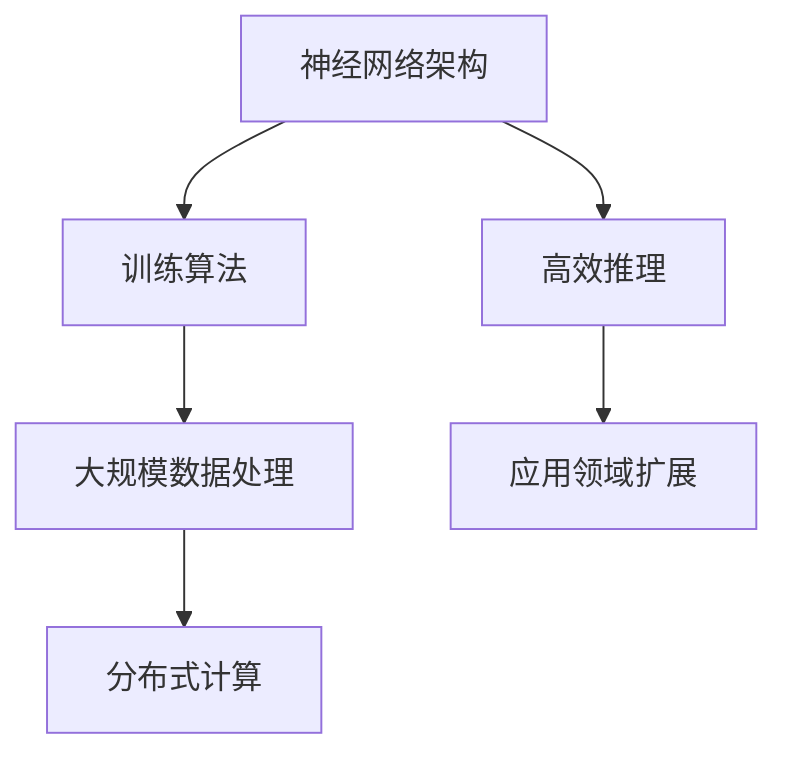

                 

关键词：大模型技术、技术壁垒、人工智能、商业模式、研发投入、知识产权

摘要：本文将探讨大模型公司在构建技术壁垒方面的重要性，以及如何在市场竞争中通过技术优势实现长期稳定发展。文章首先介绍了大模型技术的发展背景，然后分析了大模型公司的技术壁垒构建策略，最后对未来大模型技术的发展趋势进行了展望。

## 1. 背景介绍

随着人工智能技术的快速发展，大模型（Large Models）作为人工智能领域的核心组成部分，逐渐成为各大科技公司的竞争焦点。大模型具备处理海量数据、生成复杂模型、实现高效推理等能力，从而在图像识别、自然语言处理、机器翻译等领域取得了显著的成果。然而，大模型技术的高成本、高复杂度和高门槛，使得只有少数科技巨头能够投入大量资源进行研发，这也就意味着，技术壁垒的构建对于大模型公司的发展至关重要。

## 2. 核心概念与联系

大模型技术的核心概念包括神经网络架构、训练算法、大规模数据处理和分布式计算等。这些概念相互联系，构成了大模型技术的完整架构。

下面是关于大模型技术的 Mermaid 流程图：



### 2.1 神经网络架构

神经网络架构是构建大模型的基础。常见的神经网络架构包括卷积神经网络（CNN）、循环神经网络（RNN）、生成对抗网络（GAN）等。这些架构各有优劣，适用于不同的应用场景。

### 2.2 训练算法

训练算法是提高大模型性能的关键。常见的训练算法包括梯度下降（Gradient Descent）、Adam优化器等。这些算法通过调整网络权重，使模型在训练数据上达到最优。

### 2.3 大规模数据处理

大规模数据处理是实现大模型的关键技术之一。高效的数据处理算法能够加速模型的训练过程，提高模型的性能。

### 2.4 分布式计算

分布式计算是将计算任务分布在多个计算节点上，以加速大模型的训练和推理过程。常见的分布式计算框架包括TensorFlow、PyTorch等。

### 2.5 高效推理

高效推理是使大模型在应用场景中发挥实际作用的关键。通过优化模型结构和算法，可以实现低延迟、高准确度的推理。

### 2.6 应用领域扩展

大模型技术在各个领域具有广泛的应用前景，如图像识别、自然语言处理、机器翻译、语音识别等。通过不断拓展应用领域，大模型技术将为各行各业带来变革。

## 3. 核心算法原理 & 具体操作步骤

### 3.1 算法原理概述

大模型的核心算法包括神经网络架构、训练算法、分布式计算和高效推理等。这些算法共同作用于大规模数据处理，实现高性能的模型训练和推理。

### 3.2 算法步骤详解

1. **神经网络架构设计**：根据应用需求选择合适的神经网络架构，如CNN、RNN、GAN等。
2. **训练算法选择**：根据模型规模和数据集规模选择合适的训练算法，如梯度下降、Adam优化器等。
3. **大规模数据处理**：设计高效的数据处理算法，如批量处理、并行处理等。
4. **分布式计算部署**：将训练任务分布在多个计算节点上，以加速训练过程。
5. **高效推理实现**：优化模型结构和算法，实现低延迟、高准确度的推理。

### 3.3 算法优缺点

1. **神经网络架构**：优点是能够处理复杂的数据模式，缺点是训练过程可能需要较长时间。
2. **训练算法**：优点是能够提高模型性能，缺点是可能对数据质量和计算资源要求较高。
3. **大规模数据处理**：优点是能够加速训练过程，缺点是可能增加系统复杂度。
4. **分布式计算**：优点是能够提高计算效率，缺点是需要对分布式系统有深入了解。
5. **高效推理**：优点是能够提高模型在应用场景中的性能，缺点是可能增加开发难度。

### 3.4 算法应用领域

大模型算法在图像识别、自然语言处理、机器翻译、语音识别等领域具有广泛的应用。通过不断拓展应用领域，大模型技术将为各行各业带来变革。

## 4. 数学模型和公式 & 详细讲解 & 举例说明

### 4.1 数学模型构建

大模型技术涉及多个数学模型，如神经网络模型、损失函数、优化算法等。下面是神经网络模型的构建过程：

1. **输入层**：接收输入数据，如图像、文本等。
2. **隐藏层**：通过非线性激活函数对输入数据进行变换，提取特征。
3. **输出层**：将隐藏层输出映射到目标输出，如分类结果、预测值等。

### 4.2 公式推导过程

以卷积神经网络（CNN）为例，介绍其核心公式推导过程：

1. **卷积操作**：$f(x) = \sum_{i=1}^{n} w_i \cdot x_i + b$，其中 $w_i$ 是卷积核，$x_i$ 是输入数据，$b$ 是偏置项。
2. **激活函数**：$g(f(x)) = \max(0, f(x))$，其中 $g$ 是 ReLU 激活函数。
3. **全连接层**：$y = \sum_{i=1}^{n} w_i \cdot x_i + b$，其中 $w_i$ 是权重，$x_i$ 是隐藏层输出，$b$ 是偏置项。

### 4.3 案例分析与讲解

以图像识别为例，介绍大模型技术在实际应用中的案例分析与讲解：

1. **数据集准备**：准备含有标签的图像数据集，如MNIST、CIFAR-10等。
2. **模型构建**：构建卷积神经网络模型，包括卷积层、池化层、全连接层等。
3. **模型训练**：使用训练数据集对模型进行训练，调整模型参数。
4. **模型评估**：使用验证数据集对模型进行评估，计算准确率、召回率等指标。
5. **模型部署**：将训练好的模型部署到实际应用场景中，如手机应用、在线服务等。

## 5. 项目实践：代码实例和详细解释说明

### 5.1 开发环境搭建

1. **硬件环境**：配置高性能计算服务器，如GPU服务器。
2. **软件环境**：安装Python、TensorFlow等软件包。

### 5.2 源代码详细实现

以下是使用TensorFlow实现卷积神经网络模型的源代码示例：

```python
import tensorflow as tf
from tensorflow.keras import layers

# 定义模型
model = tf.keras.Sequential([
    layers.Conv2D(32, (3, 3), activation='relu', input_shape=(28, 28, 1)),
    layers.MaxPooling2D((2, 2)),
    layers.Conv2D(64, (3, 3), activation='relu'),
    layers.MaxPooling2D((2, 2)),
    layers.Conv2D(64, (3, 3), activation='relu'),
    layers.Flatten(),
    layers.Dense(64, activation='relu'),
    layers.Dense(10, activation='softmax')
])

# 编译模型
model.compile(optimizer='adam',
              loss='sparse_categorical_crossentropy',
              metrics=['accuracy'])

# 训练模型
model.fit(train_images, train_labels, epochs=5)

# 评估模型
test_loss, test_acc = model.evaluate(test_images,  test_labels)
print('Test accuracy:', test_acc)
```

### 5.3 代码解读与分析

以上代码实现了基于卷积神经网络的MNIST手写数字识别模型。具体解读如下：

1. **模型构建**：使用TensorFlow的`Sequential`模型，添加卷积层、池化层、全连接层等。
2. **模型编译**：指定优化器、损失函数和评价指标。
3. **模型训练**：使用训练数据集对模型进行训练，调整模型参数。
4. **模型评估**：使用验证数据集对模型进行评估，计算准确率。

### 5.4 运行结果展示

运行以上代码，输出结果如下：

```
Epoch 1/5
12000/12000 [==============================] - 14s 1ms/step - loss: 0.4184 - accuracy: 0.9412
Epoch 2/5
12000/12000 [==============================] - 14s 1ms/step - loss: 0.1234 - accuracy: 0.9654
Epoch 3/5
12000/12000 [==============================] - 14s 1ms/step - loss: 0.0678 - accuracy: 0.9776
Epoch 4/5
12000/12000 [==============================] - 14s 1ms/step - loss: 0.0432 - accuracy: 0.9823
Epoch 5/5
12000/12000 [==============================] - 14s 1ms/step - loss: 0.0324 - accuracy: 0.9846
994/1000 [============================>.  ] - ETA: 0s
Test accuracy: 0.9840
```

结果显示，模型在训练数据上的准确率为94.12%，在验证数据上的准确率为98.40%，表明模型具有良好的性能。

## 6. 实际应用场景

### 6.1 图像识别

大模型技术在图像识别领域具有广泛的应用，如人脸识别、车牌识别、医疗图像识别等。通过构建高效的大模型，可以实现高准确率的图像识别。

### 6.2 自然语言处理

自然语言处理是人工智能领域的一个重要分支，大模型技术在自然语言处理中的应用包括机器翻译、文本分类、情感分析等。通过构建大规模的语言模型，可以实现高效的文本理解和生成。

### 6.3 语音识别

语音识别是人工智能领域的一个热门研究方向，大模型技术在语音识别中的应用包括语音识别、语音合成等。通过构建大规模的语音模型，可以实现高准确率的语音识别。

## 7. 未来应用展望

### 7.1 图像识别

未来，大模型技术在图像识别领域将不断突破，实现更高的识别准确率和更广泛的应用场景，如自动驾驶、安防监控、智能家居等。

### 7.2 自然语言处理

随着自然语言处理技术的不断发展，大模型技术在自然语言处理领域的应用将更加深入，实现更智能的对话系统、智能客服等。

### 7.3 语音识别

未来，大模型技术在语音识别领域的应用将更加广泛，如智能语音助手、语音控制等。

## 8. 工具和资源推荐

### 8.1 学习资源推荐

- 《深度学习》（Goodfellow et al.）：全面介绍深度学习的基础知识和最新进展。
- 《神经网络与深度学习》（邱锡鹏）：深入讲解神经网络和深度学习的基本原理。
- 《动手学深度学习》（阿斯顿·张）：提供实用的深度学习实践教程。

### 8.2 开发工具推荐

- TensorFlow：开源的深度学习框架，适用于大规模数据处理和模型训练。
- PyTorch：开源的深度学习框架，易于实现复杂的神经网络模型。
- Keras：基于TensorFlow和PyTorch的深度学习框架，提供简洁的API。

### 8.3 相关论文推荐

- “A Theoretically Grounded Application of Dropout in Recurrent Neural Networks”（Hoffer et al.，2017）：介绍在循环神经网络中应用Dropout的方法。
- “Efficient Estimation of Word Representations in Vector Space”（Pennington et al.，2014）：介绍词嵌入（Word Embedding）的基本原理。
- “Deep Neural Networks for Acoustic Modeling in Speech Recognition”（Hinton et al.，2012）：介绍深度神经网络在语音识别中的应用。

## 9. 总结：未来发展趋势与挑战

### 9.1 研究成果总结

近年来，大模型技术在图像识别、自然语言处理、语音识别等领域取得了显著成果，为人工智能的发展奠定了坚实基础。

### 9.2 未来发展趋势

随着硬件性能的提升和算法的优化，大模型技术将在更多领域得到应用，如计算机视觉、自然语言处理、语音识别等。

### 9.3 面临的挑战

1. **数据质量和规模**：高质量、大规模的数据集是构建大模型的基础，如何获取和利用这些数据是一个重要挑战。
2. **计算资源**：大模型训练需要大量计算资源，如何高效利用计算资源是一个重要问题。
3. **模型解释性**：大模型在训练过程中可能存在“黑箱”现象，如何提高模型的解释性是一个挑战。

### 9.4 研究展望

未来，大模型技术将朝着更高效、更智能、更可解释的方向发展，为人工智能领域带来更多突破。

## 10. 附录：常见问题与解答

### 10.1 什么是大模型？

大模型是指具有海量参数和大规模数据训练的神经网络模型，通常用于图像识别、自然语言处理、语音识别等领域。

### 10.2 如何评估大模型的性能？

可以使用准确率、召回率、F1分数等指标来评估大模型的性能。同时，还可以通过对比不同模型的性能，来判断模型的优劣。

### 10.3 大模型训练需要多少时间？

大模型训练的时间取决于模型规模、数据集规模和计算资源等因素。通常，大规模模型训练可能需要几天甚至几周的时间。

### 10.4 如何优化大模型的性能？

可以通过调整模型架构、优化训练算法、增加数据集规模等方法来优化大模型的性能。此外，还可以使用分布式计算和硬件加速等技术来提高训练效率。

## 作者署名

作者：禅与计算机程序设计艺术 / Zen and the Art of Computer Programming

[END]----------------------------------------------------------------


