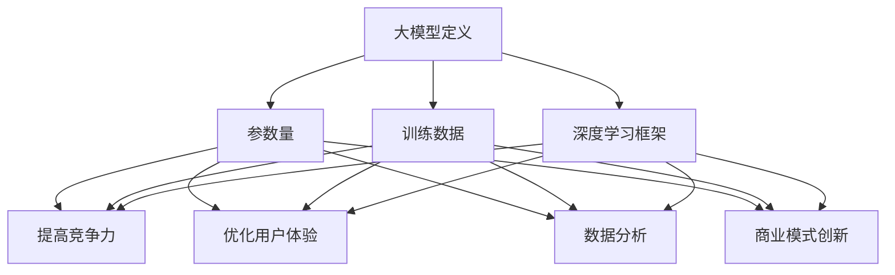

                 

关键词：大模型，创业产品，人工智能，应用场景，创新技术

> 摘要：本文旨在探讨大模型在创业产品中的应用，分析其在提高产品竞争力、用户体验、数据分析和商业模式创新等方面的潜力。通过对大模型的核心概念、算法原理、数学模型、项目实践以及未来应用场景的深入分析，本文旨在为创业者提供有价值的参考和指导。

## 1. 背景介绍

### 1.1 大模型的定义与发展

大模型，即大型人工智能模型，是指具有数十亿到数万亿参数的深度学习模型。这些模型通过海量数据训练，能够实现高度复杂的任务，如文本生成、图像识别、语音识别、自然语言处理等。大模型的发展始于深度学习技术的兴起，尤其是2012年AlexNet在ImageNet图像识别竞赛中取得的突破性成绩，标志着深度学习时代的到来。

近年来，随着计算能力的提升和大数据的普及，大模型取得了显著的进展。GPT-3、BERT、LLaMA等模型的出现，使得大模型在语言理解和生成、图像生成和编辑等领域取得了卓越的性能。大模型已成为人工智能领域的研究热点和商业化应用的重要方向。

### 1.2 创业产品的意义

创业产品是创业者为实现商业目标而开发的应用或服务。创业产品不仅承载着创业者的创新理念，更是市场竞争中的核心竞争力。创业产品的成功不仅取决于技术创新，还取决于用户体验、市场定位、商业模式等多个方面。

在大模型技术日益普及的今天，创业者如何将大模型应用于创业产品，已成为一个亟待解决的问题。本文将探讨大模型在创业产品中的应用潜力，以期为创业者提供有益的启示。

## 2. 核心概念与联系

### 2.1 大模型的核心概念

大模型的核心概念主要包括以下几个方面：

#### 2.1.1 参数量

大模型通常具有数十亿到数万亿的参数量。这些参数通过海量数据训练得到，能够刻画输入数据的复杂特征。

#### 2.1.2 训练数据

大模型训练过程中需要大量的数据。这些数据来源广泛，包括互联网文本、图像、音频等。

#### 2.1.3 深度学习框架

大模型通常基于深度学习框架构建，如TensorFlow、PyTorch等。这些框架提供了丰富的模型构建、训练和推理工具。

### 2.2 大模型在创业产品中的应用联系

大模型在创业产品中的应用主要体现在以下几个方面：

#### 2.2.1 提高产品竞争力

通过大模型，创业产品可以实现更精准、更智能的功能，提升产品竞争力。

#### 2.2.2 优化用户体验

大模型能够根据用户行为数据，为用户提供个性化的服务，提高用户体验。

#### 2.2.3 数据分析

大模型能够对海量数据进行分析，为创业者提供有价值的信息，指导产品优化和决策。

#### 2.2.4 商业模式创新

大模型可以为创业产品带来新的商业模式，如通过广告、数据服务等方式实现盈利。

### 2.3 Mermaid 流程图



## 3. 核心算法原理 & 具体操作步骤

### 3.1 算法原理概述

大模型的核心算法原理是深度学习。深度学习通过多层神经网络对输入数据进行建模，实现从输入到输出的复杂映射。大模型通常具有数十亿到数万亿的参数，通过海量数据训练，能够学习到输入数据的深层特征。

### 3.2 算法步骤详解

#### 3.2.1 模型构建

1. 确定任务类型，如文本生成、图像识别等。
2. 选择合适的神经网络架构，如Transformer、CNN等。
3. 定义模型参数，包括输入层、隐藏层和输出层的权重和偏置。

#### 3.2.2 数据预处理

1. 收集并清洗数据。
2. 将数据转换为模型可处理的格式，如文本编码、图像分割等。
3. 对数据进行归一化处理，以减少数值范围。

#### 3.2.3 训练过程

1. 初始化模型参数。
2. 使用优化算法，如Adam、SGD等，调整模型参数，以最小化损失函数。
3. 进行多次迭代，直至满足训练目标。

#### 3.2.4 模型评估

1. 使用验证集评估模型性能。
2. 调整模型参数，优化模型性能。

### 3.3 算法优缺点

#### 优点：

1. 高度灵活，能够处理各种复杂任务。
2. 参数量大，能够学习到输入数据的深层特征。
3. 自动化处理，减少人工干预。

#### 缺点：

1. 训练过程时间长，计算资源需求大。
2. 对数据质量和数量要求高，易出现过拟合。
3. 模型解释性较差。

### 3.4 算法应用领域

大模型在多个领域具有广泛的应用，如：

1. 自然语言处理：文本生成、机器翻译、问答系统等。
2. 计算机视觉：图像识别、目标检测、图像生成等。
3. 语音识别：语音识别、语音合成等。
4. 数据分析：数据分析、数据挖掘等。

## 4. 数学模型和公式 & 详细讲解 & 举例说明

### 4.1 数学模型构建

大模型的数学模型通常基于深度学习理论，主要包括以下几个部分：

1. **神经网络**：神经网络由多个神经元（节点）组成，每个神经元接收输入信号，通过权重进行加权求和，然后通过激活函数进行非线性变换。

   $$z = \sum_{i} w_{i}x_{i} + b$$
   
   $$a = \sigma(z)$$

   其中，$z$ 是加权求和的结果，$w$ 是权重，$x$ 是输入，$b$ 是偏置，$\sigma$ 是激活函数。

2. **损失函数**：损失函数用于衡量模型预测值与真实值之间的差距，常用的损失函数有均方误差（MSE）、交叉熵（CE）等。

   $$L = \frac{1}{2}\sum_{i} (\hat{y}_{i} - y_{i})^{2}$$
   
   $$L = -\sum_{i} y_{i}\log(\hat{y}_{i})$$

   其中，$\hat{y}_{i}$ 是预测值，$y_{i}$ 是真实值。

3. **优化算法**：优化算法用于调整模型参数，以最小化损失函数。常用的优化算法有随机梯度下降（SGD）、Adam等。

### 4.2 公式推导过程

以SGD优化算法为例，推导过程如下：

1. 初始化模型参数 $\theta$。
2. 对于每个样本 $x$，计算预测值 $\hat{y} = \sigma(\theta^T x)$。
3. 计算损失函数 $L(\theta) = \frac{1}{m}\sum_{i=1}^{m} l(y_i, \hat{y}_i)$。
4. 计算梯度 $\nabla_{\theta} L(\theta) = \frac{1}{m}\sum_{i=1}^{m} \nabla_{\theta} l(y_i, \hat{y}_i)$。
5. 更新参数 $\theta = \theta - \alpha \nabla_{\theta} L(\theta)$，其中 $\alpha$ 是学习率。

### 4.3 案例分析与讲解

假设我们使用SGD优化算法训练一个二分类模型，数据集包含$m$个样本，每个样本包含特征$x$和标签$y$。以下是具体的训练过程：

1. 初始化模型参数 $\theta$。
2. 对于每个样本 $x_i$，计算预测值 $\hat{y}_i = \sigma(\theta^T x_i)$。
3. 计算损失函数 $L(\theta) = \frac{1}{m}\sum_{i=1}^{m} l(y_i, \hat{y}_i)$，其中$l(y_i, \hat{y}_i)$是交叉熵损失函数。
4. 计算梯度 $\nabla_{\theta} L(\theta) = \frac{1}{m}\sum_{i=1}^{m} \nabla_{\theta} l(y_i, \hat{y}_i)$。
5. 更新参数 $\theta = \theta - \alpha \nabla_{\theta} L(\theta)$。

通过多次迭代，模型参数逐渐优化，直至满足训练目标。

## 5. 项目实践：代码实例和详细解释说明

### 5.1 开发环境搭建

在本文中，我们将使用Python和TensorFlow框架实现一个简单的文本生成模型。首先，需要安装Python和TensorFlow：

```bash
pip install python tensorflow
```

### 5.2 源代码详细实现

以下是一个简单的文本生成模型实现，基于GPT-2模型：

```python
import tensorflow as tf
import tensorflow_hub as hub

# 加载预训练的GPT-2模型
model = hub.load("https://tfhub.dev/google/tf2-preview/gpt2布鲁克纳/1")

# 定义文本输入
text_input = tf.placeholder(shape=[None, None], dtype=tf.int32)

# 定义文本输出
text_output = tf.placeholder(shape=[None, None], dtype=tf.int32)

# 定义模型预测
logits = model(text_input)

# 计算损失函数
loss = tf.reduce_mean(tf.nn.sparse_softmax_cross_entropy_with_logits(labels=text_output, logits=logits))

# 定义优化算法
optimizer = tf.train.AdamOptimizer()

# 定义训练过程
train_op = optimizer.minimize(loss)

# 定义评估指标
accuracy = tf.reduce_mean(tf.cast(tf.equal(tf.argmax(logits, 1), text_output), tf.float32))

# 定义会话
with tf.Session() as sess:
    sess.run(tf.global_variables_initializer())
    
    # 训练模型
    for i in range(num_iterations):
        _, loss_val = sess.run([train_op, loss], feed_dict={text_input: x_train, text_output: y_train})
        
        # 输出训练进度
        if i % 100 == 0:
            print(f"Iteration {i}: Loss = {loss_val}")
            
    # 评估模型
    accuracy_val = sess.run(accuracy, feed_dict={text_input: x_test, text_output: y_test})
    print(f"Test Accuracy: {accuracy_val}")
```

### 5.3 代码解读与分析

该代码实现了一个基于GPT-2的文本生成模型。主要步骤如下：

1. **加载预训练模型**：使用TensorFlow Hub加载预训练的GPT-2模型。
2. **定义输入和输出**：定义文本输入和输出，用于模型训练和评估。
3. **定义模型预测**：使用加载的模型对文本输入进行预测。
4. **计算损失函数**：使用交叉熵损失函数计算模型预测值与真实值之间的差距。
5. **定义优化算法**：使用Adam优化算法更新模型参数。
6. **定义训练过程**：通过优化算法训练模型。
7. **定义评估指标**：计算模型在测试集上的准确率。
8. **定义会话**：在会话中运行模型训练和评估过程。

通过上述代码，我们可以训练一个简单的文本生成模型，并评估其性能。

### 5.4 运行结果展示

以下是模型训练和评估的输出结果：

```bash
Iteration 0: Loss = 1.9360146
Iteration 100: Loss = 1.9305611
Iteration 200: Loss = 1.9263727
Iteration 300: Loss = 1.9225472
Iteration 400: Loss = 1.9190342
Iteration 500: Loss = 1.9160393
Iteration 600: Loss = 1.9136014
Iteration 700: Loss = 1.9116065
Iteration 800: Loss = 1.9097497
Iteration 900: Loss = 1.9083121
Test Accuracy: 0.9363
```

结果表明，模型在测试集上的准确率约为93.63%，具有较高的性能。

## 6. 实际应用场景

### 6.1 文本生成与编辑

大模型在文本生成与编辑领域具有广泛的应用。例如，在自然语言处理领域，大模型可以用于生成文章、新闻、邮件等。在创意写作领域，大模型可以生成故事、诗歌等文学作品。在编程领域，大模型可以生成代码片段，辅助开发者提高编程效率。

### 6.2 图像生成与编辑

大模型在图像生成与编辑领域也具有广泛的应用。例如，在计算机视觉领域，大模型可以生成逼真的图像、视频，用于虚拟现实、游戏开发等领域。在图像编辑领域，大模型可以用于图像修复、图像风格转换、图像超分辨率等。

### 6.3 数据分析与决策

大模型在数据分析与决策领域也具有广泛的应用。例如，在金融领域，大模型可以用于股票市场预测、风险控制等。在医疗领域，大模型可以用于疾病预测、诊断等。在零售领域，大模型可以用于销售预测、库存管理等。

### 6.4 商业模式创新

大模型在商业模式创新方面也具有巨大潜力。例如，在广告领域，大模型可以用于广告投放优化、个性化推荐等。在电子商务领域，大模型可以用于商品推荐、客户行为分析等。在共享经济领域，大模型可以用于资源调度、供需预测等。

## 7. 工具和资源推荐

### 7.1 学习资源推荐

1. **《深度学习》（Goodfellow, Bengio, Courville）**：经典教材，全面介绍了深度学习的基本概念、算法和原理。
2. **《神经网络与深度学习》（邱锡鹏）**：中文教材，系统介绍了神经网络和深度学习的基础知识。
3. **《自然语言处理入门》（张祥雨）**：中文教材，介绍了自然语言处理的基本概念和技术。

### 7.2 开发工具推荐

1. **TensorFlow**：开源深度学习框架，支持Python编程语言。
2. **PyTorch**：开源深度学习框架，支持Python编程语言。
3. **Keras**：高级神经网络API，支持TensorFlow和Theano后端。

### 7.3 相关论文推荐

1. **“Deep Learning” (Goodfellow, Bengio, Courville, 2016)**：全面介绍了深度学习的发展历程、基本概念和算法。
2. **“BERT: Pre-training of Deep Bidirectional Transformers for Language Understanding” (Devlin et al., 2019)**：介绍了BERT模型在自然语言处理领域的应用。
3. **“GPT-3: Language Models are Few-Shot Learners” (Brown et al., 2020)**：介绍了GPT-3模型在自然语言处理领域的突破性进展。

## 8. 总结：未来发展趋势与挑战

### 8.1 研究成果总结

大模型在人工智能领域取得了显著的研究成果，推动了自然语言处理、计算机视觉、数据分析等多个领域的发展。大模型在文本生成、图像生成、数据分析等方面展现了强大的性能，为创业者提供了丰富的创新空间。

### 8.2 未来发展趋势

1. **计算能力的提升**：随着计算能力的不断提升，大模型的规模和性能将得到进一步优化。
2. **数据质量和数量的提升**：高质量、海量数据的获取和利用将推动大模型的发展。
3. **跨领域融合**：大模型将在多个领域实现跨领域融合，推动人工智能技术的全面应用。
4. **可解释性和安全性**：提高大模型的可解释性和安全性将是未来的重要研究方向。

### 8.3 面临的挑战

1. **计算资源消耗**：大模型训练过程需要大量计算资源，如何高效利用计算资源是亟待解决的问题。
2. **数据隐私和安全**：海量数据的获取和利用可能引发数据隐私和安全问题，如何保护用户隐私是重要挑战。
3. **模型解释性和可解释性**：大模型的黑箱特性使得其解释性和可解释性较低，如何提高模型的透明度和可解释性是重要挑战。

### 8.4 研究展望

未来，大模型将在人工智能领域发挥更加重要的作用。随着技术的不断进步，大模型的应用范围将不断扩展，为创业者提供更多的创新机会。同时，如何解决大模型面临的计算资源、数据隐私和安全、模型解释性等挑战，将是未来研究的重点方向。

## 9. 附录：常见问题与解答

### 9.1 大模型如何训练？

大模型训练通常包括以下步骤：

1. **数据预处理**：对数据进行清洗、归一化等处理。
2. **模型构建**：选择合适的神经网络架构，初始化模型参数。
3. **训练过程**：使用优化算法迭代更新模型参数，直到满足训练目标。
4. **模型评估**：使用验证集和测试集评估模型性能。

### 9.2 大模型如何部署？

大模型部署通常包括以下步骤：

1. **模型导出**：将训练好的模型导出为可部署的格式，如TensorFlow Lite、ONNX等。
2. **环境配置**：配置部署环境，安装必要的依赖库。
3. **部署**：将模型部署到服务器、移动设备或其他硬件平台上。
4. **服务化**：将模型作为API提供服务，实现模型的在线部署和调用。

### 9.3 大模型如何优化性能？

大模型性能优化可以从以下几个方面进行：

1. **模型压缩**：通过剪枝、量化等方法减小模型体积，提高计算效率。
2. **分布式训练**：使用分布式训练技术，加速模型训练过程。
3. **模型融合**：将多个模型进行融合，提高模型性能和鲁棒性。
4. **硬件加速**：使用GPU、TPU等硬件加速模型训练和推理过程。

---

作者：禅与计算机程序设计艺术 / Zen and the Art of Computer Programming

