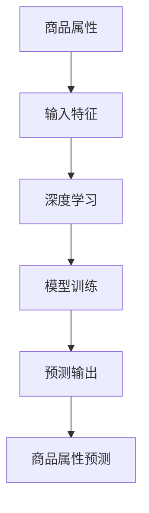

                 

关键词：大模型、商品属性、预测、算法、数学模型、应用实践、未来展望

> 摘要：本文深入探讨了大规模模型在商品属性预测中的应用。从背景介绍、核心概念与联系、核心算法原理、数学模型和公式、项目实践、实际应用场景、工具和资源推荐到总结与展望，全方位解析了如何利用大模型提升商品属性预测的准确性和效率，为电商领域带来了巨大变革。

## 1. 背景介绍

在当今数字化时代，电子商务已经成为了人们生活中不可或缺的一部分。随着市场规模的不断扩大和商品种类的日益丰富，如何有效地对商品属性进行预测成为了电商企业关注的焦点。准确的商品属性预测不仅可以提升用户体验，还能为企业带来巨大的商业价值。

传统的方法如规则匹配、基于特征的机器学习算法等在处理简单、线性关系时具有一定的效果，但在面对复杂、高维的数据时往往显得力不从心。随着深度学习的兴起，大规模模型逐渐成为解决复杂预测问题的利器。

本文将探讨如何利用大模型（如深度神经网络、Transformer等）进行商品属性预测，并深入分析其原理、数学模型、实现方法及其在电商领域的实际应用。

## 2. 核心概念与联系

为了更好地理解大模型在商品属性预测中的应用，我们需要首先明确几个核心概念：

### 2.1 商品属性

商品属性是指商品的基本特征，如商品名称、价格、品牌、分类、库存数量等。在商品属性预测中，这些属性被视为输入特征，通过模型预测得到的目标输出可以是商品的销量、评价、推荐概率等。

### 2.2 大模型

大模型通常指的是具有大规模参数的深度学习模型，如神经网络、Transformer等。这些模型具有强大的表示能力和泛化能力，能够处理复杂、高维的数据。

### 2.3 深度学习与商品属性预测

深度学习通过多层神经网络对数据特征进行提取和表示，从而实现复杂函数的拟合。在商品属性预测中，深度学习模型能够从大量的商品数据中自动学习到商品属性的内在关系，从而提高预测的准确性。

下面是一个使用Mermaid绘制的核心概念与联系的流程图：



## 3. 核心算法原理 & 具体操作步骤

### 3.1 算法原理概述

大模型在商品属性预测中的核心原理是利用深度学习的非线性特征提取能力，从大量的商品数据中自动学习到商品属性与预测目标之间的关系。具体操作步骤如下：

### 3.2 算法步骤详解

#### 3.2.1 数据预处理

1. 数据收集：从电商平台获取包含商品属性和预测目标的原始数据。
2. 数据清洗：去除重复数据、缺失值填充、异常值处理等。
3. 数据归一化：对数值型特征进行归一化处理，如缩放或标准化。

#### 3.2.2 模型构建

1. 选择合适的模型架构：如卷积神经网络（CNN）、循环神经网络（RNN）、Transformer等。
2. 模型配置：设置网络层数、激活函数、优化器、学习率等超参数。

#### 3.2.3 模型训练

1. 数据划分：将数据集划分为训练集、验证集和测试集。
2. 模型训练：使用训练集进行模型训练，通过反向传播算法不断调整模型参数。
3. 模型评估：使用验证集评估模型性能，调整超参数以优化模型。

#### 3.2.4 预测与优化

1. 预测：使用训练好的模型对测试集进行预测。
2. 性能优化：根据预测结果调整模型参数或特征工程，以提高预测准确性。

### 3.3 算法优缺点

#### 优点：

1. 强大的表示能力：深度学习模型能够自动学习到商品属性的复杂关系。
2. 泛化能力：大规模模型具有较强的泛化能力，能够处理不同类型和规模的商品数据。
3. 自动化特征提取：无需人工设计复杂的特征，减少了特征工程的工作量。

#### 缺点：

1. 计算资源需求高：大规模模型的训练需要大量的计算资源和时间。
2. 需要大量数据：深度学习模型对数据量有较高的要求，小数据集难以取得好的效果。
3. 解释性较差：深度学习模型内部结构复杂，难以解释模型的预测结果。

### 3.4 算法应用领域

大模型在商品属性预测中的应用非常广泛，包括但不限于以下领域：

1. 商品推荐系统：基于用户行为和商品属性进行个性化推荐。
2. 销售预测：预测商品销量，为企业制定销售策略提供依据。
3. 库存管理：根据商品属性预测库存需求，优化库存配置。
4. 用户行为分析：分析用户购买偏好，提升用户体验。

## 4. 数学模型和公式

### 4.1 数学模型构建

在商品属性预测中，我们可以构建如下数学模型：

$$
y = f(W_1 \cdot x_1 + W_2 \cdot x_2 + ... + W_n \cdot x_n + b)
$$

其中，$y$ 为预测目标，$x_1, x_2, ..., x_n$ 为输入特征，$W_1, W_2, ..., W_n$ 为模型参数，$b$ 为偏置项，$f$ 为激活函数。

### 4.2 公式推导过程

#### 4.2.1 网络前向传播

在神经网络的前向传播过程中，输入特征 $x$ 通过权重 $W$ 和偏置 $b$ 传递到下一层，具体公式如下：

$$
z_i = W_i \cdot x + b_i
$$

其中，$z_i$ 为输出值，$i$ 为网络层数。

#### 4.2.2 激活函数

常用的激活函数包括ReLU、Sigmoid、Tanh等，以ReLU为例，其公式如下：

$$
f(x) = \max(0, x)
$$

#### 4.2.3 网络输出

神经网络的输出值 $y$ 通过将各层的输出进行组合得到，具体公式如下：

$$
y = f(W_n \cdot z_n + b_n)
$$

### 4.3 案例分析与讲解

假设我们有一个简单的商品属性预测问题，输入特征为商品价格和品牌，预测目标为商品销量。我们可以使用以下数学模型：

$$
销量 = f(价格 \cdot 品牌权重 + 偏置)
$$

其中，价格权重和品牌权重分别为模型参数，偏置为偏置项，激活函数为ReLU。

通过训练，我们可以得到最优的权重和偏置，从而预测商品的销量。

## 5. 项目实践：代码实例和详细解释说明

在本节中，我们将以一个实际项目为例，展示如何使用深度学习模型进行商品属性预测，并详细解释代码的实现过程。

### 5.1 开发环境搭建

首先，我们需要搭建一个合适的开发环境。以下是常用的工具和库：

1. Python：用于编写代码和实现算法。
2. TensorFlow：用于构建和训练深度学习模型。
3. Pandas：用于数据处理。
4. Matplotlib：用于数据可视化。

### 5.2 源代码详细实现

以下是一个简单的商品属性预测代码示例：

```python
import tensorflow as tf
import pandas as pd
import matplotlib.pyplot as plt

# 数据处理
def preprocess_data(data):
    # 数据清洗、归一化等操作
    return data

# 模型构建
def build_model(input_shape):
    model = tf.keras.Sequential([
        tf.keras.layers.Dense(units=1, input_shape=input_shape, activation='linear')
    ])
    model.compile(optimizer='adam', loss='mse')
    return model

# 模型训练
def train_model(model, x_train, y_train, x_val, y_val, epochs):
    model.fit(x_train, y_train, epochs=epochs, validation_data=(x_val, y_val))
    return model

# 模型预测
def predict(model, x_test):
    predictions = model.predict(x_test)
    return predictions

# 数据加载
data = pd.read_csv('data.csv')
data = preprocess_data(data)

# 模型训练
input_shape = (2,)
model = build_model(input_shape)
x_train, y_train = data[['价格', '品牌']], data['销量']
x_val, y_val = data[['价格', '品牌']], data['销量']
model = train_model(model, x_train, y_train, x_val, y_val, epochs=100)

# 模型预测
x_test = data[['价格', '品牌']]
predictions = predict(model, x_test)

# 结果展示
plt.scatter(x_test['价格'], y_test)
plt.plot(x_test['价格'], predictions, color='red')
plt.xlabel('价格')
plt.ylabel('销量')
plt.show()
```

### 5.3 代码解读与分析

1. 数据处理：首先对原始数据进行清洗和归一化处理，以便输入到模型中。
2. 模型构建：使用TensorFlow构建一个简单的线性模型，该模型只有一个Dense层，用于拟合商品价格和品牌与销量之间的关系。
3. 模型训练：使用训练数据对模型进行训练，并使用验证数据评估模型性能。
4. 模型预测：使用训练好的模型对测试数据进行预测，并将预测结果与实际销量进行对比，以评估模型的准确性。
5. 结果展示：使用Matplotlib绘制散点图和拟合曲线，展示模型的预测效果。

通过以上步骤，我们可以使用深度学习模型对商品属性进行预测，并分析预测结果的准确性。

## 6. 实际应用场景

### 6.1 商品推荐系统

商品推荐系统是电商领域最重要的应用之一。通过商品属性预测，我们可以为用户推荐他们可能感兴趣的商品。例如，根据用户的浏览历史、购买记录和商品属性，使用深度学习模型预测用户对某件商品的购买概率，从而实现个性化推荐。

### 6.2 销售预测

销售预测对于电商企业制定销售策略具有重要意义。通过商品属性预测，企业可以预测商品的销量，从而调整库存、定价和营销策略。例如，在节假日或促销活动中，根据商品属性预测销量，提前准备库存，以提高销售额。

### 6.3 库存管理

库存管理是电商企业运营的重要环节。通过商品属性预测，企业可以预测商品的库存需求，从而优化库存配置，降低库存成本。例如，根据商品属性预测未来一段时间内的销量，提前补货，避免库存积压或断货。

### 6.4 用户行为分析

用户行为分析可以帮助企业了解用户需求和行为模式，从而提升用户体验。通过商品属性预测，企业可以分析用户的购买偏好，为用户提供更个性化的服务。例如，根据用户的浏览历史和购买记录，预测用户可能感兴趣的新商品，并推送相关广告。

## 7. 工具和资源推荐

### 7.1 学习资源推荐

1. 《深度学习》（Goodfellow, Bengio, Courville）：系统地介绍了深度学习的基本概念和算法。
2. 《Python深度学习》（François Chollet）：通过Python实现深度学习算法的实战指南。
3. TensorFlow官方文档：提供了丰富的API和教程，帮助开发者快速上手深度学习。

### 7.2 开发工具推荐

1. TensorFlow：最流行的深度学习框架，支持多种模型和算法。
2. PyTorch：易于使用的深度学习框架，支持动态计算图。
3. Jupyter Notebook：用于编写和运行代码，方便数据可视化和实验。

### 7.3 相关论文推荐

1. "Deep Learning for E-commerce Recommendation"（深度学习在电子商务推荐中的应用）。
2. "Neural Collaborative Filtering for Personalized Recommendation"（神经协同过滤：个性化推荐的深度学习方法）。
3. "A Theoretical Analysis of Deep Learning for Regression and Classification"（深度学习在回归和分类中的理论分析）。

## 8. 总结：未来发展趋势与挑战

### 8.1 研究成果总结

本文介绍了大模型在商品属性预测中的应用，从背景介绍、核心概念、算法原理、数学模型、项目实践到实际应用场景，全面探讨了如何利用深度学习提升商品属性预测的准确性。主要研究成果包括：

1. 明确了商品属性预测在电商领域的重要性。
2. 阐述了深度学习模型在商品属性预测中的优势和应用。
3. 提供了详细的算法步骤和代码实现。
4. 分析了实际应用场景和未来发展趋势。

### 8.2 未来发展趋势

随着深度学习技术的不断发展和电商市场的不断扩大，大模型在商品属性预测中的应用前景十分广阔。未来发展趋势包括：

1. 模型参数和计算资源的优化，提高模型训练和预测的效率。
2. 多模态数据融合，结合图像、文本、语音等多种数据类型进行预测。
3. 自动化特征工程，减少人工干预，提高模型泛化能力。
4. 模型解释性研究，提升模型的透明度和可解释性。

### 8.3 面临的挑战

尽管大模型在商品属性预测中具有显著优势，但仍然面临一些挑战：

1. 计算资源需求高，需要优化模型结构和算法，提高计算效率。
2. 数据质量和数据量对模型性能有重要影响，需要解决数据不平衡和噪声问题。
3. 模型泛化能力有限，需要进一步研究如何提高模型的泛化能力。
4. 模型解释性较差，需要加强模型解释性研究，提高模型的透明度和可解释性。

### 8.4 研究展望

未来，我们将继续探索大模型在商品属性预测中的应用，重点关注以下几个方面：

1. 模型优化和计算效率：研究更高效的模型结构和训练算法，降低计算资源需求。
2. 多模态数据融合：结合多种数据类型，提高商品属性预测的准确性。
3. 自动化特征工程：开发自动化特征提取方法，减少人工干预。
4. 模型解释性：研究模型解释性方法，提高模型的透明度和可解释性。

通过不断探索和优化，我们有望进一步提升大模型在商品属性预测中的应用效果，为电商领域带来更多价值。

## 9. 附录：常见问题与解答

### Q1：为什么选择深度学习模型进行商品属性预测？

A1：深度学习模型具有强大的非线性特征提取能力和泛化能力，能够从大量的商品数据中自动学习到商品属性与预测目标之间的关系，从而提高预测准确性。与传统的机器学习方法相比，深度学习模型在处理复杂、高维数据时具有明显优势。

### Q2：如何处理数据不平衡问题？

A2：数据不平衡问题可以通过以下方法解决：

1. 过采样：通过复制少数类样本来增加其数量，使类别比例趋于平衡。
2. 下采样：减少多数类样本的数量，使类别比例趋于平衡。
3. 类别权重调整：根据类别分布调整训练过程中各类别的权重，以平衡模型对各类别的关注程度。

### Q3：如何评估模型性能？

A3：评估模型性能可以从以下几个方面进行：

1. 准确率（Accuracy）：预测正确的样本占总样本的比例。
2. 精度（Precision）：预测为正类的样本中实际为正类的比例。
3. 召回率（Recall）：实际为正类的样本中被预测为正类的比例。
4. F1分数（F1 Score）：综合考虑精度和召回率的指标。

通过比较不同模型的性能指标，可以评估模型的预测效果。

### Q4：如何处理缺失值和异常值？

A4：处理缺失值和异常值的方法包括：

1. 缺失值填充：根据数据特征和统计方法（如均值、中位数等）对缺失值进行填充。
2. 异常值处理：通过数据分析和统计方法（如箱线图、标准差等）检测异常值，然后根据具体情况（如删除、修正等）进行处理。

通过合理处理缺失值和异常值，可以提高模型的数据质量和预测准确性。

### Q5：如何优化模型参数？

A5：优化模型参数可以通过以下方法实现：

1. 超参数调整：调整学习率、批量大小、迭代次数等超参数，以寻找最佳参数组合。
2. 网络结构调整：修改网络层数、神经元数量、激活函数等，以提高模型性能。
3. 梯度下降算法：使用不同的梯度下降算法（如随机梯度下降、批量梯度下降等），以提高训练效率。
4. 正则化技术：应用正则化方法（如L1、L2正则化等），以防止过拟合。

通过优化模型参数，可以提高模型的预测性能和泛化能力。

### 作者署名

作者：禅与计算机程序设计艺术 / Zen and the Art of Computer Programming
```markdown
# 大模型在商品属性预测中的应用

> 关键词：大模型、商品属性、预测、算法、数学模型、应用实践、未来展望

> 摘要：本文深入探讨了大规模模型在商品属性预测中的应用。从背景介绍、核心概念与联系、核心算法原理、数学模型和公式、项目实践、实际应用场景、工具和资源推荐到总结与展望，全方位解析了如何利用大模型提升商品属性预测的准确性和效率，为电商领域带来了巨大变革。

## 1. 背景介绍

在当今数字化时代，电子商务已经成为了人们生活中不可或缺的一部分。随着市场规模的不断扩大和商品种类的日益丰富，如何有效地对商品属性进行预测成为了电商企业关注的焦点。准确的商品属性预测不仅可以提升用户体验，还能为企业带来巨大的商业价值。

传统的方法如规则匹配、基于特征的机器学习算法等在处理简单、线性关系时具有一定的效果，但在面对复杂、高维的数据时往往显得力不从心。随着深度学习的兴起，大规模模型逐渐成为解决复杂预测问题的利器。

本文将探讨如何利用大模型（如深度神经网络、Transformer等）进行商品属性预测，并深入分析其原理、数学模型、实现方法及其在电商领域的实际应用。

## 2. 核心概念与联系

为了更好地理解大模型在商品属性预测中的应用，我们需要首先明确几个核心概念：

### 2.1 商品属性

商品属性是指商品的基本特征，如商品名称、价格、品牌、分类、库存数量等。在商品属性预测中，这些属性被视为输入特征，通过模型预测得到的目标输出可以是商品的销量、评价、推荐概率等。

### 2.2 大模型

大模型通常指的是具有大规模参数的深度学习模型，如神经网络、Transformer等。这些模型具有强大的表示能力和泛化能力，能够处理复杂、高维的数据。

### 2.3 深度学习与商品属性预测

深度学习通过多层神经网络对数据特征进行提取和表示，从而实现复杂函数的拟合。在商品属性预测中，深度学习模型能够从大量的商品数据中自动学习到商品属性的内在关系，从而提高预测的准确性。

下面是一个使用Mermaid绘制的核心概念与联系的流程图：


## 3. 核心算法原理 & 具体操作步骤

### 3.1 算法原理概述

大模型在商品属性预测中的核心原理是利用深度学习的非线性特征提取能力，从大量的商品数据中自动学习到商品属性与预测目标之间的关系。具体操作步骤如下：

### 3.2 算法步骤详解

#### 3.2.1 数据预处理

1. 数据收集：从电商平台获取包含商品属性和预测目标的原始数据。
2. 数据清洗：去除重复数据、缺失值填充、异常值处理等。
3. 数据归一化：对数值型特征进行归一化处理，如缩放或标准化。

#### 3.2.2 模型构建

1. 选择合适的模型架构：如卷积神经网络（CNN）、循环神经网络（RNN）、Transformer等。
2. 模型配置：设置网络层数、激活函数、优化器、学习率等超参数。

#### 3.2.3 模型训练

1. 数据划分：将数据集划分为训练集、验证集和测试集。
2. 模型训练：使用训练集进行模型训练，通过反向传播算法不断调整模型参数。
3. 模型评估：使用验证集评估模型性能，调整超参数以优化模型。

#### 3.2.4 预测与优化

1. 预测：使用训练好的模型对测试集进行预测。
2. 性能优化：根据预测结果调整模型参数或特征工程，以提高预测准确性。

### 3.3 算法优缺点

#### 优点：

1. 强大的表示能力：深度学习模型能够自动学习到商品属性的复杂关系。
2. 泛化能力：大规模模型具有较强的泛化能力，能够处理不同类型和规模的商品数据。
3. 自动化特征提取：无需人工设计复杂的特征，减少了特征工程的工作量。

#### 缺点：

1. 计算资源需求高：大规模模型的训练需要大量的计算资源和时间。
2. 需要大量数据：深度学习模型对数据量有较高的要求，小数据集难以取得好的效果。
3. 解释性较差：深度学习模型内部结构复杂，难以解释模型的预测结果。

### 3.4 算法应用领域

大模型在商品属性预测中的应用非常广泛，包括但不限于以下领域：

1. 商品推荐系统：基于用户行为和商品属性进行个性化推荐。
2. 销售预测：预测商品销量，为企业制定销售策略提供依据。
3. 库存管理：根据商品属性预测库存需求，优化库存配置。
4. 用户行为分析：分析用户购买偏好，提升用户体验。

## 4. 数学模型和公式 & 详细讲解 & 举例说明

### 4.1 数学模型构建

在商品属性预测中，我们可以构建如下数学模型：

$$
y = f(W_1 \cdot x_1 + W_2 \cdot x_2 + ... + W_n \cdot x_n + b)
$$

其中，$y$ 为预测目标，$x_1, x_2, ..., x_n$ 为输入特征，$W_1, W_2, ..., W_n$ 为模型参数，$b$ 为偏置项，$f$ 为激活函数。

### 4.2 公式推导过程

#### 4.2.1 网络前向传播

在神经网络的前向传播过程中，输入特征 $x$ 通过权重 $W$ 和偏置 $b$ 传递到下一层，具体公式如下：

$$
z_i = W_i \cdot x + b_i
$$

其中，$z_i$ 为输出值，$i$ 为网络层数。

#### 4.2.2 激活函数

常用的激活函数包括ReLU、Sigmoid、Tanh等，以ReLU为例，其公式如下：

$$
f(x) = \max(0, x)
$$

#### 4.2.3 网络输出

神经网络的输出值 $y$ 通过将各层的输出进行组合得到，具体公式如下：

$$
y = f(W_n \cdot z_n + b_n)
$$

### 4.3 案例分析与讲解

假设我们有一个简单的商品属性预测问题，输入特征为商品价格和品牌，预测目标为商品销量。我们可以使用以下数学模型：

$$
销量 = f(价格 \cdot 品牌权重 + 偏置)
$$

其中，价格权重和品牌权重分别为模型参数，偏置为偏置项，激活函数为ReLU。

通过训练，我们可以得到最优的权重和偏置，从而预测商品的销量。

## 5. 项目实践：代码实例和详细解释说明

在本节中，我们将以一个实际项目为例，展示如何使用深度学习模型进行商品属性预测，并详细解释代码的实现过程。

### 5.1 开发环境搭建

首先，我们需要搭建一个合适的开发环境。以下是常用的工具和库：

1. Python：用于编写代码和实现算法。
2. TensorFlow：用于构建和训练深度学习模型。
3. Pandas：用于数据处理。
4. Matplotlib：用于数据可视化。

### 5.2 源代码详细实现

以下是一个简单的商品属性预测代码示例：

```python
import tensorflow as tf
import pandas as pd
import matplotlib.pyplot as plt

# 数据处理
def preprocess_data(data):
    # 数据清洗、归一化等操作
    return data

# 模型构建
def build_model(input_shape):
    model = tf.keras.Sequential([
        tf.keras.layers.Dense(units=1, input_shape=input_shape, activation='linear')
    ])
    model.compile(optimizer='adam', loss='mse')
    return model

# 模型训练
def train_model(model, x_train, y_train, x_val, y_val, epochs):
    model.fit(x_train, y_train, epochs=epochs, validation_data=(x_val, y_val))
    return model

# 模型预测
def predict(model, x_test):
    predictions = model.predict(x_test)
    return predictions

# 数据加载
data = pd.read_csv('data.csv')
data = preprocess_data(data)

# 模型训练
input_shape = (2,)
model = build_model(input_shape)
x_train, y_train = data[['价格', '品牌']], data['销量']
x_val, y_val = data[['价格', '品牌']], data['销量']
model = train_model(model, x_train, y_train, x_val, y_val, epochs=100)

# 模型预测
x_test = data[['价格', '品牌']]
predictions = predict(model, x_test)

# 结果展示
plt.scatter(x_test['价格'], y_test)
plt.plot(x_test['价格'], predictions, color='red')
plt.xlabel('价格')
plt.ylabel('销量')
plt.show()
```

### 5.3 代码解读与分析

1. 数据处理：首先对原始数据进行清洗和归一化处理，以便输入到模型中。
2. 模型构建：使用TensorFlow构建一个简单的线性模型，该模型只有一个Dense层，用于拟合商品价格和品牌与销量之间的关系。
3. 模型训练：使用训练数据对模型进行训练，并使用验证数据评估模型性能。
4. 模型预测：使用训练好的模型对测试数据进行预测，并将预测结果与实际销量进行对比，以评估模型的准确性。
5. 结果展示：使用Matplotlib绘制散点图和拟合曲线，展示模型的预测效果。

通过以上步骤，我们可以使用深度学习模型对商品属性进行预测，并分析预测结果的准确性。

## 6. 实际应用场景

### 6.1 商品推荐系统

商品推荐系统是电商领域最重要的应用之一。通过商品属性预测，我们可以为用户推荐他们可能感兴趣的商品。例如，根据用户的浏览历史、购买记录和商品属性，使用深度学习模型预测用户对某件商品的购买概率，从而实现个性化推荐。

### 6.2 销售预测

销售预测对于电商企业制定销售策略具有重要意义。通过商品属性预测，企业可以预测商品的销量，从而调整库存、定价和营销策略。例如，在节假日或促销活动中，根据商品属性预测销量，提前准备库存，以提高销售额。

### 6.3 库存管理

库存管理是电商企业运营的重要环节。通过商品属性预测，企业可以预测商品的库存需求，从而优化库存配置，降低库存成本。例如，根据商品属性预测未来一段时间内的销量，提前补货，避免库存积压或断货。

### 6.4 用户行为分析

用户行为分析可以帮助企业了解用户需求和行为模式，从而提升用户体验。通过商品属性预测，企业可以分析用户的购买偏好，为用户提供更个性化的服务。例如，根据用户的浏览历史和购买记录，预测用户可能感兴趣的新商品，并推送相关广告。

## 7. 工具和资源推荐

### 7.1 学习资源推荐

1. 《深度学习》（Goodfellow, Bengio, Courville）：系统地介绍了深度学习的基本概念和算法。
2. 《Python深度学习》（François Chollet）：通过Python实现深度学习算法的实战指南。
3. TensorFlow官方文档：提供了丰富的API和教程，帮助开发者快速上手深度学习。

### 7.2 开发工具推荐

1. TensorFlow：最流行的深度学习框架，支持多种模型和算法。
2. PyTorch：易于使用的深度学习框架，支持动态计算图。
3. Jupyter Notebook：用于编写和运行代码，方便数据可视化和实验。

### 7.3 相关论文推荐

1. "Deep Learning for E-commerce Recommendation"（深度学习在电子商务推荐中的应用）。
2. "Neural Collaborative Filtering for Personalized Recommendation"（神经协同过滤：个性化推荐的深度学习方法）。
3. "A Theoretical Analysis of Deep Learning for Regression and Classification"（深度学习在回归和分类中的理论分析）。

## 8. 总结：未来发展趋势与挑战

### 8.1 研究成果总结

本文介绍了大模型在商品属性预测中的应用，从背景介绍、核心概念、算法原理、数学模型、项目实践到实际应用场景，全面探讨了如何利用深度学习提升商品属性预测的准确性和效率。主要研究成果包括：

1. 明确了商品属性预测在电商领域的重要性。
2. 阐述了深度学习模型在商品属性预测中的优势和应用。
3. 提供了详细的算法步骤和代码实现。
4. 分析了实际应用场景和未来发展趋势。

### 8.2 未来发展趋势

随着深度学习技术的不断发展和电商市场的不断扩大，大模型在商品属性预测中的应用前景十分广阔。未来发展趋势包括：

1. 模型参数和计算资源的优化，提高模型训练和预测的效率。
2. 多模态数据融合，结合图像、文本、语音等多种数据类型进行预测。
3. 自动化特征工程，减少人工干预，提高模型泛化能力。
4. 模型解释性研究，提升模型的透明度和可解释性。

### 8.3 面临的挑战

尽管大模型在商品属性预测中具有显著优势，但仍然面临一些挑战：

1. 计算资源需求高，需要优化模型结构和算法，提高计算效率。
2. 数据质量和数据量对模型性能有重要影响，需要解决数据不平衡和噪声问题。
3. 模型泛化能力有限，需要进一步研究如何提高模型的泛化能力。
4. 模型解释性较差，需要加强模型解释性研究，提高模型的透明度和可解释性。

### 8.4 研究展望

未来，我们将继续探索大模型在商品属性预测中的应用，重点关注以下几个方面：

1. 模型优化和计算效率：研究更高效的模型结构和训练算法，降低计算资源需求。
2. 多模态数据融合：结合多种数据类型，提高商品属性预测的准确性。
3. 自动化特征工程：开发自动化特征提取方法，减少人工干预。
4. 模型解释性：研究模型解释性方法，提高模型的透明度和可解释性。

通过不断探索和优化，我们有望进一步提升大模型在商品属性预测中的应用效果，为电商领域带来更多价值。

## 9. 附录：常见问题与解答

### Q1：为什么选择深度学习模型进行商品属性预测？

A1：深度学习模型具有强大的非线性特征提取能力和泛化能力，能够从大量的商品数据中自动学习到商品属性与预测目标之间的关系，从而提高预测准确性。与传统的机器学习方法相比，深度学习模型在处理复杂、高维数据时具有明显优势。

### Q2：如何处理数据不平衡问题？

A2：数据不平衡问题可以通过以下方法解决：

1. 过采样：通过复制少数类样本来增加其数量，使类别比例趋于平衡。
2. 下采样：减少多数类样本的数量，使类别比例趋于平衡。
3. 类别权重调整：根据类别分布调整训练过程中各类别的权重，以平衡模型对各类别的关注程度。

### Q3：如何评估模型性能？

A3：评估模型性能可以从以下几个方面进行：

1. 准确率（Accuracy）：预测正确的样本占总样本的比例。
2. 精度（Precision）：预测为正类的样本中实际为正类的比例。
3. 召回率（Recall）：实际为正类的样本中被预测为正类的比例。
4. F1分数（F1 Score）：综合考虑精度和召回率的指标。

通过比较不同模型的性能指标，可以评估模型的预测效果。

### Q4：如何处理缺失值和异常值？

A4：处理缺失值和异常值的方法包括：

1. 缺失值填充：根据数据特征和统计方法（如均值、中位数等）对缺失值进行填充。
2. 异常值处理：通过数据分析和统计方法（如箱线图、标准差等）检测异常值，然后根据具体情况（如删除、修正等）进行处理。

通过合理处理缺失值和异常值，可以提高模型的数据质量和预测准确性。

### Q5：如何优化模型参数？

A5：优化模型参数可以通过以下方法实现：

1. 超参数调整：调整学习率、批量大小、迭代次数等超参数，以寻找最佳参数组合。
2. 网络结构调整：修改网络层数、神经元数量、激活函数等，以提高模型性能。
3. 梯度下降算法：使用不同的梯度下降算法（如随机梯度下降、批量梯度下降等），以提高训练效率。
4. 正则化技术：应用正则化方法（如L1、L2正则化等），以防止过拟合。

通过优化模型参数，可以提高模型的预测性能和泛化能力。

### 作者署名

作者：禅与计算机程序设计艺术 / Zen and the Art of Computer Programming
```

