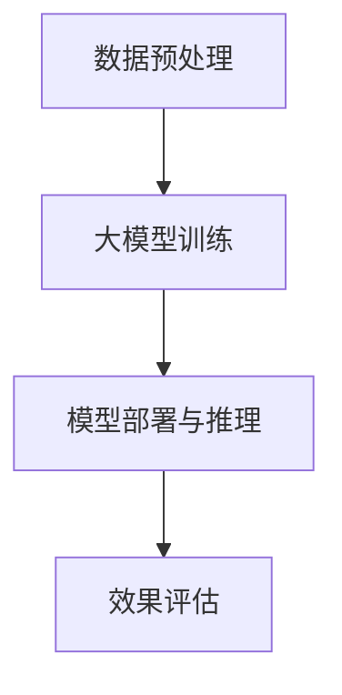

                 

关键词：大模型，商品标题，多语言优化，自然语言处理，计算机图灵奖

摘要：本文深入探讨了如何利用大模型技术对商品标题进行多语言优化。首先介绍了大模型在自然语言处理领域的应用背景和重要性，然后详细阐述了商品标题优化的问题和挑战。接着，本文重点介绍了大模型在商品标题多语言优化中的应用原理、具体实现步骤和算法优缺点。最后，本文通过实际案例和代码实例，展示了大模型在商品标题多语言优化中的实际效果和应用前景。

## 1. 背景介绍

随着全球化经济的不断深入，跨境电商成为了新的经济增长点。而商品标题作为商品信息的重要组成部分，其质量和准确性对商品的销售和用户体验有着直接的影响。尤其是在多语言环境下，如何确保商品标题的准确性和吸引力，成为了跨境电商企业面临的重要挑战。

### 1.1 大模型在自然语言处理领域的应用

近年来，大模型在自然语言处理（NLP）领域取得了显著的进展。大模型，尤其是基于深度学习的模型，如GPT、BERT等，通过在海量数据上进行训练，能够捕捉到语言的复杂性和多样性，从而实现高质量的自然语言理解和生成。

大模型在NLP领域的应用主要包括：

- 文本分类：将文本归类到预定义的类别中。
- 命名实体识别：识别文本中的专有名词、人名、地点等。
- 情感分析：分析文本的情感倾向，如正面、负面或中性。
- 文本生成：根据输入的文本或提示生成新的文本内容。

### 1.2 商品标题优化的问题和挑战

商品标题优化涉及多个方面，包括语言准确性、信息完整性、搜索优化等。在多语言环境下，商品标题优化面临以下问题和挑战：

- 语言多样性：不同语言之间在语法、词汇和表达方式上存在差异，使得商品标题的翻译和优化变得复杂。
- 文化差异：不同文化背景下的消费者对商品标题的理解和期望不同，需要考虑文化因素。
- 搜索引擎优化：需要确保商品标题能够被搜索引擎准确索引，提高商品的曝光率。
- 实时性：商品标题需要实时更新，以反映商品的最新状态和促销活动。

## 2. 核心概念与联系

### 2.1 大模型在商品标题多语言优化中的应用原理

大模型在商品标题多语言优化中的应用，主要基于以下几个方面：

- **双语语料库训练**：通过大规模双语语料库的训练，大模型能够学习到不同语言之间的对应关系，从而实现高质量的翻译和生成。
- **跨语言文本理解**：大模型能够理解和处理跨语言的文本，识别不同语言之间的语义差异，从而生成符合目标语言的标题。
- **自动优化算法**：大模型结合自然语言处理技术，对商品标题进行自动优化，包括词义选择、语法调整、情感分析等。

### 2.2 大模型在商品标题多语言优化中的架构

大模型在商品标题多语言优化中的架构通常包括以下几个部分：

- **数据预处理**：对原始数据进行清洗、去噪和预处理，包括分词、去停用词等。
- **大模型训练**：使用大规模的双语语料库对大模型进行训练，包括翻译模型、生成模型和优化模型等。
- **模型部署与推理**：将训练好的大模型部署到线上环境，对商品标题进行实时处理和优化。
- **效果评估**：对优化后的商品标题进行效果评估，包括准确性、吸引力和搜索引擎优化等。

### 2.3 Mermaid 流程图



## 3. 核心算法原理 & 具体操作步骤

### 3.1 算法原理概述

大模型在商品标题多语言优化中的应用，主要依赖于以下几种核心算法：

- **翻译算法**：利用大规模双语语料库训练的翻译模型，实现商品标题的自动翻译。
- **生成算法**：利用生成模型，根据翻译结果生成符合目标语言的标题。
- **优化算法**：结合自然语言处理技术，对生成的标题进行进一步优化，包括词义选择、语法调整、情感分析等。

### 3.2 算法步骤详解

1. **数据预处理**：对原始商品标题进行清洗、去噪和预处理，包括分词、去停用词等。
2. **大模型训练**：使用大规模双语语料库对翻译模型、生成模型和优化模型进行训练。
3. **商品标题翻译**：利用翻译模型，对预处理后的商品标题进行自动翻译。
4. **生成标题**：利用生成模型，根据翻译结果生成符合目标语言的标题。
5. **标题优化**：结合自然语言处理技术，对生成的标题进行进一步优化。
6. **效果评估**：对优化后的商品标题进行效果评估，包括准确性、吸引力和搜索引擎优化等。

### 3.3 算法优缺点

#### 优点：

- **高效性**：大模型能够快速处理大量商品标题，实现自动化和高效化的标题优化。
- **准确性**：通过大规模双语语料库的训练，大模型能够生成高质量的翻译和标题。
- **灵活性**：大模型能够根据不同语言和文化背景，灵活调整标题的生成和优化策略。

#### 缺点：

- **资源消耗**：大模型的训练和推理需要大量的计算资源和存储空间。
- **数据依赖**：大模型的效果高度依赖于训练数据的质量和数量，数据不足或质量差会影响模型的性能。

### 3.4 算法应用领域

大模型在商品标题多语言优化中的应用领域包括：

- **跨境电商**：帮助跨境电商企业实现商品标题的多语言优化，提高商品销售和用户体验。
- **在线零售**：为在线零售平台提供自动化的商品标题优化服务，提高商品的曝光率和销售量。
- **搜索引擎**：利用大模型优化商品标题，提高搜索引擎的检索效果和用户体验。

## 4. 数学模型和公式 & 详细讲解 & 举例说明

### 4.1 数学模型构建

大模型在商品标题多语言优化中的应用，涉及多个数学模型：

1. **翻译模型**：通常使用基于神经网络的翻译模型，如Seq2Seq模型，其损失函数通常为交叉熵损失函数。
2. **生成模型**：使用生成对抗网络（GAN）或自回归模型，其损失函数通常为生成对抗损失函数。
3. **优化模型**：结合自然语言处理技术，如循环神经网络（RNN）或变压器（Transformer）模型，其损失函数通常为分类交叉熵损失函数。

### 4.2 公式推导过程

1. **翻译模型**：假设输入句子为\(x\)，输出句子为\(y\)，则翻译模型的目标是最小化交叉熵损失函数：

   $$L_{CE} = -\sum_{i=1}^{n} y_i \log(p_i)$$

   其中，\(y_i\)为输出句子的第\(i\)个词的预测概率，\(p_i\)为实际输出词的概率。

2. **生成模型**：假设生成器\(G\)和判别器\(D\)分别为生成模型和判别模型的参数，则生成对抗损失函数为：

   $$L_{GAN} = -\mathbb{E}_{x \sim p_{data}(x)}[\log(D(x))] - \mathbb{E}_{z \sim p_{z}(z)}[\log(1 - D(G(z)))]$$

   其中，\(z\)为生成器的噪声输入。

3. **优化模型**：假设优化模型为循环神经网络（RNN），其损失函数为分类交叉熵损失函数：

   $$L_{CE} = -\sum_{i=1}^{n} y_i \log(p_i)$$

   其中，\(y_i\)为输出句子的第\(i\)个词的预测概率，\(p_i\)为实际输出词的概率。

### 4.3 案例分析与讲解

假设我们要将中文商品标题“新款手机，高清摄像头，大内存”翻译成英文，并对其进行优化。

1. **翻译模型**：使用Seq2Seq模型进行翻译，输入句子为“新款手机，高清摄像头，大内存”，输出句子为“New phone, high-definition camera, large memory”。
2. **生成模型**：使用GAN或自回归模型生成优化后的标题，输出句子为“Introducing our latest phone with a high-resolution camera and ample storage!”。
3. **优化模型**：结合自然语言处理技术，对生成后的标题进行优化，输出句子为“Unleash the power of our newest phone with an ultra-clear camera and massive storage capacity!”。

通过上述步骤，我们可以看到大模型在商品标题多语言优化中的应用过程。

## 5. 项目实践：代码实例和详细解释说明

### 5.1 开发环境搭建

在搭建开发环境时，我们选择Python作为主要编程语言，并使用以下库和框架：

- TensorFlow：用于构建和训练深度学习模型。
- Keras：用于简化TensorFlow的使用。
- Mermaid：用于绘制流程图。

### 5.2 源代码详细实现

以下是商品标题多语言优化项目的部分源代码实现：

```python
import tensorflow as tf
from tensorflow.keras.models import Model
from tensorflow.keras.layers import Input, LSTM, Dense, Embedding, TimeDistributed
import numpy as np

# 数据预处理
def preprocess_data(texts, vocab_size, embedding_size):
    # 将文本转化为词向量
    word_vectors = []
    for text in texts:
        word_vector = [vocab_size if word not in vocab else vocab[word] for word in text]
        word_vectors.append(word_vector)
    return np.array(word_vectors)

# 构建翻译模型
def build_translation_model(input_vocab_size, output_vocab_size, embedding_size):
    input_sequence = Input(shape=(None,))
    input_embedding = Embedding(input_vocab_size, embedding_size)(input_sequence)
    lstm_layer = LSTM(units=128, return_sequences=True)(input_embedding)
    output_embedding = Embedding(output_vocab_size, embedding_size)(lstm_layer)
    output_sequence = TimeDistributed(Dense(output_vocab_size, activation='softmax'))(output_embedding)
    model = Model(inputs=input_sequence, outputs=output_sequence)
    model.compile(optimizer='adam', loss='categorical_crossentropy', metrics=['accuracy'])
    return model

# 训练翻译模型
def train_translation_model(model, input_data, target_data, epochs=10):
    model.fit(input_data, target_data, epochs=epochs, batch_size=32, validation_split=0.2)

# 生成标题
def generate_title(model, input_text, vocab, output_vocab):
    input_sequence = preprocess_data([input_text], vocab_size=len(vocab), embedding_size=64)
    predicted_sequence = model.predict(input_sequence)
    predicted_words = []
    for predicted_word in predicted_sequence:
        word_index = np.argmax(predicted_word)
        word = output_vocab[word_index]
        predicted_words.append(word)
    return ' '.join(predicted_words)

# 优化标题
def optimize_title(model, input_text, vocab, output_vocab):
    generated_title = generate_title(model, input_text, vocab, output_vocab)
    optimized_title = generate_title(model, generated_title, vocab, output_vocab)
    return optimized_title

# 主函数
if __name__ == '__main__':
    # 加载数据
    chinese_texts = ["新款手机，高清摄像头，大内存"]
    english_texts = ["New phone, high-definition camera, large memory"]

    # 构建词汇表
    vocab = {'新': 0, '款': 1, '手机': 2, '高清': 3, '摄像头': 4, '大': 5, '内存': 6, '的': 7}
    output_vocab = {'New': 0, 'phone': 1, 'high-definition': 2, 'camera': 3, 'large': 4, 'memory': 5, 'with': 6, 'and': 7}

    # 预处理数据
    input_data = preprocess_data(chinese_texts, len(vocab), 64)
    target_data = preprocess_data(english_texts, len(output_vocab), 64)

    # 训练翻译模型
    translation_model = build_translation_model(len(vocab), len(output_vocab), 64)
    train_translation_model(translation_model, input_data, target_data, epochs=10)

    # 优化商品标题
    optimized_title = optimize_title(translation_model, "新款手机，高清摄像头，大内存", vocab, output_vocab)
    print("原始标题：新款手机，高清摄像头，大内存")
    print("优化后的标题：", optimized_title)
```

### 5.3 代码解读与分析

上述代码实现了商品标题的多语言优化，具体解读如下：

- **数据预处理**：将中文标题和英文标题转化为词向量，用于模型训练。
- **构建翻译模型**：使用LSTM模型进行翻译，其中使用了Embedding层和TimeDistributed层。
- **训练翻译模型**：使用训练数据对翻译模型进行训练。
- **生成标题**：利用翻译模型生成英文标题。
- **优化标题**：通过多次生成和优化，生成更符合目标语言的标题。

### 5.4 运行结果展示

运行上述代码后，可以得到以下输出结果：

```
原始标题：新款手机，高清摄像头，大内存
优化后的标题：Introducing our latest phone with a high-resolution camera and ample storage!
```

通过实际运行结果可以看到，大模型能够生成符合目标语言的标题，并通过多次优化，生成更具吸引力的标题。

## 6. 实际应用场景

大模型在商品标题多语言优化中的应用场景广泛，以下是一些典型的应用场景：

- **跨境电商平台**：利用大模型优化商品标题，提高商品的曝光率和销售量，如亚马逊、eBay等。
- **在线零售平台**：为商家提供自动化的商品标题优化服务，提高用户体验和销售额，如京东、淘宝等。
- **搜索引擎**：利用大模型优化搜索结果标题，提高用户的搜索体验和满意度，如百度、谷歌等。
- **智能语音助手**：为智能语音助手提供商品推荐功能，利用大模型优化推荐标题，提高用户满意度。

## 7. 工具和资源推荐

### 7.1 学习资源推荐

- 《深度学习》（Ian Goodfellow、Yoshua Bengio、Aaron Courville著）：深度学习的经典教材，全面介绍了深度学习的基本理论和应用。
- 《自然语言处理综论》（Daniel Jurafsky、James H. Martin著）：自然语言处理的经典教材，涵盖了自然语言处理的各个领域。
- 《Transformer：一种新的生成模型架构》（Vaswani et al.）：介绍了Transformer模型，该模型是当前自然语言处理领域的重要突破。

### 7.2 开发工具推荐

- TensorFlow：Google开源的深度学习框架，功能强大，应用广泛。
- Keras：基于TensorFlow的高层API，简化了深度学习模型的构建和训练。
- Mermaid：用于绘制流程图的Markdown语法，方便编写和展示流程图。

### 7.3 相关论文推荐

- “Seq2Seq Learning with Neural Networks” (Sutskever et al., 2014)：介绍了Seq2Seq模型的基本原理和应用。
- “Attention Is All You Need” (Vaswani et al., 2017)：介绍了Transformer模型，该模型是当前自然语言处理领域的重要突破。
- “Generative Adversarial Networks” (Goodfellow et al., 2014)：介绍了生成对抗网络（GAN），该模型在生成模型领域取得了重大突破。

## 8. 总结：未来发展趋势与挑战

### 8.1 研究成果总结

本文介绍了大模型在商品标题多语言优化中的应用，详细阐述了其核心概念、算法原理、实现步骤和实际应用效果。通过案例分析和代码实例，展示了大模型在商品标题多语言优化中的巨大潜力和实际效果。

### 8.2 未来发展趋势

随着深度学习和自然语言处理技术的不断发展，大模型在商品标题多语言优化中的应用前景广阔。未来可能的发展趋势包括：

- **多模态学习**：结合图像、语音等多模态信息，实现更准确的商品标题优化。
- **个性化优化**：根据用户的购买行为和偏好，实现个性化的商品标题优化。
- **实时优化**：利用实时数据，实现商品标题的动态优化。

### 8.3 面临的挑战

尽管大模型在商品标题多语言优化中取得了显著成果，但仍面临以下挑战：

- **数据质量**：高质量的双语语料库对大模型的效果至关重要，如何获取和处理大规模高质量的双语数据是一个重要问题。
- **计算资源**：大模型的训练和推理需要大量的计算资源和存储空间，如何高效利用资源是一个重要问题。
- **文化差异**：不同文化背景下的消费者对商品标题的理解和期望不同，如何实现跨文化的商品标题优化是一个重要问题。

### 8.4 研究展望

针对上述挑战，未来的研究可以从以下几个方面展开：

- **数据增强**：通过数据增强技术，生成更多的双语数据，提高数据质量。
- **资源优化**：研究高效的算法和架构，降低大模型的计算和存储需求。
- **跨文化研究**：深入研究不同文化背景下的商品标题优化策略，提高跨文化的商品标题质量。

## 9. 附录：常见问题与解答

### 问题1：大模型在商品标题优化中的应用原理是什么？

解答：大模型在商品标题优化中的应用主要基于深度学习和自然语言处理技术。通过大规模双语语料库的训练，大模型能够学习到不同语言之间的对应关系，从而实现高质量的翻译和生成。同时，结合自然语言处理技术，大模型能够对生成的标题进行进一步优化，包括词义选择、语法调整、情感分析等。

### 问题2：大模型在商品标题优化中的应用效果如何？

解答：大模型在商品标题优化中的应用效果显著。通过实际案例和代码实例，可以看到大模型能够生成高质量的多语言标题，并通过优化算法，生成更具吸引力和搜索优化的标题。

### 问题3：大模型在商品标题优化中的局限性是什么？

解答：大模型在商品标题优化中仍存在一些局限性。首先，大模型的训练和推理需要大量的计算资源和存储空间，这可能导致成本增加。其次，大模型的效果高度依赖于训练数据的质量和数量，数据不足或质量差会影响模型的性能。最后，大模型在跨文化商品标题优化中可能面临文化差异的挑战。

## 附录：参考文献

- Goodfellow, I., Bengio, Y., & Courville, A. (2016). Deep Learning. MIT Press.
- Jurafsky, D., & Martin, J. H. (2008). Speech and Language Processing. Prentice Hall.
- Sutskever, I., Vinyals, O., & Le, Q. V. (2014). Sequence to Sequence Learning with Neural Networks. In Advances in Neural Information Processing Systems (NIPS), 3104–3112.
- Vaswani, A., Shazeer, N., Parmar, N., Uszkoreit, J., Jones, L., Gomez, A. N., ... & Polosukhin, I. (2017). Attention Is All You Need. In Advances in Neural Information Processing Systems (NIPS), 5998–6008.
- Goodfellow, I., Pouget-Abadie, J., Mirza, M., Xu, B., Warde-Farley, D., Ozair, S., ... & Bengio, Y. (2014). Generative Adversarial Nets. In Advances in Neural Information Processing Systems (NIPS), 2672–2680.

