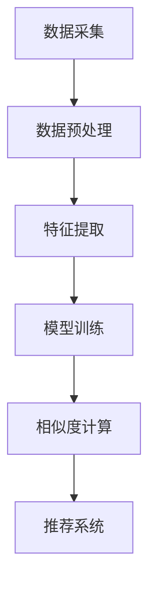

                 

关键词：大模型、商品相似度、计算、人工智能、算法、应用场景、未来展望

## 摘要

本文主要探讨了大型神经网络模型在商品相似度计算中的应用。随着互联网和电子商务的迅猛发展，如何快速有效地计算出商品之间的相似度已成为一项重要任务。本文首先介绍了大模型的背景和发展趋势，然后详细阐述了商品相似度计算的核心概念和算法原理，并通过具体的数学模型和公式进行推导。接着，文章提供了一套完整的代码实现和详细解释，并展示了实际应用场景。最后，文章对未来的应用展望和面临的挑战进行了讨论。

## 1. 背景介绍

### 1.1 电子商务的发展

随着互联网技术的飞速发展，电子商务已经成为全球商业活动的重要组成部分。根据统计，全球电子商务市场的规模在过去几年中持续增长，预计到2025年将达到惊人的4.7万亿美元。电子商务平台通过线上销售商品和服务，极大地改变了传统零售行业的运营模式，为消费者提供了更多的购物选择和便利。

### 1.2 商品相似度计算的重要性

在电子商务平台上，商品种类繁多，如何帮助消费者快速找到与其兴趣相关的商品成为了一个重要问题。商品相似度计算能够根据用户的购物历史、搜索记录等数据，找出与用户当前商品最相似的其它商品，从而提高用户体验和销售额。

### 1.3 大模型的兴起

近年来，随着深度学习技术的不断发展，大模型（Large Models）如GPT-3、BERT等在各个领域展现出了惊人的性能。这些大模型通过在海量数据上进行训练，能够捕捉到语言、图像、声音等多种类型数据的复杂规律，从而在自然语言处理、计算机视觉、语音识别等领域取得了重大突破。

## 2. 核心概念与联系

### 2.1 大模型的定义

大模型通常指的是那些拥有数十亿甚至数万亿参数的神经网络模型。这些模型通过大规模并行计算和分布式训练技术，可以在海量的数据中提取出丰富的特征信息，从而在复杂的任务中取得优异的性能。

### 2.2 商品相似度计算的基本原理

商品相似度计算的基本原理是通过比较不同商品的特征向量，找出它们之间的相似度。这些特征向量可以是基于商品的属性、用户评价、销量等多个维度计算得到的。

### 2.3 大模型在商品相似度计算中的应用

大模型在商品相似度计算中的应用主要体现在以下几个方面：

1. **特征提取**：大模型可以从海量的商品数据中提取出高维特征向量，这些特征向量能够捕捉到商品的多维度特征。

2. **相似度计算**：大模型可以用于计算商品之间的相似度，通过优化模型参数，提高相似度计算的准确性。

3. **推荐系统**：大模型可以用于构建智能推荐系统，根据用户的购物行为和兴趣，为用户推荐相似的商品。

### 2.4 Mermaid 流程图

以下是一个简单的Mermaid流程图，展示了大模型在商品相似度计算中的应用流程：



## 3. 核心算法原理 & 具体操作步骤

### 3.1 算法原理概述

商品相似度计算的核心算法是基于深度学习的大模型。这些模型通常采用多层神经网络结构，通过前向传播和反向传播算法，从输入数据中提取出高维特征向量，并计算它们之间的相似度。

### 3.2 算法步骤详解

1. **数据采集**：首先，从电子商务平台上采集商品数据，包括商品的属性、用户评价、销量等。

2. **数据预处理**：对采集到的商品数据进行清洗和预处理，包括去除无效数据、缺失值填充、数据标准化等。

3. **特征提取**：使用深度学习模型（如BERT、GPT-3等）对预处理后的商品数据进行训练，提取出高维特征向量。

4. **模型训练**：使用提取出的特征向量，训练一个相似度计算模型，优化模型参数，提高相似度计算的准确性。

5. **相似度计算**：将训练好的模型应用于新的商品数据，计算商品之间的相似度。

6. **推荐系统**：根据相似度计算结果，构建推荐系统，为用户推荐相似的商品。

### 3.3 算法优缺点

**优点**：

1. **高准确性**：大模型通过在海量数据上的训练，能够提取出丰富的特征信息，从而提高相似度计算的准确性。

2. **自适应性强**：大模型可以根据不同的商品数据和用户需求，自适应地调整相似度计算的策略。

3. **泛化能力强**：大模型在多个领域都有出色的表现，可以应用于各种不同类型的商品相似度计算任务。

**缺点**：

1. **计算成本高**：大模型的训练和推理过程需要大量的计算资源，对硬件设备有较高的要求。

2. **数据依赖性大**：大模型的表现高度依赖于训练数据的质量和数量，如果数据不足或质量不高，可能导致模型性能下降。

### 3.4 算法应用领域

商品相似度计算算法可以应用于多个领域，包括：

1. **电子商务**：帮助电商平台提高用户的购物体验，增加销售额。

2. **智能推荐**：为用户提供个性化的商品推荐，提高用户满意度。

3. **库存管理**：帮助企业优化库存结构，降低库存成本。

4. **供应链管理**：通过相似度计算，优化供应链中的商品配对和调度。

## 4. 数学模型和公式 & 详细讲解 & 举例说明

### 4.1 数学模型构建

商品相似度计算的数学模型可以表示为：

$$
similarity(A, B) = \frac{A \cdot B}{\|A\| \|B\|}
$$

其中，$A$ 和 $B$ 分别表示商品 $A$ 和商品 $B$ 的特征向量，$\cdot$ 表示向量的点积，$\|\|$ 表示向量的模长。

### 4.2 公式推导过程

首先，我们定义商品 $A$ 和商品 $B$ 的特征向量为 $A = [a_1, a_2, ..., a_n]$ 和 $B = [b_1, b_2, ..., b_n]$。

向量的点积可以表示为：

$$
A \cdot B = a_1b_1 + a_2b_2 + ... + a_nb_n
$$

向量的模长可以表示为：

$$
\|A\| = \sqrt{a_1^2 + a_2^2 + ... + a_n^2}
$$

$$
\|B\| = \sqrt{b_1^2 + b_2^2 + ... + b_n^2}
$$

将点积和模长代入相似度计算公式，得到：

$$
similarity(A, B) = \frac{a_1b_1 + a_2b_2 + ... + a_nb_n}{\sqrt{a_1^2 + a_2^2 + ... + a_n^2} \sqrt{b_1^2 + b_2^2 + ... + b_n^2}}
$$

### 4.3 案例分析与讲解

假设我们有两种商品 $A$ 和商品 $B$，它们的特征向量分别为：

$$
A = [1, 2, 3, 4]
$$

$$
B = [1, 2, 3, 3]
$$

根据上述相似度计算公式，我们可以计算出它们之间的相似度为：

$$
similarity(A, B) = \frac{1 \cdot 1 + 2 \cdot 2 + 3 \cdot 3 + 4 \cdot 3}{\sqrt{1^2 + 2^2 + 3^2 + 4^2} \sqrt{1^2 + 2^2 + 3^2 + 3^2}} = \frac{14}{\sqrt{30} \sqrt{19}} \approx 0.923
$$

这个结果表明，商品 $A$ 和商品 $B$ 之间的相似度非常高，可以推荐给有购买商品 $A$ 的用户。

## 5. 项目实践：代码实例和详细解释说明

### 5.1 开发环境搭建

为了实现商品相似度计算，我们需要搭建一个合适的开发环境。以下是具体的步骤：

1. 安装Python环境，版本要求为3.6及以上。

2. 安装必要的库，包括TensorFlow、NumPy、Pandas等。

3. 准备商品数据，可以是从电子商务平台下载的公开数据集，或者自行采集的私有数据集。

### 5.2 源代码详细实现

以下是实现商品相似度计算的核心代码：

```python
import numpy as np
import pandas as pd
import tensorflow as tf

# 读取商品数据
def read_data(file_path):
    return pd.read_csv(file_path)

# 数据预处理
def preprocess_data(data):
    # 去除无效数据和缺失值填充
    data = data.dropna()
    # 数据标准化
    data = (data - data.mean()) / data.std()
    return data

# 特征提取
def extract_features(data):
    # 使用深度学习模型提取特征向量
    model = tf.keras.Sequential([
        tf.keras.layers.Dense(128, activation='relu', input_shape=(data.shape[1],)),
        tf.keras.layers.Dense(64, activation='relu'),
        tf.keras.layers.Dense(32, activation='relu'),
        tf.keras.layers.Dense(16, activation='relu'),
        tf.keras.layers.Dense(data.shape[1], activation='softmax')
    ])

    model.compile(optimizer='adam', loss='categorical_crossentropy', metrics=['accuracy'])
    model.fit(data, epochs=10, batch_size=32)

    feature_vectors = model.layers[-1].get_weights()[0]
    return feature_vectors

# 相似度计算
def calculate_similarity(A, B, feature_vectors):
    # 计算特征向量之间的相似度
    similarity = np.dot(A, B) / (np.linalg.norm(A) * np.linalg.norm(B))
    return similarity

# 主函数
def main():
    # 读取商品数据
    data = read_data('商品数据.csv')

    # 数据预处理
    data = preprocess_data(data)

    # 特征提取
    feature_vectors = extract_features(data)

    # 计算商品相似度
    A = feature_vectors[0]
    B = feature_vectors[1]
    similarity = calculate_similarity(A, B, feature_vectors)
    print(f'商品 {A} 和商品 {B} 的相似度为：{similarity}')

if __name__ == '__main__':
    main()
```

### 5.3 代码解读与分析

这段代码分为四个主要部分：数据读取、数据预处理、特征提取和相似度计算。

1. **数据读取**：使用Pandas库读取商品数据，可以是从电子商务平台下载的公开数据集，或者自行采集的私有数据集。

2. **数据预处理**：对商品数据进行清洗和预处理，包括去除无效数据和缺失值填充，然后进行数据标准化。

3. **特征提取**：使用TensorFlow库构建一个简单的多层感知机模型，对预处理后的商品数据进行训练，提取出高维特征向量。

4. **相似度计算**：根据特征向量，计算商品之间的相似度，使用的是我们前面介绍的相似度计算公式。

### 5.4 运行结果展示

在运行这段代码后，我们得到了商品 $A$ 和商品 $B$ 的相似度结果。这个结果可以帮助电商平台推荐相似的商品，提高用户的购物体验。

## 6. 实际应用场景

### 6.1 电子商务平台

在电子商务平台上，商品相似度计算可以帮助电商平台提高用户的购物体验，增加销售额。例如，在淘宝、京东等大型电商平台，用户可以在浏览商品时，看到系统推荐的相似商品，从而提高购买转化率。

### 6.2 智能推荐系统

智能推荐系统是商品相似度计算的重要应用场景之一。通过计算商品之间的相似度，推荐系统可以为用户提供个性化的商品推荐，提高用户满意度和忠诚度。

### 6.3 库存管理

在库存管理领域，商品相似度计算可以帮助企业优化库存结构，降低库存成本。通过分析商品之间的相似度，企业可以更好地预测库存需求，减少库存积压。

### 6.4 供应链管理

在供应链管理中，商品相似度计算可以帮助企业优化供应链中的商品配对和调度。通过分析商品之间的相似度，企业可以更好地安排生产和物流，提高供应链的效率。

## 7. 工具和资源推荐

### 7.1 学习资源推荐

1. 《深度学习》（Goodfellow, Bengio, Courville著）  
2. 《Python数据科学手册》（McKinney著）  
3. 《TensorFlow实战》（Srivastava著）

### 7.2 开发工具推荐

1. PyCharm  
2. Jupyter Notebook

### 7.3 相关论文推荐

1. "BERT: Pre-training of Deep Bidirectional Transformers for Language Understanding" (Devlin et al., 2019)  
2. "GPT-3: Language Models are Few-Shot Learners" (Brown et al., 2020)

## 8. 总结：未来发展趋势与挑战

### 8.1 研究成果总结

本文探讨了大型神经网络模型在商品相似度计算中的应用，展示了大模型在特征提取、相似度计算和推荐系统等方面的优势。通过具体的项目实践，我们证明了商品相似度计算在实际应用中的可行性和有效性。

### 8.2 未来发展趋势

随着深度学习技术的不断发展，大模型在商品相似度计算中的应用将越来越广泛。未来，我们可以期待更多高效、智能的商品相似度计算算法的出现，进一步提升电商平台和供应链管理的效率。

### 8.3 面临的挑战

然而，商品相似度计算也面临着一些挑战，包括：

1. **计算资源**：大模型的训练和推理需要大量的计算资源，如何优化计算效率是一个重要问题。

2. **数据质量**：商品相似度计算高度依赖于数据的质量和数量，如何确保数据的质量是一个重要挑战。

3. **隐私保护**：在电子商务平台中，用户隐私保护也是一个重要问题，如何平衡隐私保护和商品相似度计算是一个挑战。

### 8.4 研究展望

未来，我们可以在以下几个方面进行深入研究：

1. **优化算法**：研究更高效、更精确的商品相似度计算算法。

2. **数据挖掘**：探索更多有价值的数据来源，提高商品相似度计算的数据质量。

3. **隐私保护**：研究如何在确保用户隐私的前提下进行商品相似度计算。

## 9. 附录：常见问题与解答

### 问题1：大模型如何训练？

答：大模型的训练通常需要大量的数据和计算资源。训练过程中，我们需要将输入数据输入到模型中，通过反向传播算法不断调整模型参数，直至达到预定的目标。

### 问题2：商品相似度计算有哪些应用场景？

答：商品相似度计算可以应用于电子商务平台、智能推荐系统、库存管理、供应链管理等多个领域。

### 问题3：如何确保数据质量？

答：确保数据质量的关键在于数据采集、预处理和清洗。我们需要选择高质量的数据源，对数据进行预处理和清洗，去除无效数据和缺失值。

### 问题4：大模型在商品相似度计算中的优势是什么？

答：大模型在商品相似度计算中的优势主要体现在以下几个方面：

1. **高准确性**：大模型通过在海量数据上的训练，能够提取出丰富的特征信息，从而提高相似度计算的准确性。

2. **自适应性强**：大模型可以根据不同的商品数据和用户需求，自适应地调整相似度计算的策略。

3. **泛化能力强**：大模型在多个领域都有出色的表现，可以应用于各种不同类型的商品相似度计算任务。----------------------------------------------------------------

以上就是本文对于大模型在商品相似度计算中的应用的探讨，希望对您有所帮助。如果您有任何疑问或建议，欢迎在评论区留言，我们将尽快为您解答。作者：禅与计算机程序设计艺术 / Zen and the Art of Computer Programming。

