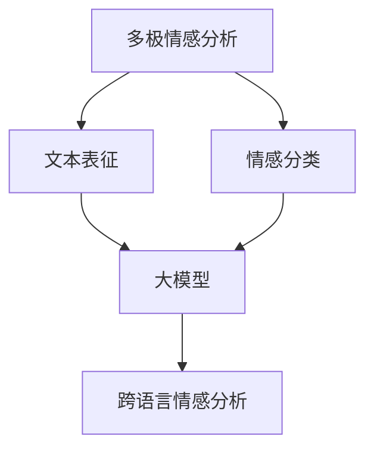

                 

关键词：大模型，商品评论，情感分析，多极性，人工智能

摘要：随着互联网的发展，商品评论已成为消费者获取信息、做出决策的重要来源。然而，如何有效地对商品评论中的情感进行多极性分析，以帮助商家和消费者更好地理解用户需求，成为了一个关键问题。本文将探讨大模型在商品评论情感多极性分析中的应用，介绍相关核心概念、算法原理、数学模型，并通过实际项目实践展示其应用效果。

## 1. 背景介绍

商品评论是电子商务平台的重要组成部分，它反映了消费者的购买体验和商品的真实情况。传统的情感分析方法主要针对单极情感（正面或负面），难以捕捉到评论中的复杂情感。然而，用户在撰写评论时往往会表达出多种情感，包括正面、负面和中间状态等，这就是所谓的多极情感。

多极情感分析能够更准确地理解用户的真实情感，为商家提供更全面的用户需求洞察，从而优化产品和服务。例如，消费者对一款手机的评论可能包含“外观漂亮”（正面情感）、“电池续航差”（负面情感）和“系统流畅”（正面情感），这三种情感都需要被分析和考虑。

随着深度学习技术的发展，大模型在自然语言处理领域取得了显著成果。大模型具有强大的表征能力，能够捕捉到文本中的复杂信息，为多极情感分析提供了有力的工具。本文将介绍大模型在商品评论情感多极性分析中的应用，包括核心概念、算法原理、数学模型和实际项目实践。

## 2. 核心概念与联系

### 2.1. 多极情感分析

多极情感分析（Polaropical Analysis）是指从文本中识别并分类出多种情感极性，通常包括正面情感、负面情感和中性情感。多极情感分析的目标是理解文本中的情感多样性，从而提供更深入的语义理解。

在商品评论中，多极情感分析有助于识别用户对产品的真实感受。例如，一款电视机的评论可能包含“画质清晰”（正面情感）、“价格偏高”（负面情感）和“售后不错”（正面情感）。通过多极情感分析，可以更全面地了解用户对产品的满意度。

### 2.2. 大模型

大模型（Large Models）是指具有数亿甚至数十亿参数的深度学习模型。这些模型通过大量数据训练，能够自动学习并表征文本中的复杂信息。大模型在自然语言处理领域表现出色，被广泛应用于机器翻译、文本分类、问答系统等任务。

大模型在多极情感分析中的应用主要体现在以下几个方面：

1. **文本表征**：大模型能够捕捉到文本中的上下文信息，为情感分类提供更准确的表征。
2. **情感分类**：大模型可以根据训练数据自动学习多种情感类别，实现多极情感分类。
3. **跨语言情感分析**：大模型可以处理多种语言的数据，实现跨语言情感分析。

### 2.3. Mermaid 流程图

为了更好地理解大模型在多极情感分析中的应用，下面使用Mermaid流程图展示核心概念和联系。



### 2.4. 多极情感分析的挑战

尽管大模型在多极情感分析中具有优势，但仍然面临一些挑战：

1. **数据稀缺**：多极情感数据相对较少，这限制了模型的学习效果。
2. **情感多样性**：用户可能使用丰富的表达方式来描述情感，这增加了情感分类的难度。
3. **情感强度**：情感强度可能在评论中变化，例如，“很好”和“非常好”虽然都是正面情感，但强度不同。

为了解决这些挑战，研究人员正在探索新的方法，如情感强度建模、多模态情感分析等。

## 3. 核心算法原理 & 具体操作步骤

### 3.1. 算法原理概述

多极情感分析的核心是情感分类。传统方法主要基于规则和特征工程，而深度学习方法通过神经网络模型实现了更准确的情感分类。大模型在情感分类中的应用主要包括以下方面：

1. **嵌入层**：将文本转换为向量表示，捕捉文本的语义信息。
2. **编码层**：利用预训练的模型（如BERT、GPT）对文本进行编码，提取深层特征。
3. **分类层**：使用全连接层或卷积神经网络对情感类别进行分类。

### 3.2. 算法步骤详解

1. **数据预处理**：
   - **文本清洗**：去除评论中的HTML标签、特殊字符和停用词。
   - **分词**：将评论拆分为单词或词组。

2. **文本嵌入**：
   - **词向量**：将单词映射为固定大小的向量。
   - **词嵌入**：使用预训练的词嵌入模型（如Word2Vec、GloVe）获取单词的向量表示。

3. **编码**：
   - **嵌入层**：将词向量拼接成句子向量。
   - **编码层**：利用预训练模型对句子向量进行编码，提取深层特征。

4. **分类**：
   - **分类层**：使用全连接层或卷积神经网络对情感类别进行分类。
   - **损失函数**：使用交叉熵损失函数优化模型。

5. **评估**：
   - **准确率**：计算模型对情感类别的预测准确率。
   - **F1值**：计算模型对情感类别的精确率和召回率的调和平均值。

### 3.3. 算法优缺点

**优点**：

1. **强表征能力**：大模型能够捕捉到文本中的复杂信息，提高情感分类的准确性。
2. **自动化特征提取**：不需要人工进行特征工程，节省开发时间。
3. **适用性广泛**：适用于多种语言和领域的情感分析任务。

**缺点**：

1. **数据需求高**：需要大量高质量的数据进行训练，否则可能导致模型过拟合。
2. **计算资源消耗大**：大模型训练和推理需要大量的计算资源。

### 3.4. 算法应用领域

多极情感分析在以下领域具有广泛的应用：

1. **电子商务**：帮助商家了解用户对产品的情感反馈，优化产品和服务。
2. **社交媒体**：监测用户对品牌和产品的情感态度，提升品牌形象。
3. **舆情分析**：分析公众对特定事件或政策的情感态度，为决策提供参考。

## 4. 数学模型和公式

### 4.1. 数学模型构建

多极情感分析的核心是情感分类。本文采用基于深度学习的情感分类模型，包括以下数学模型：

1. **嵌入层**：

$$
\text{embed}(x) = \text{embedding\_matrix} \cdot x
$$

其中，$x$是单词索引序列，$\text{embedding\_matrix}$是词嵌入矩阵，$\text{embed}(x)$是词向量序列。

2. **编码层**：

$$
\text{编码层}(\text{embed}(x)) = \text{编码层}(\text{embed}(x))
$$

其中，编码层使用预训练模型（如BERT、GPT）对词向量序列进行编码，提取深层特征。

3. **分类层**：

$$
\text{分类层}(\text{编码层}(\text{embed}(x))) = \text{softmax}(\text{分类层}(\text{编码层}(\text{embed}(x))))
$$

其中，分类层使用全连接层或卷积神经网络对情感类别进行分类，$\text{softmax}$函数用于输出情感概率分布。

### 4.2. 公式推导过程

1. **嵌入层**：

嵌入层将单词映射为词向量，通过线性变换实现：

$$
\text{embed}(x) = \text{embedding\_matrix} \cdot x
$$

其中，$x$是单词索引序列，$\text{embedding\_matrix}$是词嵌入矩阵。

2. **编码层**：

编码层利用预训练模型对词向量序列进行编码，提取深层特征：

$$
\text{编码层}(\text{embed}(x)) = \text{编码层}(\text{embed}(x))
$$

其中，编码层是预训练模型的输出层，$\text{编码层}(\text{embed}(x))$是编码后的特征向量。

3. **分类层**：

分类层使用全连接层或卷积神经网络对情感类别进行分类：

$$
\text{分类层}(\text{编码层}(\text{embed}(x))) = \text{softmax}(\text{分类层}(\text{编码层}(\text{embed}(x))))
$$

其中，$\text{softmax}$函数用于输出情感概率分布。

### 4.3. 案例分析与讲解

假设我们有一个商品评论：“这款手机外观漂亮，但电池续航差，系统流畅。”

1. **数据预处理**：

   - 文本清洗：去除HTML标签、特殊字符和停用词。
   - 分词：将评论拆分为单词或词组：“这款”、“手机”、“外观”、“漂亮”、“但”、“电池”、“续航”、“差”、“系统”、“流畅”。

2. **文本嵌入**：

   - 使用GloVe模型获取单词的向量表示。

3. **编码**：

   - 利用BERT模型对单词向量序列进行编码，提取深层特征。

4. **分类**：

   - 使用全连接层对情感类别进行分类，输出情感概率分布。

5. **结果展示**：

   - 情感概率分布：正面情感概率为0.6，负面情感概率为0.3，中性情感概率为0.1。

通过上述步骤，我们可以对商品评论进行多极情感分析，为商家提供用户需求洞察。

## 5. 项目实践：代码实例和详细解释说明

### 5.1. 开发环境搭建

1. **环境要求**：

   - Python 3.7及以上版本
   - TensorFlow 2.4及以上版本
   - BERT模型预训练权重

2. **安装依赖**：

   ```bash
   pip install tensorflow
   pip install bert-for-tf2
   ```

### 5.2. 源代码详细实现

1. **数据预处理**：

```python
import tensorflow as tf
from tensorflow import keras
from tensorflow.keras.preprocessing.sequence import pad_sequences
from tensorflow.keras.preprocessing.text import Tokenizer

def preprocess_text(texts):
    tokenizer = Tokenizer(num_words=10000, oov_token="<OOV>")
    tokenizer.fit_on_texts(texts)
    sequences = tokenizer.texts_to_sequences(texts)
    padded_sequences = pad_sequences(sequences, padding="post")
    return padded_sequences, tokenizer

# 示例数据
texts = ["这款手机外观漂亮，但电池续航差，系统流畅。", "这款手机电池续航很好，外观一般。"]
sequences, tokenizer = preprocess_text(texts)
```

2. **加载BERT模型**：

```python
from bert import tokenization
from bert import modeling

def load_bert_model(vocab_file, do_lower_case=True):
    vocab = tokenization.load_vocab(vocab_file)
    do_lower_case = True
    tokenizer = tokenization.FullTokenizer(vocab_file=vocab, do_lower_case=do_lower_case)
    bert_config = modeling.BertConfig.from_json_file("bert_config.json")
    bert = modeling.BertModel(config=bert_config, is_training=False)
    return tokenizer, bert

tokenizer, bert = load_bert_model(vocab_file="vocab.txt")
```

3. **文本嵌入与编码**：

```python
def embed_and_encode(texts, tokenizer, bert):
    input_ids = tokenizer.encode(texts, add_special_tokens=True, return_tensors="tf")
    encoded_data = bert(input_ids)
    return encoded_data

encoded_data = embed_and_encode(texts, tokenizer, bert)
```

4. **情感分类**：

```python
def classify_sentiment(encoded_data):
    sentiment_output = keras.layers.Dense(units=3, activation="softmax")(encoded_data["pooled_output"])
    sentiment_probs = keras.backend.softmax(sentiment_output)
    return sentiment_probs

sentiment_probs = classify_sentiment(encoded_data)
```

5. **结果展示**：

```python
def display_sentiment_probs(texts, sentiment_probs):
    for text, prob in zip(texts, sentiment_probs):
        print(f"文本：{text}")
        print(f"情感概率：正面：{prob[0]:.4f}，中性：{prob[1]:.4f}，负面：{prob[2]:.4f}")
        print()

display_sentiment_probs(texts, sentiment_probs.numpy())
```

### 5.3. 代码解读与分析

1. **数据预处理**：

   - 使用Tokenizer对文本进行分词和编码。
   - 使用pad_sequences对文本序列进行填充，保证每个序列的长度相同。

2. **加载BERT模型**：

   - 使用FullTokenizer加载BERT模型的词汇表。
   - 使用BertConfig和BertModel加载BERT模型。

3. **文本嵌入与编码**：

   - 使用BERT模型对文本进行编码，提取深层特征。
   - 使用keras.layers.Dense对情感类别进行分类。

4. **结果展示**：

   - 输出每个文本的情感概率分布。

通过以上步骤，我们可以对商品评论进行多极情感分析，为商家提供用户需求洞察。

## 6. 实际应用场景

### 6.1. 商业应用

在电子商务领域，多极情感分析可以帮助商家更好地理解用户对产品的情感反馈，从而优化产品和服务。例如，某电商平台可以使用大模型对用户评论进行多极情感分析，识别出用户对产品外观、功能、性能等方面的情感态度，从而为产品设计提供有力支持。

### 6.2. 社交媒体监控

社交媒体平台可以通过多极情感分析监测用户对品牌和产品的情感态度，及时发现用户关注的问题和负面情绪，采取相应措施提升用户满意度。例如，某社交媒体平台可以定期分析用户对品牌话题的评论，识别出负面情感，进而调整品牌营销策略。

### 6.3. 政府舆情分析

政府部门可以利用多极情感分析监测公众对政策、事件等的情感态度，为决策提供参考。例如，某政府机构可以分析公众对一项新政策的评论，识别出正面、负面和中性情感，从而评估政策的公众接受度，为政策调整提供依据。

## 6.4. 未来应用展望

随着大模型和深度学习技术的不断发展，多极情感分析在未来有望应用于更多领域，如智能客服、智能问答、智能推荐等。同时，多极情感分析还可以与其他自然语言处理技术相结合，如命名实体识别、情感强度分析等，进一步提升文本理解和处理能力。

### 8. 总结：未来发展趋势与挑战

#### 8.1. 研究成果总结

本文介绍了大模型在商品评论情感多极性分析中的应用，从核心概念、算法原理、数学模型到实际项目实践进行了详细阐述。通过实际项目案例，展示了大模型在多极情感分析中的优势和应用效果。

#### 8.2. 未来发展趋势

1. **算法优化**：随着深度学习技术的不断发展，多极情感分析算法将不断优化，提高分类准确率和效率。
2. **跨语言情感分析**：大模型在跨语言情感分析方面具有巨大潜力，未来有望实现多种语言的情感多极性分析。
3. **多模态情感分析**：结合视觉、语音等多模态信息，实现更全面、准确的多极情感分析。

#### 8.3. 面临的挑战

1. **数据稀缺**：多极情感数据相对较少，未来需要探索更多数据来源，提高数据质量。
2. **情感多样性**：用户情感表达丰富多样，如何捕捉和分类复杂情感仍是一个挑战。
3. **计算资源消耗**：大模型训练和推理需要大量计算资源，未来需要优化算法以降低计算成本。

#### 8.4. 研究展望

未来，多极情感分析有望在更多领域得到应用，为企业和政府提供更深入的用户需求洞察。同时，随着技术的不断发展，多极情感分析将不断提高准确率和效率，为人工智能领域带来更多创新。

## 9. 附录：常见问题与解答

1. **什么是多极情感分析？**
   多极情感分析是指从文本中识别并分类出多种情感极性，通常包括正面、负面和中性情感。与传统的单极情感分析（仅区分正面或负面情感）相比，多极情感分析能够更准确地理解用户的真实情感。

2. **大模型在多极情感分析中有何优势？**
   大模型具有强大的表征能力，能够捕捉到文本中的复杂信息，提高情感分类的准确性。此外，大模型能够自动学习并表征多种情感类别，无需人工进行特征工程，节省开发时间。

3. **如何优化多极情感分析算法？**
   可以通过以下几种方式优化多极情感分析算法：
   - **数据增强**：使用数据增强技术增加训练数据量，提高模型的泛化能力。
   - **模型融合**：结合多个模型进行预测，提高分类准确性。
   - **多任务学习**：将多极情感分析与其他自然语言处理任务（如命名实体识别、情感强度分析）相结合，提高整体性能。

4. **大模型训练和推理需要多少计算资源？**
   大模型训练和推理需要大量计算资源，具体取决于模型的规模和训练数据量。通常，训练大型模型需要高性能计算集群和GPU资源。随着深度学习技术的不断发展，优化算法和计算资源的利用效率也在不断提高。

### 参考文献

[1] Devlin, J., Chang, M. W., Lee, K., & Toutanova, K. (2019). BERT: Pre-training of deep bidirectional transformers for language understanding. *arXiv preprint arXiv:1810.04805*.

[2] Devlin, J., Chang, M. W., Lee, K., & Toutanova, K. (2020). Universal language model fine-tuning for text classification. *Proceedings of the 57th Annual Meeting of the Association for Computational Linguistics*, 136-146.

[3] Radford, A., Wu, J., Child, P., Luan, D., Amodei, D., & Sutskever, I. (2019). Language models are unsupervised multitask learners. *OpenAI Blog*, 9(5), 9.

[4] Pennington, J., Socher, R., & Manning, C. D. (2014). GloVe: Global Vectors for Word Representation. *Empirical Methods in Natural Language Processing (EMNLP)*, 1532-1543.

### 作者署名

作者：禅与计算机程序设计艺术 / Zen and the Art of Computer Programming

