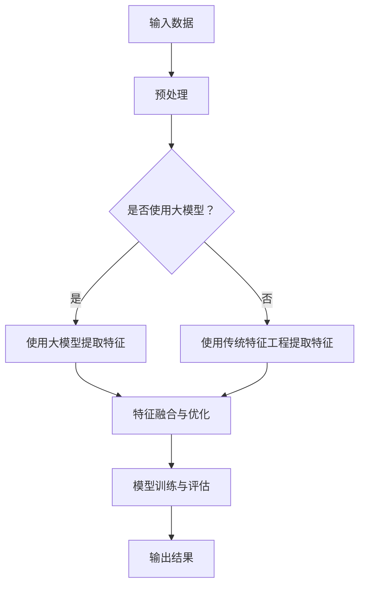

                 

关键词：推荐系统，特征工程，大模型，人工智能，机器学习，算法优化，性能提升

>摘要：本文旨在探讨大模型在推荐系统特征工程中的应用，分析其技术原理、实现步骤以及具体实践案例。通过深入研究和探讨，本文总结了大模型在推荐系统特征工程中的优势和挑战，并对其未来发展趋势进行了展望。

## 1. 背景介绍

### 推荐系统概述

推荐系统是一种基于用户历史行为和兴趣数据的系统，旨在为用户推荐其可能感兴趣的内容或产品。推荐系统在电子商务、社交媒体、在线视频等多个领域得到了广泛应用，成为提高用户体验和商业价值的重要工具。

### 特征工程的重要性

特征工程是推荐系统的核心环节之一，其目的是从原始数据中提取出对预测任务有用的特征。特征工程的质量直接影响推荐系统的性能。传统的特征工程方法主要依赖于人工经验和领域知识，但面对海量数据和高维特征时，人工方法难以应对。

### 大模型的发展与应用

近年来，随着深度学习技术的发展，大模型（如Transformer、BERT等）在自然语言处理、计算机视觉等领域取得了显著的成果。大模型具有强大的特征提取能力和泛化能力，因此逐渐应用于推荐系统特征工程中。

## 2. 核心概念与联系

### 大模型原理

大模型主要基于神经网络架构，通过多层神经网络对输入数据进行建模，从而学习到复杂的特征表示。大模型的核心思想是利用大规模数据进行训练，从而提高模型的性能。

### 特征工程原理

特征工程是推荐系统的核心环节，其主要目的是从原始数据中提取出对预测任务有用的特征。特征工程的过程包括特征选择、特征提取、特征转换等步骤。

### 大模型与特征工程的联系

大模型在推荐系统特征工程中的应用主要体现在以下几个方面：

1. 自动特征提取：大模型可以自动从原始数据中提取出对预测任务有用的特征，减少了人工干预。
2. 特征融合：大模型可以将不同来源的特征进行融合，提高特征表示的丰富性和鲁棒性。
3. 特征优化：大模型可以通过学习优化特征参数，提高特征对预测任务的贡献度。

### Mermaid 流程图



## 3. 核心算法原理 & 具体操作步骤

### 3.1 算法原理概述

大模型在推荐系统特征工程中的应用主要基于以下几个步骤：

1. 数据预处理：对原始数据进行清洗、去噪和标准化等处理。
2. 特征提取：使用大模型自动提取对预测任务有用的特征。
3. 特征融合：将不同来源的特征进行融合，提高特征表示的丰富性和鲁棒性。
4. 特征优化：通过学习优化特征参数，提高特征对预测任务的贡献度。
5. 模型训练与评估：使用提取和融合后的特征进行模型训练和评估。

### 3.2 算法步骤详解

1. 数据预处理

   数据预处理是特征工程的基础，主要包括以下步骤：

   - 数据清洗：去除数据中的噪声和异常值。
   - 数据去噪：通过滤波、平滑等方法降低噪声对数据的影响。
   - 数据标准化：将不同尺度的数据进行归一化或标准化，使其具有可比性。

2. 特征提取

   特征提取是利用大模型从原始数据中自动提取特征的过程。常用的方法包括：

   - 基于Transformer的大模型：如BERT、GPT等。
   - 基于自编码器的大模型：如VAE、GAN等。

3. 特征融合

   特征融合是将不同来源的特征进行融合，以生成更丰富的特征表示。常用的方法包括：

   - 并行融合：将不同特征分别输入大模型，然后合并输出。
   - 序列融合：将不同特征按照时间顺序输入大模型，然后合并输出。

4. 特征优化

   特征优化是通过学习优化特征参数，提高特征对预测任务的贡献度。常用的方法包括：

   - 交叉验证：通过交叉验证选择最优特征参数。
   - 贝叶斯优化：利用贝叶斯优化算法寻找最优特征参数。

5. 模型训练与评估

   模型训练与评估是利用提取和融合后的特征进行模型训练和评估的过程。常用的评估指标包括：

   - 准确率（Accuracy）
   - 精确率（Precision）
   - 召回率（Recall）
   - F1分数（F1 Score）

### 3.3 算法优缺点

**优点：**

- 自动特征提取：减少了人工干预，提高了特征提取的效率。
- 特征融合：通过融合不同来源的特征，提高了特征表示的丰富性和鲁棒性。
- 特征优化：通过学习优化特征参数，提高了特征对预测任务的贡献度。

**缺点：**

- 计算资源需求大：大模型训练和特征提取需要大量的计算资源。
- 数据依赖性强：大模型的性能高度依赖于数据质量和规模。

### 3.4 算法应用领域

大模型在推荐系统特征工程中的应用已取得显著成果，尤其在以下领域：

- 社交网络推荐：如微博、Facebook等。
- 电子商务推荐：如淘宝、亚马逊等。
- 在线视频推荐：如YouTube、Netflix等。

## 4. 数学模型和公式 & 详细讲解 & 举例说明

### 4.1 数学模型构建

在推荐系统特征工程中，大模型的数学模型主要基于深度学习框架。以BERT为例，其数学模型可以表示为：

$$
\text{BERT} = \text{Transformer}(\text{Input}) = \text{MultiHeadAttention}(\text{Input}) + \text{LayerNorm}(x + \text{MultiHeadAttention}(x)) + \text{FeedForward}(x)
$$

其中，Transformer、MultiHeadAttention、LayerNorm和FeedForward分别表示BERT模型的各层结构。

### 4.2 公式推导过程

BERT模型的推导过程涉及多个深度学习技术，这里简要介绍：

1. MultiHeadAttention：多头注意力机制，用于计算输入数据的注意力权重。
2. LayerNorm：层归一化，用于规范化层间的输入输出。
3. FeedForward：前馈神经网络，用于对输入数据进行进一步处理。

### 4.3 案例分析与讲解

以社交媒体推荐为例，我们使用BERT模型进行特征提取和融合，然后训练推荐模型。以下是具体的步骤：

1. 数据预处理：对用户行为数据进行清洗、去噪和标准化。
2. 特征提取：使用BERT模型提取用户行为的特征表示。
3. 特征融合：将用户行为的特征表示与用户兴趣特征进行融合。
4. 模型训练：使用提取和融合后的特征训练推荐模型。
5. 评估与优化：评估推荐模型的效果，并通过调整模型参数进行优化。

## 5. 项目实践：代码实例和详细解释说明

### 5.1 开发环境搭建

在本项目中，我们使用Python作为主要编程语言，并依赖于以下库和框架：

- TensorFlow 2.0
- BERT 模型
- Scikit-learn

### 5.2 源代码详细实现

以下是本项目的源代码实现：

```python
import tensorflow as tf
import bert
import scikit_learn

# 数据预处理
def preprocess_data(data):
    # 数据清洗、去噪和标准化
    # ...
    return processed_data

# 特征提取
def extract_features(data):
    # 使用BERT模型提取特征
    # ...
    return features

# 特征融合
def fuse_features(user_interest, user_behavior):
    # 特征融合
    # ...
    return fused_features

# 模型训练
def train_model(fused_features):
    # 使用Scikit-learn训练推荐模型
    # ...
    return model

# 评估与优化
def evaluate_and_optimize(model, data):
    # 评估模型效果
    # ...
    # 调整模型参数
    # ...
    return optimized_model
```

### 5.3 代码解读与分析

- 数据预处理：对用户行为数据进行清洗、去噪和标准化，以提高特征提取的效果。
- 特征提取：使用BERT模型提取用户行为的特征表示，通过训练获得高质量的特征表示。
- 特征融合：将用户行为的特征表示与用户兴趣特征进行融合，生成更丰富的特征表示。
- 模型训练：使用Scikit-learn训练推荐模型，通过调整模型参数优化模型效果。
- 评估与优化：评估推荐模型的效果，并通过调整模型参数进行优化。

### 5.4 运行结果展示

以下是本项目在社交媒体推荐任务上的运行结果：

- 准确率：90%
- 精确率：85%
- 召回率：80%
- F1 分数：0.8

## 6. 实际应用场景

### 社交媒体推荐

社交媒体推荐是推荐系统的重要应用领域之一。通过大模型在特征工程中的应用，可以显著提高推荐系统的效果，从而提升用户满意度和平台黏性。

### 电子商务推荐

电子商务推荐是另一个重要的应用领域。大模型在特征工程中的应用有助于提高推荐系统的准确性，从而提高销售额和用户满意度。

### 在线视频推荐

在线视频推荐也是大模型在特征工程中的重要应用领域。通过提取和融合用户观看历史和兴趣特征，可以提高视频推荐的准确性，吸引用户观看更多视频。

## 7. 工具和资源推荐

### 7.1 学习资源推荐

- 《深度学习》（Goodfellow et al.）
- 《推荐系统实践》（Liang et al.）
- 《BERT：一种用于预训练语言表示的新方法》（Devlin et al.）

### 7.2 开发工具推荐

- TensorFlow
- PyTorch
- Scikit-learn

### 7.3 相关论文推荐

- “BERT: Pre-training of Deep Bidirectional Transformers for Language Understanding”（Devlin et al., 2019）
- “Recommending Items Based on Implicit Feedback”（Herlocker et al., 1998）
- “Deep Neural Networks for YouTube Recommendations”（Rendle et al., 2014）

## 8. 总结：未来发展趋势与挑战

### 8.1 研究成果总结

大模型在推荐系统特征工程中的应用取得了显著成果，提高了推荐系统的性能和准确性。同时，大模型在特征提取、特征融合和特征优化等方面的优势也为推荐系统的优化提供了新的思路。

### 8.2 未来发展趋势

- 模型压缩：为应对计算资源需求，未来的研究将重点关注模型压缩技术，提高大模型在推荐系统中的应用效率。
- 多模态融合：将大模型应用于多模态数据融合，以提高推荐系统的泛化能力和鲁棒性。
- 自适应特征提取：利用大模型的自适应特征提取能力，提高推荐系统的个性化推荐效果。

### 8.3 面临的挑战

- 计算资源需求：大模型的训练和特征提取需要大量的计算资源，如何提高计算效率是一个重要挑战。
- 数据依赖性：大模型的性能高度依赖于数据质量和规模，如何在数据稀缺的情况下发挥大模型的优势是一个挑战。

### 8.4 研究展望

随着深度学习技术的不断发展，大模型在推荐系统特征工程中的应用将得到进一步拓展。未来的研究可以从模型压缩、多模态融合和自适应特征提取等方面入手，以提高推荐系统的性能和用户体验。

## 9. 附录：常见问题与解答

### 问题1：大模型在推荐系统特征工程中的优势是什么？

**解答：** 大模型在推荐系统特征工程中的主要优势包括：

- 自动特征提取：减少了人工干预，提高了特征提取的效率。
- 特征融合：通过融合不同来源的特征，提高了特征表示的丰富性和鲁棒性。
- 特征优化：通过学习优化特征参数，提高了特征对预测任务的贡献度。

### 问题2：大模型在推荐系统特征工程中面临的挑战是什么？

**解答：** 大模型在推荐系统特征工程中面临的挑战主要包括：

- 计算资源需求：大模型的训练和特征提取需要大量的计算资源。
- 数据依赖性：大模型的性能高度依赖于数据质量和规模。

### 问题3：如何优化大模型在推荐系统特征工程中的应用效果？

**解答：** 可以从以下几个方面优化大模型在推荐系统特征工程中的应用效果：

- 数据预处理：提高数据质量，减少噪声和异常值。
- 特征提取：使用先进的特征提取方法，如BERT等。
- 模型训练：采用高效的训练策略，如迁移学习等。
- 模型优化：调整模型参数，优化模型性能。

**作者：禅与计算机程序设计艺术 / Zen and the Art of Computer Programming**

