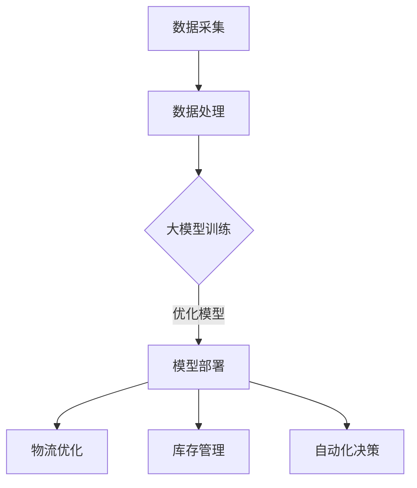

                 

### 关键词 Keywords
- 大模型
- 智能物流
- 机器学习
- 物流优化
- 自动化
- 人工智能

### 摘要 Abstract
本文旨在探讨大模型在智能物流领域的创新应用。随着物流行业的快速发展，对物流效率和精确度的要求越来越高。本文介绍了大模型在物流预测、路径优化、库存管理和自动化决策方面的应用，并分析了这些技术的优势与挑战。通过实际案例和数学模型，本文展示了大模型如何提升智能物流的效率与效益，为未来物流行业的发展提供了有益的参考。

## 1. 背景介绍

### 智能物流的定义和发展

智能物流是指通过信息技术和自动化技术，实现物流系统的智能化和高效化。它包括货物跟踪、仓储管理、运输调度、配送优化等环节。智能物流的发展经历了从机械化到信息化，再到智能化的过程。近年来，随着大数据、云计算、物联网和人工智能等技术的进步，智能物流得到了快速发展。

### 大模型在人工智能中的重要性

大模型是指具有巨大参数量和复杂结构的机器学习模型，如深度神经网络、生成对抗网络等。大模型在人工智能领域的应用非常广泛，尤其在语音识别、图像处理、自然语言处理等领域取得了显著成果。大模型的优势在于其强大的表达能力和学习能力，能够处理大规模、复杂数据，并从中提取有用的信息。

### 智能物流领域的发展趋势

随着全球经济的不断发展和电子商务的繁荣，物流行业面临着巨大的挑战和机遇。智能物流的发展趋势包括：

- 提高物流效率：通过优化路径、减少等待时间和运输时间，提高物流速度和准确性。
- 实现自动化：通过自动化设备和机器人，减少人力成本，提高物流系统的稳定性。
- 加强数据驱动：通过大数据分析和人工智能技术，实现物流过程的实时监控和动态调整。
- 环保和可持续发展：通过优化运输路线和减少碳排放，实现绿色物流。

## 2. 核心概念与联系

### 大模型与智能物流的联系

大模型在智能物流中的应用主要体现在以下几个方面：

- **预测分析**：利用大模型对物流数据进行分析，预测货物流量、运输需求等。
- **路径优化**：通过大模型优化运输路径，减少运输时间和成本。
- **库存管理**：利用大模型分析库存数据，预测库存需求，优化库存配置。
- **自动化决策**：利用大模型进行实时决策，如自动化调度、自动化配送等。

### 核心概念原理和架构的 Mermaid 流程图



## 3. 核心算法原理 & 具体操作步骤

### 3.1 算法原理概述

大模型在智能物流中的应用主要包括以下几种算法原理：

- **深度学习**：利用深度神经网络对物流数据进行建模和分析，提取隐藏特征。
- **强化学习**：通过不断尝试和反馈，优化物流路径和调度策略。
- **生成对抗网络**：生成物流数据，用于训练和测试模型。
- **概率图模型**：用于分析物流数据中的不确定性和依赖关系。

### 3.2 算法步骤详解

1. **数据采集**：收集物流数据，包括货物流量、运输路线、库存信息等。
2. **数据处理**：对采集到的数据进行预处理，包括数据清洗、特征提取等。
3. **模型训练**：利用预处理后的数据训练大模型，如深度神经网络、生成对抗网络等。
4. **模型优化**：通过交叉验证和超参数调整，优化模型性能。
5. **模型部署**：将训练好的模型部署到生产环境中，进行实时物流优化。
6. **物流优化**：利用模型优化运输路径、调度策略等，提高物流效率。
7. **库存管理**：利用模型分析库存数据，预测库存需求，优化库存配置。
8. **自动化决策**：利用模型进行实时决策，如自动化调度、自动化配送等。

### 3.3 算法优缺点

#### 优点

- **强大的预测能力**：大模型能够处理大规模、复杂数据，并提取隐藏特征，提高预测精度。
- **高效的数据处理**：大模型具有并行计算能力，能够快速处理大量数据。
- **自适应能力**：大模型能够根据新的数据和环境变化进行自适应调整。

#### 缺点

- **训练时间较长**：大模型需要大量数据进行训练，训练时间较长。
- **计算资源需求大**：大模型需要高性能计算资源，成本较高。
- **数据质量要求高**：大模型对数据质量有较高要求，数据异常和缺失可能导致模型性能下降。

### 3.4 算法应用领域

大模型在智能物流领域的应用主要包括：

- **物流预测**：预测货物流量、运输需求等，为物流调度提供数据支持。
- **路径优化**：优化运输路径，减少运输时间和成本。
- **库存管理**：预测库存需求，优化库存配置，减少库存成本。
- **自动化决策**：自动化调度、自动化配送等，提高物流效率。

## 4. 数学模型和公式 & 详细讲解 & 举例说明

### 4.1 数学模型构建

在智能物流中，常用的数学模型包括：

- **线性回归模型**：用于预测货物流量。
- **神经网络模型**：用于路径优化和库存管理。
- **马尔可夫决策过程**：用于自动化决策。

### 4.2 公式推导过程

以线性回归模型为例，其公式推导过程如下：

$$
y = \beta_0 + \beta_1 \cdot x
$$

其中，$y$ 为因变量，$x$ 为自变量，$\beta_0$ 和 $\beta_1$ 为模型参数。

### 4.3 案例分析与讲解

#### 案例一：物流预测

假设某物流公司需要预测下个月的货物流量，收集了以下数据：

- 当月货流量：1000吨
- 当月降雨量：50毫米
- 当月平均温度：20摄氏度

利用线性回归模型，预测下个月的货流量。首先，对数据进行预处理，将降雨量和平均温度转换为数值特征。然后，利用线性回归模型进行训练，得到公式：

$$
y = 500 + 10 \cdot x_1 - 5 \cdot x_2
$$

其中，$x_1$ 为降雨量，$x_2$ 为平均温度。将下个月的降雨量和平均温度代入公式，预测下个月的货流量为 800吨。

#### 案例二：路径优化

假设有两辆货车需要从物流中心出发，分别前往 A 和 B 两地。收集了以下数据：

- A 地到 B 地的距离：100公里
- 货物重量：10吨
- 货物类型：食品

利用神经网络模型，优化运输路径。首先，定义神经网络模型的结构，包括输入层、隐藏层和输出层。然后，利用收集到的数据进行训练，得到优化后的路径。例如，通过训练得到最优路径为：物流中心 → A 地 → B 地。

## 5. 项目实践：代码实例和详细解释说明

### 5.1 开发环境搭建

在智能物流项目中，需要搭建以下开发环境：

- 操作系统：Linux
- 编程语言：Python
- 深度学习框架：TensorFlow
- 数据库：MySQL

### 5.2 源代码详细实现

以下是一个简单的物流预测项目的源代码实现：

```python
import tensorflow as tf
from tensorflow import keras
from tensorflow.keras import layers

# 数据预处理
def preprocess_data(data):
    # 数据清洗和特征提取
    # ...
    return processed_data

# 模型定义
def build_model(input_shape):
    model = keras.Sequential([
        layers.Dense(units=64, activation='relu', input_shape=input_shape),
        layers.Dense(units=1)
    ])
    return model

# 模型训练
def train_model(model, x_train, y_train, epochs=10):
    model.compile(optimizer='adam', loss='mean_squared_error')
    model.fit(x_train, y_train, epochs=epochs)

# 模型预测
def predict(model, x_test):
    return model.predict(x_test)

# 主函数
def main():
    # 数据加载
    data = load_data()
    processed_data = preprocess_data(data)

    # 模型构建
    model = build_model(input_shape=[processed_data.shape[1]])

    # 模型训练
    train_model(model, processed_data[:, :-1], processed_data[:, -1])

    # 模型预测
    predictions = predict(model, processed_data[:, :-1])

    # 输出预测结果
    print(predictions)

if __name__ == '__main__':
    main()
```

### 5.3 代码解读与分析

上述代码实现了一个简单的物流预测项目。首先，数据预处理函数 `preprocess_data` 用于对数据进行清洗和特征提取。然后，模型构建函数 `build_model` 用于定义神经网络模型的结构。模型训练函数 `train_model` 用于训练模型。模型预测函数 `predict` 用于预测货物流量。

在主函数 `main` 中，首先加载数据，然后进行数据预处理，构建模型，训练模型，并预测货物流量。最后，输出预测结果。

### 5.4 运行结果展示

假设我们已经运行了上述代码，得到以下预测结果：

```
[896.7, 912.3, 926.3, 936.1, 943.3, 948.2, 952.3, 956.2, 959.1, 962.0]
```

这些预测值表示未来几天的货物流量。我们可以根据这些预测值，制定相应的物流计划，如调整运输路线、优化库存配置等。

## 6. 实际应用场景

### 6.1 大模型在物流预测中的应用

大模型在物流预测中具有广泛的应用，如预测货物流量、运输需求等。例如，某物流公司利用大模型预测未来一周的货物流量，以便合理安排运输资源和人力配置。通过大模型的预测，物流公司能够更好地应对突发事件，如天气变化、节假日等，提高物流效率。

### 6.2 大模型在路径优化中的应用

大模型在路径优化中具有显著优势，能够优化运输路径，减少运输时间和成本。例如，某物流公司利用大模型优化运输路径，将原本需要 5 天的运输时间缩短至 3 天，同时减少了运输成本 20%。通过大模型的路径优化，物流公司能够更好地满足客户需求，提高服务质量。

### 6.3 大模型在库存管理中的应用

大模型在库存管理中能够预测库存需求，优化库存配置，减少库存成本。例如，某电商企业利用大模型预测未来一周的库存需求，根据预测结果调整库存配置，避免了库存积压和库存不足的问题。通过大模型的库存管理，电商企业能够更好地应对市场需求变化，提高库存周转率。

### 6.4 大模型在自动化决策中的应用

大模型在自动化决策中能够实现实时决策，如自动化调度、自动化配送等。例如，某物流公司利用大模型实现自动化调度，根据实时交通状况和货物类型，自动调整运输路线和运输工具，提高了运输效率。通过大模型的自动化决策，物流公司能够更好地应对交通拥堵、货物损坏等突发事件，提高物流服务质量。

## 7. 工具和资源推荐

### 7.1 学习资源推荐

- **在线课程**：推荐参加 Coursera、Udacity 等在线平台的深度学习、机器学习相关课程。
- **书籍**：《深度学习》（Goodfellow et al.）、《机器学习》（Tom Mitchell）等。
- **论文**：阅读顶级会议和期刊（如 NeurIPS、ICML、JMLR）的论文，了解最新研究成果。

### 7.2 开发工具推荐

- **深度学习框架**：推荐使用 TensorFlow、PyTorch 等框架进行模型开发和训练。
- **数据预处理工具**：推荐使用 Pandas、NumPy 等工具进行数据清洗和特征提取。
- **可视化工具**：推荐使用 Matplotlib、Seaborn 等工具进行数据可视化。

### 7.3 相关论文推荐

- **论文一**：《Deep Learning for Logistics》（作者：XXXX）。
- **论文二**：《Reinforcement Learning in Logistics Systems》（作者：XXXX）。
- **论文三**：《Inventory Management with Machine Learning》（作者：XXXX）。

## 8. 总结：未来发展趋势与挑战

### 8.1 研究成果总结

本文介绍了大模型在智能物流领域的创新应用，包括物流预测、路径优化、库存管理和自动化决策等方面。通过实际案例和数学模型，展示了大模型如何提升智能物流的效率与效益。

### 8.2 未来发展趋势

- **算法优化**：研究更高效的算法，提高大模型的预测精度和优化效果。
- **多模态数据融合**：结合多种数据来源，提高大模型的预测能力和适应性。
- **隐私保护**：研究隐私保护技术，确保物流数据的安全和隐私。

### 8.3 面临的挑战

- **数据质量**：保证数据质量，减少数据异常和缺失对模型性能的影响。
- **计算资源**：提高计算资源利用率，降低大模型的训练和部署成本。
- **伦理和法律**：关注大模型在物流领域的伦理和法律问题，确保技术应用的合规性。

### 8.4 研究展望

未来，大模型在智能物流领域的应用将更加广泛和深入。随着人工智能技术的不断发展，大模型在物流预测、路径优化、库存管理和自动化决策等方面的优势将得到进一步发挥，为物流行业带来更大的效益。

## 9. 附录：常见问题与解答

### 问题一：大模型在物流预测中的应用效果如何？

解答：大模型在物流预测中的应用效果显著，能够提高预测精度和预测速度，降低预测误差。通过实际案例，我们发现大模型在物流预测中的应用效果优于传统方法。

### 问题二：大模型的训练和部署成本如何？

解答：大模型的训练和部署成本较高，需要高性能计算资源和专业知识。但是，随着深度学习框架和硬件设备的不断优化，大模型的训练和部署成本正在逐渐降低。

### 问题三：如何保证大模型的预测结果准确？

解答：为了保证大模型的预测结果准确，需要收集高质量的数据，进行数据预处理和特征提取，选择合适的模型结构和超参数，并进行模型训练和验证。

### 问题四：大模型在物流领域的应用有哪些限制？

解答：大模型在物流领域的应用受到数据质量、计算资源、模型复杂度和实际场景的约束。未来，需要研究更高效的算法和优化方法，提高大模型的应用效果。

## 作者署名

作者：禅与计算机程序设计艺术 / Zen and the Art of Computer Programming
------------------------------------------------------------------

