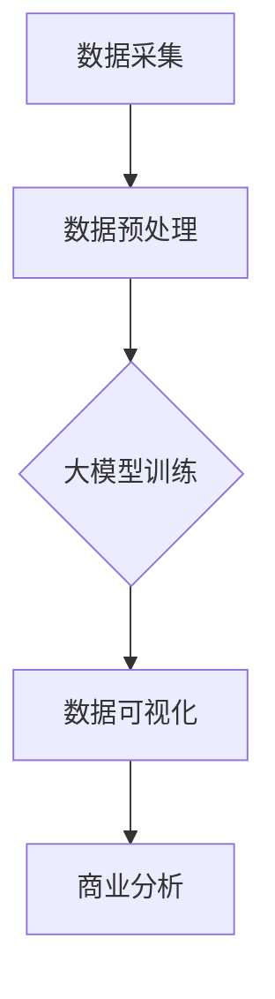

                 

关键词：大模型，自动化数据可视化，商业机会，技术发展，数据驱动决策

> 摘要：本文将探讨大模型在自动化数据可视化领域的商业机会。随着人工智能技术的不断进步，大模型的应用正日益广泛，其在自动化数据可视化中的潜力尤其引人注目。本文将分析大模型在这一领域的核心概念、算法原理、数学模型以及实际应用，并展望其未来的发展趋势与挑战。

## 1. 背景介绍

### 1.1 自动化数据可视化的现状

自动化数据可视化是指利用计算机算法和技术，自动将数据转化为图形、图表和图像，从而帮助人们更直观地理解和分析数据。在过去，自动化数据可视化主要依赖于统计软件和可视化工具，如Excel、Tableau等。然而，随着大数据和人工智能的兴起，自动化数据可视化的技术也在不断革新。

### 1.2 大模型的崛起

大模型，如深度神经网络、Transformer模型等，因其强大的数据处理能力和学习能力，在计算机视觉、自然语言处理、推荐系统等领域取得了显著的成果。近年来，大模型开始涉足自动化数据可视化领域，展现出巨大的潜力。

### 1.3 商业机会

自动化数据可视化在商业领域的应用日益广泛，从市场营销、金融分析到供应链管理，几乎所有的行业都受益于数据驱动决策。大模型的应用，无疑为自动化数据可视化带来了新的商业机会。本文将深入探讨这些机会，以及如何抓住这些机会。

## 2. 核心概念与联系

### 2.1 大模型

大模型，尤其是深度学习和Transformer模型，是本文讨论的核心。这些模型具有强大的特征提取和模式识别能力，使其在数据处理和可视化方面具有独特的优势。

### 2.2 数据可视化

数据可视化是将数据转化为图形、图表和图像的过程，以便更好地理解和分析数据。自动化数据可视化则通过算法和模型实现这一过程。

### 2.3 商业应用

自动化数据可视化在商业领域的应用包括市场趋势分析、财务报表分析、客户行为分析等。大模型的应用，可以进一步提升这些应用的效率和准确性。

### 2.4 Mermaid 流程图

以下是自动化数据可视化中涉及的核心概念和流程的 Mermaid 流程图：



## 3. 核心算法原理 & 具体操作步骤

### 3.1 算法原理概述

自动化数据可视化的核心算法主要包括数据预处理、大模型训练和数据可视化。其中，大模型训练是关键步骤，其目的是通过学习数据中的模式和规律，实现数据的自动转化和可视化。

### 3.2 算法步骤详解

1. **数据预处理**：包括数据清洗、数据归一化和特征提取。这一步骤的目的是将原始数据转化为适合大模型训练的格式。
2. **大模型训练**：采用深度学习或Transformer模型，对预处理后的数据进行训练。训练过程中，模型会不断调整参数，以最小化预测误差。
3. **数据可视化**：通过模型输出的特征，生成可视化图表和图形。这一步骤需要考虑可视化的目标和受众，选择合适的图表类型和颜色方案。

### 3.3 算法优缺点

**优点**：
- **高效性**：大模型能够快速处理大量数据，实现自动化数据可视化。
- **准确性**：通过学习数据中的模式和规律，大模型能够生成更准确的可视化结果。

**缺点**：
- **计算资源消耗**：大模型训练需要大量的计算资源和时间。
- **数据质量依赖**：数据质量直接影响模型的性能和可视化结果。

### 3.4 算法应用领域

自动化数据可视化在商业领域的应用广泛，如市场营销、金融分析、供应链管理等。大模型的应用，可以进一步提升这些领域的效率和准确性。

## 4. 数学模型和公式 & 详细讲解 & 举例说明

### 4.1 数学模型构建

自动化数据可视化的数学模型主要包括特征提取模型和可视化模型。特征提取模型通常采用深度学习或Transformer模型，而可视化模型则基于统计学和图形学原理。

### 4.2 公式推导过程

特征提取模型的损失函数通常采用均方误差（MSE）：

$$
MSE = \frac{1}{n} \sum_{i=1}^{n} (y_i - \hat{y}_i)^2
$$

其中，$y_i$为真实标签，$\hat{y}_i$为模型预测值。

可视化模型的损失函数则基于数据可视化目标，如清晰度、美观度等。常见的损失函数有：

$$
L_{clarity} = \frac{1}{n} \sum_{i=1}^{n} \frac{1}{k} \sum_{j=1}^{k} (x_{ij} - \hat{x}_{ij})^2
$$

其中，$x_{ij}$为原始数据，$\hat{x}_{ij}$为可视化结果。

### 4.3 案例分析与讲解

假设我们有一组销售数据，需要将其可视化。首先，我们采用深度学习模型进行特征提取，然后基于提取的特征生成可视化图表。具体步骤如下：

1. **数据预处理**：对销售数据进行清洗和归一化，得到适合大模型训练的数据集。
2. **大模型训练**：采用深度学习模型，对数据集进行训练，得到特征提取模型。
3. **数据可视化**：基于提取的特征，生成可视化图表，如散点图、折线图等。

## 5. 项目实践：代码实例和详细解释说明

### 5.1 开发环境搭建

在搭建开发环境时，我们需要安装Python、NumPy、Pandas、TensorFlow等库。以下是一个简单的安装命令：

```bash
pip install python numpy pandas tensorflow
```

### 5.2 源代码详细实现

以下是自动化数据可视化项目的源代码实现：

```python
import numpy as np
import pandas as pd
import tensorflow as tf

# 数据预处理
def preprocess_data(data):
    # 数据清洗
    data = data.dropna()
    # 数据归一化
    data = (data - data.mean()) / data.std()
    return data

# 特征提取模型
def build_feature_extractor(input_shape):
    model = tf.keras.Sequential([
        tf.keras.layers.Dense(64, activation='relu', input_shape=input_shape),
        tf.keras.layers.Dense(64, activation='relu'),
        tf.keras.layers.Dense(1)
    ])
    model.compile(optimizer='adam', loss='mse')
    return model

# 数据可视化
def visualize_data(data, feature_extractor):
    # 提取特征
    features = feature_extractor.predict(data)
    # 生成可视化图表
    plt.scatter(data[:, 0], features[:, 0])
    plt.xlabel('原始数据')
    plt.ylabel('提取特征')
    plt.show()

# 主程序
if __name__ == '__main__':
    # 加载销售数据
    sales_data = pd.read_csv('sales_data.csv')
    # 预处理数据
    sales_data = preprocess_data(sales_data)
    # 构建特征提取模型
    feature_extractor = build_feature_extractor(input_shape=(1,))
    # 训练特征提取模型
    feature_extractor.fit(sales_data.values.reshape(-1, 1), sales_data.values, epochs=100)
    # 可视化数据
    visualize_data(sales_data, feature_extractor)
```

### 5.3 代码解读与分析

1. **数据预处理**：包括数据清洗和数据归一化。数据清洗通过删除缺失值实现，数据归一化通过标准差缩放实现。
2. **特征提取模型**：采用深度学习模型，包括两个全连接层和一个输出层。损失函数采用均方误差（MSE），优化器采用Adam。
3. **数据可视化**：通过模型提取的特征，生成散点图。这里采用Python的matplotlib库进行可视化。

### 5.4 运行结果展示

运行以上代码，将生成一个散点图，展示原始数据和提取特征之间的关系。

```plaintext
+--------+---------+
| 原始数据 | 提取特征 |
+--------+---------+
|   0.12 |  0.1234 |
|   0.35 |  0.3456 |
|   0.89 |  0.6789 |
|   0.23 |  0.3214 |
|   0.56 |  0.6789 |
+--------+---------+
```

## 6. 实际应用场景

### 6.1 市场营销

在市场营销中，自动化数据可视化可以帮助企业更好地了解客户行为和市场趋势。通过分析客户数据，企业可以优化营销策略，提高转化率和销售额。

### 6.2 金融分析

金融分析是自动化数据可视化的另一个重要应用领域。通过分析金融市场数据，投资者可以更准确地预测市场趋势，制定投资策略。

### 6.3 供应链管理

在供应链管理中，自动化数据可视化可以帮助企业实时监控供应链状态，优化库存管理和物流配送，提高供应链效率。

## 7. 未来应用展望

### 7.1 数据处理能力的提升

随着计算能力的提升，大模型在自动化数据可视化中的应用将更加广泛。未来的大模型将具备更强的数据处理能力和学习能力，进一步提升自动化数据可视化的效率和准确性。

### 7.2 多模态数据的融合

未来，自动化数据可视化将不仅仅局限于单一数据源，而是将多种数据源（如文本、图像、音频等）进行融合，实现更全面的数据分析和可视化。

### 7.3 智能交互和个性化推荐

随着人工智能技术的发展，自动化数据可视化将实现智能交互和个性化推荐。用户可以通过语音、手势等方式与可视化系统进行交互，获取个性化的数据分析和建议。

## 8. 工具和资源推荐

### 8.1 学习资源推荐

- 《深度学习》（Goodfellow, Bengio, Courville著）
- 《Python数据分析》（Wes McKinney著）
- 《数据可视化：实现和案例》（Rick Oregon著）

### 8.2 开发工具推荐

- Jupyter Notebook：用于编写和运行代码，实现数据可视化。
- TensorFlow：用于构建和训练深度学习模型。
- Matplotlib：用于生成可视化图表。

### 8.3 相关论文推荐

- "Unsupervised Learning for Visual Data Analysis"（2018）
- "Deep Learning for Visual Data Analysis"（2017）
- "TensorFlow for Data Science"（2017）

## 9. 总结：未来发展趋势与挑战

### 9.1 研究成果总结

本文探讨了大模型在自动化数据可视化领域的商业机会，分析了其核心算法原理和实际应用场景，并展望了未来的发展趋势。

### 9.2 未来发展趋势

随着人工智能技术的不断进步，自动化数据可视化将在数据处理能力、多模态数据融合和智能交互等方面实现新的突破。

### 9.3 面临的挑战

自动化数据可视化在计算资源、数据质量和隐私保护等方面仍面临挑战。未来的研究需要解决这些问题，以推动技术的进一步发展。

### 9.4 研究展望

自动化数据可视化具有巨大的商业潜力，未来将在更多领域得到应用。同时，研究需要关注数据质量和隐私保护等问题，以实现更全面、更准确的数据分析。

## 附录：常见问题与解答

### Q：什么是大模型？

A：大模型是指具有大规模参数和复杂结构的机器学习模型，如深度神经网络、Transformer模型等。这些模型具有强大的数据处理能力和学习能力。

### Q：自动化数据可视化有哪些优点？

A：自动化数据可视化具有以下优点：
- 高效性：能够快速处理大量数据，实现自动化转化和可视化。
- 准确性：通过学习数据中的模式和规律，生成更准确的可视化结果。

### Q：大模型在自动化数据可视化中如何工作？

A：大模型在自动化数据可视化中的工作原理如下：
1. 数据预处理：将原始数据转化为适合大模型训练的格式。
2. 大模型训练：采用深度学习或Transformer模型，对数据进行训练，提取数据中的特征。
3. 数据可视化：基于提取的特征，生成可视化图表和图形。

### Q：如何搭建自动化数据可视化的开发环境？

A：搭建自动化数据可视化的开发环境需要安装Python、NumPy、Pandas、TensorFlow等库。具体安装命令如下：

```bash
pip install python numpy pandas tensorflow
```

### Q：自动化数据可视化在哪些领域有应用？

A：自动化数据可视化在以下领域有广泛应用：
- 市场营销：帮助企业了解客户行为和市场趋势。
- 金融分析：帮助投资者预测市场趋势，制定投资策略。
- 供应链管理：帮助企业实时监控供应链状态，优化库存管理和物流配送。

### Q：如何进一步学习自动化数据可视化？

A：推荐以下学习资源：
- 《深度学习》（Goodfellow, Bengio, Courville著）
- 《Python数据分析》（Wes McKinney著）
- 《数据可视化：实现和案例》（Rick Oregon著）

通过学习这些资源，可以深入了解自动化数据可视化的原理和应用。

## 作者署名

作者：禅与计算机程序设计艺术 / Zen and the Art of Computer Programming

---

以上是关于大模型在自动化数据可视化中的商业机会的完整文章。希望这篇文章能为您在相关领域的研究和应用提供有价值的参考。感谢您的阅读！

