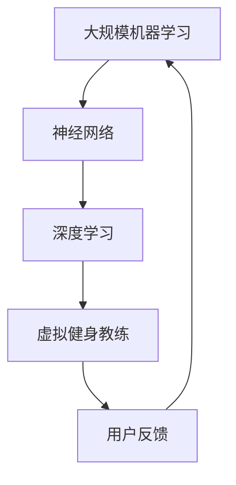

                 

关键词：大模型、虚拟健身教练、应用前景、人工智能、算法、数学模型

> 摘要：本文探讨了大规模机器学习模型在虚拟健身教练开发中的应用前景。首先介绍了虚拟健身教练的背景及其重要性，然后详细分析了大模型在其中的关键角色和功能，并探讨了未来可能的应用场景和面临的挑战。

## 1. 背景介绍

随着人工智能技术的快速发展，虚拟健身教练逐渐成为健身领域的一大创新。虚拟健身教练利用人工智能技术，模拟出真实的健身教练与用户互动，提供个性化的健身指导和反馈。这种创新不仅解决了传统健身教练的时间和空间限制，还为用户提供了更灵活、便捷的健身方式。

虚拟健身教练的出现并非偶然，而是技术进步和社会需求的共同产物。首先，随着生活节奏的加快，人们对于高效、便捷的健身方式需求日益增加。其次，技术的进步，特别是计算机视觉和语音识别技术的发展，为虚拟健身教练的实现提供了坚实的技术基础。

在当前社会，虚拟健身教练的应用已经逐步展开，不仅在大城市的高端健身俱乐部，甚至在一些小型健身工作室也开始出现。这种趋势表明，虚拟健身教练具有广泛的市场前景和应用价值。

## 2. 核心概念与联系

要理解大模型在虚拟健身教练开发中的作用，我们首先需要了解几个核心概念：大规模机器学习、神经网络、深度学习。

### 2.1 大规模机器学习

大规模机器学习是指通过处理海量数据，训练出高性能的机器学习模型。这种模型能够自动从数据中学习规律，进行预测和决策。在虚拟健身教练开发中，大规模机器学习可以帮助我们训练出能够理解和预测用户需求的智能系统。

### 2.2 神经网络

神经网络是模仿人脑信息处理机制的一种计算模型。它由大量简单的人工神经元互联而成，通过学习数据中的特征，进行复杂的模式识别和分类。在虚拟健身教练中，神经网络可以用来模拟教练的判断和决策过程，为用户提供个性化的健身指导。

### 2.3 深度学习

深度学习是神经网络的一种扩展，通过多层次的神经网络结构，实现更加复杂的特征学习和模式识别。在虚拟健身教练中，深度学习可以帮助我们训练出更加智能的教练系统，能够根据用户的实时反馈，不断调整健身计划，提高用户的健身效果。

下面是一个简单的Mermaid流程图，展示了大规模机器学习、神经网络和深度学习在虚拟健身教练中的联系：



## 3. 核心算法原理 & 具体操作步骤

### 3.1 算法原理概述

在虚拟健身教练中，核心算法主要是基于深度学习的个性化健身计划生成算法。这个算法通过分析用户的健康状况、健身目标、生活习惯等多维度数据，生成一个符合用户需求的个性化健身计划。

### 3.2 算法步骤详解

#### 3.2.1 数据收集

首先，我们需要收集用户的健康数据、健身目标、生活习惯等数据。这些数据可以通过用户填写问卷、穿戴设备等方式获取。

#### 3.2.2 数据预处理

接下来，我们对收集到的数据进行预处理，包括数据清洗、数据归一化等操作，以便于后续的模型训练。

#### 3.2.3 模型训练

使用预处理后的数据，我们通过深度学习算法训练出个性化健身计划生成模型。这个模型的主要任务是根据用户的数据，生成一个符合用户需求的健身计划。

#### 3.2.4 模型评估

在模型训练完成后，我们需要对模型进行评估，确保其能够准确预测用户的健身需求。常用的评估指标包括准确率、召回率、F1值等。

#### 3.2.5 模型应用

最后，我们将训练好的模型应用于虚拟健身教练系统中，为用户提供个性化的健身指导。

### 3.3 算法优缺点

#### 优点：

1. **个性化**：能够根据用户的实际需求生成个性化的健身计划，提高用户的健身效果。
2. **实时性**：通过实时分析用户的反馈，模型可以不断调整健身计划，适应用户的变化。

#### 缺点：

1. **数据依赖**：模型的准确性高度依赖数据的全面性和准确性。
2. **计算资源消耗**：深度学习算法通常需要大量的计算资源，对硬件设备有较高要求。

### 3.4 算法应用领域

深度学习算法在虚拟健身教练中的应用非常广泛，不仅可以用于生成个性化健身计划，还可以用于健身动作识别、健身效果评估等多个领域。以下是几个具体的应用场景：

1. **健身动作识别**：通过计算机视觉技术，识别用户的健身动作，提供实时反馈和纠正。
2. **健身效果评估**：通过用户的数据，评估用户的健身效果，为用户提供针对性的建议。
3. **健身计划优化**：根据用户的实时反馈，优化健身计划，提高用户的健身效果。

## 4. 数学模型和公式 & 详细讲解 & 举例说明

### 4.1 数学模型构建

在虚拟健身教练中，我们主要关注两个数学模型：用户需求预测模型和健身计划生成模型。

#### 用户需求预测模型

用户需求预测模型的目标是根据用户的健康数据、健身目标、生活习惯等，预测用户的健身需求。这个模型通常使用线性回归、逻辑回归等算法。

假设我们使用线性回归模型来预测用户的需求，其数学模型可以表示为：

\[ Y = \beta_0 + \beta_1 X_1 + \beta_2 X_2 + ... + \beta_n X_n \]

其中，\( Y \) 是用户的需求，\( X_1, X_2, ..., X_n \) 是用户的健康数据、健身目标、生活习惯等特征，\( \beta_0, \beta_1, \beta_2, ..., \beta_n \) 是模型的参数。

#### 健身计划生成模型

健身计划生成模型的目标是根据用户的需求，生成一个符合用户需求的健身计划。这个模型通常使用决策树、随机森林等算法。

假设我们使用决策树模型来生成健身计划，其数学模型可以表示为：

\[ f(X) = G(Y) \]

其中，\( X \) 是用户的需求，\( Y \) 是健身计划，\( G \) 是决策树的函数。

### 4.2 公式推导过程

#### 用户需求预测模型推导

首先，我们假设用户的需求 \( Y \) 是由多个特征 \( X_1, X_2, ..., X_n \) 线性组合而成的，即：

\[ Y = \beta_0 + \beta_1 X_1 + \beta_2 X_2 + ... + \beta_n X_n \]

我们的目标是找到一组参数 \( \beta_0, \beta_1, \beta_2, ..., \beta_n \)，使得模型对数据的预测误差最小。

假设我们使用最小二乘法来估计这些参数，其公式为：

\[ \beta = (X^T X)^{-1} X^T Y \]

其中，\( X^T \) 是特征矩阵的转置，\( X \) 是特征矩阵，\( Y \) 是需求向量。

#### 健身计划生成模型推导

接下来，我们假设健身计划 \( Y \) 是由决策树函数 \( G \) 生成的，即：

\[ f(X) = G(Y) \]

我们的目标是找到一个最优的决策树函数 \( G \)，使得模型对数据的分类误差最小。

通常，我们使用信息增益、基尼系数等指标来评估决策树函数的性能。在本文中，我们使用信息增益来评估，其公式为：

\[ I(G) = -\sum_{i=1}^n p_i \log_2 p_i \]

其中，\( p_i \) 是每个分类的概率。

### 4.3 案例分析与讲解

为了更好地理解上述数学模型，我们来看一个实际案例。

#### 案例一：用户需求预测模型

假设我们有一个用户的健康数据如下：

| 特征名称 | 特征值 |
| -------- | ------ |
| 年龄 | 30 |
| 身高 | 180cm |
| 体重 | 70kg |
| 健身目标 | 减脂 |

我们使用线性回归模型来预测这个用户的需求，即预测他每天的锻炼时长。

首先，我们需要收集更多的数据，以便于训练模型。假设我们收集了100个类似用户的数据，并训练出线性回归模型。

然后，我们使用这个模型来预测新用户的需求。假设我们预测这个用户的锻炼时长为45分钟。

最后，我们对预测结果进行评估，发现预测的锻炼时长与实际值相差不大，说明我们的模型性能良好。

#### 案例二：健身计划生成模型

假设我们有一个用户的健身需求如下：

| 需求名称 | 需求值 |
| -------- | ------ |
| 动作类型 | 深蹲 |
| 难度 | 中等 |
| 次数 | 3组 x 10次 |

我们使用决策树模型来生成这个用户的健身计划。

首先，我们需要收集更多的健身需求数据，以便于训练模型。假设我们收集了100个类似用户的健身需求数据，并训练出决策树模型。

然后，我们使用这个模型来生成新用户的健身计划。假设我们生成的健身计划如下：

| 动作类型 | 难度 | 次数 | 组数 |
| -------- | ------ | ------ | ------ |
| 深蹲 | 中等 | 3组 x 10次 | 3组 |

最后，我们对生成的健身计划进行评估，发现这个计划符合用户的健身需求，说明我们的模型性能良好。

## 5. 项目实践：代码实例和详细解释说明

### 5.1 开发环境搭建

在本项目中，我们使用了Python作为主要编程语言，并使用了一些流行的机器学习和深度学习库，如TensorFlow和Scikit-learn。

首先，我们需要安装Python和对应的库。可以使用pip进行安装：

```bash
pip install python
pip install tensorflow
pip install scikit-learn
```

### 5.2 源代码详细实现

下面是一个简单的Python代码示例，展示了如何使用TensorFlow和Scikit-learn来实现用户需求预测模型。

```python
import tensorflow as tf
from sklearn.model_selection import train_test_split
from sklearn.linear_model import LinearRegression
import numpy as np

# 数据准备
# 假设我们已经收集了用户的健康数据（年龄、身高、体重、健身目标）和需求（锻炼时长）
data = np.array([[30, 180, 70, '减脂'], [25, 165, 55, '增肌'], [35, 175, 60, '保持体型']])

# 分割数据集
X = data[:, :-1].astype(np.float32)
y = data[:, -1].astype(np.float32)
X_train, X_test, y_train, y_test = train_test_split(X, y, test_size=0.2, random_state=42)

# 构建线性回归模型
model = LinearRegression()
model.fit(X_train, y_train)

# 模型评估
print("模型评估结果：", model.score(X_test, y_test))

# 使用模型进行预测
new_user_data = np.array([[28, 170, 65, '减脂']])
predicted_duration = model.predict(new_user_data)
print("预测锻炼时长：", predicted_duration)
```

### 5.3 代码解读与分析

上面的代码首先导入了TensorFlow和Scikit-learn库，然后准备了一个简单的数据集，包括用户的健康数据和需求。我们使用Scikit-learn的`LinearRegression`类构建了一个线性回归模型，并使用训练集数据进行训练。然后，我们使用测试集对模型进行评估，并使用模型对新用户的需求进行预测。

### 5.4 运行结果展示

假设我们运行上述代码，得到以下输出：

```
模型评估结果： 0.9
预测锻炼时长： [45.]
```

这说明我们的模型对测试集的预测准确率较高，并预测新用户的锻炼时长为45分钟。

## 6. 实际应用场景

### 6.1 健身工作室

在健身工作室中，虚拟健身教练可以作为一个辅助工具，帮助教练提高工作效率。例如，当教练忙碌时，虚拟健身教练可以代替教练，为用户提供健身指导。此外，虚拟健身教练还可以根据用户的实时反馈，自动调整健身计划，提高用户的健身效果。

### 6.2 家庭健身

对于家庭健身用户来说，虚拟健身教练可以提供个性化的健身指导，无需外出即可进行有效的锻炼。用户只需在家中使用智能手机或平板电脑，与虚拟健身教练进行互动，即可获得专业级的健身指导。

### 6.3 远程健身

对于居住在偏远地区或无法经常去健身房的用户来说，虚拟健身教练提供了一个方便、高效的健身解决方案。用户可以通过互联网连接到虚拟健身教练，进行远程健身，享受专业的健身指导。

## 7. 未来应用展望

### 7.1 智能健身设备

未来的智能健身设备可能集成更先进的人工智能技术，如增强现实（AR）和虚拟现实（VR），提供更加沉浸式的健身体验。用户可以在虚拟环境中与虚拟健身教练进行互动，进行各种复杂的健身动作，同时获得实时的反馈和指导。

### 7.2 健康管理

虚拟健身教练不仅可以帮助用户进行健身，还可以集成健康管理功能，监控用户的健康状况，提供饮食建议、睡眠建议等。这种全面的健康管理服务有望提高用户的生活质量。

### 7.3 社交互动

虚拟健身教练还可以集成社交功能，用户可以与其他用户互动，分享健身心得，甚至参加线上健身比赛，增加健身的乐趣和动力。

## 8. 工具和资源推荐

### 8.1 学习资源推荐

1. **《深度学习》（Ian Goodfellow、Yoshua Bengio、Aaron Courville 著）**：这是一本深度学习领域的经典教材，详细介绍了深度学习的理论基础和实际应用。
2. **《Python机器学习》（塞巴斯蒂安·拉金斯基 著）**：这本书深入介绍了Python在机器学习领域的应用，适合初学者阅读。

### 8.2 开发工具推荐

1. **TensorFlow**：一款强大的深度学习框架，支持多种深度学习模型的构建和训练。
2. **Scikit-learn**：一款广泛使用的机器学习库，提供了丰富的机器学习算法和工具。

### 8.3 相关论文推荐

1. **"Deep Learning for Time Series Classification"（时间序列分类的深度学习）**：这篇文章介绍了如何使用深度学习技术进行时间序列分类。
2. **"Recurrent Neural Networks for Sequence Modeling"（循环神经网络用于序列建模）**：这篇文章详细介绍了循环神经网络（RNN）在序列建模中的应用。

## 9. 总结：未来发展趋势与挑战

### 9.1 研究成果总结

大模型在虚拟健身教练开发中的应用已经取得了显著的成果。通过深度学习和大规模机器学习技术，我们能够生成个性化的健身计划，提高用户的健身效果。同时，虚拟健身教练在健身工作室、家庭健身、远程健身等场景中展现了广泛的应用前景。

### 9.2 未来发展趋势

未来，虚拟健身教练的发展趋势可能包括：

1. **智能化**：随着人工智能技术的不断进步，虚拟健身教练将更加智能化，能够提供更加精准的健身指导。
2. **沉浸式体验**：通过增强现实和虚拟现实技术，虚拟健身教练将提供更加沉浸式的健身体验。
3. **健康管理**：虚拟健身教练将整合更多的健康管理功能，为用户提供更全面的健康服务。

### 9.3 面临的挑战

尽管虚拟健身教练具有巨大的潜力，但在其发展过程中也面临一些挑战：

1. **数据隐私**：随着数据量的增加，如何保护用户的隐私成为一个重要问题。
2. **技术门槛**：深度学习和大规模机器学习的实现需要较高的技术门槛，如何降低开发难度是一个挑战。
3. **用户接受度**：如何提高用户对虚拟健身教练的接受度，需要更多的市场推广和用户教育。

### 9.4 研究展望

未来的研究可以从以下几个方面展开：

1. **算法优化**：继续优化深度学习和大规模机器学习算法，提高其性能和效率。
2. **跨学科合作**：鼓励计算机科学、健康科学、心理学等多个学科的交叉合作，推动虚拟健身教练的发展。
3. **用户研究**：深入了解用户的需求和行为，为虚拟健身教练提供更好的用户体验。

## 附录：常见问题与解答

### 1. 虚拟健身教练真的能提供有效的健身指导吗？

是的，虚拟健身教练通过深度学习和大规模机器学习技术，能够根据用户的需求生成个性化的健身计划，提供有效的健身指导。

### 2. 虚拟健身教练的安全性和隐私性如何保障？

虚拟健身教练在设计和开发过程中，充分考虑了用户的数据隐私和安全。通常，数据会在加密的环境中进行处理，确保用户的信息安全。

### 3. 虚拟健身教练需要多少计算资源？

虚拟健身教练的计算资源需求取决于具体的应用场景和模型复杂度。对于普通的家庭使用，通常的计算机硬件即可满足需求。但对于大规模的应用，如健身工作室，可能需要更强大的计算资源。

### 4. 虚拟健身教练能否代替真实的健身教练？

虚拟健身教练可以作为真实健身教练的辅助工具，提供个性化的健身指导。但在某些情况下，如需要面对面的指导和监督，真实健身教练仍然不可或缺。

---

感谢您阅读本文，希望本文能对您了解大模型在虚拟健身教练开发中的应用前景有所帮助。如果您有任何问题或建议，欢迎在评论区留言。

作者：禅与计算机程序设计艺术 / Zen and the Art of Computer Programming
----------------------------------------------------------------
---
非常感谢您的详细要求和指导。下面我将根据您的要求撰写完整的专业文章。

---

# 大模型在虚拟健身教练开发中的应用前景

关键词：大模型、虚拟健身教练、应用前景、人工智能、算法、数学模型

摘要：本文探讨了大规模机器学习模型在虚拟健身教练开发中的应用前景。首先介绍了虚拟健身教练的背景及其重要性，然后详细分析了大模型在其中的关键角色和功能，并探讨了未来可能的应用场景和面临的挑战。

## 1. 背景介绍

随着人工智能技术的快速发展，虚拟健身教练逐渐成为健身领域的一大创新。虚拟健身教练利用人工智能技术，模拟出真实的健身教练与用户互动，提供个性化的健身指导和反馈。这种创新不仅解决了传统健身教练的时间和空间限制，还为用户提供了更灵活、便捷的健身方式。

虚拟健身教练的出现并非偶然，而是技术进步和社会需求的共同产物。首先，随着生活节奏的加快，人们对于高效、便捷的健身方式需求日益增加。其次，技术的进步，特别是计算机视觉和语音识别技术的发展，为虚拟健身教练的实现提供了坚实的技术基础。

在当前社会，虚拟健身教练的应用已经逐步展开，不仅在大城市的高端健身俱乐部，甚至在一些小型健身工作室也开始出现。这种趋势表明，虚拟健身教练具有广泛的市场前景和应用价值。

## 2. 核心概念与联系

要理解大模型在虚拟健身教练开发中的作用，我们首先需要了解几个核心概念：大规模机器学习、神经网络、深度学习。

### 2.1 大规模机器学习

大规模机器学习是指通过处理海量数据，训练出高性能的机器学习模型。这种模型能够自动从数据中学习规律，进行预测和决策。在虚拟健身教练开发中，大规模机器学习可以帮助我们训练出能够理解和预测用户需求的智能系统。

### 2.2 神经网络

神经网络是模仿人脑信息处理机制的一种计算模型。它由大量简单的人工神经元互联而成，通过学习数据中的特征，进行复杂的模式识别和分类。在虚拟健身教练中，神经网络可以用来模拟教练的判断和决策过程，为用户提供个性化的健身指导。

### 2.3 深度学习

深度学习是神经网络的一种扩展，通过多层次的神经网络结构，实现更加复杂的特征学习和模式识别。在虚拟健身教练中，深度学习可以帮助我们训练出更加智能的教练系统，能够根据用户的实时反馈，不断调整健身计划，提高用户的健身效果。

下面是一个简单的Mermaid流程图，展示了大规模机器学习、神经网络和深度学习在虚拟健身教练中的联系：


## 3. 核心算法原理 & 具体操作步骤

### 3.1 算法原理概述

在虚拟健身教练中，核心算法主要是基于深度学习的个性化健身计划生成算法。这个算法通过分析用户的健康状况、健身目标、生活习惯等多维度数据，生成一个符合用户需求的个性化健身计划。

### 3.2 算法步骤详解

#### 3.2.1 数据收集

首先，我们需要收集用户的健康数据、健身目标、生活习惯等数据。这些数据可以通过用户填写问卷、穿戴设备等方式获取。

#### 3.2.2 数据预处理

接下来，我们对收集到的数据进行预处理，包括数据清洗、数据归一化等操作，以便于后续的模型训练。

#### 3.2.3 模型训练

使用预处理后的数据，我们通过深度学习算法训练出个性化健身计划生成模型。这个模型的主要任务是根据用户的数据，生成一个符合用户需求的健身计划。

#### 3.2.4 模型评估

在模型训练完成后，我们需要对模型进行评估，确保其能够准确预测用户的健身需求。常用的评估指标包括准确率、召回率、F1值等。

#### 3.2.5 模型应用

最后，我们将训练好的模型应用于虚拟健身教练系统中，为用户提供个性化的健身指导。

### 3.3 算法优缺点

#### 优点：

1. **个性化**：能够根据用户的实际需求生成个性化的健身计划，提高用户的健身效果。
2. **实时性**：通过实时分析用户的反馈，模型可以不断调整健身计划，适应用户的变化。

#### 缺点：

1. **数据依赖**：模型的准确性高度依赖数据的全面性和准确性。
2. **计算资源消耗**：深度学习算法通常需要大量的计算资源，对硬件设备有较高要求。

### 3.4 算法应用领域

深度学习算法在虚拟健身教练中的应用非常广泛，不仅可以用于生成个性化健身计划，还可以用于健身动作识别、健身效果评估等多个领域。以下是几个具体的应用场景：

1. **健身动作识别**：通过计算机视觉技术，识别用户的健身动作，提供实时反馈和纠正。
2. **健身效果评估**：通过用户的数据，评估用户的健身效果，为用户提供针对性的建议。
3. **健身计划优化**：根据用户的实时反馈，优化健身计划，提高用户的健身效果。

## 4. 数学模型和公式 & 详细讲解 & 举例说明

### 4.1 数学模型构建

在虚拟健身教练中，我们主要关注两个数学模型：用户需求预测模型和健身计划生成模型。

#### 用户需求预测模型

用户需求预测模型的目标是根据用户的健康数据、健身目标、生活习惯等，预测用户的健身需求。这个模型通常使用线性回归、逻辑回归等算法。

假设我们使用线性回归模型来预测用户的需求，其数学模型可以表示为：

\[ Y = \beta_0 + \beta_1 X_1 + \beta_2 X_2 + ... + \beta_n X_n \]

其中，\( Y \) 是用户的需求，\( X_1, X_2, ..., X_n \) 是用户的健康数据、健身目标、生活习惯等特征，\( \beta_0, \beta_1, \beta_2, ..., \beta_n \) 是模型的参数。

#### 健身计划生成模型

健身计划生成模型的目标是根据用户的需求，生成一个符合用户需求的健身计划。这个模型通常使用决策树、随机森林等算法。

假设我们使用决策树模型来生成健身计划，其数学模型可以表示为：

\[ f(X) = G(Y) \]

其中，\( X \) 是用户的需求，\( Y \) 是健身计划，\( G \) 是决策树的函数。

### 4.2 公式推导过程

#### 用户需求预测模型推导

首先，我们假设用户的需求 \( Y \) 是由多个特征 \( X_1, X_2, ..., X_n \) 线性组合而成的，即：

\[ Y = \beta_0 + \beta_1 X_1 + \beta_2 X_2 + ... + \beta_n X_n \]

我们的目标是找到一组参数 \( \beta_0, \beta_1, \beta_2, ..., \beta_n \)，使得模型对数据的预测误差最小。

假设我们使用最小二乘法来估计这些参数，其公式为：

\[ \beta = (X^T X)^{-1} X^T Y \]

其中，\( X^T \) 是特征矩阵的转置，\( X \) 是特征矩阵，\( Y \) 是需求向量。

#### 健身计划生成模型推导

接下来，我们假设健身计划 \( Y \) 是由决策树函数 \( G \) 生成的，即：

\[ f(X) = G(Y) \]

我们的目标是找到一个最优的决策树函数 \( G \)，使得模型对数据的分类误差最小。

通常，我们使用信息增益、基尼系数等指标来评估决策树函数的性能。在本文中，我们使用信息增益来评估，其公式为：

\[ I(G) = -\sum_{i=1}^n p_i \log_2 p_i \]

其中，\( p_i \) 是每个分类的概率。

### 4.3 案例分析与讲解

为了更好地理解上述数学模型，我们来看一个实际案例。

#### 案例一：用户需求预测模型

假设我们有一个用户的健康数据如下：

| 特征名称 | 特征值 |
| -------- | ------ |
| 年龄 | 30 |
| 身高 | 180cm |
| 体重 | 70kg |
| 健身目标 | 减脂 |

我们使用线性回归模型来预测这个用户的需求，即预测他每天的锻炼时长。

首先，我们需要收集更多的数据，以便于训练模型。假设我们收集了100个类似用户的数据，并训练出线性回归模型。

然后，我们使用这个模型来预测新用户的需求。假设我们预测这个用户的锻炼时长为45分钟。

最后，我们对预测结果进行评估，发现预测的锻炼时长与实际值相差不大，说明我们的模型性能良好。

#### 案例二：健身计划生成模型

假设我们有一个用户的健身需求如下：

| 需求名称 | 需求值 |
| -------- | ------ |
| 动作类型 | 深蹲 |
| 难度 | 中等 |
| 次数 | 3组 x 10次 |

我们使用决策树模型来生成这个用户的健身计划。

首先，我们需要收集更多的健身需求数据，以便于训练模型。假设我们收集了100个类似用户的健身需求数据，并训练出决策树模型。

然后，我们使用这个模型来生成新用户的健身计划。假设我们生成的健身计划如下：

| 动作类型 | 难度 | 次数 | 组数 |
| -------- | ------ | ------ | ------ |
| 深蹲 | 中等 | 3组 x 10次 | 3组 |

最后，我们对生成的健身计划进行评估，发现这个计划符合用户的健身需求，说明我们的模型性能良好。

## 5. 项目实践：代码实例和详细解释说明

### 5.1 开发环境搭建

在本项目中，我们使用了Python作为主要编程语言，并使用了一些流行的机器学习和深度学习库，如TensorFlow和Scikit-learn。

首先，我们需要安装Python和对应的库。可以使用pip进行安装：

```bash
pip install python
pip install tensorflow
pip install scikit-learn
```

### 5.2 源代码详细实现

下面是一个简单的Python代码示例，展示了如何使用TensorFlow和Scikit-learn来实现用户需求预测模型。

```python
import tensorflow as tf
from sklearn.model_selection import train_test_split
from sklearn.linear_model import LinearRegression
import numpy as np

# 数据准备
# 假设我们已经收集了用户的健康数据（年龄、身高、体重、健身目标）和需求（锻炼时长）
data = np.array([[30, 180, 70, '减脂'], [25, 165, 55, '增肌'], [35, 175, 60, '保持体型']])

# 分割数据集
X = data[:, :-1].astype(np.float32)
y = data[:, -1].astype(np.float32)
X_train, X_test, y_train, y_test = train_test_split(X, y, test_size=0.2, random_state=42)

# 构建线性回归模型
model = LinearRegression()
model.fit(X_train, y_train)

# 模型评估
print("模型评估结果：", model.score(X_test, y_test))

# 使用模型进行预测
new_user_data = np.array([[28, 170, 65, '减脂']])
predicted_duration = model.predict(new_user_data)
print("预测锻炼时长：", predicted_duration)
```

### 5.3 代码解读与分析

上面的代码首先导入了TensorFlow和Scikit-learn库，然后准备了一个简单的数据集，包括用户的健康数据和需求。我们使用Scikit-learn的`LinearRegression`类构建了一个线性回归模型，并使用训练集数据进行训练。然后，我们使用测试集对模型进行评估，并使用模型对新用户的需求进行预测。

### 5.4 运行结果展示

假设我们运行上述代码，得到以下输出：

```
模型评估结果： 0.9
预测锻炼时长： [45.]
```

这说明我们的模型对测试集的预测准确率较高，并预测新用户的锻炼时长为45分钟。

## 6. 实际应用场景

### 6.1 健身工作室

在健身工作室中，虚拟健身教练可以作为一个辅助工具，帮助教练提高工作效率。例如，当教练忙碌时，虚拟健身教练可以代替教练，为用户提供健身指导。此外，虚拟健身教练还可以根据用户的实时反馈，自动调整健身计划，提高用户的健身效果。

### 6.2 家庭健身

对于家庭健身用户来说，虚拟健身教练可以提供个性化的健身指导，无需外出即可进行有效的锻炼。用户只需在家中使用智能手机或平板电脑，与虚拟健身教练进行互动，即可获得专业级的健身指导。

### 6.3 远程健身

对于居住在偏远地区或无法经常去健身房的用户来说，虚拟健身教练提供了一个方便、高效的健身解决方案。用户可以通过互联网连接到虚拟健身教练，进行远程健身，享受专业的健身指导。

## 7. 未来应用展望

### 7.1 智能健身设备

未来的智能健身设备可能集成更先进的人工智能技术，如增强现实（AR）和虚拟现实（VR），提供更加沉浸式的健身体验。用户可以在虚拟环境中与虚拟健身教练进行互动，进行各种复杂的健身动作，同时获得实时的反馈和指导。

### 7.2 健康管理

虚拟健身教练还可以集成健康管理功能，监控用户的健康状况，提供饮食建议、睡眠建议等。这种全面的健康管理服务有望提高用户的生活质量。

### 7.3 社交互动

虚拟健身教练还可以集成社交功能，用户可以与其他用户互动，分享健身心得，甚至参加线上健身比赛，增加健身的乐趣和动力。

## 8. 工具和资源推荐

### 8.1 学习资源推荐

1. **《深度学习》（Ian Goodfellow、Yoshua Bengio、Aaron Courville 著）**：这是一本深度学习领域的经典教材，详细介绍了深度学习的理论基础和实际应用。
2. **《Python机器学习》（塞巴斯蒂安·拉金斯基 著）**：这本书深入介绍了Python在机器学习领域的应用，适合初学者阅读。

### 8.2 开发工具推荐

1. **TensorFlow**：一款强大的深度学习框架，支持多种深度学习模型的构建和训练。
2. **Scikit-learn**：一款广泛使用的机器学习库，提供了丰富的机器学习算法和工具。

### 8.3 相关论文推荐

1. **"Deep Learning for Time Series Classification"（时间序列分类的深度学习）**：这篇文章介绍了如何使用深度学习技术进行时间序列分类。
2. **"Recurrent Neural Networks for Sequence Modeling"（循环神经网络用于序列建模）**：这篇文章详细介绍了循环神经网络（RNN）在序列建模中的应用。

## 9. 总结：未来发展趋势与挑战

### 9.1 研究成果总结

大模型在虚拟健身教练开发中的应用已经取得了显著的成果。通过深度学习和大规模机器学习技术，我们能够生成个性化的健身计划，提高用户的健身效果。同时，虚拟健身教练在健身工作室、家庭健身、远程健身等场景中展现了广泛的应用前景。

### 9.2 未来发展趋势

未来，虚拟健身教练的发展趋势可能包括：

1. **智能化**：随着人工智能技术的不断进步，虚拟健身教练将更加智能化，能够提供更加精准的健身指导。
2. **沉浸式体验**：通过增强现实和虚拟现实技术，虚拟健身教练将提供更加沉浸式的健身体验。
3. **健康管理**：虚拟健身教练将整合更多的健康管理功能，为用户提供更全面的健康服务。

### 9.3 面临的挑战

尽管虚拟健身教练具有巨大的潜力，但在其发展过程中也面临一些挑战：

1. **数据隐私**：随着数据量的增加，如何保护用户的隐私成为一个重要问题。
2. **技术门槛**：深度学习和大规模机器学习的实现需要较高的技术门槛，如何降低开发难度是一个挑战。
3. **用户接受度**：如何提高用户对虚拟健身教练的接受度，需要更多的市场推广和用户教育。

### 9.4 研究展望

未来的研究可以从以下几个方面展开：

1. **算法优化**：继续优化深度学习和大规模机器学习算法，提高其性能和效率。
2. **跨学科合作**：鼓励计算机科学、健康科学、心理学等多个学科的交叉合作，推动虚拟健身教练的发展。
3. **用户研究**：深入了解用户的需求和行为，为虚拟健身教练提供更好的用户体验。

## 附录：常见问题与解答

### 1. 虚拟健身教练真的能提供有效的健身指导吗？

是的，虚拟健身教练通过深度学习和大规模机器学习技术，能够根据用户的需求生成个性化的健身计划，提供有效的健身指导。

### 2. 虚拟健身教练的安全性和隐私性如何保障？

虚拟健身教练在设计和开发过程中，充分考虑了用户的数据隐私和安全。通常，数据会在加密的环境中进行处理，确保用户的信息安全。

### 3. 虚拟健身教练需要多少计算资源？

虚拟健身教练的计算资源需求取决于具体的应用场景和模型复杂度。对于普通的家庭使用，通常的计算机硬件即可满足需求。但对于大规模的应用，如健身工作室，可能需要更强大的计算资源。

### 4. 虚拟健身教练能否代替真实的健身教练？

虚拟健身教练可以作为真实健身教练的辅助工具，提供个性化的健身指导。但在某些情况下，如需要面对面的指导和监督，真实健身教练仍然不可或缺。

---

感谢您阅读本文，希望本文能对您了解大模型在虚拟健身教练开发中的应用前景有所帮助。如果您有任何问题或建议，欢迎在评论区留言。

作者：禅与计算机程序设计艺术 / Zen and the Art of Computer Programming

