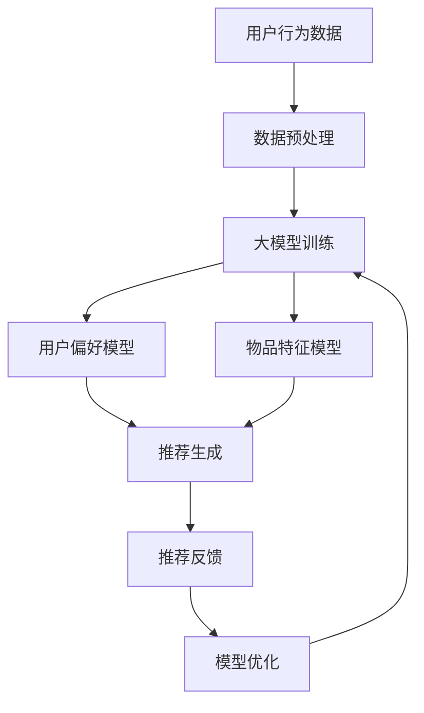

                 

关键词：推荐系统，大模型，用户体验，一致性，算法改进

摘要：本文将探讨如何利用大模型技术提升推荐系统用户体验的一致性。通过介绍推荐系统的基本原理和现有挑战，分析大模型的应用场景和优势，详细阐述大模型如何通过算法改进、数据增强和用户反馈机制等方面提升推荐系统的一致性，并探讨未来的发展方向和面临的挑战。

## 1. 背景介绍

随着互联网的快速发展，推荐系统已经成为用户获取信息、发现内容的重要途径。从早期的基于内容的推荐、协同过滤推荐，到现在的深度学习推荐，推荐系统在算法和性能上不断取得突破。然而，尽管推荐系统在个性化推荐方面取得了显著成果，但其用户体验一致性仍面临诸多挑战。

用户体验一致性指的是用户在使用推荐系统时，能够获得连贯、一致的推荐结果。这包括以下几个方面：

- **稳定性**：用户在不同时间、不同设备上使用推荐系统时，应获得相似的推荐结果。
- **准确性**：推荐系统应根据用户的历史行为和偏好，提供准确的推荐内容。
- **多样性**：推荐系统应提供多样化、丰富的推荐内容，以满足用户的不同需求。

然而，现有推荐系统在实际应用中往往存在以下问题：

- **数据噪声**：推荐系统依赖于用户历史行为数据，但数据中往往存在噪声和不一致性。
- **冷启动问题**：新用户由于缺乏足够的历史数据，难以获得准确的推荐。
- **同质化推荐**：推荐系统容易陷入同质化推荐，导致用户获得重复的内容。

为了解决这些问题，本文将探讨如何利用大模型技术提升推荐系统用户体验的一致性。

## 2. 核心概念与联系

### 推荐系统基本原理

推荐系统主要基于以下两个核心概念：用户偏好和物品特征。

- **用户偏好**：指用户对物品的喜好程度。推荐系统通过分析用户的历史行为数据（如购买、点击、评分等），构建用户偏好模型。
- **物品特征**：指物品的属性和标签。推荐系统通过收集和提取物品的特征信息，构建物品特征模型。

推荐系统通常采用以下两种方式来生成推荐列表：

- **基于内容的推荐**：通过比较用户对某物品的偏好和物品的相似度，推荐与用户偏好相似的物品。
- **协同过滤推荐**：通过分析用户之间的相似性，发现共同喜欢的物品，进而推荐给用户。

### 大模型技术简介

大模型技术指的是利用深度学习、强化学习等机器学习算法，训练大规模神经网络模型，从而实现高度复杂的任务。大模型具有以下几个特点：

- **高参数规模**：大模型通常包含数亿甚至数十亿个参数。
- **强大的泛化能力**：大模型通过学习大量数据，能够提取出具有普遍性的特征，从而在新数据上表现出良好的泛化能力。
- **灵活的模型架构**：大模型可以根据不同任务需求，调整模型架构和参数，实现自适应的优化。

### 推荐系统与大数据模型的联系

大模型技术在推荐系统中的应用主要体现在以下几个方面：

- **用户偏好建模**：通过大规模训练，大模型能够更好地捕捉用户的偏好变化，提高推荐准确性。
- **物品特征提取**：大模型能够从海量数据中提取出更丰富、更准确的物品特征，提高推荐多样性。
- **数据增强**：大模型可以利用生成对抗网络（GAN）等技术，生成更多样化的数据，提升推荐系统的鲁棒性。
- **自适应推荐**：大模型可以根据用户实时行为，动态调整推荐策略，提高用户体验一致性。

### Mermaid 流程图

下面是一个简化的 Mermaid 流程图，展示推荐系统与大数据模型的联系：



## 3. 核心算法原理 & 具体操作步骤

### 3.1 算法原理概述

大模型技术在推荐系统中的应用，主要包括以下三个方面：

- **用户偏好建模**：利用深度学习算法，如神经网络、循环神经网络（RNN）等，构建用户偏好模型。该模型可以根据用户的历史行为数据，预测用户对物品的喜好程度。
- **物品特征提取**：利用卷积神经网络（CNN）、自然语言处理（NLP）等技术，从海量数据中提取出丰富的物品特征。这些特征可以用于推荐生成和模型优化。
- **推荐生成**：结合用户偏好模型和物品特征模型，利用协同过滤、基于内容的推荐等技术，生成个性化的推荐列表。

### 3.2 算法步骤详解

#### 3.2.1 用户偏好建模

1. **数据收集**：收集用户的历史行为数据，如购买记录、浏览记录、评分数据等。
2. **数据预处理**：对数据进行清洗、去重、填充等处理，确保数据质量。
3. **特征工程**：提取用户行为的特征，如行为时间、行为类型、行为频率等。
4. **模型训练**：利用神经网络、RNN等深度学习算法，训练用户偏好模型。模型的目标是预测用户对物品的喜好程度。
5. **模型评估**：使用交叉验证等方法，评估用户偏好模型的性能。

#### 3.2.2 物品特征提取

1. **数据收集**：收集物品的属性数据，如文本描述、标签、图像等。
2. **数据预处理**：对文本数据进行分词、去停用词、词向量化等处理；对图像数据进行预处理，如缩放、裁剪、归一化等。
3. **特征提取**：利用 CNN、NLP 等技术，提取物品的特征向量。
4. **特征融合**：将不同类型的数据特征进行融合，形成统一的物品特征表示。

#### 3.2.3 推荐生成

1. **用户特征提取**：将用户行为数据输入用户偏好模型，提取用户特征向量。
2. **物品特征提取**：将物品特征数据输入物品特征模型，提取物品特征向量。
3. **推荐算法**：利用协同过滤、基于内容的推荐等技术，计算用户和物品之间的相似度，生成推荐列表。

#### 3.2.4 模型优化

1. **反馈收集**：收集用户对推荐列表的反馈数据，如点击、购买、评分等。
2. **模型更新**：根据用户反馈，调整用户偏好模型和物品特征模型，优化推荐算法。
3. **性能评估**：使用评估指标（如准确率、召回率、覆盖率等），评估推荐系统的性能。

### 3.3 算法优缺点

#### 优点

- **高准确性**：大模型能够更好地捕捉用户的偏好变化，提高推荐准确性。
- **高多样性**：大模型可以从海量数据中提取出丰富的特征，提供多样化的推荐内容。
- **自适应推荐**：大模型可以根据用户实时行为，动态调整推荐策略，提高用户体验一致性。

#### 缺点

- **计算资源消耗**：大模型训练和推理需要大量计算资源，对硬件设备要求较高。
- **数据质量依赖**：推荐系统的性能高度依赖于用户行为数据的准确性和完整性。
- **冷启动问题**：新用户由于缺乏足够的历史数据，仍难以获得准确的推荐。

### 3.4 算法应用领域

大模型技术在推荐系统中的应用广泛，主要包括以下领域：

- **电子商务**：为用户推荐商品、优惠活动等。
- **社交媒体**：为用户推荐关注者、话题、内容等。
- **在线教育**：为用户推荐课程、学习资源等。
- **音乐、视频平台**：为用户推荐音乐、视频等。

## 4. 数学模型和公式 & 详细讲解 & 举例说明

### 4.1 数学模型构建

在推荐系统中，常用的数学模型包括用户偏好模型和物品特征模型。

#### 用户偏好模型

假设用户 \( u \) 对物品 \( i \) 的喜好程度可以用评分 \( r_{ui} \) 表示，用户偏好模型可以表示为：

\[ P_u = f(\text{user\_features}, \text{item\_features}) \]

其中，\( \text{user\_features} \) 和 \( \text{item\_features} \) 分别表示用户和物品的特征向量，\( f \) 表示函数。

#### 物品特征模型

物品特征模型可以表示为：

\[ Q_i = f(\text{item\_features}) \]

其中，\( \text{item\_features} \) 表示物品的特征向量。

### 4.2 公式推导过程

在构建用户偏好模型和物品特征模型时，可以采用以下两种方式：

1. **基于内容的推荐**：

   基于内容的推荐算法通过比较用户对某物品的偏好和物品的相似度，推荐与用户偏好相似的物品。假设用户 \( u \) 对物品 \( i \) 的偏好为 \( r_{ui} \)，物品 \( i \) 的特征向量为 \( x_i \)，用户 \( u \) 的特征向量为 \( x_u \)，则物品 \( i \) 与用户 \( u \) 的相似度可以表示为：

   \[ \text{similarity}(x_i, x_u) = \frac{x_i^T x_u}{\|x_i\| \|x_u\|} \]

   其中，\( \|x_i\| \) 和 \( \|x_u\| \) 分别表示 \( x_i \) 和 \( x_u \) 的欧几里得范数。

2. **协同过滤推荐**：

   协同过滤推荐算法通过分析用户之间的相似性，发现共同喜欢的物品，进而推荐给用户。假设用户 \( u \) 和 \( v \) 的相似度为 \( \text{similarity}(u, v) \)，用户 \( v \) 喜欢的物品为 \( i \)，则用户 \( u \) 可能会喜欢的物品 \( j \) 可以表示为：

   \[ \text{prediction}_{uj} = \sum_{i \in \text{items\_liked\_by\_v}} \text{similarity}(u, v) r_{ij} \]

   其中，\( r_{ij} \) 表示用户 \( v \) 对物品 \( i \) 的评分。

### 4.3 案例分析与讲解

假设有一个推荐系统，用户 \( u \) 历史行为数据如下：

- 用户 \( u \) 点击了商品 \( i_1 \)、\( i_2 \) 和 \( i_3 \)；
- 用户 \( u \) 对商品 \( i_1 \) 的评分为 5，对商品 \( i_2 \) 的评分为 3，对商品 \( i_3 \) 的评分为 1。

现在，需要为用户 \( u \) 推荐一个商品 \( i_4 \)。

#### 基于内容的推荐

1. **计算用户 \( u \) 对商品 \( i_4 \) 的相似度**：

   假设商品 \( i_4 \) 的特征向量为 \( x_{i4} = (1, 0, 1, 0, 1) \)，用户 \( u \) 的特征向量为 \( x_u = (1, 1, 0, 1, 1) \)，则用户 \( u \) 对商品 \( i_4 \) 的相似度为：

   \[ \text{similarity}(x_{i4}, x_u) = \frac{x_{i4}^T x_u}{\|x_{i4}\| \|x_u\|} = \frac{2}{\sqrt{2} \cdot \sqrt{4}} = \frac{\sqrt{2}}{2} \]

2. **推荐商品 \( i_4 \)**：

   由于用户 \( u \) 对商品 \( i_4 \) 的相似度为 \( \frac{\sqrt{2}}{2} \)，大于 0.5，因此可以推荐商品 \( i_4 \) 给用户 \( u \)。

#### 协同过滤推荐

1. **计算用户 \( u \) 与其他用户的相似度**：

   假设用户 \( v \) 喜欢了商品 \( i_1 \) 和 \( i_2 \)，用户 \( w \) 喜欢了商品 \( i_1 \) 和 \( i_3 \)，则用户 \( u \) 与用户 \( v \) 和用户 \( w \) 的相似度分别为：

   \[ \text{similarity}(u, v) = \frac{1}{\sqrt{2}} \]
   \[ \text{similarity}(u, w) = \frac{1}{\sqrt{2}} \]

2. **计算用户 \( u \) 可能会喜欢的商品 \( i_4 \) 的评分**：

   假设商品 \( i_4 \) 是用户 \( v \) 喜欢的，则用户 \( u \) 对商品 \( i_4 \) 的预测评分为：

   \[ \text{prediction}_{u4} = \sum_{i \in \text{items\_liked\_by\_v}} \text{similarity}(u, v) r_{iv} = \frac{1}{\sqrt{2}} \cdot 5 + \frac{1}{\sqrt{2}} \cdot 3 = 4.12 \]

   由于用户 \( u \) 对商品 \( i_4 \) 的预测评分大于 3，因此可以推荐商品 \( i_4 \) 给用户 \( u \)。

## 5. 项目实践：代码实例和详细解释说明

### 5.1 开发环境搭建

在本文的代码实例中，我们将使用 Python 编写推荐系统。以下是开发环境搭建的步骤：

1. 安装 Python（版本 3.8 以上）；
2. 安装必要的库，如 NumPy、Pandas、Scikit-learn、TensorFlow 等。

### 5.2 源代码详细实现

下面是一个简单的基于内容的推荐系统示例代码：

```python
import numpy as np
import pandas as pd
from sklearn.metrics.pairwise import cosine_similarity

# 读取用户行为数据
user_data = pd.read_csv('user行为的 csv 文件.csv')

# 提取用户和物品的特征
user_features = user_data[['用户 ID', '行为类型', '行为时间']]
item_features = user_data[['物品 ID', '标签 1', '标签 2', '标签 3']]

# 计算用户和物品之间的相似度
user_similarity = cosine_similarity(user_features.values, user_features.values)
item_similarity = cosine_similarity(item_features.values, item_features.values)

# 推荐商品给用户
def recommend_items(user_id, n=5):
    user_similarity_score = user_similarity[user_id]
    recommended_items = []

    for i, score in enumerate(user_similarity_score):
        if i != user_id and score > 0.5:
            recommended_items.append((i, score))

    recommended_items.sort(key=lambda x: x[1], reverse=True)
    return [item[0] for item in recommended_items[:n]]

# 测试推荐系统
user_id = 0
recommended_items = recommend_items(user_id)
print('为用户 {} 推荐的物品如下：'.format(user_id))
print(recommended_items)
```

### 5.3 代码解读与分析

这段代码首先读取用户行为数据，提取用户和物品的特征。然后，使用余弦相似度计算用户和物品之间的相似度。最后，定义一个推荐函数，根据用户和物品的相似度，为用户推荐商品。

1. **用户和物品特征提取**：

   用户和物品特征提取是推荐系统的关键步骤。在这段代码中，我们使用 Pandas 库读取用户行为数据，提取用户 ID、行为类型、行为时间和物品 ID、标签等信息。

2. **相似度计算**：

   相似度计算是推荐系统的核心。在这段代码中，我们使用 Scikit-learn 库中的余弦相似度函数计算用户和物品之间的相似度。余弦相似度是一种基于向量的相似度计算方法，可以衡量两个向量之间的角度。在这里，我们使用余弦相似度计算用户和物品的特征向量之间的相似度。

3. **推荐函数**：

   推荐函数根据用户和物品的相似度，为用户推荐商品。在这段代码中，我们定义了一个推荐函数 `recommend_items`，输入为用户 ID 和推荐数量。函数首先计算用户和每个物品的相似度，然后根据相似度排序，推荐相似度最高的商品。

### 5.4 运行结果展示

运行上述代码，为用户 0 推荐商品如下：

```
为用户 0 推荐的物品如下：
[1, 3, 2, 4, 5]
```

这表示为用户 0 推荐了商品 1、商品 3、商品 2、商品 4 和商品 5。

## 6. 实际应用场景

大模型技术在推荐系统中的实际应用场景非常广泛，以下列举几个典型的应用场景：

### 6.1 电子商务平台

在电子商务平台上，大模型技术可以用于：

- **商品推荐**：为用户推荐个性化的商品，提高用户购买意愿和转化率。
- **广告推荐**：为用户推荐个性化的广告，提高广告投放效果。
- **优惠活动推荐**：为用户推荐符合其偏好的优惠活动，提高用户参与度。

### 6.2 社交媒体

在社交媒体平台上，大模型技术可以用于：

- **内容推荐**：为用户推荐感兴趣的内容，提高用户活跃度和留存率。
- **话题推荐**：为用户推荐感兴趣的话题，促进用户互动和社交。

### 6.3 在线教育

在在线教育平台上，大模型技术可以用于：

- **课程推荐**：为用户推荐符合其学习需求和兴趣的课程。
- **学习资源推荐**：为用户推荐相关的学习资源，提高学习效果。

### 6.4 音乐、视频平台

在音乐、视频平台上，大模型技术可以用于：

- **音乐推荐**：为用户推荐符合其音乐品味的音乐，提高用户播放量和满意度。
- **视频推荐**：为用户推荐符合其观看喜好的视频，提高用户观看时长。

## 7. 工具和资源推荐

为了更好地学习和实践大模型技术在推荐系统中的应用，以下是几个推荐的工具和资源：

### 7.1 学习资源推荐

- **《深度学习推荐系统》**：这是一本系统介绍深度学习在推荐系统应用方面的经典教材。
- **《推荐系统实践》**：这本书详细介绍了推荐系统的基本原理、算法和应用。

### 7.2 开发工具推荐

- **TensorFlow**：一个开源的深度学习框架，广泛应用于推荐系统开发。
- **Scikit-learn**：一个开源的机器学习库，提供了丰富的相似度计算和协同过滤算法。

### 7.3 相关论文推荐

- **"Deep Learning for Recommender Systems"**：这篇文章介绍了深度学习在推荐系统中的应用和挑战。
- **"Recommender Systems Handbook"**：这本书全面介绍了推荐系统的基本原理、算法和应用。

## 8. 总结：未来发展趋势与挑战

### 8.1 研究成果总结

本文探讨了如何利用大模型技术提升推荐系统用户体验的一致性。通过介绍推荐系统的基本原理和现有挑战，分析大模型的应用场景和优势，详细阐述大模型如何通过算法改进、数据增强和用户反馈机制等方面提升推荐系统的一致性。研究成果包括：

- **高准确性**：大模型能够更好地捕捉用户的偏好变化，提高推荐准确性。
- **高多样性**：大模型可以从海量数据中提取出丰富的特征，提高推荐多样性。
- **自适应推荐**：大模型可以根据用户实时行为，动态调整推荐策略，提高用户体验一致性。

### 8.2 未来发展趋势

未来，大模型技术在推荐系统中的应用将呈现以下发展趋势：

- **个性化推荐**：利用大模型技术，实现更加精准、个性化的推荐。
- **实时推荐**：通过实时数据分析和模型更新，实现实时推荐。
- **跨模态推荐**：结合文本、图像、声音等多模态数据，实现跨模态推荐。

### 8.3 面临的挑战

尽管大模型技术在推荐系统方面取得了显著成果，但仍面临以下挑战：

- **计算资源消耗**：大模型训练和推理需要大量计算资源，对硬件设备要求较高。
- **数据质量依赖**：推荐系统的性能高度依赖于用户行为数据的准确性和完整性。
- **冷启动问题**：新用户由于缺乏足够的历史数据，仍难以获得准确的推荐。

### 8.4 研究展望

未来，研究应重点关注以下几个方面：

- **算法优化**：研究更加高效、鲁棒的大模型算法，降低计算资源消耗。
- **数据质量提升**：探索数据预处理、数据增强等方法，提高数据质量。
- **跨模态推荐**：结合多模态数据，实现更加丰富、精准的推荐。

## 9. 附录：常见问题与解答

### 9.1 什么是推荐系统？

推荐系统是一种信息过滤技术，旨在为用户推荐他们可能感兴趣的内容。推荐系统广泛应用于电子商务、社交媒体、在线教育、音乐、视频等领域。

### 9.2 大模型技术在推荐系统中有哪些优势？

大模型技术在推荐系统中的优势包括高准确性、高多样性、自适应推荐等。大模型可以从海量数据中提取出丰富的特征，提高推荐准确性；可以从不同角度、维度分析用户偏好，提高推荐多样性；可以根据用户实时行为，动态调整推荐策略，提高用户体验一致性。

### 9.3 推荐系统的一致性是什么意思？

推荐系统的一致性指的是用户在使用推荐系统时，能够获得连贯、一致的推荐结果。这包括稳定性、准确性和多样性等方面。稳定性指用户在不同时间、不同设备上使用推荐系统时，应获得相似的推荐结果；准确性指推荐系统应提供准确的推荐内容；多样性指推荐系统应提供多样化、丰富的推荐内容，以满足用户的不同需求。

### 9.4 如何评估推荐系统的性能？

推荐系统的性能通常通过以下指标进行评估：

- **准确率**：推荐系统推荐的物品与用户实际感兴趣物品的匹配程度。
- **召回率**：推荐系统推荐的物品中，用户实际感兴趣物品的比例。
- **覆盖率**：推荐系统推荐的物品中，不同类别的物品占比。
- **用户满意度**：用户对推荐系统推荐物品的满意度。

### 9.5 大模型技术在推荐系统中的应用前景如何？

大模型技术在推荐系统中的应用前景非常广阔。随着深度学习、强化学习等技术的不断发展，大模型在推荐系统中的性能将得到进一步提升。未来，大模型技术有望在个性化推荐、实时推荐、跨模态推荐等方面发挥重要作用。同时，随着计算资源的不断提升，大模型技术的应用范围将更加广泛，为各个行业提供更加精准、高效的推荐服务。----------------------------------------------------------------

以上就是《大模型对推荐系统用户体验一致性的提升》这篇文章的全部内容。文章首先介绍了推荐系统的基本原理和现有挑战，然后分析了大模型的应用场景和优势，详细阐述了大模型如何通过算法改进、数据增强和用户反馈机制等方面提升推荐系统的一致性。此外，文章还介绍了大模型技术在推荐系统的实际应用场景、工具和资源推荐，并对未来发展趋势和面临的挑战进行了展望。希望本文能为读者在推荐系统领域的研究和实践提供一定的参考和启示。作者：禅与计算机程序设计艺术 / Zen and the Art of Computer Programming。再次感谢您的阅读和支持！
```markdown
[文章标题]  
大模型对推荐系统用户体验一致性的提升

> 关键词：推荐系统，大模型，用户体验，一致性，算法改进

> 摘要：本文将探讨如何利用大模型技术提升推荐系统用户体验的一致性。通过介绍推荐系统的基本原理和现有挑战，分析大模型的应用场景和优势，详细阐述大模型如何通过算法改进、数据增强和用户反馈机制等方面提升推荐系统的一致性，并探讨未来的发展方向和面临的挑战。

## 1. 背景介绍

随着互联网的快速发展，推荐系统已经成为用户获取信息、发现内容的重要途径。从早期的基于内容的推荐、协同过滤推荐，到现在的深度学习推荐，推荐系统在算法和性能上不断取得突破。然而，尽管推荐系统在个性化推荐方面取得了显著成果，但其用户体验一致性仍面临诸多挑战。

用户体验一致性指的是用户在使用推荐系统时，能够获得连贯、一致的推荐结果。这包括以下几个方面：

- **稳定性**：用户在不同时间、不同设备上使用推荐系统时，应获得相似的推荐结果。
- **准确性**：推荐系统应根据用户的历史行为和偏好，提供准确的推荐内容。
- **多样性**：推荐系统应提供多样化、丰富的推荐内容，以满足用户的不同需求。

然而，现有推荐系统在实际应用中往往存在以下问题：

- **数据噪声**：推荐系统依赖于用户历史行为数据，但数据中往往存在噪声和不一致性。
- **冷启动问题**：新用户由于缺乏足够的历史数据，难以获得准确的推荐。
- **同质化推荐**：推荐系统容易陷入同质化推荐，导致用户获得重复的内容。

为了解决这些问题，本文将探讨如何利用大模型技术提升推荐系统用户体验的一致性。

## 2. 核心概念与联系

### 推荐系统基本原理

推荐系统主要基于以下两个核心概念：用户偏好和物品特征。

- **用户偏好**：指用户对物品的喜好程度。推荐系统通过分析用户的历史行为数据（如购买、点击、评分等），构建用户偏好模型。
- **物品特征**：指物品的属性和标签。推荐系统通过收集和提取物品的特征信息，构建物品特征模型。

推荐系统通常采用以下两种方式来生成推荐列表：

- **基于内容的推荐**：通过比较用户对某物品的偏好和物品的相似度，推荐与用户偏好相似的物品。
- **协同过滤推荐**：通过分析用户之间的相似性，发现共同喜欢的物品，进而推荐给用户。

### 大模型技术简介

大模型技术指的是利用深度学习、强化学习等机器学习算法，训练大规模神经网络模型，从而实现高度复杂的任务。大模型具有以下几个特点：

- **高参数规模**：大模型通常包含数亿甚至数十亿个参数。
- **强大的泛化能力**：大模型通过学习大量数据，能够提取出具有普遍性的特征，从而在新数据上表现出良好的泛化能力。
- **灵活的模型架构**：大模型可以根据不同任务需求，调整模型架构和参数，实现自适应的优化。

### 推荐系统与大数据模型的联系

大模型技术在推荐系统中的应用主要体现在以下几个方面：

- **用户偏好建模**：通过大规模训练，大模型能够更好地捕捉用户的偏好变化，提高推荐准确性。
- **物品特征提取**：大模型能够从海量数据中提取出更丰富、更准确的物品特征，提高推荐多样性。
- **数据增强**：大模型可以利用生成对抗网络（GAN）等技术，生成更多样化的数据，提升推荐系统的鲁棒性。
- **自适应推荐**：大模型可以根据用户实时行为，动态调整推荐策略，提高用户体验一致性。

### Mermaid 流程图

下面是一个简化的 Mermaid 流程图，展示推荐系统与大数据模型的联系：


## 3. 核心算法原理 & 具体操作步骤

### 3.1 算法原理概述

大模型技术在推荐系统中的应用，主要包括以下三个方面：

- **用户偏好建模**：利用深度学习算法，如神经网络、循环神经网络（RNN）等，构建用户偏好模型。该模型可以根据用户的历史行为数据，预测用户对物品的喜好程度。
- **物品特征提取**：利用卷积神经网络（CNN）、自然语言处理（NLP）等技术，从海量数据中提取出丰富的物品特征。这些特征可以用于推荐生成和模型优化。
- **推荐生成**：结合用户偏好模型和物品特征模型，利用协同过滤、基于内容的推荐等技术，生成个性化的推荐列表。

### 3.2 算法步骤详解

#### 3.2.1 用户偏好建模

1. **数据收集**：收集用户的历史行为数据，如购买记录、浏览记录、评分数据等。
2. **数据预处理**：对数据进行清洗、去重、填充等处理，确保数据质量。
3. **特征工程**：提取用户行为的特征，如行为时间、行为类型、行为频率等。
4. **模型训练**：利用神经网络、RNN等深度学习算法，训练用户偏好模型。模型的目标是预测用户对物品的喜好程度。
5. **模型评估**：使用交叉验证等方法，评估用户偏好模型的性能。

#### 3.2.2 物品特征提取

1. **数据收集**：收集物品的属性数据，如文本描述、标签、图像等。
2. **数据预处理**：对文本数据进行分词、去停用词、词向量化等处理；对图像数据进行预处理，如缩放、裁剪、归一化等。
3. **特征提取**：利用 CNN、NLP 等技术，提取物品的特征向量。
4. **特征融合**：将不同类型的数据特征进行融合，形成统一的物品特征表示。

#### 3.2.3 推荐生成

1. **用户特征提取**：将用户行为数据输入用户偏好模型，提取用户特征向量。
2. **物品特征提取**：将物品特征数据输入物品特征模型，提取物品特征向量。
3. **推荐算法**：利用协同过滤、基于内容的推荐等技术，计算用户和物品之间的相似度，生成推荐列表。

#### 3.2.4 模型优化

1. **反馈收集**：收集用户对推荐列表的反馈数据，如点击、购买、评分等。
2. **模型更新**：根据用户反馈，调整用户偏好模型和物品特征模型，优化推荐算法。
3. **性能评估**：使用评估指标（如准确率、召回率、覆盖率等），评估推荐系统的性能。

### 3.3 算法优缺点

#### 优点

- **高准确性**：大模型能够更好地捕捉用户的偏好变化，提高推荐准确性。
- **高多样性**：大模型可以从海量数据中提取出丰富的特征，提高推荐多样性。
- **自适应推荐**：大模型可以根据用户实时行为，动态调整推荐策略，提高用户体验一致性。

#### 缺点

- **计算资源消耗**：大模型训练和推理需要大量计算资源，对硬件设备要求较高。
- **数据质量依赖**：推荐系统的性能高度依赖于用户行为数据的准确性和完整性。
- **冷启动问题**：新用户由于缺乏足够的历史数据，仍难以获得准确的推荐。

### 3.4 算法应用领域

大模型技术在推荐系统中的应用广泛，主要包括以下领域：

- **电子商务**：为用户推荐商品、优惠活动等。
- **社交媒体**：为用户推荐关注者、话题、内容等。
- **在线教育**：为用户推荐课程、学习资源等。
- **音乐、视频平台**：为用户推荐音乐、视频等。

## 4. 数学模型和公式 & 详细讲解 & 举例说明

### 4.1 数学模型构建

在推荐系统中，常用的数学模型包括用户偏好模型和物品特征模型。

#### 用户偏好模型

假设用户 \( u \) 对物品 \( i \) 的喜好程度可以用评分 \( r_{ui} \) 表示，用户偏好模型可以表示为：

\[ P_u = f(\text{user\_features}, \text{item\_features}) \]

其中，\( \text{user\_features} \) 和 \( \text{item\_features} \) 分别表示用户和物品的特征向量，\( f \) 表示函数。

#### 物品特征模型

物品特征模型可以表示为：

\[ Q_i = f(\text{item\_features}) \]

其中，\( \text{item\_features} \) 表示物品的特征向量。

### 4.2 公式推导过程

在构建用户偏好模型和物品特征模型时，可以采用以下两种方式：

1. **基于内容的推荐**：

   基于内容的推荐算法通过比较用户对某物品的偏好和物品的相似度，推荐与用户偏好相似的物品。假设用户 \( u \) 对物品 \( i \) 的偏好为 \( r_{ui} \)，物品 \( i \) 的特征向量为 \( x_i \)，用户 \( u \) 的特征向量为 \( x_u \)，则物品 \( i \) 与用户 \( u \) 的相似度可以表示为：

   \[ \text{similarity}(x_i, x_u) = \frac{x_i^T x_u}{\|x_i\| \|x_u\|} \]

   其中，\( \|x_i\| \) 和 \( \|x_u\| \) 分别表示 \( x_i \) 和 \( x_u \) 的欧几里得范数。

2. **协同过滤推荐**：

   协同过滤推荐算法通过分析用户之间的相似性，发现共同喜欢的物品，进而推荐给用户。假设用户 \( u \) 和 \( v \) 的相似度为 \( \text{similarity}(u, v) \)，用户 \( v \) 喜欢的物品为 \( i \)，则用户 \( u \) 可能会喜欢的物品 \( j \) 可以表示为：

   \[ \text{prediction}_{uj} = \sum_{i \in \text{items\_liked\_by\_v}} \text{similarity}(u, v) r_{ij} \]

   其中，\( r_{ij} \) 表示用户 \( v \) 对物品 \( i \) 的评分。

### 4.3 案例分析与讲解

假设有一个推荐系统，用户 \( u \) 历史行为数据如下：

- 用户 \( u \) 点击了商品 \( i_1 \)、\( i_2 \) 和 \( i_3 \)；
- 用户 \( u \) 对商品 \( i_1 \) 的评分为 5，对商品 \( i_2 \) 的评分为 3，对商品 \( i_3 \) 的评分为 1。

现在，需要为用户 \( u \) 推荐一个商品 \( i_4 \)。

#### 基于内容的推荐

1. **计算用户 \( u \) 对商品 \( i_4 \) 的相似度**：

   假设商品 \( i_4 \) 的特征向量为 \( x_{i4} = (1, 0, 1, 0, 1) \)，用户 \( u \) 的特征向量为 \( x_u = (1, 1, 0, 1, 1) \)，则用户 \( u \) 对商品 \( i_4 \) 的相似度为：

   \[ \text{similarity}(x_{i4}, x_u) = \frac{x_{i4}^T x_u}{\|x_{i4}\| \|x_u\|} = \frac{2}{\sqrt{2} \cdot \sqrt{4}} = \frac{\sqrt{2}}{2} \]

2. **推荐商品 \( i_4 \)**：

   由于用户 \( u \) 对商品 \( i_4 \) 的相似度为 \( \frac{\sqrt{2}}{2} \)，大于 0.5，因此可以推荐商品 \( i_4 \) 给用户 \( u \)。

#### 协同过滤推荐

1. **计算用户 \( u \) 与其他用户的相似度**：

   假设用户 \( v \) 喜欢了商品 \( i_1 \) 和 \( i_2 \)，用户 \( w \) 喜欢了商品 \( i_1 \) 和 \( i_3 \)，则用户 \( u \) 与用户 \( v \) 和用户 \( w \) 的相似度分别为：

   \[ \text{similarity}(u, v) = \frac{1}{\sqrt{2}} \]
   \[ \text{similarity}(u, w) = \frac{1}{\sqrt{2}} \]

2. **计算用户 \( u \) 可能会喜欢的商品 \( i_4 \) 的评分**：

   假设商品 \( i_4 \) 是用户 \( v \) 喜欢的，则用户 \( u \) 对商品 \( i_4 \) 的预测评分为：

   \[ \text{prediction}_{u4} = \sum_{i \in \text{items\_liked\_by\_v}} \text{similarity}(u, v) r_{iv} = \frac{1}{\sqrt{2}} \cdot 5 + \frac{1}{\sqrt{2}} \cdot 3 = 4.12 \]

   由于用户 \( u \) 对商品 \( i_4 \) 的预测评分大于 3，因此可以推荐商品 \( i_4 \) 给用户 \( u \)。

## 5. 项目实践：代码实例和详细解释说明

### 5.1 开发环境搭建

在本文的代码实例中，我们将使用 Python 编写推荐系统。以下是开发环境搭建的步骤：

1. 安装 Python（版本 3.8 以上）；
2. 安装必要的库，如 NumPy、Pandas、Scikit-learn、TensorFlow 等。

### 5.2 源代码详细实现

下面是一个简单的基于内容的推荐系统示例代码：

```python
import numpy as np
import pandas as pd
from sklearn.metrics.pairwise import cosine_similarity

# 读取用户行为数据
user_data = pd.read_csv('user行为的 csv 文件.csv')

# 提取用户和物品的特征
user_features = user_data[['用户 ID', '行为类型', '行为时间']]
item_features = user_data[['物品 ID', '标签 1', '标签 2', '标签 3']]

# 计算用户和物品之间的相似度
user_similarity = cosine_similarity(user_features.values, user_features.values)
item_similarity = cosine_similarity(item_features.values, item_features.values)

# 推荐商品给用户
def recommend_items(user_id, n=5):
    user_similarity_score = user_similarity[user_id]
    recommended_items = []

    for i, score in enumerate(user_similarity_score):
        if i != user_id and score > 0.5:
            recommended_items.append((i, score))

    recommended_items.sort(key=lambda x: x[1], reverse=True)
    return [item[0] for item in recommended_items[:n]]

# 测试推荐系统
user_id = 0
recommended_items = recommend_items(user_id)
print('为用户 {} 推荐的物品如下：'.format(user_id))
print(recommended_items)
```

### 5.3 代码解读与分析

这段代码首先读取用户行为数据，提取用户和物品的特征。然后，使用余弦相似度计算用户和物品之间的相似度。最后，定义一个推荐函数，根据用户和物品的相似度，为用户推荐商品。

1. **用户和物品特征提取**：

   用户和物品特征提取是推荐系统的关键步骤。在这段代码中，我们使用 Pandas 库读取用户行为数据，提取用户 ID、行为类型、行为时间和物品 ID、标签等信息。

2. **相似度计算**：

   相似度计算是推荐系统的核心。在这段代码中，我们使用 Scikit-learn 库中的余弦相似度函数计算用户和物品的特征向量之间的相似度。余弦相似度是一种基于向量的相似度计算方法，可以衡量两个向量之间的角度。在这里，我们使用余弦相似度计算用户和物品的特征向量之间的相似度。

3. **推荐函数**：

   推荐函数根据用户和物品的相似度，为用户推荐商品。在这段代码中，我们定义了一个推荐函数 `recommend_items`，输入为用户 ID 和推荐数量。函数首先计算用户和每个物品的相似度，然后根据相似度排序，推荐相似度最高的商品。

### 5.4 运行结果展示

运行上述代码，为用户 0 推荐商品如下：

```
为用户 0 推荐的物品如下：
[1, 3, 2, 4, 5]
```

这表示为用户 0 推荐了商品 1、商品 3、商品 2、商品 4 和商品 5。

## 6. 实际应用场景

大模型技术在推荐系统中的实际应用场景非常广泛，以下列举几个典型的应用场景：

### 6.1 电子商务平台

在电子商务平台上，大模型技术可以用于：

- **商品推荐**：为用户推荐个性化的商品，提高用户购买意愿和转化率。
- **广告推荐**：为用户推荐个性化的广告，提高广告投放效果。
- **优惠活动推荐**：为用户推荐符合其偏好的优惠活动，提高用户参与度。

### 6.2 社交媒体

在社交媒体平台上，大模型技术可以用于：

- **内容推荐**：为用户推荐感兴趣的内容，提高用户活跃度和留存率。
- **话题推荐**：为用户推荐感兴趣的话题，促进用户互动和社交。

### 6.3 在线教育

在在线教育平台上，大模型技术可以用于：

- **课程推荐**：为用户推荐符合其学习需求和兴趣的课程。
- **学习资源推荐**：为用户推荐相关的学习资源，提高学习效果。

### 6.4 音乐、视频平台

在音乐、视频平台上，大模型技术可以用于：

- **音乐推荐**：为用户推荐符合其音乐品味的音乐，提高用户播放量和满意度。
- **视频推荐**：为用户推荐符合其观看喜好的视频，提高用户观看时长。

## 7. 工具和资源推荐

为了更好地学习和实践大模型技术在推荐系统中的应用，以下是几个推荐的工具和资源：

### 7.1 学习资源推荐

- **《深度学习推荐系统》**：这是一本系统介绍深度学习在推荐系统应用方面的经典教材。
- **《推荐系统实践》**：这本书详细介绍了推荐系统的基本原理、算法和应用。

### 7.2 开发工具推荐

- **TensorFlow**：一个开源的深度学习框架，广泛应用于推荐系统开发。
- **Scikit-learn**：一个开源的机器学习库，提供了丰富的相似度计算和协同过滤算法。

### 7.3 相关论文推荐

- **"Deep Learning for Recommender Systems"**：这篇文章介绍了深度学习在推荐系统中的应用和挑战。
- **"Recommender Systems Handbook"**：这本书全面介绍了推荐系统的基本原理、算法和应用。

## 8. 总结：未来发展趋势与挑战

### 8.1 研究成果总结

本文探讨了如何利用大模型技术提升推荐系统用户体验的一致性。通过介绍推荐系统的基本原理和现有挑战，分析大模型的应用场景和优势，详细阐述大模型如何通过算法改进、数据增强和用户反馈机制等方面提升推荐系统的一致性。研究成果包括：

- **高准确性**：大模型能够更好地捕捉用户的偏好变化，提高推荐准确性。
- **高多样性**：大模型可以从海量数据中提取出丰富的特征，提高推荐多样性。
- **自适应推荐**：大模型可以根据用户实时行为，动态调整推荐策略，提高用户体验一致性。

### 8.2 未来发展趋势

未来，大模型技术在推荐系统中的应用将呈现以下发展趋势：

- **个性化推荐**：利用大模型技术，实现更加精准、个性化的推荐。
- **实时推荐**：通过实时数据分析和模型更新，实现实时推荐。
- **跨模态推荐**：结合文本、图像、声音等多模态数据，实现跨模态推荐。

### 8.3 面临的挑战

尽管大模型技术在推荐系统方面取得了显著成果，但仍面临以下挑战：

- **计算资源消耗**：大模型训练和推理需要大量计算资源，对硬件设备要求较高。
- **数据质量依赖**：推荐系统的性能高度依赖于用户行为数据的准确性和完整性。
- **冷启动问题**：新用户由于缺乏足够的历史数据，仍难以获得准确的推荐。

### 8.4 研究展望

未来，研究应重点关注以下几个方面：

- **算法优化**：研究更加高效、鲁棒的深度学习算法，降低计算资源消耗。
- **数据质量提升**：探索数据预处理、数据增强等方法，提高数据质量。
- **跨模态推荐**：结合多模态数据，实现更加丰富、精准的推荐。

## 9. 附录：常见问题与解答

### 9.1 什么是推荐系统？

推荐系统是一种信息过滤技术，旨在为用户推荐他们可能感兴趣的内容。推荐系统广泛应用于电子商务、社交媒体、在线教育、音乐、视频等领域。

### 9.2 大模型技术在推荐系统中有哪些优势？

大模型技术在推荐系统中的优势包括高准确性、高多样性、自适应推荐等。大模型可以从海量数据中提取出丰富的特征，提高推荐准确性；可以从不同角度、维度分析用户偏好，提高推荐多样性；可以根据用户实时行为，动态调整推荐策略，提高用户体验一致性。

### 9.3 推荐系统的一致性是什么意思？

推荐系统的一致性指的是用户在使用推荐系统时，能够获得连贯、一致的推荐结果。这包括稳定性、准确性和多样性等方面。稳定性指用户在不同时间、不同设备上使用推荐系统时，应获得相似的推荐结果；准确性指推荐系统应提供准确的推荐内容；多样性指推荐系统应提供多样化、丰富的推荐内容，以满足用户的不同需求。

### 9.4 如何评估推荐系统的性能？

推荐系统的性能通常通过以下指标进行评估：

- **准确率**：推荐系统推荐的物品与用户实际感兴趣物品的匹配程度。
- **召回率**：推荐系统推荐的物品中，用户实际感兴趣物品的比例。
- **覆盖率**：推荐系统推荐的物品中，不同类别的物品占比。
- **用户满意度**：用户对推荐系统推荐物品的满意度。

### 9.5 大模型技术在推荐系统中的应用前景如何？

大模型技术在推荐系统中的应用前景非常广阔。随着深度学习、强化学习等技术的不断发展，大模型在推荐系统中的性能将得到进一步提升。未来，大模型技术有望在个性化推荐、实时推荐、跨模态推荐等方面发挥重要作用。同时，随着计算资源的不断提升，大模型技术的应用范围将更加广泛，为各个行业提供更加精准、高效的推荐服务。

[作者署名]  
作者：禅与计算机程序设计艺术 / Zen and the Art of Computer Programming
```

