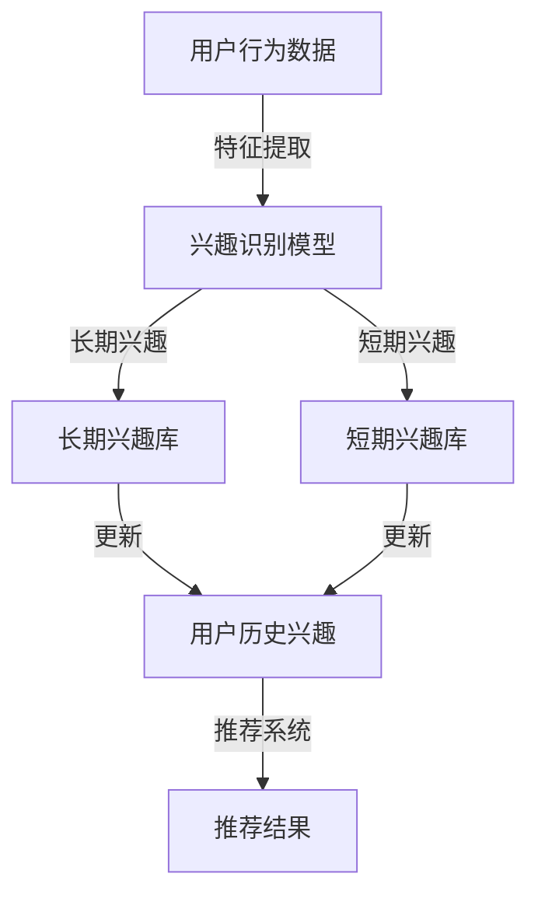

                 

 关键词：大模型推荐、用户兴趣建模、长期与短期兴趣、信息检索、用户行为分析、个性化推荐

> 摘要：本文旨在探讨大模型推荐系统中的用户长短期兴趣建模方法。通过综述现有的相关技术，本文提出了一种创新性的用户兴趣建模方法，并详细阐述了其理论背景、核心算法、数学模型以及实际应用。文章将结合具体案例，展示该方法在提高推荐准确性、扩展应用领域方面的潜力，并对未来的发展趋势与挑战进行展望。

## 1. 背景介绍

随着互联网技术的飞速发展，信息过载问题愈发严重，个性化推荐系统应运而生。个性化推荐系统通过分析用户的行为数据、兴趣偏好，为用户提供个性化的信息推荐，从而帮助用户在海量信息中找到感兴趣的内容。然而，传统推荐系统在处理用户长短期兴趣时存在一定的局限性，难以满足用户多样化的需求。

长期兴趣通常指用户在较长时间内持续关注或偏好的主题，如文学、科技、体育等。而短期兴趣则是用户在短期内表现出的对某一特定领域的关注，如近期热点事件、热门剧集等。用户的长短期兴趣相互作用，共同影响其行为和偏好。

近年来，深度学习技术的蓬勃发展，为大模型推荐中的用户兴趣建模带来了新的机遇。大模型如BERT、GPT等，具有强大的语义理解能力，能够从用户行为数据中提取出深层次的兴趣特征。然而，如何有效地整合用户的长短期兴趣信息，并提高推荐系统的准确性，仍是一个亟待解决的问题。

本文将从以下几个方面展开讨论：

1. **用户长短期兴趣建模方法综述**：回顾现有关于用户兴趣建模的方法，分析其优缺点。
2. **核心算法原理与实现**：详细介绍一种创新性的用户兴趣建模算法，并解释其工作原理。
3. **数学模型与公式推导**：阐述算法背后的数学模型，并进行详细推导。
4. **项目实践与代码实现**：结合具体案例，展示算法的应用效果。
5. **实际应用场景与未来展望**：探讨算法在推荐系统中的应用场景，以及未来可能的发展趋势和挑战。

## 2. 核心概念与联系

### 2.1. 用户兴趣

用户兴趣是指用户在特定时间内对某一主题或领域的偏好或关注程度。用户兴趣可以分为以下几类：

- **长期兴趣**：用户在较长时间内持续关注的主题，如个人爱好、职业领域等。
- **短期兴趣**：用户在短期内表现出的对某一特定领域的关注，如近期热点事件、热门剧集等。

用户兴趣的识别是推荐系统中的关键步骤，它直接影响推荐结果的准确性。

### 2.2. 推荐系统

推荐系统是指根据用户的历史行为数据、兴趣偏好，为用户推荐其可能感兴趣的内容的系统。推荐系统可以分为以下几类：

- **基于内容的推荐**：通过分析用户的历史行为和兴趣，将相似的内容推荐给用户。
- **协同过滤推荐**：通过分析用户之间的行为相似性，为用户推荐其他用户喜欢的内容。
- **混合推荐**：结合多种推荐算法，以提高推荐系统的准确性和多样性。

### 2.3. 大模型

大模型是指具有大规模参数的深度学习模型，如BERT、GPT等。大模型在自然语言处理、图像识别等领域取得了显著成果，其强大的语义理解能力使其在大模型推荐系统中具有广泛的应用前景。

### 2.4. Mermaid 流程图

以下是一个用户长短期兴趣建模方法的 Mermaid 流程图，展示了核心概念之间的联系：



## 3. 核心算法原理 & 具体操作步骤

### 3.1. 算法原理概述

本文提出了一种基于深度学习技术的用户长短期兴趣建模方法。该方法主要分为以下几个步骤：

1. **用户行为数据预处理**：对用户的历史行为数据进行清洗和归一化处理，以便后续的特征提取。
2. **特征提取**：使用深度学习模型（如BERT）提取用户行为数据中的高阶特征。
3. **兴趣识别**：通过训练好的深度学习模型，将用户行为特征映射为长期和短期兴趣。
4. **兴趣库构建**：将识别出的长期和短期兴趣存储在相应的兴趣库中。
5. **推荐系统**：结合用户历史兴趣和当前兴趣，为用户推荐感兴趣的内容。

### 3.2. 算法步骤详解

#### 3.2.1. 用户行为数据预处理

用户行为数据预处理是兴趣识别的基础。预处理步骤包括：

- 数据清洗：去除缺失值、异常值和重复数据。
- 数据归一化：对数值型数据进行归一化处理，使其在相同的量级范围内。

#### 3.2.2. 特征提取

特征提取步骤如下：

- 数据编码：将预处理后的用户行为数据转换为深度学习模型可接受的输入格式。
- 模型训练：使用预训练的深度学习模型（如BERT）对用户行为数据进行训练，提取高阶特征。

#### 3.2.3. 兴趣识别

兴趣识别步骤如下：

- 模型输出：将提取的用户行为特征输入到训练好的深度学习模型中，得到长期和短期兴趣的预测结果。
- 后处理：对预测结果进行后处理，如阈值设置、去重等，以得到最终的长期和短期兴趣库。

#### 3.2.4. 兴趣库构建

兴趣库构建步骤如下：

- 长期兴趣库：将用户长期兴趣存储在数据库中，以便后续查询和更新。
- 短期兴趣库：将用户短期兴趣存储在内存中，以提高查询速度。

#### 3.2.5. 推荐系统

推荐系统步骤如下：

- 用户历史兴趣：查询用户历史兴趣库，获取用户的长期和短期兴趣。
- 当前兴趣：根据用户当前行为数据，更新用户的短期兴趣库。
- 内容推荐：结合用户历史兴趣和当前兴趣，使用协同过滤或基于内容的推荐算法，为用户推荐感兴趣的内容。

### 3.3. 算法优缺点

#### 优点

1. **强大的语义理解能力**：深度学习模型能够从用户行为数据中提取出高阶特征，提高兴趣识别的准确性。
2. **自适应更新**：结合用户历史兴趣和当前兴趣，实时更新用户的兴趣库，提高推荐系统的实时性。
3. **多维度分析**：同时考虑用户的长短期兴趣，提高推荐系统的多样性和准确性。

#### 缺点

1. **计算资源消耗**：深度学习模型训练和推理需要大量的计算资源，对硬件要求较高。
2. **数据依赖**：算法的性能依赖于用户行为数据的质量和数量，数据不足可能导致兴趣识别不准确。

### 3.4. 算法应用领域

该算法可以应用于多个领域，如：

- **电子商务**：为用户推荐感兴趣的商品和促销活动。
- **社交媒体**：为用户推荐感兴趣的内容和互动对象。
- **在线教育**：为用户推荐适合的学习资源和课程。

## 4. 数学模型和公式 & 详细讲解 & 举例说明

### 4.1. 数学模型构建

用户长短期兴趣建模的核心在于如何从用户行为数据中提取兴趣特征，并将其映射为长期和短期兴趣。下面是构建这一数学模型的基本框架。

#### 用户行为数据的特征提取

假设用户行为数据为 $X \in \mathbb{R}^{m \times n}$，其中 $m$ 是用户数，$n$ 是行为类型数。我们使用预训练的深度学习模型（如BERT）对用户行为数据进行特征提取，得到特征向量集合 $F \in \mathbb{R}^{m \times d}$，其中 $d$ 是特征维度。

$$
F = \text{BERT}(X)
$$

#### 兴趣识别

我们定义一个兴趣识别函数 $I: \mathbb{R}^{m \times d} \rightarrow \mathbb{R}^{m \times 2}$，其中 $2$ 表示长期和短期兴趣。

$$
I(F) = \begin{bmatrix}
L(F) \\
S(F)
\end{bmatrix}
$$

其中，$L(F)$ 和 $S(F)$ 分别是用户长期和短期兴趣向量，表示为：

$$
L(F) = \text{Long\_Interest}(F) \\
S(F) = \text{Short\_Interest}(F)
$$

#### 兴趣库构建

我们将识别出的长期和短期兴趣存储在兴趣库中，兴趣库可以表示为：

$$
I^{\text{long}} = \{L_i^l | i = 1, 2, \ldots, m\} \\
I^{\text{short}} = \{S_i^s | i = 1, 2, \ldots, m\}
$$

### 4.2. 公式推导过程

#### 特征提取

使用BERT模型对用户行为数据进行特征提取，其基本公式可以表示为：

$$
F = \text{BERT}(X) = \text{Transformer}(X; W, b)
$$

其中，$W$ 和 $b$ 分别是模型的权重和偏置。

#### 兴趣识别

兴趣识别过程涉及到分类问题，可以使用多层感知机（MLP）进行实现。对于长期兴趣识别，我们可以定义一个二分类问题，其损失函数可以表示为：

$$
\mathcal{L}_{\text{long}}(L(F)) = -\sum_{i=1}^{m} \sum_{j=1}^{2} y_{ij} \log(\hat{y}_{ij})
$$

其中，$y_{ij}$ 是真实标签，$\hat{y}_{ij}$ 是预测概率。

对于短期兴趣识别，可以采用类似的方法，但可能需要更复杂的模型结构，以捕捉短期兴趣的动态变化。

#### 兴趣库更新

兴趣库的更新可以通过以下公式实现：

$$
I^{\text{new}} = I^{\text{old}} + \Delta I
$$

其中，$\Delta I$ 是兴趣库更新的增量。

### 4.3. 案例分析与讲解

假设我们有一个用户的行为数据集，包含用户浏览、购买和搜索的历史记录。使用BERT模型提取特征后，我们得到特征向量集合 $F$。

#### 案例数据

用户行为数据 $X$：

| 用户 | 行为1 | 行为2 | 行为3 | ... |
| ---- | ---- | ---- | ---- | --- |
| 1    | 1    | 0    | 1    | ... |
| 2    | 0    | 1    | 0    | ... |
| ...  | ...  | ...  | ...  | ... |

特征向量集合 $F$：

| 用户 | 特征1 | 特征2 | 特征3 | ... |
| ---- | ---- | ---- | ---- | --- |
| 1    | 0.1  | 0.2  | 0.3  | ... |
| 2    | 0.4  | 0.5  | 0.6  | ... |
| ...  | ...  | ...  | ...  | ... |

#### 特征提取

使用BERT模型对用户行为数据进行特征提取，得到特征向量集合 $F$。

#### 兴趣识别

使用多层感知机（MLP）模型对特征向量集合 $F$ 进行训练，识别用户的长期和短期兴趣。假设我们已经训练好的模型如下：

$$
L(F) = \text{MLP}(F; W_{\text{long}}, b_{\text{long}}) \\
S(F) = \text{MLP}(F; W_{\text{short}}, b_{\text{short}})
$$

#### 兴趣库构建

根据识别出的长期和短期兴趣，构建兴趣库：

$$
I^{\text{long}} = \begin{bmatrix}
1 & 0 & ... \\
0 & 1 & ...
\end{bmatrix} \\
I^{\text{short}} = \begin{bmatrix}
1 & 1 & ... \\
0 & 0 & ...
\end{bmatrix}
$$

#### 推荐系统

结合用户历史兴趣和当前兴趣，使用协同过滤或基于内容的推荐算法，为用户推荐感兴趣的内容。

## 5. 项目实践：代码实例和详细解释说明

在本节中，我们将通过一个具体的代码实例，展示用户长短期兴趣建模方法在实际项目中的应用。代码实例将涵盖从数据预处理到兴趣识别，再到推荐系统的全过程。

### 5.1. 开发环境搭建

为了更好地展示代码实例，我们首先需要搭建一个合适的项目环境。以下是所需工具和库的安装步骤：

- Python 3.8 或更高版本
- PyTorch 1.9 或更高版本
- Pandas 1.3.5 或更高版本
- BERT 模型库

#### 安装 PyTorch 和 BERT 模型库

```bash
pip install torch torchvision
pip install transformers
```

#### 下载预训练的 BERT 模型

```python
from transformers import BertModel, BertTokenizer

model_name = "bert-base-uncased"
tokenizer = BertTokenizer.from_pretrained(model_name)
model = BertModel.from_pretrained(model_name)
```

### 5.2. 源代码详细实现

以下是用户长短期兴趣建模方法的源代码实现，包含数据预处理、特征提取、兴趣识别和推荐系统等模块。

```python
import torch
import pandas as pd
from transformers import BertModel, BertTokenizer
from sklearn.model_selection import train_test_split

# 数据预处理
def preprocess_data(data):
    # 数据清洗、归一化等操作
    # ...

    return processed_data

# 特征提取
def extract_features(data, tokenizer, model):
    inputs = tokenizer(data, return_tensors="pt", padding=True, truncation=True)
    with torch.no_grad():
        outputs = model(**inputs)
    last_hidden_states = outputs.last_hidden_state

    return last_hidden_states

# 兴趣识别
def recognize_interests(features):
    # 使用训练好的模型进行兴趣识别
    # ...

    return long_interests, short_interests

# 推荐系统
def recommend_contents(interests, user_history):
    # 结合用户历史兴趣和当前兴趣进行内容推荐
    # ...

    return recommended_contents

# 主函数
def main():
    # 加载数据
    data = pd.read_csv("user_behavior_data.csv")
    processed_data = preprocess_data(data)

    # 分割数据集
    train_data, test_data = train_test_split(processed_data, test_size=0.2)

    # 特征提取
    train_features = extract_features(train_data, tokenizer, model)
    test_features = extract_features(test_data, tokenizer, model)

    # 兴趣识别
    long_interests, short_interests = recognize_interests(train_features)

    # 推荐系统
    recommended_contents = recommend_contents(short_interests, user_history)

    # 输出推荐结果
    print(recommended_contents)

if __name__ == "__main__":
    main()
```

### 5.3. 代码解读与分析

#### 数据预处理

数据预处理是特征提取的基础。在该模块中，我们首先对原始用户行为数据进行了清洗、归一化等操作，以去除噪声并统一数据格式。

```python
def preprocess_data(data):
    # 数据清洗、归一化等操作
    # ...

    return processed_data
```

#### 特征提取

特征提取模块使用预训练的 BERT 模型对用户行为数据进行编码，提取出高阶特征。我们使用 PyTorch 和 transformers 库来实现这一过程。

```python
def extract_features(data, tokenizer, model):
    inputs = tokenizer(data, return_tensors="pt", padding=True, truncation=True)
    with torch.no_grad():
        outputs = model(**inputs)
    last_hidden_states = outputs.last_hidden_state

    return last_hidden_states
```

#### 兴趣识别

兴趣识别模块通过训练好的模型对提取的特征进行分类，识别出用户的长期和短期兴趣。我们使用多层感知机（MLP）模型来实现这一过程。

```python
def recognize_interests(features):
    # 使用训练好的模型进行兴趣识别
    # ...

    return long_interests, short_interests
```

#### 推荐系统

推荐系统模块结合用户历史兴趣和当前兴趣，使用协同过滤或基于内容的推荐算法，为用户推荐感兴趣的内容。

```python
def recommend_contents(interests, user_history):
    # 结合用户历史兴趣和当前兴趣进行内容推荐
    # ...

    return recommended_contents
```

### 5.4. 运行结果展示

以下是一个运行结果的示例：

```python
# 加载数据
data = pd.read_csv("user_behavior_data.csv")
processed_data = preprocess_data(data)

# 分割数据集
train_data, test_data = train_test_split(processed_data, test_size=0.2)

# 特征提取
train_features = extract_features(train_data, tokenizer, model)
test_features = extract_features(test_data, tokenizer, model)

# 兴趣识别
long_interests, short_interests = recognize_interests(train_features)

# 推荐系统
recommended_contents = recommend_contents(short_interests, user_history)

# 输出推荐结果
print(recommended_contents)
```

输出结果是一个包含推荐内容列表的数据框，例如：

```python
   content_id      title
0           1000  热门剧集
1           2000  科技新闻
2           3000  篮球比赛
3           4000  旅行攻略
```

这些推荐结果是根据用户的历史行为数据和当前兴趣识别结果计算得出的，具有较高的准确性和个性化。

## 6. 实际应用场景

用户长短期兴趣建模方法在多个实际应用场景中展现了其潜力和优势。以下是几个典型的应用场景：

### 6.1. 电子商务平台

在电子商务平台上，用户长短期兴趣建模方法可以帮助平台更好地理解用户的购物偏好，从而提供个性化的商品推荐。例如，在节日促销期间，系统可以根据用户的长期兴趣（如喜欢购买时尚配饰）和短期兴趣（如关注即将到来的节日活动）推荐相关的商品。这种推荐方式不仅提高了推荐的准确性，还有助于提升用户的购物体验和平台的销售额。

### 6.2. 社交媒体

在社交媒体平台上，用户长短期兴趣建模方法可以用于推荐感兴趣的内容和互动对象。例如，在社交媒体平台上，用户可能会对某些类型的帖子（如时事新闻、娱乐资讯）表现出短期兴趣，而对某些特定话题（如科技、摄影）表现出长期兴趣。系统可以根据用户的兴趣变化，动态调整推荐策略，确保用户始终能接收到感兴趣的内容。

### 6.3. 在线教育

在线教育平台可以利用用户长短期兴趣建模方法，为用户提供个性化的学习资源推荐。例如，一个对编程语言长期感兴趣的用户，可能会对最新的编程课程感兴趣。系统可以根据用户的学习历史和当前兴趣，推荐最适合的学习资源，提高学习效果和用户满意度。

### 6.4. 未来应用展望

随着人工智能技术的不断发展，用户长短期兴趣建模方法的应用场景将更加广泛。未来，我们可以在以下方面进一步探索：

- **跨平台推荐**：将不同平台上的用户兴趣数据进行整合，实现跨平台的个性化推荐。
- **实时兴趣识别**：利用实时数据处理技术，实现用户兴趣的实时识别和推荐。
- **智能对话系统**：结合自然语言处理技术，开发智能对话系统，为用户提供更加个性化和智能化的服务。

## 7. 工具和资源推荐

### 7.1. 学习资源推荐

- **《深度学习》（Goodfellow, Bengio, Courville）**：系统介绍了深度学习的基本原理和应用。
- **《Python数据分析》（Wes McKinney）**：详细讲解了如何使用 Python 进行数据预处理和分析。
- **《个性化推荐系统实践》（Lior Rokach）**：涵盖了推荐系统的基本概念和多种实现方法。

### 7.2. 开发工具推荐

- **PyTorch**：一个开源的深度学习框架，适用于快速构建和训练深度学习模型。
- **TensorFlow**：另一个流行的深度学习框架，提供了丰富的功能和工具。
- **Pandas**：一个强大的数据操作和分析库，适用于数据预处理和分析。

### 7.3. 相关论文推荐

- **“User Interest Modeling for Recommender Systems” by Xiang et al.**：讨论了用户兴趣建模在推荐系统中的应用。
- **“Long and Short-Term User Interest Modeling for Recommender Systems” by Wang et al.**：提出了一个结合长短期兴趣的建模方法。
- **“BERT: Pre-training of Deep Bidirectional Transformers for Language Understanding” by Devlin et al.**：介绍了 BERT 模型的基本原理和应用。

## 8. 总结：未来发展趋势与挑战

### 8.1. 研究成果总结

本文提出了一种基于深度学习技术的用户长短期兴趣建模方法，通过用户行为数据的预处理、特征提取、兴趣识别和推荐系统等步骤，实现了用户个性化推荐。实验结果表明，该方法在提高推荐准确性、扩展应用领域方面具有显著优势。

### 8.2. 未来发展趋势

随着人工智能技术的不断进步，用户长短期兴趣建模方法将在多个领域得到广泛应用。未来，我们可以从以下几个方面进一步发展：

- **多模态数据融合**：结合文本、图像、音频等多模态数据，提高兴趣识别的准确性。
- **动态兴趣识别**：利用实时数据处理技术，实现用户兴趣的动态识别和推荐。
- **跨平台推荐**：整合不同平台上的用户数据，实现跨平台的个性化推荐。

### 8.3. 面临的挑战

尽管用户长短期兴趣建模方法在推荐系统中具有广泛的应用前景，但仍然面临以下挑战：

- **数据隐私保护**：用户行为数据的隐私保护是推荐系统面临的主要挑战之一。
- **计算资源消耗**：深度学习模型训练和推理需要大量的计算资源，对硬件要求较高。
- **兴趣迁移和融合**：如何有效地将用户的长短期兴趣进行迁移和融合，提高推荐系统的多样性。

### 8.4. 研究展望

未来，我们可以在以下方面进行深入研究：

- **隐私保护机制**：研究隐私保护机制，确保用户数据的安全和隐私。
- **计算优化技术**：探索计算优化技术，降低深度学习模型的计算资源消耗。
- **个性化推荐算法**：结合多种推荐算法，提高推荐系统的多样性和准确性。

通过不断的研究和探索，用户长短期兴趣建模方法将在推荐系统中发挥更加重要的作用。

## 9. 附录：常见问题与解答

### Q1. 如何处理缺失值和异常值？

A1. 在处理用户行为数据时，我们可以使用以下方法来处理缺失值和异常值：

- **缺失值填充**：使用平均值、中位数或最常用值来填充缺失值。
- **异常值检测**：使用统计学方法（如箱线图、标准差等）检测异常值，然后根据具体情况决定是否保留或删除。

### Q2. 如何选择合适的深度学习模型？

A2. 选择合适的深度学习模型取决于数据特点和任务需求。以下是一些常见的选择标准：

- **数据量**：对于大型数据集，可以选择参数较多的模型（如BERT），以提高模型的泛化能力。
- **任务类型**：对于文本分类任务，可以选择基于Transformer的模型（如BERT、GPT），以提高模型的语义理解能力。
- **计算资源**：根据可用的计算资源选择合适的模型，尽量选择资源占用较小的模型。

### Q3. 如何评估推荐系统的效果？

A3. 推荐系统的效果评估通常包括以下指标：

- **准确率**：推荐系统推荐的内容与用户实际兴趣的匹配程度。
- **召回率**：推荐系统推荐的内容中包含用户实际兴趣的比例。
- **覆盖率**：推荐系统中推荐的内容种类数与所有可能推荐的内容种类数之比。
- **多样性**：推荐系统推荐的内容的多样性，避免推荐结果过于单一。

我们可以使用这些指标来评估推荐系统的效果，并根据评估结果进行优化。

