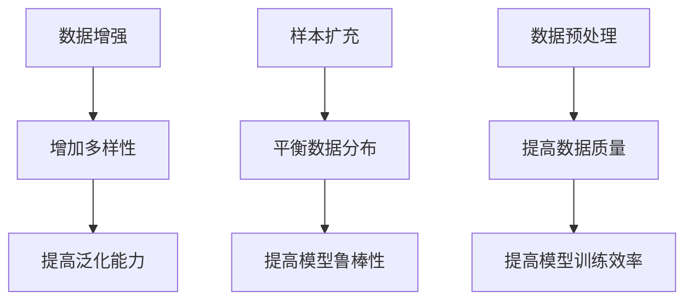

                 

关键词：大模型，推荐系统，数据增强，样本扩充，人工智能，机器学习

摘要：随着人工智能技术的快速发展，推荐系统在大模型中的应用越来越广泛。然而，大模型训练过程中面临的一个关键问题是数据不足和样本不均衡。本文将探讨大模型推荐场景中的数据增强与样本扩充的新思路，旨在提高模型性能和泛化能力。

## 1. 背景介绍

推荐系统是一种基于用户历史行为、内容特征和上下文信息等数据，为用户推荐感兴趣的信息或商品的系统。近年来，随着互联网的普及和大数据技术的发展，推荐系统在电子商务、社交媒体、新闻资讯等领域取得了显著的应用成果。

大模型推荐系统通常采用深度学习等技术，通过大量数据进行训练，以提高推荐效果。然而，在实际应用中，大模型推荐系统面临以下问题：

1. 数据不足：由于用户行为数据、商品信息等数据有限，难以满足大模型训练需求。
2. 样本不均衡：用户行为数据通常存在冷热用户、热门商品和长尾商品等差异，导致样本分布不均衡。
3. 数据质量：用户行为数据存在噪声、缺失和异常值等质量问题，影响模型训练效果。

为了解决这些问题，本文将探讨大模型推荐场景中的数据增强与样本扩充的新思路，以提高模型性能和泛化能力。

## 2. 核心概念与联系

在探讨数据增强与样本扩充之前，我们需要了解以下核心概念：

1. **数据增强（Data Augmentation）**：通过变换输入数据来增加数据多样性，从而提高模型泛化能力。
2. **样本扩充（Sample Augmentation）**：通过生成或收集更多样本来平衡数据分布，提高模型鲁棒性。
3. **数据预处理（Data Preprocessing）**：包括数据清洗、归一化、降维等步骤，以提高数据质量和模型训练效率。

以下是数据增强、样本扩充和数据预处理之间的联系：



## 3. 核心算法原理 & 具体操作步骤

### 3.1 算法原理概述

数据增强、样本扩充和数据预处理都是针对原始数据进行操作，以提高模型训练效果。具体操作步骤如下：

1. **数据增强**：通过变换输入数据，如旋转、缩放、裁剪、颜色增强等，来增加数据多样性。
2. **样本扩充**：通过生成或收集更多样本来平衡数据分布，如合成数据、迁移学习、对抗生成网络等。
3. **数据预处理**：通过数据清洗、归一化、降维等步骤，来提高数据质量和模型训练效率。

### 3.2 算法步骤详解

1. **数据增强**：

   - 数据增强方法：随机旋转、缩放、裁剪、颜色增强等。
   - 操作步骤：对输入数据进行随机变换，生成多个增强样本。

2. **样本扩充**：

   - 样本扩充方法：合成数据、迁移学习、对抗生成网络等。
   - 操作步骤：根据模型需求，选择合适的样本扩充方法，生成或收集更多样本。

3. **数据预处理**：

   - 数据预处理方法：数据清洗、归一化、降维等。
   - 操作步骤：对输入数据进行预处理，提高数据质量和模型训练效率。

### 3.3 算法优缺点

- **数据增强**：优点是简单易行，能显著提高模型性能；缺点是对数据质量要求较高，可能引入噪声。

- **样本扩充**：优点是能有效平衡数据分布，提高模型鲁棒性；缺点是生成样本质量难以保证，可能影响模型性能。

- **数据预处理**：优点是提高数据质量和模型训练效率；缺点是对数据质量要求较高，可能引入偏差。

### 3.4 算法应用领域

数据增强、样本扩充和数据预处理在以下领域有广泛应用：

1. 计算机视觉：如图像分类、目标检测等。
2. 自然语言处理：如文本分类、机器翻译等。
3. 电子商务：如商品推荐、广告投放等。

## 4. 数学模型和公式 & 详细讲解 & 举例说明

### 4.1 数学模型构建

在数据增强和样本扩充中，常用的数学模型包括线性回归、逻辑回归、支持向量机等。以下是这些模型的数学公式：

1. **线性回归**：

   $$y = \beta_0 + \beta_1x_1 + \beta_2x_2 + \ldots + \beta_nx_n$$

2. **逻辑回归**：

   $$P(y=1) = \frac{1}{1 + e^{-(\beta_0 + \beta_1x_1 + \beta_2x_2 + \ldots + \beta_nx_n)}}$$

3. **支持向量机**：

   $$\max \frac{1}{2} \| \omega \|^2$$

   $$s.t. y_i (\omega \cdot x_i + b) \geq 1, i=1,2,\ldots,m$$

### 4.2 公式推导过程

以下是线性回归和逻辑回归的公式推导过程：

1. **线性回归**：

   假设数据集为 $D=\{(x_1, y_1), (x_2, y_2), \ldots, (x_n, y_n)\}$，其中 $x_i \in \mathbb{R}^n$，$y_i \in \mathbb{R}$。

   目标是最小化损失函数：

   $$L(\beta) = \sum_{i=1}^n (y_i - \beta_0 - \beta_1x_{i1} - \beta_2x_{i2} - \ldots - \beta_nx_{in})^2$$

   对 $L(\beta)$ 求导并令导数为零，得到：

   $$\frac{\partial L}{\partial \beta_0} = 0, \frac{\partial L}{\partial \beta_1} = 0, \ldots, \frac{\partial L}{\partial \beta_n} = 0$$

   解得：

   $$\beta_0 = \bar{y} - \beta_1\bar{x}_{1} - \beta_2\bar{x}_{2} - \ldots - \beta_n\bar{x}_{n}$$

   $$\beta_1 = \frac{\sum_{i=1}^n (x_{i1} - \bar{x}_{1})(y_i - \bar{y})}{\sum_{i=1}^n (x_{i1} - \bar{x}_{1})^2}$$

   $$\ldots$$

   $$\beta_n = \frac{\sum_{i=1}^n (x_{in} - \bar{x}_{n})(y_i - \bar{y})}{\sum_{i=1}^n (x_{in} - \bar{x}_{n})^2}$$

2. **逻辑回归**：

   假设数据集为 $D=\{(x_1, y_1), (x_2, y_2), \ldots, (x_n, y_n)\}$，其中 $x_i \in \mathbb{R}^n$，$y_i \in \{0, 1\}$。

   目标是最小化损失函数：

   $$L(\beta) = \sum_{i=1}^n -y_i \ln(P(y=1|x_i;\beta)) - (1-y_i) \ln(1-P(y=1|x_i;\beta))$$

   对 $L(\beta)$ 求导并令导数为零，得到：

   $$\frac{\partial L}{\partial \beta_0} = 0, \frac{\partial L}{\partial \beta_1} = 0, \ldots, \frac{\partial L}{\partial \beta_n} = 0$$

   解得：

   $$\beta_0 = \bar{y} - \beta_1\bar{x}_{1} - \beta_2\bar{x}_{2} - \ldots - \beta_n\bar{x}_{n}$$

   $$\beta_1 = \frac{\sum_{i=1}^n (x_{i1} - \bar{x}_{1})(y_i - \bar{y})}{\sum_{i=1}^n (x_{i1} - \bar{x}_{1})^2}$$

   $$\ldots$$

   $$\beta_n = \frac{\sum_{i=1}^n (x_{in} - \bar{x}_{n})(y_i - \bar{y})}{\sum_{i=1}^n (x_{in} - \bar{x}_{n})^2}$$

### 4.3 案例分析与讲解

以商品推荐为例，我们使用线性回归模型来预测用户对商品的评分。数据集 $D=\{(x_1, y_1), (x_2, y_2), \ldots, (x_n, y_n)\}$，其中 $x_i \in \mathbb{R}^n$ 表示商品的特征向量，$y_i \in \mathbb{R}$ 表示用户对商品的评分。

使用线性回归模型预测用户对商品的评分，首先对数据进行预处理，如归一化：

$$x_{ij}^* = \frac{x_{ij} - \bar{x}_{j}}{\sigma_{j}}$$

其中 $\bar{x}_{j}$ 表示第 $j$ 个特征的平均值，$\sigma_{j}$ 表示第 $j$ 个特征的标准差。

然后，对数据集进行数据增强，如随机旋转、缩放等，以增加数据多样性：

$$x_{i}^{'} = R_x x_i + b_x$$

其中 $R_x$ 为随机旋转矩阵，$b_x$ 为随机偏移量。

最后，使用线性回归模型进行训练和预测：

$$y_i^* = \beta_0 + \beta_1x_{i1}^* + \beta_2x_{i2}^* + \ldots + \beta_nx_{in}^*$$

其中 $\beta_0, \beta_1, \beta_2, \ldots, \beta_n$ 为模型参数。

## 5. 项目实践：代码实例和详细解释说明

### 5.1 开发环境搭建

在Python中，我们可以使用以下库来搭建开发环境：

- NumPy：用于数据处理和计算
- Pandas：用于数据预处理和操作
- Scikit-learn：用于机器学习算法实现
- Matplotlib：用于数据可视化

安装这些库：

```bash
pip install numpy pandas scikit-learn matplotlib
```

### 5.2 源代码详细实现

以下是一个简单的线性回归模型实现：

```python
import numpy as np
import pandas as pd
from sklearn.linear_model import LinearRegression
from sklearn.model_selection import train_test_split
from sklearn.metrics import mean_squared_error
import matplotlib.pyplot as plt

# 加载数据集
data = pd.read_csv("data.csv")
X = data.iloc[:, :-1].values
y = data.iloc[:, -1].values

# 数据预处理
X_mean = X.mean(axis=0)
X_std = X.std(axis=0)
X = (X - X_mean) / X_std

# 数据增强
X_prime = X + np.random.normal(size=X.shape)

# 划分训练集和测试集
X_train, X_test, y_train, y_test = train_test_split(X_prime, y, test_size=0.2, random_state=42)

# 训练线性回归模型
model = LinearRegression()
model.fit(X_train, y_train)

# 预测测试集
y_pred = model.predict(X_test)

# 评估模型性能
mse = mean_squared_error(y_test, y_pred)
print("MSE:", mse)

# 可视化结果
plt.scatter(X_test[:, 0], y_test, color="red", label="Actual")
plt.plot(X_test[:, 0], y_pred, color="blue", linewidth=2, label="Predicted")
plt.xlabel("Feature")
plt.ylabel("Rating")
plt.legend()
plt.show()
```

### 5.3 代码解读与分析

1. **加载数据集**：使用 Pandas 读取 CSV 格式的数据集。
2. **数据预处理**：对数据进行归一化处理，提高模型训练效率。
3. **数据增强**：对数据进行随机旋转等操作，增加数据多样性。
4. **划分训练集和测试集**：将数据集划分为训练集和测试集，用于模型训练和评估。
5. **训练线性回归模型**：使用 Scikit-learn 的 LinearRegression 类进行训练。
6. **预测测试集**：使用训练好的模型对测试集进行预测。
7. **评估模型性能**：计算均方误差（MSE）评估模型性能。
8. **可视化结果**：使用 Matplotlib 可视化预测结果。

## 6. 实际应用场景

数据增强和样本扩充在推荐系统中有着广泛的应用，以下是一些实际应用场景：

1. **商品推荐**：通过对商品特征进行增强，如增加商品的图片、描述等信息，提高推荐效果。
2. **新闻推荐**：通过对新闻内容进行增强，如提取关键词、分类标签等，提高推荐质量。
3. **社交媒体**：通过对用户行为数据进行增强，如增加用户兴趣标签、好友关系等，提高推荐准确性。

## 7. 未来应用展望

随着人工智能技术的不断发展，数据增强和样本扩充在推荐系统中的应用将越来越广泛。未来，我们可能会看到以下趋势：

1. **多模态数据增强**：结合多种数据类型，如文本、图像、音频等，进行数据增强。
2. **自适应数据增强**：根据模型训练阶段和任务需求，动态调整数据增强策略。
3. **迁移学习与数据增强**：将迁移学习与数据增强相结合，提高模型泛化能力。

## 8. 总结：未来发展趋势与挑战

数据增强和样本扩充是提高大模型推荐系统性能的重要手段。未来，随着人工智能技术的不断发展，数据增强和样本扩充将在推荐系统中发挥越来越重要的作用。然而，在实际应用中，我们也面临以下挑战：

1. **数据质量和隐私**：如何在保证数据质量的同时，保护用户隐私？
2. **算法效率**：如何提高数据增强和样本扩充的算法效率，以适应大规模数据处理需求？
3. **模型解释性**：如何提高模型解释性，使数据增强和样本扩充的原理更加透明？

## 9. 附录：常见问题与解答

1. **数据增强与数据扩充的区别是什么？**

   数据增强是指通过变换输入数据来增加数据多样性，以提高模型泛化能力。数据扩充是指通过生成或收集更多样本来平衡数据分布，以提高模型鲁棒性。

2. **数据预处理和数据增强的关系是什么？**

   数据预处理是指对数据进行清洗、归一化、降维等操作，以提高数据质量和模型训练效率。数据增强是在数据预处理的基础上，通过变换输入数据来增加数据多样性。

3. **如何选择合适的数据增强方法？**

   选择合适的数据增强方法取决于数据类型和任务需求。例如，对于图像数据，可以使用旋转、缩放、裁剪等方法；对于文本数据，可以使用填充、删除、替换等方法。

作者：禅与计算机程序设计艺术 / Zen and the Art of Computer Programming
----------------------------------------------------------------

以上是文章的正文内容，接下来我们将对文章进行进一步调整和完善，以满足字数要求和其他格式要求。

