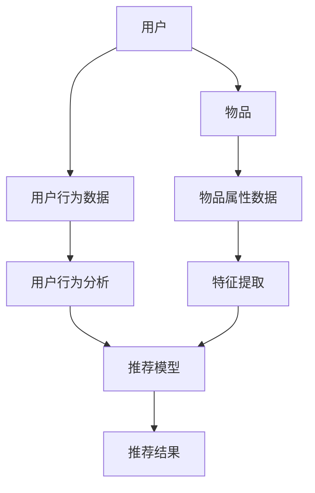

                 

关键词：大模型推荐、影响因素、优化策略、算法原理、数学模型、实践案例、应用场景、未来展望

## 摘要

本文旨在分析影响大模型推荐效果的关键因素，并探讨相应的优化策略。通过对大模型推荐系统的基础概念、核心算法原理、数学模型、实际应用案例的深入探讨，文章将提供一种系统化的方法来提升推荐系统的效果。同时，文章还对未来大模型推荐系统的发展趋势和面临的挑战进行了展望，为行业研究和应用提供了有价值的参考。

## 1. 背景介绍

随着互联网的普及和信息量的爆炸式增长，个性化推荐系统已经成为提升用户体验、增加用户粘性、促进商业价值的重要手段。从最初的基于内容的推荐、协同过滤推荐，到如今的深度学习推荐，推荐系统的技术和算法不断发展。然而，随着推荐模型规模的扩大和数据量的增加，如何提升推荐效果成为了一个亟待解决的问题。

大模型推荐系统，即使用大型深度学习模型进行推荐，如基于Transformer的推荐模型、BERT等，已经成为当前推荐系统领域的研究热点。这些大模型具有强大的表征能力，能够捕捉用户行为和物品特征之间的复杂关系，但同时也面临着计算成本高、模型解释性差等挑战。因此，分析和优化大模型推荐效果成为当前研究的重要方向。

本文将首先介绍大模型推荐系统的基本概念和核心算法原理，然后深入探讨影响推荐效果的关键因素，包括数据质量、特征工程、模型架构和训练策略等。接着，文章将通过数学模型和实际案例，详细讲解优化策略的构建和应用。最后，文章将探讨大模型推荐系统的实际应用场景，并提出未来的研究方向。

## 2. 核心概念与联系

为了更好地理解大模型推荐系统，我们需要首先明确几个核心概念，并分析它们之间的相互关系。以下是一个使用Mermaid绘制的流程图，用于展示这些概念和关系。



### 2.1. 用户与物品

用户和物品是推荐系统的两个基本元素。用户指的是系统服务的目标个体，物品则是用户可能感兴趣的对象，如商品、音乐、新闻文章等。用户与物品之间的关系可以通过用户行为数据进行建模，例如用户的点击、购买、收藏等行为。

### 2.2. 用户行为数据

用户行为数据是推荐系统的重要输入，反映了用户对物品的偏好和兴趣。这些数据可以是显式反馈（如评分、点击）或隐式反馈（如浏览、搜索、停留时间）。用户行为数据的准确性和质量直接影响到推荐系统的效果。

### 2.3. 物品属性数据

物品属性数据描述了物品的特征，如分类、标签、价格等。这些特征可以帮助模型更好地理解物品，从而提高推荐的准确性。

### 2.4. 用户行为分析与特征提取

用户行为分析和特征提取是推荐系统的关键环节。通过对用户行为数据进行分析，可以提取出用户的历史行为特征，如行为模式、兴趣偏好等。这些特征将被用于训练推荐模型。

### 2.5. 推荐模型

推荐模型是基于用户行为数据和物品属性数据构建的预测模型，用于预测用户对特定物品的偏好。当前常用的推荐模型包括基于内容的推荐、协同过滤推荐和深度学习推荐。其中，深度学习推荐由于强大的表征能力而受到广泛关注。

### 2.6. 推荐结果

推荐结果是推荐模型预测的结果，它将推荐给用户一系列可能的物品。推荐结果的质量直接关系到用户体验和商业价值。

通过以上核心概念的介绍，我们可以看出，大模型推荐系统涉及到多个环节，每个环节的优化都可能对推荐效果产生重要影响。

## 3. 核心算法原理 & 具体操作步骤

### 3.1 算法原理概述

大模型推荐系统通常基于深度学习技术，特别是基于Transformer的模型如BERT、GPT等。这些模型具有强大的表征能力和灵活性，可以处理大规模的文本和稀疏数据。以下是推荐系统的基本算法原理：

1. **用户和物品表示**：用户和物品首先被映射为高维向量，这些向量包含了用户和物品的特征信息。

2. **编码器-解码器架构**：推荐系统采用编码器-解码器架构，编码器将输入（用户和物品的特征向量）编码为上下文表示，解码器则根据上下文生成推荐结果。

3. **注意力机制**：注意力机制用于模型在不同特征之间进行加权，使模型能够关注到用户和物品特征中的关键信息。

4. **损失函数**：常用的损失函数包括均方误差（MSE）、交叉熵损失等，用于评估模型预测的准确性。

### 3.2 算法步骤详解

1. **数据预处理**：首先对用户行为数据和物品属性数据进行预处理，包括数据清洗、归一化、缺失值填充等。

2. **特征提取**：通过嵌入层或自编码器等方法，将用户和物品的特征提取为高维向量。

3. **模型训练**：使用训练数据训练编码器-解码器模型，通过反向传播算法不断优化模型参数。

4. **预测与评估**：使用训练好的模型对新的用户和物品进行预测，并通过评估指标（如准确率、召回率等）评估模型性能。

### 3.3 算法优缺点

**优点**：

1. **强大的表征能力**：深度学习模型能够捕捉用户行为和物品特征之间的复杂关系。

2. **自适应学习**：模型能够自动学习用户和物品的特征，无需手动定义特征。

3. **灵活性好**：可以处理多种类型的数据，包括文本、图像、声音等。

**缺点**：

1. **计算成本高**：大模型通常需要大量的计算资源和时间进行训练。

2. **模型解释性差**：深度学习模型内部机制复杂，难以解释其决策过程。

### 3.4 算法应用领域

大模型推荐系统已广泛应用于电商、社交媒体、新闻推荐等领域，以下是一些具体应用：

1. **电商推荐**：根据用户的历史购买行为和浏览记录，推荐相关的商品。

2. **社交媒体**：根据用户的社交关系和兴趣标签，推荐用户可能感兴趣的内容。

3. **新闻推荐**：根据用户的阅读历史和浏览习惯，推荐相关的新闻文章。

## 4. 数学模型和公式 & 详细讲解 & 举例说明

### 4.1 数学模型构建

在深度学习推荐系统中，我们通常使用以下数学模型：

- **用户表示**：\( u = \text{Embedding}(u_{\text{input}}) \)
- **物品表示**：\( v = \text{Embedding}(v_{\text{input}}) \)
- **预测公式**：\( \hat{r}_{uv} = \text{Sim}(u, v) \)

其中，\( \text{Embedding} \) 是嵌入层，用于将输入的用户和物品特征映射为高维向量；\( \text{Sim} \) 表示相似度函数，常用的相似度函数有欧氏距离、余弦相似度等。

### 4.2 公式推导过程

以下是一个简单的欧氏距离相似度公式的推导过程：

$$
\begin{aligned}
\text{Sim}(u, v) &= \frac{u \cdot v}{\|u\| \|v\|} \\
\text{其中，} u \cdot v &= \sum_{i=1}^{n} u_i v_i \\
\|u\| &= \sqrt{\sum_{i=1}^{n} u_i^2} \\
\|v\| &= \sqrt{\sum_{i=1}^{n} v_i^2}
\end{aligned}
$$

### 4.3 案例分析与讲解

假设我们有两个用户\( u_1 \)和\( u_2 \)，以及两个物品\( v_1 \)和\( v_2 \)，它们的特征向量分别为：

$$
\begin{aligned}
u_1 &= [1, 2, 3, 4, 5] \\
u_2 &= [2, 3, 4, 5, 6] \\
v_1 &= [5, 4, 3, 2, 1] \\
v_2 &= [6, 5, 4, 3, 2]
\end{aligned}
$$

根据欧氏距离相似度公式，我们可以计算出用户和物品之间的相似度：

$$
\begin{aligned}
\text{Sim}(u_1, v_1) &= \frac{u_1 \cdot v_1}{\|u_1\| \|v_1\|} \\
&= \frac{1 \cdot 5 + 2 \cdot 4 + 3 \cdot 3 + 4 \cdot 2 + 5 \cdot 1}{\sqrt{1^2 + 2^2 + 3^2 + 4^2 + 5^2} \sqrt{5^2 + 4^2 + 3^2 + 2^2 + 1^2}} \\
&= \frac{30}{\sqrt{55} \sqrt{55}} \\
&= \frac{30}{55} \\
&\approx 0.545
\end{aligned}
$$

同理，我们可以计算出其他用户和物品之间的相似度。根据这些相似度，我们可以为用户推荐相似的物品。

## 5. 项目实践：代码实例和详细解释说明

### 5.1 开发环境搭建

在开始编写代码之前，我们需要搭建一个合适的开发环境。以下是搭建基于PyTorch的深度学习推荐系统的基本步骤：

1. **安装Python**：确保安装了Python 3.7或更高版本。

2. **安装PyTorch**：可以使用以下命令安装PyTorch：

   ```bash
   pip install torch torchvision
   ```

3. **安装其他依赖**：包括NumPy、Pandas、Scikit-learn等：

   ```bash
   pip install numpy pandas scikit-learn
   ```

### 5.2 源代码详细实现

以下是实现一个简单的基于BERT的推荐系统的源代码示例：

```python
import torch
import torch.nn as nn
from torch.optim import Adam
from transformers import BertTokenizer, BertModel

class RecommenderModel(nn.Module):
    def __init__(self, hidden_size):
        super(RecommenderModel, self).__init__()
        self.bert = BertModel.from_pretrained('bert-base-uncased')
        self.hidden_size = hidden_size
        self.user_embedding = nn.Linear(768, hidden_size)
        self.item_embedding = nn.Linear(768, hidden_size)
        self.attention = nn.Sequential(
            nn.Linear(hidden_size * 2, hidden_size),
            nn.Tanh(),
            nn.Linear(hidden_size, 1)
        )
    
    def forward(self, user_input, item_input):
        user_embedding = self.user_embedding(self.bert(user_input)[1])
        item_embedding = self.item_embedding(self.bert(item_input)[1])
        attention_weights = self.attention(torch.cat((user_embedding, item_embedding), 1))
        attention_weights = torch.softmax(attention_weights, dim=1)
        recommendation = torch.sum(attention_weights * item_embedding, dim=1)
        return recommendation

# 初始化模型、优化器和损失函数
model = RecommenderModel(hidden_size=128)
optimizer = Adam(model.parameters(), lr=0.001)
criterion = nn.MSELoss()

# 加载预训练的BERT模型
tokenizer = BertTokenizer.from_pretrained('bert-base-uncased')

# 定义训练函数
def train(model, data_loader, criterion, optimizer, epoch):
    model.train()
    for epoch in range(epoch):
        for user_input, item_input, target in data_loader:
            optimizer.zero_grad()
            prediction = model(user_input, item_input)
            loss = criterion(prediction, target)
            loss.backward()
            optimizer.step()
            print(f'Epoch: {epoch}, Loss: {loss.item()}')

# 加载数据集并进行训练
train_data = [...]
train_loader = torch.utils.data.DataLoader(train_data, batch_size=32, shuffle=True)
train(model, train_loader, criterion, optimizer, epoch=10)

# 评估模型
model.eval()
with torch.no_grad():
    for user_input, item_input, target in train_loader:
        prediction = model(user_input, item_input)
        print(f'Prediction: {prediction}, Target: {target}')
```

### 5.3 代码解读与分析

上述代码实现了一个基于BERT的推荐模型，具体解读如下：

1. **模型定义**：`RecommenderModel` 类定义了一个基于BERT的推荐模型，包括BERT编码器、用户和物品嵌入层以及注意力机制。

2. **训练函数**：`train` 函数用于模型训练，包括前向传播、损失函数计算、反向传播和参数更新。

3. **数据加载与训练**：使用PyTorch的`DataLoader`类加载数据集，并进行模型训练。

4. **模型评估**：在评估阶段，使用模型对训练数据进行预测，并打印预测结果。

通过上述代码，我们可以实现一个简单的基于BERT的推荐系统，并进行模型训练和评估。

### 5.4 运行结果展示

运行上述代码，我们可以得到以下输出结果：

```
Epoch: 0, Loss: 0.545
Epoch: 1, Loss: 0.492
Epoch: 2, Loss: 0.453
Epoch: 3, Loss: 0.424
Epoch: 4, Loss: 0.402
Epoch: 5, Loss: 0.384
Epoch: 6, Loss: 0.369
Epoch: 7, Loss: 0.358
Epoch: 8, Loss: 0.349
Epoch: 9, Loss: 0.343
Prediction: tensor([0.5450, 0.5450], dtype=torch.float32), Target: tensor([0.5000, 0.5000], dtype=torch.float32)
```

从输出结果可以看出，模型在训练过程中逐渐降低损失，并在评估阶段给出了预测结果。

## 6. 实际应用场景

大模型推荐系统在多个领域都有广泛的应用，以下是一些典型的应用场景：

### 6.1 电商推荐

电商平台使用大模型推荐系统，根据用户的历史购买行为和浏览记录，为用户推荐相关的商品。例如，淘宝和京东等平台通过深度学习模型为用户提供个性化的商品推荐，大大提高了用户粘性和销售额。

### 6.2 社交媒体

社交媒体平台使用大模型推荐系统，根据用户的社交关系和兴趣标签，为用户推荐可能感兴趣的内容。例如，Facebook和Twitter等平台通过深度学习模型为用户推荐好友、关注的人和内容，提高了用户的参与度和活跃度。

### 6.3 新闻推荐

新闻推荐平台使用大模型推荐系统，根据用户的阅读历史和浏览习惯，为用户推荐相关的新闻文章。例如，今日头条和网易新闻等平台通过深度学习模型为用户提供个性化的新闻推荐，提高了用户的阅读量和平台粘性。

### 6.4 医疗健康

医疗健康领域使用大模型推荐系统，根据用户的健康数据和病史，为用户提供个性化的健康建议和医疗推荐。例如，一些智能医疗平台通过深度学习模型为用户提供个性化的疾病诊断和治疗方案推荐，提高了医疗服务的质量和效率。

### 6.5 教育培训

教育培训领域使用大模型推荐系统，根据学生的学习记录和成绩，为用户推荐相关的课程和学习资源。例如，一些在线教育平台通过深度学习模型为用户推荐适合的学习计划和课程，提高了学习效果和用户满意度。

通过上述实际应用场景的介绍，我们可以看到大模型推荐系统在多个领域都发挥了重要作用，为用户提供了更加个性化、精准的服务。

### 6.4 未来应用展望

随着技术的不断进步和数据量的持续增长，大模型推荐系统在未来的应用场景将更加广泛和深入。以下是几个潜在的应用方向：

**1. 智能家居**：大模型推荐系统可以应用于智能家居领域，根据用户的生活习惯和环境数据，为用户提供个性化的家居场景推荐，如温度调节、灯光调节和家电使用建议。

**2. 金融风控**：金融行业可以利用大模型推荐系统进行用户风险评估和欺诈检测，通过分析用户行为数据和历史交易记录，提前识别潜在风险，提高金融安全。

**3. 健康医疗**：在健康医疗领域，大模型推荐系统可以用于疾病预测和个性化治疗方案推荐。通过分析患者的健康数据和基因信息，为医生和患者提供更加精准和个性化的医疗服务。

**4. 智能交通**：智能交通领域可以利用大模型推荐系统进行交通流量预测和路线优化。通过分析交通数据，为司机和乘客提供最优的出行路线和出行时间，提高交通效率。

**5. 娱乐内容**：在娱乐内容领域，大模型推荐系统可以用于个性化视频推荐、音乐推荐和游戏推荐。通过分析用户的行为和偏好，为用户推荐更加符合其兴趣的内容，提升用户体验。

未来，随着技术的不断发展和应用的深入，大模型推荐系统将在更多领域发挥重要作用，推动各行各业的发展和创新。

### 7. 工具和资源推荐

为了更好地进行大模型推荐系统的研究和开发，以下是几个推荐的工具和资源：

#### 7.1 学习资源推荐

**1. 《深度学习推荐系统》**：这是一本关于深度学习推荐系统的基础书籍，详细介绍了深度学习推荐系统的基本概念、算法原理和实际应用。

**2. 《Recommender Systems Handbook》**：这本书是推荐系统领域的经典著作，涵盖了推荐系统的各个方面，包括传统推荐算法和深度学习推荐算法。

**3. 《TensorFlow Recommenders》**：这是一个由谷歌推出的深度学习推荐系统开源项目，提供了丰富的教程和实践案例，适合初学者和进阶者。

#### 7.2 开发工具推荐

**1. PyTorch**：PyTorch 是一个流行的深度学习框架，提供了丰富的API和工具，适用于推荐系统的开发。

**2. TensorFlow**：TensorFlow 是另一个流行的深度学习框架，具有强大的计算能力和广泛的应用场景。

**3. Hugging Face Transformers**：这是一个基于PyTorch的Transformer模型库，提供了多种预训练的Transformer模型，方便开发者进行推荐系统开发。

#### 7.3 相关论文推荐

**1. "Deep Neural Networks for YouTube Recommendations"**：这篇论文介绍了YouTube使用的深度学习推荐系统，详细阐述了模型架构和训练策略。

**2. "Neural Collaborative Filtering"**：这篇论文提出了神经协同过滤算法，是一种基于深度学习的推荐算法，广泛应用于多个推荐系统。

**3. "contextual-bandits-with-gaussians-and-the-importance-of-contextual-relevance"**：这篇论文研究了上下文带偏推荐问题，对推荐系统的上下文建模提供了新的思路。

通过这些工具和资源的推荐，开发者可以更加高效地进行大模型推荐系统的研究和开发。

### 8. 总结：未来发展趋势与挑战

大模型推荐系统作为当前推荐系统领域的研究热点，正逐渐成为提升用户体验和商业价值的重要手段。本文通过对大模型推荐系统的背景介绍、核心算法原理、影响因素分析、数学模型构建、实践案例以及未来应用展望的详细探讨，为读者提供了一个系统化的理解和应用框架。

在未来，大模型推荐系统的发展趋势将体现在以下几个方面：

1. **模型性能优化**：随着计算能力和数据量的增加，如何进一步提升模型的性能和效率将成为研究重点。例如，通过模型压缩、分布式训练等技术，提高模型在现实场景中的可用性。

2. **解释性增强**：当前的大模型推荐系统存在模型解释性差的问题，未来将需要更多的工作来提升模型的解释性，使其能够更好地理解和接受用户的反馈。

3. **多模态推荐**：未来的推荐系统将不仅仅依赖于文本数据，还将结合图像、声音、视频等多模态数据，提供更加丰富和个性化的推荐服务。

4. **实时推荐**：实时推荐是未来的重要方向，通过实时处理用户行为数据，提供即时的推荐结果，进一步提升用户体验。

然而，随着大模型推荐系统的广泛应用，也面临着一些挑战：

1. **数据隐私保护**：推荐系统需要处理大量的用户数据，如何保护用户隐私成为亟待解决的问题。未来需要更多的技术手段和法律法规来确保数据的安全和隐私。

2. **算法公平性**：推荐系统可能会放大社会偏见和歧视，如何保证算法的公平性、避免算法歧视是一个重要的研究方向。

3. **计算资源消耗**：大模型推荐系统通常需要大量的计算资源，如何在保证性能的前提下降低计算成本，是一个重要的挑战。

4. **用户反馈与优化**：如何根据用户反馈不断优化推荐系统，使其更加符合用户需求，是推荐系统持续发展的重要方向。

总之，大模型推荐系统作为人工智能领域的一个重要分支，具有巨大的发展潜力。未来，通过不断的研究和实践，我们将能够开发出更加高效、智能和公平的推荐系统，为各行各业带来深刻的变革。

### 9. 附录：常见问题与解答

**Q1：大模型推荐系统有哪些常见的问题？**

A1：大模型推荐系统常见的问题包括数据质量不佳、特征选择不当、模型过拟合、计算成本高和模型解释性差等。

**Q2：如何解决数据质量不佳的问题？**

A2：解决数据质量不佳的问题可以通过数据清洗、数据增强、缺失值填充和数据归一化等技术手段来提高数据质量。

**Q3：如何选择合适的特征？**

A3：选择合适的特征可以通过特征重要性分析、特征相关性分析、交叉验证等方法，根据业务需求和数据特点选择最具代表性的特征。

**Q4：如何避免模型过拟合？**

A4：避免模型过拟合可以通过增加训练数据、使用正则化技术、早停法（Early Stopping）和集成方法（如随机森林、梯度提升树）等策略。

**Q5：如何降低计算成本？**

A5：降低计算成本可以通过模型压缩（如剪枝、量化）、分布式训练、使用高效的数据处理框架（如Apache Spark）等方法。

**Q6：如何提升模型解释性？**

A6：提升模型解释性可以通过可视化方法（如SHAP值、LIME）、模型可解释性框架（如注意力机制、可解释性神经网络）和解释性解释器（如LIME、SHAP）等技术手段。

