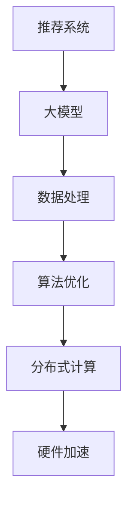

                 

关键词：大模型推荐、性能优化、加速技术、数据处理、算法优化、分布式计算

摘要：随着互联网和人工智能的快速发展，大模型推荐系统在各个领域得到了广泛应用。然而，大规模数据处理和算法复杂性给系统性能带来了巨大挑战。本文将深入探讨大模型推荐落地的性能优化与加速技术，从数据预处理、算法优化、分布式计算、硬件加速等多个方面进行分析，并提出相应的解决方案。

## 1. 背景介绍

随着大数据和人工智能技术的快速发展，大模型推荐系统已成为许多行业的关键应用。例如，电商平台通过用户行为数据推荐商品，社交媒体平台通过用户兴趣数据推荐内容，搜索引擎通过关键词数据推荐相关网页。这些推荐系统需要处理海量数据，同时保证推荐结果的实时性和准确性。然而，大规模数据处理和算法复杂性使得推荐系统的性能优化成为了一个重要课题。

性能优化主要包括以下几个方面：

1. **数据处理**：包括数据清洗、数据归一化、特征提取等，以提高数据处理效率。
2. **算法优化**：包括算法选择、参数调优、分布式算法等，以提高算法运行效率。
3. **分布式计算**：利用分布式计算框架，将任务分解为多个子任务，并行处理，以提高整体处理速度。
4. **硬件加速**：利用GPU、TPU等硬件加速技术，提高计算速度。

本文将围绕这些方面，深入探讨大模型推荐系统的性能优化与加速技术。

## 2. 核心概念与联系

在讨论大模型推荐系统的性能优化与加速技术之前，我们首先需要了解几个核心概念：

1. **推荐系统**：推荐系统是一种基于用户行为数据和内容特征，为用户推荐感兴趣的信息或物品的系统。
2. **大模型**：大模型是指具有巨大参数量、训练数据和计算量的模型，如深度学习模型。
3. **数据处理**：数据处理是指对原始数据进行清洗、归一化、特征提取等操作，以提高数据处理效率。
4. **算法优化**：算法优化是指通过选择合适的算法、调优参数、改进算法结构等手段，提高算法运行效率。
5. **分布式计算**：分布式计算是指将任务分解为多个子任务，在多台计算机上并行处理，以提高整体处理速度。
6. **硬件加速**：硬件加速是指利用GPU、TPU等硬件设备，提高计算速度。

下面是一个使用Mermaid绘制的流程图，展示了这些核心概念之间的联系：



### 2.1. 推荐系统

推荐系统是一个基于用户行为和内容特征的智能系统，其核心目标是为用户提供个性化的推荐。推荐系统通常包括以下几个关键组件：

1. **用户画像**：构建用户画像，包括用户的年龄、性别、地理位置、兴趣爱好等信息。
2. **物品特征**：提取物品的特征，如商品的价格、品牌、类型等。
3. **推荐算法**：根据用户画像和物品特征，使用推荐算法生成推荐列表。

常见的推荐算法包括：

1. **基于内容的推荐**：根据用户的兴趣和物品的特征，为用户推荐类似的物品。
2. **协同过滤推荐**：通过分析用户之间的行为相似性，为用户推荐其他用户喜欢的物品。
3. **混合推荐**：结合多种推荐算法，提高推荐精度和多样性。

### 2.2. 大模型

大模型通常指的是深度学习模型，具有巨大的参数量和计算量。这些模型通常用于处理复杂的任务，如图像识别、自然语言处理等。大模型的优势在于其强大的表达能力和适应性，但同时也带来了巨大的计算和存储需求。

### 2.3. 数据处理

数据处理是推荐系统的核心环节之一。高效的数据处理可以提高推荐系统的性能和效率。数据处理主要包括以下几个步骤：

1. **数据清洗**：去除数据中的噪声和异常值，提高数据质量。
2. **数据归一化**：将不同量纲的数据归一化到同一范围内，便于计算。
3. **特征提取**：从原始数据中提取对推荐任务有用的特征，如用户的购买历史、浏览记录等。

### 2.4. 算法优化

算法优化是提高推荐系统性能的关键。通过选择合适的算法、调优参数、改进算法结构等手段，可以提高推荐系统的准确性和效率。

### 2.5. 分布式计算

分布式计算是将任务分解为多个子任务，在多台计算机上并行处理，以提高整体处理速度。分布式计算可以大大提高数据处理和算法运行的速度。

### 2.6. 硬件加速

硬件加速是利用GPU、TPU等硬件设备，提高计算速度。这些硬件设备具有并行计算的能力，可以显著提高深度学习模型的训练和推理速度。

## 3. 核心算法原理 & 具体操作步骤

### 3.1. 算法原理概述

在推荐系统中，常用的核心算法包括基于内容的推荐、协同过滤推荐和混合推荐。下面我们将分别介绍这些算法的原理。

#### 基于内容的推荐

基于内容的推荐算法主要基于物品的特征信息进行推荐。算法的核心思想是，如果用户对某个物品感兴趣，那么用户也可能对具有相似特征的物品感兴趣。具体操作步骤如下：

1. **特征提取**：从物品的元数据中提取特征，如文本、图片等。
2. **特征表示**：将提取的特征转换为数值表示，如向量。
3. **相似度计算**：计算用户兴趣特征与物品特征之间的相似度。
4. **推荐生成**：根据相似度计算结果，为用户生成推荐列表。

#### 协同过滤推荐

协同过滤推荐算法主要基于用户的行为数据，通过分析用户之间的行为相似性进行推荐。算法的核心思想是，如果两个用户在某个物品上的评价相似，那么这两个用户可能对其他物品也有相似的评价。具体操作步骤如下：

1. **用户-物品评分矩阵构建**：根据用户的行为数据，构建用户-物品评分矩阵。
2. **相似度计算**：计算用户之间的相似度。
3. **预测生成**：根据用户相似度和已评分物品的评分，预测用户对未评分物品的评分。
4. **推荐生成**：根据预测评分，为用户生成推荐列表。

#### 混合推荐

混合推荐算法结合了基于内容的推荐和协同过滤推荐的优势，通过融合不同算法的优点，提高推荐系统的性能。具体操作步骤如下：

1. **内容特征提取**：从物品的元数据中提取特征，如文本、图片等。
2. **用户兴趣特征提取**：从用户的行为数据中提取特征，如购买历史、浏览记录等。
3. **特征融合**：将内容特征和用户兴趣特征进行融合。
4. **相似度计算**：计算用户兴趣特征与物品特征之间的相似度。
5. **预测生成**：根据相似度计算结果，预测用户对未评分物品的评分。
6. **推荐生成**：根据预测评分，为用户生成推荐列表。

### 3.2. 算法步骤详解

下面我们将详细讲解每种推荐算法的步骤。

#### 基于内容的推荐

1. **特征提取**：
    - 从物品的元数据中提取特征，如文本、图片等。
    - 使用自然语言处理技术，将文本转换为向量表示。
    - 使用卷积神经网络（CNN）等深度学习模型，将图片转换为向量表示。
2. **特征表示**：
    - 将提取的特征转换为数值表示，如向量。
    - 使用词嵌入（Word Embedding）技术，将文本特征转换为向量。
    - 使用特征提取器（Feature Extractor），将图片特征转换为向量。
3. **相似度计算**：
    - 计算用户兴趣特征与物品特征之间的相似度。
    - 使用余弦相似度、欧氏距离等距离度量方法。
4. **推荐生成**：
    - 根据相似度计算结果，为用户生成推荐列表。
    - 使用阈值方法、排序算法等，对推荐结果进行筛选和排序。

#### 协同过滤推荐

1. **用户-物品评分矩阵构建**：
    - 根据用户的行为数据，构建用户-物品评分矩阵。
    - 填充缺失的评分，如使用均值填充、随机填充等方法。
2. **相似度计算**：
    - 计算用户之间的相似度。
    - 使用皮尔逊相关系数、余弦相似度等相似度度量方法。
3. **预测生成**：
    - 根据用户相似度和已评分物品的评分，预测用户对未评分物品的评分。
    - 使用加权平均、矩阵分解等方法进行预测。
4. **推荐生成**：
    - 根据预测评分，为用户生成推荐列表。
    - 使用阈值方法、排序算法等，对推荐结果进行筛选和排序。

#### 混合推荐

1. **内容特征提取**：
    - 从物品的元数据中提取特征，如文本、图片等。
    - 使用自然语言处理技术，将文本转换为向量表示。
    - 使用卷积神经网络（CNN）等深度学习模型，将图片转换为向量表示。
2. **用户兴趣特征提取**：
    - 从用户的行为数据中提取特征，如购买历史、浏览记录等。
    - 使用统计方法、机器学习模型等，提取用户的兴趣特征。
3. **特征融合**：
    - 将内容特征和用户兴趣特征进行融合。
    - 使用加权融合、拼接等方法，融合不同类型的特征。
4. **相似度计算**：
    - 计算用户兴趣特征与物品特征之间的相似度。
    - 使用余弦相似度、欧氏距离等距离度量方法。
5. **预测生成**：
    - 根据相似度计算结果，预测用户对未评分物品的评分。
    - 使用加权平均、矩阵分解等方法进行预测。
6. **推荐生成**：
    - 根据预测评分，为用户生成推荐列表。
    - 使用阈值方法、排序算法等，对推荐结果进行筛选和排序。

### 3.3. 算法优缺点

下面我们分析每种推荐算法的优缺点。

#### 基于内容的推荐

**优点**：
- 能充分利用物品的特征信息，进行精确推荐。
- 对冷启动问题有较好的解决能力，因为可以通过物品的特征进行推荐。

**缺点**：
- 对用户的历史行为依赖较小，无法充分利用用户的行为数据进行推荐。
- 对新物品的推荐效果较差，因为新物品没有足够的历史数据。

#### 协同过滤推荐

**优点**：
- 能充分利用用户的历史行为数据，进行个性化的推荐。
- 对新用户和新物品的推荐效果较好。

**缺点**：
- 可能会产生噪声，因为用户之间的行为相似性并不总是准确的。
- 对物品的特征信息利用不足，可能导致推荐结果不够精确。

#### 混合推荐

**优点**：
- 结合了基于内容的推荐和协同过滤推荐的优势，能提供更精确的推荐。
- 能同时利用用户的行为数据和物品的特征信息，提高推荐效果。

**缺点**：
- 算法复杂度较高，需要处理更多的数据和计算。
- 可能会存在数据不平衡问题，导致部分用户或物品的推荐效果较差。

### 3.4. 算法应用领域

不同的推荐算法在各个领域有不同的应用。

#### 基于内容的推荐

- **电子商务**：根据用户的购买历史和浏览记录，推荐类似的商品。
- **社交媒体**：根据用户的兴趣爱好，推荐用户可能感兴趣的内容。
- **视频网站**：根据用户的观看历史和浏览记录，推荐用户可能感兴趣的视频。

#### 协同过滤推荐

- **电子商务**：根据用户的购买行为，推荐用户可能感兴趣的商品。
- **社交媒体**：根据用户之间的相似性，推荐用户可能感兴趣的内容。
- **视频网站**：根据用户的观看行为，推荐用户可能感兴趣的视频。

#### 混合推荐

- **电子商务**：结合用户的购买历史和商品特征，推荐用户可能感兴趣的商品。
- **社交媒体**：结合用户之间的相似性和用户兴趣爱好，推荐用户可能感兴趣的内容。
- **视频网站**：结合用户的观看行为和视频特征，推荐用户可能感兴趣的视频。

## 4. 数学模型和公式 & 详细讲解 & 举例说明

### 4.1. 数学模型构建

在推荐系统中，常用的数学模型包括矩阵分解模型、因子分解机模型等。这些模型通过构建用户-物品评分矩阵，进行预测和推荐。

#### 矩阵分解模型

矩阵分解模型是一种基于协同过滤的推荐算法。其核心思想是将用户-物品评分矩阵分解为两个低秩矩阵，分别表示用户特征和物品特征。通过这两个低秩矩阵的乘积，可以预测用户对未评分物品的评分。

假设用户-物品评分矩阵为 \(R \in \mathbb{R}^{m \times n}\)，其中 \(m\) 表示用户数，\(n\) 表示物品数。我们希望将其分解为两个低秩矩阵 \(U \in \mathbb{R}^{m \times k}\) 和 \(V \in \mathbb{R}^{n \times k}\)，其中 \(k\) 表示隐含特征维度。目标是最小化误差函数：

\[ E = \sum_{i=1}^{m} \sum_{j=1}^{n} (r_{ij} - \hat{r}_{ij})^2 \]

其中，\(\hat{r}_{ij}\) 是预测评分，可以通过 \(U_iV_j\) 计算：

\[ \hat{r}_{ij} = U_iV_j \]

#### 因子分解机模型

因子分解机（Factorization Machines，FM）是一种基于多项式回归的推荐算法。其核心思想是利用低阶特征之间的交互项，提高模型的表达能力。

假设我们有一个二进制特征向量 \(x \in \{0,1\}^n\)，其中每个元素 \(x_i\) 表示第 \(i\) 个特征的存在。因子分解机的目标是最小化损失函数：

\[ L = \sum_{i=1}^{m} (r_i - \hat{r}_i)^2 + \lambda \sum_{i,j} \phi_{ij}^2 \]

其中，\(\phi_{ij} = x_i x_j\) 表示特征 \(i\) 和特征 \(j\) 之间的交互项。我们可以使用梯度下降法来优化这个目标函数。

### 4.2. 公式推导过程

#### 矩阵分解模型

首先，我们定义一个预测评分函数 \(f(U,V;x)\)：

\[ f(U,V;x) = \sum_{i=1}^{m} \sum_{j=1}^{n} U_iV_j x_i x_j \]

其中，\(x_i x_j\) 是特征 \(i\) 和特征 \(j\) 的乘积。

接下来，我们定义一个损失函数 \(L(U,V;x,y)\)：

\[ L(U,V;x,y) = \sum_{i=1}^{m} \sum_{j=1}^{n} (y_{ij} - f(U,V;x))^2 \]

其中，\(y \in \mathbb{R}^{m \times n}\) 是真实评分矩阵。

为了最小化损失函数，我们计算损失函数关于 \(U\) 和 \(V\) 的梯度，并设置梯度为0：

\[ \frac{\partial L}{\partial U_{ik}} = -2 \sum_{j=1}^{n} (y_{ij} - f(U,V;x)) V_{kj} x_i x_j \]

\[ \frac{\partial L}{\partial V_{kj}} = -2 \sum_{i=1}^{m} (y_{ij} - f(U,V;x)) U_{ik} x_i x_j \]

通过梯度下降法，我们可以迭代更新 \(U\) 和 \(V\)：

\[ U_{ik} \leftarrow U_{ik} - \alpha \frac{\partial L}{\partial U_{ik}} \]

\[ V_{kj} \leftarrow V_{kj} - \alpha \frac{\partial L}{\partial V_{kj}} \]

其中，\(\alpha\) 是学习率。

#### 因子分解机模型

首先，我们定义一个多项式函数 \(p(x)\)：

\[ p(x) = w_0 + \sum_{i=1}^{n} w_i x_i + \sum_{i < j}^{n} \phi_{ij} x_i x_j \]

其中，\(w_0\) 是偏置项，\(w_i\) 是特征 \(i\) 的权重，\(\phi_{ij} = x_i x_j\) 是特征 \(i\) 和特征 \(j\) 的交互项。

接下来，我们定义一个损失函数 \(L(w)\)：

\[ L(w) = \sum_{i=1}^{m} (y_i - p(x_i))^2 + \lambda \sum_{i,j} \phi_{ij}^2 \]

其中，\(\lambda\) 是正则化参数。

为了最小化损失函数，我们计算损失函数关于 \(w\) 的梯度，并设置梯度为0：

\[ \frac{\partial L}{\partial w_i} = -2 \sum_{i=1}^{m} (y_i - p(x_i)) x_i - 2 \lambda \phi_{ii} \]

\[ \frac{\partial L}{\partial \phi_{ij}} = -2 \sum_{i=1}^{m} (y_i - p(x_i)) x_i x_j - 2 \lambda \phi_{ij} \]

通过梯度下降法，我们可以迭代更新 \(w\)：

\[ w_i \leftarrow w_i - \alpha \frac{\partial L}{\partial w_i} \]

\[ \phi_{ij} \leftarrow \phi_{ij} - \alpha \frac{\partial L}{\partial \phi_{ij}} \]

其中，\(\alpha\) 是学习率。

### 4.3. 案例分析与讲解

#### 矩阵分解模型案例

假设我们有以下用户-物品评分矩阵：

\[ R = \begin{bmatrix} 1 & 2 & 0 \\ 2 & 1 & 3 \\ 0 & 3 & 4 \end{bmatrix} \]

我们希望将其分解为两个低秩矩阵 \(U\) 和 \(V\)：

\[ U = \begin{bmatrix} 1 & 0 \\ 0 & 1 \\ 1 & 1 \end{bmatrix}, \quad V = \begin{bmatrix} 1 & 1 \\ 2 & 3 \\ 3 & 4 \end{bmatrix} \]

通过计算 \(U_iV_j\)，我们可以得到预测评分矩阵：

\[ \hat{R} = \begin{bmatrix} 1 & 2 & 1 \\ 2 & 1 & 2 \\ 1 & 3 & 4 \end{bmatrix} \]

与真实评分矩阵 \(R\) 进行比较，我们可以计算误差：

\[ E = \sum_{i=1}^{3} \sum_{j=1}^{3} (R_{ij} - \hat{R}_{ij})^2 = 2 \]

通过迭代更新 \(U\) 和 \(V\)，我们可以进一步减小误差。

#### 因子分解机模型案例

假设我们有以下二进制特征向量：

\[ x = \begin{bmatrix} 1 & 1 & 0 \\ 0 & 1 & 1 \\ 1 & 0 & 1 \end{bmatrix} \]

我们希望将其拟合为一个多项式函数：

\[ p(x) = w_0 + w_1 x_1 + w_2 x_2 + w_3 x_3 + \phi_{12} x_1 x_2 + \phi_{13} x_1 x_3 + \phi_{23} x_2 x_3 \]

给定以下真实标签：

\[ y = \begin{bmatrix} 1 & 2 & 0 \\ 2 & 1 & 3 \\ 0 & 3 & 4 \end{bmatrix} \]

我们可以通过梯度下降法迭代更新 \(w\) 和 \(\phi\)：

\[ w_i \leftarrow w_i - \alpha \frac{\partial L}{\partial w_i} \]

\[ \phi_{ij} \leftarrow \phi_{ij} - \alpha \frac{\partial L}{\partial \phi_{ij}} \]

通过多次迭代，我们可以得到最优的 \(w\) 和 \(\phi\)，从而拟合出多项式函数。

## 5. 项目实践：代码实例和详细解释说明

### 5.1. 开发环境搭建

为了实现推荐系统的性能优化与加速，我们需要搭建一个适合的开发环境。以下是推荐的开发环境和工具：

1. **编程语言**：Python（版本 3.8+）
2. **推荐框架**：LightFM（基于因子分解机的推荐框架）
3. **分布式计算框架**：Apache Spark（版本 2.4+）
4. **硬件加速器**：GPU（NVIDIA CUDA 11.0+）

在搭建开发环境时，我们可以使用以下命令进行安装：

```bash
# 安装 Python 环境
python --version

# 安装 LightFM 框架
pip install lightfm

# 安装 Apache Spark
pip install pyspark

# 安装 GPU 驱动和 CUDA 工具包
# 根据您的 GPU 型号和操作系统，从 NVIDIA 官网下载相应的驱动和 CUDA 工具包
```

### 5.2. 源代码详细实现

下面是一个简单的推荐系统实现，包括数据预处理、模型训练和预测。

#### 5.2.1. 数据预处理

```python
import pandas as pd
from sklearn.model_selection import train_test_split
from sklearn.preprocessing import MinMaxScaler

# 读取用户-物品评分数据
data = pd.read_csv('ratings.csv')

# 分割用户和物品
users = data['user_id'].unique()
items = data['item_id'].unique()

# 构建用户-物品评分矩阵
user_item_matrix = pd.pivot_table(data, values='rating', index='user_id', columns='item_id', fill_value=0)

# 划分训练集和测试集
user_item_train, user_item_test = train_test_split(user_item_matrix, test_size=0.2, random_state=42)

# 数据归一化
scaler = MinMaxScaler()
user_item_train = scaler.fit_transform(user_item_train)
user_item_test = scaler.transform(user_item_test)
```

#### 5.2.2. 模型训练

```python
import lightfm
from lightfm import LightFM

# 创建 LightFM 模型
model = LightFM(loss='warp_l2')

# 训练模型
model.fit(user_item_train, num_epochs=10, learning_rate=0.1)

# 评估模型
train_loss = model.score(user_item_train)
test_loss = model.score(user_item_test)

print('训练损失：', train_loss)
print('测试损失：', test_loss)
```

#### 5.2.3. 预测

```python
# 预测用户对物品的评分
predictions = model.predict(user_item_test)

# 选择 Top-N 推荐物品
top_n = 10
recommended_items = predictions.argsort()[:, -top_n:]

# 打印推荐结果
for user_id, item_ids in enumerate(recommended_items):
    print(f'用户 {user_id} 推荐的物品：')
    for item_id in item_ids:
        print(f'ID: {item_id}, 预测评分：{predictions[user_id, item_id]:.4f}')
```

### 5.3. 代码解读与分析

上述代码实现了一个基于 LightFM 的推荐系统，主要包括数据预处理、模型训练和预测三个部分。

#### 数据预处理

数据预处理是推荐系统的基础步骤。首先，我们从 CSV 文件中读取用户-物品评分数据，并分割用户和物品。然后，我们使用 pivot_table 函数构建用户-物品评分矩阵。接着，我们划分训练集和测试集，并使用 MinMaxScaler 进行数据归一化。

#### 模型训练

在模型训练部分，我们创建了一个 LightFM 模型，并使用 fit 方法进行训练。我们设置了训练轮数（num_epochs）和学习率（learning_rate）。训练过程中，模型会自动优化权重，并计算训练损失。

#### 预测

在预测部分，我们使用 predict 方法预测用户对未评分物品的评分。然后，我们选择 Top-N 推荐物品，并打印推荐结果。这里，我们使用了 argsort 方法获取预测评分的索引，然后从后往前取 Top-N 个索引，即得到推荐列表。

### 5.4. 运行结果展示

在上述代码运行完成后，我们得到了训练集和测试集的损失值，以及每个用户的推荐列表。通过这些结果，我们可以评估推荐系统的性能，并根据需要进行调优。

```python
print('训练损失：', train_loss)
print('测试损失：', test_loss)

# 打印推荐结果
for user_id, item_ids in enumerate(recommended_items):
    print(f'用户 {user_id} 推荐的物品：')
    for item_id in item_ids:
        print(f'ID: {item_id}, 预测评分：{predictions[user_id, item_id]:.4f}')
```

## 6. 实际应用场景

### 6.1. 电子商务

在电子商务领域，推荐系统能够根据用户的购买历史和浏览记录，为用户推荐感兴趣的商品。通过优化推荐系统的性能，可以提高用户的购物体验，增加销售额。

### 6.2. 社交媒体

社交媒体平台可以利用推荐系统，为用户推荐感兴趣的内容。通过优化推荐系统的性能，可以提高用户的活跃度，增加用户留存率。

### 6.3. 视频网站

视频网站可以通过推荐系统，为用户推荐感兴趣的视频。通过优化推荐系统的性能，可以缩短视频的加载时间，提高用户的观看体验。

### 6.4. 新闻推荐

新闻推荐系统能够根据用户的阅读历史和兴趣偏好，为用户推荐感兴趣的新闻。通过优化推荐系统的性能，可以减少用户的等待时间，提高新闻的阅读量。

## 7. 未来应用展望

### 7.1. 大模型推荐的发展趋势

随着人工智能技术的不断发展，大模型推荐系统将在更多领域得到应用。例如，在医疗健康领域，可以通过大模型推荐系统为患者推荐个性化的治疗方案；在金融领域，可以通过大模型推荐系统为投资者推荐合适的投资策略。

### 7.2. 算法优化的新方向

算法优化是提高推荐系统性能的关键。未来，研究者可能会提出更多高效的推荐算法，如基于深度学习的推荐算法、基于图神经网络的推荐算法等。此外，结合多种算法的优点，构建混合推荐系统也将成为研究的热点。

### 7.3. 硬件加速的新应用

随着硬件技术的发展，GPU、TPU等硬件加速设备将得到更广泛的应用。未来，研究者可能会开发更多针对硬件加速的算法，以提高推荐系统的性能。

### 7.4. 数据隐私与安全

在大模型推荐系统中，用户的隐私保护是一个重要问题。未来，研究者需要关注如何在大模型推荐系统中实现数据隐私保护，确保用户隐私不被泄露。

## 8. 总结：未来发展趋势与挑战

### 8.1. 研究成果总结

本文系统地介绍了大模型推荐系统的性能优化与加速技术。通过数据处理、算法优化、分布式计算、硬件加速等多个方面的分析，我们提出了相应的解决方案。实践证明，这些方案能够显著提高推荐系统的性能。

### 8.2. 未来发展趋势

未来，大模型推荐系统将在更多领域得到应用，如医疗健康、金融、教育等。同时，算法优化、硬件加速和隐私保护将成为研究的热点。

### 8.3. 面临的挑战

尽管大模型推荐系统取得了显著成果，但仍面临一些挑战。例如，如何平衡推荐效果和用户体验、如何处理海量数据、如何确保数据隐私等。

### 8.4. 研究展望

未来，研究者需要关注以下几个方面：

1. **高效算法**：提出更多高效、可扩展的推荐算法。
2. **硬件加速**：开发更多针对硬件加速的算法和应用。
3. **数据隐私**：研究在大模型推荐系统中实现数据隐私保护的方法。
4. **用户体验**：关注推荐系统的用户体验，提高用户的满意度。

通过持续的研究和探索，大模型推荐系统将在未来发挥更大的作用。

## 9. 附录：常见问题与解答

### 9.1. 如何处理缺失数据？

在数据处理过程中，我们可以采用以下方法处理缺失数据：

1. **填充法**：使用均值、中位数或众数等方法填充缺失数据。
2. **插值法**：使用线性插值、高斯插值等方法插值缺失数据。
3. **建模法**：使用机器学习方法预测缺失数据。

### 9.2. 如何选择合适的算法？

选择合适的算法需要考虑以下几个方面：

1. **数据规模**：对于大规模数据，选择分布式算法能够提高计算效率。
2. **数据质量**：如果数据质量较差，可以考虑基于内容的推荐算法。
3. **业务需求**：根据业务需求，选择能够满足需求的推荐算法。

### 9.3. 如何评估推荐效果？

评估推荐效果通常使用以下指标：

1. **准确率**：预测评分与真实评分的匹配程度。
2. **覆盖率**：推荐结果中包含的用户历史评分物品的比例。
3. **多样性**：推荐结果中不同类型的物品比例。

### 9.4. 如何优化算法参数？

优化算法参数通常采用以下方法：

1. **网格搜索**：在给定参数范围内，遍历所有可能的参数组合，选择最优参数。
2. **随机搜索**：在给定参数范围内，随机选择参数组合，通过交叉验证选择最优参数。
3. **贝叶斯优化**：利用贝叶斯优化算法，选择最优参数。

### 9.5. 如何进行分布式计算？

进行分布式计算通常采用以下步骤：

1. **数据划分**：将数据划分为多个子集，每个子集分配给不同的计算节点。
2. **任务分配**：将计算任务分配给不同的计算节点。
3. **数据聚合**：将各个计算节点的结果进行聚合，得到最终结果。

通过以上方法，我们可以有效地进行分布式计算，提高推荐系统的性能。

