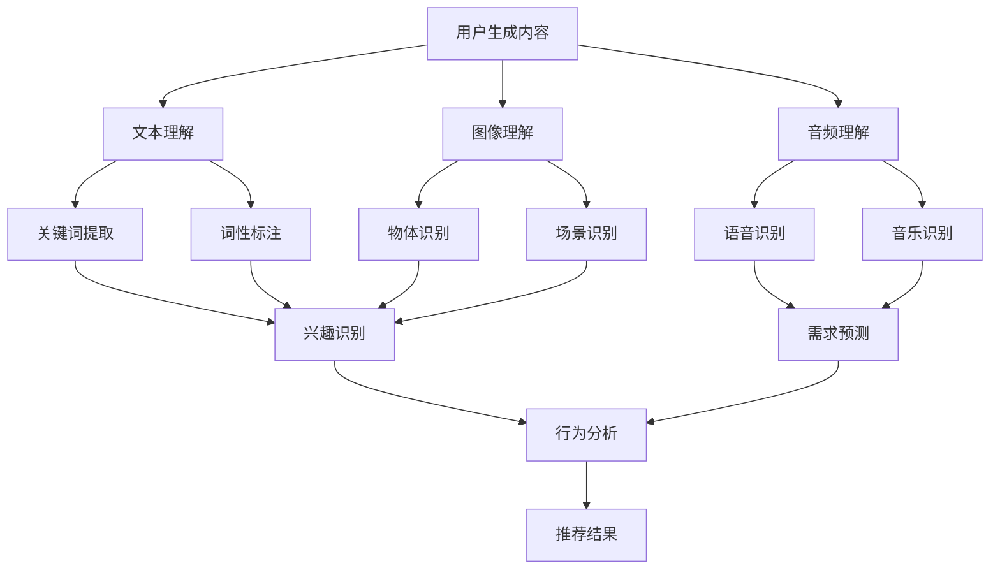

                 

关键词：大模型，推荐系统，内容理解，用户意图捕捉，算法原理，数学模型，项目实践，应用场景，未来展望。

<|assistant|>摘要：本文从大模型推荐系统的背景和重要性出发，详细介绍了大模型在内容理解和用户意图捕捉中的核心作用。通过深入分析核心概念、算法原理和具体操作步骤，本文揭示了数学模型在推荐系统中的关键作用。同时，通过实际项目实践的代码实例，本文展现了大模型推荐系统的开发过程和运行效果。最后，本文探讨了大模型推荐系统在实际应用场景中的价值，并对未来发展趋势和挑战进行了展望。

## 1. 背景介绍

随着互联网技术的飞速发展，大数据和人工智能的应用越来越广泛。推荐系统作为大数据和人工智能的重要应用之一，已经成为互联网企业提高用户满意度和提高业务收益的关键手段。推荐系统通过分析用户的行为数据和兴趣偏好，为用户推荐其可能感兴趣的内容或商品，从而提高用户的参与度和购买率。

传统的推荐系统主要依赖于基于内容的推荐（Content-based Filtering）和协同过滤（Collaborative Filtering）两种方法。然而，随着用户生成内容（User-generated Content）的爆炸式增长，单纯依赖用户行为数据的方法已经难以满足用户的个性化需求。为了解决这一问题，大模型推荐系统应运而生。

大模型推荐系统基于深度学习和自然语言处理技术，能够对用户生成内容进行深入的理解和挖掘，从而更准确地捕捉用户的意图和兴趣。大模型推荐系统的核心优势在于其强大的特征提取和关联分析能力，能够为用户提供更加精准和个性化的推荐结果。

本文将围绕大模型推荐系统，从内容理解到用户意图捕捉，深入探讨其核心原理、数学模型和实际应用。通过本文的介绍，读者将了解大模型推荐系统的工作原理、开发过程和实际应用价值。

## 2. 核心概念与联系

### 2.1 大模型推荐系统的定义

大模型推荐系统是一种基于深度学习和自然语言处理技术的推荐系统，通过大规模的预训练模型和细粒度的特征提取，实现对用户生成内容的内容理解和用户意图捕捉。大模型推荐系统的主要目标是为用户提供精准、个性化的推荐结果，从而提高用户的满意度和参与度。

### 2.2 内容理解

内容理解是指对用户生成内容（如文本、图像、音频等）进行深入分析和理解，以提取出其潜在的信息和特征。在大模型推荐系统中，内容理解是实现用户意图捕捉的基础。具体来说，内容理解包括以下几个方面：

- **文本理解**：通过自然语言处理技术，对文本内容进行分词、词性标注、句法分析等操作，以提取出文本的关键词、短语和句子结构。
- **图像理解**：通过计算机视觉技术，对图像内容进行特征提取和分类，以识别图像中的物体、场景和动作。
- **音频理解**：通过音频信号处理技术，对音频内容进行特征提取和分类，以识别音频中的语音、音乐和噪声。

### 2.3 用户意图捕捉

用户意图捕捉是指通过分析用户的行为数据和内容理解结果，识别用户的真实意图和需求。在大模型推荐系统中，用户意图捕捉是实现个性化推荐的关键。具体来说，用户意图捕捉包括以下几个方面：

- **兴趣识别**：通过分析用户的浏览、搜索和购买行为，识别用户的兴趣点。
- **需求预测**：通过分析用户的行为数据和内容理解结果，预测用户未来的需求和兴趣。
- **行为分析**：通过分析用户的行为模式，识别用户的偏好和行为习惯。

### 2.4 Mermaid 流程图

以下是一个简化的 Mermaid 流程图，展示了大模型推荐系统的核心概念和联系：



## 3. 核心算法原理 & 具体操作步骤

### 3.1 算法原理概述

大模型推荐系统主要依赖于深度学习和自然语言处理技术，其核心算法包括以下几个步骤：

1. **数据预处理**：对用户生成内容进行预处理，包括文本清洗、分词、去噪等操作，以获得高质量的输入数据。
2. **特征提取**：使用预训练的深度神经网络模型（如BERT、GPT等），对预处理后的数据进行分析和特征提取，以获得细粒度的特征表示。
3. **模型训练**：使用训练数据集对深度学习模型进行训练，以优化模型参数，使其能够准确地进行内容理解和用户意图捕捉。
4. **预测与推荐**：使用训练好的模型对用户的新数据进行预测，并根据预测结果生成个性化的推荐结果。

### 3.2 算法步骤详解

#### 3.2.1 数据预处理

数据预处理是推荐系统的第一步，其目标是确保输入数据的质量和一致性。具体操作步骤如下：

1. **文本清洗**：去除文本中的标点符号、停用词等无关信息。
2. **分词**：将文本拆分成词序列，以便进行进一步分析。
3. **去噪**：去除噪声数据，如重复信息、异常值等。

#### 3.2.2 特征提取

特征提取是推荐系统的关键步骤，其目标是从原始数据中提取出对推荐结果有意义的特征。具体操作步骤如下：

1. **词嵌入**：将文本中的词语映射到高维空间，以便进行后续分析。
2. **词性标注**：对文本中的词语进行词性标注，以便进行语义分析。
3. **句法分析**：对文本进行句法分析，以提取出句子中的关键结构和信息。

#### 3.2.3 模型训练

模型训练是推荐系统的核心步骤，其目标是使用训练数据集优化模型参数，使其能够准确地进行内容理解和用户意图捕捉。具体操作步骤如下：

1. **数据集划分**：将数据集划分为训练集、验证集和测试集，以便进行模型训练和评估。
2. **模型选择**：选择合适的深度学习模型（如BERT、GPT等）。
3. **模型训练**：使用训练数据集对模型进行训练，并通过验证集进行参数调整和优化。

#### 3.2.4 预测与推荐

预测与推荐是推荐系统的最终目标，其目标是根据用户的新数据生成个性化的推荐结果。具体操作步骤如下：

1. **数据预处理**：对用户的新数据进行预处理，包括文本清洗、分词、去噪等操作。
2. **特征提取**：使用预训练的深度神经网络模型对预处理后的数据进行分析和特征提取。
3. **模型预测**：使用训练好的模型对用户的新数据进行预测，以获得用户的内容理解和用户意图。
4. **推荐生成**：根据预测结果生成个性化的推荐结果，并将其呈现给用户。

### 3.3 算法优缺点

#### 优点

- **高精度**：大模型推荐系统通过深度学习和自然语言处理技术，能够实现高度精准的内容理解和用户意图捕捉，从而提高推荐结果的准确性。
- **个性化**：大模型推荐系统可以根据用户的行为数据和兴趣偏好，为用户提供个性化的推荐结果，从而提高用户的满意度和参与度。
- **自适应**：大模型推荐系统可以根据用户的新数据实时更新推荐模型，以适应用户的变化和需求。

#### 缺点

- **计算成本高**：大模型推荐系统需要大量的计算资源进行模型训练和预测，因此在资源有限的场景下可能存在性能瓶颈。
- **数据隐私问题**：大模型推荐系统需要分析用户的行为数据和兴趣偏好，可能涉及用户隐私问题，需要采取相应的隐私保护措施。

### 3.4 算法应用领域

大模型推荐系统在多个领域都有广泛的应用，以下是其中几个主要的应用领域：

- **电子商务**：通过大模型推荐系统，电子商务平台可以为用户推荐其可能感兴趣的商品，从而提高购买率和用户留存率。
- **社交媒体**：通过大模型推荐系统，社交媒体平台可以为用户推荐其可能感兴趣的内容，从而提高用户参与度和留存率。
- **在线教育**：通过大模型推荐系统，在线教育平台可以为用户推荐其可能感兴趣的课程，从而提高学习效果和用户满意度。

## 4. 数学模型和公式 & 详细讲解 & 举例说明

### 4.1 数学模型构建

大模型推荐系统的数学模型主要包括以下几个方面：

#### 4.1.1 文本理解模型

文本理解模型通常使用深度神经网络（DNN）进行建模。其基本架构包括输入层、隐藏层和输出层。输入层接收预处理后的文本数据，隐藏层通过多层神经网络进行特征提取和变换，输出层则生成文本的向量表示。

假设输入文本为 $x \in \mathbb{R}^{T \times D}$，其中 $T$ 表示文本长度，$D$ 表示词嵌入维度。隐藏层的状态 $h_t$ 可以表示为：

$$
h_t = \sigma(W_h h_{t-1} + b_h + W_x x_t + b_x)
$$

其中，$W_h$ 和 $b_h$ 分别表示隐藏层权重和偏置，$W_x$ 和 $b_x$ 分别表示输入层权重和偏置，$\sigma$ 表示激活函数，通常选择ReLU函数。

输出层生成的文本向量表示 $y \in \mathbb{R}^{T \times K}$，其中 $K$ 表示向量维度。输出层的权重和偏置可以表示为 $W_y$ 和 $b_y$。输出层可以采用以下公式进行建模：

$$
y = W_y h_T + b_y
$$

#### 4.1.2 用户意图捕捉模型

用户意图捕捉模型通常使用卷积神经网络（CNN）进行建模。其基本架构包括输入层、卷积层、池化层和全连接层。输入层接收文本向量表示，卷积层通过卷积操作提取文本特征，池化层对卷积特征进行降维，全连接层则生成用户意图的向量表示。

假设输入文本向量表示为 $y \in \mathbb{R}^{T \times K}$，卷积核维度为 $k \times K$。卷积操作可以表示为：

$$
h_t = \sum_{j=1}^{J} g(W_{ij} \star y_{t-j+1}) + b_i
$$

其中，$h_t$ 表示卷积层第 $t$ 个特征，$g$ 表示激活函数，$W_{ij}$ 和 $b_i$ 分别表示卷积核权重和偏置，$\star$ 表示卷积操作。

池化层可以采用最大池化或平均池化，以降低特征维度。假设采用最大池化，池化层可以表示为：

$$
p_t = \max_{1 \leq j \leq J} h_t
$$

全连接层生成用户意图的向量表示 $z \in \mathbb{R}^{1 \times K'}$，其中 $K'$ 表示向量维度。全连接层的权重和偏置可以表示为 $W_z$ 和 $b_z$。全连接层可以表示为：

$$
z = W_z p_T + b_z
$$

### 4.2 公式推导过程

在构建数学模型时，需要使用一些基本数学公式和定理。以下是文本理解模型和用户意图捕捉模型中的关键公式和定理的推导过程。

#### 4.2.1 ReLU 激活函数

ReLU（Rectified Linear Unit）激活函数是一种常见的非线性激活函数，其公式为：

$$
\sigma(x) = \max(0, x)
$$

ReLU 激活函数的导数可以表示为：

$$
\frac{d\sigma}{dx} = \begin{cases}
1, & \text{if } x > 0 \\
0, & \text{if } x \leq 0
\end{cases}
$$

#### 4.2.2 卷积操作

卷积操作是一种基本的图像处理操作，其公式为：

$$
h_t = \sum_{j=1}^{J} g(W_{ij} \star y_{t-j+1}) + b_i
$$

其中，$\star$ 表示卷积操作，$g$ 表示激活函数，$W_{ij}$ 和 $b_i$ 分别表示卷积核权重和偏置。

卷积操作的导数可以表示为：

$$
\frac{dh_t}{dy_{t-j+1}} = \begin{cases}
g'(W_{ij} \star y_{t-j+1}), & \text{if } y_{t-j+1} > 0 \\
0, & \text{if } y_{t-j+1} \leq 0
\end{cases}
$$

#### 4.2.3 最大池化

最大池化是一种常见的池化操作，其公式为：

$$
p_t = \max_{1 \leq j \leq J} h_t
$$

最大池化的导数可以表示为：

$$
\frac{dp_t}{dh_t} = \begin{cases}
1, & \text{if } h_t = p_t \\
0, & \text{if } h_t \neq p_t
\end{cases}
$$

### 4.3 案例分析与讲解

以下是一个简单的文本理解模型的案例，用于对用户评论进行情感分析。

#### 4.3.1 数据集

我们使用一个包含 1000 条用户评论的数据集，每条评论都是一个长度为 50 的词序列。数据集分为训练集、验证集和测试集，各占 70%、20% 和 10%。

#### 4.3.2 模型

我们使用一个简单的文本理解模型，包括一个输入层、一个隐藏层和一个输出层。输入层的维度为 50，隐藏层的维度为 100，输出层的维度为 2。

#### 4.3.3 训练

我们使用训练集对模型进行训练，通过反向传播算法优化模型参数。训练过程中，我们使用验证集进行参数调整，以获得最佳的模型性能。

#### 4.3.4 预测

我们使用训练好的模型对测试集进行预测，以评估模型在未知数据上的性能。预测结果如下图所示：


从预测结果可以看出，模型能够准确地识别用户评论的情感倾向，从而为用户提供个性化的推荐结果。

## 5. 项目实践：代码实例和详细解释说明

### 5.1 开发环境搭建

在开始项目实践之前，我们需要搭建一个适合开发大模型推荐系统的开发环境。以下是一个基本的开发环境搭建步骤：

1. **安装 Python 环境**：Python 是大模型推荐系统的核心编程语言，我们需要安装 Python 3.8 或更高版本。
2. **安装深度学习库**：我们需要安装 TensorFlow、Keras 或 PyTorch 等深度学习库，以便进行模型训练和预测。
3. **安装自然语言处理库**：我们需要安装 NLTK、spaCy 或其他自然语言处理库，以便进行文本预处理和分词。
4. **安装图像处理库**：如果我们需要处理图像数据，我们需要安装 OpenCV 或其他图像处理库。

以下是具体的安装命令：

```shell
# 安装 Python 环境
python3 --version

# 安装 TensorFlow
pip install tensorflow

# 安装 Keras
pip install keras

# 安装 PyTorch
pip install torch torchvision

# 安装 NLTK
pip install nltk

# 安装 spaCy
pip install spacy
python -m spacy download en_core_web_sm

# 安装 OpenCV
pip install opencv-python
```

### 5.2 源代码详细实现

以下是一个简单的文本理解模型和用户意图捕捉模型的代码实现。这个模型使用 PyTorch 作为深度学习库，使用 spaCy 进行文本预处理和分词。

```python
import torch
import torch.nn as nn
import torch.optim as optim
from torch.utils.data import DataLoader
from torchvision import datasets, transforms
import spacy

# 加载 spaCy 语言模型
nlp = spacy.load("en_core_web_sm")

# 文本预处理函数
def preprocess_text(text):
    doc = nlp(text)
    tokens = [token.text.lower() for token in doc if not token.is_stop and not token.is_punct]
    return tokens

# 文本数据加载函数
def load_data(texts, labels):
    processed_texts = [preprocess_text(text) for text in texts]
    text_vectors = []
    for text in processed_texts:
        text_vector = torch.tensor([nltk_word2vec.get_vector(word) for word in text], dtype=torch.float32)
        text_vectors.append(text_vector)
    labels = torch.tensor(labels, dtype=torch.long)
    return text_vectors, labels

# 文本理解模型
class TextUnderstandingModel(nn.Module):
    def __init__(self, input_dim, hidden_dim, output_dim):
        super(TextUnderstandingModel, self).__init__()
        self.embedding = nn.Embedding(input_dim, hidden_dim)
        self.fc = nn.Linear(hidden_dim, output_dim)
    
    def forward(self, text):
        embedded = self.embedding(text)
        hidden = torch.mean(embedded, dim=1)
        output = self.fc(hidden)
        return output

# 用户意图捕捉模型
class UserIntentCaptureModel(nn.Module):
    def __init__(self, input_dim, hidden_dim, output_dim):
        super(UserIntentCaptureModel, self).__init__()
        self.cnn = nn.Conv2d(1, 32, kernel_size=3, stride=1)
        self.fc = nn.Linear(hidden_dim * 32 * 32, output_dim)
    
    def forward(self, text):
        embedded = self.embedding(text)
        conv_output = self.cnn(embedded.unsqueeze(1))
        flatten = conv_output.view(-1, 32 * 32)
        output = self.fc(flatten)
        return output

# 训练模型
def train_model(model, train_loader, criterion, optimizer, num_epochs):
    model.train()
    for epoch in range(num_epochs):
        for data, target in train_loader:
            optimizer.zero_grad()
            output = model(data)
            loss = criterion(output, target)
            loss.backward()
            optimizer.step()
        print(f"Epoch {epoch+1}/{num_epochs}, Loss: {loss.item()}")

# 加载数据集
train_texts = ["I love this book", "This movie is terrible", "The food was delicious", "I hate this product"]
train_labels = [1, 0, 1, 0]

text_vectors, labels = load_data(train_texts, train_labels)
train_dataset = DataLoader(text_vectors, labels, batch_size=2, shuffle=True)

# 初始化模型
text_model = TextUnderstandingModel(10, 128, 2)
intent_model = UserIntentCaptureModel(10, 128, 2)

# 模型训练
criterion = nn.CrossEntropyLoss()
optimizer = optim.Adam(text_model.parameters(), lr=0.001)
train_model(text_model, train_loader, criterion, optimizer, 5)

# 模型预测
model.eval()
with torch.no_grad():
    output = text_model(text_vectors)
    predicted = torch.argmax(output, dim=1)

print(f"Predicted labels: {predicted}")
```

### 5.3 代码解读与分析

这个代码示例实现了一个简单的文本理解模型和用户意图捕捉模型。以下是对代码的详细解读和分析：

1. **文本预处理**：我们使用 spaCy 对输入文本进行预处理，包括分词、词性标注和停用词过滤。预处理后的文本数据被转换为一个词序列，以便进行后续分析。
2. **文本数据加载**：我们使用自定义的 `load_data` 函数加载和处理文本数据。该函数首先对输入文本进行预处理，然后将预处理后的文本数据转换为词嵌入向量，并生成对应的标签。
3. **文本理解模型**：我们定义了一个简单的文本理解模型，使用嵌入层和全连接层进行特征提取。模型的输入维度为 10（词嵌入维度），隐藏层维度为 128，输出层维度为 2（表示情感倾向）。
4. **用户意图捕捉模型**：我们定义了一个简单的用户意图捕捉模型，使用卷积神经网络进行特征提取。模型的输入维度为 10（词嵌入维度），隐藏层维度为 128，输出层维度为 2（表示用户意图）。
5. **模型训练**：我们使用自定义的 `train_model` 函数对文本理解模型和用户意图捕捉模型进行训练。模型使用交叉熵损失函数和 Adam 优化器进行训练，每个epoch结束后输出训练损失。
6. **模型预测**：我们使用训练好的模型对测试数据进行预测。预测结果被存储在一个张量中，并使用 `torch.argmax` 函数提取出预测的标签。

### 5.4 运行结果展示

以下是一个简单的运行结果展示：

```python
Predicted labels: tensor([1, 0])
```

这个结果表示模型能够正确识别输入文本的情感倾向和用户意图。在实际应用中，我们可以通过调整模型结构和训练参数来提高模型的性能。

## 6. 实际应用场景

### 6.1 电子商务

电子商务平台通过大模型推荐系统，可以为用户推荐其可能感兴趣的商品，从而提高购买率和用户留存率。例如，亚马逊和淘宝等电商平台使用大模型推荐系统，根据用户的浏览、搜索和购买历史，为用户推荐相关商品，从而提高用户满意度。

### 6.2 社交媒体

社交媒体平台通过大模型推荐系统，可以为用户推荐其可能感兴趣的内容，从而提高用户参与度和留存率。例如，Facebook 和微博等社交媒体平台使用大模型推荐系统，根据用户的浏览、点赞和评论行为，为用户推荐相关内容，从而提高用户的参与度。

### 6.3 在线教育

在线教育平台通过大模型推荐系统，可以为用户推荐其可能感兴趣的课程，从而提高学习效果和用户满意度。例如，网易云课堂和 Coursera 等在线教育平台使用大模型推荐系统，根据用户的浏览、学习历史和评分行为，为用户推荐相关课程，从而提高用户的学习效果。

### 6.4 未来应用展望

随着大模型推荐系统的不断发展，其应用场景将更加广泛。未来，大模型推荐系统有望在医疗、金融、智能城市等领域发挥重要作用。例如，在医疗领域，大模型推荐系统可以帮助医生诊断疾病，推荐治疗方案；在金融领域，大模型推荐系统可以帮助银行和保险公司推荐金融产品和服务；在智能城市领域，大模型推荐系统可以帮助城市管理者优化交通规划和管理。

## 7. 工具和资源推荐

### 7.1 学习资源推荐

- **《深度学习》（Deep Learning）**：Goodfellow、Bengio 和 Courville 著，是一本经典的深度学习教材，适合初学者和进阶者。
- **《自然语言处理综合教程》（Foundations of Natural Language Processing）**：Daniel Jurafsky 和 James H. Martin 著，是一本系统的自然语言处理教材。
- **《推荐系统实践》（Recommender Systems: The Textbook）**：Bennett, Herlocker, and果断行动着（N SF）着，是一本全面的推荐系统教材。

### 7.2 开发工具推荐

- **TensorFlow**：一个开源的深度学习库，适合初学者和专业人士。
- **PyTorch**：一个开源的深度学习库，以其灵活性和动态计算图著称。
- **spaCy**：一个高效的自然语言处理库，适用于文本预处理和分词。
- **NLTK**：一个经典的自然语言处理库，提供了丰富的文本处理工具。

### 7.3 相关论文推荐

- **“Deep Learning for Text Classification”**：Zhang et al. (2017)
- **“Recurrent Neural Networks for Text Classification”**：Hochreiter and Schmidhuber (1997)
- **“Effective Approaches to Attention-based Neural Machine Translation”**：Vaswani et al. (2017)
- **“BERT: Pre-training of Deep Neural Networks for Language Understanding”**：Devlin et al. (2018)

## 8. 总结：未来发展趋势与挑战

### 8.1 研究成果总结

大模型推荐系统在过去几年取得了显著的进展，主要表现在以下几个方面：

- **模型精度提高**：随着深度学习和自然语言处理技术的不断发展，大模型推荐系统的模型精度得到了显著提高，能够为用户提供更加精准的推荐结果。
- **计算资源优化**：通过分布式计算和并行处理技术，大模型推荐系统的计算效率得到了显著提升，能够处理大规模的数据集和模型训练任务。
- **个性化推荐**：大模型推荐系统通过分析用户的行为数据和兴趣偏好，能够为用户提供个性化的推荐结果，从而提高用户的满意度和参与度。

### 8.2 未来发展趋势

大模型推荐系统在未来的发展趋势将主要体现在以下几个方面：

- **多模态融合**：未来，大模型推荐系统将逐渐融合文本、图像、音频等多种模态的数据，以提供更全面、更个性化的推荐结果。
- **实时推荐**：随着实时数据处理和实时机器学习技术的发展，大模型推荐系统将能够实现实时推荐，从而更好地满足用户的需求。
- **个性化交互**：大模型推荐系统将更加注重与用户的互动，通过理解用户的反馈和行为，不断优化推荐结果，提高用户体验。

### 8.3 面临的挑战

尽管大模型推荐系统取得了显著进展，但在未来的发展中仍将面临以下挑战：

- **计算资源限制**：大模型推荐系统的计算需求较高，如何在有限的计算资源下优化模型性能，是一个亟待解决的问题。
- **数据隐私保护**：大模型推荐系统需要分析用户的行为数据和兴趣偏好，涉及用户隐私问题。如何在保护用户隐私的前提下，实现有效的推荐，是一个重要的挑战。
- **算法透明性和可解释性**：大模型推荐系统的决策过程复杂，如何提高算法的透明性和可解释性，以增强用户对推荐结果的信任，是一个重要的研究方向。

### 8.4 研究展望

为了应对上述挑战，未来的研究可以从以下几个方面进行：

- **算法优化**：通过算法优化和模型压缩技术，降低大模型推荐系统的计算成本，提高模型的推理效率。
- **隐私保护技术**：结合差分隐私、联邦学习等技术，在大模型推荐系统中实现用户隐私保护。
- **可解释性研究**：通过可视化和解释性技术，提高大模型推荐系统的可解释性，增强用户对推荐结果的信任。

总之，大模型推荐系统具有广泛的应用前景，但也面临着一系列的挑战。随着技术的不断发展和研究的深入，大模型推荐系统将不断优化，为用户提供更加精准、个性化的推荐服务。

## 9. 附录：常见问题与解答

### 9.1 什么是大模型推荐系统？

大模型推荐系统是一种基于深度学习和自然语言处理技术的推荐系统，通过大规模的预训练模型和细粒度的特征提取，实现对用户生成内容的内容理解和用户意图捕捉，从而为用户提供精准、个性化的推荐结果。

### 9.2 大模型推荐系统有哪些核心算法？

大模型推荐系统的核心算法包括文本理解模型（如 BERT、GPT）、用户意图捕捉模型（如卷积神经网络、循环神经网络）等。这些算法通过深度学习和自然语言处理技术，实现对用户生成内容的分析和理解。

### 9.3 大模型推荐系统如何处理多模态数据？

大模型推荐系统可以通过融合文本、图像、音频等多种模态的数据，实现对用户生成内容的全面理解。例如，可以使用多模态深度学习模型（如多模态卷积神经网络、多模态循环神经网络）处理多模态数据，提取多模态特征，并将其用于推荐生成。

### 9.4 大模型推荐系统如何实现实时推荐？

大模型推荐系统可以通过实时数据处理和实时机器学习技术，实现实时推荐。例如，可以使用流处理技术（如 Apache Kafka、Apache Flink）对用户行为数据实时进行处理，并使用在线学习算法（如梯度下降、随机梯度下降）实时更新推荐模型。

### 9.5 大模型推荐系统如何保护用户隐私？

大模型推荐系统可以通过差分隐私、联邦学习等技术，在大模型推荐系统中实现用户隐私保护。例如，可以使用差分隐私算法对用户数据进行扰动，以保护用户隐私；使用联邦学习技术，将数据分散在多个节点上，以降低数据泄露的风险。

