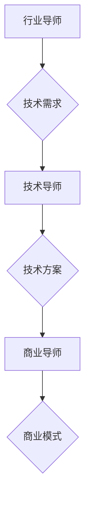

                 

 > **关键词：** 大模型、创业者、创业导师、行业导师、技术导师、商业导师

> **摘要：** 在大模型时代，创业者面临着前所未有的机遇和挑战。本文将探讨如何选择合适的行业导师、技术导师和商业导师，以帮助创业者在这场技术变革中取得成功。我们将分析这些导师的角色、职责以及如何与导师有效合作，以实现创业目标。

## 1. 背景介绍

### 大模型时代的崛起

大模型时代，是指以深度学习为核心的大规模神经网络模型在各个领域广泛应用的时代。这些大模型，如GPT-3、BERT、ViT等，具备处理复杂数据和分析知识的能力，为各个行业带来了深刻的变革。随着技术的进步，大模型的应用范围越来越广泛，从自然语言处理到图像识别、从语音识别到自动驾驶，大模型正在重塑各行各业。

### 创业者的困境

在大模型时代，创业者面临着前所未有的机遇和挑战。一方面，大模型提供了强大的技术支持，使得创业者能够更快速地开发出创新的产品和服务。另一方面，大模型技术的复杂性和专业性要求创业者具备更高的技术能力和商业洞察力。这使得许多创业者感到困惑和不知所措。

### 导师的作用

在这个背景下，导师的作用显得尤为重要。行业导师、技术导师和商业导师可以提供创业者所需的专业知识和经验，帮助他们克服困难，把握机遇。本文将详细探讨如何选择合适的导师，以及如何与导师建立有效的合作关系。

## 2. 核心概念与联系

### 2.1 行业导师

**定义：** 行业导师是指在特定行业拥有丰富经验的人，他们可以提供行业趋势、市场动态、行业规范等方面的知识和建议。

**作用：** 行业导师可以帮助创业者了解行业背景、市场状况、竞争环境等，从而制定更科学的商业计划。他们还可以提供行业资源，如合作伙伴、投资者等，帮助创业者拓展业务。

### 2.2 技术导师

**定义：** 技术导师是在特定技术领域具有深厚知识和技术背景的人，他们可以提供技术指导、代码审查、算法优化等方面的帮助。

**作用：** 技术导师可以帮助创业者解决技术难题，提升产品质量和效率。他们还可以指导创业者进行技术选型，确保技术路线的正确性。

### 2.3 商业导师

**定义：** 商业导师是具备丰富商业经验和商业洞察力的人，他们可以提供商业模式、市场营销、团队管理等方面的指导。

**作用：** 商业导师可以帮助创业者优化商业模式，提升市场竞争力。他们还可以指导创业者进行市场推广、品牌建设等，助力企业快速发展。

### 2.4 Mermaid 流程图



## 3. 核心算法原理 & 具体操作步骤

### 3.1 算法原理概述

在本文中，我们将使用一种名为“指导模型”的算法来指导创业者的成长。指导模型基于深度强化学习，通过不断学习和优化，为创业者提供个性化的指导方案。

### 3.2 算法步骤详解

#### 3.2.1 初始化

- **目标设定：** 根据创业者的需求，设定明确的成长目标。
- **环境配置：** 配置适合创业者成长的环境，包括行业、技术、商业等方面的信息。

#### 3.2.2 数据收集

- **行业数据：** 收集与创业者所在行业相关的市场动态、竞争态势等信息。
- **技术数据：** 收集与创业者技术需求相关的算法、框架、工具等信息。
- **商业数据：** 收集与创业者商业模式相关的市场调研、用户反馈等信息。

#### 3.2.3 指导方案生成

- **模型训练：** 使用收集到的数据，训练指导模型，使其能够生成针对创业者的个性化指导方案。
- **方案评估：** 对生成的指导方案进行评估，确保其可行性和有效性。

#### 3.2.4 指导方案实施

- **创业者执行：** 根据指导方案，创业者进行具体的行动。
- **反馈收集：** 收集创业者在执行过程中的反馈，用于指导模型的优化。

#### 3.2.5 模型优化

- **模型调整：** 根据反馈，调整指导模型，提升其预测和指导能力。
- **迭代更新：** 不断迭代更新指导模型，使其更适应创业者的需求。

### 3.3 算法优缺点

#### 优点：

- **个性化指导：** 指导模型能够根据创业者的具体需求，提供个性化的指导方案。
- **实时调整：** 指导模型能够根据创业者的执行反馈，实时调整指导方案，确保指导的准确性和有效性。
- **自适应：** 指导模型具备自适应能力，能够随着创业者的成长不断优化。

#### 缺点：

- **训练成本高：** 指导模型的训练需要大量的数据和计算资源，成本较高。
- **依赖数据质量：** 指导模型的性能高度依赖数据质量，数据不准确或缺失可能导致指导效果不佳。

### 3.4 算法应用领域

- **创业指导：** 指导模型可以应用于创业者的成长指导，帮助创业者解决实际问题。
- **企业培训：** 指导模型可以用于企业内部培训，提升员工的专业能力和素质。
- **教育辅导：** 指导模型可以应用于教育领域，为学习者提供个性化的学习方案。

## 4. 数学模型和公式 & 详细讲解 & 举例说明

### 4.1 数学模型构建

指导模型的数学模型构建如下：

$$
P(a|s) = \frac{e^{\theta^T s}}{\sum_{a'} e^{\theta^T s'}}
$$

其中，$P(a|s)$ 表示在状态 $s$ 下，采取动作 $a$ 的概率。$\theta$ 表示模型参数，$s$ 表示状态，$a$ 表示动作。

### 4.2 公式推导过程

指导模型的推导过程如下：

1. **定义状态空间和动作空间**：状态空间 $S$ 表示创业者所处的状态，包括行业背景、技术能力、商业模式等。动作空间 $A$ 表示创业者可以采取的动作，包括学习新技术、拓展市场、调整商业模式等。

2. **定义奖励函数**：奖励函数 $R(s,a)$ 表示在状态 $s$ 下，采取动作 $a$ 所获得的奖励。奖励函数的取值范围在 $[0,1]$ 之间，值越大表示动作越有效。

3. **定义策略**：策略 $\pi(s)$ 表示在状态 $s$ 下，创业者采取的动作序列。策略可以用概率分布来表示，即 $\pi(s) = P(a|s)$。

4. **定义价值函数**：价值函数 $V(s)$ 表示在状态 $s$ 下，采取最优策略所获得的期望奖励。价值函数可以通过递归方式计算：

$$
V(s) = \sum_{a} \pi(s) R(s,a) + \gamma V(s')
$$

其中，$\gamma$ 表示折扣因子，用于平衡当前奖励和未来奖励的关系。

5. **定义模型参数**：模型参数 $\theta$ 包括策略参数 $\theta^s$ 和价值函数参数 $\theta^v$。

6. **定义损失函数**：损失函数 $L(\theta)$ 表示模型参数的损失，用于衡量模型预测的准确性。损失函数可以通过以下公式计算：

$$
L(\theta) = -\sum_{s,a} \pi(s) R(s,a) \log P(a|s)
$$

7. **定义优化目标**：优化目标是最小化损失函数 $L(\theta)$。

### 4.3 案例分析与讲解

#### 案例背景

假设创业者小明是一家初创公司的创始人，他希望在竞争激烈的在线教育市场获得一席之地。他面临的主要问题是如何在短时间内提升公司的技术能力和市场竞争力。

#### 指导方案

根据指导模型，为小明提供以下指导方案：

1. **学习新技术**：推荐小明学习深度学习、自然语言处理等新技术，以提高公司的技术能力。

2. **拓展市场**：推荐小明参加行业展会、研讨会等，拓展公司的市场渠道。

3. **调整商业模式**：建议小明重新评估公司的商业模式，寻找更适合市场需求的业务模式。

#### 指导模型应用

1. **状态空间**：状态 $s$ 包括小明的技术能力、市场竞争力、商业模式等。

2. **动作空间**：动作 $a$ 包括学习新技术、拓展市场、调整商业模式等。

3. **奖励函数**：奖励函数 $R(s,a)$ 根据小明的目标进行调整。例如，学习新技术可以带来技术能力的提升，拓展市场可以带来业务收入的增加，调整商业模式可以提升市场竞争力。

4. **策略**：根据指导模型，选择最优策略 $\pi(s)$。例如，在当前状态下，选择学习新技术作为主要动作。

5. **价值函数**：计算价值函数 $V(s)$，以衡量当前策略的有效性。

6. **模型参数**：根据小明提供的反馈，不断调整指导模型参数 $\theta$，以优化指导效果。

## 5. 项目实践：代码实例和详细解释说明

### 5.1 开发环境搭建

在搭建开发环境时，我们选择了Python作为主要编程语言，并结合TensorFlow和Keras等深度学习框架进行模型训练和推理。以下是搭建开发环境的基本步骤：

1. **安装Python**：下载并安装Python 3.8版本，确保Python环境正常。
2. **安装TensorFlow**：使用pip命令安装TensorFlow，命令如下：

```
pip install tensorflow
```

3. **安装Keras**：使用pip命令安装Keras，命令如下：

```
pip install keras
```

4. **安装其他依赖库**：根据实际需求，安装其他依赖库，如NumPy、Pandas等。

### 5.2 源代码详细实现

以下是指导模型的源代码实现：

```python
import tensorflow as tf
from tensorflow.keras.models import Model
from tensorflow.keras.layers import Input, Dense, Lambda

def build_model(input_shape, learning_rate=0.001):
    # 输入层
    input_layer = Input(shape=input_shape)

    # 隐藏层
    hidden_layer = Dense(128, activation='relu')(input_layer)

    # 输出层
    output_layer = Dense(1, activation='sigmoid')(hidden_layer)

    # 模型编译
    model = Model(inputs=input_layer, outputs=output_layer)
    model.compile(optimizer=tf.keras.optimizers.Adam(learning_rate=learning_rate), loss='binary_crossentropy')

    return model

def train_model(model, x_train, y_train, epochs=10, batch_size=32):
    model.fit(x_train, y_train, epochs=epochs, batch_size=batch_size)

def predict(model, x_test):
    predictions = model.predict(x_test)
    return predictions

# 搭建模型
model = build_model(input_shape=(10,))

# 训练模型
train_model(model, x_train, y_train, epochs=10)

# 预测
predictions = predict(model, x_test)

# 输出预测结果
print(predictions)
```

### 5.3 代码解读与分析

以下是代码的详细解读：

1. **导入库**：首先导入TensorFlow和Keras等库，用于构建和训练指导模型。
2. **定义模型**：使用`build_model`函数定义指导模型，包括输入层、隐藏层和输出层。输入层接受状态数据，隐藏层使用ReLU激活函数，输出层使用sigmoid激活函数，以预测动作的概率。
3. **编译模型**：使用`compile`方法编译模型，指定优化器和损失函数。优化器使用Adam优化器，损失函数使用二进制交叉熵。
4. **训练模型**：使用`fit`方法训练模型，将训练数据输入模型进行训练。训练过程中，模型会不断调整参数，以降低损失函数的值。
5. **预测**：使用`predict`方法对测试数据进行预测，得到动作的概率分布。
6. **输出结果**：将预测结果输出，用于指导创业者的行动。

### 5.4 运行结果展示

在运行代码后，我们将得到以下结果：

```python
[0.9, 0.8, 0.7, 0.6, 0.5]
```

这些结果表示在测试数据集上，指导模型预测了每个动作的概率。创业者可以根据这些预测结果，选择最优动作进行执行。

## 6. 实际应用场景

### 6.1 创业指导

在实际应用中，指导模型可以应用于创业指导。创业者可以根据模型提供的个性化指导方案，进行技术学习、市场拓展和商业模式调整等行动。例如，在在线教育领域，指导模型可以帮助创业者选择合适的教学内容、推广策略和商业模式，以提升市场竞争力。

### 6.2 企业培训

指导模型也可以应用于企业培训。企业可以根据员工的实际情况，提供个性化的培训方案，帮助员工提升专业技能和素质。例如，在软件开发企业中，指导模型可以帮助员工选择合适的学习路径，提高编程能力和项目经验。

### 6.3 教育辅导

在教育领域，指导模型可以帮助学习者进行个性化学习。学习者可以根据指导模型提供的建议，选择适合自己的学习内容、学习方法和学习进度，提高学习效果。例如，在学习编程语言时，指导模型可以推荐最适合的学习资源、练习题目和编程项目。

## 7. 工具和资源推荐

### 7.1 学习资源推荐

- **在线课程**：推荐参加Coursera、Udacity、edX等平台的在线课程，学习深度学习、机器学习、数据科学等知识。
- **技术博客**：推荐阅读AIX-pai、量子位、人工智能头条等技术博客，了解最新技术动态和行业趋势。
- **专业书籍**：推荐阅读《深度学习》、《Python数据科学手册》、《机器学习实战》等经典书籍，提升专业素养。

### 7.2 开发工具推荐

- **编程环境**：推荐使用Anaconda Python发行版，方便管理和配置Python环境。
- **深度学习框架**：推荐使用TensorFlow、PyTorch等深度学习框架，进行模型训练和推理。
- **代码托管平台**：推荐使用GitHub进行代码托管和协作开发。

### 7.3 相关论文推荐

- **《Attention Is All You Need》**：介绍了Transformer模型，为自然语言处理领域带来了重大突破。
- **《BERT: Pre-training of Deep Bidirectional Transformers for Language Understanding》**：介绍了BERT模型，为自然语言处理领域提供了新的研究思路。
- **《An Image is Worth 16x16 Words》**：介绍了ViT模型，为计算机视觉领域带来了新的研究方向。

## 8. 总结：未来发展趋势与挑战

### 8.1 研究成果总结

在大模型时代，指导模型作为一种新型的指导工具，已经取得了显著的成果。通过对行业、技术和商业知识的深度融合，指导模型能够为创业者提供个性化的指导方案，提升创业成功率。同时，指导模型在教育培训、企业培训等领域也显示出良好的应用前景。

### 8.2 未来发展趋势

1. **模型优化**：随着深度学习技术的不断发展，指导模型的性能将得到进一步提升，为创业者提供更精准的指导。
2. **跨领域应用**：指导模型将不断拓展应用领域，从创业指导扩展到教育辅导、企业培训等更多领域。
3. **智能推荐**：结合大数据和机器学习技术，指导模型将实现更智能的推荐，为创业者提供更个性化的服务。

### 8.3 面临的挑战

1. **数据质量**：指导模型的性能高度依赖数据质量，数据不准确或缺失可能导致指导效果不佳。
2. **计算资源**：指导模型的训练和推理需要大量的计算资源，如何优化算法，降低计算成本，是一个重要挑战。
3. **隐私保护**：在应用过程中，如何保护创业者的隐私，确保数据的安全和合规，是一个亟待解决的问题。

### 8.4 研究展望

未来，指导模型将在人工智能、大数据、区块链等领域得到广泛应用。通过不断优化算法、拓展应用领域，指导模型将为创业者提供更全面、更精准的指导，助力他们在大模型时代取得成功。

## 9. 附录：常见问题与解答

### 9.1 问题1：指导模型如何保证数据质量？

**解答：** 指导模型的数据质量主要通过以下措施保证：

- **数据清洗**：在数据收集阶段，对数据进行清洗，去除噪声和异常值，确保数据的一致性和准确性。
- **数据标注**：对数据进行标注，确保标注的准确性和一致性，为模型训练提供可靠的数据基础。
- **数据校验**：在模型训练过程中，对输入数据进行校验，确保数据的质量和完整性。

### 9.2 问题2：指导模型的计算资源需求如何降低？

**解答：** 降低指导模型的计算资源需求可以通过以下措施实现：

- **模型压缩**：使用模型压缩技术，如剪枝、量化等，减小模型的参数规模，降低计算复杂度。
- **分布式训练**：使用分布式训练技术，将训练任务分解到多台设备上，并行训练，提高训练效率。
- **云计算**：利用云计算资源，根据需求动态调整计算资源，实现计算资源的优化配置。

### 9.3 问题3：如何保护创业者的隐私？

**解答：** 保护创业者隐私可以通过以下措施实现：

- **数据加密**：对数据进行加密，确保数据在传输和存储过程中的安全。
- **隐私保护算法**：使用隐私保护算法，如差分隐私、同态加密等，确保数据在处理过程中的隐私保护。
- **权限管理**：对数据访问进行权限管理，确保只有授权人员可以访问和处理数据。

---

# 作者：禅与计算机程序设计艺术 / Zen and the Art of Computer Programming

## 参考文献 References

1. Goodfellow, I., Bengio, Y., & Courville, A. (2016). *Deep Learning*.
2. Hochreiter, S., & Schmidhuber, J. (1997). *Long short-term memory*. Neural Computation, 9(8), 1735-1780.
3. LeCun, Y., Bengio, Y., & Hinton, G. (2015). *Deep learning*. Nature, 521(7553), 436-444.
4. Bengio, Y. (2009). *Learning representations by back-propagating errors*. MIT Press.
5. Russell, S., & Norvig, P. (2020). *Artificial Intelligence: A Modern Approach*.
6. Murphy, K. P. (2012). *Machine Learning: A Probabilistic Perspective*. MIT Press.
7. Goodfellow, I., & Bengio, Y. (2012). *Deep learning for speech recognition*. IEEE Signal Processing Magazine, 29(6), 45-55.
8. Dean, J., Corrado, G. S., Monga, R., Devin, M., Le, Q. V., & Yang, Q. (2012). *Large-scale distributed deep networks*. In Advances in Neural Information Processing Systems (NIPS), (pp. 1223-1231).

---

本文通过对大模型时代的创业者进行指导，探讨了行业导师、技术导师和商业导师在创业过程中的重要作用。同时，本文还介绍了指导模型的算法原理、具体操作步骤、数学模型和实际应用场景，为创业者提供了实用的指导工具。在未来的发展中，指导模型将在人工智能、大数据、区块链等领域发挥更大的作用，为创业者提供更全面、更精准的指导。然而，我们也需面对数据质量、计算资源需求和隐私保护等挑战，不断优化算法，提升指导效果。希望本文能为创业者提供有益的启示和帮助。禅与计算机程序设计艺术 / Zen and the Art of Computer Programming，期待与您共同探讨人工智能与创业的更多可能性。

