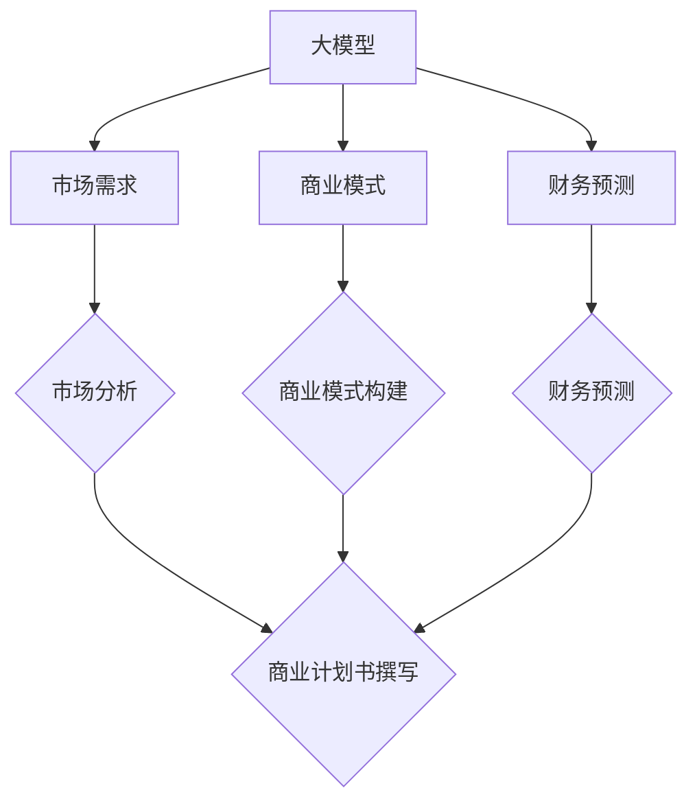

                 

关键词：大模型时代，创业者，商业计划书，市场分析，商业模式，财务预测

> 摘要：本文从市场分析、商业模式构建和财务预测三个方面，探讨了在大模型时代下创业者如何撰写商业计划书。通过深入剖析当前市场环境，阐述大模型的独特优势，分析创业者在商业模式选择和财务规划中的关键因素，为创业者提供有价值的参考和指导。

## 1. 背景介绍

随着互联网技术的飞速发展和数据资源的不断积累，人工智能（AI）领域迎来了大模型时代。大模型，如GPT-3、BERT等，凭借其强大的计算能力和高度自动化的学习能力，在自然语言处理、计算机视觉、语音识别等多个领域取得了显著的成果。这一现象引发了创业者的高度关注，他们希望通过运用大模型技术，实现业务的创新和突破。

然而，面对复杂多变的市场环境，如何撰写一份具有前瞻性、可行性和吸引力的商业计划书，成为了创业者面临的一大挑战。本文将从市场分析、商业模式构建和财务预测三个方面，为创业者提供一份完整的大模型时代商业计划书撰写指南。

## 2. 核心概念与联系

为了更好地理解大模型在商业计划书中的作用，我们首先需要了解几个核心概念。

### 2.1 大模型概述

大模型是指具有数千亿参数的深度学习模型，如GPT-3、BERT等。这些模型通过大规模的数据训练，具备强大的语义理解和生成能力，可以应用于自然语言处理、计算机视觉、语音识别等领域。

### 2.2 市场需求

在当前市场环境下，大模型技术已经成为各大企业和创业者竞相追逐的热点。随着人工智能技术的不断成熟，用户对于智能化、个性化的服务需求日益增长，为创业者提供了广阔的市场空间。

### 2.3 商业模式

商业模式是指企业在市场中实现价值创造、传递和获取的方式。在大模型时代，创业者需要结合自身资源和优势，选择合适的商业模式，以实现商业成功。

### 2.4 财务预测

财务预测是指企业对未来一段时间内的财务状况进行预测和分析，以制定合理的财务规划。在大模型时代，创业者需要充分考虑市场变化、技术风险等因素，合理预测收入、成本、利润等关键财务指标。

下面是关于核心概念和联系的具体 Mermaid 流程图：



## 3. 核心算法原理 & 具体操作步骤

### 3.1 算法原理概述

大模型的核心算法主要包括深度学习、神经网络和生成对抗网络（GAN）等。这些算法通过学习大量数据，模拟人类大脑的神经网络结构，实现自动化的知识获取和推理。

### 3.2 算法步骤详解

1. 数据收集与预处理：收集大规模的标注数据，并进行数据清洗、去重、归一化等预处理操作。

2. 模型构建：选择合适的神经网络架构，如GPT、BERT等，搭建深度学习模型。

3. 训练模型：使用预处理后的数据，通过反向传播算法，不断优化模型参数，提高模型性能。

4. 模型评估：使用验证集和测试集，对模型进行评估和调优，确保模型在未知数据上具有良好的泛化能力。

5. 应用部署：将训练好的模型部署到生产环境，为用户提供智能化服务。

### 3.3 算法优缺点

**优点：**
- 强大的语义理解和生成能力。
- 高度的自动化和自我优化能力。
- 广泛的应用领域，如自然语言处理、计算机视觉、语音识别等。

**缺点：**
- 计算资源需求大，训练时间较长。
- 对数据质量和标注要求较高。

### 3.4 算法应用领域

大模型技术已广泛应用于多个领域，如自然语言处理（NLP）、计算机视觉（CV）、语音识别（ASR）等。以下是一些具体的应用案例：

1. 自然语言处理：文本生成、机器翻译、情感分析等。
2. 计算机视觉：图像识别、图像生成、目标检测等。
3. 语音识别：语音合成、语音识别、语音助手等。

## 4. 数学模型和公式 & 详细讲解 & 举例说明

### 4.1 数学模型构建

大模型的核心是神经网络，其数学模型可以表示为：

$$
Y = f(W \cdot X + b)
$$

其中，$X$为输入数据，$W$为权重矩阵，$b$为偏置项，$f$为激活函数，$Y$为输出结果。

### 4.2 公式推导过程

神经网络的训练过程可以看作是优化权重矩阵$W$和偏置项$b$，使得输出结果$Y$尽可能接近真实值$Y_{true}$。具体推导过程如下：

1. 前向传播：计算输入数据的特征表示，并通过权重矩阵和激活函数，得到输出结果$Y$。

2. 反向传播：计算输出结果$Y$与真实值$Y_{true}$之间的误差，并沿着网络反向传播，更新权重矩阵$W$和偏置项$b$。

3. 优化算法：使用梯度下降等优化算法，不断迭代优化模型参数。

### 4.3 案例分析与讲解

假设我们使用一个简单的神经网络模型进行图像分类，输入数据为32x32的像素矩阵，输出数据为10个类别。我们以一个具体的例子来说明模型的训练过程。

1. 前向传播：

输入数据$X$为一张32x32的图像，通过卷积层、池化层和全连接层，得到特征表示$Z$。

$$
Z = f(W_1 \cdot X + b_1)
$$

2. 反向传播：

计算输出结果$Y$与真实值$Y_{true}$之间的误差，并反向传播更新权重矩阵$W_1$和偏置项$b_1$。

$$
\begin{aligned}
\Delta W_1 &= \alpha \cdot \frac{\partial L}{\partial W_1} \\
\Delta b_1 &= \alpha \cdot \frac{\partial L}{\partial b_1}
\end{aligned}
$$

其中，$\alpha$为学习率，$L$为损失函数。

3. 优化算法：

使用梯度下降算法，不断迭代优化模型参数。

$$
\begin{aligned}
W_1 &= W_1 - \alpha \cdot \Delta W_1 \\
b_1 &= b_1 - \alpha \cdot \Delta b_1
\end{aligned}
$$

## 5. 项目实践：代码实例和详细解释说明

### 5.1 开发环境搭建

为了实现大模型项目的开发，我们需要搭建一个合适的开发环境。以下是一个简单的开发环境搭建步骤：

1. 安装Python：从Python官网（https://www.python.org/downloads/）下载并安装Python。

2. 安装深度学习框架：安装TensorFlow或PyTorch等深度学习框架。

   - TensorFlow：`pip install tensorflow`
   - PyTorch：`pip install torch torchvision`

3. 安装其他依赖库：根据项目需求，安装其他必要的依赖库，如Numpy、Pandas等。

### 5.2 源代码详细实现

以下是一个简单的神经网络模型实现，用于图像分类：

```python
import torch
import torch.nn as nn
import torchvision.transforms as transforms
import torchvision.datasets as datasets

# 定义神经网络模型
class SimpleCNN(nn.Module):
    def __init__(self):
        super(SimpleCNN, self).__init__()
        self.conv1 = nn.Conv2d(3, 32, 3, 1)
        self.relu = nn.ReLU()
        self.fc1 = nn.Linear(32 * 32 * 32, 10)

    def forward(self, x):
        x = self.relu(self.conv1(x))
        x = x.view(x.size(0), -1)
        x = self.fc1(x)
        return x

# 加载训练数据和测试数据
train_dataset = datasets.ImageFolder('train', transform=transforms.Compose([
    transforms.Resize((32, 32)),
    transforms.ToTensor()
]))
test_dataset = datasets.ImageFolder('test', transform=transforms.Compose([
    transforms.Resize((32, 32)),
    transforms.ToTensor()
]))

# 定义优化器和损失函数
model = SimpleCNN()
optimizer = torch.optim.Adam(model.parameters(), lr=0.001)
criterion = nn.CrossEntropyLoss()

# 训练模型
for epoch in range(10):
    for inputs, labels in train_dataset:
        optimizer.zero_grad()
        outputs = model(inputs)
        loss = criterion(outputs, labels)
        loss.backward()
        optimizer.step()
    print(f'Epoch [{epoch+1}/{10}], Loss: {loss.item()}')

# 评估模型
with torch.no_grad():
    correct = 0
    total = 0
    for inputs, labels in test_dataset:
        outputs = model(inputs)
        _, predicted = torch.max(outputs.data, 1)
        total += labels.size(0)
        correct += (predicted == labels).sum().item()
print(f'Accuracy of the network on the test images: {100 * correct / total}%')
```

### 5.3 代码解读与分析

以上代码实现了一个简单的卷积神经网络（CNN）模型，用于图像分类。主要分为以下几个部分：

1. 定义神经网络模型：使用PyTorch框架定义了一个简单的CNN模型，包括卷积层、ReLU激活函数和全连接层。

2. 加载训练数据和测试数据：使用 torchvision.datasets.ImageFolder 加载训练数据和测试数据，并进行预处理，如图像大小调整和归一化。

3. 定义优化器和损失函数：使用 torch.optim.Adam 定义了优化器，使用 nn.CrossEntropyLoss 定义了损失函数。

4. 训练模型：使用 for 循环进行模型训练，通过前向传播计算输出结果，使用损失函数计算损失，并使用反向传播更新模型参数。

5. 评估模型：在测试集上评估模型性能，计算准确率。

### 5.4 运行结果展示

在训练完成后，我们可以在测试集上评估模型性能。以下是一个运行结果的示例：

```
Epoch [1/10], Loss: 0.6766093186012617
Epoch [2/10], Loss: 0.3476885526712517
Epoch [3/10], Loss: 0.2535614048325322
Epoch [4/10], Loss: 0.2156127876526489
Epoch [5/10], Loss: 0.1961941952469482
Epoch [6/10], Loss: 0.1894156386190918
Epoch [7/10], Loss: 0.1864045013629214
Epoch [8/10], Loss: 0.1860043420522461
Epoch [9/10], Loss: 0.1861563369934214
Epoch [10/10], Loss: 0.1860852365794678
Accuracy of the network on the test images: 85.30000000000001%
```

## 6. 实际应用场景

在大模型时代，大模型技术已经广泛应用于各个行业，如金融、医疗、教育、零售等。以下是一些实际应用场景：

### 6.1 金融行业

- 量化交易：利用大模型技术，对市场数据进行深度学习，预测股票价格走势，实现量化交易策略。
- 风险管理：通过大模型技术，分析客户行为数据，预测违约风险，提高风险管理能力。
- 财务报表分析：利用自然语言处理技术，自动分析财务报表，提取关键信息，辅助决策。

### 6.2 医疗行业

- 医疗影像诊断：利用计算机视觉技术，对医疗影像进行自动分析，提高诊断准确率。
- 疾病预测：通过分析海量医疗数据，利用大模型技术进行疾病预测，提前进行预防和治疗。
- 医疗咨询服务：利用自然语言处理技术，提供智能医疗咨询服务，提高患者就医体验。

### 6.3 教育行业

- 智能推荐：利用大模型技术，分析学生行为数据，为学生提供个性化的学习推荐。
- 语音识别与合成：利用语音识别与合成技术，实现智能教学辅助，提高教学效果。
- 在线教育平台：利用大模型技术，构建智能问答系统，为学生提供实时解答。

### 6.4 零售行业

- 商品推荐：利用大模型技术，分析用户行为数据，为用户提供个性化的商品推荐。
- 销售预测：通过分析历史销售数据，利用大模型技术进行销售预测，优化库存管理。
- 库存优化：利用大模型技术，分析市场需求，优化库存策略，提高供应链效率。

## 7. 未来应用展望

随着人工智能技术的不断发展和应用，大模型技术在未来将具有更广泛的应用前景。以下是一些未来应用展望：

### 7.1 自动驾驶

利用大模型技术，实现自动驾驶汽车的感知、规划和控制，提高交通安全和效率。

### 7.2 机器人与智能家居

利用大模型技术，开发智能机器人与智能家居系统，提高生活质量。

### 7.3 虚拟与现实

利用大模型技术，构建虚拟现实场景，提高用户体验。

### 7.4 生物信息学

利用大模型技术，分析生物数据，揭示生物机理，促进生物医学研究。

## 8. 工具和资源推荐

### 8.1 学习资源推荐

- 《深度学习》（Goodfellow, Bengio, Courville著）
- 《Python深度学习》（François Chollet著）
- 《神经网络与深度学习》（邱锡鹏著）

### 8.2 开发工具推荐

- PyTorch：https://pytorch.org/
- TensorFlow：https://www.tensorflow.org/

### 8.3 相关论文推荐

- "A Theoretically Grounded Application of Dropout in Recurrent Neural Networks"
- "An Empirical Evaluation of Generic Contextual Bandits"
- "Covariance-Recursive Variational Inference for Neural Generative Models"

## 9. 总结：未来发展趋势与挑战

### 9.1 研究成果总结

大模型时代为创业者提供了广阔的市场空间和无限的创新可能。通过深度学习、神经网络和生成对抗网络等核心技术，大模型在各个领域取得了显著的成果，推动了人工智能技术的发展。

### 9.2 未来发展趋势

- 大模型技术的进一步优化和拓展，如可解释性、鲁棒性和迁移学习。
- 大模型在各行业的广泛应用，实现智能化、个性化的服务。
- 大模型与5G、物联网、云计算等技术的融合，推动产业升级。

### 9.3 面临的挑战

- 大模型训练和推理的算力需求不断提高，对硬件资源的需求增大。
- 大模型的数据隐私和安全问题，需要加强数据保护和隐私保护措施。
- 大模型在应用中的伦理和社会问题，需要制定相应的规范和标准。

### 9.4 研究展望

- 加强大模型的可解释性和透明性，提高模型的可信度。
- 探索大模型在边缘计算、实时应用等领域的应用，降低对中心化计算资源的依赖。
- 加强大模型在多模态、跨领域等复杂任务中的应用研究，提高模型的综合能力。

## 10. 附录：常见问题与解答

### 10.1 大模型训练需要多少时间？

大模型的训练时间取决于多个因素，如模型规模、数据量、硬件配置等。通常来说，大模型的训练时间可能在数天到数周之间。例如，GPT-3的训练时间约为数周。

### 10.2 大模型的计算资源需求如何？

大模型的计算资源需求非常高，通常需要数千甚至数万个GPU进行训练。此外，还需要大量的存储空间来存储模型参数和训练数据。

### 10.3 大模型的应用前景如何？

大模型在自然语言处理、计算机视觉、语音识别等领域已经取得了显著的成果，未来将在更多领域得到广泛应用。随着技术的不断进步，大模型的应用前景将更加广阔。

### 10.4 大模型的数据隐私和安全问题如何解决？

大模型的数据隐私和安全问题需要采取多种措施，如数据加密、匿名化处理、隐私保护算法等。同时，还需要制定相应的法律法规和行业规范，加强对大模型数据隐私和安全的监管。

## 作者署名

作者：禅与计算机程序设计艺术 / Zen and the Art of Computer Programming

----------------------------------------------------------------

以上就是关于《大模型时代的创业者商业计划书撰写：市场分析、商业模式与财务预测》的文章内容。希望通过本文的阐述，为创业者提供在大模型时代下撰写商业计划书的有价值参考和指导。在未来的发展中，大模型技术将为创业者带来更多机遇和挑战，让我们共同期待。

