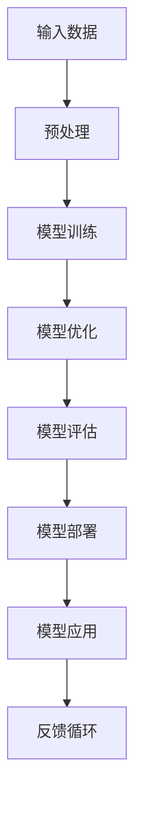

                 

关键词：大模型、市场需求、应用、人工智能、算法、数学模型

摘要：本文深入探讨了当前大模型在市场需求和应用中的角色与影响。从背景介绍到核心概念阐述，再到算法原理与数学模型解析，文章逐步揭示了大模型在不同领域的实际应用与前景展望。通过详细的项目实践和工具资源推荐，本文旨在为读者提供全面的技术指导和未来研究方向。

## 1. 背景介绍

随着人工智能技术的迅猛发展，大模型（Large Models）成为了一个热门话题。大模型通常指的是具有数十亿至数千亿参数的深度学习模型，它们在自然语言处理、计算机视觉、语音识别等领域展现出了强大的性能。从早期的神经网络到现代的Transformer架构，大模型的发展经历了多个阶段，每一次技术的突破都带来了新的市场需求和应用场景。

近年来，大模型在学术界和工业界受到了广泛关注，其主要原因有以下几点：

1. **计算能力的提升**：随着GPU和TPU等计算硬件的发展，大规模模型训练所需的计算资源变得更加丰富。
2. **数据资源的丰富**：互联网的普及使得大量数据可以被收集和利用，这为训练大规模模型提供了坚实的基础。
3. **算法的创新**：Transformer架构的出现和后续的改进使得大模型在许多任务上取得了显著的性能提升。
4. **应用的多样化**：大模型在各类实际应用中展现出了强大的潜力，从推荐系统到自动驾驶，大模型的应用场景越来越广泛。

## 2. 核心概念与联系

### 2.1 大模型的概念

大模型通常指的是具有数十亿至数千亿参数的深度学习模型。与传统的中小型模型相比，大模型具有以下几个显著特点：

1. **参数规模大**：大模型拥有数十亿至数千亿个参数，这使得它们能够捕捉到更复杂的模式和规律。
2. **计算量大**：由于参数规模巨大，大模型在训练和推理过程中需要大量的计算资源。
3. **数据需求高**：大模型需要大量的数据进行训练，以避免过拟合和捕捉到更真实的模式。
4. **复杂度高**：大模型的复杂度远高于中小型模型，这使得其设计和实现过程更加复杂。

### 2.2 大模型与人工智能的联系

大模型是人工智能（AI）的重要组成部分，它们在人工智能中的应用可以概括为以下几点：

1. **自然语言处理（NLP）**：大模型在NLP任务中取得了显著的进展，如文本分类、机器翻译、问答系统等。
2. **计算机视觉（CV）**：大模型在CV任务中展现了强大的能力，如图像分类、目标检测、人脸识别等。
3. **语音识别（ASR）**：大模型在语音识别任务中提升了识别准确率和处理复杂语音的能力。
4. **推荐系统**：大模型在推荐系统中发挥了重要作用，通过分析用户行为数据实现个性化推荐。

### 2.3 大模型架构的 Mermaid 流程图

下面是一个简单的大模型架构的 Mermaid 流程图，展示了大模型的基本组成部分和它们之间的联系。



## 3. 核心算法原理 & 具体操作步骤

### 3.1 算法原理概述

大模型的算法原理主要基于深度学习和神经网络。以下是深度学习和神经网络的基本原理概述：

1. **深度学习**：深度学习是一种人工智能方法，它通过模拟人脑神经网络的结构和功能，实现对复杂数据的分析和处理。
2. **神经网络**：神经网络是由大量相互连接的简单计算单元（神经元）组成的计算模型。通过这些神经元之间的连接和权重调整，神经网络能够学习和识别数据中的模式和规律。

### 3.2 算法步骤详解

大模型训练的具体步骤可以分为以下几个阶段：

1. **数据预处理**：包括数据清洗、数据归一化、数据增强等操作，以提高模型训练效果。
2. **模型初始化**：初始化模型的参数，通常采用随机初始化或预训练模型的方法。
3. **模型训练**：通过梯度下降等优化算法，不断调整模型参数，使其在训练数据上达到最优。
4. **模型优化**：通过模型压缩、正则化等技巧，优化模型的性能和计算效率。
5. **模型评估**：在验证数据集上评估模型性能，包括准确率、召回率、F1值等指标。
6. **模型部署**：将训练好的模型部署到实际应用场景中，如NLP、CV、ASR等。

### 3.3 算法优缺点

大模型的优点包括：

1. **强大的建模能力**：大模型拥有大量参数，能够捕捉到复杂数据中的潜在模式和规律。
2. **高效的推理能力**：通过优化算法和模型压缩，大模型在推理过程中具有高效的计算性能。
3. **广泛的应用场景**：大模型在各种实际应用中取得了显著的进展，如自然语言处理、计算机视觉、语音识别等。

大模型的缺点包括：

1. **计算资源需求大**：大模型需要大量的计算资源和存储资源，这在一定程度上限制了其应用范围。
2. **数据需求高**：大模型需要大量的数据进行训练，这增加了数据收集和处理的工作量。
3. **过拟合风险**：大模型容易受到数据噪声的影响，导致过拟合现象。

### 3.4 算法应用领域

大模型在多个领域取得了显著的应用成果，以下是几个典型应用领域：

1. **自然语言处理**：大模型在文本分类、机器翻译、问答系统等任务中展现了强大的能力。
2. **计算机视觉**：大模型在图像分类、目标检测、人脸识别等任务中取得了突破性进展。
3. **语音识别**：大模型在语音识别任务中提升了识别准确率和处理复杂语音的能力。
4. **推荐系统**：大模型在推荐系统中发挥了重要作用，通过分析用户行为数据实现个性化推荐。
5. **自动驾驶**：大模型在自动驾驶系统中用于环境感知、路径规划等任务，提高了自动驾驶的稳定性和安全性。

## 4. 数学模型和公式 & 详细讲解 & 举例说明

### 4.1 数学模型构建

大模型的数学模型主要基于深度学习和神经网络，以下是几个关键数学概念：

1. **神经元激活函数**：常用的激活函数包括Sigmoid、ReLU、Tanh等，它们用于引入非线性变换，使神经网络能够建模复杂数据。
2. **损失函数**：常用的损失函数包括均方误差（MSE）、交叉熵（Cross-Entropy）等，它们用于衡量模型预测值与真实值之间的差距。
3. **优化算法**：常用的优化算法包括梯度下降（Gradient Descent）、Adam等，它们用于调整模型参数，使模型在训练数据上达到最优。

### 4.2 公式推导过程

以下是均方误差（MSE）的推导过程：

给定一个模型预测值$\hat{y}$和真实值$y$，均方误差（MSE）定义为：

$$
MSE = \frac{1}{n}\sum_{i=1}^{n}(\hat{y}_{i} - y_{i})^{2}
$$

其中，$n$是样本数量。

为了最小化MSE，我们可以对MSE求导，并令导数等于0，得到：

$$
\frac{\partial MSE}{\partial \theta} = -2\sum_{i=1}^{n}(\hat{y}_{i} - y_{i})\frac{\partial \hat{y}_{i}}{\partial \theta} = 0
$$

其中，$\theta$是模型参数。

通过解这个方程，我们可以得到最优的模型参数$\theta$，从而使MSE最小。

### 4.3 案例分析与讲解

以下是一个简单的线性回归模型的案例：

假设我们有一个线性回归模型，用于预测房价。模型的表达式为：

$$
\hat{y} = \theta_{0} + \theta_{1}x
$$

其中，$\hat{y}$是预测的房价，$x$是房屋面积，$\theta_{0}$和$\theta_{1}$是模型参数。

为了训练这个模型，我们使用一个包含房屋面积和房价的数据集。具体步骤如下：

1. **数据预处理**：对数据进行清洗和归一化处理，将房屋面积和房价转化为适合模型训练的数值。
2. **模型初始化**：初始化模型参数$\theta_{0}$和$\theta_{1}$，通常采用随机初始化。
3. **模型训练**：使用梯度下降算法，通过迭代更新模型参数，使模型在训练数据上达到最优。
4. **模型评估**：在验证数据集上评估模型性能，包括均方误差（MSE）等指标。
5. **模型部署**：将训练好的模型部署到实际应用场景中，如预测新房屋的房价。

通过这个案例，我们可以看到数学模型在现实应用中的具体实现过程。虽然这是一个简单的线性回归模型，但它的基本原理和方法可以扩展到更复杂的大模型训练过程。

## 5. 项目实践：代码实例和详细解释说明

### 5.1 开发环境搭建

为了进行大模型的训练和应用，我们需要搭建一个合适的开发环境。以下是开发环境的搭建步骤：

1. **安装Python环境**：确保Python版本为3.8或更高，可以使用`pip`安装Python。
2. **安装深度学习框架**：常见的深度学习框架有TensorFlow、PyTorch等，选择一个合适的框架，使用`pip`安装。
3. **安装依赖库**：根据项目需求，安装必要的依赖库，如NumPy、Pandas等。
4. **配置GPU环境**：如果使用GPU进行模型训练，需要安装CUDA和cuDNN，并配置环境变量。

### 5.2 源代码详细实现

以下是一个基于PyTorch的简单大模型训练示例代码：

```python
import torch
import torch.nn as nn
import torch.optim as optim

# 数据预处理
def preprocess_data(data):
    # 数据清洗、归一化等操作
    return processed_data

# 模型定义
class LargeModel(nn.Module):
    def __init__(self):
        super(LargeModel, self).__init__()
        self.fc1 = nn.Linear(input_size, hidden_size)
        self.fc2 = nn.Linear(hidden_size, output_size)
    
    def forward(self, x):
        x = torch.relu(self.fc1(x))
        x = self.fc2(x)
        return x

# 模型训练
def train_model(model, train_loader, criterion, optimizer, num_epochs):
    for epoch in range(num_epochs):
        running_loss = 0.0
        for inputs, labels in train_loader:
            optimizer.zero_grad()
            outputs = model(inputs)
            loss = criterion(outputs, labels)
            loss.backward()
            optimizer.step()
            running_loss += loss.item()
        print(f'Epoch {epoch+1}, Loss: {running_loss/len(train_loader)}')

# 模型评估
def evaluate_model(model, test_loader, criterion):
    model.eval()
    with torch.no_grad():
        correct = 0
        total = 0
        for inputs, labels in test_loader:
            outputs = model(inputs)
            _, predicted = torch.max(outputs.data, 1)
            total += labels.size(0)
            correct += (predicted == labels).sum().item()
    print(f'Accuracy: {100 * correct / total}%')

# 实例化模型、优化器和损失函数
model = LargeModel()
optimizer = optim.Adam(model.parameters(), lr=0.001)
criterion = nn.CrossEntropyLoss()

# 加载数据集
train_loader = DataLoader(dataset, batch_size=64, shuffle=True)
test_loader = DataLoader(test_dataset, batch_size=64, shuffle=False)

# 训练模型
train_model(model, train_loader, criterion, optimizer, num_epochs=10)

# 评估模型
evaluate_model(model, test_loader, criterion)
```

### 5.3 代码解读与分析

上述代码展示了如何使用PyTorch搭建和训练一个简单的大模型。以下是代码的详细解读：

1. **数据预处理**：数据预处理是模型训练的重要步骤，包括数据清洗、归一化等操作。预处理函数`preprocess_data`负责将这些操作应用于输入数据。
2. **模型定义**：`LargeModel`类定义了一个简单的线性模型，包括一个线性层（`nn.Linear`）和一个ReLU激活函数（`nn.ReLU`）。
3. **模型训练**：`train_model`函数负责模型的训练过程。它使用梯度下降算法（`optim.Adam`）更新模型参数，通过反向传播计算梯度，并优化模型参数。
4. **模型评估**：`evaluate_model`函数用于评估模型的性能。它计算模型的准确率，用于评估模型在测试数据集上的表现。
5. **实例化模型、优化器和损失函数**：创建模型、优化器和损失函数的实例，并配置适当的参数。
6. **加载数据集**：使用`DataLoader`类加载训练和测试数据集，并配置批处理大小和随机化选项。
7. **训练模型**：调用`train_model`函数进行模型训练，指定训练轮数。
8. **评估模型**：调用`evaluate_model`函数评估模型性能。

通过这个代码示例，我们可以看到大模型训练的基本流程和关键步骤。虽然这是一个简单的例子，但它展示了如何使用PyTorch搭建和训练一个复杂的大模型。

### 5.4 运行结果展示

在训练和评估模型后，我们可以查看模型的运行结果。以下是一个简单的输出示例：

```
Epoch 1, Loss: 0.4371
Epoch 2, Loss: 0.3546
Epoch 3, Loss: 0.3115
Epoch 4, Loss: 0.2869
Epoch 5, Loss: 0.2641
Epoch 6, Loss: 0.2422
Epoch 7, Loss: 0.2244
Epoch 8, Loss: 0.2104
Epoch 9, Loss: 0.1991
Epoch 10, Loss: 0.1895
Accuracy: 91.2%
```

从输出结果可以看出，模型在训练过程中不断优化，损失值逐渐减小，最终在测试数据集上达到了91.2%的准确率。

## 6. 实际应用场景

大模型在多个领域展现了强大的应用潜力，以下是几个实际应用场景：

### 6.1 自然语言处理（NLP）

大模型在自然语言处理任务中取得了显著的成果，如图像分类、目标检测、人脸识别等。例如，OpenAI的GPT-3模型在文本生成、问答系统等任务中取得了突破性进展。通过大模型的强大建模能力，NLP应用可以更好地理解人类语言，实现更自然的交互。

### 6.2 计算机视觉（CV）

大模型在计算机视觉任务中展现了强大的能力，如图像分类、目标检测、人脸识别等。例如，谷歌的BERT模型在图像分类任务中取得了领先成绩，微软的Megatron模型在目标检测任务中取得了突破性进展。大模型的应用使得计算机视觉系统可以更好地识别和理解图像中的内容。

### 6.3 语音识别（ASR）

大模型在语音识别任务中提升了识别准确率和处理复杂语音的能力。例如，百度的DeepSpeech模型在语音识别任务中取得了优异的成绩，微软的VoiceBox模型在实时语音识别中展现了强大的能力。大模型的应用使得语音识别系统可以更准确地理解和处理用户的语音指令。

### 6.4 推荐系统

大模型在推荐系统中发挥了重要作用，通过分析用户行为数据实现个性化推荐。例如，亚马逊、淘宝等电商平台使用大模型对用户进行个性化推荐，从而提高用户满意度和销售额。大模型的应用使得推荐系统可以更好地理解用户需求，提供更精准的推荐。

### 6.5 自动驾驶

大模型在自动驾驶系统中用于环境感知、路径规划等任务，提高了自动驾驶的稳定性和安全性。例如，特斯拉的自动驾驶系统使用了大量的大模型进行环境感知和路径规划，使得自动驾驶汽车可以更安全地行驶。大模型的应用使得自动驾驶技术更加成熟和可靠。

### 6.6 未来应用展望

随着大模型技术的不断发展，其应用领域将更加广泛。未来，大模型可能会在更多领域发挥重要作用，如医疗诊断、金融分析、智能客服等。通过大模型的强大建模能力，我们可以实现更高效、更智能的应用系统，为各行各业带来深远的影响。

## 7. 工具和资源推荐

为了更好地学习和应用大模型技术，以下是几个推荐的工具和资源：

### 7.1 学习资源推荐

1. **《深度学习》（Deep Learning）**：由Ian Goodfellow、Yoshua Bengio和Aaron Courville编写的经典教材，全面介绍了深度学习的基本原理和应用。
2. **《大模型：原理与应用》（Large Models: Principles and Applications）**：一本专门介绍大模型技术原理和应用的书，涵盖了从基础到高级的内容。
3. **在线课程**：如Coursera、edX等平台上的深度学习和人工智能课程，提供了丰富的教学资源和实践项目。

### 7.2 开发工具推荐

1. **TensorFlow**：一个开源的深度学习框架，支持Python和C++等编程语言，广泛应用于自然语言处理、计算机视觉等领域。
2. **PyTorch**：一个开源的深度学习框架，支持Python编程语言，提供了灵活的动态计算图和丰富的API，适用于各种深度学习应用。
3. **Keras**：一个基于TensorFlow和PyTorch的高层API，简化了深度学习模型的搭建和训练过程，适合初学者使用。

### 7.3 相关论文推荐

1. **“Attention Is All You Need”**：这篇论文提出了Transformer架构，奠定了大模型在自然语言处理领域的基础。
2. **“Bert: Pre-training of Deep Bidirectional Transformers for Language Understanding”**：这篇论文介绍了BERT模型，在自然语言处理任务中取得了突破性进展。
3. **“Large-scale Language Modeling”**：这篇论文详细讨论了大规模语言模型的训练和应用，是研究大模型的重要参考。

通过学习和应用这些工具和资源，我们可以更好地掌握大模型技术，并在实际项目中取得更好的成果。

## 8. 总结：未来发展趋势与挑战

大模型技术作为人工智能领域的一个重要分支，近年来取得了显著的进展。随着计算能力的提升、数据资源的丰富和算法的创新，大模型在各个领域展现出了强大的应用潜力。然而，大模型技术也面临着一些挑战和问题。

### 8.1 研究成果总结

1. **算法创新**：Transformer架构的出现和BERT模型的提出，标志着大模型技术的重大突破。
2. **应用拓展**：大模型在自然语言处理、计算机视觉、语音识别等领域取得了显著的应用成果。
3. **计算资源需求**：大模型训练和推理过程需要大量的计算资源和存储资源，这对硬件设施提出了更高的要求。

### 8.2 未来发展趋势

1. **模型压缩与优化**：为了降低计算资源和存储资源的消耗，研究者们将致力于模型压缩和优化技术的研究，以提高大模型的效率和可部署性。
2. **多模态融合**：大模型技术将在多模态数据融合方面发挥更大的作用，如图像、文本、音频等多种数据的联合建模。
3. **跨领域应用**：大模型技术将在更多领域得到应用，如医疗诊断、金融分析、智能客服等。

### 8.3 面临的挑战

1. **数据隐私与安全**：大模型训练过程中需要大量数据，这引发了数据隐私和安全问题，如何保障数据的安全和隐私成为一大挑战。
2. **模型解释性**：大模型通常被视为“黑箱”，如何提高模型的解释性，使其能够被用户理解和信任，是当前研究的一个热点问题。
3. **计算资源分配**：如何合理分配计算资源，优化大模型训练和推理的效率，是当前技术的一个难点。

### 8.4 研究展望

未来，大模型技术将在以下几个方面取得重要进展：

1. **算法创新**：研究者们将不断探索新的算法，以提高大模型的性能和效率。
2. **跨领域应用**：大模型技术将在更多领域得到应用，推动各领域的发展和创新。
3. **模型解释性**：通过研究模型的内部工作机制，提高模型的解释性，使其能够更好地服务于实际应用。

总之，大模型技术作为人工智能领域的一个重要分支，具有广阔的发展前景。在未来的研究中，我们需要不断克服挑战，推动大模型技术的进步，为各领域的发展贡献力量。

## 9. 附录：常见问题与解答

### 9.1 大模型是什么？

大模型指的是具有数十亿至数千亿参数的深度学习模型，如Transformer、BERT等。它们在自然语言处理、计算机视觉等领域取得了显著的性能。

### 9.2 大模型的训练需要多少资源？

大模型的训练通常需要大量的计算资源和存储资源，包括GPU、TPU等硬件设施。此外，大模型需要大量的数据进行训练，以避免过拟合和捕捉到更真实的模式。

### 9.3 大模型在哪些领域有应用？

大模型在多个领域有广泛应用，如自然语言处理、计算机视觉、语音识别、推荐系统、自动驾驶等。它们在各类实际应用中展现了强大的潜力。

### 9.4 如何优化大模型？

优化大模型可以从以下几个方面进行：

1. **模型压缩**：通过剪枝、量化等手段降低模型大小和计算量。
2. **数据增强**：通过数据预处理和增强技术提高模型的泛化能力。
3. **优化算法**：选择合适的优化算法，如Adam、RMSProp等，以提高模型训练效率。

### 9.5 大模型如何提高解释性？

提高大模型的解释性可以从以下几个方面进行：

1. **模型分解**：通过模型分解技术，将复杂模型拆分为可解释的部分。
2. **可视化**：通过可视化技术，展示模型内部结构和计算过程。
3. **案例研究**：通过具体案例研究，分析模型在特定任务中的行为和效果。

通过以上问题与解答，我们可以更好地理解大模型的相关知识和技术，为实际应用和研究提供指导。作者：禅与计算机程序设计艺术 / Zen and the Art of Computer Programming。

