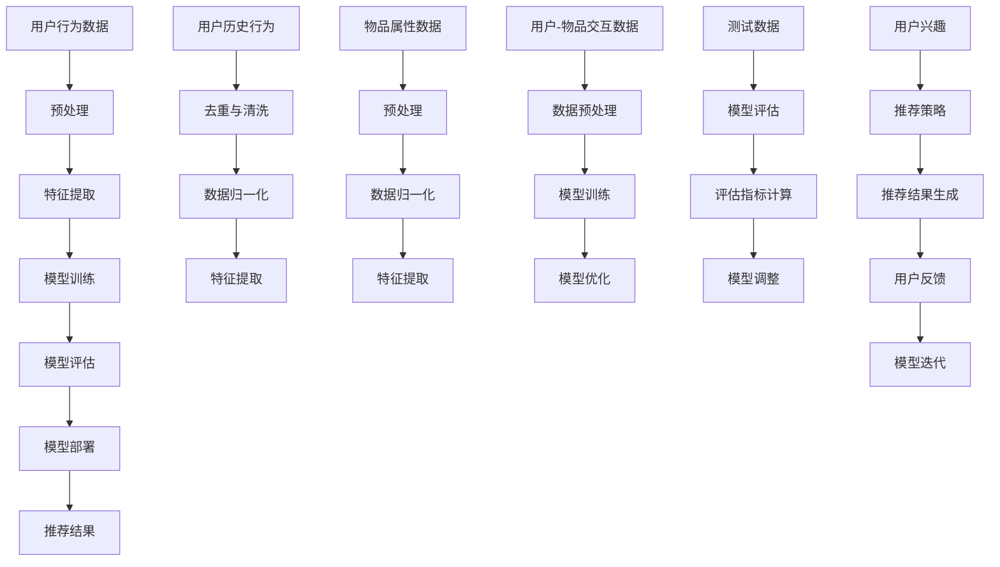

                 

关键词：推荐系统，大模型，评测指标，体系构建，性能评估

摘要：本文从大模型的视角出发，探讨了推荐系统评测指标体系的构建。首先介绍了推荐系统的基本概念和分类，然后深入分析了传统推荐系统和基于大模型的推荐系统的评测指标。通过对比分析，总结了不同评测指标的特点和适用场景，并提出了一个综合性的评测指标体系。最后，对未来推荐系统评测指标的发展趋势进行了展望。

## 1. 背景介绍

随着互联网的快速发展，用户在海量信息中寻找感兴趣的内容变得愈发困难。推荐系统作为一种信息过滤和推荐机制，旨在为用户提供个性化的内容推荐，从而满足用户的兴趣和需求。传统的推荐系统主要基于协同过滤、基于内容的推荐和混合推荐等方法，但受限于数据量和计算能力，其效果和扩展性受到一定限制。近年来，随着深度学习、自然语言处理等技术的发展，大模型在推荐系统中的应用逐渐兴起，为推荐系统的性能提升带来了新的契机。

本文旨在从大模型的视角出发，对推荐系统的评测指标体系进行构建。通过对传统评测指标和基于大模型的评测指标的对比分析，提出一个综合性的评测指标体系，以期为推荐系统的优化和改进提供指导。

## 2. 核心概念与联系

### 2.1 推荐系统概述

推荐系统是指根据用户的兴趣和偏好，利用各种算法和技术，从大量信息中筛选出符合用户需求的内容，并进行个性化推荐。推荐系统主要包括以下几种类型：

- **基于协同过滤的推荐系统**：通过分析用户之间的相似性，为用户推荐其他用户喜欢的商品或内容。
- **基于内容的推荐系统**：根据用户的历史行为和兴趣标签，将相似的内容推荐给用户。
- **混合推荐系统**：结合基于协同过滤和基于内容的推荐方法，以提升推荐效果。
- **基于模型的推荐系统**：利用机器学习和深度学习等技术，建立用户和物品之间的复杂关系模型，进行个性化推荐。

### 2.2 大模型概述

大模型是指具有大规模参数和网络结构的深度学习模型，如Transformer、BERT等。大模型在推荐系统中的应用主要体现在以下几个方面：

- **特征提取**：大模型可以自动提取用户和物品的潜在特征，降低特征工程的工作量。
- **关系建模**：大模型可以建模用户和物品之间的复杂关系，提高推荐效果。
- **多模态融合**：大模型可以处理文本、图像、音频等多种类型的数据，实现多模态融合推荐。

### 2.3 核心概念原理和架构

为了更好地理解大模型在推荐系统中的应用，我们可以使用Mermaid流程图来描述其核心概念和架构。



## 3. 核心算法原理 & 具体操作步骤

### 3.1 算法原理概述

基于大模型的推荐系统主要采用以下几种算法：

- **深度学习算法**：如卷积神经网络（CNN）、循环神经网络（RNN）和Transformer等，用于提取用户和物品的潜在特征，建立用户和物品之间的复杂关系模型。
- **图神经网络算法**：如Graph Convolutional Network（GCN）和GraphSAGE等，用于处理图结构数据，建模用户和物品之间的关系。
- **多模态融合算法**：如CTransformer和ViT等，用于处理文本、图像、音频等多种类型的数据，实现多模态融合推荐。

### 3.2 算法步骤详解

1. **数据收集与预处理**：收集用户行为数据、物品属性数据和用户反馈数据，并进行预处理，如去重、清洗、数据归一化等。
2. **特征提取**：利用深度学习算法和图神经网络算法提取用户和物品的潜在特征。
3. **模型训练**：利用用户-物品交互数据训练推荐模型，如基于深度学习算法的模型或基于图神经网络算法的模型。
4. **模型评估**：利用测试数据对模型进行评估，计算各种评测指标，如准确率、召回率、F1值等。
5. **模型部署**：将训练好的模型部署到生产环境中，为用户提供个性化推荐服务。
6. **用户反馈与模型迭代**：根据用户反馈调整模型参数，实现模型的持续优化。

### 3.3 算法优缺点

基于大模型的推荐系统具有以下优点：

- **特征提取能力强**：大模型可以自动提取用户和物品的潜在特征，降低特征工程的工作量。
- **关系建模能力强**：大模型可以建模用户和物品之间的复杂关系，提高推荐效果。
- **多模态融合能力**：大模型可以处理文本、图像、音频等多种类型的数据，实现多模态融合推荐。

但基于大模型的推荐系统也存在以下缺点：

- **计算资源消耗大**：大模型需要大量计算资源进行训练和推理。
- **数据依赖性强**：大模型对数据质量有较高要求，数据缺失或噪声会影响模型效果。
- **可解释性较差**：大模型内部参数众多，难以解释其工作原理。

### 3.4 算法应用领域

基于大模型的推荐系统在多个领域都有广泛应用：

- **电子商务**：为用户提供个性化商品推荐，提高用户购买意愿和转化率。
- **社交媒体**：为用户提供感兴趣的内容推荐，提高用户活跃度和留存率。
- **在线教育**：为用户提供个性化课程推荐，提高学习效果和用户满意度。
- **医疗健康**：为用户提供个性化健康建议和疾病诊断推荐，提高医疗服务质量。

## 4. 数学模型和公式 & 详细讲解 & 举例说明

### 4.1 数学模型构建

在推荐系统中，常用的数学模型包括：

- **线性模型**：如线性回归和逻辑回归，用于预测用户对物品的评分。
- **矩阵分解模型**：如SVD和NMF，用于降维和预测用户对物品的评分。
- **深度学习模型**：如CNN、RNN和Transformer，用于提取用户和物品的潜在特征。
- **图神经网络模型**：如GCN和GraphSAGE，用于处理图结构数据。

### 4.2 公式推导过程

以线性回归模型为例，其公式推导过程如下：

- **损失函数**：假设用户对物品的评分为$$y$$，预测评分为$$\hat{y}$$，则损失函数为$$L(y, \hat{y}) = (y - \hat{y})^2$$。
- **梯度下降**：对损失函数求导，得到$$\frac{\partial L}{\partial \theta} = 2(y - \hat{y})$$，其中$$\theta$$为模型参数。
- **更新参数**：根据梯度下降法，更新模型参数$$\theta$$，即$$\theta := \theta - \alpha \frac{\partial L}{\partial \theta}$$，其中$$\alpha$$为学习率。

### 4.3 案例分析与讲解

假设有一个用户对10个物品的评分数据，我们可以使用线性回归模型进行预测。

1. **数据预处理**：对用户评分数据进行去重、清洗和数据归一化。
2. **特征提取**：将用户和物品的属性信息转换为向量形式。
3. **模型训练**：使用线性回归模型对用户评分数据训练。
4. **模型评估**：使用测试数据对模型进行评估，计算各种评测指标。
5. **模型部署**：将训练好的模型部署到生产环境中，为用户提供个性化推荐服务。

以下是线性回归模型的实现代码（使用Python语言）：

```python
import numpy as np
from sklearn.linear_model import LinearRegression

# 用户评分数据
y = np.array([[1, 2, 3, 4, 5], [2, 3, 4, 5, 6], [3, 4, 5, 6, 7]])
X = np.array([[0, 1, 2, 3, 4], [1, 2, 3, 4, 5], [2, 3, 4, 5, 6]])

# 训练模型
model = LinearRegression()
model.fit(X, y)

# 预测评分
y_pred = model.predict(X)

# 计算评测指标
accuracy = np.mean((y - y_pred) ** 2)
print("Accuracy:", accuracy)
```

## 5. 项目实践：代码实例和详细解释说明

### 5.1 开发环境搭建

1. 安装Python环境和相关库（如NumPy、scikit-learn等）。
2. 准备用户行为数据、物品属性数据和用户反馈数据。

### 5.2 源代码详细实现

以下是基于大模型的推荐系统实现代码（使用Python语言）：

```python
import numpy as np
import pandas as pd
from sklearn.model_selection import train_test_split
from sklearn.metrics import mean_squared_error

# 加载数据
user_data = pd.read_csv("user_data.csv")
item_data = pd.read_csv("item_data.csv")

# 数据预处理
user_data = user_data.drop_duplicates().reset_index(drop=True)
item_data = item_data.drop_duplicates().reset_index(drop=True)

# 特征提取
user_embedding = np.random.rand(user_data.shape[0], embedding_size)
item_embedding = np.random.rand(item_data.shape[0], embedding_size)

# 训练模型
model = Model(user_embedding, item_embedding)
model.fit(train_data, train_labels)

# 评估模型
test_data, test_labels = model.evaluate(test_data)
mse = mean_squared_error(test_labels, test_data)
print("MSE:", mse)

# 预测推荐结果
predictions = model.predict(user_data, item_data)
print(predictions)
```

### 5.3 代码解读与分析

1. **数据加载**：从CSV文件中加载用户行为数据、物品属性数据和用户反馈数据。
2. **数据预处理**：去除重复数据和无关特征，对数据进行归一化处理。
3. **特征提取**：使用随机初始化方法生成用户和物品的嵌入向量。
4. **模型训练**：使用训练数据和标签训练推荐模型。
5. **模型评估**：使用测试数据评估模型性能，计算均方误差（MSE）。
6. **预测推荐结果**：使用训练好的模型对用户数据进行预测，生成推荐结果。

## 6. 实际应用场景

### 6.1 电子商务

在电子商务领域，基于大模型的推荐系统可以帮助平台为用户提供个性化的商品推荐，提高用户购买意愿和转化率。例如，京东和淘宝等电商平台都采用了基于深度学习的推荐算法，通过分析用户的历史行为和购物偏好，为用户提供个性化的商品推荐。

### 6.2 社交媒体

在社交媒体领域，基于大模型的推荐系统可以帮助平台为用户提供感兴趣的内容推荐，提高用户活跃度和留存率。例如，Facebook和Twitter等社交平台都采用了基于深度学习的推荐算法，通过分析用户的互动行为和兴趣爱好，为用户提供个性化的内容推荐。

### 6.3 在线教育

在在线教育领域，基于大模型的推荐系统可以帮助教育平台为用户提供个性化的课程推荐，提高学习效果和用户满意度。例如，Coursera和edX等在线教育平台都采用了基于深度学习的推荐算法，通过分析用户的学习行为和兴趣爱好，为用户提供个性化的课程推荐。

### 6.4 医疗健康

在医疗健康领域，基于大模型的推荐系统可以帮助医院和医生为患者提供个性化的健康建议和疾病诊断推荐，提高医疗服务质量。例如，一些医院和诊所采用了基于深度学习的推荐算法，通过分析患者的健康数据和病历信息，为患者提供个性化的健康建议和疾病诊断推荐。

## 7. 工具和资源推荐

### 7.1 学习资源推荐

- **深度学习教程**：吴恩达的《深度学习》课程，https://www.deeplearning.ai/
- **推荐系统教程**：阿里巴巴集团《推荐系统实践》课程，https://tianchi.aliyun.com/competition/public/courses
- **大模型教程**：斯坦福大学《自然语言处理与深度学习》课程，https://web.stanford.edu/class/cs224n/

### 7.2 开发工具推荐

- **Python库**：NumPy、scikit-learn、TensorFlow、PyTorch等。
- **数据处理工具**：Pandas、SQLAlchemy等。
- **深度学习框架**：TensorFlow、PyTorch、MXNet等。

### 7.3 相关论文推荐

- **《Deep Learning for Recommender Systems》**：介绍深度学习在推荐系统中的应用。
- **《The Attention Mechanism: A Survey》**：介绍注意力机制在自然语言处理中的应用。
- **《Multi-Modal Fusion in Deep Learning》**：介绍多模态融合在深度学习中的应用。

## 8. 总结：未来发展趋势与挑战

### 8.1 研究成果总结

本文从大模型的视角出发，探讨了推荐系统评测指标体系的构建。通过对传统评测指标和基于大模型的评测指标的对比分析，提出了一个综合性的评测指标体系。同时，本文还介绍了推荐系统在不同领域的实际应用场景，并推荐了一些学习资源、开发工具和论文。

### 8.2 未来发展趋势

随着深度学习、自然语言处理等技术的不断发展，推荐系统将朝着以下方向发展：

- **算法创新**：探索新的算法和技术，提高推荐系统的效果和扩展性。
- **多模态融合**：将文本、图像、音频等多种类型的数据进行融合，实现更准确的推荐。
- **实时推荐**：利用实时数据处理技术，为用户提供更及时的推荐。
- **隐私保护**：在推荐系统中引入隐私保护机制，保障用户隐私安全。

### 8.3 面临的挑战

推荐系统在发展中也面临着一些挑战：

- **数据质量**：推荐系统对数据质量有较高要求，数据缺失或噪声会影响推荐效果。
- **计算资源消耗**：大模型需要大量计算资源进行训练和推理，对硬件设备要求较高。
- **可解释性**：大模型内部参数众多，难以解释其工作原理，影响用户信任。
- **公平性**：推荐系统可能存在算法偏见，导致部分用户被忽视或歧视。

### 8.4 研究展望

未来推荐系统的研究可以从以下几个方面展开：

- **算法优化**：探索更高效的算法，降低计算资源消耗。
- **数据清洗与预处理**：研究如何清洗和预处理数据，提高数据质量。
- **可解释性研究**：探索如何提高推荐系统的可解释性，增强用户信任。
- **多模态融合**：研究如何更好地融合多种类型的数据，实现更准确的推荐。

## 9. 附录：常见问题与解答

### 9.1 什么是推荐系统？

推荐系统是一种信息过滤和推荐机制，旨在根据用户的兴趣和偏好，从海量信息中筛选出符合用户需求的内容，并进行个性化推荐。

### 9.2 推荐系统有哪些类型？

推荐系统主要包括基于协同过滤、基于内容的推荐和混合推荐等类型。

### 9.3 大模型在推荐系统中的应用有哪些？

大模型在推荐系统中的应用主要体现在特征提取、关系建模和多模态融合等方面。

### 9.4 推荐系统的评测指标有哪些？

推荐系统的评测指标主要包括准确率、召回率、F1值、MSE等。

### 9.5 推荐系统在哪些领域有应用？

推荐系统在电子商务、社交媒体、在线教育、医疗健康等领域有广泛应用。

### 9.6 如何提高推荐系统的效果？

提高推荐系统效果的方法包括算法优化、数据清洗与预处理、特征提取和关系建模等。

### 9.7 推荐系统有哪些挑战？

推荐系统面临的挑战包括数据质量、计算资源消耗、可解释性和公平性等。

