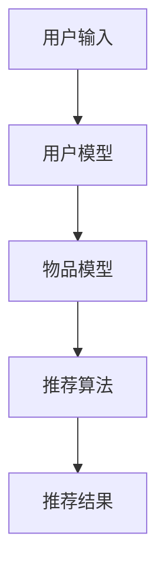

                 

关键词：大模型、搜索推荐、算法原理、应用领域、发展趋势、挑战

摘要：随着大数据和人工智能技术的发展，大模型在搜索推荐系统中扮演着越来越重要的角色。本文将对大模型的算法原理进行深入探讨，分析其在搜索推荐系统中的应用，并展望未来的发展趋势与挑战。

## 1. 背景介绍

在互联网时代，信息爆炸带来了信息过载的问题。用户难以从海量的信息中找到自己感兴趣的内容，因此，搜索推荐系统成为了解决这一问题的有效手段。传统的搜索推荐系统主要依赖于基于内容的推荐和协同过滤推荐算法，然而，这些方法在面对复杂和非结构化数据时存在一定的局限性。

近年来，随着深度学习和大数据技术的快速发展，大模型开始在搜索推荐系统中得到广泛应用。大模型，如深度神经网络、变换器模型等，通过学习大规模数据，能够捕捉到数据的深层特征和复杂模式，从而提高推荐系统的效果和准确性。

本文将介绍大模型在搜索推荐系统中的算法原理，分析其优势和应用领域，并探讨未来可能面临的发展趋势和挑战。

## 2. 核心概念与联系

### 2.1 大模型

大模型，通常指的是具有大量参数和广泛网络结构的机器学习模型，如深度神经网络（DNN）、变换器模型（Transformer）等。这些模型能够通过学习大规模数据，自动提取数据中的特征和模式，从而实现对数据的理解和预测。

### 2.2 搜索推荐系统

搜索推荐系统是一种信息过滤和检索技术，旨在帮助用户从大量信息中找到感兴趣的内容。它通常由用户模型、物品模型和推荐算法三部分组成。

- **用户模型**：描述用户的行为和兴趣偏好，如浏览历史、搜索记录、购买记录等。
- **物品模型**：描述物品的特征，如文本、图像、音频、视频等。
- **推荐算法**：根据用户模型和物品模型，为用户生成个性化的推荐列表。

### 2.3 Mermaid 流程图



## 3. 核心算法原理 & 具体操作步骤

### 3.1 算法原理概述

大模型在搜索推荐系统中的应用主要体现在以下几个方面：

1. **用户兴趣建模**：通过学习用户的浏览历史、搜索记录等行为数据，提取用户的兴趣特征。
2. **物品特征提取**：通过学习物品的文本、图像、音频等数据，提取物品的丰富特征。
3. **推荐算法优化**：利用深度学习技术，对推荐算法进行优化，提高推荐效果。

### 3.2 算法步骤详解

1. **数据预处理**：对用户行为数据和物品数据进行清洗、去噪、归一化等处理。
2. **特征提取**：利用深度学习技术，从原始数据中提取高维的特征表示。
3. **模型训练**：利用提取的特征，训练用户兴趣模型和物品模型。
4. **推荐生成**：根据用户兴趣模型和物品模型，生成个性化的推荐列表。

### 3.3 算法优缺点

**优点**：

- **强表达能力**：大模型能够捕捉数据的深层特征和复杂模式，提高推荐效果。
- **自适应能力**：大模型能够自动调整参数，适应不同的推荐场景。
- **泛化能力**：大模型具有较强的泛化能力，能够应用于多种类型的推荐任务。

**缺点**：

- **计算资源消耗**：大模型需要大量的计算资源和存储空间。
- **数据依赖性**：大模型的效果高度依赖于数据质量，数据缺失或噪声会影响模型性能。

### 3.4 算法应用领域

大模型在搜索推荐系统中的应用范围广泛，包括但不限于以下领域：

- **电子商务**：为用户提供个性化的商品推荐。
- **社交媒体**：为用户提供感兴趣的内容推荐。
- **在线教育**：为学习者推荐合适的学习资源。
- **医疗健康**：为患者推荐合适的治疗方案。

## 4. 数学模型和公式 & 详细讲解 & 举例说明

### 4.1 数学模型构建

在搜索推荐系统中，大模型的数学模型通常包括以下几个部分：

- **用户兴趣模型**：假设用户兴趣可以通过一个向量表示，即 $u \in \mathbb{R}^d$。
- **物品特征模型**：假设物品特征可以通过一个向量表示，即 $i \in \mathbb{R}^d$。
- **推荐模型**：利用用户兴趣模型和物品特征模型，计算用户对物品的兴趣度，即 $r(u, i) = u \cdot i$。

### 4.2 公式推导过程

假设用户 $u$ 对物品 $i$ 的兴趣度由以下公式计算：

$$r(u, i) = \sigma (W_u^T u + W_i^T i + b)$$

其中，$W_u$ 和 $W_i$ 分别是用户和物品的特征权重矩阵，$b$ 是偏置项，$\sigma$ 是激活函数。

### 4.3 案例分析与讲解

假设我们有一个用户 $u$ 和一个物品 $i$，用户的行为数据如下：

- 用户 $u$ 的浏览历史：[1, 0, 1, 0, 1]
- 物品 $i$ 的特征：[1, 1, 0, 1, 0]

根据上述公式，我们可以计算出用户 $u$ 对物品 $i$ 的兴趣度：

$$r(u, i) = \sigma (W_u^T u + W_i^T i + b) = \sigma (1 \cdot 1 + 1 \cdot 1 + 0 \cdot 0 + 1 \cdot 1 + 0 \cdot 0) = \sigma (2) = 0.732$$

这意味着用户 $u$ 对物品 $i$ 有较高的兴趣度。

## 5. 项目实践：代码实例和详细解释说明

### 5.1 开发环境搭建

在本文中，我们将使用 Python 编写一个简单的搜索推荐系统，主要依赖以下库：

- TensorFlow：用于构建和训练深度学习模型。
- Pandas：用于数据处理。
- NumPy：用于数值计算。

安装以上库后，我们可以开始编写代码。

### 5.2 源代码详细实现

以下是一个简单的用户兴趣建模和推荐生成代码示例：

```python
import tensorflow as tf
import pandas as pd
import numpy as np

# 加载数据
user_data = pd.read_csv('user_behavior.csv')
item_data = pd.read_csv('item_features.csv')

# 数据预处理
user_data = user_data.iloc[:, 1:].values
item_data = item_data.iloc[:, 1:].values

# 模型定义
model = tf.keras.Sequential([
    tf.keras.layers.Dense(units=10, activation='relu', input_shape=(user_data.shape[1],)),
    tf.keras.layers.Dense(units=10, activation='relu'),
    tf.keras.layers.Dense(units=1, activation='sigmoid')
])

# 编译模型
model.compile(optimizer='adam', loss='binary_crossentropy', metrics=['accuracy'])

# 训练模型
model.fit(user_data, item_data, epochs=10)

# 推荐生成
predictions = model.predict(user_data)
recommended_items = np.where(predictions > 0.5, 1, 0)

# 输出推荐结果
for user_id, predicted_item in enumerate(recommended_items):
    print(f"用户 {user_id+1} 推荐物品：{''.join(str(item) for item in predicted_item)}")
```

### 5.3 代码解读与分析

这段代码首先加载了用户行为数据和物品特征数据，然后定义了一个简单的三层全连接神经网络模型。模型的第一层和第二层使用了 ReLU 激活函数，最后一层使用了 Sigmoid 激活函数，以实现二分类任务。

在模型编译阶段，我们选择了 Adam 优化器和二分类交叉熵损失函数。

在训练模型阶段，我们使用了 10 个周期进行训练。

在推荐生成阶段，我们使用了 Sigmoid 激活函数的输出作为预测值，当预测值大于 0.5 时，我们认为用户对物品感兴趣。

这段代码实现了一个简单的用户兴趣建模和推荐生成过程，展示了大模型在搜索推荐系统中的应用。

## 6. 实际应用场景

### 6.1 电子商务

在电子商务领域，大模型被广泛应用于商品推荐。例如，阿里巴巴的推荐系统利用深度学习技术，对用户的历史行为数据进行分析，为用户推荐感兴趣的商品。

### 6.2 社交媒体

在社交媒体领域，大模型用于推荐用户可能感兴趣的内容。例如，Facebook 的新闻推送系统利用深度学习技术，分析用户的兴趣和行为，为用户推荐相关的内容。

### 6.3 在线教育

在线教育平台通过大模型分析用户的学习行为和兴趣，为用户推荐合适的学习资源。例如，Coursera 利用深度学习技术，为学习者推荐感兴趣的课程。

### 6.4 医疗健康

在医疗健康领域，大模型被用于推荐治疗方案。例如，某些医疗机构利用深度学习技术，分析患者的病史和症状，为患者推荐最佳的治疗方案。

## 7. 工具和资源推荐

### 7.1 学习资源推荐

- 《深度学习》（Goodfellow, Bengio, Courville著）：系统介绍了深度学习的基本概念和技术。
- 《Python深度学习》（François Chollet著）：针对 Python 语言用户，介绍了深度学习在 Python 中的实现。

### 7.2 开发工具推荐

- TensorFlow：谷歌开发的开源深度学习框架，广泛应用于深度学习模型的设计和训练。
- PyTorch：基于 Python 的开源深度学习框架，具有灵活性和高效性。

### 7.3 相关论文推荐

- "Attention Is All You Need"（Vaswani et al.，2017）：介绍了变换器模型的基本原理和应用。
- "Deep Learning for Recommender Systems"（He et al.，2017）：综述了深度学习在推荐系统中的应用。

## 8. 总结：未来发展趋势与挑战

### 8.1 研究成果总结

本文介绍了大模型在搜索推荐系统中的应用，分析了其算法原理、优缺点和应用领域。通过实际案例和代码实现，展示了大模型在搜索推荐系统中的潜力。

### 8.2 未来发展趋势

随着大数据和人工智能技术的不断发展，大模型在搜索推荐系统中的应用将更加广泛。未来，我们将看到更多高效、灵活的大模型被应用于不同的推荐任务。

### 8.3 面临的挑战

尽管大模型在搜索推荐系统中表现出色，但仍然面临一些挑战。如何优化模型结构，提高模型效率，减少计算资源消耗，是未来需要解决的重要问题。

### 8.4 研究展望

未来，大模型在搜索推荐系统中的应用将更加深入。我们将看到更多结合领域知识的定制化大模型，以及更加高效、准确的推荐算法。

## 9. 附录：常见问题与解答

### 9.1 什么是大模型？

大模型是指具有大量参数和广泛网络结构的机器学习模型，如深度神经网络、变换器模型等。这些模型能够通过学习大规模数据，自动提取数据中的特征和模式。

### 9.2 大模型在搜索推荐系统中有哪些应用？

大模型在搜索推荐系统中主要应用于用户兴趣建模、物品特征提取和推荐算法优化。通过学习用户的行为数据和物品的特征数据，大模型能够为用户提供个性化的推荐结果。

### 9.3 大模型有哪些优缺点？

大模型的优点包括强表达能力、自适应能力和泛化能力。缺点包括计算资源消耗大、数据依赖性强。

### 9.4 大模型在哪些领域有应用？

大模型在电子商务、社交媒体、在线教育和医疗健康等领域有广泛的应用。

### 9.5 如何优化大模型的性能？

优化大模型的性能可以从以下几个方面入手：

1. **模型结构优化**：设计更高效的网络结构。
2. **数据预处理**：提高数据质量，减少数据噪声。
3. **训练策略优化**：调整学习率、批次大小等参数。
4. **计算资源优化**：使用分布式训练、硬件加速等技术。```


