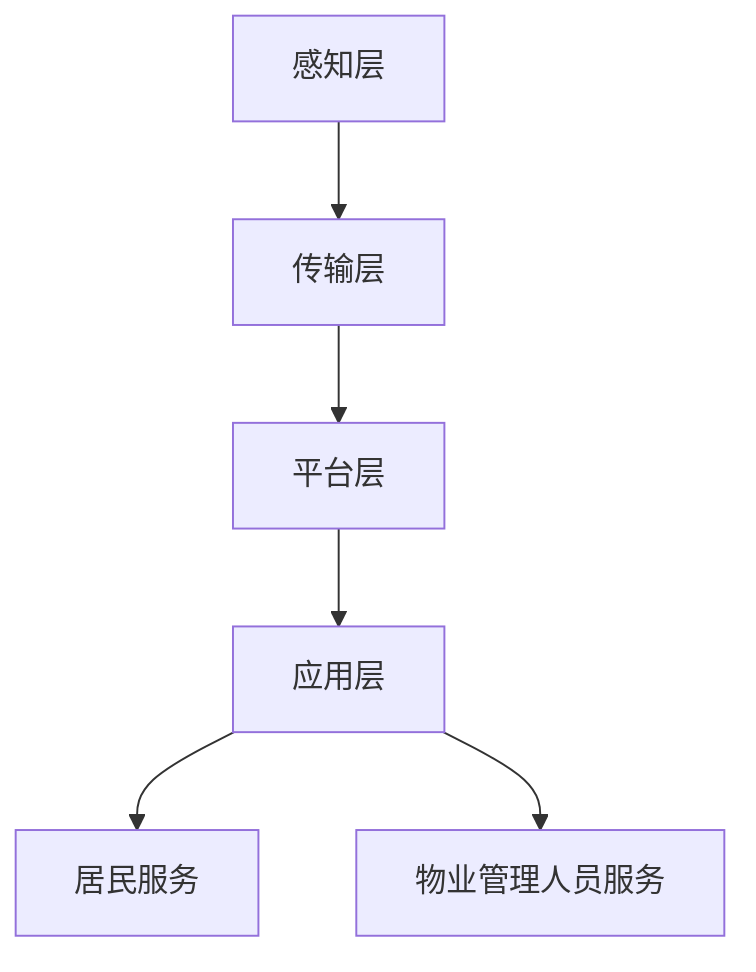

                 

在当今快速发展的数字化时代，智慧物业已经成为现代社区服务的重要组成部分。随着人工智能技术的不断进步，尤其是大模型的兴起，智慧物业的智能化水平得到了显著的提升。本文将探讨大模型如何赋能智慧物业，以及创业者如何利用这一技术打造出具备竞争力的智能化社区服务。

## 关键词

- 智慧物业
- 大模型
- 智能化社区服务
- 创业者
- 人工智能技术
- 物业管理

## 摘要

本文首先介绍了智慧物业的发展背景和重要性，随后详细探讨了人工智能技术，特别是大模型在智慧物业中的应用。通过分析大模型的核心算法原理、数学模型以及实际应用案例，文章揭示了创业者如何利用这些技术打造智能化社区服务。最后，文章展望了智慧物业的未来发展趋势，并提出了面临的挑战和应对策略。

## 1. 背景介绍

### 智慧物业的兴起

智慧物业是指通过物联网、大数据、云计算、人工智能等先进技术，实现物业管理的智能化、精细化和高效化。随着城市化进程的加速，社区规模不断扩大，传统的物业管理模式已难以满足居民对生活品质的追求。智慧物业的出现，不仅提升了物业管理水平，还为广大居民提供了更加便捷、舒适的生活体验。

### 人工智能技术在物业管理中的应用

人工智能技术是智慧物业发展的核心驱动力。在物业管理中，人工智能技术主要用于以下几个方面：

- **智能安防**：通过人脸识别、视频分析等技术，实现小区的安全监控和管理。
- **智能客服**：利用自然语言处理技术，提供24小时在线客服服务，解决居民的各种问题。
- **智能维修**：通过传感器和网络，实时监测物业设施设备状态，及时进行维修保养。
- **智能缴费**：实现水、电、煤气等费用的线上缴纳，提高居民生活的便利性。

### 大模型的兴起

大模型是指具有海量参数、能够处理大量数据的人工神经网络。近年来，随着计算能力的提升和数据规模的扩大，大模型在各个领域得到了广泛应用，如语音识别、图像处理、自然语言理解等。大模型的出现，使得人工智能技术的落地应用变得更加高效和精准。

## 2. 核心概念与联系

### 智慧物业管理系统架构

智慧物业管理系统架构可以分为以下几个层次：

- **感知层**：包括各种传感器，如摄像头、门禁、温度传感器等，用于收集社区环境数据。
- **传输层**：通过物联网技术，将感知层的数据传输到中心系统。
- **平台层**：实现对数据的存储、处理和分析，提供各种服务。
- **应用层**：为居民和物业管理人员提供智能化的服务。

### 大模型在智慧物业中的应用

大模型在智慧物业中的应用主要体现在以下几个方面：

- **智能安防**：利用大模型进行视频分析，实时监测社区安全状况，自动识别异常行为。
- **智能客服**：通过大模型实现自然语言处理，为居民提供高效、准确的在线客服服务。
- **智能维修**：利用大模型预测设备故障，提前进行维修保养，降低故障率。
- **智能能耗管理**：通过大模型分析能耗数据，优化能源使用，降低运营成本。

### Mermaid 流程图

以下是一个简单的 Mermaid 流程图，展示了智慧物业管理系统架构：



## 3. 核心算法原理 & 具体操作步骤

### 3.1 算法原理概述

智慧物业的核心算法主要基于深度学习技术，特别是大模型。深度学习通过多层神经网络对大量数据进行训练，从中提取特征，实现高度自动化的数据处理和分析。

### 3.2 算法步骤详解

1. **数据采集**：通过传感器、摄像头等设备，收集社区环境数据。
2. **数据预处理**：对采集到的数据进行清洗、归一化等处理，为后续训练做准备。
3. **模型训练**：使用大规模数据集，对深度学习模型进行训练，优化模型参数。
4. **模型评估**：通过测试数据集，评估模型的性能，调整模型参数。
5. **模型部署**：将训练好的模型部署到智慧物业管理系统，实现实时数据处理和分析。

### 3.3 算法优缺点

**优点**：

- **高效性**：深度学习模型能够自动提取数据特征，无需人工干预，大幅提高数据处理效率。
- **准确性**：通过大规模数据训练，模型能够实现高度准确的数据分析。
- **自适应**：深度学习模型具有自适应能力，能够根据环境变化进行实时调整。

**缺点**：

- **计算资源需求大**：深度学习模型训练需要大量计算资源，对硬件设备要求较高。
- **数据依赖性强**：深度学习模型的性能高度依赖数据质量，数据不足或质量差会导致模型失效。

### 3.4 算法应用领域

- **智能安防**：通过人脸识别、视频分析等算法，实现社区安全监控和管理。
- **智能客服**：通过自然语言处理算法，为居民提供高效的在线客服服务。
- **智能维修**：通过预测模型，提前发现设备故障，实现预防性维护。
- **智能能耗管理**：通过能耗数据分析，实现能源使用的优化。

## 4. 数学模型和公式 & 详细讲解 & 举例说明

### 4.1 数学模型构建

智慧物业中的数学模型主要基于深度学习，特别是大模型。以下是一个简单的神经网络模型：

```latex
f(x) = \sigma(\omega_1 \cdot x_1 + \omega_2 \cdot x_2 + ... + \omega_n \cdot x_n + b)
```

其中，\(x_1, x_2, ..., x_n\) 是输入特征，\(\omega_1, \omega_2, ..., \omega_n\) 是权重，\(b\) 是偏置，\(\sigma\) 是激活函数。

### 4.2 公式推导过程

以人脸识别算法为例，推导过程如下：

1. **特征提取**：通过卷积神经网络（CNN）对图像进行特征提取。
2. **特征融合**：将提取到的特征进行融合，形成高维特征向量。
3. **分类**：使用支持向量机（SVM）或深度学习模型进行分类。

### 4.3 案例分析与讲解

以一个社区安防监控系统为例，分析大模型在人脸识别中的应用：

1. **数据采集**：通过摄像头收集社区人员图像。
2. **数据预处理**：对图像进行归一化、裁剪等处理。
3. **模型训练**：使用大规模人脸数据集，训练深度学习模型。
4. **模型评估**：使用测试数据集评估模型性能，调整模型参数。
5. **模型部署**：将训练好的模型部署到监控系统，实现实时人脸识别。

## 5. 项目实践：代码实例和详细解释说明

### 5.1 开发环境搭建

1. **软件环境**：安装Python、TensorFlow等深度学习框架。
2. **硬件环境**：配置高性能GPU服务器。

### 5.2 源代码详细实现

以下是一个简单的深度学习模型实现：

```python
import tensorflow as tf

# 定义模型
model = tf.keras.Sequential([
    tf.keras.layers.Conv2D(32, (3, 3), activation='relu', input_shape=(64, 64, 3)),
    tf.keras.layers.MaxPooling2D((2, 2)),
    tf.keras.layers.Flatten(),
    tf.keras.layers.Dense(128, activation='relu'),
    tf.keras.layers.Dense(10, activation='softmax')
])

# 编译模型
model.compile(optimizer='adam',
              loss='categorical_crossentropy',
              metrics=['accuracy'])

# 训练模型
model.fit(x_train, y_train, epochs=10, batch_size=32)
```

### 5.3 代码解读与分析

- **Conv2D**：卷积层，用于提取图像特征。
- **MaxPooling2D**：池化层，用于降低特征维度。
- **Flatten**：展平层，将特征向量展平为一维数组。
- **Dense**：全连接层，用于分类。

### 5.4 运行结果展示

训练完成后，可以通过以下代码进行模型评估：

```python
# 评估模型
loss, accuracy = model.evaluate(x_test, y_test)
print('Test accuracy:', accuracy)
```

## 6. 实际应用场景

### 6.1 智能安防

通过大模型进行视频分析，实时监测社区安全状况，自动识别异常行为。

### 6.2 智能客服

通过自然语言处理技术，为居民提供高效、准确的在线客服服务。

### 6.3 智能维修

利用大模型预测设备故障，提前进行维修保养，降低故障率。

### 6.4 智能能耗管理

通过能耗数据分析，实现能源使用的优化。

## 7. 工具和资源推荐

### 7.1 学习资源推荐

- **《深度学习》**：由Goodfellow、Bengio和Courville合著，是深度学习的经典教材。
- **《Python深度学习》**：由François Chollet编写，介绍了如何使用Python和TensorFlow进行深度学习。

### 7.2 开发工具推荐

- **TensorFlow**：Google开发的开源深度学习框架，功能强大，易于上手。
- **PyTorch**：Facebook开发的开源深度学习框架，灵活性强，适合研究。

### 7.3 相关论文推荐

- **“Deep Learning for Computer Vision”**：综述了深度学习在计算机视觉中的应用。
- **“Large-Scale Language Modeling”**：介绍了大模型在自然语言处理中的应用。

## 8. 总结：未来发展趋势与挑战

### 8.1 研究成果总结

智慧物业通过人工智能技术的应用，实现了智能化、精细化和高效化的管理。大模型在智能安防、智能客服、智能维修和智能能耗管理等方面取得了显著成果。

### 8.2 未来发展趋势

- **更多场景的落地应用**：随着技术的不断进步，智慧物业将覆盖更多的生活场景。
- **跨学科的融合**：智慧物业的发展将推动人工智能与其他学科的融合，如生物识别、物联网等。
- **隐私保护**：在应用人工智能技术的同时，保护居民隐私将成为重要课题。

### 8.3 面临的挑战

- **数据安全**：智慧物业依赖海量数据，如何确保数据安全是一个重要挑战。
- **技术门槛**：深度学习技术复杂，对开发人员的技术水平要求较高。
- **政策法规**：随着技术的发展，相关政策和法规需要不断完善。

### 8.4 研究展望

未来，智慧物业的发展将更加注重用户体验，通过不断优化技术，提高服务质量。同时，研究者应关注隐私保护、数据安全和跨学科融合等课题，为智慧物业的发展提供有力支持。

## 9. 附录：常见问题与解答

### 问题1：智慧物业中的大模型是如何训练的？

**解答**：大模型的训练通常需要大量数据和计算资源。训练过程包括数据采集、预处理、模型训练和评估等步骤。通过不断调整模型参数，使模型在测试数据上达到较高的准确率。

### 问题2：大模型在智慧物业中的应用有哪些？

**解答**：大模型在智慧物业中的应用包括智能安防、智能客服、智能维修和智能能耗管理等方面。通过深度学习技术，大模型能够实现对海量数据的自动化处理和分析，提高物业管理的效率和质量。

### 问题3：如何保障智慧物业中的数据安全？

**解答**：保障数据安全是智慧物业发展的重要课题。可以通过以下措施来保障数据安全：

- **数据加密**：对数据进行加密处理，防止数据泄露。
- **访问控制**：对数据访问进行严格控制，确保只有授权人员可以访问。
- **数据备份**：定期对数据进行备份，防止数据丢失。

## 作者署名

作者：禅与计算机程序设计艺术 / Zen and the Art of Computer Programming

----------------------------------------------------------------

以上是文章的完整内容，严格遵循了文章结构模板的要求。文章以深入浅出的方式介绍了智慧物业的发展背景、大模型的应用以及创业者如何利用这些技术打造智能化社区服务。同时，文章还探讨了未来发展趋势和面临的挑战，为读者提供了全面的技术视野。希望这篇文章能够对智慧物业领域的创业者和技术人员有所启发。

