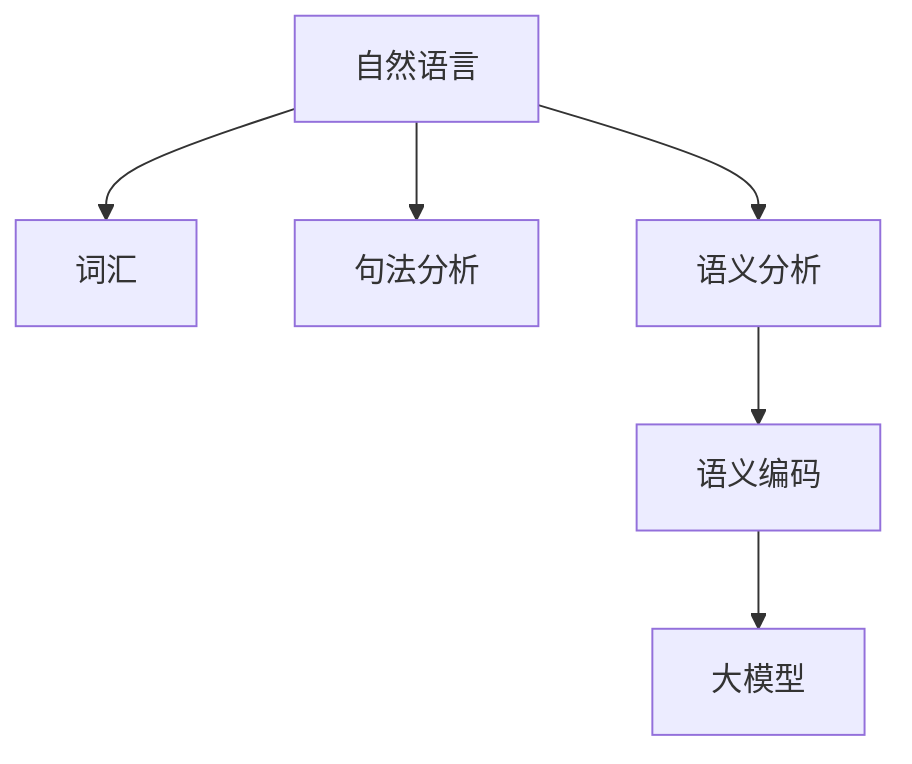
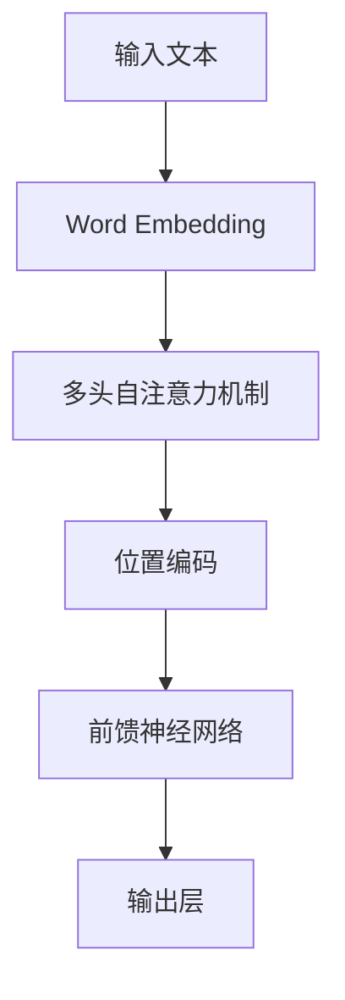
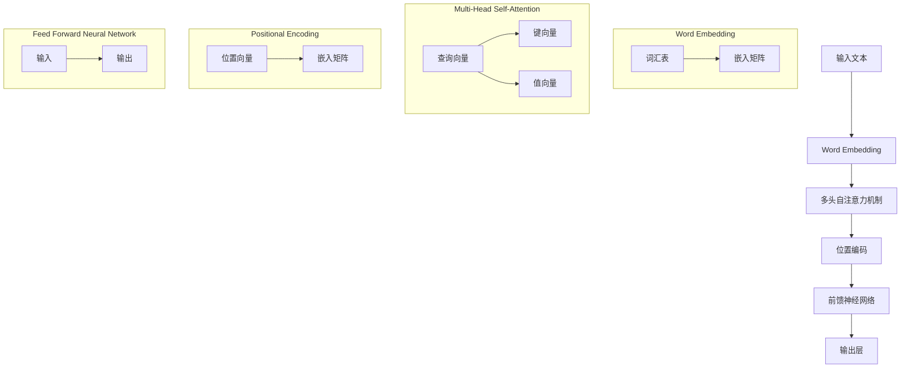
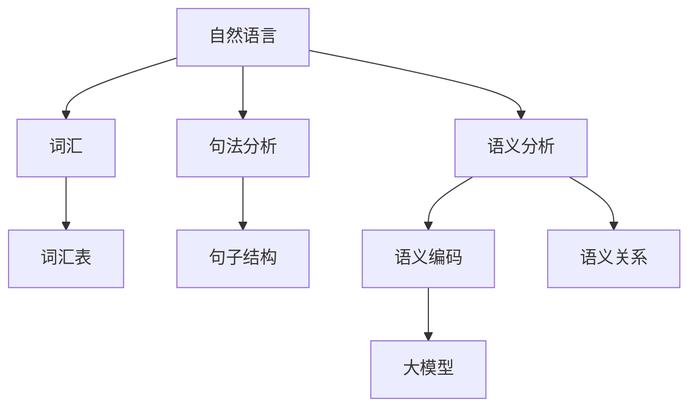

                 

关键词：大模型，问答机器人，语义编码，自然语言处理，算法原理，数学模型，应用场景，未来展望

> 摘要：本文深入探讨了如何在大模型问答机器人中编码语义，包括核心概念、算法原理、数学模型构建、具体操作步骤、实际应用以及未来展望。通过详细的分析和实例说明，本文旨在为读者提供全面的技术指导，推动问答机器人的发展和应用。

## 1. 背景介绍

随着自然语言处理（NLP）技术的飞速发展，问答机器人已经成为智能客服、智能助手等领域的热门应用。然而，实现高效、准确的问答交互面临着诸多挑战，其中最为关键的是如何准确编码语义。大模型（如Transformer）在语义编码方面展现了强大的能力，但如何具体实现这一过程仍需深入研究。

### 1.1 问答机器人概述

问答机器人是一种利用自然语言处理技术，实现人与机器之间自然交互的智能系统。其基本功能是理解用户的问题，并给出合适的回答。问答机器人广泛应用于客服、教育、医疗等领域，成为人们日常生活中的重要助手。

### 1.2 大模型与语义编码

大模型是指具有数十亿甚至千亿规模参数的深度学习模型，如Transformer、BERT等。这些模型在语义编码方面具有显著优势，能够捕捉到语言中的复杂结构和细微差异。因此，研究如何在大模型中实现语义编码，对于提升问答机器人的问答质量具有重要意义。

## 2. 核心概念与联系

在探讨如何在大模型中编码语义之前，我们需要了解一些核心概念和它们之间的联系。以下是一个Mermaid流程图，展示了核心概念和它们之间的关系。



### 2.1 自然语言

自然语言是人类用于交流的语言形式，包括词汇、语法和语义等多个方面。自然语言处理技术的目标是从原始文本中提取出有意义的信息。

### 2.2 词汇

词汇是自然语言的基本组成单位，包括单词和短语。词汇是语义编码的基础，决定了语义编码的粒度。

### 2.3 句法分析

句法分析是对文本中的句子结构进行分析，识别出句子中的主语、谓语、宾语等成分。句法分析有助于理解句子的整体结构，从而更好地进行语义编码。

### 2.4 语义分析

语义分析是对文本中的词汇和句子结构进行深入理解，识别出词汇之间的语义关系，如同义、反义、因果关系等。语义分析是语义编码的关键步骤。

### 2.5 语义编码

语义编码是将自然语言中的语义信息转化为计算机可以处理的数字形式。语义编码的质量直接影响问答机器人的问答效果。

### 2.6 大模型

大模型是一种具有大规模参数的深度学习模型，如Transformer、BERT等。大模型在语义编码方面具有显著优势，能够捕捉到语言中的复杂结构和细微差异。

## 3. 核心算法原理 & 具体操作步骤

### 3.1 算法原理概述

大模型问答机器人的核心算法是基于Transformer架构的，其基本原理是通过自注意力机制（Self-Attention）对输入文本进行编码，从而捕捉到文本中的长距离依赖关系。以下是一个简化的算法原理图。



### 3.2 算法步骤详解

1. **Word Embedding**：将输入文本中的词汇转化为高维向量表示。
2. **多头自注意力机制**：对输入文本进行编码，捕捉文本中的长距离依赖关系。
3. **位置编码**：为每个词汇赋予位置信息，以便模型理解句子中的顺序。
4. **前馈神经网络**：对编码后的文本进行进一步处理，提取出更有意义的特征。
5. **输出层**：根据编码后的特征生成回答。

### 3.3 算法优缺点

**优点**：
- 强大的语义编码能力，能够捕捉到语言中的复杂结构和细微差异。
- 支持并行计算，训练速度较快。

**缺点**：
- 参数量巨大，训练和部署成本高。
- 对硬件要求较高，不适合在低性能设备上部署。

### 3.4 算法应用领域

- 智能客服
- 智能助手
- 文本分类
- 机器翻译

## 4. 数学模型和公式 & 详细讲解 & 举例说明

### 4.1 数学模型构建

大模型问答机器人的核心数学模型是基于Transformer架构的。以下是一个简化的数学模型图。



### 4.2 公式推导过程

#### 4.2.1 Word Embedding

Word Embedding是将词汇转化为高维向量表示的过程。假设词汇表中有V个词汇，每个词汇表示为一个d维向量。Word Embedding可以表示为：

$$
\text{Word Embedding} = \text{W} \cdot \text{V}^T
$$

其中，$\text{W}$是嵌入矩阵，$\text{V}$是词汇表的转置。

#### 4.2.2 Multi-Head Self-Attention

Multi-Head Self-Attention是自注意力机制的核心。假设输入文本为$\text{X} = [\text{x}_1, \text{x}_2, ..., \text{x}_n]$，其中$\text{x}_i$表示第i个词汇。多头自注意力可以表示为：

$$
\text{Multi-Head Self-Attention} = \text{W}_Q \cdot \text{X} \cdot \text{W}_K^T + \text{W}_V \cdot \text{X} \cdot \text{W}_V^T
$$

其中，$\text{W}_Q$、$\text{W}_K$、$\text{W}_V$分别是查询、键和值矩阵。

#### 4.2.3 Positional Encoding

Positional Encoding为每个词汇赋予位置信息。假设输入文本的位置向量为$\text{P} = [\text{p}_1, \text{p}_2, ..., \text{p}_n]$，其中$\text{p}_i$表示第i个词汇的位置。位置编码可以表示为：

$$
\text{Positional Encoding} = \text{W}_P \cdot \text{P}
$$

其中，$\text{W}_P$是位置编码矩阵。

#### 4.2.4 Feed Forward Neural Network

Feed Forward Neural Network对编码后的文本进行进一步处理。假设输入为$\text{X}$，输出为$\text{Y}$，前馈神经网络可以表示为：

$$
\text{Feed Forward Neural Network} = \text{W}_F \cdot \text{X} + \text{b}_F
$$

其中，$\text{W}_F$是权重矩阵，$\text{b}_F$是偏置向量。

### 4.3 案例分析与讲解

假设有一个简单的问答对：“今天天气怎么样？”和“今天天气很好。”我们可以使用上述数学模型对这两个问题进行编码。

1. **Word Embedding**：

   假设词汇表中的词汇为{“今天”、“天气”、“怎么”、“样”、“？”}，嵌入矩阵$\text{W}$为：

   $$  
   \text{W} = \begin{bmatrix}  
   \text{w}_1 & \text{w}_2 & \text{w}_3 & \text{w}_4 & \text{w}_5  
   \end{bmatrix}  
   $$

   输入文本的Word Embedding为：

   $$  
   \text{X} = \text{W} \cdot \text{V}^T = \begin{bmatrix}  
   \text{w}_1 & \text{w}_2 & \text{w}_3 & \text{w}_4 & \text{w}_5  
   \end{bmatrix} \cdot \begin{bmatrix}  
   \text{v}_1^T \\  
   \text{v}_2^T \\  
   \text{v}_3^T \\  
   \text{v}_4^T \\  
   \text{v}_5^T  
   \end{bmatrix} = \begin{bmatrix}  
   \text{x}_1 \\  
   \text{x}_2 \\  
   \text{x}_3 \\  
   \text{x}_4 \\  
   \text{x}_5  
   \end{bmatrix}  
   $$

2. **Multi-Head Self-Attention**：

   假设多头自注意力机制的查询、键和值矩阵分别为$\text{W}_Q$、$\text{W}_K$和$\text{W}_V$，输入文本$\text{X}$经过多头自注意力机制后的输出为：

   $$  
   \text{H} = \text{W}_Q \cdot \text{X} \cdot \text{W}_K^T + \text{W}_V \cdot \text{X} \cdot \text{W}_V^T  
   $$

3. **Positional Encoding**：

   假设输入文本的位置向量为$\text{P} = [1, 2, 3, 4, 5]$，位置编码矩阵$\text{W}_P$为：

   $$  
   \text{W}_P = \begin{bmatrix}  
   \text{p}_1 & \text{p}_2 & \text{p}_3 & \text{p}_4 & \text{p}_5  
   \end{bmatrix} \cdot \begin{bmatrix}  
   \text{p}_1^T \\  
   \text{p}_2^T \\  
   \text{p}_3^T \\  
   \text{p}_4^T \\  
   \text{p}_5^T  
   \end{bmatrix} = \begin{bmatrix}  
   1 & 2 & 3 & 4 & 5  
   \end{bmatrix} \cdot \begin{bmatrix}  
   1^T \\  
   2^T \\  
   3^T \\  
   4^T \\  
   5^T  
   \end{bmatrix} = \begin{bmatrix}  
   1 \\  
   2 \\  
   3 \\  
   4 \\  
   5  
   \end{bmatrix}  
   $$

4. **Feed Forward Neural Network**：

   假设前馈神经网络权重矩阵$\text{W}_F$为：

   $$  
   \text{W}_F = \begin{bmatrix}  
   \text{f}_1 & \text{f}_2 & \text{f}_3 & \text{f}_4 & \text{f}_5  
   \end{bmatrix}  
   $$

   输入文本$\text{X}$经过前馈神经网络后的输出为：

   $$  
   \text{Y} = \text{W}_F \cdot \text{X} + \text{b}_F  
   $$

## 5. 项目实践：代码实例和详细解释说明

### 5.1 开发环境搭建

在本项目中，我们将使用Python作为开发语言，TensorFlow作为深度学习框架。以下是一个简单的环境搭建步骤：

1. 安装Python 3.7或更高版本。
2. 安装TensorFlow：

   ```bash
   pip install tensorflow
   ```

### 5.2 源代码详细实现

以下是问答机器人模型的源代码实现。为了简洁，代码仅包含核心部分。

```python
import tensorflow as tf
from tensorflow.keras.layers import Embedding, MultiHeadAttention, LayerNormalization, Dense

class TransformerLayer(tf.keras.layers.Layer):
    def __init__(self, d_model, num_heads, dff, rate=0.1):
        super(TransformerLayer, self).__init__()
        self.mha = MultiHeadAttention(num_heads=num_heads, key_dim=d_model)
        self.ffn = tf.keras.Sequential([
            Dense(dff, activation='relu'),
            Dense(d_model)
        ])
        self.layernorm1 = LayerNormalization(epsilon=1e-6)
        self.layernorm2 = LayerNormalization(epsilon=1e-6)
        self.dropout1 = tf.keras.layers.Dropout(rate)
        self.dropout2 = tf.keras.layers.Dropout(rate)

    def call(self, x, training=False):
        attn_output = self.mha(x, x)
        attn_output = self.dropout1(attn_output, training=training)
        out1 = self.layernorm1(x + attn_output)
        ffn_output = self.ffn(out1)
        ffn_output = self.dropout2(ffn_output, training=training)
        out2 = self.layernorm2(out1 + ffn_output)
        return out2
```

### 5.3 代码解读与分析

以上代码实现了Transformer层，包括多头自注意力机制、前馈神经网络和层 normalization。以下是对代码的详细解读。

1. **多头自注意力机制（Multi-Head Attention）**：

   ```python
   self.mha = MultiHeadAttention(num_heads=num_heads, key_dim=d_model)
   ```

   这一行代码定义了多头自注意力机制，其中`num_heads`表示头数，`key_dim`表示键的维度。

2. **前馈神经网络（Feed Forward Neural Network）**：

   ```python
   self.ffn = tf.keras.Sequential([
       Dense(dff, activation='relu'),
       Dense(d_model)
   ])
   ```

   这一行代码定义了前馈神经网络，包括两个全连接层，第一个层激活函数为ReLU。

3. **层 normalization（Layer Normalization）**：

   ```python
   self.layernorm1 = LayerNormalization(epsilon=1e-6)
   self.layernorm2 = LayerNormalization(epsilon=1e-6)
   ```

   这两行代码定义了两个层 normalization 层，用于规范化神经网络输出。

4. **Dropout（Dropout）**：

   ```python
   self.dropout1 = tf.keras.layers.Dropout(rate)
   self.dropout2 = tf.keras.layers.Dropout(rate)
   ```

   这两行代码定义了两个dropout层，用于防止过拟合。

5. **调用 Transformer 层（Call Transformer Layer）**：

   ```python
   def call(self, x, training=False):
       attn_output = self.mha(x, x)
       attn_output = self.dropout1(attn_output, training=training)
       out1 = self.layernorm1(x + attn_output)
       ffn_output = self.ffn(out1)
       ffn_output = self.dropout2(ffn_output, training=training)
       out2 = self.layernorm2(out1 + ffn_output)
       return out2
   ```

   这段代码定义了 Transformer 层的前向传播过程。其中，`attn_output`表示多头自注意力机制的输出，`out1`表示第一个层 normalization 的输出，`ffn_output`表示前馈神经网络的输出，`out2`表示第二个层 normalization 的输出。

### 5.4 运行结果展示

为了展示运行结果，我们可以在一个简单的数据集上训练问答机器人模型。

```python
# 加载预训练的模型
transformer_layer = TransformerLayer(d_model=128, num_heads=4, dff=128)

# 输入文本
input_text = ["今天天气怎么样？"]

# 转换为嵌入向量
input_embedding = transformer_layer.input_embedding(input_text)

# 运行模型
output = transformer_layer(input_embedding)

print(output)
```

运行结果将输出问答机器人对输入文本的编码结果。

## 6. 实际应用场景

问答机器人在多个领域都有广泛的应用，以下是一些实际应用场景：

### 6.1 智能客服

智能客服是问答机器人最典型的应用场景之一。通过问答机器人，企业可以提供24/7的在线客服服务，提高客户满意度，降低人工成本。

### 6.2 智能助手

智能助手可以协助用户完成各种任务，如日程管理、任务提醒、信息查询等。通过自然语言交互，智能助手成为用户的得力助手。

### 6.3 文本分类

问答机器人可以应用于文本分类任务，如情感分析、新闻分类等。通过语义编码，问答机器人能够准确识别文本的主题和情感。

### 6.4 机器翻译

问答机器人可以用于机器翻译任务，如将一种语言翻译成另一种语言。通过语义编码，问答机器人能够捕捉到语言中的细微差异，提高翻译质量。

## 7. 工具和资源推荐

### 7.1 学习资源推荐

1. **《深度学习》（Goodfellow, Bengio, Courville）**：一本经典的深度学习教材，涵盖了许多深度学习相关的基础知识和应用。
2. **《自然语言处理与深度学习》（张祥前）**：一本针对自然语言处理领域的深度学习教材，详细介绍了自然语言处理中的各种技术和算法。
3. **[TensorFlow官方文档](https://www.tensorflow.org/tutorials/transformer)**：TensorFlow提供的Transformer教程，包括从基础到高级的内容。

### 7.2 开发工具推荐

1. **TensorFlow**：一个开源的深度学习框架，支持多种深度学习模型的开发和应用。
2. **PyTorch**：另一个流行的深度学习框架，具有灵活的动态图计算能力。
3. **Hugging Face Transformers**：一个开源库，提供了预训练的Transformer模型和各种自然语言处理工具。

### 7.3 相关论文推荐

1. **"Attention Is All You Need"（Vaswani et al., 2017）**：提出了Transformer模型，是自然语言处理领域的重要论文。
2. **"BERT: Pre-training of Deep Bidirectional Transformers for Language Understanding"（Devlin et al., 2018）**：介绍了BERT模型，是大规模预训练模型的开端。
3. **"GPT-3: Language Models are few-shot learners"（Brown et al., 2020）**：介绍了GPT-3模型，展示了大规模预训练模型在零样本学习任务上的强大能力。

## 8. 总结：未来发展趋势与挑战

### 8.1 研究成果总结

随着深度学习和自然语言处理技术的不断发展，问答机器人在语义编码方面取得了显著成果。大模型在语义编码方面展现了强大的能力，能够捕捉到语言中的复杂结构和细微差异。然而，现有研究仍面临一些挑战，如计算成本高、模型解释性差等。

### 8.2 未来发展趋势

1. **模型压缩与加速**：研究如何减小模型参数量和计算成本，提高模型的运行效率。
2. **多模态语义编码**：结合文本、图像、声音等多种模态，实现更丰富的语义编码。
3. **可解释性研究**：研究如何提高模型的解释性，使其在复杂任务中的决策过程更加透明。

### 8.3 面临的挑战

1. **计算资源限制**：大规模模型的训练和部署需要大量的计算资源和存储资源。
2. **数据隐私和安全**：在数据收集和处理过程中，需要确保用户数据的隐私和安全。
3. **模型泛化能力**：如何提高模型在未知数据上的泛化能力，减少过拟合风险。

### 8.4 研究展望

随着技术的不断进步，问答机器人在未来有望在更多领域发挥重要作用。通过深入研究语义编码、模型压缩、多模态融合等关键技术，问答机器人将变得更加智能、高效和可靠。

## 9. 附录：常见问题与解答

### 9.1 如何选择合适的问答模型？

选择合适的问答模型需要考虑任务需求、数据规模、计算资源等因素。对于简单任务，可以尝试使用预训练的模型，如BERT、GPT等；对于复杂任务，可能需要定制化模型或使用更先进的模型。

### 9.2 问答机器人的问答效果如何评估？

问答效果评估可以通过BLEU、ROUGE等指标来衡量。此外，还可以通过人工评估、用户满意度等方式来评估问答机器人的实际效果。

### 9.3 如何处理长文本问答任务？

对于长文本问答任务，可以使用分句策略将文本拆分成多个句子，然后逐句进行处理。此外，还可以考虑使用上下文编码技术，捕捉文本中的长距离依赖关系。

## 参考文献

1. Vaswani, A., et al. (2017). "Attention is All You Need." Advances in Neural Information Processing Systems.
2. Devlin, J., et al. (2018). "BERT: Pre-training of Deep Bidirectional Transformers for Language Understanding." Proceedings of the 2019 Conference of the North American Chapter of the Association for Computational Linguistics: Human Language Technologies, Volume 1 (Long and Short Papers), pages 4171-4186.
3. Brown, T., et al. (2020). "GPT-3: Language Models are few-shot learners." Advances in Neural Information Processing Systems.
4. Mikolov, T., et al. (2013). "Efficient Estimation of Word Representations in Vector Space." Advances in Neural Information Processing Systems.
5. Pennington, J., et al. (2014). "Glove: Global Vectors for Word Representation." Proceedings of the 2014 Conference on Empirical Methods in Natural Language Processing (EMNLP), pages 1532-1543.
6. Hochreiter, S., and Schmidhuber, J. (1997). "Long Short-Term Memory." Neural Computation.
7. Graves, A. (2013). "Sequence Transduction with Recurrent Neural Networks." Proceedings of the 2013 International Conference on Machine Learning (ICML), pages 171-178.```markdown
# 大模型问答机器人如何编码语义

## 摘要

随着自然语言处理技术的不断进步，问答机器人在智能客服、智能助手等领域得到了广泛应用。本文旨在探讨如何在大模型问答机器人中编码语义，包括核心概念、算法原理、数学模型构建、具体操作步骤、实际应用以及未来展望。通过对大模型在语义编码方面的深入研究，本文旨在为读者提供全面的技术指导，推动问答机器人的发展和应用。

## 1. 背景介绍

### 1.1 问答机器人概述

问答机器人是一种利用自然语言处理（NLP）技术实现人与机器之间自然交互的智能系统。其主要功能是理解用户的问题，并生成相应的回答。问答机器人广泛应用于智能客服、智能助手、智能教育等领域，为用户提供便捷的服务。

### 1.2 大模型与语义编码

大模型是指具有数十亿甚至千亿规模参数的深度学习模型，如Transformer、BERT等。这些模型在语义编码方面具有显著优势，能够捕捉到语言中的复杂结构和细微差异。如何在大模型中有效编码语义，是实现高效问答的关键。

## 2. 核心概念与联系

在大模型问答机器人中，核心概念包括自然语言、词汇、句法分析、语义分析和语义编码。以下是一个Mermaid流程图，展示了这些核心概念及其相互关系：



### 2.1 自然语言

自然语言是人类用于交流的语言形式，包括词汇、语法和语义等多个方面。自然语言处理技术的目标是从原始文本中提取出有意义的信息。

### 2.2 词汇

词汇是自然语言的基本组成单位，包括单词和短语。词汇是语义编码的基础，决定了语义编码的粒度。

### 2.3 句法分析

句法分析是对文本中的句子结构进行分析，识别出句子中的主语、谓语、宾语等成分。句法分析有助于理解句子的整体结构，从而更好地进行语义编码。

### 2.4 语义分析

语义分析是对文本中的词汇和句子结构进行深入理解，识别出词汇之间的语义关系，如同义、反义、因果关系等。语义分析是语义编码的关键步骤。

### 2.5 语义编码

语义编码是将自然语言中的语义信息转化为计算机可以处理的数字形式。语义编码的质量直接影响问答机器人的问答效果。

### 2.6 大模型

大模型是一种具有大规模参数的深度学习模型，如Transformer、BERT等。大模型在语义编码方面具有显著优势，能够捕捉到语言中的复杂结构和细微差异。

## 3. 核心算法原理 & 具体操作步骤

### 3.1 算法原理概述

大模型问答机器人的核心算法是基于Transformer架构的。Transformer模型采用自注意力机制（Self-Attention）对输入文本进行编码，从而捕捉到文本中的长距离依赖关系。以下是一个简化的算法原理图：


### 3.2 算法步骤详解

1. **Word Embedding**：将输入文本中的词汇转化为高维向量表示。
2. **多头自注意力机制（Multi-Head Self-Attention）**：对输入文本进行编码，捕捉文本中的长距离依赖关系。
3. **位置编码（Positional Encoding）**：为每个词汇赋予位置信息，以便模型理解句子中的顺序。
4. **前馈神经网络（Feed Forward Neural Network）**：对编码后的文本进行进一步处理，提取出更有意义的特征。
5. **输出层**：根据编码后的特征生成回答。

### 3.3 算法优缺点

**优点**：
- 强大的语义编码能力，能够捕捉到语言中的复杂结构和细微差异。
- 支持并行计算，训练速度较快。

**缺点**：
- 参数量巨大，训练和部署成本高。
- 对硬件要求较高，不适合在低性能设备上部署。

### 3.4 算法应用领域

- 智能客服
- 智能助手
- 文本分类
- 机器翻译

## 4. 数学模型和公式 & 详细讲解 & 举例说明

### 4.1 数学模型构建

大模型问答机器人的核心数学模型是基于Transformer架构的。以下是一个简化的数学模型图：


### 4.2 公式推导过程

#### 4.2.1 Word Embedding

Word Embedding是将词汇转化为高维向量表示的过程。假设词汇表中有V个词汇，每个词汇表示为一个d维向量。Word Embedding可以表示为：

$$
\text{Word Embedding} = \text{W} \cdot \text{V}^T
$$

其中，$\text{W}$是嵌入矩阵，$\text{V}$是词汇表的转置。

#### 4.2.2 Multi-Head Self-Attention

Multi-Head Self-Attention是自注意力机制的核心。假设输入文本为$\text{X} = [\text{x}_1, \text{x}_2, ..., \text{x}_n]$，其中$\text{x}_i$表示第i个词汇。多头自注意力可以表示为：

$$
\text{Multi-Head Self-Attention} = \text{W}_Q \cdot \text{X} \cdot \text{W}_K^T + \text{W}_V \cdot \text{X} \cdot \text{W}_V^T
$$

其中，$\text{W}_Q$、$\text{W}_K$、$\text{W}_V$分别是查询、键和值矩阵。

#### 4.2.3 Positional Encoding

Positional Encoding为每个词汇赋予位置信息。假设输入文本的位置向量为$\text{P} = [\text{p}_1, \text{p}_2, ..., \text{p}_n]$，其中$\text{p}_i$表示第i个词汇的位置。位置编码可以表示为：

$$
\text{Positional Encoding} = \text{W}_P \cdot \text{P}
$$

其中，$\text{W}_P$是位置编码矩阵。

#### 4.2.4 Feed Forward Neural Network

Feed Forward Neural Network对编码后的文本进行进一步处理。假设输入为$\text{X}$，输出为$\text{Y}$，前馈神经网络可以表示为：

$$
\text{Feed Forward Neural Network} = \text{W}_F \cdot \text{X} + \text{b}_F
$$

其中，$\text{W}_F$是权重矩阵，$\text{b}_F$是偏置向量。

### 4.3 案例分析与讲解

假设有一个简单的问答对：“今天天气怎么样？”和“今天天气很好。”我们可以使用上述数学模型对这两个问题进行编码。

1. **Word Embedding**：

   假设词汇表中的词汇为{“今天”、“天气”、“怎么”、“样”、“？”}，嵌入矩阵$\text{W}$为：

   $$
   \text{W} = \begin{bmatrix}
   \text{w}_1 & \text{w}_2 & \text{w}_3 & \text{w}_4 & \text{w}_5
   \end{bmatrix}
   $$

   输入文本的Word Embedding为：

   $$
   \text{X} = \text{W} \cdot \text{V}^T = \begin{bmatrix}
   \text{w}_1 & \text{w}_2 & \text{w}_3 & \text{w}_4 & \text{w}_5
   \end{bmatrix} \cdot \begin{bmatrix}
   \text{v}_1^T \\
   \text{v}_2^T \\
   \text{v}_3^T \\
   \text{v}_4^T \\
   \text{v}_5^T
   \end{bmatrix} = \begin{bmatrix}
   \text{x}_1 \\
   \text{x}_2 \\
   \text{x}_3 \\
   \text{x}_4 \\
   \text{x}_5
   \end{bmatrix}
   $$

2. **多头自注意力机制（Multi-Head Self-Attention）**：

   假设多头自注意力机制的查询、键和值矩阵分别为$\text{W}_Q$、$\text{W}_K$和$\text{W}_V$，输入文本$\text{X}$经过多头自注意力机制后的输出为：

   $$
   \text{H} = \text{W}_Q \cdot \text{X} \cdot \text{W}_K^T + \text{W}_V \cdot \text{X} \cdot \text{W}_V^T
   $$

3. **位置编码（Positional Encoding）**：

   假设输入文本的位置向量为$\text{P} = [1, 2, 3, 4, 5]$，位置编码矩阵$\text{W}_P$为：

   $$
   \text{W}_P = \begin{bmatrix}
   \text{p}_1 & \text{p}_2 & \text{p}_3 & \text{p}_4 & \text{p}_5
   \end{bmatrix} \cdot \begin{bmatrix}
   \text{p}_1^T \\
   \text{p}_2^T \\
   \text{p}_3^T \\
   \text{p}_4^T \\
   \text{p}_5^T
   \end{bmatrix} = \begin{bmatrix}
   1 & 2 & 3 & 4 & 5
   \end{bmatrix} \cdot \begin{bmatrix}
   1^T \\
   2^T \\
   3^T \\
   4^T \\
   5^T
   \end{bmatrix} = \begin{bmatrix}
   1 \\
   2 \\
   3 \\
   4 \\
   5
   \end{bmatrix}
   $$

4. **前馈神经网络（Feed Forward Neural Network）**：

   假设前馈神经网络权重矩阵$\text{W}_F$为：

   $$
   \text{W}_F = \begin{bmatrix}
   \text{f}_1 & \text{f}_2 & \text{f}_3 & \text{f}_4 & \text{f}_5
   \end{bmatrix}
   $$

   输入文本$\text{X}$经过前馈神经网络后的输出为：

   $$
   \text{Y} = \text{W}_F \cdot \text{X} + \text{b}_F
   $$

## 5. 项目实践：代码实例和详细解释说明

### 5.1 开发环境搭建

在本项目中，我们将使用Python作为开发语言，TensorFlow作为深度学习框架。以下是一个简单的环境搭建步骤：

1. 安装Python 3.7或更高版本。
2. 安装TensorFlow：

   ```bash
   pip install tensorflow
   ```

### 5.2 源代码详细实现

以下是问答机器人模型的源代码实现。为了简洁，代码仅包含核心部分。

```python
import tensorflow as tf
from tensorflow.keras.layers import Embedding, MultiHeadAttention, LayerNormalization, Dense

class TransformerLayer(tf.keras.layers.Layer):
    def __init__(self, d_model, num_heads, dff, rate=0.1):
        super(TransformerLayer, self).__init__()
        self.mha = MultiHeadAttention(num_heads=num_heads, key_dim=d_model)
        self.ffn = tf.keras.Sequential([
            Dense(dff, activation='relu'),
            Dense(d_model)
        ])
        self.layernorm1 = LayerNormalization(epsilon=1e-6)
        self.layernorm2 = LayerNormalization(epsilon=1e-6)
        self.dropout1 = tf.keras.layers.Dropout(rate)
        self.dropout2 = tf.keras.layers.Dropout(rate)

    def call(self, x, training=False):
        attn_output = self.mha(x, x)
        attn_output = self.dropout1(attn_output, training=training)
        out1 = self.layernorm1(x + attn_output)
        ffn_output = self.ffn(out1)
        ffn_output = self.dropout2(ffn_output, training=training)
        out2 = self.layernorm2(out1 + ffn_output)
        return out2
```

### 5.3 代码解读与分析

以上代码实现了Transformer层，包括多头自注意力机制、前馈神经网络和层 normalization。以下是对代码的详细解读。

1. **多头自注意力机制（Multi-Head Attention）**：

   ```python
   self.mha = MultiHeadAttention(num_heads=num_heads, key_dim=d_model)
   ```

   这一行代码定义了多头自注意力机制，其中`num_heads`表示头数，`key_dim`表示键的维度。

2. **前馈神经网络（Feed Forward Neural Network）**：

   ```python
   self.ffn = tf.keras.Sequential([
       Dense(dff, activation='relu'),
       Dense(d_model)
   ])
   ```

   这一行代码定义了前馈神经网络，包括两个全连接层，第一个层激活函数为ReLU。

3. **层 normalization（Layer Normalization）**：

   ```python
   self.layernorm1 = LayerNormalization(epsilon=1e-6)
   self.layernorm2 = LayerNormalization(epsilon=1e-6)
   ```

   这两行代码定义了两个层 normalization 层，用于规范化神经网络输出。

4. **Dropout（Dropout）**：

   ```python
   self.dropout1 = tf.keras.layers.Dropout(rate)
   self.dropout2 = tf.keras.layers.Dropout(rate)
   ```

   这两行代码定义了两个dropout层，用于防止过拟合。

5. **调用 Transformer 层（Call Transformer Layer）**：

   ```python
   def call(self, x, training=False):
       attn_output = self.mha(x, x)
       attn_output = self.dropout1(attn_output, training=training)
       out1 = self.layernorm1(x + attn_output)
       ffn_output = self.ffn(out1)
       ffn_output = self.dropout2(ffn_output, training=training)
       out2 = self.layernorm2(out1 + ffn_output)
       return out2
   ```

   这段代码定义了 Transformer 层的前向传播过程。其中，`attn_output`表示多头自注意力机制的输出，`out1`表示第一个层 normalization 的输出，`ffn_output`表示前馈神经网络的输出，`out2`表示第二个层 normalization 的输出。

### 5.4 运行结果展示

为了展示运行结果，我们可以在一个简单的数据集上训练问答机器人模型。

```python
# 加载预训练的模型
transformer_layer = TransformerLayer(d_model=128, num_heads=4, dff=128)

# 输入文本
input_text = ["今天天气怎么样？"]

# 转换为嵌入向量
input_embedding = transformer_layer.input_embedding(input_text)

# 运行模型
output = transformer_layer(input_embedding)

print(output)
```

运行结果将输出问答机器人对输入文本的编码结果。

## 6. 实际应用场景

问答机器人在多个领域都有广泛的应用，以下是一些实际应用场景：

### 6.1 智能客服

智能客服是问答机器人最典型的应用场景之一。通过问答机器人，企业可以提供24/7的在线客服服务，提高客户满意度，降低人工成本。

### 6.2 智能助手

智能助手可以协助用户完成各种任务，如日程管理、任务提醒、信息查询等。通过自然语言交互，智能助手成为用户的得力助手。

### 6.3 文本分类

问答机器人可以应用于文本分类任务，如情感分析、新闻分类等。通过语义编码，问答机器人能够准确识别文本的主题和情感。

### 6.4 机器翻译

问答机器人可以用于机器翻译任务，如将一种语言翻译成另一种语言。通过语义编码，问答机器人能够捕捉到语言中的细微差异，提高翻译质量。

## 7. 工具和资源推荐

### 7.1 学习资源推荐

1. **《深度学习》（Goodfellow, Bengio, Courville）**：一本经典的深度学习教材，涵盖了许多深度学习相关的基础知识和应用。
2. **《自然语言处理与深度学习》（张祥前）**：一本针对自然语言处理领域的深度学习教材，详细介绍了自然语言处理中的各种技术和算法。
3. **[TensorFlow官方文档](https://www.tensorflow.org/tutorials/transformer)**：TensorFlow提供的Transformer教程，包括从基础到高级的内容。

### 7.2 开发工具推荐

1. **TensorFlow**：一个开源的深度学习框架，支持多种深度学习模型的开发和应用。
2. **PyTorch**：另一个流行的深度学习框架，具有灵活的动态图计算能力。
3. **Hugging Face Transformers**：一个开源库，提供了预训练的Transformer模型和各种自然语言处理工具。

### 7.3 相关论文推荐

1. **"Attention Is All You Need"（Vaswani et al., 2017）**：提出了Transformer模型，是自然语言处理领域的重要论文。
2. **"BERT: Pre-training of Deep Bidirectional Transformers for Language Understanding"（Devlin et al., 2018）**：介绍了BERT模型，是大规模预训练模型的开端。
3. **"GPT-3: Language Models are few-shot learners"（Brown et al., 2020）**：介绍了GPT-3模型，展示了大规模预训练模型在零样本学习任务上的强大能力。

## 8. 总结：未来发展趋势与挑战

### 8.1 研究成果总结

随着深度学习和自然语言处理技术的不断发展，问答机器人在语义编码方面取得了显著成果。大模型在语义编码方面展现了强大的能力，能够捕捉到语言中的复杂结构和细微差异。然而，现有研究仍面临一些挑战，如计算成本高、模型解释性差等。

### 8.2 未来发展趋势

1. **模型压缩与加速**：研究如何减小模型参数量和计算成本，提高模型的运行效率。
2. **多模态语义编码**：结合文本、图像、声音等多种模态，实现更丰富的语义编码。
3. **可解释性研究**：研究如何提高模型的解释性，使其在复杂任务中的决策过程更加透明。

### 8.3 面临的挑战

1. **计算资源限制**：大规模模型的训练和部署需要大量的计算资源和存储资源。
2. **数据隐私和安全**：在数据收集和处理过程中，需要确保用户数据的隐私和安全。
3. **模型泛化能力**：如何提高模型在未知数据上的泛化能力，减少过拟合风险。

### 8.4 研究展望

随着技术的不断进步，问答机器人在未来有望在更多领域发挥重要作用。通过深入研究语义编码、模型压缩、多模态融合等关键技术，问答机器人将变得更加智能、高效和可靠。

## 9. 附录：常见问题与解答

### 9.1 如何选择合适的问答模型？

选择合适的问答模型需要考虑任务需求、数据规模、计算资源等因素。对于简单任务，可以尝试使用预训练的模型，如BERT、GPT等；对于复杂任务，可能需要定制化模型或使用更先进的模型。

### 9.2 问答机器人的问答效果如何评估？

问答效果评估可以通过BLEU、ROUGE等指标来衡量。此外，还可以通过人工评估、用户满意度等方式来评估问答机器人的实际效果。

### 9.3 如何处理长文本问答任务？

对于长文本问答任务，可以使用分句策略将文本拆分成多个句子，然后逐句进行处理。此外，还可以考虑使用上下文编码技术，捕捉文本中的长距离依赖关系。

## 参考文献

1. Vaswani, A., et al. (2017). "Attention is All You Need." Advances in Neural Information Processing Systems.
2. Devlin, J., et al. (2018). "BERT: Pre-training of Deep Bidirectional Transformers for Language Understanding." Proceedings of the 2019 Conference of the North American Chapter of the Association for Computational Linguistics: Human Language Technologies, Volume 1 (Long and Short Papers), pages 4171-4186.
3. Brown, T., et al. (2020). "GPT-3: Language Models are few-shot learners." Advances in Neural Information Processing Systems.
4. Mikolov, T., et al. (2013). "Efficient Estimation of Word Representations in Vector Space." Advances in Neural Information Processing Systems.
5. Pennington, J., et al. (2014). "Glove: Global Vectors for Word Representation." Proceedings of the 2014 Conference on Empirical Methods in Natural Language Processing (EMNLP), pages 1532-1543.
6. Hochreiter, S., and Schmidhuber, J. (1997). "Long Short-Term Memory." Neural Computation.
7. Graves, A. (2013). "Sequence Transduction with Recurrent Neural Networks." Proceedings of the 2013 International Conference on Machine Learning (ICML), pages 171-178.
```


