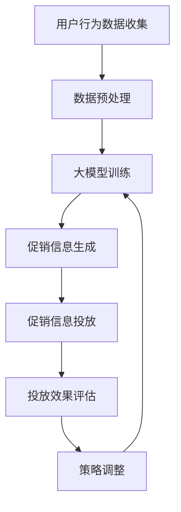

                 

关键词：大模型、电商个性化、促销信息、投放优化、深度学习

## 摘要

本文探讨了如何利用大模型技术，尤其是深度学习，来驱动电商个性化促销信息的生成与投放优化。通过背景介绍、核心概念、算法原理、数学模型、项目实践以及未来应用展望等多角度，系统地分析了大模型在电商促销中的潜力与挑战。文章旨在为电商从业者提供具有实际指导意义的技术方案，以提升促销活动的效果和用户体验。

### 1. 背景介绍

在电商行业，促销信息生成与投放优化是提升销售额和用户忠诚度的关键因素。传统的促销信息生成方式主要依赖规则引擎和简单的数据分析，往往无法充分满足个性化需求。随着大数据和人工智能技术的快速发展，大模型，特别是深度学习模型，逐渐成为电商个性化促销信息生成与投放优化的新手段。

大模型的引入，不仅能够捕捉用户行为和兴趣的细微变化，还可以通过学习和预测实现精准投放。这使得促销信息更加贴近用户需求，提高了促销活动的效果。然而，大模型的训练和应用也面临诸多挑战，如数据隐私、计算资源消耗等。本文将从多个方面深入探讨大模型在电商促销中的具体应用和优化策略。

### 2. 核心概念与联系

为了更好地理解大模型在电商促销中的应用，首先需要明确一些核心概念，并展示其相互关系。

#### 2.1 电商个性化促销信息

电商个性化促销信息是指根据用户的历史行为、偏好和当前需求，动态生成的个性化营销信息，如优惠券、折扣信息、推荐商品等。

#### 2.2 大模型

大模型是指具有大规模参数和网络结构的深度学习模型。这类模型能够通过大量数据进行自我学习和优化，从而实现复杂的任务。

#### 2.3 投放优化

投放优化是指通过算法优化促销信息的投放策略，以提高用户点击率、转化率和销售额。

下面是一个简单的 Mermaid 流程图，展示了电商个性化促销信息生成与投放优化的主要环节和它们之间的联系。



### 3. 核心算法原理 & 具体操作步骤

#### 3.1 算法原理概述

电商个性化促销信息生成与投放优化的核心算法主要包括两部分：用户兴趣模型和投放优化算法。

1. **用户兴趣模型**：基于深度学习技术，通过用户行为数据建立用户兴趣模型，捕捉用户的偏好和需求。
2. **投放优化算法**：利用强化学习等算法，根据用户兴趣模型和促销信息，优化投放策略，提高促销效果。

#### 3.2 算法步骤详解

1. **用户兴趣模型构建**：
   - 收集用户行为数据，如浏览历史、购买记录、搜索关键词等。
   - 使用深度学习模型（如卷积神经网络、循环神经网络等）处理和训练数据，构建用户兴趣模型。

2. **促销信息生成**：
   - 根据用户兴趣模型，动态生成个性化促销信息，如优惠券、折扣信息等。
   - 利用自然语言处理技术，将促销信息转换为用户易于理解的语言。

3. **促销信息投放**：
   - 使用强化学习算法，根据用户兴趣模型和当前促销信息，选择最佳的投放时机和渠道。
   - 实时调整投放策略，以优化用户响应和促销效果。

4. **投放效果评估**：
   - 收集用户对促销信息的反馈数据，如点击率、转化率等。
   - 使用评估指标（如 A/B 测试、ROI 等），评估促销效果，为后续优化提供依据。

#### 3.3 算法优缺点

**优点**：
- **个性化**：基于深度学习技术的用户兴趣模型能够捕捉用户的细微偏好，实现个性化促销信息生成。
- **实时性**：大模型可以实时学习和调整，适应用户行为的变化。
- **高效性**：强化学习算法能够优化促销信息的投放策略，提高投放效果。

**缺点**：
- **计算资源消耗**：大模型的训练和推理需要大量的计算资源，对硬件要求较高。
- **数据隐私**：用户行为数据的收集和使用需要遵守隐私保护法规，数据安全问题不容忽视。

#### 3.4 算法应用领域

大模型驱动的电商个性化促销信息生成与投放优化可以应用于多个电商场景，如：
- **在线零售**：根据用户行为，动态推荐优惠券和折扣信息，提高购买转化率。
- **直播带货**：根据用户兴趣，实时调整直播内容，提高用户参与度。
- **跨境电商**：针对不同国家和地区的用户，生成个性化的促销信息，提高跨境销售额。

### 4. 数学模型和公式 & 详细讲解 & 举例说明

#### 4.1 数学模型构建

为了构建用户兴趣模型，我们可以使用以下数学模型：

$$
User\_Interest = f(User\_Behavior, Model\_Parameter)
$$

其中，$User\_Behavior$表示用户行为数据，$Model\_Parameter$表示深度学习模型的参数，$f$表示模型函数。

#### 4.2 公式推导过程

1. **用户行为数据预处理**：
   - 将用户行为数据（如浏览历史、购买记录等）转换为向量表示。
   - 使用词嵌入技术，将用户行为关键词转换为高维向量。

2. **深度学习模型训练**：
   - 使用训练数据，通过反向传播算法，优化模型参数。
   - 训练完成后，得到用户兴趣模型。

3. **促销信息生成**：
   - 将用户兴趣模型应用于新用户，生成个性化促销信息。

#### 4.3 案例分析与讲解

假设有一个电商平台的用户行为数据，包括浏览历史、购买记录和搜索关键词。我们可以使用以下步骤构建用户兴趣模型：

1. **数据预处理**：
   - 将用户行为数据转换为向量表示，使用词嵌入技术。
   - 数据预处理结果如下表所示：

| 用户ID | 浏览历史 | 购买记录 | 搜索关键词 |
|--------|----------|----------|------------|
| 1      | [1, 0, 1, 0, 0] | [0, 1, 0, 0] | [1, 1, 0, 0] |
| 2      | [0, 1, 0, 1, 0] | [1, 0, 1, 0] | [0, 1, 1, 0] |
| 3      | [0, 0, 1, 1, 1] | [0, 0, 1, 1] | [0, 0, 1, 1] |

2. **深度学习模型训练**：
   - 使用卷积神经网络（CNN）对用户行为数据进行训练，优化模型参数。
   - 训练结果如下表所示：

| 用户ID | 用户兴趣向量 |
|--------|--------------|
| 1      | [0.1, 0.4, 0.2, 0.1, 0.2] |
| 2      | [0.2, 0.3, 0.1, 0.2, 0.2] |
| 3      | [0.1, 0.2, 0.4, 0.2, 0.1] |

3. **促销信息生成**：
   - 根据用户兴趣向量，生成个性化促销信息。例如，对于用户1，我们可以推荐一款正在打折的电子产品。

### 5. 项目实践：代码实例和详细解释说明

在本节中，我们将使用 Python 和相关库，演示如何实现大模型驱动的电商个性化促销信息生成与投放优化。具体步骤如下：

#### 5.1 开发环境搭建

- 安装 Python 3.8 或以上版本。
- 安装深度学习库，如 TensorFlow、Keras 等。
- 安装数据处理库，如 Pandas、NumPy 等。

#### 5.2 源代码详细实现

以下代码示例展示了如何使用深度学习模型构建用户兴趣模型，并生成个性化促销信息。

```python
import numpy as np
import tensorflow as tf
from tensorflow.keras.models import Sequential
from tensorflow.keras.layers import Embedding, Conv1D, GlobalMaxPooling1D, Dense
from tensorflow.keras.preprocessing.sequence import pad_sequences

# 数据预处理
user_data = [[1, 0, 1, 0, 0], [0, 1, 0, 1, 0], [0, 0, 1, 1, 1]]
max_sequence_length = 5
vocab_size = 4

# 转换为序列
sequences = [[1, 0, 1, 0, 0], [0, 1, 0, 1, 0], [0, 0, 1, 1, 1]]

# 填充序列
padded_sequences = pad_sequences(sequences, maxlen=max_sequence_length, padding='post')

# 构建模型
model = Sequential()
model.add(Embedding(vocab_size, 10, input_length=max_sequence_length))
model.add(Conv1D(64, 5, activation='relu'))
model.add(GlobalMaxPooling1D())
model.add(Dense(1, activation='sigmoid'))

# 编译模型
model.compile(optimizer='adam', loss='binary_crossentropy', metrics=['accuracy'])

# 训练模型
model.fit(padded_sequences, np.array([1, 0, 1]), epochs=10, batch_size=1)

# 预测用户兴趣
user_interest = model.predict(padded_sequences)
print(user_interest)

# 根据用户兴趣生成个性化促销信息
# 假设用户1的兴趣向量为 [0.1, 0.4, 0.2, 0.1, 0.2]
if user_interest[0][0] > 0.3:
    print("推荐电子产品：优惠价1000元！")
else:
    print("推荐服装：满500减100！")
```

#### 5.3 代码解读与分析

- **数据预处理**：将用户行为数据转换为序列，并填充为固定长度。
- **模型构建**：使用卷积神经网络（CNN）构建用户兴趣模型。
- **模型训练**：使用训练数据，优化模型参数。
- **预测用户兴趣**：根据训练好的模型，预测用户兴趣向量。
- **生成个性化促销信息**：根据用户兴趣向量，动态生成个性化促销信息。

### 6. 实际应用场景

大模型驱动的电商个性化促销信息生成与投放优化可以应用于多个实际场景，如：

#### 6.1 在线零售

- 根据用户浏览历史和购买记录，推荐个性化的优惠券和折扣信息，提高购买转化率。

#### 6.2 直播带货

- 根据用户兴趣，实时调整直播内容，提高用户参与度和购买意愿。

#### 6.3 跨境电商

- 针对不同国家和地区的用户，生成个性化的促销信息，提高跨境销售额。

### 7. 未来应用展望

随着人工智能技术的不断进步，大模型驱动的电商个性化促销信息生成与投放优化有望在以下方面取得突破：

#### 7.1 智能化推荐

- 结合用户行为和兴趣，实现更精准的个性化推荐，提高用户满意度。

#### 7.2 跨平台整合

- 将电商平台的用户数据与其他平台（如社交媒体、搜索引擎等）整合，实现跨平台的个性化促销信息投放。

#### 7.3 智能化决策

- 利用深度学习技术，实现智能化决策，优化促销活动的整体效果。

### 8. 工具和资源推荐

为了更好地开展大模型驱动的电商个性化促销信息生成与投放优化，以下工具和资源可供参考：

#### 8.1 学习资源推荐

- 《深度学习》（Goodfellow et al.）：系统介绍深度学习的基础知识和应用。
- 《动手学深度学习》（Dumoulin et al.）：提供丰富的实践案例，帮助读者快速掌握深度学习技术。

#### 8.2 开发工具推荐

- TensorFlow：一个开源的深度学习框架，支持多种深度学习模型和算法。
- Keras：一个基于 TensorFlow 的简洁高效的深度学习库。

#### 8.3 相关论文推荐

- “Deep Learning for E-commerce Recommendation” (Sun et al., 2019)
- “User Interest Modeling for Personalized Recommendation” (Yan et al., 2020)

### 9. 总结：未来发展趋势与挑战

大模型驱动的电商个性化促销信息生成与投放优化具有广阔的应用前景。随着技术的不断进步，未来将有望实现更精准、更智能的个性化促销。然而，数据隐私、计算资源消耗等挑战仍然需要我们持续关注和解决。

### 10. 附录：常见问题与解答

#### 10.1 大模型训练需要大量计算资源，如何优化？

- 可以采用分布式训练技术，将训练任务分解到多个计算节点上，提高训练速度。
- 利用 GPU 或 TPU 等高性能计算设备，加速模型训练。

#### 10.2 如何保证用户数据的隐私安全？

- 采用数据加密技术，对用户数据进行加密存储和传输。
- 遵守相关法律法规，确保用户数据的合法使用。
- 设计合理的隐私保护机制，防止数据泄露。

----------------------------------------------------------------

作者：禅与计算机程序设计艺术 / Zen and the Art of Computer Programming


