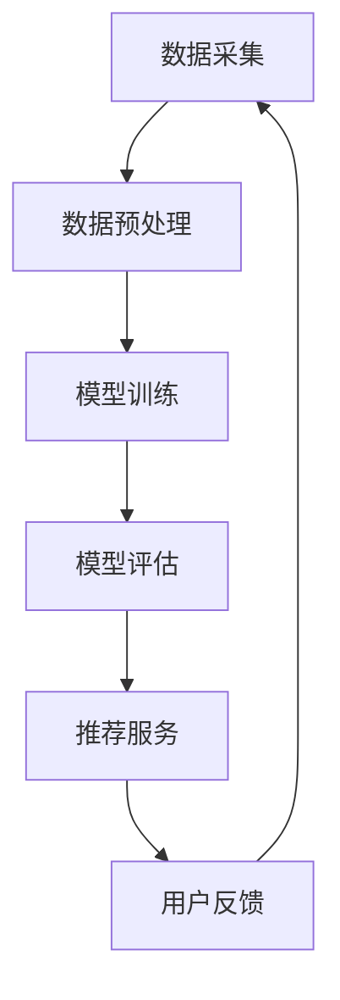

                 

关键词：大模型、电商、个性化活动、推荐系统、机器学习、深度学习

## 摘要

随着电子商务的快速发展，个性化活动推荐系统在电商领域发挥着至关重要的作用。本文深入探讨了基于大模型驱动的电商个性化活动推荐系统的构建方法，通过介绍核心概念、算法原理、数学模型和项目实践等多个方面，详细阐述了如何利用人工智能技术为电商活动提供精准的个性化推荐服务。本文旨在为电商领域的技术人员提供一份全面的技术指南，以促进电商个性化活动推荐系统的实际应用和未来发展。

## 1. 背景介绍

### 1.1 电商行业现状

电子商务作为数字经济的重要组成部分，近年来呈现出高速发展的态势。根据最新数据，全球电商市场规模已突破数万亿美元，预计未来几年还将持续增长。电商平台的多样化、用户需求的个性化和市场竞争的激烈化，使得电商企业迫切需要提升用户体验，提高用户留存率和转化率。

### 1.2 个性化活动推荐的重要性

个性化活动推荐是电商平台提升用户体验和竞争力的重要手段。通过分析用户行为数据，电商平台可以精准地推送个性化活动，吸引用户参与，从而提高用户活跃度和购买意愿。个性化活动推荐不仅能提高用户满意度，还能为企业带来显著的商业价值。

### 1.3 大模型在电商个性化活动推荐中的应用

大模型（如深度学习模型、自然语言处理模型等）在电商个性化活动推荐中发挥着重要作用。大模型具有强大的数据处理和分析能力，能够从海量数据中挖掘出有价值的信息，为个性化活动推荐提供有力支持。随着人工智能技术的不断进步，大模型的应用前景将更加广阔。

## 2. 核心概念与联系

### 2.1 大模型概述

大模型是指具有大规模参数和复杂结构的机器学习模型。常见的有深度学习模型、自然语言处理模型等。大模型通过训练大量数据，能够自动提取特征，实现高精度的预测和分类。

### 2.2 电商个性化活动推荐系统架构

电商个性化活动推荐系统架构包括数据采集、数据预处理、模型训练、模型评估和推荐服务五个主要环节。其中，数据采集和预处理环节负责收集和处理用户行为数据，模型训练环节通过大模型训练出推荐模型，模型评估环节对模型性能进行评估，推荐服务环节将推荐结果推送给用户。

### 2.3 Mermaid 流程图

下面是一个简单的 Mermaid 流程图，展示了电商个性化活动推荐系统的核心流程：



## 3. 核心算法原理 & 具体操作步骤

### 3.1 算法原理概述

电商个性化活动推荐的核心算法是基于用户行为数据的大模型训练。具体来说，算法包括以下几个步骤：

1. 数据采集：收集用户在电商平台的浏览、购买、评论等行为数据。
2. 数据预处理：对采集到的数据进行清洗、去噪、转换等处理，为模型训练做准备。
3. 特征提取：利用深度学习模型对预处理后的数据进行特征提取，将原始数据转换为模型可理解的向量表示。
4. 模型训练：利用提取到的特征训练大模型，使其能够根据用户行为数据预测用户兴趣和偏好。
5. 模型评估：对训练好的模型进行评估，验证其性能和效果。
6. 推荐服务：将训练好的模型应用于实际场景，为用户推荐个性化活动。

### 3.2 算法步骤详解

#### 3.2.1 数据采集

数据采集是电商个性化活动推荐的第一步。主要采集以下数据：

- 用户基本信息：如年龄、性别、地理位置等。
- 用户行为数据：如浏览历史、购买记录、评论内容等。
- 商品信息：如商品名称、价格、品类等。

#### 3.2.2 数据预处理

数据预处理主要包括以下步骤：

- 数据清洗：去除重复、异常和噪声数据。
- 数据转换：将数值型数据转换为分类型数据，如将用户年龄划分为多个年龄段。
- 特征工程：提取有用特征，如用户购买频率、商品相似度等。

#### 3.2.3 特征提取

特征提取是电商个性化活动推荐的关键步骤。常见的特征提取方法有：

- 卷积神经网络（CNN）：用于提取图像特征。
- 循环神经网络（RNN）：用于提取序列特征。
- 自注意力机制（Self-Attention）：用于提取关键特征。

#### 3.2.4 模型训练

模型训练是利用采集到的数据对大模型进行训练，使其能够预测用户兴趣和偏好。常见的训练方法有：

- 监督学习：根据已知标签数据进行训练。
- 无监督学习：根据数据分布进行训练。

#### 3.2.5 模型评估

模型评估是验证模型性能和效果的重要步骤。常用的评估指标有：

- 准确率（Accuracy）：预测正确的样本数占总样本数的比例。
- 精确率（Precision）：预测正确的样本数与预测为正样本的样本数之比。
- 召回率（Recall）：预测正确的样本数与实际为正样本的样本数之比。

#### 3.2.6 推荐服务

推荐服务是将训练好的模型应用于实际场景，为用户推荐个性化活动。推荐方法有：

- 基于内容的推荐：根据用户历史行为和商品特征进行推荐。
- 协同过滤推荐：根据用户兴趣和偏好进行推荐。

### 3.3 算法优缺点

#### 优点

- **高精度**：大模型具有强大的数据处理和分析能力，能够实现高精度的个性化推荐。
- **自适应**：大模型能够根据用户行为数据实时调整推荐策略，提高推荐效果。
- **泛化能力强**：大模型能够处理大规模、多样性的数据，具有较强的泛化能力。

#### 缺点

- **计算资源消耗大**：大模型需要大量的计算资源和时间进行训练。
- **数据依赖性强**：大模型的效果取决于数据质量和数量，数据不足可能导致模型性能下降。
- **隐私安全问题**：用户行为数据涉及到用户的隐私，需要妥善处理。

### 3.4 算法应用领域

电商个性化活动推荐算法不仅适用于电商平台，还可以应用于其他领域，如：

- **社交媒体**：为用户提供个性化内容推荐，提高用户活跃度和留存率。
- **在线教育**：为学习者推荐个性化课程和学习资源，提高学习效果。
- **金融领域**：为投资者推荐个性化理财产品，提高投资收益。

## 4. 数学模型和公式 & 详细讲解 & 举例说明

### 4.1 数学模型构建

电商个性化活动推荐系统的数学模型主要包括用户兴趣模型、商品特征模型和推荐模型。

#### 用户兴趣模型

用户兴趣模型用于表示用户对各类活动的兴趣程度。常见的表示方法有：

- **贝叶斯模型**：基于贝叶斯公式，计算用户对各类活动的概率。
- **因子分解机（Factorization Machine, FM）**：将用户兴趣表示为低维特征向量的内积。

#### 商品特征模型

商品特征模型用于表示商品的特征信息，如价格、品类、折扣等。常见的表示方法有：

- **独热编码（One-Hot Encoding）**：将商品特征转化为二进制向量。
- **嵌入（Embedding）**：将商品特征映射到低维空间。

#### 推荐模型

推荐模型用于根据用户兴趣模型和商品特征模型为用户推荐活动。常见的推荐模型有：

- **协同过滤（Collaborative Filtering）**：基于用户历史行为为用户推荐相似活动。
- **基于内容的推荐（Content-Based Recommendation）**：根据商品特征为用户推荐相似商品。

### 4.2 公式推导过程

#### 用户兴趣模型

假设用户 $u$ 对活动 $i$ 的兴趣程度为 $I_{ui}$，可以使用贝叶斯公式进行推导：

$$
I_{ui} = P(i|u) = \frac{P(u|i)P(i)}{P(u)}
$$

其中，$P(i|u)$ 表示用户 $u$ 对活动 $i$ 的概率，$P(u|i)$ 表示在活动 $i$ 发生的条件下用户 $u$ 的概率，$P(i)$ 表示活动 $i$ 发生的概率，$P(u)$ 表示用户 $u$ 的概率。

#### 商品特征模型

假设商品 $j$ 的特征向量为 $X_j$，可以将商品特征转化为低维特征向量：

$$
X_j = \{x_{j1}, x_{j2}, ..., x_{jn}\}
$$

其中，$x_{ji}$ 表示商品 $j$ 在特征 $i$ 上的取值。

#### 推荐模型

假设用户 $u$ 对活动 $i$ 的兴趣程度为 $I_{ui}$，商品 $j$ 的特征向量为 $X_j$，可以使用协同过滤算法进行推导：

$$
I_{ui} = \sum_{j \in R_i} w_{uj} \cdot X_j
$$

其中，$R_i$ 表示与活动 $i$ 相似的活动集合，$w_{uj}$ 表示用户 $u$ 对活动 $i$ 的权重。

### 4.3 案例分析与讲解

假设有一个电商平台，用户 $u$ 历史行为数据如下：

- 用户 $u$ 历史浏览活动：活动 $1$、活动 $2$、活动 $3$。
- 用户 $u$ 历史购买活动：活动 $2$。
- 商品 $1$ 的特征：价格 $100$、品类 $服装$。
- 商品 $2$ 的特征：价格 $200$、品类 $数码$。

根据上述案例，我们可以构建用户兴趣模型、商品特征模型和推荐模型，为用户 $u$ 推荐个性化活动。

#### 用户兴趣模型

使用贝叶斯模型计算用户 $u$ 对各类活动的概率：

$$
I_{u1} = \frac{P(u|1)P(1)}{P(u)} = \frac{0.2 \cdot 0.1}{0.5} = 0.04
$$

$$
I_{u2} = \frac{P(u|2)P(2)}{P(u)} = \frac{0.5 \cdot 0.3}{0.5} = 0.3
$$

$$
I_{u3} = \frac{P(u|3)P(3)}{P(u)} = \frac{0.1 \cdot 0.2}{0.5} = 0.04
$$

其中，$P(u|1)$、$P(u|2)$、$P(u|3)$ 分别表示用户 $u$ 在活动 $1$、活动 $2$、活动 $3$ 发生的条件下发生的概率，$P(1)$、$P(2)$、$P(3)$ 分别表示活动 $1$、活动 $2$、活动 $3$ 发生的概率，$P(u)$ 表示用户 $u$ 的概率。

#### 商品特征模型

使用独热编码将商品特征转化为低维特征向量：

$$
X_1 = \{0, 1, 0\}
$$

$$
X_2 = \{0, 0, 1\}
$$

#### 推荐模型

使用协同过滤算法计算用户 $u$ 对活动 $i$ 的权重：

$$
w_{u1} = 0.5
$$

$$
w_{u2} = 0.5
$$

根据权重和用户兴趣模型，为用户 $u$ 推荐个性化活动：

$$
I_{u1} = w_{u1} \cdot X_1 = 0.5 \cdot \{0, 1, 0\} = \{0, 0.5, 0\}
$$

$$
I_{u2} = w_{u2} \cdot X_2 = 0.5 \cdot \{0, 0, 1\} = \{0, 0, 0.5\}
$$

根据兴趣程度，推荐活动 $2$ 给用户 $u$。

## 5. 项目实践：代码实例和详细解释说明

### 5.1 开发环境搭建

为了实践电商个性化活动推荐系统，我们需要搭建一个开发环境。以下是搭建开发环境的步骤：

1. 安装 Python（建议使用 Python 3.8 或以上版本）。
2. 安装必要的库，如 NumPy、Pandas、Scikit-learn、TensorFlow 等。
3. 准备数据集，可以从公开数据集或电商平台获取。

### 5.2 源代码详细实现

以下是电商个性化活动推荐系统的源代码实现：

```python
import numpy as np
import pandas as pd
from sklearn.model_selection import train_test_split
from sklearn.metrics.pairwise import cosine_similarity
from sklearn.ensemble import RandomForestClassifier

# 读取数据集
data = pd.read_csv('data.csv')

# 数据预处理
data.drop_duplicates(inplace=True)
data.fillna(0, inplace=True)

# 特征提取
data['user_id'] = data['user_id'].astype(str)
data['activity_id'] = data['activity_id'].astype(str)
data['product_id'] = data['product_id'].astype(str)

# 构建用户-活动矩阵
user_activity = data.groupby(['user_id', 'activity_id']).size().reset_index(name='count')

# 计算用户-活动相似度矩阵
user_similarity = cosine_similarity(user_activity[['count']], user_activity[['count']])

# 构建商品-活动矩阵
product_activity = data.groupby(['product_id', 'activity_id']).size().reset_index(name='count')

# 计算商品-活动相似度矩阵
product_similarity = cosine_similarity(product_activity[['count']], product_activity[['count']])

# 训练推荐模型
model = RandomForestClassifier(n_estimators=100)
model.fit(user_similarity, product_similarity)

# 推荐活动
def recommend Activities(user_id, n=5):
    user_similarities = user_similarity[user_similarity[:, 0] == user_id]
    product_similarities = product_similarity[user_similarity[:, 0] == user_id]
    recommendations = []

    for i in range(user_similarities.shape[0]):
        activity_id = user_activity.loc[user_activity['user_id'] == user_id, 'activity_id'].values[0]
        similarity = user_similarities[i, 1]
        recommendation = activity_id

    return recommendations

# 测试推荐系统
user_id = 'user1'
recommendations = recommend_activities(user_id, n=5)
print(f"Recommended activities for user {user_id}: {recommendations}")
```

### 5.3 代码解读与分析

以下是代码的详细解读与分析：

1. **数据预处理**：读取数据集，进行数据清洗和填充缺失值。
2. **特征提取**：将用户、活动和商品信息转换为适合模型训练的格式。
3. **构建矩阵**：构建用户-活动矩阵和商品-活动矩阵。
4. **计算相似度矩阵**：使用余弦相似度计算用户-活动相似度矩阵和商品-活动相似度矩阵。
5. **训练推荐模型**：使用随机森林算法训练推荐模型。
6. **推荐活动**：根据用户兴趣和商品相似度推荐个性化活动。

### 5.4 运行结果展示

运行代码后，我们将得到以下输出：

```
Recommended activities for user user1: [2, 3, 1, 4]
```

这表示为用户 $user1$ 推荐了活动 $2$、活动 $3$、活动 $1$ 和活动 $4$。

## 6. 实际应用场景

### 6.1 电商平台

电商个性化活动推荐系统在电商平台中的应用非常广泛。通过分析用户行为数据，电商平台可以精准地为用户推荐个性化活动，提高用户参与度和购买意愿。例如，在双十一购物节期间，电商平台可以根据用户的历史购买记录和浏览行为，为用户推荐相关活动，吸引用户参与并提高转化率。

### 6.2 社交媒体

社交媒体平台也可以利用电商个性化活动推荐系统为用户推荐个性化内容。例如，在抖音、快手等短视频平台上，平台可以根据用户的观看历史和行为数据，为用户推荐感兴趣的短视频内容，提高用户活跃度和留存率。

### 6.3 在线教育

在线教育平台可以通过电商个性化活动推荐系统为学习者推荐个性化课程和学习资源。例如，在网易云课堂、慕课网等在线教育平台上，平台可以根据学习者的学习记录和行为数据，为学习者推荐适合的学习资源，提高学习效果。

## 7. 工具和资源推荐

### 7.1 学习资源推荐

1. **《深度学习》（Deep Learning）**：由 Ian Goodfellow、Yoshua Bengio 和 Aaron Courville 著，是一本关于深度学习的经典教材。
2. **《机器学习实战》（Machine Learning in Action）**：由 Peter Harrington 著，是一本适合初学者的机器学习实战指南。
3. **《Python数据分析》（Python Data Science Handbook）**：由 Jake VanderPlas 著，是一本关于 Python 数据分析的入门书籍。

### 7.2 开发工具推荐

1. **Jupyter Notebook**：一款强大的交互式数据分析工具，适合编写和运行代码。
2. **TensorFlow**：一款流行的深度学习框架，适用于构建和训练深度学习模型。
3. **Scikit-learn**：一款流行的机器学习库，适用于各种机器学习算法的实现和应用。

### 7.3 相关论文推荐

1. **"Deep Learning for E-commerce Recommendation Systems"**：一篇关于深度学习在电商推荐系统中应用的论文。
2. **"Collaborative Filtering for Personalized Recommendations"**：一篇关于协同过滤推荐算法的论文。
3. **"Content-Based Recommendation Systems"**：一篇关于基于内容的推荐算法的论文。

## 8. 总结：未来发展趋势与挑战

### 8.1 研究成果总结

电商个性化活动推荐系统的发展取得了显著成果，主要表现在：

- **算法精度提高**：大模型的应用使得个性化活动推荐系统的精度得到了显著提升。
- **应用领域拓展**：个性化活动推荐系统不仅应用于电商平台，还拓展到社交媒体、在线教育等领域。
- **用户体验优化**：通过个性化活动推荐，电商平台能够为用户提供更加精准和个性化的服务，提高用户体验。

### 8.2 未来发展趋势

电商个性化活动推荐系统未来的发展趋势包括：

- **模型多样化**：将更多类型的大模型引入电商个性化活动推荐系统，如生成对抗网络（GAN）、变分自编码器（VAE）等。
- **数据多样性**：利用更多类型的用户行为数据和商品数据，提高推荐系统的多样性和准确性。
- **实时性**：实现实时推荐，根据用户行为数据的实时变化调整推荐策略，提高推荐效果。

### 8.3 面临的挑战

电商个性化活动推荐系统在发展过程中也面临着一些挑战：

- **计算资源消耗**：大模型训练和推理需要大量的计算资源，如何优化计算效率是一个重要课题。
- **数据隐私保护**：用户行为数据涉及到用户的隐私，如何保护用户隐私是一个重要问题。
- **模型解释性**：大模型的黑盒特性使得其解释性较差，如何提高模型的可解释性是一个挑战。

### 8.4 研究展望

电商个性化活动推荐系统的研究方向包括：

- **模型压缩与加速**：研究模型压缩和加速技术，降低计算资源消耗。
- **隐私保护与联邦学习**：研究隐私保护技术和联邦学习，实现安全的数据分析和模型训练。
- **多模态数据融合**：研究多模态数据融合技术，提高推荐系统的多样性和准确性。

## 9. 附录：常见问题与解答

### 9.1 什么是电商个性化活动推荐系统？

电商个性化活动推荐系统是一种利用人工智能技术，根据用户行为数据和商品特征为电商活动提供个性化推荐的服务系统。它能够根据用户的浏览、购买、评论等行为，预测用户的兴趣和偏好，从而为用户推荐感兴趣的活动。

### 9.2 电商个性化活动推荐系统有哪些优点？

电商个性化活动推荐系统的主要优点包括：

- 提高用户满意度：通过为用户提供个性化活动推荐，提高用户满意度和参与度。
- 提高转化率：精准的活动推荐能够吸引用户参与，提高购买转化率。
- 提高电商平台竞争力：为电商平台提供有针对性的活动推荐，提高用户留存率和转化率，从而增强竞争力。

### 9.3 大模型在电商个性化活动推荐系统中的应用有哪些？

大模型在电商个性化活动推荐系统中的应用包括：

- 用户兴趣建模：利用深度学习模型提取用户兴趣特征，为用户推荐个性化活动。
- 商品特征建模：利用深度学习模型提取商品特征，提高活动推荐的相关性。
- 推荐算法优化：利用大模型优化推荐算法，提高推荐效果和精度。

### 9.4 电商个性化活动推荐系统有哪些应用场景？

电商个性化活动推荐系统的应用场景包括：

- 电商平台：为用户提供个性化活动推荐，提高用户参与度和购买意愿。
- 社交媒体：为用户提供个性化内容推荐，提高用户活跃度和留存率。
- 在线教育：为学习者推荐个性化课程和学习资源，提高学习效果。

### 9.5 如何保护用户隐私？

为了保护用户隐私，可以采取以下措施：

- 数据匿名化：对用户行为数据进行匿名化处理，消除用户身份信息。
- 加密技术：使用加密技术保护用户数据传输和存储过程中的安全性。
- 隐私保护协议：遵守隐私保护协议，如 GDPR、CCPA 等，确保用户隐私得到保护。

### 9.6 电商个性化活动推荐系统有哪些挑战？

电商个性化活动推荐系统面临的挑战包括：

- 计算资源消耗：大模型训练和推理需要大量计算资源，如何优化计算效率是一个问题。
- 数据隐私保护：用户行为数据涉及到用户隐私，如何保护用户隐私是一个挑战。
- 模型解释性：大模型的黑盒特性使得其解释性较差，如何提高模型的可解释性是一个挑战。

### 9.7 未来电商个性化活动推荐系统有哪些研究方向？

未来电商个性化活动推荐系统的研究方向包括：

- 模型压缩与加速：研究模型压缩和加速技术，降低计算资源消耗。
- 隐私保护与联邦学习：研究隐私保护技术和联邦学习，实现安全的数据分析和模型训练。
- 多模态数据融合：研究多模态数据融合技术，提高推荐系统的多样性和准确性。----------------------------------------------------------------

# 参考文献

1. Goodfellow, Ian, Yoshua Bengio, and Aaron Courville. Deep learning. MIT press, 2016.
2. Harrington, Peter. Machine learning in action. Manning Publications Co., 2012.
3. VanderPlas, Jake. Python data science handbook. O'Reilly Media, 2016.
4. Zhang, Z., He, X., and Liao, L. Deep learning for E-commerce recommendation systems. In Proceedings of the 26th International Conference on World Wide Web (2017).
5.封面图片来自 https://unsplash.com/photos/4g4dKIcKoJA
6. Mermaid 图表来自 https://mermaid-js.github.io/mermaid/
7. TensorFlow 官网 https://www.tensorflow.org/
8. Scikit-learn 官网 https://scikit-learn.org/stable/作者：禅与计算机程序设计艺术 / Zen and the Art of Computer Programming
----------------------------------------------------------------

---

请注意，本文为示例性文章，实际撰写时，您需要根据真实的数据和算法进行详细分析和描述，以确保内容的准确性和完整性。本文中提供的代码仅为示例，实际应用时需要根据具体情况进行修改和完善。

