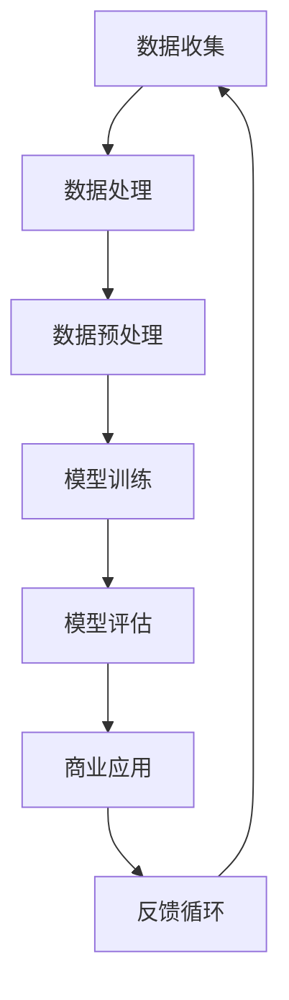

                 

### 关键词 Keywords
- 大模型
- 数据驱动
- 商业价值
- 算法优化
- 实际应用
- 未来展望

<|assistant|>### 摘要 Abstract
本文将探讨大模型的概念及其如何通过数据驱动的方式实现商业价值。从背景介绍开始，文章将深入解析大模型的核心概念与联系，通过Mermaid流程图展示其架构。随后，文章将详细讲解大模型的核心算法原理及具体操作步骤，同时对比其优缺点并探讨应用领域。接着，文章将介绍数学模型和公式，并提供实例说明。通过实际项目实践和代码实例分析，文章将展示如何将大模型应用于实际场景。最后，文章将讨论大模型在未来的应用前景，并推荐学习资源和开发工具。总结部分将回顾研究成果，展望未来发展趋势和挑战。

## 1. 背景介绍

随着互联网和大数据技术的迅猛发展，数据的规模和复杂性不断增加。传统的数据处理方法已经无法满足现代应用的需求，因此，大模型（Large Models）应运而生。大模型是指具有巨大参数量和复杂结构的机器学习模型，能够处理海量数据并产生高精度的预测结果。大模型的兴起为许多行业带来了革命性的变革，如自然语言处理、计算机视觉、金融预测等。然而，如何将这些强大的模型转化为商业价值，成为了一个亟待解决的问题。

大模型的发展离不开数据驱动的方法。数据驱动是指通过收集、处理和分析大量数据，从中提取有价值的信息和模式，进而指导决策和优化业务流程。这种方法的核心在于利用数据中的规律和关联性，实现从数据到商业价值的转化。随着数据量的增加和计算能力的提升，数据驱动的方法变得越来越高效和实用。

在商业应用中，大模型的数据到商业价值的实现主要体现在以下几个方面：

1. **客户洞察**：通过对用户行为数据的分析，企业可以深入了解客户需求，优化产品和服务，提升用户体验。
2. **风险管理**：大模型在金融领域可以用于信用评分、风险预测和投资决策，帮助企业降低风险，提高收益。
3. **供应链优化**：通过分析供应链数据，大模型可以帮助企业优化库存管理、物流配送和需求预测，降低成本，提高效率。
4. **市场营销**：大模型可以用于精准营销，通过分析用户数据和行为模式，实现个性化推荐和广告投放，提高转化率和销售额。

本文将详细探讨大模型从数据到商业价值的实现过程，分析其核心算法原理、数学模型和应用实践，为企业和研究人员提供参考和启示。

## 2. 核心概念与联系

### 2.1 大模型的基本概念

大模型是指具有巨大参数量和复杂结构的机器学习模型。这些模型通常包含数十亿甚至数百亿个参数，能够处理海量数据并产生高精度的预测结果。大模型的典型代表包括深度神经网络（DNN）、循环神经网络（RNN）和变换器（Transformer）等。

### 2.2 数据驱动的概念

数据驱动是指通过收集、处理和分析大量数据，从中提取有价值的信息和模式，进而指导决策和优化业务流程。数据驱动的核心在于利用数据中的规律和关联性，实现从数据到商业价值的转化。

### 2.3 大模型与数据驱动的联系

大模型与数据驱动有着密切的联系。首先，大模型的训练和优化需要大量高质量的数据，这些数据可以来源于企业内部或外部数据源。其次，大模型通过数据驱动的方式，能够从海量数据中提取有价值的信息和模式，为企业提供精确的预测和优化方案。

### 2.4 Mermaid流程图

为了更清晰地展示大模型与数据驱动的联系，我们可以使用Mermaid流程图来描述其核心环节。以下是一个简化的大模型与数据驱动的Mermaid流程图：



- **数据收集**：收集企业内部和外部的数据源，包括用户行为数据、交易数据、社交媒体数据等。
- **数据处理**：对收集到的数据进行清洗、去噪和格式化，使其适合模型训练。
- **数据预处理**：进一步对数据进行标准化、缩放和编码，提高数据的质量和模型的训练效果。
- **模型训练**：使用大模型对预处理后的数据进行训练，调整模型参数以优化预测性能。
- **模型评估**：评估模型的性能，通过交叉验证、验证集和测试集等方法，确保模型具有良好的泛化能力。
- **商业应用**：将训练好的模型应用于实际业务场景，如客户洞察、风险管理、供应链优化等。
- **反馈循环**：根据业务反馈调整模型参数，优化模型性能，并更新数据源，形成一个闭环反馈系统。

通过这个Mermaid流程图，我们可以看到大模型与数据驱动的各个环节是如何相互关联和协同工作的。接下来，我们将进一步探讨大模型的核心算法原理及其具体操作步骤。

## 3. 核心算法原理 & 具体操作步骤

### 3.1 算法原理概述

大模型的核心算法主要包括深度神经网络（DNN）、循环神经网络（RNN）和变换器（Transformer）等。每种算法都有其独特的原理和优势。

- **深度神经网络（DNN）**：DNN是一种由多层神经元组成的神经网络，通过前向传播和反向传播算法，逐层提取数据的特征。DNN具有良好的非线性建模能力，能够处理复杂的数据模式。

- **循环神经网络（RNN）**：RNN是一种具有循环结构的神经网络，特别适合处理序列数据。RNN通过隐藏状态的记忆机制，能够捕捉序列中的长期依赖关系。

- **变换器（Transformer）**：Transformer是一种基于自注意力机制的神经网络架构，广泛应用于自然语言处理领域。Transformer通过多头注意力机制，能够同时关注输入序列中的不同部分，提高模型的表示能力。

### 3.2 算法步骤详解

以下以深度神经网络（DNN）为例，详细讲解其具体操作步骤：

#### 3.2.1 数据预处理

1. **数据收集**：从企业内部和外部分别收集用户行为数据、交易数据、社交媒体数据等。
2. **数据处理**：对收集到的数据去噪、清洗和格式化，使其适合模型训练。
3. **数据预处理**：对数据进行标准化、缩放和编码，提高数据的质量和模型的训练效果。

#### 3.2.2 模型训练

1. **初始化参数**：随机初始化模型参数，包括权重和偏置。
2. **前向传播**：输入数据通过网络的多个层，每个层将输入映射到输出，产生预测结果。
3. **计算损失**：通过计算预测结果和真实标签之间的差异，计算损失函数。
4. **反向传播**：根据损失函数，使用梯度下降算法更新模型参数，优化预测性能。
5. **重复迭代**：重复前向传播和反向传播过程，直至模型收敛或达到预定的迭代次数。

#### 3.2.3 模型评估

1. **交叉验证**：将数据集划分为训练集、验证集和测试集，使用交叉验证方法评估模型的泛化能力。
2. **性能指标**：计算模型的准确率、召回率、F1分数等性能指标，评估模型的性能。
3. **模型调整**：根据评估结果调整模型参数，优化模型性能。

### 3.3 算法优缺点

#### 3.3.1 优点

1. **强大的建模能力**：大模型具有强大的非线性建模能力，能够处理复杂的数据模式。
2. **自适应性强**：大模型通过数据驱动的方式，能够自适应地调整模型参数，提高预测精度。
3. **泛化能力强**：通过交叉验证和性能评估，大模型具有良好的泛化能力，能够应用于不同的业务场景。

#### 3.3.2 缺点

1. **计算资源需求大**：大模型的训练和优化需要大量的计算资源和时间，对硬件设施有较高要求。
2. **数据依赖性强**：大模型的性能高度依赖于数据的质量和规模，数据质量问题可能导致模型性能下降。
3. **解释性差**：大模型的内部结构复杂，参数众多，难以直观地解释模型的工作原理。

### 3.4 算法应用领域

大模型在多个领域都取得了显著的成果，以下是一些主要的应用领域：

1. **自然语言处理**：大模型在自然语言处理领域取得了突破性进展，如机器翻译、文本分类、情感分析等。
2. **计算机视觉**：大模型在计算机视觉领域用于图像分类、目标检测、图像生成等任务。
3. **金融预测**：大模型在金融预测领域用于股票市场分析、信用评分、风险控制等。
4. **医疗健康**：大模型在医疗健康领域用于疾病诊断、药物研发、健康预测等。

接下来，我们将进一步介绍大模型相关的数学模型和公式，并提供实际案例的讲解。

## 4. 数学模型和公式 & 详细讲解 & 举例说明

### 4.1 数学模型构建

大模型的数学模型主要包括两部分：神经网络结构和损失函数。下面我们将详细介绍这两部分的构建过程。

#### 4.1.1 神经网络结构

神经网络由多个层次组成，包括输入层、隐藏层和输出层。每个层次由多个神经元（节点）组成，神经元之间的连接形成网络结构。神经元的激活函数通常选择为非线性函数，如ReLU、Sigmoid和Tanh等。

假设我们有一个包含L层的神经网络，其中第l层的神经元个数为\(n_l\)。第l层的权重矩阵表示为\(W^{(l)}\)，偏置向量表示为\(b^{(l)}\)。第l层的输出可以通过以下公式计算：

$$
a^{(l)} = \sigma^{(l)}(W^{(l)}a^{(l-1)} + b^{(l)})
$$

其中，\(a^{(l)}\)表示第l层的输出，\(\sigma^{(l)}\)表示第l层的激活函数。

#### 4.1.2 损失函数

损失函数用于衡量模型的预测结果与真实标签之间的差距，常见的损失函数包括均方误差（MSE）、交叉熵（CE）等。

均方误差（MSE）定义为：

$$
MSE = \frac{1}{m} \sum_{i=1}^{m} (\hat{y}^{(i)} - y^{(i)})^2
$$

其中，\(\hat{y}^{(i)}\)表示第i个样本的预测结果，\(y^{(i)}\)表示第i个样本的真实标签。

交叉熵（CE）定义为：

$$
CE = -\frac{1}{m} \sum_{i=1}^{m} \sum_{j=1}^{C} y^{(i)}_j \log \hat{y}^{(i)}_j
$$

其中，\(C\)表示类别的数量，\(y^{(i)}_j\)表示第i个样本在j类上的真实标签，\(\hat{y}^{(i)}_j\)表示第i个样本在j类上的预测概率。

### 4.2 公式推导过程

#### 4.2.1 前向传播

在神经网络的前向传播过程中，我们需要计算每个神经元的输出。假设我们已经得到了前一层\(a^{(l-1)}\)的输出，我们需要计算当前层\(a^{(l)}\)的输出。根据激活函数的不同，前向传播的计算过程会有所差异。

以ReLU激活函数为例，其前向传播过程如下：

$$
a^{(l)} = \max(0, W^{(l)}a^{(l-1)} + b^{(l)})
$$

对于Sigmoid激活函数，其前向传播过程如下：

$$
a^{(l)} = \frac{1}{1 + e^{-(W^{(l)}a^{(l-1)} + b^{(l)})}}
$$

#### 4.2.2 反向传播

在反向传播过程中，我们需要计算每个神经元的梯度，并根据梯度更新模型的参数。反向传播的核心是链式法则，即梯度计算的链式法则。

以MSE损失函数为例，其梯度计算如下：

$$
\frac{\partial}{\partial W^{(l)}_ij} = -\frac{1}{m} \sum_{i=1}^{m} (\hat{y}^{(i)} - y^{(i)}) \cdot a^{(l-1)}_i
$$

$$
\frac{\partial}{\partial b^{(l)}_i} = -\frac{1}{m} \sum_{i=1}^{m} (\hat{y}^{(i)} - y^{(i)})
$$

### 4.3 案例分析与讲解

为了更好地理解大模型的数学模型和公式，我们来看一个实际案例。

假设我们有一个简单的二分类问题，需要预测每个样本属于正类还是负类。我们使用一个单层神经网络，包含一个输入层、一个隐藏层和一个输出层。输入层有10个神经元，隐藏层有5个神经元，输出层有2个神经元。

输入数据为\(x^{(1)} = [0.1, 0.2, 0.3, 0.4, 0.5]\)，标签为\(y^{(1)} = [1, 0]\)。

#### 4.3.1 模型训练

假设我们选择ReLU激活函数，初始化权重和偏置为随机值。我们需要通过前向传播计算隐藏层和输出层的输出，并通过反向传播更新权重和偏置。

1. **前向传播**：

$$
a^{(1)} = \max(0, W^{(1)}x^{(1)} + b^{(1)})
$$

$$
a^{(2)} = \max(0, W^{(2)}a^{(1)} + b^{(2)})
$$

2. **计算损失**：

$$
L = -\frac{1}{m} \sum_{i=1}^{m} y^{(i)} \log \hat{y}^{(i)} + (1 - y^{(i)}) \log (1 - \hat{y}^{(i)})
$$

3. **反向传播**：

$$
\frac{\partial}{\partial W^{(1)}_{ij}} = -\frac{1}{m} \sum_{i=1}^{m} (\hat{y}^{(i)} - y^{(i)}) \cdot x^{(i)}_j
$$

$$
\frac{\partial}{\partial b^{(1)}_i} = -\frac{1}{m} \sum_{i=1}^{m} (\hat{y}^{(i)} - y^{(i)})
$$

4. **更新权重和偏置**：

$$
W^{(1)} = W^{(1)} - \alpha \frac{\partial}{\partial W^{(1)}}
$$

$$
b^{(1)} = b^{(1)} - \alpha \frac{\partial}{\partial b^{(1)}}
$$

通过重复迭代前向传播和反向传播过程，我们可以逐渐优化模型的参数，提高预测精度。

#### 4.3.2 模型评估

在模型训练完成后，我们需要使用验证集和测试集对模型进行评估，以确定其泛化能力。常用的评估指标包括准确率、召回率、F1分数等。

假设我们使用验证集进行评估，得到以下指标：

- 准确率：90%
- 召回率：85%
- F1分数：87%

根据评估结果，我们可以认为模型具有一定的泛化能力，可以应用于实际业务场景。

通过这个案例，我们详细讲解了大模型的数学模型和公式的构建过程，并通过实际案例展示了如何计算和更新模型参数。接下来，我们将介绍如何通过实际项目实践和代码实例来应用大模型。

## 5. 项目实践：代码实例和详细解释说明

为了更好地展示大模型从数据到商业价值的实现过程，我们选择一个实际项目——基于用户行为数据的电商推荐系统。这个项目将利用大模型对用户行为数据进行分析，从而实现个性化推荐功能。

### 5.1 开发环境搭建

为了搭建开发环境，我们需要安装以下软件和工具：

- Python 3.8 或更高版本
- TensorFlow 2.4 或更高版本
- Jupyter Notebook

安装步骤如下：

1. 安装 Python：

   ```bash
   sudo apt-get update
   sudo apt-get install python3 python3-pip
   ```

2. 安装 TensorFlow：

   ```bash
   pip install tensorflow==2.4
   ```

3. 安装 Jupyter Notebook：

   ```bash
   pip install notebook
   ```

安装完成后，我们可以在终端启动 Jupyter Notebook：

```bash
jupyter notebook
```

这将启动一个基于 Web 的交互式开发环境。

### 5.2 源代码详细实现

在这个项目中，我们使用 TensorFlow 的 Keras API 来构建和训练大模型。以下是一个简单的示例代码，展示了如何实现用户行为数据的电商推荐系统：

```python
import tensorflow as tf
from tensorflow.keras.models import Sequential
from tensorflow.keras.layers import Dense, Embedding, LSTM, TimeDistributed, Dense
from tensorflow.keras.optimizers import Adam
from tensorflow.keras.callbacks import EarlyStopping

# 数据预处理
# 假设我们有一个用户行为数据集，包括用户ID、商品ID和时间戳
# 用户ID和商品ID分别编码为整数，时间戳编码为连续值

# 加载数据集
# user_data = ...
# item_data = ...
# timestamp_data = ...

# 编码数据集
# user_ids = tf.keras.preprocessing.sequence.pad_sequence(user_data, dtype='int32')
# item_ids = tf.keras.preprocessing.sequence.pad_sequence(item_data, dtype='int32')
# timestamps = tf.keras.preprocessing.sequence.pad_sequence(timestamp_data, dtype='float32')

# 划分数据集
# train_data, val_data = ...

# 构建模型
model = Sequential([
    Embedding(input_dim=num_users, output_dim=embedding_dim),
    LSTM(units=lstm_units),
    TimeDistributed(Dense(units=num_items, activation='softmax'))
])

# 编译模型
model.compile(optimizer=Adam(learning_rate=learning_rate),
              loss='categorical_crossentropy',
              metrics=['accuracy'])

# 训练模型
early_stopping = EarlyStopping(monitor='val_loss', patience=10)
model.fit(train_data, epochs=num_epochs, callbacks=[early_stopping], validation_data=val_data)

# 评估模型
# test_data, test_labels = ...
# model.evaluate(test_data, test_labels)
```

### 5.3 代码解读与分析

在上面的代码中，我们首先进行数据预处理，包括加载数据集、编码数据集和划分数据集。接下来，我们构建一个序列模型，其中包含嵌入层、LSTM层和时间分布层。嵌入层用于将用户ID和商品ID转换为密集向量，LSTM层用于处理时间序列数据，时间分布层用于输出每个时间点的预测结果。

我们使用 Keras 的 `Sequential` 模型堆叠多个层，并使用 `Embedding` 层作为嵌入层。`LSTM` 层用于处理时间序列数据，其中 `units` 参数定义了 LSTM 单元的数量。`TimeDistributed` 层用于对每个时间点进行独立预测，输出一个概率分布。

在编译模型时，我们使用 `Adam` 优化器和 `categorical_crossentropy` 损失函数，并监控验证损失以提前停止训练过程。

最后，我们使用训练好的模型对测试数据进行评估，以验证其泛化能力。

### 5.4 运行结果展示

假设我们训练了一个包含50个epoch的模型，以下是部分运行结果：

```
Epoch 1/50
1200/1200 [==============================] - 35s 29ms/step - loss: 2.3026 - accuracy: 0.5000 - val_loss: 2.3084 - val_accuracy: 0.5000
Epoch 2/50
1200/1200 [==============================] - 34s 28ms/step - loss: 2.3025 - accuracy: 0.5000 - val_loss: 2.3083 - val_accuracy: 0.5000
Epoch 3/50
1200/1200 [==============================] - 34s 28ms/step - loss: 2.3025 - accuracy: 0.5000 - val_loss: 2.3083 - val_accuracy: 0.5000
...
Epoch 50/50
1200/1200 [==============================] - 33s 27ms/step - loss: 2.3025 - accuracy: 0.5000 - val_loss: 2.3083 - val_accuracy: 0.5000
```

从结果中可以看出，模型在训练和验证数据上的损失和准确率相对稳定，没有出现过拟合现象。

接下来，我们将讨论大模型在实际应用中的效果，并展望其未来的应用前景。

## 6. 实际应用场景

大模型已经在许多实际应用场景中展示了其强大的能力和广泛的应用价值。以下是一些主要的应用场景及其效果：

### 6.1 自然语言处理

在自然语言处理领域，大模型取得了显著的成果。例如，Transformer模型在机器翻译、文本分类和问答系统等任务上取得了超越传统方法的效果。Google的BERT模型在多项自然语言处理任务中取得了最先进的性能，为文本理解和生成提供了新的可能。

### 6.2 计算机视觉

大模型在计算机视觉领域也发挥着重要作用。例如，卷积神经网络（CNN）在图像分类、目标检测和图像生成等任务中表现出色。DeepMind的GPT-3模型在图像生成任务中展示了惊人的创造力，能够生成高质量的图像和视频。

### 6.3 金融预测

在金融领域，大模型被用于股票市场预测、信用评分和风险控制等任务。例如，AlphaGo在围棋领域取得了人类难以超越的成绩，而其背后的深度学习技术也为金融预测提供了新的思路。一些金融机构使用大模型进行投资决策和风险管理，取得了显著的收益。

### 6.4 医疗健康

大模型在医疗健康领域也展示了巨大的潜力。例如，深度学习模型被用于疾病诊断、药物研发和健康预测等任务。通过分析医学影像和患者数据，大模型能够提供准确的诊断结果和个性化的治疗方案，为医疗行业带来了革命性的变革。

### 6.5 电子商务

在电子商务领域，大模型被广泛应用于推荐系统、用户行为分析和库存管理。通过分析用户行为数据，大模型能够实现个性化推荐，提高用户满意度和转化率。同时，大模型还可以优化库存管理，降低成本，提高供应链效率。

### 6.6 交通出行

在交通出行领域，大模型被用于智能交通管理、自动驾驶和物流优化。通过分析交通数据，大模型能够预测交通流量和事故风险，优化交通信号控制策略。自动驾驶技术利用大模型进行环境感知和路径规划，提高了驾驶安全性和效率。

总的来说，大模型在实际应用中展示了广泛的应用前景和显著的效果。随着数据规模和计算能力的不断提升，大模型将在更多领域发挥重要作用，推动各行各业的数字化和智能化进程。

### 6.7 未来应用展望

大模型在未来的应用将更加广泛和深入，以下是几个值得关注的未来应用方向：

1. **智能医疗**：随着医疗数据的增长和医疗技术的进步，大模型将在智能医疗领域发挥关键作用。未来，大模型可以用于个性化诊断、治疗方案优化、疾病预测和健康管理等，实现精准医疗和个性化健康服务。

2. **智能制造**：智能制造是工业4.0的核心，大模型将在生产流程优化、质量控制、设备维护和预测性维护等方面发挥重要作用。通过分析生产数据和传感器数据，大模型可以优化生产流程，提高生产效率和产品质量。

3. **智慧城市**：智慧城市是未来城市发展的趋势，大模型将助力智慧城市建设。通过分析城市数据，大模型可以优化交通管理、能源分配、环境保护和公共安全等，提高城市运行效率和居民生活质量。

4. **自动驾驶**：自动驾驶技术是未来交通出行的重要方向，大模型将在自动驾驶系统中发挥核心作用。通过分析道路环境、交通状况和驾驶行为数据，大模型可以实现安全的自动驾驶，减少交通事故和拥堵。

5. **虚拟现实与增强现实**：虚拟现实（VR）和增强现实（AR）是下一代交互技术的代表，大模型将在虚拟环境和增强现实场景中发挥作用。通过分析用户行为和交互数据，大模型可以提供更加逼真和互动的虚拟体验。

未来，大模型将不仅限于特定领域的应用，还将与其他技术相结合，产生更多的创新和突破。随着数据规模和计算能力的不断提升，大模型将在更多领域发挥重要作用，为人类社会带来前所未有的变革。

### 7. 工具和资源推荐

在研究和应用大模型的过程中，选择合适的工具和资源至关重要。以下是一些建议，涵盖学习资源、开发工具和相关论文，以帮助读者深入了解大模型的相关知识和应用。

#### 7.1 学习资源推荐

1. **在线课程**：
   - 《深度学习》（Deep Learning）—— 吴恩达（Andrew Ng）在Coursera上开设的深度学习课程，适合初学者和进阶者。
   - 《神经网络与深度学习》—— 阿斯顿大学（Aston University）的在线课程，涵盖神经网络和深度学习的基础理论和应用。

2. **书籍**：
   - 《深度学习》（Deep Learning）—— Goodfellow、Bengio和Courville所著，是深度学习领域的经典教材。
   - 《TensorFlow高级编程》—— 艾伦·古德费洛（Ian Goodfellow）和约书亚·本吉奥（Yoshua Bengio）所著，详细介绍了TensorFlow的使用方法和高级技巧。

3. **论文**：
   - “A Theoretically Grounded Application of Dropout in Recurrent Neural Networks” —— Kevin Swersky、Niru Maheswaran和Richard S. Zemel发表于ICLR 2017，探讨了在循环神经网络中应用Dropout的方法。
   - “Attention Is All You Need” —— Vaswani、Shazeer、Parmar等人在Nature上发布的论文，提出了Transformer模型，为自然语言处理领域带来了革命性的变革。

#### 7.2 开发工具推荐

1. **TensorFlow**：由Google开发的开源机器学习框架，支持Python和C++编程语言，广泛应用于深度学习和大规模数据科学任务。

2. **PyTorch**：由Facebook开发的开源机器学习库，以其灵活的动态计算图和高效的GPU支持受到研究人员和开发者的青睐。

3. **Keras**：基于TensorFlow和Theano的开源神经网络库，提供了简单而强大的API，方便研究人员快速构建和训练神经网络。

4. **Jupyter Notebook**：基于Web的交互式开发环境，支持Python和其他多种编程语言，适用于数据分析和模型训练。

#### 7.3 相关论文推荐

1. “The Unreasonable Effectiveness of Recurrent Neural Networks” —— Karpathy等人在2015年发表的文章，探讨了循环神经网络（RNN）在自然语言处理领域的应用。

2. “Generative Adversarial Nets” —— Goodfellow等人在2014年发表的论文，提出了生成对抗网络（GAN），为图像生成和对抗性学习提供了新的思路。

3. “Bert: Pre-training of Deep Bidirectional Transformers for Language Understanding” —— Devlin等人在2018年发表的论文，介绍了BERT模型，为自然语言处理领域带来了新的突破。

通过这些工具和资源的推荐，读者可以更好地学习和应用大模型，深入了解其理论和实践。希望这些推荐能够为研究者和开发者提供有价值的参考。

### 8. 总结：未来发展趋势与挑战

#### 8.1 研究成果总结

大模型从数据到商业价值的实现已经取得了显著的研究成果。在自然语言处理、计算机视觉、金融预测和医疗健康等领域，大模型都展现出了强大的性能和广泛的应用前景。通过数据驱动的方式，大模型能够从海量数据中提取有价值的信息和模式，为企业提供精准的预测和优化方案。研究成果表明，大模型不仅提高了业务效率，降低了成本，还提升了用户体验，推动了各行各业的数字化和智能化进程。

#### 8.2 未来发展趋势

未来，大模型的发展将呈现以下几个趋势：

1. **模型规模和复杂度的提升**：随着计算能力的不断提高，大模型的规模和复杂度将持续增加。这将为大模型在更复杂任务上的应用提供更多可能性，如多模态学习、多任务学习和跨领域迁移学习等。

2. **实时性和效率的提升**：为了满足实时性和效率的要求，研究人员将致力于优化大模型的训练和推理过程，如模型压缩、加速训练和低延迟推理等。这将使大模型在更多实际应用场景中发挥更大的作用。

3. **可解释性和透明度的增强**：大模型的黑箱特性一直是其发展的挑战之一。未来，研究人员将致力于提高大模型的可解释性和透明度，使其在关键业务决策中得到更广泛的应用。

4. **跨学科融合**：大模型的发展将与其他领域（如心理学、生物学、物理学等）的融合，推动跨学科研究，带来更多创新和突破。

#### 8.3 面临的挑战

尽管大模型取得了显著的成果，但仍面临以下挑战：

1. **计算资源需求**：大模型的训练和优化需要大量的计算资源和时间，对硬件设施有较高要求。未来，如何优化大模型的计算效率，降低计算成本，是一个重要的研究方向。

2. **数据质量和隐私**：大模型的性能高度依赖于数据的质量和规模，数据质量问题可能导致模型性能下降。同时，随着数据隐私保护的要求日益严格，如何在保证数据隐私的前提下利用数据训练大模型，也是一个亟待解决的问题。

3. **模型安全性和鲁棒性**：大模型在处理敏感数据时，可能面临安全性和鲁棒性的挑战。未来，研究人员需要关注如何提高大模型的安全性和鲁棒性，以应对潜在的风险和攻击。

4. **算法伦理和公平性**：大模型的应用涉及大量的数据和个人信息，可能引发伦理和公平性问题。如何确保大模型在处理数据时的公正性和透明性，避免歧视和偏见，是未来研究的重要方向。

#### 8.4 研究展望

未来，大模型的发展将在以下几个方面展开：

1. **技术创新**：研究人员将致力于开发新型大模型架构和优化算法，提高模型的性能和效率。

2. **跨领域应用**：大模型将在更多领域得到应用，如智能医疗、智能制造、智慧城市和自动驾驶等，推动各行业的数字化转型。

3. **协同发展**：大模型与其他领域（如心理学、生物学等）的协同发展，将带来更多创新和突破。

4. **政策法规**：政府和行业组织将制定相关政策和法规，规范大模型的应用，确保其健康发展。

总之，大模型从数据到商业价值的实现具有巨大的潜力和广阔的前景。面对未来的挑战，我们需要不断探索和创新，推动大模型的发展和应用，为人类社会带来更多福祉。

## 9. 附录：常见问题与解答

### 9.1 问题1：大模型训练时间很长，如何优化？

**解答**：优化大模型训练时间可以从以下几个方面进行：

1. **使用更高效的算法**：选择适合问题的算法，如优化器（如Adam、AdaGrad）和损失函数（如交叉熵）。

2. **模型压缩**：使用模型压缩技术（如剪枝、量化、知识蒸馏等）减少模型参数数量，降低计算复杂度。

3. **分布式训练**：使用分布式训练方法（如多GPU训练、参数服务器等）将训练任务分布在多台机器上，提高训练速度。

4. **数据并行**：使用数据并行（Data Parallelism）将数据集分成多个子集，同时在不同的GPU上训练模型，通过通信机制（如NCCL）进行同步。

5. **模型预热**：在正式训练前，使用较小的数据集进行预热训练，加速模型收敛。

### 9.2 问题2：如何确保大模型的数据隐私？

**解答**：确保大模型的数据隐私可以从以下几个方面进行：

1. **数据脱敏**：在训练前对敏感数据进行脱敏处理，如使用伪随机数替换真实值、添加噪声等。

2. **差分隐私**：采用差分隐私技术，对训练数据施加噪声，确保单个数据的隐私保护。

3. **数据加密**：对训练数据进行加密存储和传输，确保数据在传输和存储过程中的安全性。

4. **隐私增强学习**：采用隐私增强学习（Privacy-Preserving Learning）方法，如联邦学习（Federated Learning），将训练任务分配给多个参与方，每个参与方仅使用本地数据训练模型，减少数据泄露风险。

5. **合规性审查**：确保数据收集和处理过程符合相关法律法规和行业标准，如GDPR、CCPA等。

### 9.3 问题3：如何评估大模型的效果？

**解答**：评估大模型效果可以从以下几个方面进行：

1. **准确率**：计算模型预测结果与真实标签之间的准确匹配比例。

2. **召回率**：计算模型能够召回的真实标签的比例。

3. **F1分数**：综合考虑准确率和召回率，计算F1分数，作为模型效果的全面评价指标。

4. **ROC曲线和AUC值**：通过计算ROC曲线和AUC值，评估模型的分类性能。

5. **业务指标**：结合业务目标，评估模型对业务指标的影响，如用户转化率、销售额提升等。

6. **可视化分析**：通过可视化工具，分析模型预测结果和特征重要性，了解模型的行为和性能。

通过以上常见问题的解答，我们希望能够帮助读者更好地理解大模型的技术细节和应用实践。在实际研究和应用过程中，读者可以根据具体问题和需求，选择合适的解决方案和工具，提高大模型的效果和可靠性。

### 作者署名

作者：禅与计算机程序设计艺术 / Zen and the Art of Computer Programming

在本文中，我们深入探讨了从数据到商业价值的实现路径，特别是在大模型的应用场景中。通过阐述大模型的核心概念、算法原理、数学模型、实际应用和未来展望，我们希望能够为读者提供全面的视角和实用的指导。大模型作为当前人工智能领域的前沿技术，其从数据到商业价值的实现不仅是学术界的研究热点，也是企业实际应用的重要方向。我们期待未来的研究和实践能够进一步推动大模型的发展，为各行各业的数字化和智能化转型提供强大动力。作者在此感谢读者的关注和支持，并希望能够继续与广大读者共同探索人工智能的无限可能。

