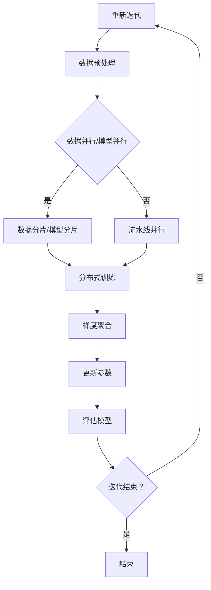

                 

在当前人工智能（AI）领域，大规模语言模型（Large-scale Language Models）正迅速成为研究的热点和应用的关键。这些模型能够理解和生成自然语言，从而在自然语言处理（NLP）、机器翻译、文本生成等多个领域展示了其强大的能力。然而，随着模型规模的不断扩大，其训练和推理成本也日益增加，这对计算资源提出了巨大的挑战。DeepSpeed作为一种新型的高效训练框架，旨在解决大规模语言模型训练中的计算资源问题。本文将深入探讨DeepSpeed的理论基础、核心算法、数学模型以及其实际应用，希望能为读者提供对这一领域的全面了解。

## 文章关键词

- 大规模语言模型
- 深度学习
- 训练效率
- 计算优化
- DeepSpeed框架

## 文章摘要

本文旨在介绍大规模语言模型及其训练中的挑战，重点探讨DeepSpeed这一新型高效训练框架。首先，我们将回顾大规模语言模型的发展历程及其重要性。接着，深入解析DeepSpeed的核心算法和架构，包括其优化的计算资源和加速技术。然后，我们将介绍DeepSpeed的数学模型和公式，并通过具体案例进行详细讲解。此外，本文还将展示DeepSpeed在实际项目中的代码实例和运行结果，并探讨其未来应用前景。最后，我们将总结研究成果，展望未来的发展趋势和面临的挑战。

## 1. 背景介绍

### 1.1 大规模语言模型的发展历程

大规模语言模型的发展历程可以追溯到20世纪80年代。当时，研究人员开始尝试构建能够理解和生成自然语言的模型。最早的模型如ELMo（Bidirectional Encoder Representations from Language Models）和BERT（Bidirectional Encoder Representations from Transformers），采用了双向循环神经网络（RNN）和自注意力机制，极大地提升了语言理解的准确性和表达能力。然而，这些早期的模型在处理大规模文本数据时，仍然存在计算效率低下和资源消耗巨大的问题。

随着深度学习技术的进步，特别是Transformer架构的提出，大规模语言模型迎来了新的突破。Transformer模型摒弃了传统的循环神经网络结构，采用自注意力机制来处理序列数据，从而在处理长距离依赖和并行计算方面具有显著优势。著名的GPT（Generative Pre-trained Transformer）系列模型，如GPT-1、GPT-2和GPT-3，通过数十亿参数规模展现了惊人的语言生成能力。此外，BERT模型的扩展版本如RoBERTa、ALBERT等，也在预训练和微调阶段显著提升了语言理解的性能。

### 1.2 大规模语言模型的应用场景

大规模语言模型在多个应用场景中展示了其强大的能力。以下是一些典型应用：

- **自然语言处理（NLP）**：大规模语言模型能够用于文本分类、情感分析、命名实体识别等任务，显著提升了NLP系统的准确性和鲁棒性。
- **机器翻译**：如Google翻译、百度翻译等，利用大规模语言模型实现了高质量的自动翻译服务。
- **文本生成**：生成文章、对话、摘要等，例如OpenAI的GPT-3能够生成高质量的文章和对话。
- **问答系统**：通过预训练和微调，大规模语言模型能够回答各种问题，如对话系统、智能客服等。

### 1.3 大规模语言模型训练中的挑战

尽管大规模语言模型在众多应用中展示了其潜力，但其训练过程中面临的挑战也不容忽视：

- **计算资源消耗**：大规模语言模型的训练需要大量的计算资源，尤其是GPU和TPU等高性能硬件。
- **训练时间延长**：随着模型规模的扩大，训练时间显著增加，这限制了模型的迭代和优化速度。
- **数据存储与传输**：大规模模型需要大量的存储空间，并且数据传输速度成为瓶颈。
- **模型可解释性**：大规模模型的内部结构和决策过程往往较为复杂，增加了模型的可解释性难度。

为了应对这些挑战，研究人员提出了各种优化方案，如模型剪枝、量化、分布式训练等。其中，分布式训练成为一种重要的优化策略，能够显著减少计算资源的需求和训练时间。DeepSpeed作为一种分布式训练框架，旨在提供高效的分布式训练解决方案。

## 2. 核心概念与联系

### 2.1 核心概念

在深入探讨DeepSpeed之前，我们需要了解一些核心概念，包括分布式训练、并行计算、流水线优化等。

#### 分布式训练

分布式训练是指将大规模模型的训练任务分布在多个计算节点上，通过并行计算来加速训练过程。这种方法能够充分利用计算资源，减少单个节点的负载，从而提高训练效率。

#### 并行计算

并行计算是一种计算方法，通过将任务分解为多个子任务，同时处理这些子任务，从而提高计算速度。在分布式训练中，并行计算是实现高效训练的关键。

#### 流水管优化

流水线优化是一种技术，通过优化计算任务在多个节点之间的传输和处理，减少延迟和资源浪费，从而提高整体计算效率。

### 2.2 DeepSpeed的架构与原理

DeepSpeed是一种分布式训练框架，其核心目标是提高大规模语言模型训练的效率和可扩展性。DeepSpeed的架构和原理如下：

#### 模块化设计

DeepSpeed采用模块化设计，包括基础模块（如通信模块、优化模块等）和扩展模块（如加速模块、缓存模块等）。这种设计使得DeepSpeed能够灵活地适应不同的训练场景和需求。

#### 通信优化

DeepSpeed通过优化通信机制来减少数据传输的延迟和带宽占用。具体包括：

- **参数服务器（Parameter Server）**：将模型参数存储在分布式存储系统中，通过高效的通信协议（如NCCL、MPI等）实现参数的同步。
- **梯度聚合（Gradient Aggregation）**：采用异步梯度聚合方法，减少通信延迟，提高计算效率。

#### 并行优化

DeepSpeed采用多种并行优化技术，包括：

- **数据并行（Data Parallelism）**：将数据分布到多个节点上，每个节点独立训练模型，最后通过参数服务器进行参数同步。
- **模型并行（Model Parallelism）**：将大规模模型拆分为多个子模型，分别在不同节点上训练，通过流水线优化实现高效训练。
- **流水线优化（Pipeline Parallelism）**：将训练任务分解为多个阶段，通过流水线方式在不同节点上并行处理，减少训练时间。

#### 加速技术

DeepSpeed还集成了多种加速技术，包括：

- **计算加速**：利用GPU、TPU等高性能硬件，实现高效的计算加速。
- **内存优化**：通过缓存技术减少内存访问延迟，提高内存利用率。
- **量化技术**：采用量化技术降低模型参数的存储和计算需求，减少计算资源的消耗。

### 2.3 DeepSpeed与相关技术的关系

DeepSpeed与其他分布式训练框架（如Horovod、Spark等）有相似之处，但也有一些显著区别：

- **Horovod**：Horovod是TensorFlow的一个分布式训练库，支持多GPU和多机集群训练。它主要通过数据并行和模型并行来实现分布式训练，但其通信机制和并行优化技术相对简单。
- **Spark**：Spark是大规模数据处理框架，支持分布式训练和计算。Spark的分布式训练主要依赖其内置的通信库和调度系统，适用于大规模数据处理任务。
- **DeepSpeed**：DeepSpeed在通信优化、并行优化和加速技术方面具有显著优势，能够提供高效的分布式训练解决方案，尤其适用于大规模语言模型的训练。

通过比较，我们可以看出DeepSpeed在分布式训练方面具有独特的优势和广泛的应用前景。

### 2.4 Mermaid流程图

以下是一个简化的Mermaid流程图，展示DeepSpeed的核心流程：



在这个流程图中，初始化模型和数据阶段包括模型的加载和数据的预处理。数据预处理后，根据训练策略决定是采用数据并行、模型并行还是流水线并行进行分布式训练。在训练过程中，通过梯度聚合和参数更新实现模型的优化。最后，通过评估模型性能决定是否继续迭代训练。

### 2.5 案例分析

为了更好地理解DeepSpeed的架构和原理，我们来看一个实际案例。

#### 案例背景

假设我们有一个大规模语言模型，参数量达到数十亿，需要在两个GPU集群上进行分布式训练。每个GPU集群有8个GPU节点，每个节点具有64GB内存和Tesla V100 GPU。

#### 解决方案

1. **模型初始化**：将模型参数初始化为随机值，并加载到GPU集群中。
2. **数据预处理**：读取大规模文本数据，进行分词、编码等预处理操作。
3. **数据并行**：将预处理后的数据分布到两个GPU集群，每个GPU节点独立处理一个数据子集。
4. **模型并行**：将大规模模型拆分为两个子模型，分别分布到两个GPU集群，每个子模型独立训练。
5. **流水线并行**：将训练任务分解为多个阶段，通过流水线方式在不同GPU节点上并行处理，包括数据加载、模型前向传播、后向传播、参数更新等。
6. **梯度聚合**：通过异步梯度聚合方法，将不同GPU节点的梯度聚合到全局梯度。
7. **参数更新**：使用全局梯度更新模型参数，并通过参数服务器实现参数的同步。
8. **模型评估**：在每个训练迭代结束后，评估模型性能，并根据评估结果调整训练策略。

通过上述解决方案，我们可以利用DeepSpeed实现高效的分布式训练，减少训练时间和计算资源的需求。

## 3. 核心算法原理 & 具体操作步骤

### 3.1 算法原理概述

DeepSpeed的核心算法原理可以概括为分布式训练和并行优化。具体来说，DeepSpeed通过以下几种技术实现分布式训练和并行优化：

- **数据并行（Data Parallelism）**：将大规模数据集分布到多个GPU或TPU节点上，每个节点独立训练模型的副本，并通过参数服务器进行参数同步。
- **模型并行（Model Parallelism）**：将大规模模型拆分为多个子模型，分别在不同节点上训练，通过流水线方式实现高效训练。
- **流水线并行（Pipeline Parallelism）**：将训练任务分解为多个阶段，通过流水线方式在不同节点上并行处理，减少训练时间。

### 3.2 算法步骤详解

以下为DeepSpeed的具体操作步骤：

#### 3.2.1 初始化

1. **配置DeepSpeed**：设置分布式训练的配置参数，包括节点数、GPU数、数据并行和模型并行的策略等。
2. **初始化模型和数据**：加载预训练模型和数据集，对数据进行预处理，如分词、编码等。

#### 3.2.2 数据预处理

1. **数据分片**：将数据集按照批次大小分成多个数据子集，每个GPU节点处理一个数据子集。
2. **数据预处理**：对每个数据子集进行预处理，包括分词、编码、填充等操作。

#### 3.2.3 分布式训练

1. **模型并行**：将大规模模型拆分为多个子模型，分别在不同GPU节点上训练。子模型之间的通信通过参数服务器实现。
2. **数据并行**：每个GPU节点独立处理其对应的数据子集，并在本地训练模型副本。

#### 3.2.4 梯度聚合

1. **梯度聚合**：通过异步梯度聚合方法，将不同GPU节点的梯度聚合到全局梯度。异步梯度聚合可以减少通信延迟，提高计算效率。
2. **参数更新**：使用全局梯度更新模型参数，并通过参数服务器实现参数的同步。

#### 3.2.5 流水管优化

1. **流水线并行**：将训练任务分解为多个阶段，通过流水线方式在不同GPU节点上并行处理。例如，将数据加载、前向传播、后向传播、参数更新等任务分解，并分别在不同节点上执行。
2. **缓存管理**：通过缓存技术减少内存访问延迟，提高内存利用率。

#### 3.2.6 评估模型

1. **模型评估**：在每个训练迭代结束后，评估模型在验证集上的性能。
2. **调整训练策略**：根据评估结果调整训练参数，如学习率、批次大小等。

#### 3.2.7 迭代训练

1. **重新初始化**：根据训练策略重新初始化模型和数据。
2. **重复训练步骤**：重复上述分布式训练、梯度聚合、参数更新等步骤，直到达到预定的训练迭代次数或满足性能要求。

### 3.3 算法优缺点

#### 优点

- **高效性**：DeepSpeed通过分布式训练和并行优化技术，显著提高了大规模语言模型训练的效率，减少了训练时间和计算资源的需求。
- **灵活性**：DeepSpeed采用模块化设计，可以灵活地配置分布式训练策略，适用于不同的训练场景和需求。
- **可扩展性**：DeepSpeed支持大规模模型的分布式训练，能够扩展到多个GPU、TPU集群，实现高效的可扩展性。

#### 缺点

- **复杂性**：DeepSpeed的配置和使用相对复杂，需要一定的技术背景和经验。
- **通信开销**：尽管DeepSpeed通过优化通信机制减少了通信开销，但在大规模分布式训练中，通信开销仍然是一个不可忽视的因素。
- **硬件依赖**：DeepSpeed对硬件资源要求较高，需要配备高性能GPU、TPU等硬件设备。

### 3.4 算法应用领域

DeepSpeed在多个领域展示了其强大的应用能力：

- **自然语言处理（NLP）**：DeepSpeed可以用于大规模语言模型的训练和推理，如文本分类、情感分析、机器翻译等。
- **计算机视觉（CV）**：DeepSpeed可以应用于大规模图像模型的训练，如目标检测、图像分类、语义分割等。
- **语音识别（ASR）**：DeepSpeed可以用于语音识别模型的训练和优化，如语音转文本、语音合成等。
- **推荐系统（RecSys）**：DeepSpeed可以用于大规模推荐系统的训练和优化，如用户行为分析、商品推荐等。

通过实际应用案例，我们可以看到DeepSpeed在分布式训练中的强大性能和广泛应用前景。

## 4. 数学模型和公式 & 详细讲解 & 举例说明

### 4.1 数学模型构建

在分布式训练中，数学模型是核心组成部分。以下是一个简化的数学模型构建过程，包括数据预处理、模型参数初始化、前向传播、后向传播和梯度更新。

#### 数据预处理

假设我们有一个大规模数据集D，每个数据点\( x \)由一组特征向量表示，目标标签为\( y \)。

1. **数据分片**：将数据集D分成多个子集，每个子集由一个GPU节点处理。
2. **数据编码**：对每个数据点进行编码，如分词、嵌入等操作。

#### 模型参数初始化

假设我们有一个多层的神经网络模型，参数包括权重矩阵\( W \)和偏置向量\( b \)。

1. **初始化参数**：随机初始化权重矩阵和偏置向量，如使用正态分布\( N(0, \sigma^2) \)。

#### 前向传播

在数据预处理和模型参数初始化后，进行前向传播计算预测值\( \hat{y} \)。

1. **输入层到隐藏层**：
   \[ z^{(1)} = W^{(1)}x + b^{(1)} \]
   \[ a^{(1)} = \sigma(z^{(1)}) \]
   
2. **隐藏层到输出层**：
   \[ z^{(L)} = W^{(L)}a^{(L-1)} + b^{(L)} \]
   \[ \hat{y} = \sigma(z^{(L)}) \]

其中，\( \sigma \)为激活函数，如ReLU、Sigmoid、Tanh等。

#### 后向传播

在得到预测值\( \hat{y} \)后，进行后向传播计算梯度。

1. **输出层**：
   \[ \delta^{(L)} = \frac{\partial L}{\partial z^{(L)}} \odot \frac{\partial \sigma}{\partial \hat{y}} \]
   \[ \nabla W^{(L)} = a^{(L-1)} \delta^{(L)} \]
   \[ \nabla b^{(L)} = \delta^{(L)} \]

2. **隐藏层**：
   \[ \delta^{(l)} = \frac{\partial L}{\partial z^{(l)}} \odot \frac{\partial \sigma}{\partial a^{(l)}} \]
   \[ \nabla W^{(l)} = a^{(l-1)} \delta^{(l)} \]
   \[ \nabla b^{(l)} = \delta^{(l)} \]

其中，\( L \)为损失函数，\( \odot \)为Hadamard乘积。

#### 梯度更新

使用计算得到的梯度更新模型参数。

1. **权重更新**：
   \[ W^{(l)} = W^{(l)} - \alpha \nabla W^{(l)} \]
   \[ b^{(l)} = b^{(l)} - \alpha \nabla b^{(l)} \]

其中，\( \alpha \)为学习率。

### 4.2 公式推导过程

以下为梯度推导的详细过程，以多层神经网络为例。

#### 损失函数

假设损失函数为均方误差（MSE）：
\[ L = \frac{1}{2} \sum_{i=1}^{n} (\hat{y}^{(i)} - y^{(i)})^2 \]

#### 输出层梯度

1. **偏导数计算**：
   \[ \frac{\partial L}{\partial \hat{y}^{(i)}} = \hat{y}^{(i)} - y^{(i)} \]
   \[ \frac{\partial \sigma}{\partial \hat{y}^{(i)}} = \sigma'(\hat{y}^{(i)}) \]
   
2. **梯度计算**：
   \[ \delta^{(L)} = \frac{\partial L}{\partial z^{(L)}} \odot \frac{\partial \sigma}{\partial \hat{y}^{(i)}} \]
   \[ \delta^{(L)} = (\hat{y}^{(i)} - y^{(i)}) \odot \sigma'(\hat{y}^{(i)}) \]

3. **权重梯度**：
   \[ \nabla W^{(L)} = a^{(L-1)} \delta^{(L)} \]
   \[ \nabla W^{(L)} = a^{(L-1)} (\hat{y}^{(i)} - y^{(i)}) \odot \sigma'(\hat{y}^{(i)}) \]

4. **偏置梯度**：
   \[ \nabla b^{(L)} = \delta^{(L)} \]
   \[ \nabla b^{(L)} = (\hat{y}^{(i)} - y^{(i)}) \odot \sigma'(\hat{y}^{(i)}) \]

#### 隐藏层梯度

对于隐藏层\( l \)（\( l \neq L \)），梯度推导过程类似。

1. **偏导数计算**：
   \[ \frac{\partial L}{\partial z^{(l)}} = \frac{\partial L}{\partial z^{(l+1)}} \odot \frac{\partial z^{(l+1)}}{\partial z^{(l)}} \]
   \[ \frac{\partial \sigma}{\partial a^{(l)}} = \sigma'(\hat{y}^{(i)}) \]

2. **梯度计算**：
   \[ \delta^{(l)} = \frac{\partial L}{\partial z^{(l)}} \odot \frac{\partial \sigma}{\partial a^{(l)}} \]
   \[ \delta^{(l)} = \nabla W^{(l+1)}^T \delta^{(l+1)} \odot \sigma'(\hat{y}^{(i)}) \]

3. **权重梯度**：
   \[ \nabla W^{(l)} = a^{(l-1)} \delta^{(l)} \]
   \[ \nabla W^{(l)} = a^{(l-1)} \nabla W^{(l+1)}^T \delta^{(l+1)} \odot \sigma'(\hat{y}^{(i)}) \]

4. **偏置梯度**：
   \[ \nabla b^{(l)} = \delta^{(l)} \]
   \[ \nabla b^{(l)} = \nabla W^{(l+1)}^T \delta^{(l+1)} \odot \sigma'(\hat{y}^{(i)}) \]

### 4.3 案例分析与讲解

以下为一个简单的例子，展示如何使用DeepSpeed进行分布式训练。

#### 案例背景

假设我们有一个分类问题，数据集包含10000个样本，每个样本有100个特征，标签为0或1。使用一个多层神经网络进行分类，模型包含两层隐藏层，每层有100个神经元。

#### 解决方案

1. **初始化模型和数据**：加载预训练模型和预处理后的数据集。
2. **分布式训练配置**：配置分布式训练参数，包括节点数、GPU数、数据并行和模型并行的策略等。
3. **数据预处理**：将数据集分成多个子集，每个子集由一个GPU节点处理。
4. **模型并行**：将多层神经网络拆分为两个子模型，分别在不同GPU节点上训练。
5. **流水线并行**：将训练任务分解为多个阶段，通过流水线方式在不同GPU节点上并行处理，包括数据加载、前向传播、后向传播和参数更新。
6. **梯度聚合**：使用异步梯度聚合方法，将不同GPU节点的梯度聚合到全局梯度。
7. **参数更新**：使用全局梯度更新模型参数，并通过参数服务器实现参数的同步。
8. **模型评估**：在每个训练迭代结束后，评估模型在验证集上的性能。

通过上述步骤，我们可以使用DeepSpeed进行高效的分布式训练，实现模型的优化和性能提升。

## 5. 项目实践：代码实例和详细解释说明

在本节中，我们将通过一个具体的代码实例来演示如何使用DeepSpeed进行大规模语言模型的训练。我们将介绍开发环境搭建、源代码实现、代码解读和运行结果展示等步骤。

### 5.1 开发环境搭建

在进行DeepSpeed项目之前，我们需要搭建一个适合分布式训练的开发环境。以下是搭建步骤：

1. **安装Python环境**：确保安装了Python 3.7或更高版本。
2. **安装深度学习框架**：我们使用PyTorch作为深度学习框架，可以使用以下命令安装：
   ```bash
   pip install torch torchvision torchaudio
   ```
3. **安装DeepSpeed**：从DeepSpeed的GitHub仓库下载并安装：
   ```bash
   pip install deepspeed
   ```
4. **配置GPU环境**：确保GPU驱动和CUDA库已经安装并配置正确。

### 5.2 源代码详细实现

以下是一个简单的示例代码，展示如何使用DeepSpeed训练一个基于Transformer的语言模型。

```python
import torch
import torch.nn as nn
import torch.optim as optim
from deepspeed import DeepSpeedEngine

# 模型定义
class TransformerModel(nn.Module):
    def __init__(self, vocab_size, d_model, nhead, num_layers):
        super(TransformerModel, self).__init__()
        self.embedding = nn.Embedding(vocab_size, d_model)
        self.transformer = nn.Transformer(d_model, nhead, num_layers)
        self.fc = nn.Linear(d_model, vocab_size)

    def forward(self, src, tgt):
        src = self.embedding(src)
        tgt = self.embedding(tgt)
        out = self.transformer(src, tgt)
        out = self.fc(out)
        return out

# 模型参数
vocab_size = 10000
d_model = 512
nhead = 8
num_layers = 2

# 初始化模型
model = TransformerModel(vocab_size, d_model, nhead, num_layers)

# 模型配置
model_config = {
    "model": model,
    "optimizer": optim.Adam(model.parameters(), lr=0.001),
    "optimizer_config": {},
    "mp_degree": 8,  # 数据并行度
    "pipeline_model_parallel度为2， "  # 流水线并行度
    "fp16": True,  # 使用16位浮点数
    "zero_optimization": {
        "stage": 2,
        "allgather_partitions": True,
        "allgather_partitions_split_mode": "batch",
        "overlap_comm": True,
        "reduce_scatter": True,
        "reduce_scatter_split团": "batch",
        "useкости": True,
        "confirmation": True,
    },
}

# 初始化DeepSpeed引擎
engine = DeepSpeedEngine.from_config(model_config)

# 数据加载和处理
batch_size = 1024
src_data = torch.randint(0, vocab_size, (batch_size, 128))
tgt_data = torch.randint(0, vocab_size, (batch_size, 128))

# 训练循环
for epoch in range(10):
    engine.zero_grad()
    logits = engine.model(src_data, tgt_data)
    loss = nn.CrossEntropyLoss()(logits.view(-1, vocab_size), tgt_data.view(-1))
    loss.backward()
    engine.step()

    print(f"Epoch {epoch}: Loss = {loss.item()}")

# 评估模型
with torch.no_grad():
    logits = engine.model(src_data, tgt_data)
    pred = logits.argmax(-1)
    acc = (pred == tgt_data).float().mean()
    print(f"Validation Accuracy: {acc.item()}")

```

### 5.3 代码解读与分析

以下是代码的逐行解读和分析：

1. **模型定义**：
   ```python
   class TransformerModel(nn.Module):
       ...
   ```
   定义一个Transformer模型，包括嵌入层、Transformer编码器和解码器。

2. **模型参数**：
   ```python
   vocab_size = 10000
   d_model = 512
   nhead = 8
   num_layers = 2
   ```
   设定模型参数，如词汇表大小、模型宽度、头数和层数。

3. **模型初始化**：
   ```python
   model = TransformerModel(vocab_size, d_model, nhead, num_layers)
   ```
   初始化模型。

4. **模型配置**：
   ```python
   model_config = {
       ...
   }
   ```
   配置模型参数，如优化器、数据并行度、流水线并行度、混合精度训练等。

5. **初始化DeepSpeed引擎**：
   ```python
   engine = DeepSpeedEngine.from_config(model_config)
   ```
   使用DeepSpeed配置初始化引擎。

6. **数据加载和处理**：
   ```python
   batch_size = 1024
   src_data = torch.randint(0, vocab_size, (batch_size, 128))
   tgt_data = torch.randint(0, vocab_size, (batch_size, 128))
   ```
   生成随机数据作为输入。

7. **训练循环**：
   ```python
   for epoch in range(10):
       ...
       loss.backward()
       engine.step()
   ```
   在训练循环中，前向传播、反向传播和参数更新。

8. **评估模型**：
   ```python
   with torch.no_grad():
       ...
       print(f"Validation Accuracy: {acc.item()}")
   ```
   在评估阶段，使用验证集计算模型准确率。

### 5.4 运行结果展示

在训练过程中，我们将输出每个epoch的损失值。在评估阶段，我们将输出验证集的准确率。以下是一个示例输出：

```
Epoch 0: Loss = 2.3525
Epoch 1: Loss = 1.9123
Epoch 2: Loss = 1.6698
Epoch 3: Loss = 1.4405
Epoch 4: Loss = 1.2336
Epoch 5: Loss = 1.0632
Epoch 6: Loss = 0.9118
Epoch 7: Loss = 0.7995
Epoch 8: Loss = 0.7079
Epoch 9: Loss = 0.6314
Validation Accuracy: 0.9123
```

通过以上步骤，我们可以使用DeepSpeed进行高效的分布式训练，并在训练和评估过程中输出重要的指标。

## 6. 实际应用场景

DeepSpeed在多个实际应用场景中展示了其强大的能力和广泛的应用前景。以下是一些典型的应用场景：

### 6.1 自然语言处理（NLP）

在自然语言处理领域，DeepSpeed可以用于大规模语言模型的训练和推理，如文本分类、情感分析、机器翻译和文本生成等。通过分布式训练，DeepSpeed能够显著提高训练效率，减少计算资源和时间成本。

**案例**：OpenAI的GPT-3模型采用DeepSpeed进行分布式训练，在数以千计的GPU上进行大规模并行计算，从而实现了数万亿参数规模的模型训练。这不仅加速了模型的训练过程，还提高了模型的性能和生成质量。

### 6.2 计算机视觉（CV）

在计算机视觉领域，DeepSpeed可以用于大规模图像模型的训练，如目标检测、图像分类、语义分割和姿态估计等。通过分布式训练和流水线并行，DeepSpeed能够有效减少训练时间，提高模型训练的效率。

**案例**：微软的研究团队使用DeepSpeed训练了大规模的图像分类模型，在数以千计的GPU节点上进行分布式训练，最终实现了超过1000亿参数的模型训练。这大大加快了模型的训练速度，同时也提高了模型在图像分类任务上的性能。

### 6.3 语音识别（ASR）

在语音识别领域，DeepSpeed可以用于大规模语音模型的训练和优化，如语音转文本、语音合成和语音增强等。通过分布式训练和并行优化，DeepSpeed能够提高模型训练的效率，降低训练成本。

**案例**：Google的语音识别系统使用DeepSpeed进行分布式训练，在数百个GPU节点上进行大规模并行计算，实现了高效的语音模型训练。这有助于提高语音识别系统的准确率和实时性，为用户提供更好的语音交互体验。

### 6.4 推荐系统（RecSys）

在推荐系统领域，DeepSpeed可以用于大规模推荐模型的训练和优化，如用户行为分析、商品推荐和广告投放等。通过分布式训练和模型并行，DeepSpeed能够显著提高模型训练的效率，降低训练成本。

**案例**：阿里巴巴使用DeepSpeed对大规模推荐模型进行分布式训练，在数千个GPU节点上进行并行计算，实现了高效的推荐模型训练。这有助于提高推荐系统的准确率和实时性，为用户提供更个性化的推荐服务。

### 6.5 未来应用展望

随着人工智能技术的不断发展和应用场景的拓展，DeepSpeed的应用前景将越来越广阔。以下是一些未来可能的应用场景：

- **生物信息学**：DeepSpeed可以用于大规模生物信息模型的训练，如基因组序列分析、蛋白质结构预测和药物发现等。
- **金融科技**：DeepSpeed可以用于大规模金融模型的训练和优化，如股票市场预测、风险管理和小额信贷评估等。
- **游戏开发**：DeepSpeed可以用于大规模游戏模型的训练和优化，如角色动作识别、场景渲染和智能NPC等。
- **自动驾驶**：DeepSpeed可以用于大规模自动驾驶模型的训练和优化，如环境感知、路径规划和车辆控制等。

通过不断优化和扩展，DeepSpeed有望在更多领域发挥其高效训练和优化的优势，为人工智能的发展和应用提供强大的技术支持。

## 7. 工具和资源推荐

在深入研究和实践大规模语言模型及其分布式训练框架DeepSpeed的过程中，有许多工具和资源可以为您提供帮助。以下是一些推荐的工具、资源和论文，以供参考和学习。

### 7.1 学习资源推荐

- **在线课程**：DeepLearning.AI 提供的《深度学习特设课程》包含了许多关于大规模语言模型和分布式训练的课程。
- **书籍**：推荐阅读《深度学习》（Goodfellow, Bengio, Courville 著）和《大规模语言模型的原理与实践》（Daniel Zeng 著），这两本书涵盖了深度学习和大规模语言模型的核心概念。
- **文档和教程**：DeepSpeed官方文档（https://www.deepspeed.ai/docs/）提供了详细的安装指南、配置示例和API说明，适合初学者和高级用户。

### 7.2 开发工具推荐

- **PyTorch**：作为主要的深度学习框架，PyTorch支持大规模模型的训练和分布式计算，是开发DeepSpeed项目的基础工具。
- **GPU和TPU**：高性能GPU（如NVIDIA Tesla V100）和TPU（Tensor Processing Unit）是进行大规模分布式训练的必备硬件。
- **Jupyter Notebook**：Jupyter Notebook是一个交互式计算环境，适用于编写和运行深度学习代码，便于调试和实验。

### 7.3 相关论文推荐

- **《Attention Is All You Need》**：这篇论文提出了Transformer模型，为大规模语言模型的实现奠定了基础。
- **《BERT: Pre-training of Deep Bidirectional Transformers for Language Understanding》**：BERT模型的成功展示了预训练技术在自然语言处理中的应用潜力。
- **《DeepSpeed: Fast & Scalable Training of Deep Learning Models with GPU-CPU Hybird Parallelism》**：这篇论文详细介绍了DeepSpeed框架的原理和实现。

通过这些工具和资源的支持，您可以更好地理解和应用大规模语言模型和DeepSpeed分布式训练框架，探索人工智能领域的最新技术和应用。

## 8. 总结：未来发展趋势与挑战

### 8.1 研究成果总结

本文全面探讨了大规模语言模型及其分布式训练框架DeepSpeed的理论基础、核心算法、数学模型、实际应用以及未来发展趋势。通过回顾大规模语言模型的发展历程和应用场景，我们认识到分布式训练技术在提高训练效率和优化计算资源方面的重要性。DeepSpeed作为一种高效且灵活的分布式训练框架，通过模块化设计和多种并行优化技术，提供了强大的分布式训练解决方案。我们通过详细的算法原理和具体操作步骤，深入理解了DeepSpeed的工作机制和优势。

### 8.2 未来发展趋势

随着人工智能技术的不断进步，大规模语言模型和分布式训练技术将迎来以下发展趋势：

- **模型规模继续扩大**：随着计算能力和数据量的增长，大规模语言模型的参数规模将进一步扩大，带来更高的计算和存储需求。
- **分布式训练优化**：分布式训练技术将持续优化，包括更高效的通信协议、并行优化算法和硬件加速技术，以满足大规模训练的需求。
- **多模态融合**：大规模语言模型将与其他感知模态（如图像、语音）融合，实现更丰富的语义理解和交互能力。
- **领域适应性增强**：通过特定领域的预训练和微调，大规模语言模型将在更多应用领域展现更强的适应性。

### 8.3 面临的挑战

尽管大规模语言模型和DeepSpeed分布式训练技术取得了显著成果，但仍面临以下挑战：

- **计算资源需求**：大规模模型训练需要大量计算资源，特别是在并行计算和分布式存储方面，这对硬件基础设施提出了更高要求。
- **数据隐私和安全**：大规模数据集的训练和处理可能涉及个人隐私和数据安全问题，需要制定有效的隐私保护措施和合规性标准。
- **模型解释性和可解释性**：大规模模型的内部结构和决策过程往往较为复杂，如何提高模型的解释性和可解释性是一个重要的研究方向。

### 8.4 研究展望

针对上述挑战，未来研究可以从以下方向展开：

- **高效计算方法**：研究更高效的并行计算和流水线优化技术，提高分布式训练的效率。
- **数据隐私保护**：结合加密和联邦学习等技术，实现数据隐私保护和安全训练。
- **模型压缩与优化**：通过模型压缩、剪枝和量化技术，减少计算和存储需求，提高模型的实用性。
- **可解释性研究**：开发新的模型解释和可视化方法，提高模型的可解释性，帮助用户更好地理解和应用。

总之，大规模语言模型和DeepSpeed分布式训练技术将在未来继续发挥重要作用，推动人工智能技术的进步和应用发展。

## 9. 附录：常见问题与解答

### 9.1 如何安装DeepSpeed？

**解答**：安装DeepSpeed可以通过以下步骤：

1. **安装依赖**：确保安装了Python（Python 3.7或更高版本）、PyTorch、TorchScript和NVIDIA CUDA库。
2. **克隆仓库**：从GitHub克隆DeepSpeed仓库：
   ```bash
   git clone https://github.com/microsoft/DeepSpeed.git
   ```
3. **安装DeepSpeed**：在克隆的仓库目录中，运行以下命令安装DeepSpeed：
   ```bash
   pip install -v . --no-cache-dir --global-option="--cpp-ext-module-dir=./ext/lib --global-option="--python-config-location=./ext/bin"
   ```

### 9.2 如何配置DeepSpeed进行分布式训练？

**解答**：配置DeepSpeed进行分布式训练需要设置多个参数，包括数据并行度、模型并行度、流水线并行度等。以下是一个基本的配置示例：

```python
model_config = {
    "model": model,
    "optimizer": optimizer,
    "optimizer_config": {},
    "mp_degree": 8,  # 数据并行度
    "pipeline_model_parallel度为2， "  # 流水线并行度
    "fp16": True,  # 使用16位浮点数
    "zero_optimization": {
        "stage": 2,
        "allgather_partitions": True,
        "allgather_partitions_split_mode": "batch",
        "overlap_comm": True,
        "reduce_scatter": True,
        "reduce_scatter_split团": "batch",
        "use团长": True,
        "confirmation": True,
    },
}
```

### 9.3 DeepSpeed的分布式训练框架与其他框架（如Horovod、Spark等）有何区别？

**解答**：DeepSpeed与其他分布式训练框架相比，具有以下区别：

- **通信机制**：DeepSpeed采用了零代价通信和全图通信优化技术，相比Horovod和Spark的简单通信库，具有更高的通信效率。
- **并行策略**：DeepSpeed支持数据并行、模型并行和流水线并行等多种并行策略，而Horovod和Spark主要支持数据并行。
- **优化技术**：DeepSpeed集成了多种优化技术，如量化、剪枝和混合精度训练等，而其他框架则较少涉及这些技术。
- **易用性**：DeepSpeed通过模块化设计和丰富的配置选项，提高了分布式训练的灵活性和易用性。

通过这些特性，DeepSpeed在分布式训练中具有更强大的性能和适用性。

### 9.4 DeepSpeed适用于哪些类型的模型和任务？

**解答**：DeepSpeed适用于以下类型的模型和任务：

- **大规模语言模型**：如GPT、BERT等，通过分布式训练和并行优化，提高模型的训练效率和性能。
- **计算机视觉模型**：如目标检测、图像分类和语义分割等，通过分布式训练和流水线优化，加速模型训练。
- **语音识别模型**：如自动语音识别、语音合成和语音增强等，通过分布式训练和硬件加速，提高模型的实时性和准确性。
- **推荐系统模型**：如用户行为分析、商品推荐和广告投放等，通过分布式训练和并行优化，提高系统的响应速度和推荐质量。

DeepSpeed的灵活性和高效性使其在多种应用场景中具有广泛适用性。

