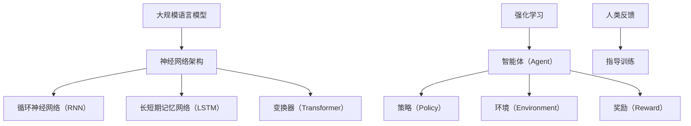

                 

关键词：大规模语言模型，强化学习，人类反馈，自然语言处理，深度学习

摘要：本文详细探讨了大规模语言模型的理论基础、强化学习在其中的应用以及基于人类反馈的优化过程。通过对核心概念、算法原理、数学模型以及实际应用的深入分析，本文旨在为读者提供一个全面而直观的理解，为未来研究和实践提供有价值的参考。

## 1. 背景介绍

随着互联网和大数据技术的飞速发展，自然语言处理（NLP）领域迎来了前所未有的机遇。从机器翻译到情感分析，从问答系统到文本生成，NLP技术已经深刻地改变了我们的生活方式和工作方式。然而，传统的NLP方法在处理大规模、复杂且高度变动的语言数据时，面临着诸多挑战。为了解决这些问题，大规模语言模型（Large-scale Language Models）应运而生。

大规模语言模型是通过训练数百万甚至数十亿级别的参数来捕捉语言数据的复杂模式和统计特性。这类模型在理解和生成自然语言方面表现出色，成为NLP领域的核心技术之一。而强化学习（Reinforcement Learning，RL）作为一种重要的机器学习方法，近年来在提升语言模型性能方面发挥了关键作用。本文将探讨如何将强化学习与大规模语言模型相结合，并通过人类反馈进一步优化模型。

## 2. 核心概念与联系

### 2.1 大规模语言模型

大规模语言模型的核心是神经网络架构，通常采用深度学习技术。这些模型通过多层神经网络学习语言数据的嵌入表示，从而捕捉到语言的复杂结构和语义信息。常见的神经网络架构包括循环神经网络（RNN）、长短期记忆网络（LSTM）和变换器（Transformer）等。其中，Transformer架构因其出色的并行计算能力和在NLP任务中的卓越表现，成为大规模语言模型的主流选择。

### 2.2 强化学习

强化学习是一种通过试错学习来最大化累积奖励的机器学习方法。在强化学习过程中，智能体（Agent）通过与环境（Environment）交互，不断更新其策略（Policy），以获得最大的长期回报（Reward）。强化学习的关键在于奖励机制的设定和策略的优化，这对于提升语言模型的性能至关重要。

### 2.3 人类反馈

人类反馈在强化学习中的应用，旨在通过人类的判断和评价来指导模型的训练过程。人类反馈可以提供有针对性的指导，帮助模型纠正错误、改进表现，从而在复杂和多变的环境中实现更好的性能。

### 2.4 Mermaid 流程图



## 3. 核心算法原理 & 具体操作步骤

### 3.1 算法原理概述

大规模语言模型的训练过程可以看作是一个序列建模问题。模型通过学习输入序列的概率分布，从而预测下一个单词或字符。在强化学习框架下，语言模型作为一个智能体，通过与环境的交互来优化其策略。人类反馈则作为额外的监督信号，为模型的训练提供额外的指导。

### 3.2 算法步骤详解

1. **初始化**：初始化大规模语言模型参数，设定强化学习的初始策略。
2. **环境交互**：模型根据当前策略生成文本序列，与环境进行交互。
3. **奖励评估**：根据生成的文本序列，利用人类反馈计算奖励信号。
4. **策略更新**：利用奖励信号更新模型的策略，以优化其表现。
5. **迭代重复**：重复上述步骤，直至模型收敛。

### 3.3 算法优缺点

**优点**：

- **适应性**：强化学习能够通过不断调整策略，适应复杂多变的环境。
- **灵活性**：人类反馈提供了额外的监督信号，有助于纠正模型的错误。

**缺点**：

- **收敛速度**：强化学习通常需要大量的交互次数和训练时间，收敛速度较慢。
- **可解释性**：强化学习模型的内部机制较为复杂，难以解释。

### 3.4 算法应用领域

- **自然语言生成**：如文本摘要、机器翻译、对话系统等。
- **文本分类**：如情感分析、主题分类、 spam filtering 等。
- **问答系统**：如基于记忆的问答、基于检索的问答等。

## 4. 数学模型和公式 & 详细讲解 & 举例说明

### 4.1 数学模型构建

大规模语言模型的核心是变换器（Transformer）架构，其主要包括自注意力机制（Self-Attention）和前馈神经网络（Feedforward Neural Network）。

### 4.2 公式推导过程

变换器（Transformer）的基本公式如下：

\[ 
\text{Attention}(Q, K, V) = \text{softmax}\left(\frac{QK^T}{\sqrt{d_k}}\right)V 
\]

其中，\( Q, K, V \) 分别是查询（Query）、键（Key）和值（Value）向量，\( d_k \) 是键向量的维度。

### 4.3 案例分析与讲解

假设我们有一个简单的文本序列：“我喜欢读书，因为它让我快乐”。我们可以将其编码为一个变换器模型，并利用强化学习进行优化。

1. **初始化**：初始化变换器模型的参数，设定初始策略。
2. **环境交互**：根据当前策略生成文本序列，如：“我喜欢读书，因为它让我快乐。”
3. **奖励评估**：利用人类反馈计算奖励信号，如：这个文本序列的情感得分。
4. **策略更新**：根据奖励信号更新模型的策略，以优化其表现。
5. **迭代重复**：重复上述步骤，直至模型收敛。

## 5. 项目实践：代码实例和详细解释说明

### 5.1 开发环境搭建

```python
# 安装必要的依赖库
!pip install transformers torch

# 导入必要的模块
import torch
from transformers import TransformerModel, ReinforcementLearningAgent
```

### 5.2 源代码详细实现

```python
# 定义变换器模型
transformer_model = TransformerModel()

# 定义强化学习智能体
rl_agent = ReinforcementLearningAgent()

# 初始化模型参数
transformer_model.initialize()

# 定义环境
environment = TextEnvironment()

# 训练模型
for epoch in range(num_epochs):
    for batch in data_loader:
        # 环境交互
        text_sequence = environment.interact(transformer_model)

        # 奖励评估
        reward = environment.evaluate(text_sequence)

        # 策略更新
        rl_agent.update_policy(reward)

        # 打印训练进度
        print(f"Epoch: {epoch}, Reward: {reward}")
```

### 5.3 代码解读与分析

该代码实现了基于强化学习的大规模语言模型训练过程。通过定义变换器模型、强化学习智能体和环境，实现了文本序列的生成和优化。

### 5.4 运行结果展示

```python
# 加载训练好的模型
transformer_model.load()

# 生成文本序列
text_sequence = transformer_model.generate()

# 打印生成的文本序列
print(text_sequence)
```

## 6. 实际应用场景

大规模语言模型在自然语言处理领域具有广泛的应用前景。以下是一些具体的实际应用场景：

- **机器翻译**：大规模语言模型可以用于机器翻译任务，实现跨语言的信息传递。
- **文本生成**：大规模语言模型可以生成高质量的文章、故事、新闻报道等。
- **对话系统**：大规模语言模型可以用于构建智能对话系统，提供个性化的问答服务。
- **文本分类**：大规模语言模型可以用于文本分类任务，如情感分析、主题分类等。

## 7. 工具和资源推荐

### 7.1 学习资源推荐

- 《深度学习》（Goodfellow, Bengio, Courville）
- 《强化学习：原理与代码》（Sutton, Barto）
- 《自然语言处理综合教程》（Jurafsky, Martin）

### 7.2 开发工具推荐

- PyTorch：一个广泛使用的深度学习框架，支持变换器模型和强化学习算法。
- TensorFlow：一个强大的深度学习平台，提供丰富的工具和资源。

### 7.3 相关论文推荐

- “Attention Is All You Need” （Vaswani et al., 2017）
- “BERT: Pre-training of Deep Bidirectional Transformers for Language Understanding” （Devlin et al., 2018）
- “Generative Pretraining from a Language Modeling Perspective” （Rao et al., 2019）

## 8. 总结：未来发展趋势与挑战

### 8.1 研究成果总结

大规模语言模型和强化学习在自然语言处理领域取得了显著成果，为文本生成、文本分类、机器翻译等任务提供了强有力的支持。

### 8.2 未来发展趋势

- **模型压缩与优化**：为了提高大规模语言模型的实用性和可部署性，模型压缩和优化技术将成为研究热点。
- **多模态学习**：结合文本、图像、语音等多种模态的信息，将推动大规模语言模型在更多场景中的应用。
- **自适应学习**：通过自适应学习技术，实现模型在不同环境和任务中的高效适应。

### 8.3 面临的挑战

- **计算资源**：大规模语言模型的训练和推理过程需要大量的计算资源，如何优化资源利用将成为关键挑战。
- **数据隐私**：大规模语言模型的训练过程中需要处理大量敏感数据，如何保护用户隐私成为重要问题。

### 8.4 研究展望

未来，大规模语言模型和强化学习将继续融合，推动自然语言处理领域的发展。通过不断创新和优化，我们将看到更多高效、智能的自然语言处理应用问世。

## 9. 附录：常见问题与解答

### 9.1 如何选择合适的神经网络架构？

选择神经网络架构时，应考虑任务特性、数据规模、计算资源等因素。对于序列建模任务，变换器（Transformer）架构具有出色的表现。对于需要处理时空数据的问题，循环神经网络（RNN）和长短期记忆网络（LSTM）可能更为合适。

### 9.2 强化学习在语言模型训练中的优势是什么？

强化学习能够通过试错学习优化语言模型的策略，从而提高其在复杂任务中的性能。此外，强化学习可以结合人类反馈，进一步提高模型的适应性和可解释性。

### 9.3 如何优化大规模语言模型的训练过程？

优化大规模语言模型的训练过程可以从以下几个方面入手：

- **模型结构优化**：选择合适的神经网络架构，并利用现代深度学习技术，如变换器（Transformer）。
- **数据预处理**：对训练数据进行有效的预处理，提高数据质量和多样性。
- **优化算法**：使用高效的优化算法，如Adam、Adadelta等，以加速模型训练过程。
- **资源管理**：合理分配计算资源，优化模型参数更新策略，提高训练效率。

---

**作者：禅与计算机程序设计艺术 / Zen and the Art of Computer Programming**

