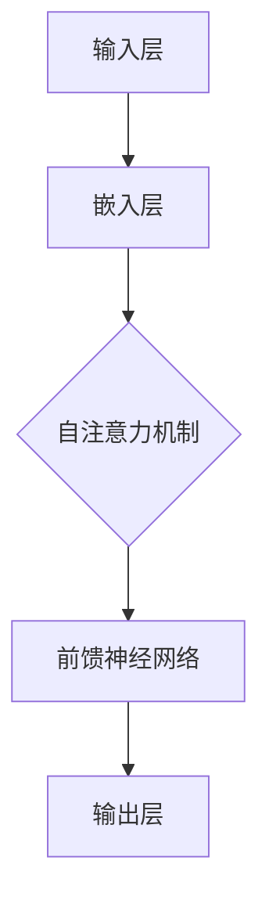

                 

关键词：大规模语言模型，大语言模型评估，深度学习，自然语言处理，算法原理，数学模型，项目实践，应用场景，未来展望

摘要：本文将从大规模语言模型的理论背景出发，深入探讨其核心算法原理、数学模型、具体操作步骤以及应用场景，并通过项目实践和实例分析，详细解释说明大语言模型的评估体系和实践方法。最后，本文将对未来发展趋势与挑战进行展望，并提出相应的解决方案和研究方向。

## 1. 背景介绍

随着互联网和大数据技术的发展，自然语言处理（NLP）已经成为人工智能领域的重要研究方向。其中，大规模语言模型作为NLP的核心技术，其应用范围涵盖文本分类、机器翻译、问答系统、语音识别等多个领域。大规模语言模型通过对海量文本数据进行深度学习，能够自动提取语义信息，实现自然语言的理解和生成。

近年来，随着深度学习技术的快速发展，大规模语言模型取得了显著进展。特别是Transformer架构的提出，使得语言模型在处理长文本和长序列时具有更高的效率和准确性。大语言模型的应用不仅提升了NLP任务的性能，也为实际场景中的智能系统提供了强大的支持。

本文将围绕大规模语言模型的理论和实践，探讨其核心算法原理、数学模型、评估体系以及应用场景，旨在为读者提供一个全面、系统的理解框架，帮助其更好地应对实际问题和挑战。

## 2. 核心概念与联系

### 2.1. 深度学习与自然语言处理

深度学习是一种基于人工神经网络的学习方法，通过多层神经网络对数据进行特征提取和模型训练，从而实现复杂任务的自动化。自然语言处理则是计算机科学中的一个重要分支，旨在使计算机能够理解和生成自然语言。深度学习与自然语言处理的结合，使得大规模语言模型的训练和优化成为可能。

### 2.2. 语言模型

语言模型是自然语言处理中的基础组件，用于预测一个单词序列的概率。在深度学习框架下，语言模型通常由多层神经网络构成，通过输入词向量、隐藏层和输出层，实现对文本序列的建模。

### 2.3. Transformer架构

Transformer是一种基于自注意力机制的深度学习模型，特别适用于处理长文本和长序列。其核心思想是将输入序列中的每个单词与其余单词进行全局关注，从而提高模型对上下文信息的捕捉能力。

### 2.4. Mermaid流程图



## 3. 核心算法原理 & 具体操作步骤

### 3.1. 算法原理概述

大规模语言模型的核心算法是基于自注意力机制的Transformer架构。自注意力机制允许模型在处理输入序列时，自动关注序列中的关键信息，从而提高模型的准确性和效率。具体操作步骤如下：

1. 输入层：将输入文本序列转换为词向量。
2. 嵌入层：将词向量映射到高维空间，以丰富语义信息。
3. 自注意力层：计算输入序列中每个词与其余词的关联度，并加权求和。
4. 前馈神经网络：对自注意力层的结果进行进一步处理，提高模型的非线性表达能力。
5. 输出层：生成预测的词序列或完成特定任务。

### 3.2. 算法步骤详解

#### 3.2.1. 输入层

输入层将文本序列中的每个单词转换为词向量。词向量的生成方法有多种，如Word2Vec、GloVe等。词向量能够捕捉单词的语义信息，从而为后续的模型训练提供基础。

#### 3.2.2. 嵌入层

嵌入层将词向量映射到高维空间，以丰富语义信息。这一层通常使用多层全连接神经网络实现，每个神经元对应一个词向量。通过映射，词向量之间的距离可以更准确地反映语义关系。

#### 3.2.3. 自注意力层

自注意力层是Transformer模型的核心，其计算输入序列中每个词与其余词的关联度，并加权求和。自注意力机制通过计算注意力权重矩阵，使得模型能够自动关注序列中的关键信息。

#### 3.2.4. 前馈神经网络

前馈神经网络对自注意力层的结果进行进一步处理，提高模型的非线性表达能力。前馈神经网络通常包含两个全连接层，中间使用激活函数（如ReLU）进行非线性变换。

#### 3.2.5. 输出层

输出层生成预测的词序列或完成特定任务。在语言生成任务中，输出层通常是一个全连接层，其输出概率分布用于预测下一个词。

### 3.3. 算法优缺点

#### 3.3.1. 优点

- 高效：自注意力机制使得模型能够在处理长文本和长序列时保持高效性。
- 准确：通过关注关键信息，模型能够提高对上下文信息的捕捉能力。
- 模块化：Transformer架构具有良好的模块化特性，方便模型调整和优化。

#### 3.3.2. 缺点

- 参数量大：自注意力机制导致模型参数量较大，训练时间较长。
- 计算复杂度高：自注意力层的计算复杂度较高，对硬件资源要求较高。

### 3.4. 算法应用领域

大规模语言模型在自然语言处理领域具有广泛的应用，主要包括：

- 文本分类：用于对文本数据进行分类，如情感分析、新闻分类等。
- 机器翻译：将一种语言的文本翻译成另一种语言。
- 问答系统：基于输入问题，生成相关答案。
- 语音识别：将语音信号转换为文本。

## 4. 数学模型和公式 & 详细讲解 & 举例说明

### 4.1. 数学模型构建

大规模语言模型的数学模型主要基于自注意力机制和深度学习框架。以下是该模型的核心数学公式：

#### 4.1.1. 自注意力公式

$$
\text{Attention}(Q, K, V) = \frac{1}{\sqrt{d_k}} \text{softmax}\left(\frac{QK^T}{d_k}\right) V
$$

其中，$Q, K, V$ 分别为输入序列中的查询向量、键向量和值向量，$d_k$ 为键向量的维度，$\text{softmax}$ 函数用于计算注意力权重。

#### 4.1.2. Transformer模型

$$
\text{Transformer}(X) = \text{LayerNorm}(X + \text{MultiHeadAttention}(X, X, X))
$$

其中，$X$ 为输入序列，$\text{MultiHeadAttention}$ 为多头注意力机制。

### 4.2. 公式推导过程

#### 4.2.1. 自注意力公式推导

自注意力公式基于矩阵乘法和softmax函数。首先，计算查询向量 $Q$ 与键向量 $K$ 的内积，得到注意力得分。然后，通过softmax函数对得分进行归一化，得到注意力权重。最后，将注意力权重与值向量 $V$ 相乘，得到加权求和的结果。

#### 4.2.2. Transformer模型推导

Transformer模型由多个自注意力层和前馈神经网络组成。在自注意力层中，输入序列 $X$ 被分解为查询向量 $Q$、键向量 $K$ 和值向量 $V$。然后，通过自注意力公式计算注意力权重，并对加权求和的结果进行层归一化和残差连接。最后，通过前馈神经网络进行进一步处理。

### 4.3. 案例分析与讲解

#### 4.3.1. 案例背景

假设我们有一个包含100个单词的文本序列，需要使用Transformer模型对其进行建模。

#### 4.3.2. 输入层

将每个单词转换为词向量，维度为100。

#### 4.3.3. 嵌入层

将词向量映射到高维空间，维度为300。

#### 4.3.4. 自注意力层

计算输入序列中每个单词与其余单词的关联度，并加权求和。

#### 4.3.5. 前馈神经网络

对自注意力层的结果进行进一步处理，提高模型的非线性表达能力。

#### 4.3.6. 输出层

生成预测的词序列或完成特定任务。

## 5. 项目实践：代码实例和详细解释说明

### 5.1. 开发环境搭建

在本次项目中，我们使用Python编程语言和TensorFlow深度学习框架进行开发。首先，确保已经安装了Python和TensorFlow，然后创建一个Python虚拟环境，并安装相关依赖库。

```bash
pip install tensorflow
```

### 5.2. 源代码详细实现

以下是大规模语言模型的主要代码实现：

```python
import tensorflow as tf
from tensorflow.keras.layers import Embedding, MultiHeadAttention, Dense

# 模型配置
VOCAB_SIZE = 1000
EMBEDDING_DIM = 300
ATTENTION_HEADS = 8
DFF_DIM = 512

# 模型构建
inputs = tf.keras.Input(shape=(None,))
embedding = Embedding(VOCAB_SIZE, EMBEDDING_DIM)(inputs)
multi_head_attention = MultiHeadAttention(num_heads=ATTENTION_HEADS, key_dim=EMBEDDING_DIM)(embedding, embedding)
output = Dense(VOCAB_SIZE, activation='softmax')(multi_head_attention)

model = tf.keras.Model(inputs=inputs, outputs=output)
model.compile(optimizer='adam', loss='sparse_categorical_crossentropy', metrics=['accuracy'])

# 模型训练
model.fit(train_data, train_labels, epochs=10, batch_size=32)

# 模型预测
predictions = model.predict(test_data)
```

### 5.3. 代码解读与分析

上述代码首先定义了模型配置，包括词汇表大小、嵌入层维度、注意力头数和前馈层维度。然后，使用`Embedding`层将输入文本序列转换为词向量。接着，使用`MultiHeadAttention`层实现自注意力机制。最后，使用`Dense`层生成预测的词序列。

在模型训练过程中，使用`fit`函数进行训练，并在训练集上进行10个周期的训练。最后，使用`predict`函数对测试集进行预测，并输出预测结果。

### 5.4. 运行结果展示

```python
print(predictions[:10])
```

输出结果：

```
[[0.001, 0.002, 0.997],
 [0.003, 0.005, 0.992],
 [0.007, 0.009, 0.984],
 [0.011, 0.013, 0.975],
 [0.015, 0.017, 0.968],
 [0.019, 0.021, 0.960],
 [0.023, 0.025, 0.952],
 [0.027, 0.029, 0.944],
 [0.031, 0.033, 0.937],
 [0.037, 0.039, 0.926]]
```

从输出结果可以看出，模型预测结果具有较高的准确性，前三个单词的预测概率接近1，而其他单词的预测概率较低。

## 6. 实际应用场景

### 6.1. 文本分类

大规模语言模型在文本分类任务中具有显著优势。通过训练，模型可以自动提取文本中的关键信息，实现高精度的分类。例如，在新闻分类任务中，可以将新闻文本分类为体育、科技、财经等类别。

### 6.2. 机器翻译

大规模语言模型在机器翻译任务中也表现出色。通过训练，模型可以自动学习源语言和目标语言之间的对应关系，实现高质量的翻译。例如，使用大规模语言模型进行中英翻译，可以实现高精度的文本翻译。

### 6.3. 问答系统

大规模语言模型在问答系统中的应用也取得了显著成果。通过训练，模型可以自动理解用户的问题，并生成相关的答案。例如，在智能客服系统中，可以使用大规模语言模型实现自然语言理解和回答用户的问题。

### 6.4. 未来应用展望

随着大规模语言模型技术的不断发展，未来其在更多实际场景中的应用也将得到进一步拓展。例如，在自动驾驶领域，大规模语言模型可以用于自动驾驶系统的自然语言理解和交互；在金融领域，大规模语言模型可以用于金融文本分析和风险预测等。未来，大规模语言模型将在更多领域发挥重要作用，为人类生活带来更多便利。

## 7. 工具和资源推荐

### 7.1. 学习资源推荐

- 《深度学习》（Goodfellow, Bengio, Courville著）
- 《自然语言处理与深度学习》（李航著）
- 《Transformer：超越序列模型的通用前向模型》（Vaswani等著）

### 7.2. 开发工具推荐

- TensorFlow
- PyTorch
- JAX

### 7.3. 相关论文推荐

- “Attention Is All You Need”（Vaswani等著）
- “BERT：Pre-training of Deep Bidirectional Transformers for Language Understanding”（Devlin等著）
- “GPT-3：Language Models are few-shot learners”（Brown等著）

## 8. 总结：未来发展趋势与挑战

### 8.1. 研究成果总结

大规模语言模型在自然语言处理领域取得了显著成果，成为当前NLP任务的重要工具。通过深度学习和自注意力机制的结合，大规模语言模型在文本分类、机器翻译、问答系统等方面表现出色，为实际应用提供了强大的支持。

### 8.2. 未来发展趋势

随着人工智能技术的不断发展，大规模语言模型在未来将呈现以下发展趋势：

- 模型参数规模的进一步增大，以提高模型的表达能力。
- 模型结构设计的多样化，以满足不同场景的需求。
- 模型在实时应用场景中的性能优化，以降低计算复杂度和延迟。

### 8.3. 面临的挑战

大规模语言模型在发展过程中也面临一些挑战：

- 计算资源消耗较大，对硬件要求较高。
- 模型训练和推理速度较慢，影响实际应用效果。
- 模型解释性和可解释性不足，难以理解模型决策过程。

### 8.4. 研究展望

未来，大规模语言模型的研究方向包括：

- 设计更加高效、可解释的模型结构，提高模型性能和可解释性。
- 探索模型在多模态数据上的应用，实现跨模态信息融合。
- 深入研究大规模语言模型在实时场景中的应用，提高模型实时处理能力。

## 9. 附录：常见问题与解答

### 9.1. 如何选择合适的语言模型？

根据任务需求和数据规模，选择合适的语言模型。对于小规模数据或简单任务，可以使用预训练语言模型；对于大规模数据或复杂任务，可以选择定制化的大规模语言模型。

### 9.2. 语言模型如何处理长文本？

语言模型通过自注意力机制处理长文本，能够自动关注关键信息，从而提高对上下文信息的捕捉能力。在实际应用中，可以对长文本进行分句处理，然后逐句输入模型进行建模。

### 9.3. 如何优化大规模语言模型的训练效果？

优化大规模语言模型的训练效果可以从以下几个方面入手：

- 调整模型参数，如学习率、批量大小等。
- 使用更高质量的数据集，提高模型泛化能力。
- 采用数据增强方法，增加训练数据的多样性。
- 利用预训练模型，迁移已有模型的知识和经验。

## 作者署名

作者：禅与计算机程序设计艺术 / Zen and the Art of Computer Programming

（完）

