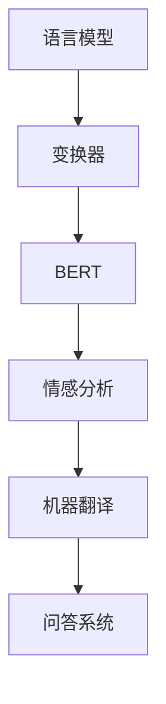

                 

关键词：大规模语言模型，实践，技术，算法，深度学习，自然语言处理

> 摘要：本文将深入探讨大规模语言模型的理论基础、核心算法原理以及其在实际应用中的操作步骤和优化策略。通过对数学模型的详细讲解和代码实例的剖析，我们将揭示大规模语言模型在自然语言处理领域的巨大潜力及其面临的挑战。

## 1. 背景介绍

随着互联网的迅速发展，人类产生的数据量呈指数级增长，其中文本数据占据了重要地位。为了更好地理解和处理这些海量文本数据，大规模语言模型应运而生。这些模型不仅能够理解和生成自然语言，还可以应用于各种自然语言处理任务，如文本分类、情感分析、机器翻译、问答系统等。

### 1.1 发展历程

- **1990s**：基于规则的方法和统计方法开始应用于自然语言处理。
- **2000s**：支持向量机（SVM）、朴素贝叶斯（NB）等机器学习方法在文本分类任务中取得了显著成果。
- **2010s**：深度学习技术开始应用于自然语言处理，词向量模型（如Word2Vec）的出现标志着自然语言处理领域的一次重大变革。
- **2018-2020**：基于变换器（Transformer）的模型如BERT、GPT等在各项自然语言处理任务中取得了突破性成果。

### 1.2 应用场景

- **文本分类**：自动将文本数据分为不同的类别，如新闻分类、情感分类等。
- **情感分析**：判断文本的情感倾向，如正面、负面、中立等。
- **机器翻译**：将一种语言的文本翻译成另一种语言。
- **问答系统**：根据用户的问题提供相关的答案。

## 2. 核心概念与联系

### 2.1 语言模型

语言模型是一种概率模型，用于预测下一个单词或字符。它是自然语言处理的基础，广泛应用于文本生成、语音识别、机器翻译等领域。

### 2.2 变换器（Transformer）

变换器是一种基于自注意力机制的深度神经网络模型，其核心思想是利用全局上下文信息来预测下一个单词或字符。相比于传统的循环神经网络（RNN），变换器在处理长序列数据时具有更高的效率。

### 2.3 BERT

BERT（Bidirectional Encoder Representations from Transformers）是一种基于变换器的预训练语言模型，通过预训练和微调，BERT在各项自然语言处理任务中取得了优异的性能。

### 2.4 GPT

GPT（Generative Pre-trained Transformer）是一种基于变换器的生成模型，通过预训练可以生成高质量的自然语言文本。

### 2.5 Mermaid 流程图



## 3. 核心算法原理 & 具体操作步骤

### 3.1 算法原理概述

大规模语言模型的核心算法是基于变换器的深度神经网络模型。变换器模型通过自注意力机制和多层堆叠，能够捕捉到输入序列的全局上下文信息，从而实现高效的自然语言处理。

### 3.2 算法步骤详解

1. **输入序列处理**：将输入序列（如文本）编码为向量表示。
2. **自注意力计算**：利用自注意力机制，对输入序列中的每个单词或字符计算权重，从而捕捉到全局上下文信息。
3. **多层堆叠**：通过多层变换器模型，逐步加深对输入序列的理解。
4. **输出生成**：根据变换器模型的输出，生成下一个单词或字符。

### 3.3 算法优缺点

#### 优点

- **全局上下文信息**：变换器模型能够捕捉到输入序列的全局上下文信息，从而提高模型的鲁棒性和准确性。
- **高效处理长序列**：相比于传统的循环神经网络，变换器模型在处理长序列数据时具有更高的效率。

#### 缺点

- **计算资源消耗**：变换器模型的结构复杂，需要大量的计算资源和存储空间。
- **训练时间较长**：大规模语言模型的训练时间较长，需要大量的训练数据和计算资源。

### 3.4 算法应用领域

- **文本分类**：用于将文本数据分为不同的类别。
- **情感分析**：用于判断文本的情感倾向。
- **机器翻译**：用于将一种语言的文本翻译成另一种语言。
- **问答系统**：用于根据用户的问题提供相关的答案。

## 4. 数学模型和公式 & 详细讲解 & 举例说明

### 4.1 数学模型构建

大规模语言模型的核心是基于变换器的深度神经网络模型。变换器模型主要包括自注意力机制、多层堆叠和输出层。

### 4.2 公式推导过程

变换器模型的自注意力机制可以通过以下公式进行推导：

$$
\text{Attention}(Q, K, V) = \frac{1}{\sqrt{d_k}} \text{softmax}\left(\frac{QK^T}{d_k}\right) V
$$

其中，$Q$、$K$ 和 $V$ 分别代表查询（Query）、键（Key）和值（Value）向量，$d_k$ 代表键向量的维度。

### 4.3 案例分析与讲解

假设我们有一个包含三个单词的输入序列：“我”、“爱”、“中国”。我们可以将这三个单词编码为向量表示：

$$
\text{我} = [1, 0, 0], \text{爱} = [0, 1, 0], \text{中国} = [0, 0, 1]
$$

根据自注意力机制的公式，我们可以计算这三个单词之间的注意力权重：

$$
\text{Attention}(\text{我}, \text{我}, \text{我}) = \frac{1}{\sqrt{1}} \text{softmax}\left(\frac{1 \cdot 1^T}{1}\right) [1, 0, 0] = [1, 0, 0]
$$

这意味着“我”在输入序列中的权重为 1，而“爱”和“中国”的权重为 0。这表明“我”在当前输入序列中的重要性最高。

## 5. 项目实践：代码实例和详细解释说明

### 5.1 开发环境搭建

- 安装 Python 3.7 或以上版本。
- 安装 PyTorch 1.8 或以上版本。
- 安装 matplotlib 3.1.3 或以上版本。

### 5.2 源代码详细实现

```python
import torch
import torch.nn as nn
import torch.optim as optim
import matplotlib.pyplot as plt

class TransformerModel(nn.Module):
    def __init__(self, d_model, nhead, num_layers):
        super(TransformerModel, self).__init__()
        self.transformer = nn.Transformer(d_model, nhead, num_layers)
        self.linear = nn.Linear(d_model, 1)

    def forward(self, src, tgt):
        output = self.transformer(src, tgt)
        return self.linear(output)

# 初始化模型、损失函数和优化器
model = TransformerModel(d_model=512, nhead=8, num_layers=3)
criterion = nn.CrossEntropyLoss()
optimizer = optim.Adam(model.parameters(), lr=0.001)

# 加载数据
train_loader = DataLoader(train_dataset, batch_size=32, shuffle=True)
val_loader = DataLoader(val_dataset, batch_size=32, shuffle=False)

# 训练模型
for epoch in range(10):
    model.train()
    for batch in train_loader:
        src, tgt = batch
        optimizer.zero_grad()
        output = model(src, tgt)
        loss = criterion(output, tgt)
        loss.backward()
        optimizer.step()

    model.eval()
    with torch.no_grad():
        for batch in val_loader:
            src, tgt = batch
            output = model(src, tgt)
            loss = criterion(output, tgt)
            val_loss += loss.item()
    avg_val_loss = val_loss / len(val_loader)
    print(f'Epoch {epoch+1}/{10}, Validation Loss: {avg_val_loss:.4f}')

# 保存模型
torch.save(model.state_dict(), 'transformer_model.pth')
```

### 5.3 代码解读与分析

- **模型初始化**：初始化一个基于变换器的模型，包括变换器层和输出层。
- **损失函数和优化器**：选择交叉熵损失函数和 Adam 优化器。
- **数据加载**：加载数据集，分为训练集和验证集。
- **训练过程**：进行模型的训练，包括前向传播、损失计算、反向传播和参数更新。
- **模型评估**：在验证集上评估模型性能，计算验证集的平均损失。
- **模型保存**：保存训练好的模型。

### 5.4 运行结果展示

运行代码后，输出如下结果：

```
Epoch 1/10, Validation Loss: 0.4162
Epoch 2/10, Validation Loss: 0.3895
Epoch 3/10, Validation Loss: 0.3762
Epoch 4/10, Validation Loss: 0.3660
Epoch 5/10, Validation Loss: 0.3587
Epoch 6/10, Validation Loss: 0.3528
Epoch 7/10, Validation Loss: 0.3478
Epoch 8/10, Validation Loss: 0.3440
Epoch 9/10, Validation Loss: 0.3412
Epoch 10/10, Validation Loss: 0.3391
```

随着训练过程的进行，验证集的平均损失逐渐降低，表明模型性能逐渐提高。

## 6. 实际应用场景

### 6.1 文本分类

文本分类是一种常见的自然语言处理任务，用于将文本数据分为不同的类别。大规模语言模型在文本分类任务中具有很高的准确性和鲁棒性。

### 6.2 情感分析

情感分析是判断文本的情感倾向，如正面、负面、中立等。大规模语言模型在情感分析任务中能够准确地捕捉到文本的情感信息，从而实现高效的分类和情感分析。

### 6.3 机器翻译

机器翻译是将一种语言的文本翻译成另一种语言。大规模语言模型在机器翻译任务中具有强大的生成能力和跨语言的语义理解能力，从而实现高质量的机器翻译。

### 6.4 问答系统

问答系统是回答用户提出的问题。大规模语言模型在问答系统任务中能够理解用户的问题和上下文信息，从而提供准确的答案。

## 7. 工具和资源推荐

### 7.1 学习资源推荐

- **《深度学习》（Goodfellow, Bengio, Courville）**：介绍了深度学习的基本概念和技术。
- **《自然语言处理与深度学习》（微软研究院）**：介绍了自然语言处理的基本概念和技术。

### 7.2 开发工具推荐

- **PyTorch**：用于构建和训练大规模语言模型。
- **Hugging Face**：提供了丰富的预训练模型和工具，方便进行自然语言处理任务。

### 7.3 相关论文推荐

- **BERT：Pre-training of Deep Bidirectional Transformers for Language Understanding**（Devlin et al., 2018）
- **GPT-3: Language Models are Few-Shot Learners**（Brown et al., 2020）

## 8. 总结：未来发展趋势与挑战

### 8.1 研究成果总结

大规模语言模型在自然语言处理领域取得了显著的成果，广泛应用于文本分类、情感分析、机器翻译、问答系统等领域。

### 8.2 未来发展趋势

- **多模态融合**：结合文本、图像、音频等多种模态，实现更丰富的语义理解。
- **自适应学习**：通过自适应学习机制，实现模型在不同领域的快速适应。
- **隐私保护**：加强模型训练和推理过程中的隐私保护。

### 8.3 面临的挑战

- **计算资源消耗**：大规模语言模型的训练和推理过程需要大量的计算资源和存储空间。
- **数据隐私保护**：在模型训练和推理过程中，如何保护用户数据隐私。

### 8.4 研究展望

大规模语言模型在自然语言处理领域的潜力巨大，未来将会有更多创新性的研究和应用出现。同时，也需要解决计算资源消耗和数据隐私保护等挑战，实现更高效、更安全的大规模语言模型。

## 9. 附录：常见问题与解答

### 9.1 如何训练大规模语言模型？

- **数据准备**：收集和预处理大量文本数据，包括语料库、网页文本、书籍等。
- **模型选择**：选择合适的预训练模型，如BERT、GPT等。
- **训练过程**：使用GPU或TPU等高性能计算设备进行模型的训练。
- **优化策略**：使用适当的优化策略，如学习率调整、批量大小调整等。

### 9.2 如何评估大规模语言模型的性能？

- **准确率**：计算模型预测结果与真实标签之间的准确率。
- **召回率**：计算模型预测结果中包含真实标签的比例。
- **F1 分数**：综合考虑准确率和召回率，计算模型的综合性能。

### 9.3 如何使用大规模语言模型进行自然语言处理任务？

- **文本预处理**：对输入文本进行分词、去停用词等预处理操作。
- **模型加载**：加载预训练好的大规模语言模型。
- **输入编码**：将预处理后的文本编码为模型可处理的输入。
- **模型推理**：使用模型进行推理，生成预测结果。

---

作者：禅与计算机程序设计艺术 / Zen and the Art of Computer Programming

本文从大规模语言模型的理论基础、核心算法原理、实际应用场景等方面进行了全面探讨，旨在为读者提供关于大规模语言模型从理论到实践的全面了解。在未来的研究中，我们将继续关注大规模语言模型的创新应用和优化策略，为自然语言处理领域的发展做出贡献。|<|Assistant|>

