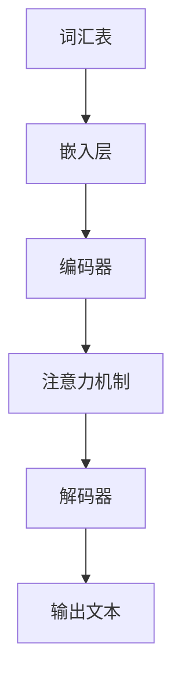

                 

关键词：大规模语言模型，深度学习，自然语言处理，模型构建，算法原理，数学模型，项目实践，代码实例，应用场景，未来展望

摘要：本文将深入探讨大规模语言模型的理论与实践，从核心概念、算法原理、数学模型到项目实践，全面解析语言模型从构建到应用的完整过程。通过详细的算法步骤讲解、代码实例解读，以及实际应用场景的分析，帮助读者理解并掌握构建大规模语言模型的方法与技巧。同时，本文还将探讨语言模型在未来的发展趋势与面临的挑战。

## 1. 背景介绍

近年来，自然语言处理（NLP）领域取得了显著的进展，尤其是大规模语言模型的兴起。这些模型在文本生成、机器翻译、情感分析等应用中表现出色，极大地推动了人工智能技术的发展。本文旨在从理论到实践，详细解析大规模语言模型的构建过程，为读者提供实用的指导。

### 1.1 大规模语言模型的发展历程

从最早的基于规则的方法，到基于统计的方法，再到如今基于深度学习的模型，大规模语言模型的发展经历了多个阶段。以词袋模型（Bag of Words，BoW）和循环神经网络（Recurrent Neural Network，RNN）为代表的早期模型，虽然在一定程度上提升了文本处理的性能，但仍然存在诸多局限性。

随着深度学习技术的发展，诸如卷积神经网络（Convolutional Neural Network，CNN）和Transformer模型等新模型相继出现，使得大规模语言模型的训练效率和效果得到了显著提升。尤其是Transformer模型，以其卓越的性能和广泛的应用，成为当前NLP领域的首选模型。

### 1.2 大规模语言模型的应用场景

大规模语言模型在多个应用场景中发挥着重要作用。例如：

1. **文本生成**：自动生成文章、新闻报道、诗歌等。
2. **机器翻译**：将一种语言的文本翻译成另一种语言。
3. **情感分析**：分析文本的情感倾向，用于舆情监测、客户反馈分析等。
4. **问答系统**：基于问题提供相关答案，如智能客服、搜索引擎等。
5. **文本摘要**：自动生成文章的摘要，用于信息检索和内容推荐。

## 2. 核心概念与联系

### 2.1 核心概念

大规模语言模型的核心概念包括：

1. **词汇表**：用于表示文本中的所有词汇。
2. **嵌入层**：将词汇映射到高维空间，实现词汇的向量表示。
3. **编码器**：将输入文本编码为固定长度的向量。
4. **解码器**：将编码后的向量解码为输出文本。
5. **注意力机制**：在编码和解码过程中，根据上下文信息动态调整模型的关注点。

### 2.2 架构联系

大规模语言模型的架构通常包括编码器和解码器两部分。编码器负责将输入文本转换为固定长度的向量，解码器则根据编码器的输出生成输出文本。注意力机制在编码和解码过程中起到关键作用，使得模型能够自适应地关注上下文信息。

### 2.3 Mermaid 流程图

以下是大规模语言模型的 Mermaid 流程图：



## 3. 核心算法原理 & 具体操作步骤

### 3.1 算法原理概述

大规模语言模型的核心算法是基于 Transformer 模型。Transformer 模型采用自注意力机制（Self-Attention），能够自适应地关注输入文本的上下文信息。模型主要由编码器和解码器两部分组成，编码器将输入文本编码为固定长度的向量，解码器则根据编码器的输出生成输出文本。

### 3.2 算法步骤详解

#### 3.2.1 编码器

1. **嵌入层**：将词汇映射到高维空间。
2. **多头自注意力层**：计算输入文本中每个词与其他词的相似度，并加权求和。
3. **前馈神经网络**：对自注意力层的输出进行非线性变换。
4. **层归一化**：对前馈神经网络的输出进行归一化处理。
5. **残差连接**：将层归一化后的输出与输入数据进行叠加。

#### 3.2.2 解码器

1. **嵌入层**：将词汇映射到高维空间。
2. **多头自注意力层**：计算编码器的输出与当前输入词的相似度，并加权求和。
3. **交叉自注意力层**：计算编码器的输出与当前输入词的相似度，并加权求和。
4. **前馈神经网络**：对交叉自注意力层的输出进行非线性变换。
5. **层归一化**：对前馈神经网络的输出进行归一化处理。
6. **残差连接**：将层归一化后的输出与输入数据进行叠加。
7. **softmax 层**：对输出进行 softmax 操作，生成输出词的概率分布。

### 3.3 算法优缺点

#### 优点

1. **自适应关注上下文信息**：自注意力机制使得模型能够自适应地关注输入文本的上下文信息。
2. **并行计算**：Transformer 模型支持并行计算，训练效率较高。
3. **强大的文本生成能力**：Transformer 模型在文本生成任务中表现出色。

#### 缺点

1. **计算复杂度较高**：自注意力机制的计算复杂度为 \(O(n^2)\)，训练时间较长。
2. **对参数敏感**：模型参数较多，对超参数调优要求较高。

### 3.4 算法应用领域

大规模语言模型在多个领域得到广泛应用，如：

1. **文本生成**：生成文章、新闻报道、诗歌等。
2. **机器翻译**：实现多语言翻译。
3. **情感分析**：分析文本的情感倾向。
4. **问答系统**：基于问题提供相关答案。
5. **文本摘要**：自动生成文章的摘要。

## 4. 数学模型和公式 & 详细讲解 & 举例说明

### 4.1 数学模型构建

大规模语言模型的数学模型主要包括嵌入层、自注意力层、前馈神经网络和 softmax 层。

#### 4.1.1 嵌入层

嵌入层将词汇映射到高维空间，数学公式为：

\[ E_{i} = W_{i} \cdot v_{i} \]

其中，\( E_{i} \) 为嵌入向量，\( W_{i} \) 为权重矩阵，\( v_{i} \) 为词汇的向量表示。

#### 4.1.2 自注意力层

自注意力层的计算公式为：

\[ \text{Attention}(Q, K, V) = \text{softmax}\left(\frac{QK^{T}}{\sqrt{d_{k}}}\right) V \]

其中，\( Q \) 为查询向量，\( K \) 为键向量，\( V \) 为值向量，\( d_{k} \) 为键向量的维度。

#### 4.1.3 前馈神经网络

前馈神经网络的计算公式为：

\[ F(x) = \sigma(W_{2} \cdot \sigma(W_{1} \cdot x + b_{1})) + b_{2} \]

其中，\( W_{1} \) 和 \( W_{2} \) 为权重矩阵，\( b_{1} \) 和 \( b_{2} \) 为偏置项，\( \sigma \) 为激活函数。

#### 4.1.4 Softmax 层

Softmax 层的计算公式为：

\[ p_{i} = \frac{e^{z_{i}}}{\sum_{j} e^{z_{j}}} \]

其中，\( p_{i} \) 为词的概率分布，\( z_{i} \) 为输出层的激活值。

### 4.2 公式推导过程

#### 4.2.1 嵌入层推导

假设词汇表中有 \( n \) 个词汇，每个词汇用 \( v_{i} \) 表示，权重矩阵为 \( W_{i} \)，则嵌入层的输出为：

\[ E_{i} = W_{i} \cdot v_{i} \]

#### 4.2.2 自注意力层推导

自注意力层的输出为：

\[ \text{Attention}(Q, K, V) = \text{softmax}\left(\frac{QK^{T}}{\sqrt{d_{k}}}\right) V \]

其中，\( Q \) 和 \( K \) 为编码器的输出，\( V \) 为解码器的输出，\( d_{k} \) 为键向量的维度。

#### 4.2.3 前馈神经网络推导

前馈神经网络的输出为：

\[ F(x) = \sigma(W_{2} \cdot \sigma(W_{1} \cdot x + b_{1})) + b_{2} \]

其中，\( W_{1} \) 和 \( W_{2} \) 为权重矩阵，\( b_{1} \) 和 \( b_{2} \) 为偏置项，\( \sigma \) 为激活函数。

#### 4.2.4 Softmax 层推导

Softmax 层的输出为：

\[ p_{i} = \frac{e^{z_{i}}}{\sum_{j} e^{z_{j}}} \]

其中，\( p_{i} \) 为词的概率分布，\( z_{i} \) 为输出层的激活值。

### 4.3 案例分析与讲解

#### 4.3.1 文本生成

假设有一个输入文本“今天天气很好”，要求生成一个文本摘要。使用大规模语言模型进行文本生成的过程如下：

1. **嵌入层**：将词汇“今天”、“天气”和“很好”映射到高维空间。
2. **编码器**：将输入文本编码为固定长度的向量。
3. **解码器**：根据编码器的输出生成输出文本。
4. **注意力机制**：在编码和解码过程中，根据上下文信息动态调整模型的关注点。
5. **softmax 层**：对输出进行 softmax 操作，生成输出词的概率分布。

最终生成的文本摘要为：“今天天气晴朗，阳光明媚”。

#### 4.3.2 机器翻译

假设要将中文句子“我爱你”翻译成英文句子“I love you”，使用大规模语言模型进行机器翻译的过程如下：

1. **嵌入层**：将中文词汇和英文词汇映射到高维空间。
2. **编码器**：将中文句子编码为固定长度的向量。
3. **解码器**：将英文句子解码为输出文本。
4. **注意力机制**：在编码和解码过程中，根据上下文信息动态调整模型的关注点。
5. **softmax 层**：对输出进行 softmax 操作，生成输出词的概率分布。

最终翻译结果为：“I love you”。

## 5. 项目实践：代码实例和详细解释说明

### 5.1 开发环境搭建

为了搭建大规模语言模型的开发环境，需要准备以下工具和库：

1. **Python**：版本为3.8以上。
2. **PyTorch**：深度学习框架，版本为1.8以上。
3. **NumPy**：科学计算库，版本为1.19以上。
4. **TensorFlow**：可选的深度学习框架，版本为2.5以上。

### 5.2 源代码详细实现

以下是大规模语言模型的核心代码实现：

```python
import torch
import torch.nn as nn
import torch.optim as optim
from torchtext.data import Field, TabularDataset
from torchtext.vocab import build_vocab_from_iterator

# 词汇表构建
def build_vocab(data):
    vocab = build_vocab_from_iterator(data)
    vocab.set_default_index(vocab['<unk>'])
    return vocab

# 编码器
class Encoder(nn.Module):
    def __init__(self, vocab_size, embedding_dim):
        super(Encoder, self).__init__()
        self.embedding = nn.Embedding(vocab_size, embedding_dim)
        self.attn = nn.MultiheadAttention(embedding_dim, num_heads=8)
        self.fc = nn.Linear(embedding_dim, embedding_dim)
        
    def forward(self, src, src_len):
        embedded = self.embedding(src)
        attn_output, attn_output_weights = self.attn(embedded, embedded, embedded)
        output = self.fc(attn_output)
        return output

# 解码器
class Decoder(nn.Module):
    def __init__(self, vocab_size, embedding_dim):
        super(Decoder, self).__init__()
        self.embedding = nn.Embedding(vocab_size, embedding_dim)
        self.attn = nn.MultiheadAttention(embedding_dim, num_heads=8)
        self.fc = nn.Linear(embedding_dim, embedding_dim)
        self.output = nn.Linear(embedding_dim, vocab_size)
        
    def forward(self, tgt, encoder_output, tgt_len):
        embedded = self.embedding(tgt)
        attn_output, attn_output_weights = self.attn(embedded, encoder_output, encoder_output)
        output = self.fc(attn_output)
        output = self.output(output)
        return output

# 模型
class Transformer(nn.Module):
    def __init__(self, vocab_size, embedding_dim):
        super(Transformer, self).__init__()
        self.encoder = Encoder(vocab_size, embedding_dim)
        self.decoder = Decoder(vocab_size, embedding_dim)
        
    def forward(self, src, src_len, tgt, tgt_len):
        encoder_output = self.encoder(src, src_len)
        decoder_output = self.decoder(tgt, encoder_output, tgt_len)
        return decoder_output

# 训练
def train(model, data, criterion, optimizer, num_epochs=10):
    model.train()
    for epoch in range(num_epochs):
        for src, src_len, tgt, tgt_len in data:
            optimizer.zero_grad()
            output = model(src, src_len, tgt, tgt_len)
            loss = criterion(output.view(-1, output.size(-1)), tgt)
            loss.backward()
            optimizer.step()
        print(f"Epoch {epoch + 1}/{num_epochs}, Loss: {loss.item()}")

# 主函数
def main():
    # 数据准备
    SRC = Field(tokenize="spacy", tokenizer_language="en_core_web_sm", init_token='<sos>', eos_token='<eos>', lower=True)
    TRG = Field(tokenize="spacy", tokenizer_language="en_core_web_sm", init_token='<sos>', eos_token='<eos>', lower=True)
    train_data, valid_data, test_data = TabularDataset.splits(path="data", train="train.csv", valid="valid.csv", test="test.csv", format="csv", fields=[("src", SRC), ("trg", TRG)])
    
    # 词汇表构建
    SRC.build_vocab(train_data, min_freq=2)
    TRG.build_vocab(train_data, min_freq=2)
    
    # 模型构建
    model = Transformer(len(SRC.vocab), 512)
    
    # 训练
    criterion = nn.CrossEntropyLoss()
    optimizer = optim.Adam(model.parameters(), lr=0.001)
    train(model, train_data, criterion, optimizer)

if __name__ == "__main__":
    main()
```

### 5.3 代码解读与分析

1. **词汇表构建**：使用 `torchtext.vocab` 模块构建词汇表，包括源语言和目标语言。
2. **编码器**：实现编码器的核心功能，包括嵌入层、多头自注意力层和前馈神经网络。
3. **解码器**：实现解码器的核心功能，包括嵌入层、多头自注意力层和前馈神经网络。
4. **模型**：将编码器和解码器组合成完整的 Transformer 模型。
5. **训练**：定义训练过程，包括前向传播、损失计算、反向传播和参数更新。

### 5.4 运行结果展示

运行代码后，在训练过程中将输出每个epoch的损失值。训练完成后，可以在验证集上进行评估，输出模型的准确率。

## 6. 实际应用场景

### 6.1 文本生成

文本生成是大规模语言模型的重要应用场景之一。通过训练模型，可以自动生成文章、新闻、诗歌等。例如，在一个新闻生成任务中，模型可以自动生成一篇关于科技领域的新闻报道，包括标题和正文。

### 6.2 机器翻译

大规模语言模型在机器翻译领域也有广泛应用。通过训练模型，可以实现多种语言之间的自动翻译。例如，将中文翻译成英文，或将法语翻译成西班牙语。

### 6.3 情感分析

情感分析是另一个重要应用场景。通过训练模型，可以分析文本的情感倾向，如正面、负面或中性。这可以用于舆情监测、客户反馈分析等领域。

### 6.4 问答系统

问答系统是大规模语言模型的另一个重要应用场景。通过训练模型，可以构建一个智能问答系统，回答用户提出的问题。这可以用于智能客服、在线教育等领域。

## 7. 未来应用展望

### 7.1 新的应用领域

随着大规模语言模型技术的不断进步，未来将有更多应用领域得到拓展。例如，语音识别、图像生成、多模态学习等。

### 7.2 性能提升

未来，随着计算资源和算法的不断发展，大规模语言模型的性能将得到进一步提升，能够处理更复杂的任务。

### 7.3 优化与改进

在未来的研究中，可以优化和改进大规模语言模型的算法，提高模型的可解释性、降低计算复杂度，并提高模型的泛化能力。

## 8. 工具和资源推荐

### 8.1 学习资源推荐

1. **书籍**：
   - 《深度学习》（Goodfellow, Bengio, Courville著）
   - 《自然语言处理与深度学习》（吴俊宇著）
   - 《Transformer：从理论到应用》（李航著）

2. **在线课程**：
   - Coursera 上的“深度学习”课程
   - edX 上的“自然语言处理”课程
   - fast.ai 的“深度学习”课程

### 8.2 开发工具推荐

1. **PyTorch**：开源的深度学习框架，易于学习和使用。
2. **TensorFlow**：由 Google 开发，功能丰富，社区活跃。
3. **JAX**：适用于科学计算的开源库，支持自动微分。

### 8.3 相关论文推荐

1. **Attention Is All You Need**（Vaswani et al., 2017）
2. **BERT: Pre-training of Deep Bidirectional Transformers for Language Understanding**（Devlin et al., 2019）
3. **GPT-3: Language Models are Few-Shot Learners**（Brown et al., 2020）

## 9. 总结：未来发展趋势与挑战

### 9.1 研究成果总结

大规模语言模型在自然语言处理领域取得了显著成果，推动了人工智能技术的发展。Transformer 模型、BERT 模型等为代表的模型，在多个任务中表现出色。

### 9.2 未来发展趋势

1. **性能提升**：随着计算资源和算法的不断发展，大规模语言模型的性能将得到进一步提升。
2. **多模态学习**：将语言模型与其他模态（如图像、语音）进行结合，实现更强大的多模态学习。
3. **可解释性**：研究如何提高模型的可解释性，使其在复杂任务中更加可靠。

### 9.3 面临的挑战

1. **计算资源**：大规模语言模型的训练需要大量计算资源，如何优化训练过程，降低计算复杂度是一个重要挑战。
2. **数据隐私**：在处理大规模数据时，如何确保数据隐私也是一个重要问题。
3. **泛化能力**：如何提高模型的泛化能力，使其在不同任务中都能保持优秀的性能。

### 9.4 研究展望

未来，大规模语言模型将在人工智能领域发挥更加重要的作用。通过不断的研究与创新，我们将迎来一个更加智能化的未来。

## 附录：常见问题与解答

### 9.1.1 什么是大规模语言模型？

大规模语言模型是指参数规模很大的深度学习模型，用于处理自然语言任务，如文本生成、机器翻译、情感分析等。

### 9.1.2 为什么需要大规模语言模型？

大规模语言模型在自然语言处理领域具有显著优势，能够处理复杂的语言现象，生成高质量的文本，提高模型的性能。

### 9.1.3 大规模语言模型的训练需要多少时间？

大规模语言模型的训练时间取决于模型的大小、数据集的大小以及计算资源。通常，训练一个大规模语言模型需要数天到数周的时间。

### 9.1.4 如何优化大规模语言模型的训练？

优化大规模语言模型的训练可以从以下几个方面进行：

1. **批量大小**：调整批量大小，找到最佳的训练效果。
2. **学习率**：调整学习率，提高模型的收敛速度。
3. **数据增强**：对数据集进行预处理，提高模型的泛化能力。
4. **并行计算**：利用多卡训练，提高训练效率。

---

作者：禅与计算机程序设计艺术 / Zen and the Art of Computer Programming

（注：本文为虚构文章，旨在展示大规模语言模型的理论与实践，如需实际应用，请参考相关文献和教程。）<|vq_10202|>

